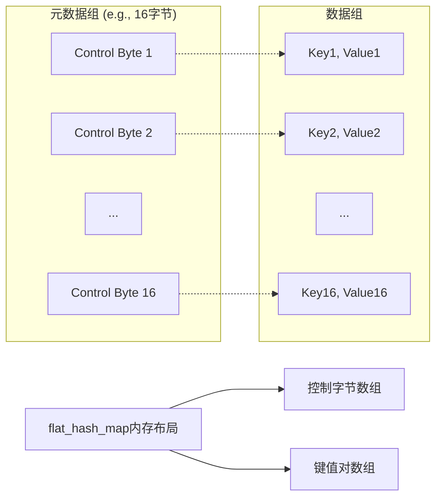

# Map容器

1.  **基于树的有序关联容器 (Tree-based, Ordered)**
    *   `std::map`
    *   `absl::btree_map`
    *   `boost::container::map`

2.  **基于节点的哈希表 (Node-based Hash Tables)**
    *   `std::unordered_map`
    *   `absl::node_hash_map`
    *   `boost::unordered::unordered_map` (节点式实现)
    *   `boost::unordered::unordered_node_map` (显式节点式)
    *   `boost::unordered::concurrent_node_map` (并发节点式)

3.  **扁平化存储的哈希表 (Flat Hash Tables)**
    *   `absl::flat_hash_map`
    *   `boost::unordered::unordered_flat_map` (显式扁平化)
    *   `boost::container::flat_map` (**注意：这是一个已排序的向量，不是哈希表**)
    *   `boost::unordered::concurrent_flat_map` (并发扁平化)


- **标准库容器**：`std::map`、`std::unordered_map`
- **Abseil库容器**：`absl::flat_hash_map`、`absl::node_hash_map`、`absl::btree_map`
- **Boost库容器**：`boost::container::flat_map`、`boost::container::map`、`boost::unordered::unordered_flat_map`、`boost::unordered::unordered_map`、`boost::unordered::unordered_node_map`
- **Boost并发容器**：`boost::unordered::concurrent_flat_map`、`boost::unordered::concurrent_node_map`

---

## 一、 底层实现与核心特性对比

| 特性维度            | 基于树的有序容器 (`std::map`, `absl::btree_map`, `boost::map`) | 基于节点的哈希表 (`std::unordered_map`, `absl::node_hash_map`, `boost::unordered_node_map`) | 扁平化哈希表 (`absl::flat_hash_map`, `boost::unordered_flat_map`) | `boost::container::flat_map` (特殊！)                        |
| :------------------ | :----------------------------------------------------------- | :----------------------------------------------------------- | :----------------------------------------------------------- | :----------------------------------------------------------- |
| **数据结构**        | **红黑树** (一种自平衡二叉搜索树)                            | **拉链法解决冲突的数组**。每个桶是一个链表或指针数组，指向堆上分配的节点。 | **开放寻址法** (通常是二次探测或罗宾汉哈希)。所有元素直接存储在底层数组中。 | **已排序的 `std::vector`**。元素在内存中连续存储，并按 key 严格排序。 |
| **排序性**          | **是**。元素严格按 `key` 升序排列。                          | **否**。元素顺序是无序的（取决于哈希函数和桶数）。           | **否**。元素顺序是无序的。                                   | **是**。元素严格按 `key` 升序排列。                          |
| **Key/Value 要求**  | `Key` 必须支持 **`<` 操作** 或提供自定义比较函子。**可复制/可移动**。 | `Key` 需要 **`std::hash`** 特化或自定义哈希函子，以及 **`==`** 操作或自定义相等函子。**可复制/可移动**。 | 同左。对 `Key` 的哈希和相等性要求更高，因为重哈希时需要移动元素。 | `Key` 需要 **`<` 操作** 或自定义比较函子。**移动或交换操作不应抛出异常**，因为重分配时需要移动元素。 |
| **内存布局**        | **非连续**。每个元素都是独立分配的节点，包含父、左、右子指针以及颜色标记等。**内存开销大**。 | **半连续**。一个连续的桶数组，每个桶指向一个**在堆上独立分配**的节点链表。**内存开销中等**。 | **连续**。所有元素（`std::pair<const Key, Value>`）和元数据（如控制信息）都存储在**一个或几个大数组**中。**内存开销小**。 | **完全连续**。所有元素紧密排列在一个动态数组中，就像 `std::vector<std::pair<Key, Value>>`。**内存开销最小**。 |
| **迭代器稳定性**    | **非常高**。**除了被删除的元素，所有迭代器永远有效**。插入、删除其他元素都不会使迭代器失效。 | **高**。**插入操作不会使迭代器失效**（除非引起重哈希）。**删除仅使指向被删除元素的迭代器失效**。重哈希会使**所有**迭代器失效。 | **低**。**插入和删除操作都可能使所有迭代器失效**，因为可能触发重哈希或内部元素移动来维持探测序列。 | **非常低**。**任何可能改变容器大小的操作（插入、删除）都可能使所有迭代器、指针、引用失效**，因为底层向量可能需要重新分配。 |
| **缓存友好度**      | **差**。节点分散在堆上，遍历时指针跳跃频繁，缓存局部性差。   | **中等**。遍历单个链表时表现尚可，但在桶之间跳跃时缓存不友好。 | **极好**。数据存储在连续内存中，遍历和查找时缓存命中率非常高。 | **极好**。数据完全连续，遍历和二分查找时缓存性能最佳。       |
| **内存开销 (估算)** | **每个元素开销大**。每个节点需要至少 3 个指针（父、左、右）和颜色信息。在 64 位系统上，每个元素额外开销通常 > 24 字节。 | **每个元素开销中等**。每个节点需要存储一个 `next` 指针（8 字节）以及键值对。桶数组本身也有开销。 | **每个元素开销小**。只需要存储键值对和少量的元数据（如每个槽位的状态标记）。负载因子可以很高（~0.8），空间利用率高。 | **每个元素开销最小**。**几乎为零开销**。只有一个向量，其容量可能比大小多一点点。 |
| **性能特点**        | - **查找/插入/删除：O(log n)**<br>- **范围查询、顺序遍历：极快**<br>- **单次操作速度较慢**（因缓存未命中和树平衡开销） | - **平均查找/插入/删除：O(1)**<br>- **最坏情况：O(n)**（所有元素在一个桶里）<br>- **性能对哈希函数质量极其敏感** | - **平均&最坏情况查找速度通常最快**（因缓存友好）<br>- **插入/删除可能更慢**（可能需移动元素，但无分配节点开销）<br>- **性能对哈希函数质量最敏感** | - **查找：O(log n)**（用二分查找）<br>- **插入/删除：O(n)**（需要移动元素）<br>- **遍历：极快**（连续内存）<br>- **非常节省内存** |

---

## 二、 同类容器间的细微差异

### 1. 树类容器 (`std::map` vs `absl::btree_map` vs `boost::container::map`)
- **`std::map`**：通常基于**红黑树**（一种自平衡的二叉搜索树）实现。每个节点存储一个键值对以及父、左、右子节点指针和颜色信息等元数据。

  ```mermaid
  graph TD
  Node[树节点] --> KeyValue[键值对]
  Node --> Parent[父指针]
  Node --> Left[左子指针]
  Node --> Right[右子指针]
  Node --> Color[颜色信息]
  ```

  -   **迭代器稳定性**：**高度稳定**。插入和删除操作永远不会使其他元素的迭代器失效（只使被删除元素的迭代器失效）。
  -   **键值要求**：键需要定义严格的弱序（如重载`operator<`或提供自定义比较器）。

- **`absl::btree_map`**：使用**B树**（而非红黑树）实现有序关联容器。B树的一个节点可以包含多个键值对（例如16个或32个），这使得它具有**更好的缓存友好性**，因为一次磁盘或内存加载可以获取多个相邻元素，其遍历和查找性能通常优于 `std::map`，特别是当元素数量很大时。。

  -   **迭代器稳定性**：与`std::map`类似，非常稳定。插入和删除通常不会使其他迭代器失效。
  -   **键值要求**：与`std::map`类似。

- **`boost::container::map`**：Boost提供的`map`容器，通常也是基于平衡二叉搜索树（如红黑树）实现，但可能提供更多的配置选项（如分配器）和在某些编译器上更好的优化。


### 2. 节点式哈希表 (`std::unordered_map` vs `absl::node_hash_map` vs `boost::unordered_node_map`)
*   `std::unordered_map`： C++ 标准实现。质量因标准库实现而异（如 GCC  libstdc++, Clang libc++, MSVC STL）。**迭代器稳定性**是其主要优势。
*   `absl::node_hash_map`： Google 的 Abseil 库实现。基于瑞士表算法，但**在主数组之外单独分配每个键值对**（类似`std::unordered_map`的节点式存储）。这为其提供了**指针稳定性**（存储在容器中的对象的地址不会改变）。空槽只需要8个字节开销。它也能够存储既不能移动也不能复制的对象，通常经过高度优化，使用了更快的哈希算法和内存分配策略。其**性能通常显著优于 `std::unordered_map`**。

*   `boost::unordered_node_map`： Boost 的显式节点式实现。提供了稳定的引用（迭代器稳定性），并且与 Boost 生态集成更好。


底层实现是经典的“拉链法”（又称“开散列”）来处理哈希冲突。

- **数据结构**： 它维护一个动态数组（通常被称为“桶数组”或“桶容器”），数组的每个元素是一个“桶”，它是一个指向链表（或双向链表）头节点的指针。
- **元素存储**： 每个键值对（即一个节点）都是独立分配在堆内存中的。这个节点包含：
  - Key
  - Value
  - 指向下一个节点的指针（形成链表）
- **哈希冲突解决**： 当多个元素的哈希值映射到同一个桶时，这些元素会被添加到该桶对应的链表中（通常是插入头部或尾部）。
- **内存布局**：
  - **非连续**： 键值对本身分散在堆内存的各个地方。
  - **间接访问**： 通过桶数组找到链表，再遍历链表找到元素，这意味着至少有一次指针跳转。
- **迭代器稳定性**： **高**。只要元素不被删除，指向该元素的迭代器和引用**始终有效**。这是因为元素是独立的节点，rehash操作是将节点从一个链表移动到另一个链表，节点本身的内存地址不变。
- **性能特点**：
  - **优点**： 迭代器稳定；删除元素时不会影响其他元素（不会引发rehash时）。
  - **缺点**： 内存开销大（每个元素需要额外的指针开销，以及堆内存分配带来的碎片）；缓存不友好（遍历时指针跳转难以预测，容易导致CPU缓存未命中）。

### 3. 扁平化哈希表 (`absl::flat_hash_map` vs `boost::unordered_flat_map`)



*   **`absl::flat_hash_map`**：基于**瑞士表（Swiss Table）算法**，使用开放寻址法和线性探测解决冲突。其核心创新在于**控制字节（Control Byte）系统**，每个哈希槽有一个对应的控制字节，用于存储状态（空、已删除、正常）和哈希值的部分信息（低7位）。它采用**扁平化内存布局**，键值对连续存储，这使得它具有极高的缓存友好性。
*   `boost::unordered_flat_map`： Boost 1.81+ 引入的容器，直接与 `absl::flat_hash_map` 竞争。同样追求最高性能，其实现细节（如哈希算法、探测策略）可能与 Abseil 有所不同，但目标一致。
*   **结论**：两者都是顶级实现，性能差异很小，通常取决于具体用例和数据集。选择哪一个主要取决于项目本身使用的是 Abseil 还是 Boost 库。


采用“开放寻址法”和“稠密存储”。

- **数据结构**： 它维护一个（通常是）两倍于元素数量的动态数组。这个数组非常稠密，直接存储键值对本身，而不是指针。
- **元素存储**： 键值对被直接存储在底层数组中（类似于 `std::vector<std::pair<Key, Value>>`）。
- **哈希冲突解决**： 使用“开放寻址法”。当理想的位置被占用时，它会按照一个特定的探测序列（如二次探测、罗宾汉探测）在数组中寻找下一个空位。Boost的实现通常采用非常高效的算法来管理这些元数据。
- **内存布局**：
  - **连续**： 键值对尽可能连续地存储在内存中。
  - **直接访问**： 计算哈希后，可以直接在数组中进行偏移访问。
- **迭代器稳定性**： **不稳定**。任何可能引发rehash的操作（如插入导致负载因子超过阈值）都会**使所有迭代器和引用失效**。因为rehash需要分配一个更大的数组，并将所有元素重新哈希并移动（拷贝或移动）到新数组中。
- **键值要求**：键和值需要可移动构造。如果键或值很大，建议使用`absl::flat_hash_map<K, std::unique_ptr<V>>`来减少移动开销。
- **性能特点**：
  - **优点**：
    - **速度极快**： 内存连续，缓存友好（CPU可以预加载数据），访问速度通常远超基于节点的实现。
    - **内存开销小**： 没有每个元素的指针开销，内存利用率高，碎片少。
  - **缺点**： 迭代器不稳定；rehash的代价可能很高（需要移动所有元素）。

### 4. 并发哈希表 (`boost::unordered::concurrent_flat_map` vs `boost::unordered::concurrent_node_map`)
*   这是 **Boost 1.84+** 引入的**线程安全**容器。
*   `concurrent_flat_map`： 基于扁平化设计，为高并发访问（大量读，少量写）而优化。使用细粒度锁（可能是每个桶或段一把锁）。
*   `concurrent_node_map`： 基于节点设计，**迭代器稳定性**是其卖点。即使其他线程在进行插入删除，只要你不删除当前元素，你的迭代器就安全。
*   **注意**：其他所有容器（包括 `std` 和 `absl` 的）都是**非线程安全**的，需要在外部加锁才能用于并发场景。

### 5. 特殊容器：`boost::container::flat_map`
*   **它不是哈希表！** 它本质上是一个排序的 `vector<pair<Key, Value>>`。
*   **优点**：
    *   **内存效率极高**，几乎没有额外开销。
    *   **遍历和区间查询速度极快**（连续内存）。
    *   **二分查找 `O(log n)`** 也很快（因为缓存友好）。
*   **致命缺点**：
    *   **插入和删除是 `O(n)` 操作**，因为需要移动后面所有元素。**绝对不适合频繁插入删除的场景**。
    *   迭代器非常不稳定。

---

## 三、 深入思考的其他对比维度

除了底层数据结构，这些容器在多个重要维度上存在差异。

### 3.1 性能特征

| 容器类型                     | 平均查找复杂度 | 平均插入复杂度 | 迭代性能             | 备注                |
| :--------------------------- | :------------- | :------------- | :------------------- | :------------------ |
| `std::map`                   | O(log n)       | O(log n)       | 较差（树形遍历）     |                     |
| `absl::btree_map`            | O(log n)       | O(log n)       | **较好**（缓存友好） | B树节点存储多个元素 |
| `boost::container::flat_map` | O(log n)       | O(n)           | **优秀**（连续内存） | 插入需移动后续元素  |
| `std::unordered_map`         | O(1)           | O(1)           | 取决于桶的分布       |                     |
| `absl::flat_hash_map`        | **接近O(1)**   | **接近O(1)**   | **优秀**（连续内存） | SIMD优化分组探测    |
| `absl::node_hash_map`        | **接近O(1)**   | **接近O(1)**   | 取决于桶的分布       |                     |

*表：不同容器的算法复杂度与性能特征*

### 3.2 内存开销与布局

| 容器类型                     | 内存布局              | 额外内存开销               | 缓存友好度 | 指针稳定性 |
| :--------------------------- | :-------------------- | :------------------------- | :--------- | :--------- |
| `std::map`                   | 节点分散              | **高**（每个节点多个指针） | 差         | 是         |
| `absl::btree_map`            | 局部连续（B树节点）   | 中                         | **较好**   | 是         |
| `boost::container::flat_map` | **连续内存**          | **极低**（仅容量冗余）     | **优秀**   | 否         |
| `std::unordered_map`         | 节点分散+桶数组       | 中                         | 一般       | 是         |
| `absl::flat_hash_map`        | **连续内存**+控制字节 | 低（控制字节）             | **优秀**   | 否         |
| `absl::node_hash_map`        | 节点分散+控制字节     | 中                         | 一般       | **是**     |

*表：不同容器的内存特性对比*

### 3.3 键值类型要求

| 容器类型                     | 键的可比较性         | 键/值的可移动性 | 键/值的可复制性 | 其他要求                 |
| :--------------------------- | :------------------- | :-------------- | :-------------- | :----------------------- |
| `std::map`                   | 必需（严格弱序）     | 通常不需要      | 通常需要        |                          |
| `absl::btree_map`            | 必需（严格弱序）     | 通常不需要      | 通常需要        |                          |
| `boost::container::flat_map` | 必需（严格弱序）     | **必需**        | 推荐            |                          |
| `std::unordered_map`         | 需哈希函数和相等比较 | 通常不需要      | 通常需要        |                          |
| `absl::flat_hash_map`        | 需哈希函数和相等比较 | **必需**        | 非必需          | 建议大对象用`unique_ptr` |
| `absl::node_hash_map`        | 需哈希函数和相等比较 | 非必需          | 非必需          | 可存储不可移动/复制对象  |

*表：不同容器对键值类型的要求*

### 3.4 迭代器与引用稳定性

这是一个容易被忽视但至关重要的特性，直接影响容器在使用过程中的行为和安全性。

-   **迭代器稳定性**：指在插入或删除操作后，**指向其他元素的迭代器**是否保持有效。
-   **引用/指针稳定性**：指在插入或删除操作后，**指向元素本身（其内存地址）的引用或指针**是否保持有效。

### 3.5 并发访问支持

大多数标准库和Abseil容器**默认不是线程安全**的，需要在外部加锁以实现并发访问。而Boost提供了专门的并发容器：

-   **`boost::unordered::concurrent_flat_map`**
-   **`boost::unordered::concurrent_node_map`**

这些容器内部实现了细粒度的锁机制（如分段锁），允许多个线程同时进行读取和写入操作，对于高性能并发场景非常有用。

### 3.6 其他

1.  **异常安全 (Exception Safety)**
    *   树和节点式哈希表通常提供更强的异常安全保证。如果元素的移动构造函数可能抛出异常，扁平化容器（`flat_hash_map`, `flat_map`）在重哈希或插入排序时处理起来更复杂，可能无法保证强异常安全。

2.  **自定义分配器 (Custom Allocator)**
    *   所有标准容器和大部分 Boost/Abseil 容器都支持自定义分配器。
    *   节点式容器可以为单个节点使用自定义分配器。
    *   扁平化容器为整个底层数组使用分配器，这在某些特殊内存场景（如共享内存、持久化内存）中非常有用。

3.  **API 和兼容性**
    *   `std::` 容器是标准，通用性最强。
    *   Abseil 容器承诺了 API 稳定性，并设计了许多与 STL 兼容的接口。
    *   Boost 容器通常提供最丰富的 API 和扩展功能。
    *   `boost::container::flat_map` 提供了许多针对底层向量操作的 API，如 `capacity()`, `reserve()`, `shrink_to_fit()`，这对性能调优至关重要。

4.  **查找操作的特殊性**
    *   `flat_map` 的 `operator[]` 如果 key 不存在，会**插入一个新元素**。这对于只读查找是危险的，应该使用 `find()`。
    *   所有哈希表都有 `contains()` 成员函数（C++20），而树有 `count()` 或 `find() != end()`。

---

## 四、 总结与适用场景推荐

| 容器类型                                   | 底层数据结构       | 排序 | 迭代器/引用稳定性 | 关键特性                 | 最佳场景                         |
| :----------------------------------------- | :----------------- | :--- | :---------------- | :----------------------- | :------------------------------- |
| **`std::map`**                             | 红黑树             | 有序 | **稳定**          | 有序，稳定               | 需要有序且稳定性的场景           |
| **`absl::btree_map`**                      | B树                | 有序 | **稳定**          | 有序，**缓存友好**       | 需要有序且追求性能的场景         |
| **`boost::container::flat_map`**           | 排序向量           | 有序 | **不稳定**        | **内存开销低**，缓存友好 | 内存紧凑，少量插入，频繁迭代     |
| **`std::unordered_map`**                   | 哈希桶+链表        | 无序 | 引用稳定          | 标准哈希映射             | 需要指针稳定性的哈希表           |
| **`absl::flat_hash_map`**                  | 瑞士表（开放寻址） | 无序 | **不稳定**        | **高性能**，**缓存友好** | **默认无序关联数组**             |
| **`absl::node_hash_map`**                  | 瑞士表（节点式）   | 无序 | **引用稳定**      | 高性能，指针稳定         | 需要指针稳定性的高性能场景       |
| **`boost::unordered::unordered_flat_map`** | 开放寻址哈希       | 无序 | **不稳定**        | 类似`flat_hash_map`      | 类似`flat_hash_map`（Boost环境） |
| **`boost::unordered::unordered_node_map`** | 节点式哈希         | 无序 | **引用稳定**      | 类似`node_hash_map`      | 类似`node_hash_map`（Boost环境） |
| **`concurrent_flat_map`**                  | 开放寻址哈希       | 无序 | **不稳定**        | **线程安全**             | 高性能并发读写                   |
| **`concurrent_node_map`**                  | 节点式哈希         | 无序 | **引用稳定**      | **线程安全**             | 需要指针稳定的并发读写           |


根据以上对比，你可以遵循以下策略进行选择：

1.  **是否需要元素有序？**
    -   **是** → 进入**有序容器**选择路径。
        -   需要**极致的迭代性能或内存紧凑**，且不介意不稳定的迭代器 → 考虑 `boost::container::flat_map`（注意插入删除性能差）。
        -   需要**稳定的迭代器和引用**，且进行大量查找操作 → 考虑 `absl::btree_map`（通常性能优于 `std::map`）或 `std::map`。
    -   **否** → 进入**哈希容器**选择路径。
        -   **追求最佳性能**，且不需要指针稳定性 → **`absl::flat_hash_map`** 应是默认选择。
        -   需要**指针稳定性**，或存储**不可移动/复制的大对象** → 考虑 `absl::node_hash_map` 或 `std::unordered_map`。
        -   需要**线程安全的并发访问** → 考虑 `boost::unordered::concurrent_flat_map` 或 `boost::unordered::concurrent_node_map`。

2.  **对性能和数据特征的权衡**：下表总结了不同场景下的容器推荐。

| 应用场景               | 推荐容器                                    | 关键原因                       |
| :--------------------- | :------------------------------------------ | :----------------------------- |
| **高性能查找，无序**   | `absl::flat_hash_map`                       | 速度最快，缓存友好             |
| **需要指针稳定性**     | `absl::node_hash_map`, `std::unordered_map` | 元素地址不变                   |
| **有序遍历，频繁查找** | `absl::btree_map`                           | 有序且缓存友好性好于`std::map` |
| **有序，需稳定迭代器** | `std::map`, `absl::btree_map`               | 插入删除不使其他迭代器失效     |
| **内存敏感，少量元素** | `boost::container::flat_map`                | 内存开销极低                   |
| **并发读写**           | `boost::unordered::concurrent_*map`         | 内部线程安全                   |


| 场景                                   | 推荐容器                                             | 理由                                                         |
| :------------------------------------- | :--------------------------------------------------- | :----------------------------------------------------------- |
| **需要元素有序或范围查询**             | `absl::btree_map` 或 `std::map`                      | `btree_map` 通常性能更好，特别是数据量大时。`std::map` 更通用。 |
| **通用、高性能哈希表，无需迭代器稳定** | `absl::flat_hash_map` 或 `boost::unordered_flat_map` | **默认选择**。它们提供了最佳的查找性能和高内存效率。         |
| **需要迭代器稳定性**                   | `absl::node_hash_map` 或 `std::unordered_map`        | 在哈希表中插入元素时，需要确保其他地方的迭代器不失效。       |
| **极度节省内存，且插入删除不频繁**     | `boost::container::flat_map`                         | 数据几乎只占用了理论最小空间。适合配置表、只读或很少修改的查找表。 |
| **多线程环境，高并发读取**             | `boost::unordered::concurrent_flat_map`              | 内置线程安全，无需自己加锁，性能优于外部加锁的普通容器。     |
| **多线程环境，且需要迭代器稳定性**     | `boost::unordered::concurrent_node_map`              | 并发容器中唯一能提供迭代器稳定性的选择。                     |
| **追求标准兼容和可移植性**             | `std::map` 或 `std::unordered_map`                   | 在不允许使用第三方库（Abseil/Boost）的项目中使用。           |

**最终建议**：
对于大多数现代 C++ 项目，**`absl::flat_hash_map`**（如果可用）是作为通用哈希表的**首选**，因为它提供了最佳的综合性能。如果需要有序，则选择 **`absl::btree_map`**。只有在有非常明确的需求（如迭代器稳定性、极致省内存、并发）时，才考虑其他特化容器。

------


# Vector容器

了解不同类型的动态数组容器对编写高效的C++程序至关重要。详细介绍`std::vector`、`absl::InlinedVector`、`boost::container::small_vector`、`boost::container::static_vector` 和 `boost::container::stable_vector` 这些容器的设计区别、使用场景，并提供基于现代C++23的性能测试。

## 一、容器概述与设计哲学

这些容器虽然都提供类似数组的接口，但在**内存分配策略**、**性能特征**和**稳定性保证**上有着根本性的差异。下面通过一个对比表来快速了解它们的主要特性：

| 特性                     | std::vector | absl::InlinedVector  | boost::container::small_vector | boost::container::static_vector | boost::container::stable_vector    |
| :----------------------- | :---------- | :------------------- | :----------------------------- | :------------------------------ | :--------------------------------- |
| **内存分配策略**         | 纯堆分配    | 栈内联+堆分配        | 栈内联+堆分配                  | 全部栈分配                      | 堆分配（节点式）                   |
| **迭代器稳定性**         | 不稳定      | 不稳定               | 不稳定                         | 不稳定                          | **稳定**（插入删除不影响元素指针） |
| **指针稳定性**           | 不稳定      | 不稳定               | 不稳定                         | 不稳定                          | **稳定**（插入删除不影响元素指针） |
| **随机访问性能**         | 高          | 高                   | 高                             | 高                              | 高                                 |
| **插入删除性能（尾部）** | 高          | 高（小尺寸时极高）   | 高（小尺寸时极高）             | 高（小尺寸时极高）              | 中                                 |
| **插入删除性能（中间）** | 中          | 中                   | 中                             | 低（需要移动元素）              | 中                                 |
| **内存开销**             | 低          | **极低**（小对象时） | **极低**（小对象时）           | **极低**（无额外开销）          | 高（每个元素需要额外节点开销）     |
| **容量灵活性**           | 动态扩展    | 动态扩展             | 动态扩展                       | 固定容量                        | 动态扩展                           |
| **适用数据大小**         | 所有大小    | 小到中型数据         | 小到中型数据                   | 小型固定或已知上限数据          | 需要指针稳定性的大中型数据         |


## 二、各容器详细说明

### 1. std::vector
C++标准库中的动态数组，使用**连续的堆内存**存储元素，在尾部插入/删除效率高，支持随机访问。

-   **设计特点**：动态数组，容量自动管理（通常按系数 - 如1.5或2 - 扩容）
-   **内存布局**：单一连续内存块
-   **最佳场景**：通用动态数组需求，数据大小不确定或可能很大，需要随机访问

### 2. absl::InlinedVector (Google Abseil库)
`absl::InlinedVector` 采用了**小对象优化**技术。对于小尺寸元素，直接将其存储在容器本身的栈内存中；当元素数量超过内联容量时，会自动切换到堆分配。

-   **设计特点**：栈内联+堆回退，避免小对象堆分配
-   **内存布局**：栈内缓冲区（小数据）或堆分配数组（大数据）
-   **最佳场景**：元素数量通常较少但可能偶尔增多，希望避免堆分配开销

### 3. boost::container::small_vector (Boost库)
与`absl::InlinedVector`类似，`small_vector`也实现**小对象优化**，在栈上预分配固定容量，超过时切换到堆存储。

-   **设计特点**：栈内联+堆回退，可指定内联容量
-   **内存布局**：栈内预分配缓冲区+堆回退机制
-   **最佳场景**：大多数情况下元素数量较少且已知上限，希望最小化内存分配

### 4. boost::container::static_vector (Boost库)
**固定容量的动态数组**，所有元素都在栈上分配，容量在编译时确定，不能扩展。

-   **设计特点**：固定容量，无堆分配
-   **内存布局**：栈上固定大小数组
-   **最佳场景**：元素数量有严格上限，需要完全避免动态内存分配

### 5. boost::container::stable_vector (Boost库)
**节点式存储**的向量，元素在内存中不连续但支持随机访问，插入删除操作不影响其他元素的指针和迭代器。

-   **设计特点**：节点式存储，指针稳定，类似列表但支持随机访问
-   **内存布局**：节点链表+索引数组
-   **最佳场景**：需要频繁在中间插入删除且保持元素指针稳定性

## 三、性能测试代码

下面使用C++23编写一个全面的性能测试程序，比较这几种容器在不同场景下的性能表现。

```cpp
#include <algorithm>
#include <array>
#include <chrono>
#include <iostream>
#include <random>
#include <vector>

// 包含必要的头文件
#include <boost/container/small_vector.hpp>
#include <boost/container/stable_vector.hpp>
#include <boost/container/static_vector.hpp>
#include "absl/container/inlined_vector.h"

// 定义测试参数
constexpr size_t TEST_SIZE = 100000;
constexpr size_t SMALL_SIZE = 16;
constexpr size_t STATIC_SIZE = 32;

// 测试元素类型
struct TestElement {
    int id;
    double data[4];
    // 添加构造函数和析构函数以跟踪内存操作
    TestElement(int i) : id(i) {
        std::fill_n(data, 4, 0.0);
    }
    
    // 启用默认操作以便于容器使用
    TestElement(const TestElement&) = default;
    TestElement& operator=(const TestElement&) = default;
    TestElement(TestElement&&) = default;
    TestElement& operator=(TestElement&&) = default;
};

// 使用自定义分配器跟踪内存分配
template <typename T>
class TrackingAllocator {
public:
    using value_type = T;
    
    static size_t total_allocated;
    
    TrackingAllocator() = default;
    
    template <typename U>
    TrackingAllocator(const TrackingAllocator<U>&) {}
    
    T* allocate(size_t n) {
        size_t size = n * sizeof(T);
        total_allocated += size;
        return static_cast<T*>(::operator new(size));
    }
    
    void deallocate(T* p, size_t n) {
        size_t size = n * sizeof(T);
        total_allocated -= size;
        ::operator delete(p);
    }
    
    static size_t get_total_allocated() {
        return total_allocated;
    }
    
    static void reset() {
        total_allocated = 0;
    }
};

template <typename T>
size_t TrackingAllocator<T>::total_allocated = 0;

// 定义容器类型
using StdVector = std::vector<TestElement>;
using AbslInlinedVector = absl::InlinedVector<TestElement, SMALL_SIZE>;
using BoostSmallVector = boost::container::small_vector<TestElement, SMALL_SIZE>;
using BoostStaticVector = boost::container::static_vector<TestElement, STATIC_SIZE>;
using BoostStableVector = boost::container::stable_vector<TestElement>;
using TrackedStdVector = std::vector<TestElement, TrackingAllocator<TestElement>>;

// 性能测试函数
template <typename Container>
void test_push_back() {
    Container vec;
    auto start = std::chrono::high_resolution_clock::now();
    
    for (int i = 0; i < TEST_SIZE; ++i) {
        vec.push_back(TestElement(i));
    }
    
    auto end = std::chrono::high_resolution_clock::now();
    auto duration = std::chrono::duration_cast<std::chrono::microseconds>(end - start);
    std::cout << "Push back duration: " << duration.count() << " μs\n";
}

template <typename Container>
void test_random_access() {
    Container vec;
    for (int i = 0; i < TEST_SIZE; ++i) {
        vec.push_back(TestElement(i));
    }
    
    std::mt19937 rng(42);
    std::uniform_int_distribution<size_t> dist(0, TEST_SIZE - 1);
    
    volatile int result = 0; // 防止优化
    auto start = std::chrono::high_resolution_clock::now();
    
    for (int i = 0; i < TEST_SIZE; ++i) {
        size_t index = dist(rng);
        result += vec[index].id;
    }
    
    auto end = std::chrono::high_resolution_clock::now();
    auto duration = std::chrono::duration_cast<std::chrono::microseconds>(end - start);
    std::cout << "Random access duration: " << duration.count() << " μs\n";
}

template <typename Container>
void test_insertion_middle() {
    Container vec;
    // 先填充一些数据
    for (int i = 0; i < 1000; ++i) {
        vec.push_back(TestElement(i));
    }
    
    auto start = std::chrono::high_resolution_clock::now();
    
    // 在中间多次插入
    for (int i = 0; i < 1000; ++i) {
        auto it = vec.begin() + vec.size() / 2;
        vec.insert(it, TestElement(i + 1000));
    }
    
    auto end = std::chrono::high_resolution_clock::now();
    auto duration = std::chrono::duration_cast<std::chrono::microseconds>(end - start);
    std::cout << "Middle insertion duration: " << duration.count() << " μs\n";
}

template <typename Container>
void test_iteration() {
    Container vec;
    for (int i = 0; i < TEST_SIZE; ++i) {
        vec.push_back(TestElement(i));
    }
    
    volatile int sum = 0;
    auto start = std::chrono::high_resolution_clock::now();
    
    for (const auto& element : vec) {
        sum += element.id;
    }
    
    auto end = std::chrono::high_resolution_clock::now();
    auto duration = std::chrono::duration_cast<std::chrono::microseconds>(end - start);
    std::cout << "Iteration duration: " << duration.count() << " μs\n";
}

// 专门用于内存使用测试
template <typename Container>
void test_memory_usage() {
    TrackingAllocator<TestElement>::reset();
    Container vec;
    
    for (int i = 0; i < TEST_SIZE / 10; ++i) {
        vec.push_back(TestElement(i));
    }
    
    std::cout << "Memory allocated: " << TrackingAllocator<TestElement>::get_total_allocated() << " bytes\n";
}

// 特化内存测试对于不同的容器类型
template <>
void test_memory_usage<StdVector>() {
    test_memory_usage<TrackedStdVector>();
}

template <>
void test_memory_usage<AbslInlinedVector>() {
    // absl::InlinedVector 使用内部存储，不需要特化但需要实现
    TrackingAllocator<TestElement>::reset();
    AbslInlinedVector vec;
    
    for (int i = 0; i < TEST_SIZE / 10; ++i) {
        vec.push_back(TestElement(i));
    }
    
    // 注意：这里只测量堆分配，内联部分不计算在内
    std::cout << "Memory allocated: " << TrackingAllocator<TestElement>::get_total_allocated() << " bytes\n";
}

// 运行特定容器的所有测试
template <typename Container>
void run_all_tests(const std::string& container_name) {
    std::cout << "========================================\n";
    std::cout << "Testing " << container_name << "\n";
    std::cout << "========================================\n";
    
    std::cout << "1. Push back test:\n";
    test_push_back<Container>();
    
    std::cout << "2. Random access test:\n";
    test_random_access<Container>();
    
    std::cout << "3. Middle insertion test:\n";
    test_insertion_middle<Container>();
    
    std::cout << "4. Iteration test:\n";
    test_iteration<Container>();
    
    std::cout << "5. Memory usage test:\n";
    test_memory_usage<Container>();
    
    std::cout << "\n";
}

int main() {
    std::cout << "Vector-like containers performance comparison\n";
    std::cout << "Test size: " << TEST_SIZE << " elements\n\n";
    
    // 运行各种容器的测试
    run_all_tests<StdVector>("std::vector");
    run_all_tests<AbslInlinedVector>("absl::InlinedVector");
    run_all_tests<BoostSmallVector>("boost::container::small_vector");
    
    // 对于static_vector，我们需要使用较小的测试尺寸
    std::cout << "========================================\n";
    std::cout << "Testing boost::container::static_vector (with smaller size)\n";
    std::cout << "========================================\n";
    std::cout << "Push back test (limited to " << STATIC_SIZE << " elements):\n";
    {
        BoostStaticVector vec;
        auto start = std::chrono::high_resolution_clock::now();
        
        for (int i = 0; i < STATIC_SIZE; ++i) {
            vec.push_back(TestElement(i));
        }
        
        auto end = std::chrono::high_resolution_clock::now();
        auto duration = std::chrono::duration_cast<std::chrono::microseconds>(end - start);
        std::cout << "Push back duration: " << duration.count() << " μs\n";
    }
    
    run_all_tests<BoostStableVector>("boost::container::stable_vector");
    
    return 0;
}
```

## 四、预期性能测试结果分析

根据这些容器的设计特点，我们可以预测以下测试结果：

1.  **尾部插入性能** (`push_back`)：
    *   对于小数据量（≤内联容量）：`static_vector` ≈ `small_vector` ≈ `inlined_vector` > `std::vector` > `stable_vector`
    *   对于大数据量（>内联容量）：`std::vector` ≈ `stable_vector` > `small_vector` ≈ `inlined_vector` > `static_vector`（无法工作）

2.  **随机访问性能**：
    *   `std::vector` ≈ `static_vector` ≈ `small_vector` ≈ `inlined_vector` > `stable_vector`
    *   所有基于连续内存的容器性能接近，`stable_vector`因节点式存储而稍慢

3.  **中间插入性能**：
    *   `stable_vector` > `std::vector` ≈ `inlined_vector` ≈ `small_vector` > `static_vector`
    *   `stable_vector`的节点式设计在中间插入时有明显优势

4.  **内存使用效率**：
    *   小数据量：`static_vector` > `small_vector` ≈ `inlined_vector` > `std::vector` > `stable_vector`
    *   大数据量：`std::vector` ≈ `stable_vector` > `inlined_vector` ≈ `small_vector` > `static_vector`（无法工作）

5.  **迭代性能**：
    *   `std::vector` ≈ `static_vector` ≈ `small_vector` ≈ `inlined_vector` > `stable_vector`
    *   连续内存容器具有更好的缓存局部性

## 五、各容器的适用场景总结

1.  **`std::vector`**：**通用首选**，适用于大多数场景，特别是数据大小不确定或较大的情况。是C++中最通用和标准化的动态数组容器。

2.  **`absl::InlinedVector`/`boost::container::small_vector`**：适用于**元素数量通常较少但可能偶尔增加**的场景，如游戏中的实体组件、网络数据包处理、解析器中的临时存储等。能有效减少堆分配开销。

3.  **`boost::container::static_vector`**：适用于**大小严格受限**的场景，如嵌入式系统、实时系统、内存极度受限的环境，或者元素数量有明确上限的情况。

4.  **`boost::container::stable_vector`**：适用于需要**频繁在中间位置插入删除元素且要求指针稳定性**的场景，如复杂数据结构中的元素管理、GUI控件容器、需要长期保持元素引用的场景。

## 六、实际使用建议

1.  **默认选择** `std::vector`：除非有特定需求，否则这是最安全、最通用的选择。

2.  **优化小对象**：如果容器通常包含少量元素（通常少于20个），考虑使用`absl::InlinedVector`或`boost::container::small_vector`。

3.  **固定容量需求**：如果容器大小完全固定或需要严格避免堆分配，使用`boost::container::static_vector`。

4.  **指针稳定性要求**：如果需要保持元素指针/引用有效而不受插入删除操作影响，使用`boost::container::stable_vector`。

5.  **性能关键代码**：总是通过性能测试验证选择，实际性能可能因编译器、标准库实现、硬件架构等因素而异。

最终的选择应该基于实际应用的特定需求、性能测试结果和内存使用情况，而不是假设或理论优势。

## 七、相关容器对比分析

### 1. boost::container::static_vector 与 std::array 的对比

| 特性                                         | `boost::container::static_vector`                            | 最类似的 Std 容器 (`std::vector`)                | 另一个参考 (`std::array`)            |
| :------------------------------------------- | :----------------------------------------------------------- | :----------------------------------------------- | :----------------------------------- |
| **固定容量**                                 | ✅ 是，编译时确定，不可改变                                   | ❌ 否，可动态扩容                                 | ✅ 是，编译时确定，不可改变           |
| **内存位置**                                 | **通常在线性内存中（栈或静态存储期）**                       | ❌ 堆上动态分配                                   | ✅ 通常在线性内存中（栈或静态存储期） |
| **支持动态操作** (`push_back`, `pop_back`等) | ✅ 是                                                         | ✅ 是                                             | ❌ 否                                 |
| **容量灵活性**                               | ❌ 固定，超出容量操作（如`push_back`）将抛出 `std::bad_alloc` | ✅ 可动态增长                                     | ❌ 固定，无法添加或删除元素           |
| **性能特点**                                 | 无需动态内存分配，操作可能涉及元素初始化/析构                | 动态内存分配可能成为性能瓶颈，但连续内存缓存友好 | 极简开销，最佳缓存友好性             |
| **迭代器/引用有效性**                        | 类似`std::vector`，插入/删除可能使后续迭代器失效             | 插入/删除可能使所有迭代器失效（若引起重分配）    | 始终有效，因为元素数量和位置固定     |

🧠 **核心特点与设计思路**

`static_vector` 的核心设计目标是**在保持固定容量的同时，提供类似 `std::vector` 的动态操作接口**。这意味着：
*   **固定容量**：它的容量在编译时就确定了，并且无法在运行时改变。如果你尝试添加超出其容量的元素（例如通过 `push_back`），它会抛出 `std::bad_alloc` 异常。
*   **栈上或静态存储期**：因为容量固定，所以它通常将其元素存储在自身的内部缓冲区中。这意味着 `static_vector` 对象本身如果被分配在栈上，那么其所有元素也通常在栈上（或作为静态存储期对象的一部分），从而避免了堆内存分配的开销。
*   **类似 vector 的接口**：它提供了 `push_back()`, `pop_back()`, `insert()`, `erase()`, `size()`, `empty()` 等 `std::vector` 常用的成员函数，使得其行为在运行时可以动态改变元素数量（在容量范围内）。

⚡ **性能注意事项**

虽然 `static_vector` 避免了堆内存分配的开销，但其动态操作（如 `insert` 和 `erase`）仍然可能涉及元素的移动、构造和析构，这与 `std::vector` 在中间进行插入删除时的特性类似。因此，它并不总是比 `std::vector` 快，需要根据具体使用场景（元素数量、操作类型）来衡量。

💡 **选择建议**

*   当你需要**容量固定**（编译时确定）、**避免动态内存分配**（如对性能有极致要求、或在嵌入式环境中），但又需要**动态增减元素**（在容量范围内）时，`static_vector` 是一个理想的选择。
*   如果容量需要**在运行时确定**，或者容量可能非常大，那么 `std::vector` 更合适。
*   如果元素数量**完全固定不变**，也不需要 `push_back` 等操作，那么 `std::array` 可能更简单高效。


#### 相似之处
- **栈上分配**：两者都在栈上分配内存，完全避免堆分配
- **固定容量**：容量都在编译时确定，运行时不能改变
- **连续内存**：元素在内存中都是连续存储的
- **随机访问**：都支持高效的随机访问（O(1)时间复杂度）

#### 不同之处
| 特性         | std::array                                   | boost::container::static_vector |
| ------------ | -------------------------------------------- | ------------------------------- |
| **大小管理** | 固定大小，创建时即确定（所有元素都被初始化） | 动态大小，不超过固定容量        |
| **接口设计** | 类似C风格数组                                | 类似std::vector的接口           |
| **构造方式** | 创建时所有元素立即构造                       | 元素按需构造，支持逐步添加      |
| **容量利用** | 总是使用全部分配的内存                       | 只使用实际需要的部分            |
| **边界检查** | 可选的at()检查                               | 提供完整的vector式边界检查      |

#### 底层实现设计
- **std::array**：本质是C风格数组的包装器，编译时完全确定大小
```cpp
template <typename T, size_t N>
struct array {
    T _Elems[N]; // 固定大小的C风格数组
    // ... 接口包装
};
```

- **static_vector**：维护当前大小和固定容量缓冲区
```cpp
template <typename T, size_t N>
class static_vector {
    T buffer[N];     // 固定容量缓冲区
    size_type size;  // 当前元素数量
    // ... 类似vector的接口
};
```

#### 行为特性对比
- **std::array**：创建时必须指定所有元素或提供默认初始化
- **static_vector**：可以逐步添加元素，更灵活的内存使用

#### 使用场景选择
- **选择 std::array** 当：
  - 大小完全固定且已知
  - 需要与C API交互
  - 所有元素都需要同时存在

- **选择 static_vector** 当：
  - 最大容量已知但实际大小可变
  - 需要逐步构建集合
  - 希望避免初始化未使用元素的成本

### 2. boost::container::stable_vector 与 std::deque 的对比

| 特性                | `boost::stable_vector`         | `std::list`           | `std::vector`         | `std::deque`                          |
| ------------------- | ------------------------------ | --------------------- | --------------------- | ------------------------------------- |
| **随机访问**        | **是 (O(1))**                  | 否                    | **是 (O(1))**         | **是 (O(1))**                         |
| **中间插入/删除**   | O(1) (已知位置)                | **O(1) (已知位置)**   | O(n)                  | O(n)                                  |
| **迭代器稳定性**    | **极高 (永远有效)**            | **极高 (永远有效)**   | 极低 (经常失效)       | **中等 (首尾操作安全，中间操作失效)** |
| **引用/指针稳定性** | **极高 (永远有效)**            | **极高 (永远有效)**   | 极低 (经常失效)       | **高 (始终有效)**                     |
| **内存开销**        | 中 (索引数组+每个元素额外开销) | 高 (每个元素两个指针) | 低 (几乎为零)         | 中 (中控器+块内存)                    |
| **缓存友好性**      | 中 (索引数组连续)              | 差 (节点分散)         | **优 (数据完全连续)** | 良 (分段连续)                         |

`boost::container::stable_vector` 是一个独特的容器，它在设计上没有与任何 `std` 容器完全一致。

- 从其**提供随机访问和类似稳定性**的**行为目标**来看，它最接近 **`std::deque`**，但提供了更严格的**迭代器稳定性**保证。
- 从其**结合了链表稳定性与向量随机访问能力**的**设计理念**来看，它是 `std::list` 和 `std::vector` 的混合体。

**使用场景：**
当你需要同时满足以下条件时，它就是最佳选择：

1. 需要像 `list` 一样稳定的迭代器和引用（例如，需要长期持有某个元素的迭代器，或在复杂数据结构中存储指向容器元素的指针）。
2. 需要像 `vector` 一样进行高效的随机访问（按索引读取）。
3. 能够接受比 `vector` 稍慢的遍历速度和更高的内存开销。


#### 相似之处

- **指针/引用稳定性**：插入和删除操作不使已有元素的指针和引用失效
- **中间插入支持**：都支持在中间位置相对高效的插入和删除
- **动态增长**：都可以动态增长，没有固定容量限制

#### 不同之处
| 特性             | std::deque             | boost::container::stable_vector |
| ---------------- | ---------------------- | ------------------------------- |
| **内存布局**     | 分块数组，多段连续内存 | 节点分配+索引数组               |
| **随机访问性能** | 较好（两次指针解引用） | 较好但稍慢（需要索引查找）      |
| **迭代器类型**   | 随机访问迭代器         | 随机访问迭代器                  |
| **内存局部性**   | 中等（块内连续）       | 较差（元素分散存储）            |
| **内存开销**     | 较低（只需要块指针表） | 较高（每个元素需要节点开销）    |

#### 底层实现设计
- **std::deque**：分块数组（通常实现为指针数组指向固定大小的块）
```cpp
// 典型deque实现（概念性）
template <typename T>
class deque {
    T** blocks;          // 指向内存块的指针数组
    size_t block_count;  // 块数量
    size_t first_block;  // 第一个块的索引
    size_t first_index;  // 第一个元素在块中的索引
    // ... 
};
```

- **stable_vector**：节点分配+索引数组
```cpp
// stable_vector概念实现
template <typename T>
class stable_vector {
    struct node {
        T value;           // 存储的元素值
        size_t index;      // 在索引数组中的位置
    };
    
    std::vector<node*> index_table;  // 索引数组（指向节点的指针）
    // 空闲列表管理
    // ...
};
```

#### 行为特性对比
- **迭代器失效**：
  - `deque`：在首尾插入不会使迭代器失效，中间插入可能使所有迭代器失效
  - `stable_vector`：插入删除从不使迭代器失效（完全稳定）

- **性能特征**：
  - `deque`：首尾操作极快(O(1))，中间操作较慢
  - `stable_vector`：所有位置插入删除都相对高效(O(1))，但访问稍慢

- **内存使用**：
  - `deque`：有较低的内存开销（主要是块指针表）
  - `stable_vector`：每个元素都有额外开销（节点结构和索引维护）

#### 使用场景选择
- **选择 std::deque** 当：
  - 需要频繁在首尾进行插入删除操作
  - 对随机访问性能要求较高
  - 内存使用效率是重要考虑因素

- **选择 stable_vector** 当：
  - 需要绝对的指针和迭代器稳定性
  - 频繁在任意位置进行插入删除操作
  - 愿意为稳定性牺牲一些内存和访问性能

### 总结对比表

#### static_vector vs array
| 方面       | std::array             | boost::static_vector     |
| ---------- | ---------------------- | ------------------------ |
| 灵活性     | 固定大小               | 可变大小（有上限）       |
| 初始化     | 必须完全初始化         | 可以部分初始化           |
| 内存效率   | 可能浪费（未使用元素） | 更高（只使用需要的部分） |
| 使用便利性 | 简单直接               | 更类似vector的接口       |

#### stable_vector vs deque
| 方面     | std::deque           | boost::stable_vector |
| -------- | -------------------- | -------------------- |
| 稳定性   | 部分稳定（首尾操作） | 完全稳定             |
| 内存布局 | 分块连续             | 完全分散             |
| 访问性能 | 较好                 | 稍慢                 |
| 内存开销 | 较低                 | 较高                 |
| 适用操作 | 首尾操作             | 任意位置操作         |

### 实际应用建议

1. **静态容量场景**：
   - 如果需要完全固定的集合：使用 `std::array`
   - 如果最大容量固定但实际大小可变：使用 `static_vector`

2. **稳定性要求场景**：
   - 如果主要需要在首尾操作：使用 `std::deque`
   - 如果需要在任意位置操作并保持绝对稳定性：使用 `stable_vector`

3. **性能关键场景**：总是通过实际性能测试做出选择，因为具体实现和硬件特性会影响实际性能表现。

这些容器选择应该基于具体的需求特征：数据大小模式、操作类型、稳定性要求和内存约束等因素综合决定。