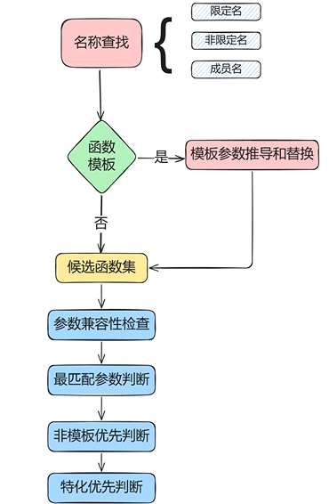

# 一、关键字

# (1) [`restrict`](https://cppreference.cn/w/c/language/restrict)

**在 ISO C++ 标准中，** `restrict` 是一个源自 C 语言（从 C99 标准开始）的关键字。

然而，主流的 C++ 编译器都提供了功能等价的、非标准的扩展来满足这一需求。因此，这个问题通常是在“如何使用 C++ 实现 C 中 `restrict` 的效果”的语境下被讨论的。

---

## 1. `restrict` 的核心思想与作用

`restrict` 是一个指针限定符（type qualifier）。它向编译器做出一个**承诺**：在该指针的生命周期内，**只有它本身（或者直接由它衍生的指针，如 `p+1`）是用于访问其所指向内存区域的唯一方式**。

换句话说，它告诉编译器：“我指向的这块内存，不会有其他任何指针来‘捣乱’（进行读写操作）。你可以放心地针对这一点进行激进的优化。”

**主要作用：解决指针别名问题，启用编译器优化。**

*   **指针别名**：指两块或多块不同的指针指向（或重叠于）同一片内存区域。
*   **问题所在**：当编译器看到通过指针 `a` 写内存，又通过指针 `b` 读内存时，由于无法确定 `a` 和 `b` 是否指向同一位置（即是否存在别名），编译器必须保守地假设它们**可能**指向同一位置。这意味着它不能将读写操作的顺序进行重排优化，也不能将变量缓存在寄存器中，必须频繁地、按代码顺序写回内存，导致性能下降。
*   **`restrict` 的解决方案**：程序员通过 `restrict` 关键字向编译器保证“**我承诺这两个指针不会指向重叠的内存！**”。编译器信任这个承诺，从而可以生成更高效的代码。

---

## 2. C++ 中的等价物（编译器扩展）

由于 C++ 标准没有定义 `restrict`，各大编译器提供了自己的版本：

1.  **GCC / Clang**: 使用 `__restrict__` 或 `__restrict`
2.  **Microsoft Visual C++**: 使用 `__restrict`

从 C++11 开始，你也可以考虑使用标准属性 **`[[gnu::restrict]]`**，但这仍然是编译器相关的，其可移植性依赖于其他编译器是否也选择支持这个 GNU 属性。

---

## 3. 代码示例：对比有无 `restrict` 的区别

让我们看一个经典的例子：计算两个向量的点积。

### 示例 1：没有使用 `restrict`（保守编译）

```cpp
void dot_product(const double* a, const double* b, double* result, size_t n) {
    double sum = 0.0;
    for (size_t i = 0; i < n; ++i) {
        sum += a[i] * b[i];
    }
    *result = sum;
}

// 调用示例
double arr1[1000] = {...};
double arr2[1000] = {...};
double res;

dot_product(arr1, arr2, &res, 1000); // 标准情况，没问题
// 但是，如果出现下面这种调用呢？
// dot_product(arr1, arr1, &res, 1000); // a 和 b 是同一个数组！存在别名！
```
**编译器视角**：编译器看到 `a[i]` 和 `b[i]` 的读写操作。它必须考虑最坏情况——`a` 和 `b` 可能指向同一数组（甚至是 `result` 可能指向 `a` 或 `b` 的某个元素）。因此，它不敢做任何激进的优化：
*   不能在循环开始前将 `a[i]` 和 `b[i]` 提前加载到寄存器。
*   每次写入 `sum` 后，必须确保内存中的值是最新的，因为 `a` 或 `b` 可能会修改 `sum` 所在的内存（虽然这个例子中不会，但编译器不知道）。
*   循环无法被充分向量化（SIMD）。

### 示例 2：使用 `__restrict__`（允许激进优化）

```cpp
// 使用 GCC/Clang 的扩展
void dot_product_optimized(const double* __restrict__ a,
                          const double* __restrict__ b,
                          double* __restrict__ result,
                          size_t n) {
    double sum = 0.0;
    for (size_t i = 0; i < n; ++i) {
        sum += a[i] * b[i];
    }
    *result = sum;
}
```
**编译器视角**：程序员已经用 `__restrict__` 承诺了 `a`、`b`、`result` 这三者指向的内存绝无重叠。编译器可以放心大胆地优化：
*   **循环展开和向量化**：编译器可以使用 SSE/AVX 指令一次处理 4 个或 8 个 double 值，极大提升性能。
*   **寄存器缓存**：可以将 `a[i]` 和 `b[i]` 的值长时间保留在 CPU 寄存器中，减少访问内存的次数。
*   **指令重排**：可以重新安排计算顺序以更好地利用 CPU 的流水线。

**生成的汇编代码差异**：如果你在编译器资源管理器（如 [Compiler Explorer](https://godbolt.org/)）上对比这两个函数，会发现 `dot_product_optimized` 的汇编代码中包含了 `vmulpd`、`vaddpd` 等 SIMD 指令，而第一个函数则可能是一串冗长而保守的标量指令。

### **非常重要的警告**

使用 `restrict` 是在和编译器做一个**契约**。如果你违背了这个契约（即指针确实存在别名），将会导致**未定义行为**。程序可能会产生错误的结果，甚至崩溃。

```cpp
double my_array[10] = {...};

// 这是错误的！违背了 restrict 承诺！
dot_product_optimized(my_array, my_array, &some_result, 10);
```
上面的错误调用会导致未定义行为，因为 `a` 和 `b` 都被限定为 `__restrict__`，但它们明显指向了同一块内存。

---

## 4. 常见应用场景

`restrict` 主要用于对性能有极致要求的底层代码中：

1.  **数值计算库**：如 BLAS、LAPACK 或其衍生库（如 Eigen、Armadillo）。矩阵和向量运算函数是使用 `restrict` 的绝佳场合。
2.  **图像/音频处理**：处理像素缓冲区或音频采样时，不同的缓冲区（如 RGB 通道）通常是不重叠的。
3.  **编译器自身和标准库实现**：在实现 `memcpy`、`memmove` 等函数时，`memcpy` 的源和目的指针被假定为不重叠（所以可以用 `restrict` 来优化），而 `memmove` 则必须处理重叠情况。
4.  **游戏引擎和物理仿真**：大量的 3D 向量、四元数、矩阵运算。
5.  **任何处理大型数组且循环密集的算法**。

## 5. 标准库提供——[std::valarray](./numeric.md)

## 总结

| 特性             | 描述                                                         |
| :--------------- | :----------------------------------------------------------- |
| **本质**         | 一个向编译器做出的关于指针无别名的**承诺**，用于启用优化。   |
| **C++ 中的状态** | **非标准**。但所有主流编译器都通过扩展提供支持：GCC/Clang 的 `__restrict__`，MSVC 的 `__restrict`。 |
| **好处**         | 允许编译器进行激进的优化，如循环向量化、指令重排、寄存器缓存，从而大幅提升性能。 |
| **风险**         | 如果违背承诺（指针实际存在别名），会导致**未定义行为**，是程序中的一个严重错误。 |
| **适用场景**     | 性能至关重要的底层计算库、数据处理、媒体处理等，处理大型非重叠数据块的循环。 |

**使用建议**：
*   只在性能分析（Profiling）确定瓶颈后再考虑使用。
*   仅在你能 100% 确定指针绝无别名时使用。
*   在函数注释中明确写明指针不能重叠的约定。
*   注意其编译器相关的特性，如果追求可移植性，可能需要用宏来包装不同编译器的关键字。

# (2) [`inline`](https://cppreference.cn/w/cpp/language/inline)

## 1. 内联命名空间（C++20）

在C++中，`inline`关键字用于命名空间是C++11引入的特性，它允许将内联命名空间中的内容视为其父命名空间的一部分。这主要用于版本控制和ABI兼容性。

## 作用与用途

1. **版本控制**：允许库开发者提供多个版本API，同时保持向后兼容
2. **透明嵌套**：内联命名空间中的成员可以直接被父命名空间访问
3. **ABI兼容性**：帮助管理不同版本的二进制接口

## 示例代码

```cpp
#include <iostream>
#include <string>

// C++ 20起支持简化写法
// 模拟一个反射库的不同版本
namespace reflect::inline v1_2_5 {
    void serialize(const std::string& data) {
        std::cout << "使用v1.2.5序列化: " << data << std::endl;
    }
    
    std::string deserialize() {
        return "v1.2.5反序列化数据";
    }
}

namespace reflect::v1_2_4 {
    void serialize(const std::string& data) {
        std::cout << "使用v1.2.4序列化: " << data << std::endl;
    }
    
    std::string deserialize() {
        return "v1.2.4反序列化数据";
    }
}

int main() {
    // 可以直接使用 reflect:: 访问内联命名空间中的内容
    reflect::serialize("测试数据");
    std::cout << reflect::deserialize() << std::endl;
    
    // 如果需要使用旧版本，需要明确指定版本
    reflect::v1_2_4::serialize("测试数据");
    std::cout << reflect::v1_2_4::deserialize() << std::endl;
    
    return 0;
}
```

## 更完整的示例

```cpp
#include <iostream>
#include <string>

// 主命名空间
namespace reflect {
    // 内联命名空间 - 当前默认版本
    inline namespace v1_2_5 {
        class Serializer {
        public:
            virtual void serialize(const std::string& data) {
                std::cout << "v1.2.5序列化: " << data << std::endl;
            }
            
            virtual std::string deserialize() {
                return "v1.2.5反序列化数据";
            }
        };
    }
    
    // 旧版本命名空间
    namespace v1_2_4 {
        class Serializer {
        public:
            void serialize(const std::string& data) {
                std::cout << "v1.2.4序列化: " << data << std::endl;
            }
            
            std::string deserialize() {
                return "v1.2.4反序列化数据";
            }
        };
    }
    
    // 新版本命名空间（尚未设为内联）
    namespace v2_0_0 {
        class Serializer {
        public:
            virtual void serialize(const std::string& data, int format = 0) {
                std::cout << "v2.0.0序列化 (格式" << format << "): " << data << std::endl;
            }
            
            virtual std::string deserialize(int format = 0) {
                return "v2.0.0反序列化数据 (格式" + std::to_string(format) + ")";
            }
        };
    }
}

int main() {
    // 使用当前默认版本（内联命名空间）
    reflect::Serializer current;
    current.serialize("默认数据");
    std::cout << current.deserialize() << std::endl;
    
    // 使用旧版本
    reflect::v1_2_4::Serializer old;
    old.serialize("旧版本数据");
    std::cout << old.deserialize() << std::endl;
    
    // 使用新版本（尚未设为默认）
    reflect::v2_0_0::Serializer newer;
    newer.serialize("新版本数据", 1);
    std::cout << newer.deserialize(1) << std::endl;
    
    return 0;
}
```

## 使用场景说明

1. **库版本升级**：当更新库时，可以将新版本设为内联命名空间，旧代码无需修改即可使用新实现
2. **ABI兼容性**：保持二进制兼容性，同时提供新功能
3. **实验性功能**：可以将实验性API放在非内联命名空间中，稳定后再移至内联命名空间

当使用`namespace reflect::inline v1_2_5`语法时，表示`v1_2_5`是`reflect`命名空间的内联命名空间，其中的内容可以直接通过`reflect::`访问，而不需要指定`v1_2_5`子命名空间。

# (3) [`explicit`](https://cppreference.cn/w/cpp/language/explicit)

## 1. explicit(bool) （C++20）

在编译时有条件地选择构造函数是否为 `explicit`。`explicit(true)` 与指定 `explicit` 相同。

```C
struct foo {
  // 指定非整数类型（字符串、浮点数等）需要显式构造。
  template <typename T>
  explicit(!std::is_integral_v<T>) foo(T) {}
};

foo a = 123; // OK
foo b = "123"; // 错误：显式构造函数不是候选（explicit 指定符评估为 true）
foo c {"123"}; // OK
```


# (4) `constexpr`、`consteval`(C++20)和 `constinit`(C++20)

在 C++20 中，编译期计算能力得到了显著增强，引入了 `consteval` 和 `constinit` 关键字来补充现有的 `constexpr`。这三个关键字共同构成了 C++ 编译期计算的核心机制。

## [1. `constexpr` - 常量表达式](https://cppreference.cn/w/cpp/language/constexpr)

### 功能说明
`constexpr` 用于声明可以在编译时求值的表达式、变量或函数。它既可以用于编译期上下文，也可以用于运行期上下文。

### 主要用途
- 编译期计算和优化
- 替代宏定义常量
- 在模板元编程中提供更清晰的语法

### 示例代码

```cpp
#include <iostream>
#include <array>

// 1. constexpr 变量
constexpr int max_size = 100; // 编译期常量

// 2. constexpr 函数 - 可以在编译期或运行期调用
constexpr int factorial(int n) {
    return n <= 1 ? 1 : n * factorial(n - 1);
}

// 3. constexpr 构造函数和类
class Point {
public:
    constexpr Point(double x, double y) : x_(x), y_(y) {}
    
    constexpr double x() const { return x_; }
    constexpr double y() const { return y_; }
    
    constexpr void set_x(double x) { x_ = x; } // C++14 起可以修改成员
    
private:
    double x_, y_;
};

int main() {
    // 编译期计算
    constexpr int fact_5 = factorial(5); // 在编译时计算
    std::cout << "5! = " << fact_5 << std::endl;
    
    // 编译期创建的数组大小
    std::array<int, factorial(5)> arr; // 使用编译期计算的值作为模板参数
    
    // 编译期创建的对象
    constexpr Point p(1.0, 2.0);
    std::cout << "Point: (" << p.x() << ", " << p.y() << ")" << std::endl;
    
    // 运行期调用 (仍然有效)
    int runtime_value = 6;
    std::cout << "Runtime factorial: " << factorial(runtime_value) << std::endl;
    
    return 0;
}
```

## [2. `consteval` - 立即函数 (C++20)](https://cppreference.cn/w/cpp/language/consteval)

### 功能说明
`consteval` 用于声明**必须在编译时执行**的函数（立即函数）。如果 `consteval` 函数不能在编译时求值，会导致编译错误。

### 与 `constexpr` 的区别
- `constexpr` 函数：可以在编译期或运行期调用
- `consteval` 函数：必须在编译期调用

### 主要用途
- 确保某些计算绝对在编译期完成
- 防止运行时代码膨胀
- 强制编译期验证

### 示例代码

```cpp
#include <iostream>
#include <type_traits>

// consteval 函数 - 必须在编译期执行
consteval int compile_time_square(int n) {
    return n * n;
}

// 编译期类型特性检查
consteval bool is_integral_constant(auto value) {
    return requires { typename std::remove_cvref_t<decltype(value)>::value_type; };
}

// 编译期字符串操作 (简单示例)
consteval size_t string_length(const char* str) {
    size_t length = 0;
    while (str[length] != '\0') {
        ++length;
    }
    return length;
}

int main() {
    // 正确使用：编译期调用
    constexpr int result = compile_time_square(5);
    std::cout << "5 squared = " << result << std::endl;
    
    // 编译期字符串长度计算
    constexpr size_t len = string_length("Hello");
    std::cout << "String length: " << len << std::endl;
    
    // 编译期类型检查
    constexpr bool check1 = is_integral_constant(std::integral_constant<int, 42>{});
    constexpr bool check2 = is_integral_constant(42); // 普通整数，不是integral_constant
    std::cout << "Check1: " << check1 << ", Check2: " << check2 << std::endl;
    
    // 错误示例（取消注释会导致编译错误）：
    // int runtime_value = 10;
    // int bad_result = compile_time_square(runtime_value); // 错误：runtime_value不是编译期常量
    
    return 0;
}
```

## 3. [`constinit` - 编译期初始化 (C++20)](https://cppreference.cn/w/cpp/language/constinit)

### 功能说明
`constinit` 确保变量**在编译时进行初始化**，但不保证变量的不可变性（不像 `const` 或 `constexpr`）。

### 主要用途
- 解决静态初始化顺序问题（Static Initialization Order Fiasco）
- 确保全局和静态变量在编译期初始化
- 提高程序启动性能

### 示例代码

```cpp
#include <iostream>
#include <array>

// 1. constinit 全局变量
constinit int global_initialized = 42; // 编译期初始化

// 2. 使用 constexpr 函数初始化
constexpr int compute_value() {
    return 10 * 10;
}

constinit int computed_value = compute_value(); // 编译期初始化

// 3. 解决静态初始化顺序问题
struct Config {
    int value;
    const char* name;
};

// 使用 constinit 确保在编译期初始化
constinit Config global_config = {100, "default"};

// 4. constinit 用于静态局部变量
void process_data() {
    static constinit int call_count = 0; // 编译期初始化，避免运行时开销
    ++call_count;
    std::cout << "Called " << call_count << " times" << std::endl;
}

// 5. 注意：constinit 不意味着常量
constinit int mutable_value = 100; // 可以修改

int main() {
    std::cout << "Global initialized: " << global_initialized << std::endl;
    std::cout << "Computed value: " << computed_value << std::endl;
    std::cout << "Config: " << global_config.value << ", " << global_config.name << std::endl;
    
    // 可以修改 constinit 变量（除非同时声明为 const）
    mutable_value = 200;
    std::cout << "Modified value: " << mutable_value << std::endl;
    
    // 多次调用演示静态局部变量
    process_data();
    process_data();
    process_data();
    
    return 0;
}
```

## 三者的区别与联系

| 特性           | `constexpr`                | `consteval`              | `constinit`                |
| -------------- | -------------------------- | ------------------------ | -------------------------- |
| **用途**       | 编译期可求值的表达式       | 必须在编译期执行的函数   | 编译期初始化的变量         |
| **可变性**     | 默认不可变（可加 mutable） | 函数特性，不涉及可变性   | 变量可修改（除非加 const） |
| **应用对象**   | 变量、函数、构造函数       | 仅函数                   | 仅变量                     |
| **运行期使用** | 可以                       | 不可以                   | 可以（变量可在运行期修改） |
| **主要优势**   | 灵活，兼容编译期和运行期   | 强制编译期执行，确保优化 | 解决静态初始化顺序问题     |

## 综合应用示例

```cpp
#include <iostream>
#include <array>

// consteval 函数：强制编译期计算
consteval auto create_lookup_table() {
    std::array<int, 10> table{};
    for (int i = 0; i < 10; ++i) {
        table[i] = i * i; // 平方表
    }
    return table;
}

// constinit 确保编译期初始化
constinit auto square_table = create_lookup_table();

// constexpr 函数：可在编译期或运行期使用
constexpr int get_square(int index) {
    if (index >= 0 && index < 10) {
        return square_table[index];
    }
    return -1;
}

int main() {
    // 编译期使用
    constexpr int square_5 = get_square(5);
    std::cout << "5 squared = " << square_5 << std::endl;
    
    // 运行期使用
    for (int i = 0; i < 10; ++i) {
        std::cout << i << "² = " << get_square(i) << std::endl;
    }
    
    // 修改 constinit 变量（演示可变性）
    square_table[0] = 999; // 允许修改
    std::cout << "Modified first element: " << square_table[0] << std::endl;
    
    return 0;
}
```

## 最佳实践建议

1. **优先使用 `constexpr`**：对于大多数编译期计算需求
2. **需要强制编译期执行时使用 `consteval`**：当必须确保计算在编译期完成时
3. **解决初始化顺序问题时使用 `constinit`**：对于全局和静态变量
4. **组合使用**：`consteval` 函数可以返回 `constexpr` 值，`constinit` 变量可以用 `consteval` 函数初始化
5. **注意兼容性**：`consteval` 和 `constinit` 是 C++20 特性，确保你的编译器支持

这三个关键字共同提供了强大的编译期计算和初始化控制能力，是现代 C++ 高性能编程的重要组成部分。

------

# (5) [`static`](https://cppreference.cn/w/cpp/language/static)

> 
>
> 见 二、语言支持——`ODR`[声明和定义](https://cppreference.cn/w/cpp/language/definition#ODR-use)
>
> 


<u>**请时刻记住一点静态初始化变量的顺序是`无序的`**</u>


### 语法

* 静态成员的声明是一个[成员声明](https://cppreference.cn/w/cpp/language/class#Member_specification)，其声明说明符包含关键词 static。关键词 static 通常出现在其他说明符之前（这就是为什么语法常被非正式地描述为 static 数据成员 或 static 成员函数），但可以出现在说明符序列中的任何位置。

* <u>任何静态数据成员和静态成员函数的名称必须与包含该类的名称不同。</u>

###  解释

**类的静态成员不与类的对象关联**：它们是具有静态或线程(C++11 起)[存储期](https://cppreference.cn/w/cpp/language/storage_duration)的独立变量，或者是常规函数。

关键词 static **仅**用于在类定义内**声明**静态成员，而**不**用于**定义**该静态成员。

```c
class X { static int n; }; // declaration (uses 'static')
int X::n = 1;              // definition (does not use 'static')
```

类体内的声明不是定义，并且可以声明成员为[不完整类型](https://cppreference.cn/w/cpp/language/incomplete_type)（除了 void），包括声明该成员的类型。

```c
struct Foo;
 
struct S
{
    static int a[]; // declaration, incomplete type
    static Foo x;   // declaration, incomplete type
    static S s;     // declaration, incomplete type (inside its own definition)
};
 
int S::a[10]; // definition, complete type
struct Foo {};
Foo S::x;     // definition, complete type
S S::s;       // definition, complete type
```

**<u>然而，如果声明使用 [`constexpr`](https://cppreference.cn/w/cpp/language/constexpr)或 [`inline`](https://cppreference.cn/w/cpp/language/inline)(C++17 起) 说明符，则成员必须声明为完整类型。  (C++11 起)</u>**


要引用类 `T` 的静态成员 `m`，可以使用两种形式：限定名 `T::m` 或成员访问表达式 `E.m` 或 `E->m`，其中 `E` 是一个分别评估为 `T` 或 `T*` 的表达式。在同一类作用域内，无需限定。

```c
struct X
{
    static void f(); // declaration
    static int n;    // declaration
};
 
X g() { return X(); } // some function returning X
 
void f()
{
    X::f();  // X::f is a qualified name of static member function
    g().f(); // g().f is member access expression referring to a static member function
}
 
int X::n = 7; // definition
 
void X::f() // definition
{
    n = 1; // X::n is accessible as just n in this scope
}
```


静态成员遵循[类成员访问规则（private, protected, public）](https://cppreference.cn/w/cpp/language/access)。

####  静态成员函数

* **静态成员函数不与任何对象关联**。调用时，它们**没有 this 指针**。

* 静态成员函数**不能是 virtual、const、volatile 或[引用限定](https://cppreference.cn/w/cpp/language/member_functions#ref-qualified_member_functions)的**。

* 静态成员函数的地址可以存储在常规的[函数指针](https://cppreference.cn/w/cpp/language/pointer#Pointers_to_functions)中，但不能存储在[成员函数指针](https://cppreference.cn/w/cpp/language/pointer#Pointers_to_member_functions)中。

####  静态数据成员

* 静态数据成员不与任何对象关联。即使没有定义类的任何对象，它们也存在。在整个程序中，只有一个具有静态[存储期](https://cppreference.cn/w/cpp/language/storage_duration)的静态数据成员实例，除非使用关键词 [`thread_local`](https://cppreference.cn/w/cpp/keyword/thread_local)，在这种情况下，每个线程有一个具有线程存储期的此类对象(C++11 起)。

* **静态数据成员不能是 mutable 的**。

* 如果类本身具有外部链接（不是[未命名命名空间](https://cppreference.cn/w/cpp/language/namespace#Unnamed_namespaces)的成员），则命名空间作用域中的类的静态数据成员具有[外部链接](https://cppreference.cn/w/cpp/language/storage_duration)。局部类（在函数内部定义的类）和未命名类，包括未命名类的成员类，不能拥有静态数据成员。
* **静态数据成员可以声明为 [`inline`](https://cppreference.cn/w/cpp/language/inline)。内联静态数据成员可以在类定义中定义，并可以指定初始化器。它不需要类外定义**（C++17 起）。

```c
struct X
{
    inline static int fully_usable = 1; // No out-of-class definition required, ODR-usable
    inline static const std::string class_name{"X"}; // Likewise
 
    static const int non_addressable = 1; // C.f. non-inline constants, usable
                                          // for its value, but not ODR-usable
    // static const std::string class_name{"X"}; // Non-integral declaration of this
                                                 // form is disallowed entirely
};
```


####  常量静态成员

如果一个<u>**整型或枚举类型**</u>的静态数据成员被声明为 const（而不是 volatile），它可以在类定义中直接用[初始化器](https://cppreference.cn/w/cpp/language/initialization)初始化，其中每个表达式都是[常量表达式](https://cppreference.cn/w/cpp/language/constexpr)。

```c
struct X
{
    const static int n = 1;
    const static int m{2}; // since C++11
    const static int k;
};
const int X::k = 3;
```


如果 [*LiteralType*](https://cppreference.cn/w/cpp/named_req/LiteralType) 的静态数据成员被声明为 constexpr，它必须在类定义中直接用初始化器初始化，其中每个表达式都是常量表达式。（C++17起）

```c
struct X
{
    constexpr static int arr[] = { 1, 2, 3 };        // OK
    constexpr static std::complex<double> n = {1,2}; // OK
    constexpr static int k; // Error: constexpr static requires an initializer
};
```


**如果 const 非 inline(C++17 起) 静态数据成员或 constexpr 静态数据成员(C++11 起)(C++17 前) 是[ODR-used](https://cppreference.cn/w/cpp/language/definition#ODR-use)，仍需要在命名空间作用域提供定义，但它不能带有初始化器。**

**constexpr 静态数据成员隐式地是 inline**，不需要在命名空间作用域重新声明。这种不带初始化器的重新声明（以前是必需的）仍然允许，但已弃用。(C++17 起)

```c
struct X
{
    static const int n = 1;
    static constexpr int m = 4;
};
 
const int *p = &X::n, *q = &X::m; // X::n and X::m are ODR-used
const int X::n;             // … so a definition is necessary
constexpr int X::m;         // … (except for X::m in C++17)
```

#### 静态重载(C++23起)

* 优势，减少了传入this指针的开销
* 对于lambda的定义友好

```c
#include <iostream>
struct X{
	static operator()(){ puts("static operator()"); }
};

int main(){
	X::operator(); //C++23 起
    X{}(); // 多this指针传入，X{}不会构造有开销
    auto func = [](int i) static { return i * 2; };
}
```


------

# (6) `override`  `final`

> `override`编译期间，让编译器检查重写函数签名是否正确；`final`及函数不可以被重写，类不可以被继承

## 分清重写、重载和隐藏

* 重载（overload），它通常是指在同一个类中有两个或者两个以上函数，它们的函数名相同，但是函数签名不同，也就是说有不同的形参。
* 重写（override），的意思更接近覆盖，在C++中是指派生类覆盖了基类的虚数
* 隐藏（overwrite），是指基类成员函数，无论它是否为虚函数，当派生类出现同名函数时，如果派生类函数签名不同于基类函数，则基类函数会被隐藏.如果派生类函数签名与基类函数相同，则需要确定基类函数是否为虚函数，如果是虚函数这里的概念就是重写，否则基类函数也会被隐藏。


------

# (7) virtual

## 多态析构

```c
#include <iostream>
struct Base {
    virtual void foo() const { std::puts("Base::foo"); }
    void operator delete(void* ptr) noexcept {
        std::free(ptr);
        std::puts("Base::operator delete");
    }
    virtual ~Base() = default;
};
struct Derived : Base {
    void foo() const override { std::puts("Derived::foo"); }
    void operator delete(void* ptr) noexcept {
        std::free(ptr);
        std::puts("Derived::operator delete");
    }
    ~Derived() override = default;
};
int main() {
    Base* b = new Derived;
    b->foo();
    delete b; // 如果不定义虚析构，这行代码是UB行为，原因virtual 影响重载决议，如果父类没有定义虚析构，那么delete b 仅调用父类的重载delete，不会调用子类Derived的delete
}
```

# (8) C++ 类型转换操作符详解 七种 cast

视频介绍：https://www.bilibili.com/list/watchlater/?bvid=BV11r1FBWE9B&oid=115480060761966&watchlater_cfg=%7B%22viewed%22%3A0%2C%22key%22%3A%22%22%2C%22asc%22%3Afalse%7D

以下是视频核心要点记录

> 多态，普通数据类型，只能指针，可运算类型转换为位，
> 介绍为什么会有dynamic_cast，底层是什么
> （多态，使用static_cast，我们只允许向上转型，不允许向下转型，
> 因为子类多出的成员访问时会出错，但是如果时多态，我们确保可以向下转型如 Base* base = new Derived，使用static_cast可以，
> 但是随着项目发展你并不知道Base到底是不是子类多态构造的还是 new Base构造的，我们可以使用一个const std::type_info* flag = &typeid(Base)，
> 在父类构造，让后子类构造函数的重新赋值，flag  = &typeid(Derived)，约定，使用Base的时候总是通过flag进行判断是不是我们想要的多态类，
>
> 于是C++帮我们封装为了dynamic_cast，简化了操作，只需要转换判断是不是nullptr即可，
> 但是使用dynamic_cast的时候需要使用virtual 才能转换，virtual可以是任意的垃圾函数（加了virtual后类变为多态类不仅有虚表指针，虚表内还装有type_info信息
> struct VTable{
> const std::type_info*;
> void (*任意的virtual函数签名)();
> }），
> 比较时，base != nullptr ,实际上是 base->vptr->type != &typeid(Base)，为什么是nullptr因为编译器帮我做了
> Derived* d = &typeid(*base) == &typeid(*Derived) ? static_cast<Derived*>(base) : nullptr
> （引申typeid可以传入类，可以传入指针，进而虚表查询真实类型），
> 但是为了规范并且子类能够析构，我们规定设置父类的析构函数为virtual，于是能够实现多态向下转型，
> （引申virtual声明后，C++将该类变为多态类，编译器会在类内定义一个虚表指针，占平台的字节大小，64位就是8字节，有一定的开销，因为多态调用时需要进行指针地址访问进行查询信息）
>
> dynamic_cast相较于typeid不够严格
> Derived: public : Base
> Derived2 : public : Derived
> Base* base = new Derived2 
> if (auto d = dynamic_cast<Derived*>(base))
> 能够匹配Derived而不是进入else if Derived2（注意白马黑马问题，dynamic_cast允许都是马，typeid只允许具体一匹马）
> else if (auto d = dynamic_cast<Derived2*>(base))
> else
>
> Derived: public : Base
> Derived2 : public : Base
> Base& base = *new Derived2
> Derived& base = dynamic_cast<Derived&>(base) // 会发生bad_cast异常因为引用不能为空，所以需要try catch
>
>
> const_cast 如果要去除const取出值，那么那个值必须是非const的，否则未定义行为
> const int i = 1;
> const int* cp = &i;
> int * p = const_cast<int *>(cp) 未定义行为，p指向的是const i，如果操作会发生异常，i不是const则正确
>
> reinterpret_cast危险但是有用，前提是你能够知道内存的具体类型是什么，比如void*存储的是float，你可以将其转换为float*，但是转换为int*则是未定义行为
> int i = 0;
> float f=1.0f;
> float *fp = &f;
> int *ip = reinterpret_cast<int *>(fp);
> *ip = 2;
> i = *ip;
> 比如上述代码，是未定义行为，编译器可能进行优化，去掉未定义行为的代码，你觉得修改为了2，但是实际上编译器优化
> 去掉了未定义的3行代码，仅保存 int i = 0; float f = 1，
> 可以使用std::launder进行标记，让编译器知道你在干嘛
> int i = 0;
> float f=1.0f;
> float *fp = &f;
> int *ip = reinterpret_cast<int *>(fp);
> *std::launder(ip) = 2;
> i = *ip;
> 当然更好的是使用memcpy
> int i = 0;
> float f=1.0f;
> memcpy(&i, &f, sizeof(int)) 但是memcpy内部是使用char类型转换构造类型，，会不会也是未定义行为，不会，因为memcpy
> 是标准库的内置函数，编译器认识知道你在做什么该怎么操作数据，并且char类型和任意的POD类型都兼容，也确保不是未定义行为
>
> 使用C++20的bit_cast更好更高效清晰
> float f = 1.0f
> int i = std::bit_cast<int>(f)
> f = std::bit_cast<float>(i)
>
> C语言的cast，C语言的cast都是reinterpret_cast，但是在C++中使用C语言的cast转换方式编译器会自动适配到C++的cast
> int i;
> int*ip = &i;
> float *fp = (float*)ip; // reinterpret_cast
>
> Base *base = new Derived;
> Derived* d = (Derived*)base; // static_cast
>
> const int c = 1;
> const int *cp = &c;
> int *cp2 = (int *)cp; // const_cast
> float *fp2 = (float*)cp; // const_cast + reinterpret_cast
> //reinterpret_cast<float*>(const_cast<int*>(cp))
>
> 专门为shared_ptr设置的static_pointer_cast、 dynamic_pointer_cast、 
>
> unique_ptr手动实现
> static_pointer_cast
> std::unique_ptr<Derived>(static_cast<Derived*>(base.release()))
>
> dynamic_pointer_cast
> auto ptr = base.release()
> if(auto d = std::unique_ptr<Derived>(dynamic_cast<Derived*>(ptr))
>
> else{
> base.reset(ptr)
> }

---

## 类型缩窄转换注意事项

```C++
std::vector vec{ 1,2,3 };
int size = vec.size(); //正确
int size2{ vec.size() }; // {} 不支持缩窄转换 错误，正确写法 int size{ static_cast<int>(vec.size()) };
int size3(vec.size()); // C++20 起 () 支持缩窄转化 正确
```


## static_cast

### 基本介绍
`static_cast` 是 C++ 中最常用的类型转换操作符，用于在编译期进行安全的类型转换。

### 使用场景
- 基本数据类型之间的转换
- 指针的向上转型（基类 ← 派生类）
- 非多态类型的转换
- 显式转换操作符

### 示例代码
```cpp
#include <iostream>

// 基本数据类型转换
void basic_conversion() {
    int i = 42;
    double d = static_cast<double>(i);  // int → double
    char c = static_cast<char>(i);      // int → char
    
    std::cout << "int: " << i << ", double: " << d << ", char: " << c << std::endl;
}

// 类层次转换
class Base {
public:
    virtual ~Base() = default;
    int base_data = 10;
};

class Derived : public Base {
public:
    int derived_data = 20;
};

void class_conversion() {
    // 向上转型 - 安全
    Derived derived;
    Base* base_ptr = static_cast<Base*>(&derived);
    std::cout << "Base data: " << base_ptr->base_data << std::endl;
    
    // 向下转型 - 危险！仅在确定类型时使用
    Base base;
    Derived* derived_ptr = static_cast<Derived*>(&base);  // 危险！
    // 访问 derived_ptr->derived_data 是未定义行为
}

// 枚举转换
enum class Color { Red, Green, Blue };
enum class Size { Small, Medium, Large };

void enum_conversion() {
    Color color = Color::Green;
    int color_value = static_cast<int>(color);  // 枚举 → int
    Size size = static_cast<Size>(color_value); // int → 枚举
    
    std::cout << "Color value: " << color_value << std::endl;
}

int main() {
    basic_conversion();
    class_conversion();
    enum_conversion();
    return 0;
}
```

### 解析与设计原理
`static_cast` 在编译期完成类型检查，不产生运行时开销。它的设计目的是提供明确的类型转换意图，避免隐式转换的歧义性。

**关键特性：**
- 编译期类型检查
- 不进行运行时类型验证
- 可用于非多态类型的向下转型（但危险）
- 不能移除 const 限定符

---

## dynamic_cast

### 基本介绍
`dynamic_cast` 专门用于处理多态类型的转换，在运行时进行类型检查，确保转换的安全性。

### 设计原理深入解析

#### 多态类型系统的挑战
在面向对象编程中，我们经常需要：
- 向上转型：派生类指针/引用 → 基类指针/引用（安全）
- 向下转型：基类指针/引用 → 派生类指针/引用（危险）

**问题根源：**
```cpp
class Base {
public:
    int base_data = 10;
};

class Derived : public Base {
public:
    int derived_data = 20;
};

void dangerous_cast() {
    Base base;
    Base* base_ptr = &base;
    
    // 危险的向下转型 - 编译通过，运行时错误
    Derived* derived_ptr = static_cast<Derived*>(base_ptr);
    std::cout << derived_ptr->derived_data << std::endl;  // 未定义行为！
}
```

#### 手动类型检查的繁琐方案
在 `dynamic_cast` 出现前，程序员需要手动维护类型信息：

```cpp
class Base {
public:
    virtual ~Base() = default;
    const std::type_info* type_flag = &typeid(Base);
    
protected:
    void set_type(const std::type_info& new_type) {
        type_flag = &new_type;
    }
};

class Derived : public Base {
public:
    Derived() {
        set_type(typeid(Derived));
    }
    int derived_data = 20;
};

// 手动类型检查的转换
Derived* manual_dynamic_cast(Base* base) {
    if (base && base->type_flag == &typeid(Derived)) {
        return static_cast<Derived*>(base);
    }
    return nullptr;
}
```

#### C++ 的自动化解决方案
C++ 通过虚函数表和 RTTI（Run-Time Type Information）自动实现这一机制：

```cpp
#include <iostream>
#include <typeinfo>

class Base {
public:
    virtual ~Base() = default;  // 关键：使类成为多态类型
    virtual void dummy() {}     // 任意虚函数即可
    int base_data = 10;
};

class Derived : public Base {
public:
    int derived_data = 20;
};

class Derived2 : public Derived {
public:
    int derived2_data = 30;
};

void runtime_type_check() {
    Base* base1 = new Derived();
    Base* base2 = new Derived2();
    Base* base3 = new Base();
    
    // dynamic_cast 的等价手动实现
    auto auto_cast = [](Base* base) -> Derived* {
        // 编译器内部实现类似：
        // return (base != nullptr && typeid(*base) == typeid(Derived)) 
        //        ? static_cast<Derived*>(base) 
        //        : nullptr;
        return dynamic_cast<Derived*>(base);
    };
    
    Derived* d1 = auto_cast(base1);  // 成功
    Derived* d2 = auto_cast(base2);  // 成功 - Derived2 也是 Derived
    Derived* d3 = auto_cast(base3);  // 失败 - 返回 nullptr
    
    std::cout << "d1: " << (d1 ? "成功" : "失败") << std::endl;
    std::cout << "d2: " << (d2 ? "成功" : "失败") << std::endl;
    std::cout << "d3: " << (d3 ? "成功" : "失败") << std::endl;
    
    delete base1;
    delete base2;
    delete base3;
}
```

### 虚函数表与类型信息
当类包含虚函数时，编译器会：
1. 生成虚函数表（vtable）
2. 在 vtable 中包含指向 `type_info` 的指针
3. 每个对象包含指向 vtable 的指针（vptr）

```cpp
// 简化的虚函数表结构
struct VTable {
    const std::type_info* type_info;  // 类型信息
    void (*virtual_func1)();          // 虚函数指针
    void (*virtual_func2)();          // 更多虚函数...
};

// dynamic_cast 的底层检查
Derived* dynamic_cast_impl(Base* base) {
    if (base == nullptr) return nullptr;
    
    // 通过 vptr 访问 type_info
    // VTable* vtable = get_vtable(base);
    // if (vtable->type_info == &typeid(Derived) || 
    //     vtable->type_info == &typeid(Derived2)) {  // 支持继承层次
    //     return static_cast<Derived*>(base);
    // }
    // return nullptr;
    
    return dynamic_cast<Derived*>(base);  // 编译器优化的实现
}
```

### 完整示例
```cpp
#include <iostream>
#include <typeinfo>

class Animal {
public:
    virtual ~Animal() = default;
    virtual void speak() const = 0;
};

class Dog : public Animal {
public:
    void speak() const override {
        std::cout << "Woof!" << std::endl;
    }
    void fetch() {
        std::cout << "Fetching ball..." << std::endl;
    }
};

class Cat : public Animal {
public:
    void speak() const override {
        std::cout << "Meow!" << std::endl;
    }
    void climb() {
        std::cout << "Climbing tree..." << std::endl;
    }
};

void process_animal(Animal* animal) {
    animal->speak();
    
    // 安全的向下转型
    if (Dog* dog = dynamic_cast<Dog*>(animal)) {
        dog->fetch();
    }
    else if (Cat* cat = dynamic_cast<Cat*>(animal)) {
        cat->climb();
    }
    else {
        std::cout << "Unknown animal type" << std::endl;
    }
}

// 引用转换 - 异常处理
void process_animal_ref(Animal& animal) {
    try {
        Dog& dog = dynamic_cast<Dog&>(animal);
        dog.fetch();
    }
    catch (const std::bad_cast& e) {
        std::cout << "Bad cast: " << e.what() << std::endl;
    }
}

int main() {
    Dog dog;
    Cat cat;
    
    process_animal(&dog);
    process_animal(&cat);
    
    process_animal_ref(dog);
    process_animal_ref(cat);  // 抛出 bad_cast 异常
    
    return 0;
}
```

### 性能与开销
`dynamic_cast` 的主要开销：
- 运行时类型检查
- 遍历继承层次（对于多重继承）
- 虚函数表访问

**优化建议：**
- 在性能关键路径避免频繁使用
- 考虑使用设计模式替代类型检查
- 对于已知类型，使用 `static_cast`

---

## reinterpret_cast

### 基本介绍
`reinterpret_cast` 提供低级别的重新解释位模式的转换，是最危险的转换操作符。

### 使用场景与危险
```cpp
#include <iostream>
#include <cstring>

void basic_reinterpret() {
    int i = 42;
    
    // 指针类型转换
    int* ip = &i;
    float* fp = reinterpret_cast<float*>(ip);
    
    std::cout << "int value: " << i << std::endl;
    std::cout << "reinterpret as float: " << *fp << std::endl;  // 未定义行为！
}

// 正确使用场景
void correct_usage() {
    // 场景1：函数指针转换
    using FuncPtr = void(*)();
    using IntPtr = int(*)(int);
    
    // 场景2：序列化/反序列化
    struct Data {
        int id;
        float value;
    };
    
    Data data{1, 3.14f};
    char* bytes = reinterpret_cast<char*>(&data);
    
    // 场景3：与 C 接口交互
    void* opaque_handle = reinterpret_cast<void*>(&data);
    Data* recovered_data = reinterpret_cast<Data*>(opaque_handle);
    
    std::cout << "Recovered data: " << recovered_data->id << std::endl;
}

// 未定义行为演示
void undefined_behavior() {
    float f = 1.0f;
    float* fp = &f;
    
    // 危险的类型双关
    int* ip = reinterpret_cast<int*>(fp);
    *ip = 2;  // 未定义行为！
    
    std::cout << "Float: " << f << ", Int: " << *ip << std::endl;
}

// 使用 std::launder 解决某些未定义行为
void with_launder() {
    float f = 1.0f;
    float* fp = &f;
    
    int* ip = reinterpret_cast<int*>(fp);
    // *ip = 2;  // 仍然是未定义行为
    
    // std::launder 告诉编译器我们了解这里的别名问题
    // *std::launder(ip) = 2;  // 在某些情况下有效
    
    std::cout << "With launder - Float: " << f << std::endl;
}

// 安全的替代方案 - memcpy
void safe_type_punning() {
    float f = 1.0f;
    int i;
    
    // 使用 memcpy 进行安全的位复制
    std::memcpy(&i, &f, sizeof(int));
    
    std::cout << "Original float: " << f << std::endl;
    std::cout << "Bit-copied int: " << i << std::endl;
}

int main() {
    basic_reinterpret();
    correct_usage();
    undefined_behavior();
    with_launder();
    safe_type_punning();
    return 0;
}
```

### 设计原理
`reinterpret_cast` 的设计目的是：
- 提供与 C 风格转换相同的底层能力
- 明确标识危险的类型转换
- 在系统编程和与硬件交互时使用

**关键限制：**
- 不能移除 const 限定符
- 不能改变类型的 cv 限定符
- 转换结果的使用受到严格限制

---

## const_cast

### 基本介绍
`const_cast` 用于添加或移除 const 和 volatile 限定符。

### 正确使用与未定义行为
```cpp
#include <iostream>

void correct_usage() {
    int value = 42;
    const int* const_ptr = &value;
    
    // 移除 const - 安全，因为原始对象不是 const
    int* mutable_ptr = const_cast<int*>(const_ptr);
    *mutable_ptr = 100;
    
    std::cout << "Modified value: " << value << std::endl;
    std::cout << "Const pointer: " << *const_ptr << std::endl;
}

void undefined_behavior_demo() {
    const int const_value = 42;
    const int* const_ptr = &const_value;
    
    // 移除 const - 未定义行为！原始对象是 const
    int* bad_ptr = const_cast<int*>(const_ptr);
    *bad_ptr = 100;  // 未定义行为！
    
    std::cout << "Const value: " << const_value << std::endl;    // 可能是 42
    std::cout << "Bad pointer: " << *bad_ptr << std::endl;       // 可能是 100
    // 编译器可能进行优化，导致结果不一致
}

// 实用场景：兼容旧接口
void legacy_function(char* str) {
    // 修改字符串...
    std::cout << "Processing: " << str << std::endl;
}

void modern_wrapper(const char* input) {
    // 临时移除 const 调用旧函数
    legacy_function(const_cast<char*>(input));
    
    // 注意：确保 legacy_function 不会修改 input
    // 更好的做法是创建副本
    std::string copy(input);
    legacy_function(copy.data());
}

// volatile 限定符处理
void volatile_example() {
    int value = 42;
    volatile int* volatile_ptr = &value;
    
    // 移除 volatile
    int* normal_ptr = const_cast<int*>(volatile_ptr);
    *normal_ptr = 100;
    
    std::cout << "After volatile cast: " << value << std::endl;
}

int main() {
    correct_usage();
    undefined_behavior_demo();  // 小心：未定义行为
    modern_wrapper("Hello");
    volatile_example();
    return 0;
}
```

### 设计原理与最佳实践
`const_cast` 应该极少使用，主要场景：
1. 调用不接受 const 的旧接口
2. 在已知对象实际上不是 const 的情况下
3. 实现某些模板元编程技巧

**黄金规则：**
- 永远不要使用 `const_cast` 修改原本就是 const 的对象
- 优先考虑设计改进，而不是使用 `const_cast`
- 如果必须使用，确保有充分的文档说明

---

## static_pointer_cast

### 基本介绍
`static_pointer_cast` 是 `std::shared_ptr` 的专用转换函数，提供与 `static_cast` 相似的语义。

### 实现原理与使用
```cpp
#include <iostream>
#include <memory>

class Base {
public:
    virtual ~Base() = default;
    virtual void print() const {
        std::cout << "Base" << std::endl;
    }
    int base_data = 10;
};

class Derived : public Base {
public:
    void print() const override {
        std::cout << "Derived, data: " << derived_data << std::endl;
    }
    int derived_data = 20;
};

class Unrelated {};

void shared_ptr_casts() {
    // 创建派生类 shared_ptr
    auto derived_ptr = std::make_shared<Derived>();
    
    // 向上转型 - 安全
    std::shared_ptr<Base> base_ptr = 
        std::static_pointer_cast<Base>(derived_ptr);
    base_ptr->print();
    
    // 向下转型 - 危险！仅在确定类型时使用
    if (auto recovered_derived = 
        std::static_pointer_cast<Derived>(base_ptr)) {
        recovered_derived->print();
    }
}

// 手动实现 static_pointer_cast（理解原理）
template<typename To, typename From>
std::shared_ptr<To> manual_static_pointer_cast(
    const std::shared_ptr<From>& ptr) {
    
    // 实际实现更复杂，需要考虑各种边界情况
    return std::shared_ptr<To>(
        ptr,  // 共享所有权
        static_cast<To*>(ptr.get())  // 转换原始指针
    );
}

// unique_ptr 的类似功能（需要手动实现）
template<typename To, typename From>
std::unique_ptr<To> static_pointer_cast_unique(
    std::unique_ptr<From>&& ptr) {
    
    // 释放所有权，转换，重新包装
    From* raw_ptr = ptr.release();
    return std::unique_ptr<To>(static_cast<To*>(raw_ptr));
}

void unique_ptr_casts() {
    auto derived_unique = std::make_unique<Derived>();
    
    // 向上转型
    auto base_unique = static_pointer_cast_unique<Base>(
        std::move(derived_unique));
    base_unique->print();
    
    // 注意：derived_unique 现在为空
}

int main() {
    shared_ptr_casts();
    unique_ptr_casts();
    return 0;
}
```

### 设计优势
1. **保持引用计数**：转换后仍然共享所有权
2. **类型安全**：编译期类型检查
3. **明确意图**：代码清晰表达转换目的

---

## dynamic_pointer_cast

### 基本介绍
`dynamic_pointer_cast` 为 `std::shared_ptr` 提供安全的运行时向下转型。

### 实现与使用
```cpp
#include <iostream>
#include <memory>

class Base {
public:
    virtual ~Base() = default;
    virtual void identify() const {
        std::cout << "I am Base" << std::endl;
    }
};

class Derived : public Base {
public:
    void identify() const override {
        std::cout << "I am Derived" << std::endl;
    }
    void special_function() const {
        std::cout << "Derived special function" << std::endl;
    }
};

class AnotherDerived : public Base {
public:
    void identify() const override {
        std::cout << "I am AnotherDerived" << std::endl;
    }
};

void safe_downcasting() {
    std::shared_ptr<Base> base_ptr;
    
    // 场景1：指向 Derived
    base_ptr = std::make_shared<Derived>();
    base_ptr->identify();
    
    if (auto derived_ptr = 
        std::dynamic_pointer_cast<Derived>(base_ptr)) {
        derived_ptr->special_function();
    } else {
        std::cout << "Not a Derived object" << std::endl;
    }
    
    // 场景2：指向 AnotherDerived
    base_ptr = std::make_shared<AnotherDerived>();
    base_ptr->identify();
    
    if (auto derived_ptr = 
        std::dynamic_pointer_cast<Derived>(base_ptr)) {
        derived_ptr->special_function();  // 不会执行
    } else {
        std::cout << "Cast to Derived failed" << std::endl;
    }
}

// 手动实现 dynamic_pointer_cast（理解原理）
template<typename To, typename From>
std::shared_ptr<To> manual_dynamic_pointer_cast(
    const std::shared_ptr<From>& ptr) {
    
    if (auto* raw_ptr = dynamic_cast<To*>(ptr.get())) {
        // 转换成功，创建新的 shared_ptr 共享所有权
        return std::shared_ptr<To>(ptr, raw_ptr);
    }
    
    // 转换失败，返回空 shared_ptr
    return std::shared_ptr<To>();
}

// unique_ptr 的动态转换（需要手动实现）
template<typename To, typename From>
std::unique_ptr<To> dynamic_pointer_cast_unique(
    std::unique_ptr<From>&& ptr) {
    
    if (To* converted = dynamic_cast<To*>(ptr.get())) {
        // 转换成功，释放所有权
        ptr.release();
        return std::unique_ptr<To>(converted);
    }
    
    // 转换失败，保持原所有权
    return std::unique_ptr<To>();
}

void unique_ptr_dynamic_cast() {
    auto base_unique = std::make_unique<Derived>();
    
    if (auto derived_unique = 
        dynamic_pointer_cast_unique<Derived>(std::move(base_unique))) {
        derived_unique->identify();
    }
    
    // base_unique 现在为空（无论转换是否成功）
}

// 继承层次中的转换
class GrandDerived : public Derived {
public:
    void identify() const override {
        std::cout << "I am GrandDerived" << std::endl;
    }
};

void inheritance_hierarchy() {
    auto grand_derived = std::make_shared<GrandDerived>();
    std::shared_ptr<Base> base_ptr = grand_derived;
    
    // 可以转换为直接基类
    if (auto derived_ptr = 
        std::dynamic_pointer_cast<Derived>(base_ptr)) {
        std::cout << "Successfully cast to Derived" << std::endl;
        derived_ptr->identify();
    }
    
    // 也可以转换为间接基类
    if (auto grand_ptr = 
        std::dynamic_pointer_cast<GrandDerived>(base_ptr)) {
        std::cout << "Successfully cast to GrandDerived" << std::endl;
        grand_ptr->identify();
    }
}

int main() {
    safe_downcasting();
    unique_ptr_dynamic_cast();
    inheritance_hierarchy();
    return 0;
}
```

### 设计原理
`dynamic_pointer_cast` 结合了：
1. **`dynamic_cast` 的类型安全**
2. **`shared_ptr` 的所有权管理**
3. **异常安全的设计**

**性能考虑：**
- 运行时类型检查开销
- 适合在配置阶段或非性能关键路径使用
- 频繁使用可能表示设计问题

### [和virtual的性能对比](https://www.bilibili.com/video/BV1PuuXz8EDJ/)

> 虽然dynamic_cast缓存命中更高，但是它调用的指令远远大于虚函数表的查询指令，导致性能低下，如果是工厂模式，使用dynamic_cast判断子类型，如果分支越多且满足条件在最底层，代价非常之大

第一：虚函数效率更高，相对于dynamic_cast，它几乎总是我们的首选。
第二：应该避免使用dynamic_cast链，性能的代价是线性增长的。
第三：使用dynamic_cast如果碰到最糟的情况，代价会非常大。


---

## bit_cast

### 基本介绍
C++20 引入的 `std::bit_cast` 提供安全的位模式转换，替代危险的 `reinterpret_cast` 用于类型双关。

### 使用示例与优势
```cpp
#include <iostream>
#include <bit>
#include <cstring>
#include <cstdint>

// 传统方式 - 存在未定义行为风险
void traditional_type_punning() {
    float f = 3.14f;
    
    // 危险的方式
    int32_t i1 = *reinterpret_cast<int32_t*>(&f);  // 未定义行为！
    
    // 稍好的方式（但仍然有问题）
    int32_t i2;
    std::memcpy(&i2, &f, sizeof(f));
    
    std::cout << "Float: " << f << std::endl;
    std::cout << "Traditional bits: " << i2 << std::endl;
}

// C++20 安全方式
void modern_type_punning() {
    float f = 3.14f;
    
    // 安全的位模式转换
    auto i = std::bit_cast<int32_t>(f);
    auto recovered_f = std::bit_cast<float>(i);
    
    std::cout << "Original float: " << f << std::endl;
    std::cout << "Bit representation: " << i << std::endl;
    std::cout << "Recovered float: " << recovered_f << std::endl;
}

// 检查浮点数符号
bool check_float_sign(float f) {
    // 安全地检查浮点数的符号位
    auto bits = std::bit_cast<uint32_t>(f);
    return (bits >> 31) != 0;  // 提取符号位
}

// 网络字节序转换
uint32_t host_to_network_float(float f) {
    auto bits = std::bit_cast<uint32_t>(f);
    
    // 简单的字节序转换（实际应该用 htonl）
    return ((bits & 0xFF) << 24) |
           ((bits & 0xFF00) << 8) |
           ((bits & 0xFF0000) >> 8) |
           ((bits & 0xFF000000) >> 24);
}

// 结构体位转换
struct Vec3 {
    float x, y, z;
};

struct Vec3Bytes {
    uint8_t bytes[sizeof(Vec3)];
};

Vec3Bytes serialize_vector(const Vec3& vec) {
    return std::bit_cast<Vec3Bytes>(vec);
}

Vec3 deserialize_vector(const Vec3Bytes& bytes) {
    return std::bit_cast<Vec3>(bytes);
}

void demonstrate_serialization() {
    Vec3 vec{1.0f, 2.0f, 3.0f};
    auto serialized = serialize_vector(vec);
    auto deserialized = deserialize_vector(serialized);
    
    std::cout << "Original: (" << vec.x << ", " << vec.y << ", " << vec.z << ")" << std::endl;
    std::cout << "Deserialized: (" << deserialized.x << ", " << deserialized.y << ", " << deserialized.z << ")" << std::endl;
}

// 编译期位转换
constexpr float compile_time_conversion() {
    constexpr int32_t bits = 0x40490FDB;  // π 的 IEEE 754 表示
    return std::bit_cast<float>(bits);
}

int main() {
    traditional_type_punning();
    modern_type_punning();
    
    std::cout << "Negative zero sign: " 
              << check_float_sign(-0.0f) << std::endl;
    std::cout << "Positive zero sign: " 
              << check_float_sign(0.0f) << std::endl;
    
    demonstrate_serialization();
    
    constexpr float pi = compile_time_conversion();
    std::cout << "Compile-time π: " << pi << std::endl;
    
    return 0;
}
```

### 设计原理与约束
`std::bit_cast` 的设计基于以下原则：

**安全保证：**
- 编译期验证类型大小相同
- 确保没有未定义行为
- 支持 constexpr 上下文

**类型要求：**
- `sizeof(To) == sizeof(From)`
- `To` 和 `From` 都是可平凡复制的类型
- 不能涉及虚函数或引用

**优势对比：**
```cpp
// 传统方式的问题
float f = 1.0f;
int i = *reinterpret_cast<int*>(&f);  // 违反严格别名规则

// 现代安全方式
float f = 1.0f;
int i = std::bit_cast<int>(f);  // 安全、明确
```

---

## C风格转换

### 基本介绍
C 风格转换 `(type)expression` 在 C++ 中仍然存在，但应该避免使用。

### 自动适配规则
```cpp
#include <iostream>
#include <memory>

class Base {
public:
    virtual ~Base() = default;
};

class Derived : public Base {
public:
    void specific_function() {
        std::cout << "Derived specific function" << std::endl;
    }
};

void c_style_cast_analysis() {
    int i = 42;
    const int ci = 100;
    
    // 情况1：基本类型转换 → static_cast
    double d1 = (double)i;           // 等价于 static_cast<double>(i)
    double d2 = double(i);           // 函数式转换，同 static_cast
    
    // 情况2：const 移除 → const_cast
    int* p1 = (int*)&ci;             // 等价于 const_cast<int*>(&ci)
    
    // 情况3：类指针转换 → static_cast（非多态）或 dynamic_cast（多态）
    Derived derived;
    Base* base_ptr = &derived;
    Derived* derived_ptr1 = (Derived*)base_ptr;  // static_cast<Derived*>(base_ptr)
    
    // 情况4：不相关类型转换 → reinterpret_cast
    float* float_ptr = (float*)&i;   // reinterpret_cast<float*>(&i)
    
    // 情况5：混合转换
    const Derived* const_derived = &derived;
    float* bad_ptr = (float*)const_derived;  
    // 等价于：reinterpret_cast<float*>(const_cast<Derived*>(const_derived))
}

// 显示 C++ 转换的明确性
void demonstrate_clarity() {
    int value = 42;
    const int const_value = 100;
    
    // C 风格转换 - 意图不明确
    double d = (double)value;
    int* p = (int*)&const_value;
    
    // C++ 风格转换 - 意图明确
    double d_clear = static_cast<double>(value);
    int* p_clear = const_cast<int*>(&const_value);  // 明确显示危险操作！
    
    std::cout << "C++ casts make intentions clear" << std::endl;
}

int main() {
    c_style_cast_analysis();
    demonstrate_clarity();
    return 0;
}
```

### 为什么不推荐使用 C 风格转换

1. **意图不明确**
   ```cpp
   Base* base = get_object();
   Derived* derived = (Derived*)base;  // 这是什么转换？
   // 可能是 static_cast？dynamic_cast？还是 reinterpret_cast？
   ```

2. **安全检查缺失**
   ```cpp
   // C 风格转换不会进行 dynamic_cast 的运行时检查
   Derived* dangerous = (Derived*)new Base();  // 运行时错误！
   ```

3. **维护困难**
   ```cpp
   // 在代码审查或维护时，很难理解转换的意图和风险
   void* data = (void*)some_object;
   ```

### 现代 C++ 最佳实践

**使用规则：**
- 永远优先使用 C++ 风格转换
- 使用 `static_cast` 进行安全的类型转换
- 使用 `dynamic_cast` 进行多态类型的安全向下转型
- 使用 `const_cast` 仅在与遗留代码交互时
- 使用 `reinterpret_cast` 仅在低级编程时
- 使用 `std::bit_cast` 进行安全的位模式转换

**代码审查检查点：**
- 发现 C 风格转换 → 要求改为适当的 C++ 转换
- 频繁的 `dynamic_cast` → 检查设计是否合理
- `const_cast` 的使用 → 验证是否真的必要
- `reinterpret_cast` → 确保有充分的理由和文档

## 总结

C++ 的类型转换系统提供了不同级别安全和明确性的转换操作符：

| 转换类型           | 安全性 | 运行时开销 | 主要用途                 |
| ------------------ | ------ | ---------- | ------------------------ |
| `static_cast`      | 中等   | 无         | 编译期已知的安全转换     |
| `dynamic_cast`     | 高     | 有         | 多态类型的运行时安全转换 |
| `const_cast`       | 低     | 无         | 添加/移除 const/volatile |
| `reinterpret_cast` | 极低   | 无         | 底层位模式重新解释       |
| `std::bit_cast`    | 高     | 无         | 安全的类型双关           |
| C风格转换          | 不明确 | 不定       | 应该避免使用             |

选择正确的转换操作符可以使代码更安全、更易维护，并明确表达程序员的意图。


# (9) `auto` 

仅需要注意一点auto会将CV类型弱化（除万能引用外）


```C++
const int i = 5;
auto j = i; // auto -> int

int i = 5;
int& j = i; 
auto m = j; // auto -> int

int i = 5;
auto&& m = i; // auto -> int&
auto&& j = 5; // auto -> int

int i[5];
auto m = i; // auto -> int*
```

# (10) `union`（部分场景可被std::variant替代）

`union` 建议 仅使用 平凡的类型存储数据，非平凡的类型不能确保对象被析构

```C++
union U {
    int x;
    float y;
    std::string name;
    std::vector<int> vec;
}; // 不能确保 name、vec析构

union U {
    U() : name{} {}
    ~U() { name.~basic_string(); }
    int x;
    float y;
    std::string name;
    std::vector<int> vec;
}; // 不能确保 vec、析构

union U {
    U() { }
    ~U() { }
    int x;
    float y;
    std::string name;
    std::vector<int> vec;
}; // 使用placement new进行初始化以及析构

int main() {
	U u;
    new(&u.name) std::string{""};
    u.name.~basic_string();
    
    new(&u.name) std::vector<int>;
    u.vec.push_back(47);
    u.vec.~vector();
}
```


# (11) 不可求值表达式

##  `decltype`

### 使用介绍

1) 如果参数是未加括号的[id-表达式](https://cppreference.cn/w/cpp/language/identifiers)或**<u>未加括号</u>**的[类成员访问](https://cppreference.cn/w/cpp/language/operator_member_access)表达式，则 decltype 产生该表达式所命名的实体的类型。如果没有这样的实体，或者如果参数命名了一组重载函数，则程序格式不正确。

| 如果参数是命名[结构化绑定](https://cppreference.cn/w/cpp/language/structured_binding)的未加括号的[id-表达式](https://cppreference.cn/w/cpp/language/identifiers)，则 decltype 产生*引用类型*（在结构化绑定声明的规范中描述）。 | (C++17 起) |
| ------------------------------------------------------------ | ---------- |
| 如果参数是命名[非类型模板参数](https://cppreference.cn/w/cpp/language/template_parameters#Non-type_template_parameter)的未加括号的[id-表达式](https://cppreference.cn/w/cpp/language/identifiers)，则 decltype 产生模板参数的类型（在模板参数声明了占位符类型的情况下，执行任何必要的类型推导之后）。即使实体是模板参数对象（一个 const 对象），该类型也是非 const 的。 | (C++20 起) |

2) 如果参数是类型为 `T` 的任何其他表达式，并且

​	**a) 如果表达式的[值类别](https://cppreference.cn/w/cpp/language/value_category)是[*xvalue*](https://cppreference.cn/w/cpp/language/value_category#xvalue)，则 decltype 产生 T&&；**

​	**b) 如果表达式的值类别是[*lvalue*](https://cppreference.cn/w/cpp/language/value_category#lvalue)，则 decltype 产生 T&；**

​	**c) 如果表达式的值类别是[*prvalue*](https://cppreference.cn/w/cpp/language/value_category#prvalue)，则 decltype 产生 T。**

| 如果表达式是返回类类型纯右值的函数调用，或是其右操作数是此类函数调用的[逗号表达式](https://cppreference.cn/w/cpp/language/operator_other)，则不为该纯右值引入临时对象。 | (C++17 前) |
| ------------------------------------------------------------ | ---------- |
| 如果表达式是纯右值（除了 (可能加括号的) [即时调用](https://cppreference.cn/w/cpp/language/consteval)）(C++20 起)，则不会从该纯右值[具体化](https://cppreference.cn/w/cpp/language/implicit_cast#Temporary_materialization)临时对象：这样的纯右值没有结果对象。 | (C++17 起) |

由于不创建临时对象，因此类型无需[完整](https://cppreference.cn/w/cpp/language/incomplete_type)或具有可用的[析构函数](https://cppreference.cn/w/cpp/language/destructor)，并且可以是[抽象的](https://cppreference.cn/w/cpp/language/abstract_class)。此规则不适用于子表达式：在 `decltype(f(g()))` 中，`g()` 必须具有完整类型，但 `f()` 则不必。

**<u>请注意，如果对象的名称被括号括起来，它将被视为普通的左值表达式，因此 decltype(x) 和 decltype((x)) 通常是不同的类型。</u>**

`decltype` 在声明难以或不可能使用标准符号声明的类型时非常有用，例如与 lambda 相关的类型或依赖于模板参数的类型。


```c
#include <type_traits>
decltype(auto) f1()
{
    static int n{};
    return (n);
}
decltype(auto) f2()
{
    static int n{};
    return n;
}
int main()
{
    auto&& x1 = f1(); // 类型提升
    auto&& x2 = f2();
    auto x11 = f1();
    auto x22 = f2();
    static_assert(
        !std::is_same_v<decltype(x1), decltype(x2)> && // int& != int &&
        std::is_same_v<decltype(x11), decltype(x22)> // int == int
        );

    decltype(auto) y1 = --x11; // 前置返回T&
    decltype(auto) y2 = ++x11;
    decltype(auto) y3 = x11++; // 后置返回T
    decltype(auto) y4 = x11--;
    static_assert(
        std::is_same_v<decltype(y1), decltype(y2)> && // int& == int &
        std::is_same_v<decltype(y3), decltype(y4)> // int == int
        );
    
    int i = 0;
    auto j = (i); // auto -> int ，(i)等价于 int(0)相当于构造了一个int
    decltype(auto) m = (i); // decltype(auto) -> int& 使用引用接收 构造的左值i
}
```

### 和`typeid`区别

`typeid`是运行期间通过`.name()`获取类型的，并且在MSVC能够返回类型友好的名称，但是UNIX系统（GCC/CLANG）编译器不行，得经过demangle

[ 见 类型支持库 的 <type_info>](./类型支持库.md)

### 作为返回值和`auto`的区别

`decltype(auto)` 和 `auto` 作为返回类型**有明显不同**，主要区别在于类型推导的方式。

#### 主要区别

1. **`auto` 的类型推导**

```CPP
constexpr auto foo() {
    int x = 10;
    return x;           // 返回 int（值类型）
    // return (x);     // 仍然返回 int
}
```


2. **`decltype(auto)` 的类型推导**

```CPP
constexpr decltype(auto) bar() {
    int x = 10;
    return x;           // 返回 int（值类型）
    // return (x);     // 返回 int&（引用类型）⚠️ 危险！
}
```


#### 关键差异表

| 特性           | `auto`           | `decltype(auto)`   |
| -------------- | ---------------- | ------------------ |
| **引用推导**   | 总是推导为值类型 | 保留引用性         |
| **const推导**  | 去掉顶层const    | 保留顶层const      |
| **表达式保留** | 只看值类型       | 看整个表达式的类型 |
| **可读性**     | 更安全、直观     | 需要谨慎使用       |

#### 具体示例

```CPP
#include <iostream>

inline constexpr auto get_value() {
    int x = 42;
    return x;  // 返回 int，x的值副本
}

inline constexpr auto get_reference_wrong() {
    int x = 42;
    int& ref = x;
    return ref;  // 返回 int，不是 int&！
}

inline constexpr decltype(auto) get_reference_correct() {
    static int x = 42;  // 必须是static或全局
    return (x);  // 返回 int&（括号很重要！）
}

inline constexpr auto with_const() {
    const int x = 100;
    return x;  // 返回 int（去掉了const）
}

inline constexpr decltype(auto) keep_const() {
    static const int x = 100;
    return x;  // 返回 const int
}

int main() {
    // auto 示例
    auto v1 = get_value();  // int
    auto v2 = get_reference_wrong();  // int
    
    // decltype(auto) 示例
    decltype(auto) r1 = get_reference_correct();  // int&
    
    std::cout << std::boolalpha;
    std::cout << "is_same: " 
              << std::is_same_v<decltype(v1), decltype(r1)> 
              << std::endl;  // false
    
    return 0;
}
```

#### 重要注意事项

`decltype(auto)` 的陷阱

```cpp
inline constexpr decltype(auto) dangerous() {
    int x = 10;
    return (x);  // 返回局部变量的引用！❌ 未定义行为！
}

inline constexpr decltype(auto) safe() {
    static int x = 10;  // static 或全局变量
    return x;  // 安全：返回引用
}
```


#### 实际使用建议

**优先使用 `auto`**

```CPP
// 大多数情况下更安全
inline constexpr auto calculate() {
    return 42 * 2;  // 清晰明确
}
```


**仅在需要保留引用时使用 `decltype(auto)`**

```CPP
template<typename Container>
inline constexpr decltype(auto) get_element(Container& c, size_t i) {
    return c[i];  // 保留 operator[] 的返回类型（可能是引用）
}
```


**混合使用场景**

cpp

```
// 在泛型编程中很有用
template<typename T>
inline constexpr decltype(auto) forward_like(T&& t) {
    return std::forward<T>(t);  // 完美转发
}
```


#### 性能考虑

```cpp
// 返回大对象时
struct Large { int data[1000]; };

inline constexpr auto return_by_value() {
    return Large{};  // 可能涉及复制（但RVO会优化）
}

inline constexpr decltype(auto) return_by_reference() {
    static Large obj;
    return obj;  // 返回引用，无复制
}
```

#### 总结

- **`auto`**: 安全，总是推导为值类型，去掉引用和顶层const
- **`decltype(auto)`**: 精确，保留表达式的完整类型（包括引用和const）


## `noexcept`

### 使用`noexcept`的时机

* 一定不会出现异常的函数
* 当我们的目标是提供不会失败或者不会抛出异常的函数时可以使用noexcept声明

### 示例自动转发 移动还是拷贝

```c++
template<typename T>
void swap_impl(T& a, T& b, std::integral_constant<bool, true>) noexcept{
    T tmp(std::move(a));
    a = std::move(b);
    b = std::move（tmp);
}

template<typename T>
void swap_impl(T& a, T& b, std::integral_constant<bool, false>) {
    T tmp(a);
    a = b;
    b = tmp;
}

template<typename T>
void swap(T& a, T& b) noexcept(
    noexcept(swap_impl(a, b, std::integral_constant<bool, noexcept(T(std::move(a))) &&
        noexcept(a.operator=(std::move(b)))>())))
{
    swap_impl(a, b, std::integral_constant<bool, noexcept(T(std::move(a)))
        && noexcept(a.operator=(std::move(b)))>());
}

```


# (12) `using`

## 作用

* 全局声明命名空间

  ```
  using namespace std;
  ```

* 局部声明命名空间成员

  ```
  using std::vector;
  ```

* 类型别名

  * 函数签名别名

    ```C++
    typedef int(*OldFuncPtr)(int, int);
    
    using NewFuncPtr = int(*)(int, int);
    ```

  * 模板别名

    ```c++
    // typedef 的局限性
    template<typename T>
    struct ComplexType {
        typedef std::map<std::string, std::vector<T>> type;
    };
    
    // using 的直接性
    template<typename T>
    using ComplexTypeNew = std::map<std::string, std::vector<T>>;
    
    int main() {
        // 繁琐的用法
        ComplexType<int>::type map1;
        
        // 简洁的用法
        ComplexTypeNew<int> map2;
        
        return 0;
    }
    ```

    

# (13) nullptr

## 零值整数字面量

0既是一个整型常量又是一个空指针常量

在C++中，NULL通常被定义为0或0L，

而在C中，NULL通常被定义为`((void*)0)`。

**这是因为C++不允许将void*隐式转换为其他指针类型，而C允许。**

```C++
#ifndef	NULL
	#ifdef __cplusplus
		#define NULL 0
	#else
		#define NULL((void*))
	#endif
#endif
char* p = NULL;
int x = 0；
```

## NULL的问题

### **函数重载歧义**

```C++
#include <iostream>

void process(int value) {
    std::cout << "Processing integer: " << value << std::endl;
}

void process(void* ptr) {
    std::cout << "Processing pointer: " << (ptr ? "valid" : "null") << std::endl;
}

void process(bool flag) {
    std::cout << "Processing boolean: " << (flag ? "true" : "false") << std::endl;
}

int main() {
    process(0);         // 明确调用 process(int)
    process(nullptr);   // 明确调用 process(void*)
    process(true);      // 明确调用 process(bool)
    
    process(NULL);      // 歧义！可能调用 process(int) 或 process(void*)
    // 编译错误：对重载函数的调用不明确
    
    return 0;
}
```

### **模板推导问题**

```c++
#include <iostream>
#include <type_traits>

template<typename T>
void check_type(T value) {
    if (std::is_pointer<T>::value) {
        std::cout << "Pointer type" << std::endl;
    } else if (std::is_integral<T>::value) {
        std::cout << "Integral type" << std::endl;
    }
}

template<typename T>
void process(T* ptr) {
    std::cout << "Processing pointer" << std::endl;
}

int main() {
    int* ptr1 = NULL;
    check_type(ptr1);   // 输出：Pointer type
    
    check_type(NULL);   // 输出：Integral type（不是我们想要的！）
    
    // process(NULL);   // 编译错误：无法推导模板参数
    
    return 0;
}
```

## nullptr 的引入

> 1. 明确的指针类型
> 2.  模板编程中的改进
>
> **nullptr 是关键字也是字面量**
>
> **nullptr 的类型是 std::nullptr_t**

### std::nullptr_t 类型

```C++
namespace std {
	using nulptr_t = decltype(nullptr);
	// same as
	// typedef decltype<nullptr> nullptr_t;
}
    
#include <iostream>
#include <type_traits>

int main() {
    
	static_assert(sizeof(std::nullptr_t)) == sizeof(void*))
    // nullptr 是一个关键字，也是字面量
    std::cout << "Type of nullptr: " << typeid(decltype(nullptr)).name() << std::endl;
    
    // nullptr 的特性
    static_assert(std::is_same_v<decltype(nullptr), std::nullptr_t>, 
                  "nullptr is of type std::nullptr_t");
    
    // nullptr 可以隐式转换为任何指针类型
    int* int_ptr = nullptr;
    char* char_ptr = nullptr;
    void* void_ptr = nullptr;
    
    // nullptr 不能转换为整数类型
    // int value = nullptr;  // 编译错误！
    
    // 但可以与整数比较（总是为 false）
    if (nullptr == 0) {
        // 这个条件永远不会为真
        std::cout << "This won't be printed" << std::endl;
    }
    
    return 0;
}  
```

### nullptr纯右值，字面量

```
// null1和null2是左值，可以成功获取对象指针，
// 并且指针指向的内存地址不同
std::nullptr_t null1，null2;
std::cout<<"&null1="<<&null1<<std::endl
std::cout<<"&null2="<< &nul12<< std::endl;

//编译失败，取地址操作需要一个左值
std::cout<<"&nullptr="<<&nullptr<<std::endl;
```


## 总结对比

### NULL vs nullptr 对比表

| 特性           | NULL                   | nullptr               |
| -------------- | ---------------------- | --------------------- |
| **类型**       | 整数类型（通常是 int） | std::nullptr_t        |
| **C++ 标准**   | C++98/03               | C++11 及以上          |
| **函数重载**   | 可能导致歧义           | 明确的指针类型        |
| **模板推导**   | 推导为整数类型         | 推导为 std::nullptr_t |
| **隐式转换**   | 可转换为整数和指针     | 只能转换为指针类型    |
| **类型安全**   | 弱类型安全             | 强类型安全            |
| **代码清晰度** | 含义模糊               | 明确的空指针意图      |

### 关键要点

1. **nullptr 是 C++11 引入的关键字和字面量**
2. **std::nullptr_t 是 nullptr 的类型**
3. **nullptr 解决了 NULL 在重载和模板中的歧义问题**
4. **在现代 C++ 中应该总是使用 nullptr 而不是 NULL**
5. **nullptr 提供了更好的类型安全和代码清晰度**

# (14) `thread_local`

> C++11前是多个线程共享和staic类似，C++11起每个线程独占自己的局部变量

## 线程局部存储对象初始化和销毁

* 对于同一个线程中线程局部存储对象**只会被初始化一次**，即使被多次调用
* 有点**类似静态变量只会在全局初始化一次**
* 线程**局部存储对象的销毁**通常**发生在线程销毁**的时刻

## 操作系统对线程局部存储支持

### Windows

* TIsAlloc
* TlsGetValue
* TlsSetValue
* TlsFree

### Linux

* pthread_key_create
* pthread_getspecific
* pthread_setspecific
* pthread_key_delete

# (15) `volatile`

## C++20起 不推荐使用volatile的changj

因为volatile限定符现实意义的减少以及容易理解偏差，于是C++20标准在部分情况中不推荐volatile的使用，这些情况包括：

* 不推荐算术类型的后缀++和--表达式以及前缀++和--表达式使用volatile限定符
* 不推荐非类类型左操作数的赋值使用volatile限定符
* 不推荐函数形参和返回类型使用volatile限定符
* 不推荐结构化绑定使用volatile限定符


# (16) `concept`

## 多个约束优先级

约束模板实参的方法很多，当一个模板同时具备多种约束时，如何确定优先级

* 模板形参列表中的形参的约束表达式，其中检查顺序就是**按照形参出现顺序**。
* 模板形参列表之后的requires子句中的约束表达式。
* 简写函数模板声明中每个拥有受约束auto占位符类型的形参所引I入的约束表达式。
* 函数模板声明尾部requires子句中的约束表达式。

## `requires`

该表达式同**样是一个纯右值表达式**，表达式为true时表示满足约束条件，反之false表示不满足约束条件。

```C++
//支持形参列表。
//a.clear()和a+b是要求序列
template<class T>
concept Check = requires(T a, T b) {
    a.clear();
    a+b;
};
```

### 简单要求

不以requires关键字开始的要求，它只断言表达式的有效性，并不做表达式的求值操作。

```C++
template<class T> concept C = 
requires(T a, T b) {
    a + b; // 仅判断是否能够相加，但是不求值
};
```

### 类型要求

以typename关键字开始的要求，紧跟typename的是一个类型名，通常可以用来检查嵌套类型、类模板以及别名模板特化的有效性。

```C++
template<typename T, typename T::type = 0> struct S;
template<typename T> using Ref = T&;
template<typename T> concept C = requires {
    typename T::inner;//要求嵌套类型
    typename S<T>;//要求类模板特化
    typename Ref<T>;//要求别名模板特化
;}
```

### 复合要求

断言一个复合要求需要按照以下顺序：

1. 替换模板实参到{E}中的表达式E，检测表达式的有效性。

2. 如果使用了noexcept，则需要检查并确保{E}中的表达式E不会有抛出异常的可能。

3. 如果使用了->后的返回类型约束，则需要将模板实参替换到返回类型约束中，并且确保表
   达式E的结果类型，即decltype((E))，满足返回类型约束。

```C++
template<class T>
concept Check = requires(T a, T b) {
    { a.clear() } noexcept; //要求不抛异常
    { a + b } noexcept -> std::same_as<int>;//要求结果是 int
};
```

### 嵌套要求

以reguires开始的要求，它通常是根据局部形参来指定其他额外的要求。


```C++
template<class T>
concept Check = requires(T a, T b) {
    requires std::same_as<decltype((a + b)), int>; //要求结果是 int
};
```


# 二、属性

## 标准属性

在 C++20 中，除了 `[[nodiscard]]` 外，还有其他属性（attributes）用于特定场景。以下是完整的标准属性列表及其用法示例：

---

### 1. **`[[nodiscard]]`**

**作用**：要求编译器在忽略返回值时发出警告。  
**场景**：防止误用可能产生资源泄漏或逻辑错误的函数（如资源分配、关键计算）。  

```cpp
[[nodiscard]] int* allocateMemory() {
    return new int[100];
}

int main() {
    allocateMemory(); // 警告：忽略 nodiscard 返回值
    // 正确：int* ptr = allocateMemory();
}
```

---

### 2. **`[[nodiscard("reason")]]`** (C++20)

**作用**：与 `[[nodiscard]]` 相同，但可附加自定义警告信息。  
**场景**：提供更清晰的错误提示。  

```cpp
[[nodiscard("内存必须手动释放")]] int* createBuffer() {
    return new int[1024];
}

int main() {
    createBuffer(); // 警告：忽略返回值 "内存必须手动释放"
}
```

---

### 3. **`[[maybe_unused]]`**

**作用**：禁止编译器对未使用的实体（变量、函数等）发出警告。  
**场景**：条件编译、预留接口、消除警告。  

```cpp
void foo([[maybe_unused]] int unusedParam) {
    [[maybe_unused]] int x = 42; // 无未使用变量警告
}

int main() {
    foo(10);
}
```

---

### 4. **`[[noreturn]]`**

**作用**：标记函数永不返回（如终止程序）。  
**场景**：优化、避免未初始化警告。  

```cpp
[[noreturn]] void fatalError() {
    std::cerr << "程序崩溃！";
    std::terminate(); // 或 std::exit(1)
}

int main() {
    fatalError();
    // 编译器知道此处不会执行
}
```

---

### 5. **`[[deprecated]]` / `[[deprecated("reason")]]`**

**作用**：标记已弃用的实体，编译时产生警告。  
**场景**：代码迁移、淘汰旧接口。  

```cpp
[[deprecated("改用 processData_v2()")]] 
void processData() {}

int main() {
    processData(); // 警告：已弃用 "改用 processData_v2()"
}
```

---

### 6. **`[[fallthrough]]`** (C++17)

**作用**：明确告知编译器 `switch-case` 的直落行为是有意的。  
**场景**：消除 `case` 间无 `break` 的警告。  

```cpp
void handle(int code) {
    switch (code) {
        case 1: setup(); [[fallthrough]]; // 明确直落
        case 2: process(); break; // 无警告
        default: cleanup();
    }
}
```

---

### 7. **`[[no_unique_address]]`** (C++20)

**作用**：允许空类成员不占用存储空间（优化内存布局）。  
**场景**：零开销抽象（如空分配器、标签）。  

```cpp
struct Empty {}; // 空类
struct Widget {
    int data;
    [[no_unique_address]] Empty allocator; // 可能不占空间
};
// sizeof(Widget) 可能等于 sizeof(int)
```

---

### 8. **`[[likely]]` / `[[unlikely]]`** (C++20)

**作用**：提示分支概率，辅助编译器优化。  
**场景**：性能关键代码（如高频循环、错误处理）。  

```cpp
while (true) {
    if (is_success) [[likely]] { 
        process(); // 优化为快速路径
    } else [[unlikely]] {
        log_error(); // 优化为冷路径
    }
}
```

### 9.  `[[carries_dependency]]` (removed in C++26)

允许跨函数传递内存依赖项，它通常用于弱内存顺序架构平台（ARM）上多线程程序的优化，避免编译器生成不必要的内存栅栏指令。

---

### 总结表格

| 属性                      | 作用                   | 典型场景           |
| ------------------------- | ---------------------- | ------------------ |
| `[[nodiscard]]`           | 返回值不可忽略         | 资源分配、工厂函数 |
| `[[nodiscard("reason")]]` | 带提示的不可忽略返回值 | 明确警告原因       |
| `[[maybe_unused]]`        | 抑制未使用警告         | 条件编译、预留参数 |
| `[[noreturn]]`            | 标记函数永不返回       | 终止程序、无限循环 |
| `[[deprecated("msg")]]`   | 标记已弃用实体         | API 淘汰           |
| `[[fallthrough]]`         | 明确 switch-case 直落  | 多 case 共享逻辑   |
| `[[no_unique_address]]`   | 优化空成员内存占用     | 空策略类、标签分发 |
| `[[likely]]/[[unlikely]]` | 分支概率提示           | 性能关键路径优化   |

这些属性均为编译期指令，不改变程序行为，但能增强代码安全性和性能。

## 编译器属性

### 命名空间

```C++
// 有命名空间的情况
[[gnu::always_inline]] [[gnu::hot]] [[gnu::const]] [[nodiscard]]
inline int f();
//或者
[[gnu::always_inline, gnu::hot, gnu::const, nodiscard]] 
inline int f();

```

#### 使用using命名空间展开

```C++
[[using gnu: always_inline, hot, const]] [[nodiscard]] 
inline int f()
```


# 三、语言支持

# `lambda`

博客文章	https://zhuanlan.zhihu.com/p/583729920

1. `lambda`表达式是一个**非聚合体、非联合的类类型**，**可以被继承**

2. `lambda`是**含有`operator()`重载的类**，并且非捕获的`lambda`是**可以有转换函数，转换为函数指针**的

3. `lambda`默认 **值捕获** 由编译器 <u>生成的重载`operator()`方法是`const`不可以修改的</u>，如果想要修改需要加上`mutable`关键字，`[=]() mutable {};``

4. ``lambda`声明时，建议同时声明后置返回类型，否则程序非良构

5. C++20起，值捕获将不再隐式捕获this，需要显示指定this

6. C++17中， **this是按引用捕获的**，如果外部new了对象然后delete了对象，那么如果这个对象内的某一个方法使用了lambda捕获this返回一个可调用函数，我们仍旧调用这个函数，那么是未定义的，我们应该修改这个方法**捕获 *this 按值捕获**

7. 截至C++23中`lambda`可以被修饰为 **`模板`**、**`常量表达式`**、**`static`**、可以添加 **`属性[[]]`**、可以通过 **`显示对象参数特性递归`** 、可以 **`捕获模板参数包`**、**`无参时 可以省略 ()`**

8. 如果变量满足下列条件，那么 **lambda 表达式在使用它前不需要先捕获**：

   * 该变量是非局部变量，或具有**静态**或**线程局部[存储期](https://link.zhihu.com/?target=https%3A//zh.cppreference.com/w/cpp/language/storage_duration)**（此时无法捕获该变量），

   * 或者该变量是**以[常量表达式](https://link.zhihu.com/?target=https%3A//zh.cppreference.com/w/cpp/language/constant_expression%23.E5.B8.B8.E9.87.8F.E8.A1.A8.E8.BE.BE.E5.BC.8F)初始化的引用**。

9. 如果变量满足下列条件，那么 lambda 表达式在读取它的值前不需要先捕获：

   * 该变量**具有 const 而非 volatile 的整型或枚举类型，并已经用[常量表达式](https://link.zhihu.com/?target=https%3A//zh.cppreference.com/w/cpp/language/constant_expression%23.E5.B8.B8.E9.87.8F.E8.A1.A8.E8.BE.BE.E5.BC.8F)初始化**，

   * 该**变量是 `constexpr` 的且没有 mutable 成员**。

```c
struct P : decltype([]() -> void {std::cout << "\n";}) // 第一点
{
};

struct P : public __lambda_2_21
{
	struct P;
};

int main()
{
    // 第七点
    {
        static int a = 42;
        auto p = [=] { ++a; } ;
        std::cout << sizeof(p) << '\n';
        p();
        // 打印 1 	a 是43
	}
    // 第八点
    {
        const float a = 6;
        []() {
            std::cout << a << '\n';
        }(); // 无法通过编译
        
		const int N = 10;
        auto p = [=]() {
            int arr[N]{};
        };
        std::cout << sizeof(p) << '\n'; // 打印1
    }
    
    auto* p = +[]() -> int {return 42; }; // + 使得lambda被转换为函数指针
    
    // 可以被继承，调用operator()
	P{}();
    
    // 编译器可能生成
    class __lambda_2_21
    {
    public:
        inline /*constexpr */ void operator()() const
        {
            std::operator<<(std::cout, "\n");
        }

        using retType_2_21 = void (*)();
        inline constexpr operator retType_2_21 () const noexcept
        {
            return __invoke;
        };

    private:
        static inline /*constexpr */ void __invoke()
        {
            __lambda_2_21{}.operator()();
        }

    public:
        // /*constexpr */ __lambda_2_21() = default;

    } __lambda_2_21{};

    static_cast<const __lambda_2_21&>(P{ __lambda_2_21__lambda_2_21{} }).operator()();

////////////////////
    
    // lambda匿名类对象被转换为函数指针
    int(*p)(int) = [](int a) -> int { return a; };
    
    // 编译器可能生成
    class __lambda_5_20
    {
    public:
        inline /*constexpr */ int operator()(int a) const
        {
            return static_cast<int&&>(a);
        }

        using retType_5_20 = int (*)(int);
        inline constexpr operator retType_5_20 () const noexcept
        {
            return __invoke;
        }

    private:
        static inline /*constexpr */ int __invoke(int a)
        {
            return __lambda_5_20{}.operator()(a);
        }


    public:
        // /*constexpr */ __lambda_5_20() = default;

    };

    using FuncPtr_5 = int (*)(int);
    FuncPtr_5 p = __lambda_5_20{}.operator __lambda_5_20::retType_5_20();
    
////////////////////
    
    // lambda捕获
    /*const*/ int x{ 42 };
  	auto getX = [/*&*/x]() -> int { return x; };
    
    // 编译器可能生成
  	class __lambda_6_16
  	{
    public: 
    	inline /*constexpr */ int operator()() const // const 由 mutable 决定是否生成
    	{
      		return x;
    	}
    
    private: 
    	/*const*/ int/*&*/ x; // &由捕获决定，const由捕获的变量是否是const决定
    
    public:
    	__lambda_6_16(/*const*/ int & _x)
    	: x{_x}
    	{}
    
  	};
  
  	__lambda_6_16 getX = __lambda_6_16{x};
    
////////////////////
    
    // lambda 返回常量
    auto _42 = [](int a) -> int { return 42; };
    
    // 编译器可能生成
    class __lambda_6_15
	{
    public: 
    	inline /*constexpr */ int operator()(int a) const
    	{
      		return 42;
    	}
    
    	using retType_6_15 = int (*)(int);// 函数指针
    	inline constexpr operator retType_6_15 () const noexcept
    	{
      		return __invoke;
    	};
    
    private: 
    	static inline /*constexpr */ int __invoke(int a)
    	{
      		return __lambda_6_15{}.operator()(a);
    	}
    
    
    public:
    // /*constexpr */ __lambda_6_15() = default;
    
  	};
  
 	__lambda_6_15 _42 = __lambda_6_15{};

  	return 0;
}
```

## 递归连接lambda

### 多任务执行

```c
auto seq_calc = []<typename Func, typename... FuncArgs>(Func func, FuncArgs&&... args) {
    if constexpr (sizeof...(args) > 0) {
        return [=](auto&& ...parameters) {
            return func(seq_calc(args...)(parameters...));
            };
    }
    else {
        return func;
    }
};
auto square = [](int x) { return x * x; };
auto cube = [](int x) { return x * x * x; };
auto sum = seq_calc(square, cube, std::plus<int>{});
sum(2, 3);
```

# 

# `ODR`[声明和定义](https://cppreference.cn/w/cpp/language/definition#ODR-use)

单一定义规则（One Definition Rule，ODR）是 C++ 核心规则之一，规定**全局作用域的名称（变量、函数、类等）在整个程序中只能有一次定义**，但可多次声明。违反该规则会导致链接阶段出现“多重定义”错误，甚至引发未定义行为。

> `static`的使用见上述关键字说明—— 常量静态成员

```c
#include <iostream>
struct X
{
    static const int n = 1;
    static constexpr int m = 4;
};
 
const int *p = &X::n, *q = &X::m; // X::n and X::m are ODR-used
const int X::n;             // … so a definition is necessary
constexpr int X::m;         // … (except for X::m in C++17)

void foo(const int& v){}

int main() {
    std::cout << X::n << "\n"; // 不是ODR使用
    std::cout << &X::n << "\n"; // ODR 使用，必须定义，C++17起 constexpr 声明的时候会隐含 inline关键字，相当于声明定义了，无需在类外定义，而 static const int 必须要在类外定义，除非添加关键字inline
    
    f(X::n); // GCC/clang 是错误的，如果没有const int X::n;定义，但是MSVC没有遵守规范，编译器将它优化为了字面量，f(10)
    return 0;
}
```

## ODR 违反的典型场景

### 1. 头文件直接定义全局变量

最常见的违规场景是在头文件中直接定义全局变量，当多个源文件包含该头文件时，每个源文件都会生成一份变量定义，链接时冲突。

#### 错误示例

```cpp
// vars.h （错误写法）
int global; // 直接定义全局变量

// a.cpp
#include "vars.h" // 生成 global 定义
// b.cpp
#include "vars.h" // 再次生成 global 定义
// main.cpp
#include "vars.h" // 第三次生成 global 定义
```

**编译结果**：链接器报错（如 `multiple definition of 'global'`），因为全局变量 `global` 被多次定义。

### 2. 类内静态成员的不当定义

类的静态成员变量属于类而非对象，若在头文件中直接定义（而非仅声明），会因头文件被多次包含而违反 ODR。

#### 错误示例

```cpp
// Game.h （错误写法）
struct Game {
    Game(Game &&) = delete; // 禁用移动构造
private:
    Game() {} // 私有构造（单例模式）
public:
    static Game instance; // 静态成员声明（正确）
};

// 错误：头文件中直接定义静态成员，多文件包含时重复定义
Game Game::instance;
```

## 关键概念：声明 vs 定义

理解 ODR 首先要区分**声明（declaration）** 和**定义（definition）**：

| 类型       | 声明（告知编译器“存在这个实体”） | 定义（为实体分配内存/提供实现）   |
| ---------- | -------------------------------- | --------------------------------- |
| 变量       | `extern int global;`             | `int global;` / `int global = 1;` |
| 函数       | `void func();`                   | `void func() { /* 实现 */ }`      |
| 类静态成员 | `static Game instance;`（类内）  | `Game Game::instance;`（类外）    |

**核心规则**：

- 声明可多次出现（跨文件）；
- 定义在整个程序中只能出现一次（ODR 核心）。

## ODR 合规解决方案

针对不同场景，有以下合规且可维护的解决方案：

### 方案 1：extern 声明 + 单文件定义（推荐）

全局变量/函数遵循“头文件声明，单源文件定义”的原则：

#### 正确示例（全局变量）

```cpp
// vars.h （仅声明）
extern int global; // 声明：告知编译器存在 global，不分配内存

// global.cpp （唯一定义）
#include "vars.h"
int global = 0; // 定义：分配内存并初始化

// a.cpp/b.cpp/main.cpp （使用）
#include "vars.h"
// 直接使用 global，链接时会指向 global.cpp 中的唯一定义

// 也可以每一个.cpp extern int global，不需要vars.h，但是比较麻烦
```

#### 正确示例（类静态成员）

```cpp
// Game.h （仅声明）
struct Game {
    Game(Game &&) = delete;
private:
    Game() {}
public:
    static Game& GetInstance(); // 推荐：封装为函数（避免直接暴露成员）
private:
    static Game instance; // 私有静态成员声明
};

// Game.cpp （唯一定义）
#include "Game.h"
Game Game::instance; // 静态成员唯一定义

// 单例获取函数（封装，更安全）
Game& Game::GetInstance() {
    return instance;
}
```

### 方案 2：C++17 inline 变量（谨慎使用在单例和多个选择一个情况）

C++17 引入 `inline` 变量，**允许变量在多个文件中定义（链接时自动选择其中的为一个）**，适用于头文件中直接定义全局/静态成员的场景，但需注意平台限制。

#### 用法示例

```cpp
// Game.h （C++17 合规写法）
struct Game {
    Game(Game &&) = delete;
private:
    Game() {}
public:
    // inline 静态成员：头文件中直接定义，链接时合并为一个
    inline static Game instance;
    // or static Game instance;
};
// or inline Game Game::instance; // 加上inline遵守单一定义原则，但存在问题
```

#### 注意事项（关键！）

- **跨 DLL/SO 场景限制**：
  - Linux/macOS：动态库（SO）与可执行文件共享 `inline` 变量，符合单例预期；
  - Windows：每个 DLL/EXE 是独立的“编译单元孤岛”，互相不知道对方有没有这个符号，所以 `inline` 的效果从“全局只保留一份定义”变成在每个“孤岛”内各自在内部只保留一份，互不共享，从而不是单例模式。
- 适用场景：仅单模块程序（无多 DLL）、或无需跨模块共享的变量。

#### 隐式inline

以下情况**隐式inline**，不违反ODR：

- 模板函数/类的成员函数
- 类内定义的成员函数
- `constexpr static`成员变量（C++17起）
- `consteval`函数（C++20起）

### 方案 3：constexpr static 成员（特殊场景）

C++17 起，类内 `constexpr static` 成员变量隐式为 `inline`，可直接在类内初始化（无需类外定义），适用于常量场景：

```cpp
// Config.h
struct Config {
    // C++17 合规：constexpr static 隐式 inline，头文件可直接定义
    constexpr static int MaxPlayers = 4;
    constexpr static const char* Version = "1.0.0";
};
```

## 常见误区与最佳实践

### 误区 1：static 全局变量解决 ODR？

源文件中 `static` 全局变量会限制其作用域为当前编译单元（不可跨文件访问），虽避免链接错误，但会导致多文件中各有一份独立副本（非真正“全局”），仅适用于“每个编译单元独立使用”的场景。

### 误区 2：inline 函数/变量可随意重复定义？

`inline` 允许多次定义，但要求**所有定义的内容完全一致**（否则未定义行为）。例如：

```cpp
// a.cpp
inline int add(int a, int b) { return a + b; }
// b.cpp
inline int add(int a, int b) { return a + b + 1; } // 错误：定义不一致，未定义行为
```

### 最佳实践

1. **全局实体**：头文件声明（`extern`）+ 单源文件定义，避免头文件直接定义；

2. **单例模式**：优先使用“静态成员函数封装静态局部变量”（懒汉模式），避免跨 DLL 单例失效：

   ```cpp
   Game& Game::GetInstance() {
       static Game instance; // 局部静态变量，C++11 后线程安全，仅初始化一次
       return instance;
   }
   ```

3. **跨模块（DLL/SO）共享**：

   - Windows：导出/导入符号（`__declspec(dllexport)/__declspec(dllimport)`）+ 单文件定义；
   - Linux/macOS：无需额外修饰，保持“声明+单定义”即可。

## 总结

ODR 的核心是“全局实体唯一定义，声明可多次”，实际开发中需遵循：

1. 头文件只做声明，不做定义；
2. 定义集中在单源文件，确保全局唯一；
3. C++17 `inline` 变量仅用于单模块场景，跨 DLL 需谨慎；
4. 跨模块共享优先使用“函数封装”而非直接暴露变量，提升可维护性和兼容性。

违反 ODR 通常表现为链接错误，但若因 `inline` 定义不一致等导致未定义行为，问题更隐蔽，需严格遵循上述规则。


# `显示对象参数特性(C++23)`

```c
struct X {

    //void f() {}
    //void f() const {}
    //void f() volatile {}
    //void f() const volatile {}

    // 4个决议细分为以下八个重载决议
#if __cplusplus > 202002L
    // C++23起
    void f(this X&) {}
    void f(this const X&) {}
    void f(this volatile X&) {}
    void f(this const volatile X&) {}

    void f(this X&&) {}
    void f(this const X&&) {}
    void f(this volatile X&&) {}
    void f(this const volatile X&&) {}
#else
    void f()& {}
    void f() const& {}
    void f() volatile& {}
    void f() const volatile& {}

    void f()&& {}
    void f() const&& {}
    void f() volatile&& {}
    void f() const volatile&& {}
#endif
};
```

# `初始化列表`

* 初始化列表初始化默认调用的是 `赋值构造函数operator=`
* 赋值初始化不会考虑explicit构造函数，所以初始化列表也不会考虑

```c
#include <iostream>
struct X
{
	X(int) { puts("int"); }
    explicit X(double) { puts("double"); }
};

int main()
{
	X x1 = 1;	// 输出int
    X x2 = 2.2;	// 输出int
    const X& x3{ 1 };	// 输出int
    const X& x4{ 1.2 }; //ERROR，不能编译
}
```

# `三五法则`

* 弃置函数，删除了拷贝构造代表移动构造也被删除，仅删除一个即可

------


# `委托构造函数`

* 注意事项
  1. 每个构造函数都可以委托另一个构造函数为代理
  2. 不要递归循环委托
  3. **<u>委托构造函数的执行顺序是先执行代理构造函数的初始化列表，然后执行代理构造函数的主体，最后执行委托构造函数的主体</u>**
  4. 如果在代理构造函数执行完成后，委托构造函数主体抛出了异常，则自动调用该类型的析构函数
  5. 如果一个构造函数为委托构造函数，那么其初始化列表里就不能对数据成员和基类进行初始化

```C++
// 第五点举例
class X
{
public: 
    X(): a_(0), b_(0) {init();}
    X(int a): X(), a_(a){} // 编译出错
    X(float b): X(), b_(b){} // 编译出错
private:
    void init(){};
    int a_;
    float b_;
}
```

# `继承构造函数`

继承构造函数在C++11中引入，主要用于**在不修改父类的情况下扩展功能**，特别是在测试、监控或添加辅助功能时非常有用。以下是具体示例和用途：

## **1. 测试父类功能（非侵入式）**

**场景**：想要测试父类的构造函数逻辑，但不想修改父类代码。

```C++
#include <iostream>
#include <string>

// 父类（假设是第三方库的类，不能修改）
class Base {
public:
    Base(int x) : value(x) {
        std::cout << "Base Constructor: " << x << std::endl;
    }
    
    void print() const {
        std::cout << "Value: " << value << std::endl;
    }

private:
    int value;
};

// 子类：继承构造函数并添加测试逻辑
class TestableBase : public Base {
public:
    using Base::Base; // 继承所有构造函数

    // 添加测试方法
    void validate() const {
        std::cout << "[Test] Validating Base state..." << std::endl;
        print(); // 调用父类方法
    }
};

int main() {
    TestableBase obj(42); // 调用继承的构造函数
    obj.validate();       // 添加的测试逻辑
}
```

## **关键优势**

1. **非侵入性**：无需修改父类即可扩展功能。
2. **减少重复代码**：避免在子类中重写所有构造函数。
3. **兼容性**：适用于第三方库或无法修改的类。

## **注意事项**

- 继承的构造函数**不会初始化子类新增的成员**，需额外处理。

- 若子类需要添加新逻辑，需显式定义构造函数并调用父类构造函数。

- 派生类是隐式继承基类的构造函数，所以只有在程序中使用了这些构造函数，编译器才会为派生类生成继承构造函数的代码

- **派生类不会继承基类的默认构造函数和拷贝构造函数**

- 继承构造函数不会影响派生类默认构造函数的隐式声明

- 在派生类中声明签名相同的构造函数会禁止继承相应的构造函数

  ```c++
  class Base {
  public: 
  	Base(): x_(0), y_(0.0f){}
  	Base(int x) : x_(x), y_(0.0f){}
      Base(float y) : x_(0), y_(y){}
  private:
  int x_;
  float y_;
  }
  class Derived : public Base {
  public:
  	using Base::Base;
  	Derived(int x) {} // 不会继承 Base(int x)
  }
  ```

* 派生类**继承多个签名相同的构造函数会导致编译失败**
* 继承构造函数的基类构造函数设置为私有，将不能使用该函数签名的构造函数

这种方式在测试框架（如Google Test的`TestFixture`）、代理模式或装饰器模式中非常常见。

# `聚合类型`

聚合类型是为了能够使用花括号初始化

## 聚合类型需要满足的条件

* **没有**用户提供的**构造函数**；

* **没有私有和受保护的非静态数据成员**；

* 没有虚函数

  

* 在C++17新的扩展中，如果类存在继承关系，额外满足条件：

  * 必须是公开的基类，不能是私有或者受保护的基类；
  * 必须是非虚继承。

* C++20

  * 禁止聚合类型使用用户声明的构造函数（default、delete之后将会使得类结构体变为非聚合类型）

  * 支持小括号初始化，小括号支持缩窄转化

    ```C
    struct X {
    	int i;
    	float j;
    };
    
    X x{11, 7.0f};
    X x(11, 7.0f); //C++20 , 支持缩窄转化
    ```


# `字面量`

## 整数字面量

C++支持多种进制的整数字面量表示：

```cpp
int decimal = 42;        // 十进制
int octal = 052;         // 八进制（以0开头）
int hexadecimal = 0x2A;  // 十六进制（以0x或0X开头）
int binary = 0b101010;   // 二进制（C++14起，以0b或0B开头）
```

## 浮点数字面量

### 十进制浮点数
```cpp
double a = 3.14159;
double b = 6.02e23;      // 科学计数法：6.02 × 10²³
double c = 1.6e-19;      // 科学计数法：1.6 × 10⁻¹⁹
```

### 十六进制浮点数（C++17）
```cpp
double hex_float1 = 0x1.7p+2;    // 等价于 (1 + 7/16) × 2² = 1.4375 × 4 = 5.75
double hex_float2 = 0xdf3b64p-4; // 0.117 十六进制浮点数表示
```

### 浮点数输出控制
```cpp
#include <iostream>
#include <iomanip>

int main() {
    double value = 123.456789;
    
    std::cout << std::hexfloat << value << std::endl;    // 十六进制格式输出
    std::cout << std::defaultfloat << value << std::endl; // 恢复默认格式
    
    return 0;
}
```

## 二进制字面量

C++14引入了二进制字面量：

```cpp
int binary1 = 0b1101;        // 十进制13
int binary2 = 0B101010;      // 十进制42
unsigned long long bin64 = 0b1111111111111111111111111111111111111111111111111111111111111111ULL;
```

## 数字分隔符

C++14允许使用单引号作为数字分隔符，提高可读性：

```cpp
int large_number = 1'000'000'000;
double pi = 3.14159'26535'89793;
long long big_binary = 0b1100'1010'1111'0101;
int hex_value = 0xDEAD'BEEF;
```

## 字符串字面量

### 常规字符串
```cpp
const char* str1 = "Hello, World!";
const wchar_t* str2 = L"宽字符串";
const char16_t* str3 = u"UTF-16字符串";
const char32_t* str4 = U"UTF-32字符串";
const char* str5 = u8"UTF-8字符串";
```

### 原始字符串字面量（C++11）
原始字符串字面量可以避免转义字符：

```cpp
// 基本原始字符串
const char* raw1 = R"(Hello "World"!\nThis is a raw string.)";

// 带分隔符的原始字符串（避免嵌套问题）
const char* raw2 = R"delimiter(字符串内容可以包含 )" 和换行)delimiter";

// 示例：包含JSON数据
const char* json = R"({
    "name": "John",
    "age": 30,
    "city": "New York"
})";
```

## 用户定义字面量

### 允许参数

字面量运算符只允许以下参数列表

|                                                              |      |            |
| ------------------------------------------------------------ | ---- | ---------- |
| `**(**` const char* `**)**`                                  | (1)  |            |
|                                                              |      |            |
| `**(**` unsigned long long int `**)**`                       | (2)  |            |
|                                                              |      |            |
| `**(**` long double `**)**`                                  | (3)  |            |
|                                                              |      |            |
| `**(**` char `**)**`                                         | (4)  |            |
|                                                              |      |            |
| `**(**` wchar_t `**)**`                                      | (5)  |            |
|                                                              |      |            |
| `**(**` char8_t `**)**`                                      | (6)  | (C++20 起) |
|                                                              |      |            |
| `**(**` char16_t `**)**`                                     | (7)  |            |
|                                                              |      |            |
| `**(**` char32_t `**)**`                                     | (8)  |            |
|                                                              |      |            |
| `**(**` const char*`**,**` [std::size_t](https://cppreference.cn/w/cpp/types/size_t) `**)**` | (9)  |            |
|                                                              |      |            |
| `**(**` const wchar_t*`**,**` [std::size_t](https://cppreference.cn/w/cpp/types/size_t) `**)**` | (10) |            |
|                                                              |      |            |
| `**(**` const char8_t*`**,**` [std::size_t](https://cppreference.cn/w/cpp/types/size_t) `**)**` | (11) | (C++20 起) |
|                                                              |      |            |
| `**(**` const char16_t*`**,**` [std::size_t](https://cppreference.cn/w/cpp/types/size_t) `**)**` | (12) |            |
|                                                              |      |            |
| `**(**` const char32_t*`**,**` [std::size_t](https://cppreference.cn/w/cpp/types/size_t) `**)**` | (13) |            |
|                                                              |      |            |

1) 具有此参数列表的字面量运算符是*原始字面量运算符*，用作整数和浮点用户定义字面量的回退（见上文）

2) 具有此参数列表的字面量运算符是用户定义整数型字面量的首选字面量运算符

3) 具有此参数列表的字面量运算符是用户定义浮点型字面量的首选字面量运算符

   4-8. 用户定义字符型字面量调用具有此参数列表的字面量运算符

   9-13. 用户定义字符串型字面量调用具有此参数列表的字面量运算符

### 基本概念

用户定义字面量允许为字面量创建自定义后缀：

```cpp
// 必须以下划线开头
// 语法：operator "" 后缀名

#include <iostream>
#include <string>
#include <complex>

// 距离单位
constexpr long double operator"" _km(long double x) {
    return x * 1000.0;
}

constexpr long double operator"" _m(long double x) {
    return x;
}

constexpr long double operator"" _cm(long double x) {
    return x * 0.01;
}

// 整数版本
constexpr unsigned long long operator"" _km(unsigned long long x) {
    return x * 1000;
}

// 字符串字面量运算符
std::string operator"" _s(const char* str, std::size_t len) {
    return std::string(str, len);
}

// 字符字面量运算符
char operator"" _upper(char c) {
    return std::toupper(c);
}

int main() {
    // 使用用户定义字面量
    auto distance1 = 5.5_km;    // 5500.0 米
    auto distance2 = 300_cm;    // 3.0 米
    auto distance3 = 2_km;      // 2000 米（整数版本）
    
    std::string str = "hello"_s; // std::string 类型
    char upper_c = 'a'_upper;    // 'A'
    
    std::cout << "5.5 km = " << distance1 << " meters" << std::endl;
    std::cout << "300 cm = " << distance2 << " meters" << std::endl;
    std::cout << "String: " << str << std::endl;
    std::cout << "Upper case: " << upper_c << std::endl;
    
    return 0;
}
```

### 字面量运算符模板

```cpp
#include <iostream>

// 数字字面量运算符模板
template<char... Chars>
constexpr int operator"" _binary() {
    // 在编译时计算二进制值
    int result = 0;
    for (char c : {Chars...}) {
        result <<= 1;
        if (c == '1') result |= 1;
    }
    return result;
}

// C++20 字符串字面量运算符模板
struct MyType {
    const char* str;
    constexpr MyType(const char* s) : str(s) {}
};

template<MyType mt>
auto operator"" _custom() {
    return mt.str;
}

int main() {
    // 使用模板字面量运算符
    int value = 1101_binary; // 二进制1101 = 十进制13
    std::cout << "1101 in binary = " << value << std::endl;
    
    // C++20 字符串模板字面量
    auto str = "hello"_custom;
    std::cout << "Custom string: " << str << std::endl;
    
    return 0;
}
```

### 完整的字面量运算符示例

```cpp
#include <iostream>
#include <string>
#include <chrono>

// 时间字面量
constexpr std::chrono::seconds operator"" _s(unsigned long long sec) {
    return std::chrono::seconds(sec);
}

constexpr std::chrono::milliseconds operator"" _ms(unsigned long long ms) {
    return std::chrono::milliseconds(ms);
}

// 复杂类型字面量
class Temperature {
    double celsius_;
public:
    constexpr Temperature(double celsius) : celsius_(celsius) {}
    
    constexpr double celsius() const { return celsius_; }
    constexpr double fahrenheit() const { return celsius_ * 9.0 / 5.0 + 32.0; }
    constexpr double kelvin() const { return celsius_ + 273.15; }
};

constexpr Temperature operator"" _c(long double temp) {
    return Temperature(static_cast<double>(temp));
}

constexpr Temperature operator"" _f(long double temp) {
    return Temperature((static_cast<double>(temp) - 32.0) * 5.0 / 9.0);
}

int main() {
    using namespace std::chrono;
    
    // 时间字面量
    auto timeout = 5_s;      // 5秒
    auto delay = 100_ms;     // 100毫秒
    
    // 温度字面量
    Temperature room_temp = 23.5_c;
    Temperature body_temp = 98.6_f;
    
    std::cout << "Room temperature: " << room_temp.celsius() << "°C, "
              << room_temp.fahrenheit() << "°F, "
              << room_temp.kelvin() << "K" << std::endl;
              
    std::cout << "Body temperature: " << body_temp.celsius() << "°C, "
              << body_temp.fahrenheit() << "°F, "
              << body_temp.kelvin() << "K" << std::endl;
    
    return 0;
}
```

### 注意事项

1. **后缀命名规则**：
   - 必须以下划线 `_` 开头
   - 不能包含双下划线 `__`
   - 不以下划线开头的后缀保留给标准库

2. **运算符重载限制**：
   - 只能使用特定的参数列表
   - 不能有默认参数
   - 不能有C语言链接

3. **字面量选择优先级**：
   - 如果字面量同时匹配内置类型和用户定义类型，优先选择内置类型
   - 例如 `123LL` 中的 `LL` 不能被重载

用户定义字面量大大提高了代码的可读性和类型安全性，是现代C++编程中的重要特性。

# `ADL`（参数依赖查找）

## ADL基本概念

### 什么是ADL？
**ADL（Argument-Dependent Lookup）**，也称为**Koenig查找**，是C++中一种特殊的名称查找机制。它允许在函数调用时，除了常规的查找范围外，还在函数参数的命名空间中查找函数。

### ADL的核心思想
```cpp
#include <iostream>
#include <string>

namespace MyNamespace {
    class MyClass {
        int value;
    public:
        MyClass(int v) : value(v) {}
        
        // 友元函数在全局命名空间声明
        friend void print(const MyClass& obj);
    };
    
    void print(const MyClass& obj) {
        std::cout << "MyClass value: " << obj.value << std::endl;
    }
}

// 全局命名空间中的print函数
void print(const std::string& str) {
    std::cout << "String: " << str << std::endl;
}

int main() {
    MyNamespace::MyClass obj(42);
    std::string str = "Hello";
    
    print(obj);  // ADL：在MyNamespace中找到print
    print(str);  // ADL：在std命名空间中找到std::operator<<
    
    return 0;
}
```

## ADL工作原理



### 常规查找 vs ADL
```cpp
#include <iostream>

namespace A {
    struct X {};
    void foo(X) { std::cout << "A::foo(X)" << std::endl; }
    void bar() { std::cout << "A::bar()" << std::endl; }
}

void foo(int) { std::cout << "::foo(int)" << std::endl; }

int main() {
    A::X x;
    
    // 情况1：常规查找 + ADL
    foo(x);    // ADL生效：在A中查找，找到A::foo(X)
    
    // 情况2：只有常规查找
    bar();     // 错误：bar未在全局命名空间找到
    A::bar();  // 正确：限定名称查找
    
    // 情况3：只有常规查找
    foo(42);   // 在全局命名空间找到::foo(int)
    
    return 0;
}
```

### ADL的触发条件
```cpp
namespace Math {
    class Complex {
        double real, imag;
    public:
        Complex(double r, double i) : real(r), imag(i) {}
        
        // 友元函数
        friend Complex operator+(const Complex& a, const Complex& b);
    };
    
    Complex operator+(const Complex& a, const Complex& b) {
        return Complex(a.real + b.real, a.imag + b.imag);
    }
    
    void display(const Complex& c) {
        std::cout << "(" << c.real << ", " << c.imag << "i)" << std::endl;
    }
}

int main() {
    Math::Complex a(1.0, 2.0), b(3.0, 4.0);
    
    // ADL触发：operator+ 在Math命名空间中查找
    auto c = a + b;  // 调用Math::operator+
    
    // ADL触发：display在Math命名空间中查找  
    display(c);      // 调用Math::display
    
    return 0;
}
```


```C++
namespace my_namespace {
    struct opt {};
    void foo(opt*p,float value);// #1
}
struct implicit_opt {
    implicit_opt(my_namespace::opt* p);
    operator my_namespace::opt*() const;
};
bool foo(implicit_opt p);// #2

template <typename T> void foo(T* obj,float value);// #3
template <typename T> void foo(T obj,float value);// #4

void califunc(my_namespace::opt*p) { //优先级#1、#3、#4，而#2因为参数不匹配不考虑
	foo(p,100);
}
```


## ADL查找规则

### 关联命名空间（Associated Namespaces）
ADL会在以下命名空间中查找函数：
1. **参数类型本身所在的命名空间**
2. **参数模板实参所在的命名空间**
3. **参数基类所在的命名空间**

```cpp
#include <iostream>

namespace Outer {
    namespace Inner {
        struct Point {
            int x, y;
            Point(int x, int y) : x(x), y(y) {}
        };
        
        void draw(const Point& p) {
            std::cout << "Drawing point: (" << p.x << ", " << p.y << ")" << std::endl;
        }
    }
    
    // 另一个函数，也在关联命名空间中
    void scale(Inner::Point& p, double factor) {
        p.x = static_cast<int>(p.x * factor);
        p.y = static_cast<int>(p.y * factor);
    }
}

namespace Unrelated {
    void draw(int) {
        std::cout << "Drawing int" << std::endl;
    }
}

int main() {
    Outer::Inner::Point p(10, 20);
    
    draw(p);    // ADL：在Outer::Inner中找到draw
    scale(p, 2.0); // ADL：在Outer中找到scale
    
    // draw(42); // 错误：Unrelated::draw不在关联命名空间中
    
    return 0;
}
```

### 模板和ADL
```cpp
#include <iostream>
#include <vector>

namespace Container {
    template<typename T>
    class Box {
        T value;
    public:
        Box(const T& v) : value(v) {}
        
        friend void inspect(const Box<T>& box) {
            std::cout << "Box value: " << box.value << std::endl;
        }
    };
    
    template<typename T>
    void process(const Box<T>& box) {
        std::cout << "Processing box" << std::endl;
    }
}

int main() {
    Container::Box<int> intBox(42);
    Container::Box<std::string> strBox("Hello");
    
    // ADL对于模板同样有效
    inspect(intBox);  // 找到友元函数inspect
    inspect(strBox);  // 找到友元函数inspect
    process(intBox);  // 在Container中找到process
    
    std::vector<int> vec{1, 2, 3};
    
    // 标准库中的ADL例子
    auto it = begin(vec);  // ADL：在std中找到begin
    auto size = size(vec); // ADL：在std中找到size
    
    return 0;
}
```

## ADL实际应用

### 运算符重载中的ADL
```cpp
#include <iostream>
#include <chrono>

namespace Time {
    class Duration {
        long long nanoseconds;
    public:
        Duration(long long ns) : nanoseconds(ns) {}
        
        Duration operator+(const Duration& other) const {
            return Duration(nanoseconds + other.nanoseconds);
        }
        
        friend std::ostream& operator<<(std::ostream& os, const Duration& d);
    };
    
    std::ostream& operator<<(std::ostream& os, const Duration& d) {
        os << d.nanoseconds << " ns";
        return os;
    }
    
    // 自由函数运算符
    Duration operator*(const Duration& d, int factor) {
        return Duration(d.nanoseconds * factor);
    }
    
    Duration operator*(int factor, const Duration& d) {
        return d * factor;  // 委托给上面的函数
    }
}

int main() {
    using namespace Time;
    
    Duration d1(1000), d2(2000);
    
    // 运算符通过ADL查找
    auto d3 = d1 + d2;     // 成员函数
    auto d4 = d1 * 5;      // ADL找到Time::operator*
    auto d5 = 3 * d2;      // ADL找到Time::operator*
    
    std::cout << d3 << std::endl;  // ADL找到Time::operator<<
    std::cout << d4 << std::endl;
    std::cout << d5 << std::endl;
    
    return 0;
}
```

### STL中的ADL应用
```cpp
#include <iostream>
#include <vector>
#include <algorithm>
#include <iterator>

namespace Custom {
    class Widget {
        int id;
        std::string name;
    public:
        Widget(int i, const std::string& n) : id(i), name(n) {}
        
        friend std::ostream& operator<<(std::ostream& os, const Widget& w);
        bool operator<(const Widget& other) const { return id < other.id; }
    };
    
    std::ostream& operator<<(std::ostream& os, const Widget& w) {
        os << "Widget{" << w.id << ", \"" << w.name << "\"}";
        return os;
    }
}

int main() {
    std::vector<Custom::Widget> widgets{
        {3, "Charlie"},
        {1, "Alice"}, 
        {2, "Bob"}
    };
    
    // STL算法通过ADL找到自定义类型的运算符
    std::sort(widgets.begin(), widgets.end());  // 使用Widget::operator<
    
    // 输出迭代器通过ADL找到operator<<
    std::copy(widgets.begin(), widgets.end(),
              std::ostream_iterator<Custom::Widget>(std::cout, "\n"));
    
    return 0;
}
```

## C++20对ADL的改进

### 1. ADL和函数模板的改进
C++20对函数模板的ADL进行了优化，特别是在模板实例化期间的处理。

```cpp
namespace A {
    struct X {};
    
    template<typename T>
    void process(T value) {
        std::cout << "A::process<T>" << std::endl;
    }
}

namespace B {
    struct Y {};
    
    void process(Y value) {
        std::cout << "B::process(Y)" << std::endl;
    }
}

// C++20 改进：更好的模板ADL处理
template<typename T>
void call_process(T value) {
    // C++20中，ADL对模板的处理更加一致
    process(value);  // ADL会考虑T所在的命名空间
}

int main() {
    A::X x;
    B::Y y;
    
    call_process(x);  // 调用A::process<A::X>
    call_process(y);  // 调用B::process
    
    return 0;
}
```

### 2. `std::identity` 和 ADL
C++20引入了`std::identity`，影响了一些ADL场景：

```cpp
#include <iostream>
#include <functional>  // std::identity

namespace MyNS {
    struct Type {};
    
    void func(Type) {
        std::cout << "MyNS::func" << std::endl;
    }
}

template<typename T>
void call_with_identity(T&& arg) {
    // std::identity 会影响ADL
    std::identity identity_obj;
    
    // 在C++20中，这种调用方式的ADL行为更加明确
    func(identity_obj(arg));
}

int main() {
    MyNS::Type t;
    
    // C++20中ADL行为更加可预测
    call_with_identity(t);  // 正确找到MyNS::func
    
    return 0;
}
```

### 3. 概念（Concepts）和ADL
C++20的概念特性与ADL有良好的交互：

```cpp
#include <iostream>
#include <concepts>

namespace Graphics {
    class Drawable {
    public:
        void draw() const {
            std::cout << "Drawing Drawable" << std::endl;
        }
    };
    
    void render(const Drawable& d) {
        d.draw();
    }
}

// C++20概念
template<typename T>
concept Renderable = requires(T t) {
    { render(t) } -> std::same_as<void>;  // ADL在概念检查中起作用
};

template<Renderable T>
void render_scene(const T& obj) {
    render(obj);  // ADL确保找到正确的render函数
}

int main() {
    Graphics::Drawable d;
    
    // 概念检查通过ADL找到Graphics::render
    render_scene(d);
    
    return 0;
}
```

### 4. 范围库（Ranges）中的ADL
C++20范围库大量使用ADL：

```cpp
#include <iostream>
#include <vector>
#include <ranges>

namespace Custom {
    struct Data {
        int value;
        std::string tag;
    };
    
    // 自定义begin/end用于范围库
    auto begin(Data& d) { return &d.value; }
    auto end(Data& d) { return &d.value + 1; }
    
    // 自定义size用于范围库
    size_t size(const Data& d) { return 1; }
}

int main() {
    Custom::Data data{42, "test"};
    std::vector<Custom::Data> vec{data};
    
    // C++20范围库使用ADL查找begin/end/size
    auto range = vec | std::views::transform([](const auto& d) {
        return d.value;
    });
    
    // ADL找到Custom::begin和Custom::end
    for (auto&& elem : data) {
        std::cout << elem << std::endl;
    }
    
    // ADL找到Custom::size
    std::cout << "Size: " << std::ranges::size(data) << std::endl;
    
    return 0;
}
```

### 5. 模块（Modules）和ADL
C++20模块对ADL的影响：

```cpp
// 在模块接口文件中
export module graphics;

export namespace Graphics {
    class Shape {
    public:
        virtual ~Shape() = default;
        virtual void draw() const = 0;
    };
    
    class Circle : public Shape {
        double radius;
    public:
        Circle(double r) : radius(r) {}
        void draw() const override;
    };
    
    // ADL友好的函数设计
    void render(const Shape& shape);
}

// 在用户代码中
import graphics;

void demo() {
    Graphics::Circle circle(5.0);
    
    // ADL正常工作，即使在模块中定义的函数
    render(circle);  // 正确找到Graphics::render
}
```

## ADL的注意事项

### ADL的陷阱
```cpp
#include <iostream>
#include <vector>

namespace A {
    struct X {};
    
    void swap(X& a, X& b) {
        std::cout << "A::swap" << std::endl;
    }
}

namespace B {
    template<typename T>
    void process(T& a, T& b) {
        // 危险：可能不会调用预期的swap
        using std::swap;  // 引入std::swap作为后备
        swap(a, b);       // 通过ADL找到最佳swap
    }
}

int main() {
    A::X x1, x2;
    int i1 = 1, i2 = 2;
    
    B::process(x1, x2);  // 调用A::swap（ADL）
    B::process(i1, i2);  // 调用std::swap（using声明）
    
    return 0;
}
```

### 抑制ADL
```cpp
namespace Library {
    struct Data {};
    
    void api_function(Data d) {
        std::cout << "Library implementation" << std::endl;
    }
}

// 用户尝试重写，但应该避免
namespace Library {
    // 错误做法：污染库命名空间
    // void api_function(Data d) { /* 用户实现 */ }
}

// 正确做法：使用不同的函数名
namespace MyExtensions {
    void my_api_function(Library::Data d) {
        // 我的实现
        std::cout << "My implementation" << std::endl;
    }
}

int main() {
    Library::Data d;
    
    // 明确调用，避免ADL意外
    Library::api_function(d);      // 明确调用库函数
    MyExtensions::my_api_function(d); // 调用我的版本
    
    return 0;
}
```

## 总结

**ADL的核心要点：**
- ADL是基于函数参数的命名空间查找机制
- 在运算符重载和泛型编程中至关重要
- C++20对ADL进行了多项改进，使其更加一致和可预测

**C++20的主要改进：**
1. 更好的模板ADL处理
2. 与概念系统的良好集成
3. 在范围库中的广泛应用
4. 模块系统中的ADL支持

理解ADL对于编写高质量的C++代码至关重要，特别是在泛型编程和库设计中。

# C语言位域（Bit Fields）概述

位域是C语言的一种语法糖，允许我们将一个整型变量的内存划分为多个不同位数的字段，每个字段可以独立访问。**主要用于节省内存空间**。

### 基本语法

```c
struct {
    unsigned int flag1 : 1;   // 1位
    unsigned int flag2 : 3;   // 3位
    unsigned int flag3 : 4;   // 4位
    unsigned int padding : 24; // 24位填充
} status;
```

## C++中的位域使用

C++完全支持C风格的位域，并有更现代的用法：

### 1. 基本用法（与C相同）

```cpp
#include <iostream>
#include <cstdint>

// 基础位域示例
struct BitFieldStruct {
    // 指定每个成员的位宽
    uint8_t flag1 : 1;    // 1位
    uint8_t flag2 : 2;    // 2位（0-3）
    uint8_t flag3 : 3;    // 3位（0-7）
    uint8_t reserved : 2; // 2位填充
    
    // 可以定义成员函数
    void set_flags(uint8_t f1, uint8_t f2, uint8_t f3) {
        flag1 = f1 & 0x1;   // 只取最低位
        flag2 = f2 & 0x3;   // 只取最低2位
        flag3 = f3 & 0x7;   // 只取最低3位
    }
    
    void print() const {
        std::cout << "flag1: " << (int)flag1 
                  << ", flag2: " << (int)flag2 
                  << ", flag3: " << (int)flag3 << "\n";
    }
};

// 跨多个字节的位域
struct LargeBitField {
    uint32_t low_part : 16;     // 低16位
    uint32_t high_part : 16;    // 高16位
};
```

### 2. 现代C++位域封装

```cpp
#include <bit>      // C++20 位操作
#include <concepts>
#include <type_traits>

namespace stdex {

// 类型安全的位域包装器
template<typename T, size_t Bits>
    requires std::is_unsigned_v<T> && (Bits <= sizeof(T) * 8)
class bit_field {
private:
    T value_ = 0;
    static constexpr T Mask = (Bits == sizeof(T) * 8) ? 
        ~static_cast<T>(0) : ((static_cast<T>(1) << Bits) - 1);

public:
    constexpr bit_field() noexcept = default;
    
    explicit constexpr bit_field(T val) noexcept 
        : value_(val & Mask) {}
    
    // 获取值
    [[nodiscard]] constexpr T get() const noexcept {
        return value_;
    }
    
    // 设置值（自动截断）
    constexpr void set(T val) noexcept {
        value_ = val & Mask;
    }
    
    // 检查特定位
    [[nodiscard]] constexpr bool test(size_t pos) const {
        return (value_ >> pos) & 1;
    }
    
    // 设置特定位
    constexpr void set_bit(size_t pos, bool bit = true) {
        if (bit) {
            value_ |= (static_cast<T>(1) << pos);
        } else {
            value_ &= ~(static_cast<T>(1) << pos);
        }
    }
    
    // C++20 位操作委托
    [[nodiscard]] constexpr bool has_single_bit() const noexcept {
        return std::has_single_bit(value_);
    }
    
    [[nodiscard]] constexpr int count_ones() const noexcept {
        return std::popcount(value_);
    }
    
    [[nodiscard]] constexpr int count_zeros() const noexcept {
        return Bits - count_ones();
    }
    
    // 转换为基础类型
    constexpr operator T() const noexcept { return value_; }
};

// 预定义常用位域类型
using bit1 = bit_field<uint8_t, 1>;
using bit2 = bit_field<uint8_t, 2>;
using bit3 = bit_field<uint8_t, 3>;
using bit4 = bit_field<uint8_t, 4>;
using bit8 = bit_field<uint8_t, 8>;
using bit16 = bit_field<uint16_t, 16>;
using bit32 = bit_field<uint32_t, 32>;

} // namespace stdex
```

### 3. 结合枚举的位域

```cpp
#include <cstdint>

// 使用枚举类增强类型安全
enum class DeviceStatus : uint8_t {
    IDLE        = 0b000,
    BUSY        = 0b001,
    ERROR       = 0b010,
    WARNING     = 0b100,
    BUSY_ERROR  = 0b011  // 组合值
};

// 位域与枚举结合
struct DeviceRegister {
    union {
        uint8_t raw;
        struct {
            uint8_t status : 3;     // 3位状态
            uint8_t mode : 2;       // 2位模式
            uint8_t reserved : 3;   // 3位保留
        } bits;
    };
    
    DeviceRegister() : raw(0) {}
    
    // 类型安全的状态设置
    void set_status(DeviceStatus status) {
        bits.status = static_cast<uint8_t>(status) & 0x7;
    }
    
    DeviceStatus get_status() const {
        return static_cast<DeviceStatus>(bits.status);
    }
};
```

## 位域的典型使用场景

### 1. 硬件寄存器映射（嵌入式系统）

```cpp
// 模拟硬件寄存器
struct GPIO_Register {
    // 每个引脚4位配置
    struct PinConfig {
        uint32_t mode : 2;      // 00=输入, 01=输出, 10=复用, 11=模拟
        uint32_t otype : 1;     // 0=推挽, 1=开漏
        uint32_t speed : 2;     // 00=低速, 11=高速
        uint32_t pupd : 2;      // 00=无, 01=上拉, 10=下拉
        uint32_t reserved : 25; // 保留位
    } pin[16];                  // 16个引脚
    
    // 使用constexpr创建特定配置
    static constexpr PinConfig OutputPushPull() {
        return {.mode = 1, .otype = 0, .speed = 3, .pupd = 0};
    }
    
    static constexpr PinConfig InputPullUp() {
        return {.mode = 0, .otype = 0, .speed = 0, .pupd = 1};
    }
};
```

### 2. 网络协议头部

```cpp
// TCP头部标志位（RFC 793）
struct TCPHeader {
    uint16_t source_port;
    uint16_t dest_port;
    uint32_t sequence;
    uint32_t ack_number;
    
    // 数据偏移和保留
    uint8_t data_offset : 4;    // 头部长度（以4字节为单位）
    uint8_t reserved : 3;       // 保留位
    uint8_t ns : 1;             // ECN-nonce
    
    // TCP标志位
    uint8_t cwr : 1;            // Congestion Window Reduced
    uint8_t ece : 1;            // ECN-Echo
    uint8_t urg : 1;            // Urgent pointer有效
    uint8_t ack : 1;            // Acknowledgement有效
    uint8_t psh : 1;            // Push功能
    uint8_t rst : 1;            // 重置连接
    uint8_t syn : 1;            // 同步序列号
    uint8_t fin : 1;            // 结束连接
    
    uint16_t window_size;
    uint16_t checksum;
    uint16_t urgent_pointer;
    
    // 检查是否是SYN包
    bool is_syn() const { return syn && !ack && !rst && !fin; }
    
    // 检查是否是ACK包
    bool is_ack() const { return ack && !syn && !rst && !fin; }
};
```

### 3. 图形和游戏开发

```cpp
// 游戏状态标志
struct GameState {
    // 玩家状态（8位）
    struct PlayerFlags {
        uint8_t is_moving : 1;
        uint8_t is_jumping : 1;
        uint8_t is_crouching : 1;
        uint8_t is_shooting : 1;
        uint8_t is_reloading : 1;
        uint8_t has_weapon : 1;
        uint8_t is_invisible : 1;
        uint8_t is_invincible : 1;
    } player_flags;
    
    // 游戏状态（16位）
    struct GameFlags {
        uint16_t is_paused : 1;
        uint16_t is_multiplayer : 1;
        uint16_t is_loading : 1;
        uint16_t show_debug : 1;
        uint16_t difficulty : 2;    // 00=简单, 01=普通, 10=困难, 11=噩梦
        uint16_t game_mode : 2;     // 00=故事, 01=生存, 10=挑战
        uint16_t time_of_day : 2;   // 00=早晨, 01=中午, 10=傍晚, 11=夜晚
        uint16_t weather : 3;       // 8种天气
        uint16_t reserved : 3;
    } game_flags;
};
```

### 4. 压缩数据结构

```cpp
// 日期时间压缩存储
struct CompactDateTime {
    // 总共32位
    uint32_t year : 12;     // 0-4095年
    uint32_t month : 4;     // 1-12月
    uint32_t day : 5;       // 1-31日
    uint32_t hour : 5;      // 0-23小时
    uint32_t minute : 6;    // 0-59分钟
    
    // 构造函数
    CompactDateTime(int y, int m, int d, int h, int min) 
        : year(y - 2000)    // 相对于2000年
        , month(m)
        , day(d)
        , hour(h)
        , minute(min) {}
    
    // 解压为常规类型
    struct ExpandedDateTime {
        int year, month, day, hour, minute;
    };
    
    ExpandedDateTime expand() const {
        return {
            .year = year + 2000,
            .month = static_cast<int>(month),
            .day = static_cast<int>(day),
            .hour = static_cast<int>(hour),
            .minute = static_cast<int>(minute)
        };
    }
};

// 使用示例
static_assert(sizeof(CompactDateTime) == 4, "应该是4字节");
```

### 5. 内存受限环境

```cpp
// 在内存受限的嵌入式系统中节省空间
struct SensorData {
    // 16字节 -> 压缩到4字节
    uint32_t temperature : 10;   // -40°C ~ 85°C (0.125°C精度)
    uint32_t humidity : 10;      // 0-100% RH (0.1%精度)
    uint32_t pressure : 12;      // 300-1100hPa (0.1hPa精度)
    
    // 解码函数
    float get_temperature() const {
        return (temperature * 0.125f) - 40.0f;
    }
    
    float get_humidity() const {
        return humidity * 0.1f;
    }
    
    float get_pressure() const {
        return (pressure * 0.1f) + 300.0f;
    }
};
```

## 位域的重要注意事项

### 优点：
1. **节省内存**：主要优势
2. **代码清晰**：比手动位操作更易读
3. **访问方便**：直接通过成员名访问

### 缺点和限制：
1. **不可移植**：内存布局依赖编译器和平台
2. **不能取地址**：`&field` 是非法的
3. **性能可能稍差**：需要额外的位操作
4. **对齐问题**：可能产生未预期的填充

### C++20改进：
```cpp
// C++20引入std::bit_cast用于安全的位操作
#include <bit>
#include <cstdint>

// 安全的类型转换
struct BitFields {
    uint8_t a : 2;
    uint8_t b : 3;
    uint8_t c : 3;
};

uint8_t to_byte(const BitFields& bf) {
    // C++20之前：reinterpret_cast有未定义行为
    // C++20：安全转换
    return std::bit_cast<uint8_t>(bf);
}
```

## 最佳实践建议

1. **优先考虑可移植性**：如果代码需要跨平台，使用手动位操作
2. **添加静态断言**：确保布局符合预期
   ```cpp
   static_assert(sizeof(BitFieldStruct) == 1, "Unexpected size");
   ```
3. **使用union验证布局**
   ```cpp
   union Verifier {
       BitFieldStruct fields;
       uint8_t raw[sizeof(BitFieldStruct)];
   };
   ```
4. **考虑使用bitset替代**
   ```cpp
   #include <bitset>
   
   // 更可移植的替代方案
   std::bitset<8> status_bits;
   status_bits[0] = true;  // flag1
   status_bits[1] = false; // flag2[0]
   ```
5. **文档化位域布局**
   ```cpp
   #pragma pack(push, 1)  // 确保紧密打包
   struct DocumentedBitField {
       // Bit 0-2: Error code (0-7)
       // Bit 3:   Data ready flag
       // Bit 4-7: Reserved for future use
       uint8_t error_code : 3;
       uint8_t data_ready : 1;
       uint8_t reserved : 4;
   };
   #pragma pack(pop)
   ```

位域在C++中的使用需要谨慎，特别是在需要跨平台或性能关键的场景。但在嵌入式系统、网络协议解析等特定领域，它仍然是节省内存的有力工具。


# 四、概念明确

很好的问题！这几个概念是C++核心且容易混淆的点。我们来逐一拆解和区分。

## 1. 地址是指针吗？二者可以等价吗？

**简短回答：** 地址是**值**，指针是**变量**。它们密切相关，但**不能完全等价**。

**详细解释：**

*   **地址 (Address)**： 内存中每个字节都有一个唯一的编号，这个编号就是地址。它是一个**常量值**，就像门牌号码一样，本身不占用存储空间（在源码层面表示一个值）。
*   **指针 (Pointer)**： 是一个**变量**，它的**值**是另一个变量的地址。因为它本身是一个变量，所以它在内存中有自己的存储空间，并且它的值（即它存储的地址）是可以改变的。

**一个很好的类比：**
假设有一栋房子（变量）在 `123 Main Street`（地址）。

*   **地址**就是 `123 Main Street` 这个值本身。
*   **指针**就是一张写着 `123 Main Street` 的纸条。你可以有好多张纸条（多个指针），都写着同一个地址。你也可以擦掉纸条上的字，改成另一个地址（改变指针的指向）。

**关键区别：**

| 特征         | 地址 (Address)                   | 指针 (Pointer)                        |
| :----------- | :------------------------------- | :------------------------------------ |
| **本质**     | 一个常量值                       | 一个变量                              |
| **内存占用** | 否（它是一个值）                 | 是（它需要空间来存储这个地址值）      |
| **可修改性** | 否（一个变量的地址是固定不变的） | 是（可以指向不同的地址）              |
| **操作**     | 可以赋值给指针                   | 可以被解引用(`*`)、赋值、进行算术运算 |

**结论：** 我们可以说 **“指针的值是一个地址”**，但不能说“地址就是指针”。它们的关系是“值”与“存储这个值的容器”的关系。

---

## 2. 数组是地址吗？二者可以等价吗？

**简短回答：** 在大多数情况下，数组名会被编译器**隐式转换**（退化）为指向其首元素的地址。但是，**数组和地址在C++类型系统中是完全不同的概念，不能等价**。

**详细解释：**

*   **数组 (Array)**： 是一片**连续的内存空间**，用于存储多个相同类型的元素。它是一个**复合数据类型**。
*   **地址**： 如上所述，是一个值。

**数组名的“退化” (Decay)规则：**
在大多数表达式中，当使用数组名时，它会自动转换为指向其第一个元素的指针。这个过程中，数组的长度信息就丢失了。

```cpp
int myArray[5] = {10, 20, 30, 40, 50};

// 在下面这个语句中，`myArray` 会发生“退化”
// 从类型 `int [5]` 退化为类型 `int*`
// 它的值就是 `&myArray[0]`（第一个元素的地址）
int* ptr = myArray; // 等价于 int* ptr = &myArray[0];

cout << *ptr; // 输出 10
```

**证明它们不等价的特殊情况：**

有两个重要的操作符可以区分数组和单纯的地址：

1.  **`sizeof` 操作符**
    *   `sizeof(数组名)` 返回的是**整个数组所占的字节大小**。
    *   `sizeof(指针)` 返回的是**指针变量本身所占的字节大小**（通常是4或8字节，取决于系统）。

    ```cpp
    int myArray[5];
    int* ptr = myArray;
    
    cout << sizeof(myArray); // 很可能输出 20 (5 * 4字节，假设int为4字节)
    cout << sizeof(ptr);     // 在64位系统上输出 8
    ```

2.  **取地址操作符 `&`**
    *   对指针 `ptr` 取地址 `&ptr`，得到的是**指针变量自身的地址**。
    *   对数组 `myArray` 取地址 `&myArray`，得到的虽然是**相同的地址值**，但**类型不同**。它的类型是 `int (*)[5]`（指向长度为5的整型数组的指针），而不是 `int*`。

    ```cpp
    // 地址值相同...
    cout << myArray;    // 输出: 0x7fff5d3f4a00 (例如)
    cout << &myArray;   // 输出: 0x7fff5d3f4a00 (相同的值)
    
    // ...但类型完全不同！
    int* p1 = myArray;  // 正确：int* = int*
    int* p2 = &myArray; // 错误！无法将 ‘int (*)[5]’ 赋值给 ‘int*’
    ```

**结论：** 数组名在大多数情况下可以当作一个常量指针（地址）来使用，这是因为语言设计上的“退化”规则带来的便利。但从语言类型的本质上看，**数组不是地址**。`int [5]` 和 `int*` 是两种不同的类型。

总结

| 概念     | 本质                                 | 与其他的关系                                     |
| :------- | :----------------------------------- | :----------------------------------------------- |
| **地址** | 一个**常量值**，表示内存位置。       | 是指针变量的**值**。                             |
| **指针** | 一个**变量**，其值是地址。           | **存储**着地址。                                 |
| **数组** | 一片**连续的内存空间**（复合类型）。 | 数组名在大多数表达式里会**退化为**首元素的地址。 |

**编程建议：**
理解这些区别对于避免底层错误至关重要。例如，在函数传参时，数组会退化为指针，从而丢失长度信息，这就是为什么通常需要另一个参数来传递数组大小的原因。在现代C++中，更推荐使用 `std::array` 或 `std::vector` 来避免这种“退化”问题。

非常好，你问到了C++现代语法中非常核心且精妙的部分。我们来彻底讲清楚这几个概念。

## 3. 引用是指针吗？概念和底层是否可以等价？

**简短回答：** **概念上不等价，底层实现上通常类似，但绝不能认为它们等价。** 将它们等价是初学者常见的误解，会导致对C++语义的错误理解。

**详细解释：**

| 特性         | 引用 (Reference)                                             | 指针 (Pointer)                                  | 说明                                                         |
| :----------- | :----------------------------------------------------------- | :---------------------------------------------- | :----------------------------------------------------------- |
| **本质**     | **别名 (Alias)**                                             | **地址变量**                                    | **核心区别**。引用不是一个对象，它只是另一个已存在对象的别名。指针本身是一个独立的对象。 |
| **空值**     | **不能为空**，必须初始化绑定到一个对象。                     | 可以为 `nullptr`。                              | 这是最关键的语义区别之一。使用引用不需要检查空，因为它必然代表一个有效对象（只要其宿主对象有效）。 |
| **重绑定**   | **不能** 在初始化后改变其绑定的对象。                        | **可以** 随时改变指向的对象。                   | `int& r = a; r = b;` 这行代码的意思是**把b的值赋值给a**，而不是让r引用b。 |
| **操作**     | 使用方式与原始对象**完全一样**。                             | 需要解引用(`*`)或成员访问(`->`)来操作所指对象。 | `r = 10;` vs `*p = 10;`                                      |
| **内存占用** | **概念上不占空间**，它只是另一个名字。                       | **占空间**（通常4或8字节），存储一个地址。      | **底层实现上**，编译器通常会用指针来实现引用（即存储目标的地址），所以它会有和指针一样大小的内存开销。但你无法获取这个“隐藏指针”的地址（`&r` 得到的是原对象的地址）。 |
| **多级**     | 没有“引用的引用”（直到C++11的引用折叠规则出现，但那是由模板/别名推导产生的，不能直接声明）。 | 可以有指针的指针（`int**`）。                   |                                                              |

**结论：**
你可以将引用想象成一个“**自动解引用的、不可为空、不可重绑定的常量指针**”。虽然在编译后的汇编代码中，引用和指针的操作可能非常相似（都是通过地址间接访问），但它们在**语言层面的语义和用法有天壤之别**。混淆二者会导致错误的代码设计和逻辑。

---

## 4. 各种引用的详解

> 简单记住一句话，左值是有地址的，右值是没有地址的
>
> 可以接收纯右值的 有 T&& / const T&
>
> 如果将一个左值 赋值给 右值 ，请使用static_cast<T&&>(左值)，其实就是 std::move()的底层实现，但是MSVC中static_cast<T&&>(左值)或会多一次析构，详细见 [](平台设置和问题.md)

### a) 左值引用 (Lvalue Reference) - `T&`
这是C++98就存在的传统引用。
*   **作用**： 为**左值**（有标识符、可取地址的表达式）创建一个别名。
*   **目的**： 主要用于函数参数的**按引用传递**，避免拷贝开销，并允许在函数内部修改传入的变量。
*   **例子**：
    ```cpp
    int a = 10;
    int& ref = a; // ref是a的别名
    ref = 20;     // 等同于 a = 20;
    
    void swap(int& x, int& y); // 经典用法：修改实参
    ```

### b) 右值引用 (Rvalue Reference) - `T&&` (C++11引入)
*   **作用**： 绑定到**右值**（字面量、临时对象、即将销毁的对象）。
*   **目的**： 两个核心用途：
    1.  **移动语义 (Move Semantics)**： “窃取”即将销毁的对象的资源，避免昂贵的深拷贝。
    2.  **完美转发 (Perfect Forwarding)**： 与万能引用配合，保持参数的值类别（左值性/右值性）不变地转发给其他函数。
*   **例子**：
    ```cpp
    std::string s1 = "Hello";
    std::string s2 = std::move(s1); // std::move(s1) 将s1转换为右值，
                                    // s2的构造函数“窃取”s1内部的字符数组所有权。
                                    // 此后s1处于有效但未定义的状态（通常为空）。
    ```

### c) 万能引用 (Universal Reference) / 转发引用 (Forwarding Reference) - `T&&` (在特定语境下)
这是C++中最容易令人困惑的概念之一。
*   **定义**： 并非一种新语法，而是指在**模板参数推导**或`auto`推导语境下出现的 `T&&`。它拥有“超能力”——可以根据传入的实参的值类别，自动推导为左值引用或右值引用。
*   **条件**：
    1.  必须涉及**类型推导**（在函数模板或`auto`中）。
    2.  形式必须**严格**是 `T&&` 或 `auto&&`。（注意：`const T&&` 不是万能引用，只是一个常量右值引用）。
*   **目的**： 实现**完美转发 (Perfect Forwarding)**。
*   **例子**：
    ```cpp
    template<typename T>
    void foo(T&& param) { // 这里是万能引用！T的类型和param的引用类型由实参决定
        // ... 可以使用std::forward<T>保持值类别并转发param
    }
    
    int x = 10;
    foo(x);  // x是左值，所以T被推导为int&，param的类型是int& （引用折叠发生）
    foo(10); // 10是右值，所以T被推导为int, param的类型是int&&
    ```

### d) 引用折叠 (Reference Collapsing) - 规则
这是支撑万能引用和`std::forward`实现的**底层规则**。编译器在特定语境（模板、`typedef`、`decltype`）下推导引用之引用时，会使用此规则将其“折叠”成单一引用。
*   **规则**：
    *   `& &` -> `&`
    *   `& &&` -> `&`
    *   `&& &` -> `&`
    *   `&& &&` -> `&&`
*   **与万能引用的关系**： 当你向万能引用函数传递一个左值时（如上一个例子中的`foo(x)`），发生的过程是：
    1.  `T` 被推导为 `int&`。
    2.  参数类型 `T&&` 变成了 `int& &&`。
    3.  编译器应用引用折叠规则：`int& &&` -> `int&`。
    4.  最终，`param` 是一个绑定到左值 `x` 的左值引用。

### 总结与关系图

| 引用类型     | 语法             | 主要用途               | 关键特性                           |
| :----------- | :--------------- | :--------------------- | :--------------------------------- |
| **左值引用** | `T&`             | 别名、按引用传参修改值 | 绑定左值，不可空，不可重绑定       |
| **右值引用** | `T&&`            | 移动语义、完美转发     | 绑定右值，用于资源转移             |
| **万能引用** | `T&&` (在模板中) | 完美转发               | **根据实参推导**，可绑定左值或右值 |
| **引用折叠** | (规则)           | 实现万能引用的底层机制 | 处理“引用的引用”                   |

**关系：**
**万能引用** 是语法形式 `T&&` 在模板推导语境下的特殊行为。它的实现依赖于 **引用折叠** 规则。而**右值引用**是 `T&&` 在非推导语境下的行为（如 `std::string&& s`，这里没有类型推导，就是一个明确的右值引用）。

**最终建议：**
*   **不要**在概念上将引用和指针等价。记住引用是别名。
*   使用 `const T&` 来传递不希望改变的大对象（只读借用）。
*   使用 `T&` 来传递需要在函数内部修改的对象（可写借用）。
*   使用 `T&&`（右值引用）来实现移动构造函数和移动赋值运算符，来管理资源。
*   在编写通用模板函数时，使用 `T&&`（万能引用）和 `std::forward<T>` 来实现完美转发，从而编写出高效且通用的代码。

## 5. [值类别](https://cppreference.cn/w/cpp/language/value_category)


## 6. [求值顺序](https://cppreference.cn/w/cpp/language/eval_order)


## 7. [表达式](https://cppreference.cn/w/cpp/language/expressions#Potentially-evaluated_expressions)


## 8. typedef 函数指针

```c
typedef int* (*(&arr)[5]) ();

// 定义函数指针类型
typedef int* (*FuncPtr)();

// 定义函数指针数组的引用类型
typedef FuncPtr(&FuncPtrArrayRef)[5];
// 一些示例函数
int* func1() {
    static int x = 10;
    return &x;
}

int* func2() {
    int* p = (int*)malloc(sizeof(int));
    *p = 20;
    return p;
}

int* func3() {
    static int x = 30;
    return &x;
}

int* func4() {
    int* p = (int*)malloc(sizeof(int));
    *p = 40;
    return p;
}

int* func5() {
    static int x = 50;
    return &x;
}
int main() {
    arr xx[5] = { func1, func2, func3, func4, func5 }; // 错误，禁止创建引用的数组
     // 创建一个函数指针数组
     FuncPtr funcArray[5] = { func1, func2, func3, func4, func5 };

     // 创建数组引用
     FuncPtrArrayRef arrRef = funcArray;
}
```

**错误原因**

当写 `arr xx[5]` 时，试图创建的是：**"引用的数组"**

这在C++中是不允许的，因为：

1. **引用不是对象**，不能作为数组元素
2. **引用必须初始化**，而数组元素是默认构造的
3. C++标准明确禁止创建引用的数组

关键区别：

- `arr` 是 **引用类型**（不能创建数组）
- `FuncPtr` 是 **对象类型**（可以创建数组）

**引用类型本身不能用于定义数组**，这就是 `arr xx[5]` 编译错误的原因。需要先创建普通数组，然后创建对它的引用。

正确例子：

```c
int main() {
    // 首先创建一个普通的函数指针数组
    int* (*funcArray[5])() = {func1, func2, func3, func4, func5};
    
    // 正确使用：arr是一个引用类型，所以直接声明引用变量
    arr myRef = funcArray;  // myRef是对funcArray的引用
}


/* =====更友好的定义===== */


// 先定义数组类型，再定义引用
typedef int* (*(*FuncArrayPtr)[5])();  // 指向数组的指针类型
typedef int* (*(&FuncArrayRef)[5])();  // 数组的引用类型（就是你的arr）

// 或者定义数组类型本身
typedef int* (*FuncArray[5])();        // 函数指针数组类型

int main() {
    // 创建数组
    FuncArray myArray = {func1, func2, func3, func4, func5};
    
    // 创建引用
    arr myRef = myArray;
}
   

/* =====更实用的封装的定义===== */

// 封装一个包装类来简化使用
class FunctionArrayWrapper {
private:
    int* (*array[5])();  // 内部数组
    
public:
    // 构造函数
    FunctionArrayWrapper(int* (*f1)(), int* (*f2)(), int* (*f3)(), 
                        int* (*f4)(), int* (*f5)()) {
        array[0] = f1;
        array[1] = f2;
        array[2] = f3;
        array[3] = f4;
        array[4] = f5;
    }
    
    // 获取引用（符合你的typedef）
    operator arr() {
        return array;
    }
    
    // 方便访问
    int* (*&operator[](size_t index))() {
        return array[index];
    }
};

int main() {
    FunctionArrayWrapper wrapper(func1, func2, func3, func4, func5);
    
    // 获取符合typedef的引用
    arr myRef = wrapper;
}
```


# 五、宏

博客 https://zhuanlan.zhihu.com/p/589466205

## `__VA_OPT__`

* 可变参数宏的问题

```c++
#define LOG(msg, ...） printf("[" __FILE__ ":%d] " msg, __LINE__, __VA_ARGS__)
LOG("He1lo 2020")；
//展开后
printf("[" __FILE__ ":%d] " "Hello 2020", __LINE__, );

```

* `__VA_OPT__`可变参数不为空时才展开

```C++
#define LOG(msg, ...） printf("[" __FILE__ ":%d] " msg, __LINE__ __VA_OPT__(,) __VA_ARGS__)
```

