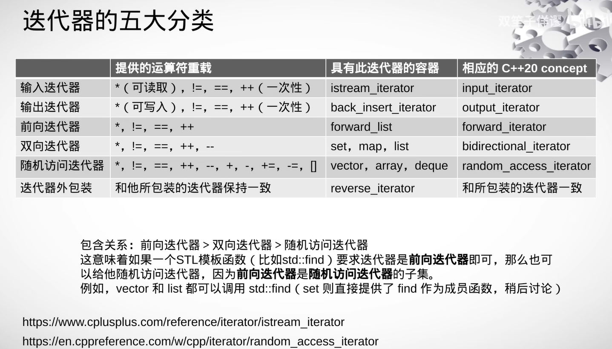
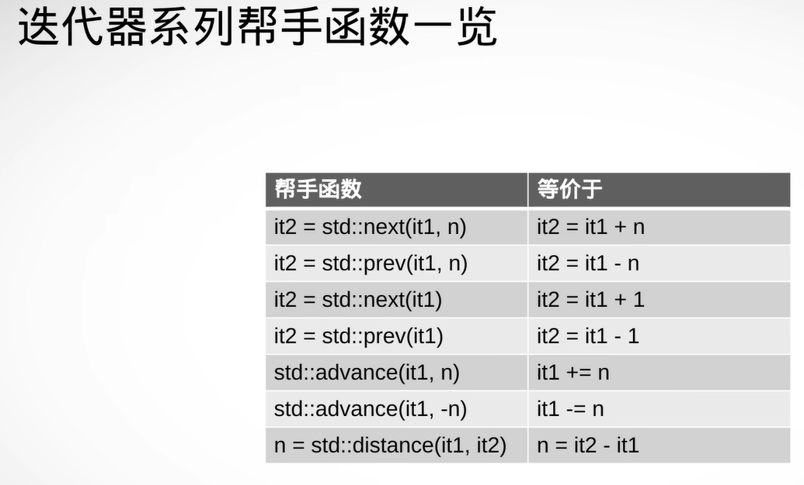
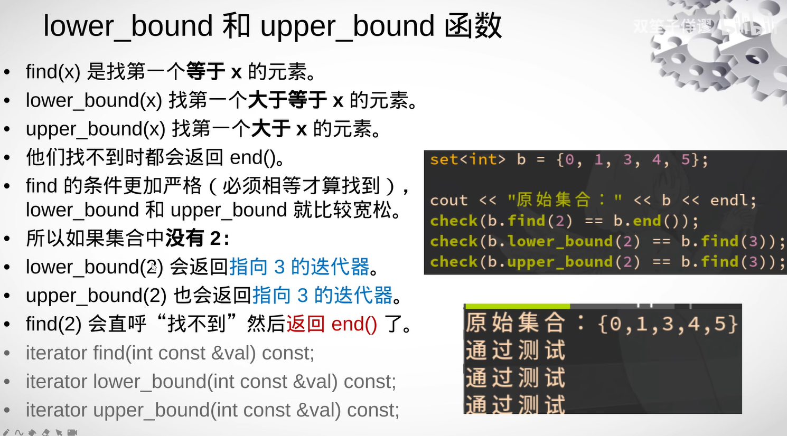
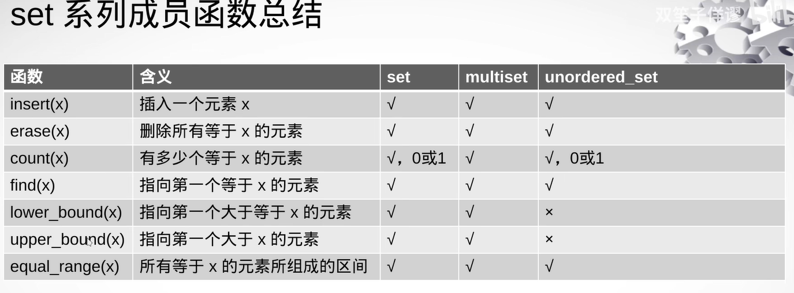
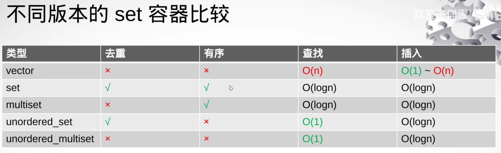
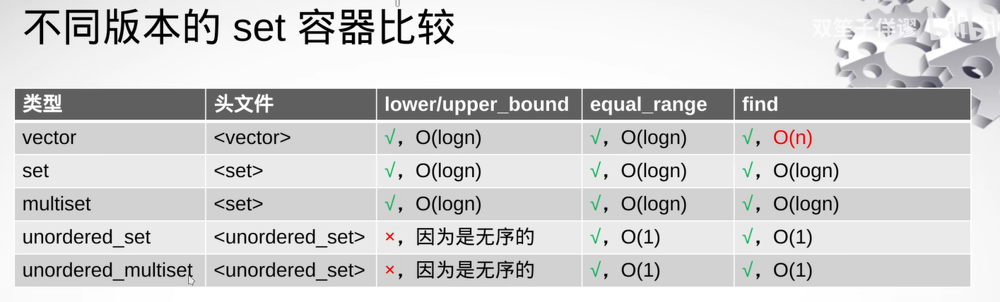
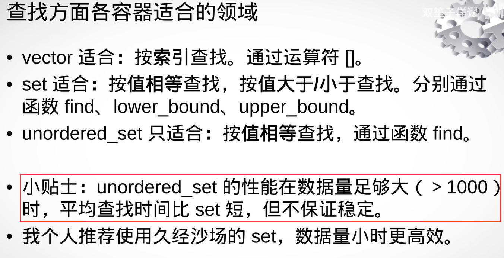

容器 迭代器 操作 范围都是`左闭右开` [beg, end)

如果函数需要传入两个相同的迭代器，那么必须遵守第一个迭代器在二个迭代器之前




vector是随机访问迭代器，

set、map是双向迭代器，不允许 + 3这样的操作，是为了防止代码编写者写出低效不安全代码，仅能++ 三次达到效果，或者使用std::next(it, 3)标准库提供的封装

std::prev(it, 3) 相当于 newit = it - 3

如果是 += 则使用 std::advance(it, 3)  it = it+3

std::distance(it, it)两个迭代器相减， 第二个减去第一个



建议使用std::find进行查找

虽然set、map是有序的，但是std::lower_bound二分查找不认账，它只认随机访问迭代器的容器

可以使用set、map自带的lower_bound、upper_bound

```c

template<typename Iter, typename Dist>
void distribute(Iter first, Dist dist) {
    detail::distribute_impl(first, dist, typename std::iterator_traits<Iter>::iterator_category());
}
namespace detail {
    template<typename Iter, typename Dist>
    void distribute_impl(Iter& first, Dist dist, std::random_access_iterator_tag) {
        it += dist;
    }
    template<typename Iter, typename Dist>
    void distribute_impl(Iter& first, Dist dist, std::bidirectional_iterator_tag) {
        while(n--) ++first;
    }
}

```













