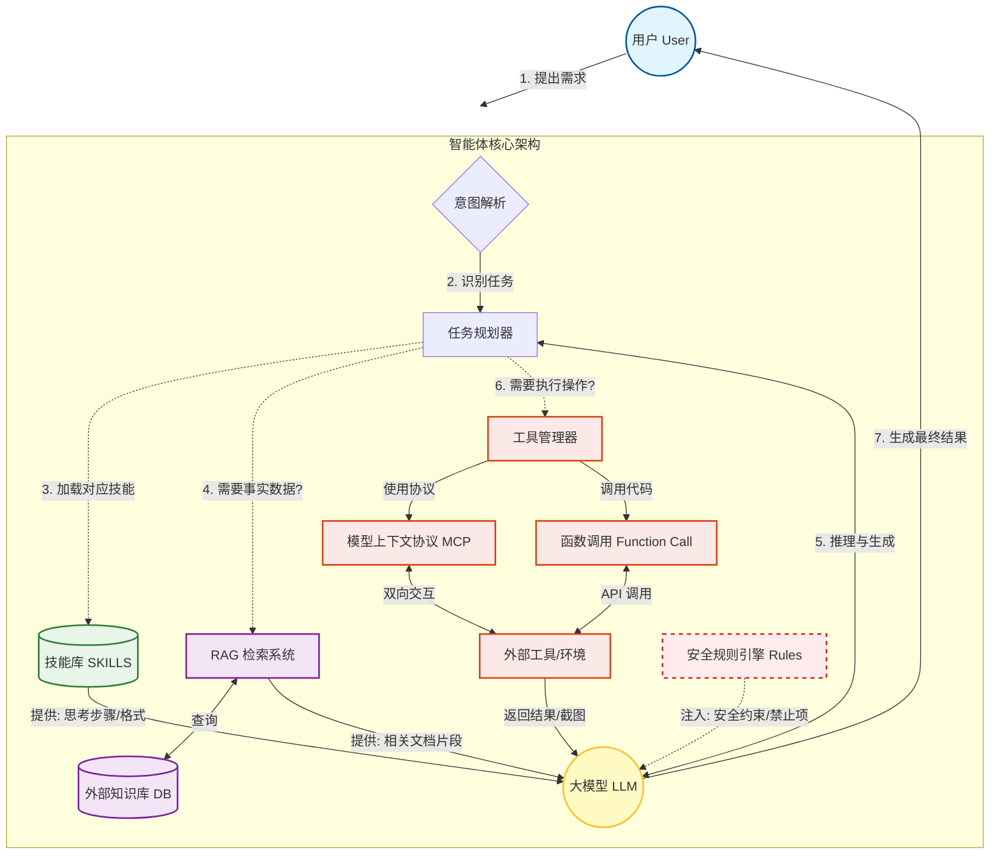

# 🧠 大模型智能体（AI Agent）技术全景总结

当前大模型的进化方向正从单纯的“文本生成”转向“智能体（Agent）”。一个成熟的智能体系统不仅仅是一个大模型，而是一个**由大脑（模型）、手脚（工具）、记忆（知识库）和经验（技能）组成的复合系统**。

以下是核心技术与能力的深度解析与对比。

---

## 1. 核心技术概念解析

### 基础底座：Prompt（提示词）
*   **定义：** 与大模型交互的输入方式，是引导模型生成特定输出的指令。
*   **进化：** 从简单的问答（Chat）进化为**工程化提示词（Engineering Prompt）**，即结构化的指令集。

### 核心能力：Function Call（函数调用）
*   **定义：** 大模型根据自然语言意图，生成符合特定格式（如 JSON）的代码片段，调用外部 API 或函数。
*   **作用：** 它是大模型连接外部世界的“桥梁”。没有 Function Call，模型只能“空想”；有了它，模型可以“实干”（查天气、查股票、写文件）。

### 安全与规范：Rules（规则）
*   **定义：** 系统设定的硬性约束和边界条件。
*   **作用：** 确保模型**“什么不能做”**。例如：“禁止讨论敏感话题”、“必须用中文回答”、“如果不确定答案必须说不知道”。它是对抗模型幻觉和确保合规的防线。

### 架构层：SKILLS（技能/可复用提示词）
*   **定义：** 将特定任务的最佳实践（思考步骤做什么、格式要求怎么做、输出示例参考）封装成模块化的 Prompt 片段，按需拼接，流程化，低信息熵，省 Token。这在行业内通常被称为 **RAG (检索增强生成)** 的一种变体，或者 **Function Calling (函数调用)** 的提示词化版本
*   **核心价值：** **“怎么做”**（How-to）。
    *   **低信息熵：** 去除废话，只保留核心逻辑。
    *   **模块化：** 就像写代码时的 `import` 库一样。不需要把所有的说明书都塞进模型脑子里，而是只在需要时加载“PDF 解析 Skill”或“Excel 处理 Skill”
    *   **固化 CoT（思维链）：**一个好的 Skill 包含了 `{{Instructions}}` 和 `{{Few-Shot Examples}}`，这相当于把人类的“最佳实践”固化了，模型只需要填空，不需要重新思考方法论。

### 数据层：RAG（检索增强生成）

* 简单来说，RAG的工作原理可以概括为一个两步循环的“查阅专家”过程： 
  * 1. **“检索”阶段**：当用户提问时，系统不是让大模型直接回答，而是**先去指定的知识库（如公司文档、最新新闻、专业资料）里“查阅”相关资料**。 
    2. **“增强生成”阶段**：系统把**检索到的相关文档片段和原始问题一起“喂”给大模型**，并指示它：“**请基于以下提供的资料来回答问题**。”

*   **定义：** 在生成答案前，先从外部知识库检索相关信息，并将其作为上下文输入给模型。
*   **核心价值：** **“知道什么”**（Know-what）。
    *   **时效性：** 获取训练数据截止日期之后的信息。
    *   **私有性：** 接入企业内部文档。
    *   **去幻觉：** 强制模型基于检索到的事实回答。

### 交互协议：MCP（模型上下文协议）
*   **定义：** 一种标准化的交互协议，允许模型与外部工具（如浏览器、数据库、本地文件系统）进行双向通信。
*   **深化：** 它是 Function Call 的**超集**或**特定实现**，**MCP 不仅仅是“调用”，它是一种标准化的交互协议**。它解决了“模型懂逻辑，但手够不着”的问题
    *   **双向通信：** 以前是模型生成代码让你去跑，现在是模型直接通过 MCP 接口**读取**你的本地文件、**观察**你的浏览器屏幕（通过截图分析）、**控制**鼠标点击。
    *   **精细控制：** 它强调的是“沙盒”或“授权”机制，不是无限制的权限，而是用户或系统授予的特定权限。

---

## 2. 关键概念深度对比

- **大脑本身（LLM）** 拥有通用的理解、推理和生成能力。
- **RAG（外部图书馆）** 负责在需要事实、最新或特定领域知识时，去书架上快速查阅精准的参考资料。
- **SKILLS（操作手册）** 是大脑内化的一系列精炼、可靠的固定流程，用于处理已知的、结构化的任务（如：解析数据、格式化回复、分步骤思考）。
- **MCP（神经连接插槽与安全协议栈）** 则是大脑与**整个外部世界**（工具、数据、服务）进行安全、标准化、可扩展交互的**根本性基础设施**。它让调用“图书馆”（RAG）和使用任何其他“工具”都变得统一、安全和便捷。

**一个终极比喻：**

如果把大模型比作一台**超级电脑**：

- **RAG** 是连接着海量云盘和在线数据库的**高速搜索引擎**。
- **SKILLS** 是电脑里安装好的、优化过的**专业软件套件**（如Office, Photoshop）。
- **MCP** 则是这台电脑的**操作系统内核**和**应用程序商店/安全框架**。它定义了所有软件（工具）如何与系统（模型）安全通信，并允许用户随时从生态中安全地安装、运行和管理任何新的应用程序（工具），而无需重装系统。

为了理清这些概念，我们将 SKILLS、RAG 和 Tools (MCP/Function Call) 进行横向对比：

| 维度 | **SKILLS (技能)** | **RAG (检索增强)** | **Tools / MCP (工具/协议)** |
| :--- | :--- | :--- | :--- |
| **本质** | **方法论 / 算法** | **事实 / 数据** | **接口 / 能力** |
| **解决问题** | 如何思考？如何规划？ | 事实是什么？数据是多少？ | 手够不着怎么办？环境怎么交互？ |
| **输入内容** | 步骤、规则、Few-Shot 示例 | PDF 片段、数据库记录、网页文本 | API 参数、屏幕截图、文件句柄 |
| **类比** | **食谱 / 操作手册** | **百科全书 / 图书馆** | **厨具 / 机器人手臂** |
| **变化频率** | 相对稳定（方法论不易变） | 高频变化（数据实时更新） | 稳定（工具接口通常固定） |

---

## 3. 智能体系统架构全景图 (Mermaid)

这个图表展示了一个完整的 AI 智能体是如何工作的。它融合了 **Rules** 作为安全护栏，**SKILLS** 作为执行蓝图，**RAG** 作为知识支撑，以及 **MCP/Function Call** 作为行动手脚。

---

## 4. 工作流程详解（基于上图）

1.  **用户输入 (Input)：** 用户提出一个复杂需求，例如“帮我分析这份财报并制作一个 PPT”。
2.  **意图解析与规划 (Parsing & Planning)：** 系统识别出这需要“PDF 解析”和“PPT 生成”两个子任务。
3.  **加载 SKILLS (Load Skills)：** 系统从库中加载“PDF 数据分析 Skill”和“PPT 制作 Skill”。这些 Skills 告诉 LLM 具体的分析维度（营收、利润）和 PPT 的排版规范。
4.  **RAG 检索 (Retrieval)：** 如果分析需要行业基准数据，系统会触发 RAG，去外部数据库检索“同行业平均利润率”等事实信息。
5.  **注入 Rules (Inject Rules)：** 系统在 Prompt 中加入规则，例如“不要编造数据”、“PPT 必须使用公司模板”。
6.  **LLM 推理 (Reasoning)：** 大模型结合 Skills（方法）、RAG（数据）和 Rules（约束）进行思考。
7.  **工具调用 (Tools/MCP)：**
    *   LLM 决定需要读取本地 PDF，通过 **MCP** 协议读取文件内容。
    *   LLM 决定需要生成图表，通过 **Function Call** 调用 Python 脚本画图。
8.  **结果生成 (Output)：** 最终整合所有信息，生成分析报告和 PPT 文件返回给用户。

## 5. 总结

*   **Prompt** 是**入口**，连接用户与模型。
*   **SKILLS** 是**经验**，让模型高效工作。
*   **RAG** 是**记忆**，让模型知识渊博。
*   **Function Call / MCP** 是**手脚**，让模型改变世界。
*   **Rules** 是**护栏**，让模型安全可靠。

这五大支柱共同构成了从“玩具”走向“生产力工具”的大模型智能体技术栈。