# CUDA学习笔记

## 查询GPU详细信息
```bash
nvidia-smi -q
```

### 查询特定GPU详细信息
```bash
nvidia-smi -q -i 0
```

### 显示GPU特定信息
```bash
nvidia-smi -q -i 0 -d MEMORY
```

### GPU状态示例
```
C:\Users\Re11a>nvidia-smi
Mon Dec 08 05:22:50 2025
+-----------------------------------------------------------------------------+
| NVIDIA-SMI 457.07       Driver Version: 457.07       CUDA Version: 11.1     |
|-------------------------------+----------------------+----------------------+
| GPU  Name            TCC/WDDM | Bus-Id        Disp.A | Volatile Uncorr. ECC |
| Fan  Temp  Perf  Pwr:Usage/Cap|         Memory-Usage | GPU-Util  Compute M. |
|                               |                      |               MIG M. |
|===============================+======================+======================|
|   0  GeForce GTX 1650   WDDM  | 00000000:01:00.0 Off |                  N/A |
| N/A   39C    P8     6W /  N/A |    134MiB /  4096MiB |      0%      Default |
|                               |                      |                  N/A |
+-------------------------------+----------------------+----------------------+

+-----------------------------------------------------------------------------+
| Processes:                                                                  |
|  GPU   GI   CI        PID   Type   Process name                  GPU Memory |
|        ID   ID                                                   Usage      |
|=============================================================================|
|  No running processes found                                                 |
+-----------------------------------------------------------------------------+
```

## CUDA HELLO WORLD
```bash
nvcc hello.cu -o hello
```

# 核函数

### 核函数(Kernel function)特性
1. 核函数在GPU上进行并行执行
2. 注意事项：
   - 限定词 `__global__` 修饰
   - 返回值必须是 `void`
3. 形式：`__global__ void kernel_function(argument arg)`

### 注意事项：
1. 核函数只能访问GPU内存
2. 核函数不能使用变长参数
3. 核函数不能使用静态变量
4. 核函数不能使用函数指针
5. 核函数具有异步性

### CUDA程序编写流程：
```cuda
int main(void) {
    // 主机代码
    // 核函数调用
    // 主机代码
    return 0;
}
```
注意：核函数不支持C++的iostream

# 线程模型结构

## 重要概念
1. **grid**：网格
2. **block**：线程块

线程分块是逻辑上的划分，物理上线程不分块。

## 配置线程
```cuda
<<<grid_size, block_size>>>
```

最大允许线程块大小：1024
最大允许网格大小：2^31-1（针对一维网格）

## 线程模型说明
host的kernel函数调用，kernel函数在device执行，操作不同的grid下的不同的block，由三个尖括号设置的值决定启用个数。

CUDA线程模型是三维的。

## 一维线程模型
1. 每个线程在核函数中都有一个唯一的身份标识
2. 每个线程的唯一标识由这两个`<<<grid_size, block_size>>>`确定
   - `gridDim.x`：该变量的数值等于执行配置中变量grid_size的值
   - `blockDim.x`：该变量的数值等于执行配置中变量block_size的值

线程索引保存成内建变量：
- `blockIdx.x`：该变量指定一个线程在一个网格中的线程块索引值，范围为0~gridDim.x-1
- `threadIdx.x`：该变量指定一个线程在一个线程块中的线程索引值，范围为0~blockDim.x-1

线程唯一标识：
```
Idx = threadIdx.x + blockIdx.x * blockDim.x
```

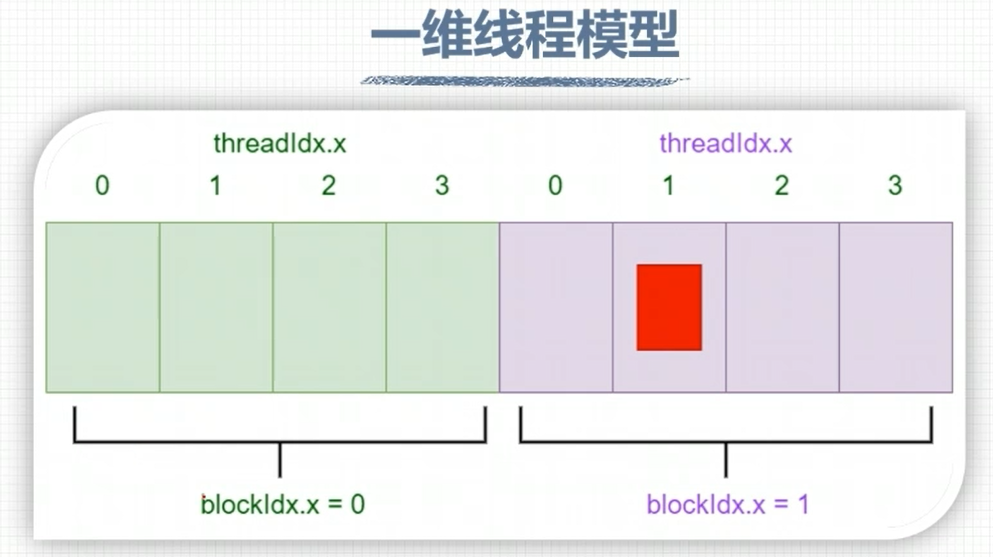

> 图片说明：
> - gridDim.x的值为2
> - blockDim.x的值为4
> - blockIdx.x取值范围为0~1
> - threadIdx.x取值范围为0~3

## 推广到多维线程
gridDim和blockDim没有指定的维度默认为1：
```
gridDim.x = grid_size
gridDim.y = 1
gridDim.z = 1
blockDim.x = block_size
blockDim.y = 1
blockDim.z = 1
```

定义多维网格和线程块（C++构造函数语法）：
```cuda
dim3 grid_size(Gx, Gy, Gz);
dim3 block_size(Bx, By, Bz);
```

举个例子，定义一个2x2x1的网格，5x3x1的线程块：
```cuda
dim3 grid_size(2, 2);      // 等价于dim3 grid_size(2, 2, 1);
dim3 block_size(5, 3);     // 等价于dim3 block_size(5, 3, 1);
```

多维网格和多维线程块本质是一维的，GPU物理上不分块。

每个线程都有唯一标识：
```cuda
int tid = threadIdx.y * blockDim.x + threadIdx.x;
int bid = blockIdx.y * gridDim.x + blockIdx.x;
```

## 网格和线程块的限制条件
### 网格大小限制：
| 维度      | 最大值 |
| --------- | ------ |
| gridDim.x | 2^31-1 |
| gridDim.y | 2^16-1 |
| gridDim.z | 2^16-1 |

### 线程块大小限制：
| 维度       | 最大值 |
| ---------- | ------ |
| blockDim.x | 1024   |
| blockDim.y | 1024   |
| blockDim.z | 64     |

注意：线程块总的大小最大为1024！

# 线程全局索引计算方式

## 一维网格 一维线程块
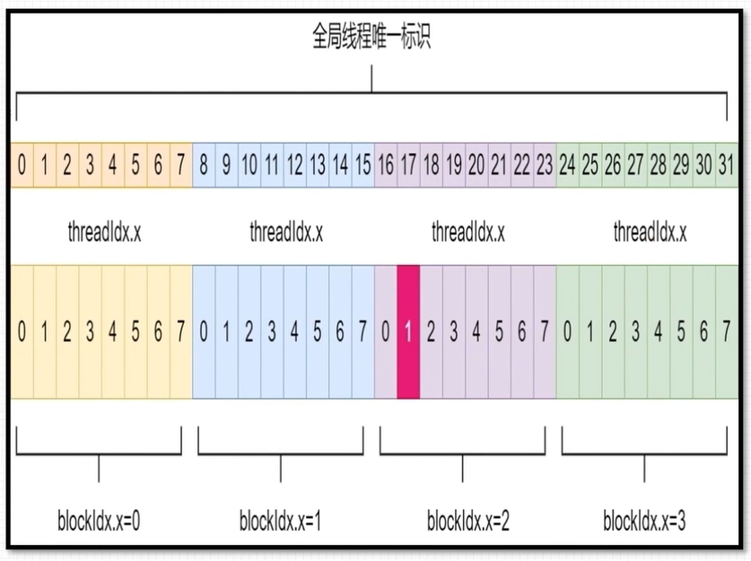

定义grid和block尺寸：
```cuda
dim3 grid_size(4);
dim3 block_size(8);
```
调用核函数：
```cuda
kernel_fun<<<grid_size, block_size>>>(...)
```
计算方式：
```cuda
int id = blockIdx.x * blockDim.x + threadIdx.x;
```

## 二维网格 二维线程块
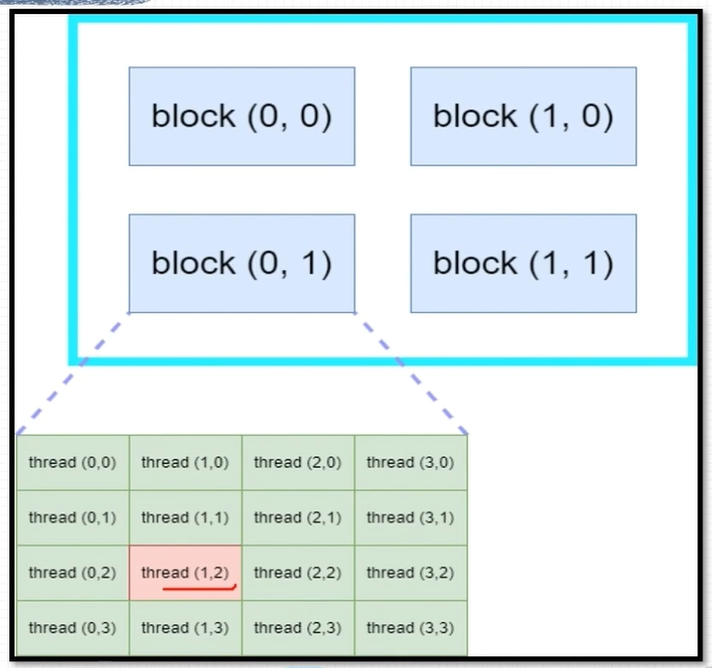

定义grid和block尺寸：
```cuda
dim3 grid_size(2, 2);
dim3 block_size(4, 4);
```
调用核函数：
```cuda
kernel_fun<<<grid_size, block_size>>>(...)
```
计算方式：
```cuda
int blockId = blockIdx.x + blockIdx.y * gridDim.x;
int threadId = threadIdx.y * blockDim.x + threadIdx.x;
int id = blockId * (blockDim.x * blockDim.y) + threadId;
```

## 三维网格 三维线程块
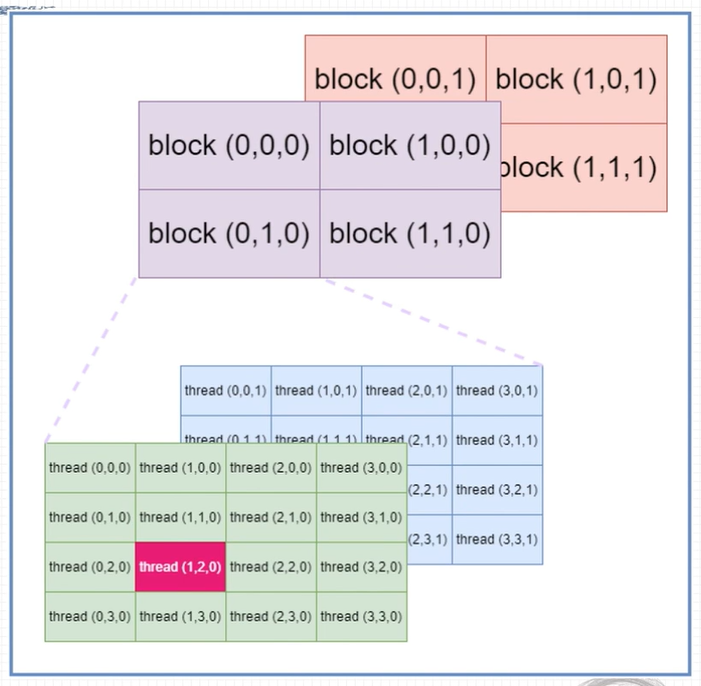

定义grid和block尺寸：
```cuda
dim3 grid_size(2, 2, 2);
dim3 block_size(4, 4, 2);
```
调用核函数：
```cuda
kernel_fun<<<grid_size, block_size>>>(...);
```
计算方式：
```cuda
int blockId = blockIdx.x + blockIdx.y * gridDim.x 
            + gridDim.x * gridDim.y * blockIdx.z;
int threadId = (threadIdx.z * (blockDim.x * blockDim.y))
             + (threadIdx.y * blockDim.x) + threadIdx.x;
int id = blockId * (blockDim.x * blockDim.y * blockDim.z) + threadId;
```

## 其他组合形式
### 一维Grid 一维Block：
```cuda
int blockId = blockIdx.x;
int id = blockIdx.x * blockDim.x + threadIdx.x;
```

### 一维Grid 二维Block：
```cuda
int blockId = blockIdx.x;
int id = blockIdx.x * blockDim.x * blockDim.y 
      + threadIdx.y * blockDim.x + threadIdx.x;
```

### 一维Grid 三维Block：
```cuda
int blockId = blockIdx.x;
int id = blockIdx.x * blockDim.x * blockDim.y * blockDim.z
      + threadIdx.z * blockDim.y * blockDim.x
      + threadIdx.y * blockDim.x + threadIdx.x;
```

# nvcc编译流程与GPU计算能力

## nvcc编译流程
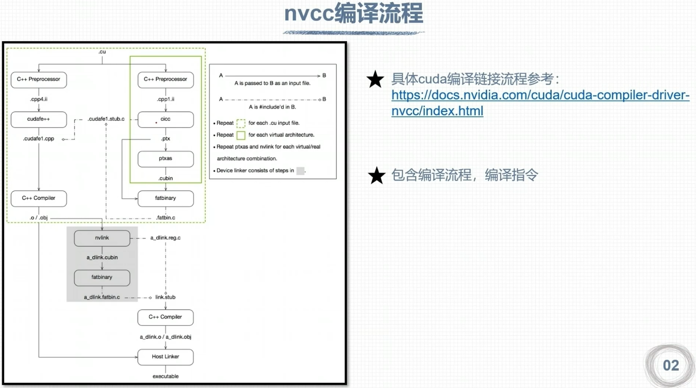

1. nvcc分离全部源代码为：
   - 主机代码
   - 设备代码
2. 主机代码是C/C++语法，设备代码是C/C++扩展语言编写
3. nvcc先将设备代码编译为PTX伪汇编代码，再将PTX代码编译为二进制的cubin目标代码
4. 在将源代码编译为PTX代码时，需要用选项 `-arch=compute_XY` 指定一个虚拟架构的计算能力用以确定代码中能够使用的CUDA功能
5. 在将PTX代码编译为cubin代码时，需要用选项 `-code=sm_ZW` 指定一个真实架构的计算能力，用以确定可执行文件能够使用的GPU

## PTX
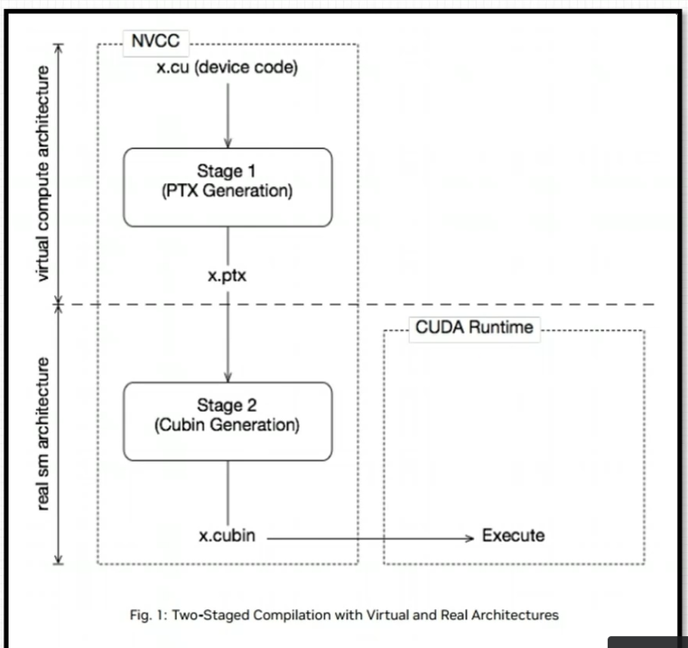

PTX是CUDA平台为基于GPU的通用计算而定义的虚拟机和指令集。

nvcc编译命令总是使用两个体系结构：
- 虚拟的中间体系结构
- 实际的GPU体系结构

虚拟架构更像是对应用所需的GPU功能的声明：
- 虚拟架构应该尽可能选择低——适配更多实际GPU
- 真实架构应该尽可能选择高——充分发挥GPU性能

PTX文档：https://docs.nvidia.com/cuda/parallel-thread-execution/index.html

## GPU架构与计算力
| 主计算能力 | 架构代号          | 发布年份 |
| ---------- | ----------------- | -------- |
| X=1        | 特斯拉(Tesla)     | 2006     |
| X=2        | 费米(Fermi)       | 2010     |
| X=3        | 开普勒(Kepler)    | 2012     |
| X=5        | 麦克斯韦(Maxwell) | 2014     |
| X=6        | 帕斯卡(Pascal)    | 2016     |
| X=7        | 伏特(Volta)       | 2017     |
| X.Y=7.5    | 图灵(Turing)      | 2018     |

### 计算能力支持
- sm_50, sm_52 and sm_53: Maxwell support
- sm_60, sm_61, and sm_62: Pascal support
- sm_70 and sm_72: Volta support
- sm_75: Turing support
- sm_80, sm_86 and sm_87: NVIDIA Ampere GPU architecture support
- sm_89: Ada support
- sm_90, sm_90a: Hopper support

1. 每款GPU都有用于标识"计算能力"的版本号
2. 形式X.Y，X标识主版本号，Y表示次版本号

注意：并非GPU的计算能力越高，性能就越高

| GPU型号            | 计算能力 | 显存容量 | 显存带宽 | 浮点数运算峰值   |
| ------------------ | -------- | -------- | -------- | ---------------- |
| Tesla K40          | 3.5      | 12 GB    | 288 GB/s | 1.4 (4.3) TFLOPS |
| Tesla P100         | 6.0      | 16 GB    | 732 GB/s | 4.7 (9.3) TFLOPS |
| Tesla V100         | 7.0      | 32 GB    | 900 GB/s | 7 (14) TFLOPS    |
| GeForce RTX 2070   | 7.5      | 8 GB     | 448 GB/s | 0.2 (6.5) TFLOPS |
| GeForce RTX 2080ti | 7.5      | 11 GB    | 616 GB/s | 0.4 (13) TFLOPS  |

# CUDA程序兼容性问题

## 指定虚拟架构计算能力
C/C++源码编译为PTX时，可以指定虚拟架构的计算能力，用来确定代码中能够使用的CUDA功能。

C/C++源码转化为PTX这一步骤与GPU硬件无关。

编译指令（指定虚拟架构计算能力）：
```bash
-arch=compute_XY
```
XY：第一个数字X代表计算能力的主版本号，第二个数字Y代表计算能力的次版本号。

PTX的指令只能在更高的计算能力的GPU使用。

例如：
```bash
nvcc helloworld.cu -o helloworld -arch=compute_61
```
编译出的可执行文件helloworld可以在计算能力>=6.1的GPU上面执行，在计算能力小于6.1的GPU则不能执行。

## 指定真实架构计算能力
PTX指令转化为二进制cubin代码与具体的GPU架构有关。

编译指令（指定真实架构计算能力）：
```bash
-code=sm_XY
```
XY：第一个数字X代表计算能力的主版本号，第二个数字Y代表计算能力的次版本号。

注意事项：
1. 二进制cubin代码，大版本之间不兼容！
2. 指定真实架构计算能力的时候必须指定虚拟架构计算能力！
3. 指定的真实架构能力必须大于或等于虚拟架构能力！

例如：`nvcc helloworld.cu -o helloworld -arch=compute_61 -code=sm_60`（这条指令无法执行）

真实架构可以实现低小版本到高小版本的兼容。

## 指定多个版本GPU架构
指定多个GPU版本编译，使得编译出来的可执行文件可以在多GPU中执行。

同时指定多组计算能力！
编译选项：
```bash
-gencode arch=compute_XY,code=sm_XY
```

例如：
```bash
-gencode arch=compute_35,code=sm_35  # 开普勒架构
-gencode arch=compute_50,code=sm_50  # 麦克斯韦架构
-gencode arch=compute_60,code=sm_60  # 帕斯卡架构
-gencode arch=compute_70,code=sm_70  # 伏特架构
```
编译出的可执行文件包含4个二进制版本，生成的可执行文件称为胖二进制文件(fatbinary)。

注意事项：
1. 执行上述指令必须CUDA版本支持7.0计算能力，否则会报错
2. 过多指定计算能力，会增加编译时间和可执行文件的大小

## nvcc即时编译
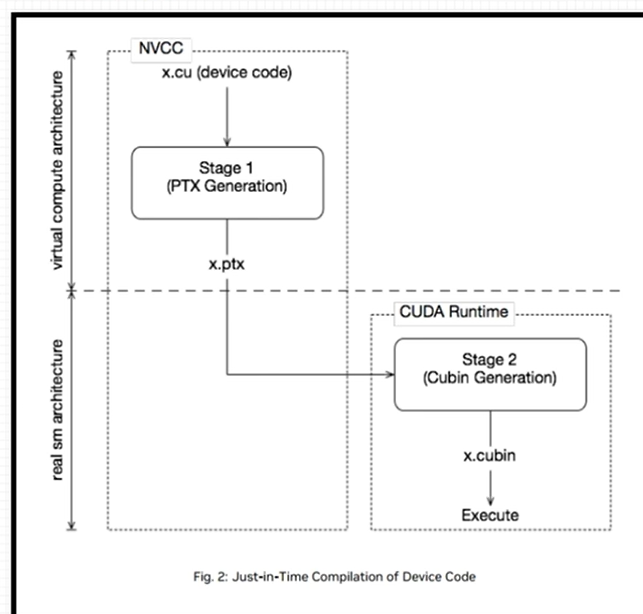

在运行可执行文件时，从保留的PTX代码临时编译出cubin文件。

在可执行文件中保留PTX代码，nvcc编译指令指定所保留的PTX代码虚拟架构：

指令：
```bash
-gencode arch=compute_XY,code=compute_XY
```

注意：
1. 两个计算能力都是虚拟架构计算能力
2. 两个虚拟架构计算能力必须一致

例如：
```bash
-gencode arch=compute_35,code=sm_35
-gencode arch=compute_50,code=sm_50
-gencode arch=compute_61,code=sm_61
-gencode arch=compute_61,code=compute_61
```

简化：
```bash
-arch=sm_XY
```
等价于：
```bash
-gencode arch=compute_61,code=sm_61
-gencode arch=compute_61,code=compute_61
```

## nvcc编译默认计算能力
不同版本CUDA编译器在编译CUDA代码时，都有一个默认计算能力：

| CUDA版本           | 默认计算能力 |
| ------------------ | ------------ |
| CUDA 6.0及更早版本 | 1.0          |
| CUDA 6.5~CUDA 8.0  | 2.0          |
| CUDA 9.0~CUDA 10.2 | 3.0          |
| CUDA 11.6          | 5.2          |

# CUDA矩阵加法运算程序

## CUDA程序基本框架
```cuda
#include <头文件>

__global__ void 函数名(参数...) {
    // 核函数内容
}

int main(void) {
    // 设置GPU设备
    // 分配主机和设备内存
    // 初始化主机中的数据
    // 数据从主机复制到设备
    // 调用核函数在设备中进行计算
    // 将计算得到的数据从设备传给主机
    // 释放主机与设备内存
}
```

### 设置GPU设备
获取GPU设备数量：
```cuda
int iDeviceCount = 0;
cudaGetDeviceCount(&iDeviceCount);
```

设置GPU执行时使用的设备：
```cuda
int iDev = 0;
cudaSetDevice(iDev);
```

### 内存管理
数据传递、内存初始化、内存释放进行内存管理。

| 标准C语言内存管理函数 | CUDA内存管理函数 |
| --------------------- | ---------------- |
| malloc                | cudaMalloc       |
| memcpy                | cudaMemcpy       |
| memset                | cudaMemset       |
| free                  | cudaFree         |

### 内存分配
主机分配内存：
```cuda
extern void *malloc(unsigned int num_bytes);
float *fpHost_A;
fpHost_A = (float *)malloc(nBytes);
```

设备分配内存：
```cuda
float *fpDevice_A;
cudaMalloc((float**)&fpDevice_A, nBytes);
```

### 数据拷贝
主机数据拷贝：
```cuda
void *memcpy(void *dest, const void *src, size_t n);
memcpy((void*)d, (void*)s, nBytes);
```

设备数据拷贝：
```cuda
cudaMemcpy(fpDevice_A, fpHost_A, nBytes, cudaMemcpyHostToDevice);
```

拷贝类型：
- `cudaMemcpyHostToHost`：主机→主机
- `cudaMemcpyHostToDevice`：主机→设备
- `cudaMemcpyDeviceToHost`：设备→主机
- `cudaMemcpyDeviceToDevice`：设备→设备
- `cudaMemcpyDefault`：默认方式（只允许在支持统一虚拟寻址的系统上使用）

### 内存初始化
主机内存初始化：
```cuda
void *memset(void *str, int c, size_t n);
memset(fpHost_A, 0, nBytes);
```

设备内存初始化：
```cuda
cudaMemset(fpDevice_A, 0, nBytes);
```

## 现代C++封装
RAII（Resource Acquisition Is Initialization）

## 实现矩阵加法
（代码实现略）

# CUDA错误检查

### 运行时API错误代码
1. CUDA运行时API大多支持返回错误代码，返回值类型：`cudaError_t`
2. 运行时API成功执行，返回值为`cudaSuccess`
3. 运行时API返回的执行状态值是枚举变量

好比C语言的errno。

### 错误检查函数
1. 获取错误代码对应名称：`cudaGetErrorName`
2. 获取错误代码描述信息：`cudaGetErrorString`

### 错误检查函数使用
在调用CUDA运行时API时，调用CUDA_CHECK函数进行包装。

参数`lineNumber`一般使用`__LINE__`
参数`filename`一般使用`__FILE__`

错误函数返回运行时API调用的错误代码。

### 检查核函数
错误检测函数问题：不能捕捉调用核函数的相关错误。

捕捉调用核函数可能发生错误的方法：
```cuda
kernel<<<grid, block>>>(args);
cudaError_t err = cudaGetLastError();
if (err != cudaSuccess) {
    printf("Kernel launch error: %s\n", cudaGetErrorString(err));
}
```

### 封装为宏CUDA_CHECK检查错误信息并能够自动打印
```cuda
#define CUDA_CHECK(call) \
do { \
    cudaError_t err = call; \
    if (err != cudaSuccess) { \
        printf("CUDA error at %s:%d - %s\n", __FILE__, __LINE__, cudaGetErrorString(err)); \
        exit(1); \
    } \
} while(0)
```

# CUDA记时

## 事件记时
1. 程序执行时间记时：是CUDA程序执行性能的重要表现
2. 使用CUDA事件(event)记时方式
   CUDA事件记时可为主机代码、设备代码记时

代码示例：
```cuda
cudaEvent_t start, stop;
cudaEventCreate(&start);
cudaEventCreate(&stop);

cudaEventRecord(start);
// 要计时的代码
kernel<<<grid, block>>>(args);
cudaEventRecord(stop);

cudaEventSynchronize(stop);
float milliseconds = 0;
cudaEventElapsedTime(&milliseconds, start, stop);

cudaEventDestroy(start);
cudaEventDestroy(stop);
```

## nvprof性能剖析
nvprof是一个可执行文件。

执行命令：
```bash
nvprof ./exe_name
```

打印表格列含义：
- 时间：操作执行时间
- 调用：调用次数
- 大小：数据传输大小
- 类型：操作类型

# 运行时GPU信息查询
运行时API查询GPU信息。

涉及的运行时API函数调用：
```cuda
cudaDeviceProp prop;
CUDA_CHECK(cudaGetDeviceProperties(&prop, device_id));
```

代码示例：
```cuda
cudaDeviceProp prop;
cudaGetDeviceProperties(&prop, 0);
printf("Device Name: %s\n", prop.name);
printf("Compute Capability: %d.%d\n", prop.major, prop.minor);
printf("Total Global Memory: %lu bytes\n", prop.totalGlobalMem);
printf("Shared Memory per Block: %lu bytes\n", prop.sharedMemPerBlock);
printf("Registers per Block: %d\n", prop.regsPerBlock);
printf("Max Threads per Block: %d\n", prop.maxThreadsPerBlock);
printf("Max Threads Dim: %d x %d x %d\n", prop.maxThreadsDim[0], prop.maxThreadsDim[1], prop.maxThreadsDim[2]);
printf("Max Grid Size: %d x %d x %d\n", prop.maxGridSize[0], prop.maxGridSize[1], prop.maxGridSize[2]);
```

# 组织线程模型

## 二维网格二维线程块
二维网格和二维线程块对二维矩阵进行索引。

每个线程可负责一个矩阵元素的计算任务。

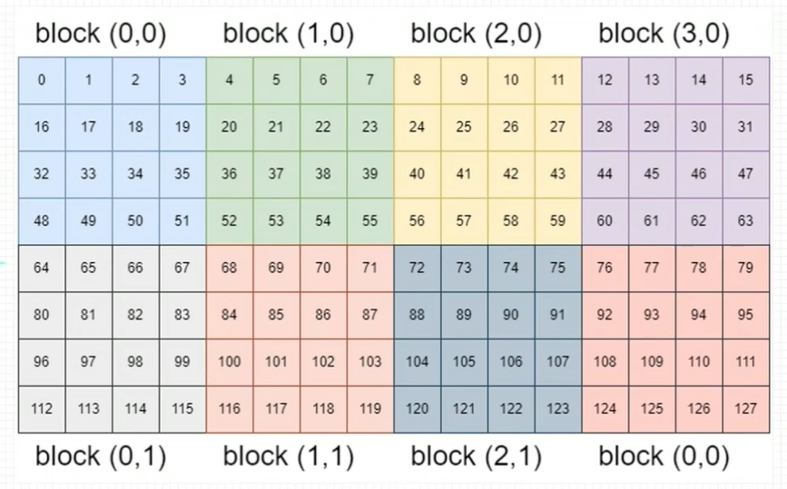

线程与二维矩阵映射关系：
```cuda
int ix = threadIdx.x + blockIdx.x * blockDim.x;
int iy = threadIdx.y + blockIdx.y * blockDim.y;
```

线程与二维矩阵映射关系：
```cuda
int idx = iy * nx + ix;
```

## 二维网格一维线程块
二维网格和一维线程块对二维矩阵进行索引。

每个线程可负责一个矩阵元素的计算任务。

与二维网格二维线程块的情况极为相似。

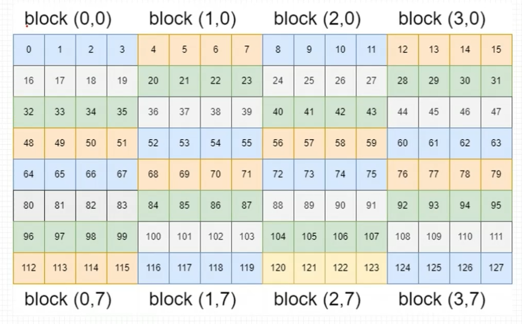

## 一维网格一维线程块
一维网格和一维线程块对二维矩阵进行索引。

每个线程负责矩阵一列的运算。

编写核函数时，需要使用循环。

线程与二维矩阵映射关系：
```cuda
int ix = threadIdx.x + blockIdx.x * blockDim.x;
// iy由循环进行指定
```

线程与二维矩阵映射关系：
```cuda
int idx = iy * nx + ix;
```


# GPU硬件资源

## 流多处理器--SM
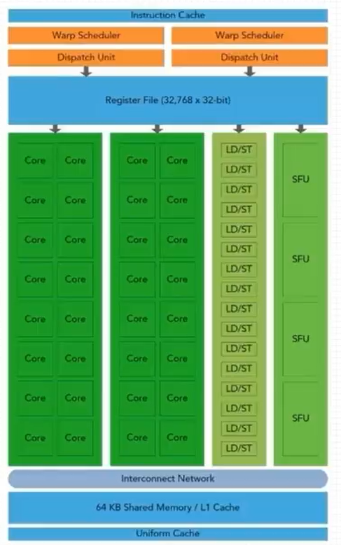

GPU并行性依靠流多处理器SM来完成。

一个GPU是由多个SM构成的，Fermi架构SM关键资源如下：
1. CUDA核心(CUDA core)
2. 共享内存/L1缓存(shared memory/L1 cache)
3. 寄存器文件(Register File)
4. 加载和存储单元(Load/Store Units)
5. 特殊函数单元(Special Function Unit)
6. Warps调度(Warps Scheduler)

GPU中每个SM都可以支持数百个线程并发执行。

以线程块block为单位，向SM分配线程块，多个线程块可被同时分配到一个可用的SM上。

当一个线程块被分配好SM后，就不可以再分配到其他SM上了。

## 线程模型与物理结构
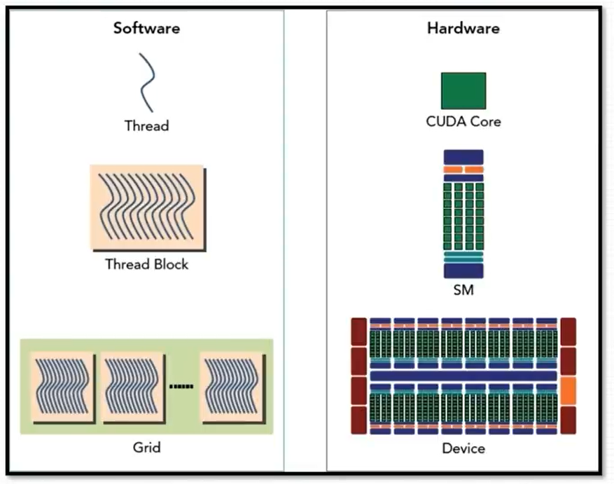

图中线程模型，是在逻辑角度进行分析。

线程模型可以定义成千上万个线程。

网格中的所有线程块需要分配到SM上进行执行。

线程块内的所有线程分配到同一个SM中执行。

但是每个SM上可以被分配多个线程块。

线程块分配到SM中后，会以32个线程为一组进行分割，每个组成为一个warp。

右图物理结构，是在硬件角度进行分析，因为硬件资源是有限的，所以活跃的线程束的数量会受到SM资源限制。

## 线程束
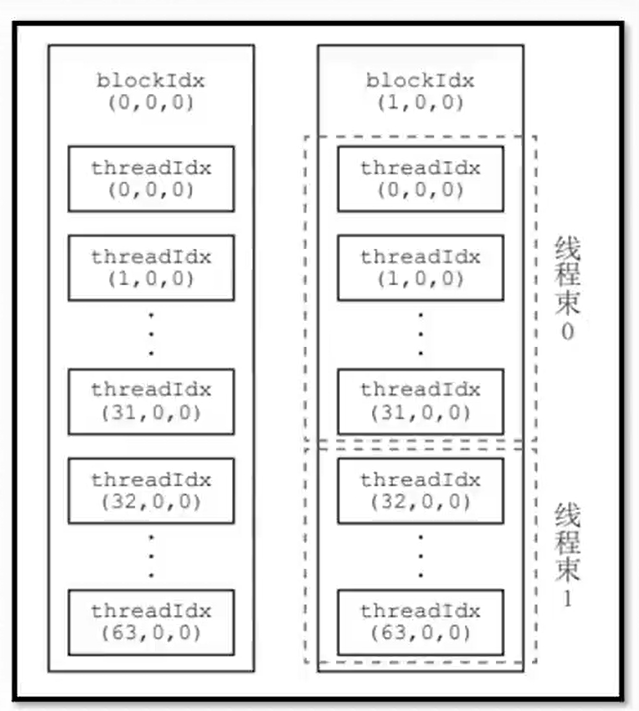

什么是线程束？

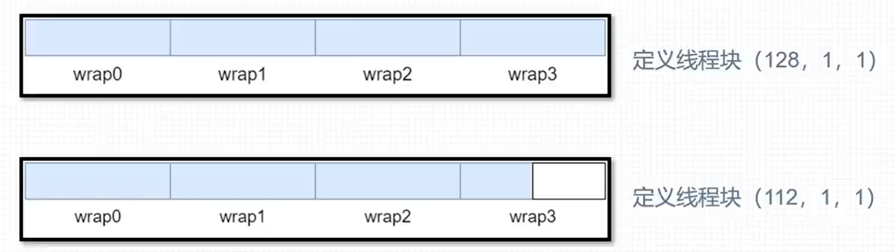

CUDA采用单指令多线程SIMT架构管理执行线程，每32个为一组，构成一个线程束。

同一个线程块中相邻的32个线程构成一个线程束。

具体地说，一个线程块中第0到第31个线程属于第0个线程束，第32到第63个线程属于第1个线程束，依此类推。

每个线程束中只能包含同一线程块中的线程。

每个线程束包含32个线程。

线程束是GPU硬件上真正的做到了并行。

线程束数量 = ceil(线程块中的线程数 / 32)

# CUDA内存模型概述

## 内存结构层次特点
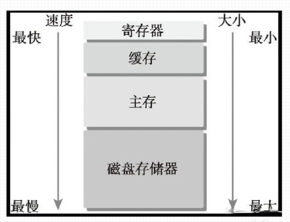

局部性原则：
- 时间局部性
- 空间局部性

如图，底部存储器特点：
1. 更低的每比特位平均成本
2. 更高的容量
3. 更高的延迟
4. 更低的处理器访问频率

CPU和GPU主存采用DRAM（动态随机存取存储器）。

低延迟的内存采用SRAM（静态随机存取存储器）。

## CUDA内存模型
CUDA内存模型图：

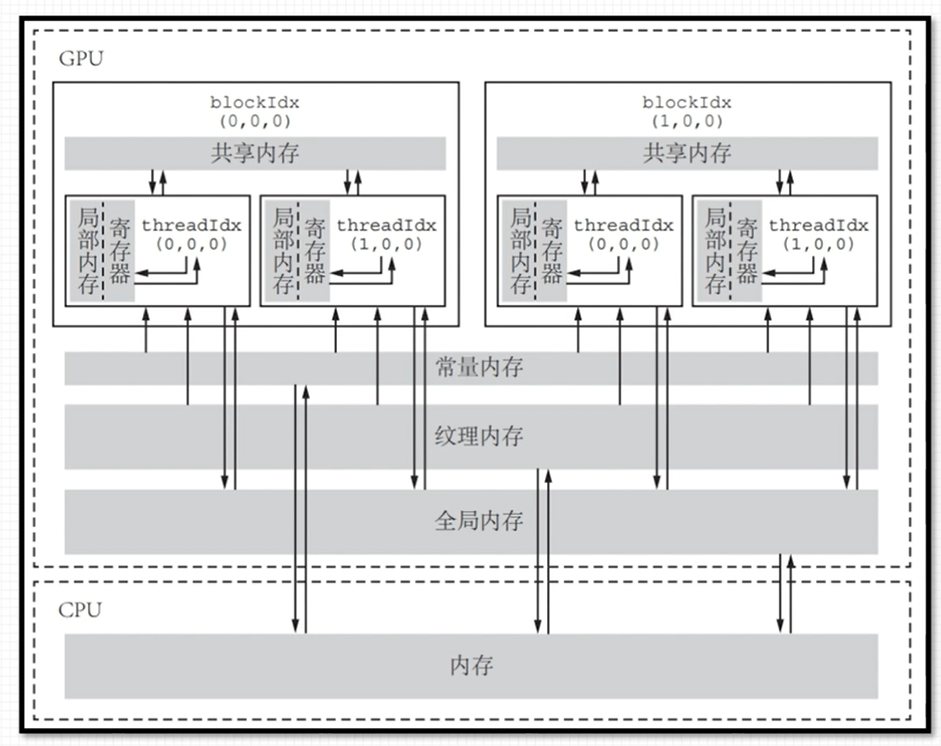

CUDA内存类型：
1. 寄存器(register)
2. 共享内存(shared memory)
3. 本地内存(local memory)
4. 常量内存(constant memory)
5. 纹理内存(texture memory)
6. 全局内存(global memory)

CUDA内存和它们的主要特征：

| 内存类型       | 物理位置 | 访问权限   | 可见范围         | 生命周期         |
| -------------- | -------- | ---------- | ---------------- | ---------------- |
| 全局内存       | 在芯片外 | 可读可写   | 所有线程和主机端 | 由主机分配与释放 |
| 常量内存       | 在芯片外 | 仅可读     | 所有线程和主机端 | 由主机分配与释放 |
| 纹理和表面内存 | 在芯片外 | 一般仅可读 | 所有线程和主机端 | 由主机分配与释放 |
| 寄存器内存     | 在芯片内 | 可读可写   | 单个线程         | 所在线程         |
| 局部内存       | 在芯片外 | 可读可写   | 单个线程         | 所在线程         |
| 共享内存       | 在芯片内 | 可读可写   | 单个线程块       | 所在线程块       |

# 寄存器和本地内存

## 寄存器
寄存器内存在片上(on-chip)，具有GPU上最快的访问速度，但是数量有限，属于GPU的稀缺资源。

寄存器仅可在线程内可见，生命周期也与所属线程一致。

核函数中定义的不加任何限定符的变量一般存放在寄存器中。

内建变量存放于寄存器中，如gridDim、blockDim、blockIdx等。

核函数中定义的不加任何限定符的数组有可能存在于寄存器中，但也有可能存在于本地内存中。

寄存器都是32位的，保存1个double类型的数据需要两个寄存器，寄存器保存在SM的寄存器文件。

计算能力5.0~9.0的GPU，每个SM中都是64K的寄存器数量，Fermi架构只有32K。

每个线程块使用的最大数量不同架构是不同的，计算能力6.1是64K。

每个线程的最大寄存器数量是255个，Fermi架构是63个。

## 本地内存
寄存器放不下的内存会存放在本地内存：
1. 索引值不能在编译时确定的数组存放于本地内存
2. 可能占用大量寄存器空间的较大本地结构体和数组
3. 任何不满足核函数寄存器限定条件的变量

每个线程最多高达可使用512KB的本地内存。

本地内存从硬件角度看只是全局内存的一部分，延迟也很高，本地内存的过多使用，会减低程序的性能。

对于计算能力2.0以上的设备，本地内存的数据存储在每个SM的一级缓存和设备的二级缓存中。

## 寄存器溢出
核函数所需的寄存器数量超出硬件设备支持，数据则会保存到本地内存中。

寄存器溢出情况：
1. 一个SM运行并行运行多个线程块/线程束，总的需求寄存器容量大于64KB
2. 单个线程运行所需寄存器数量大于255个

寄存器溢出会降低程序运行性能：
1. 本地内存只是全局内存的一部分，延迟较高
2. 寄存器溢出的部分也可进入GPU的缓存中

# 全局内存
全局内存在片外。

特点：容量最大，延迟最大，使用最多。

全局内存中的数据所有线程可见，Host端可见且具有与程序相同的生命周期。

全局内存初始化：
- 动态全局内存：主机代码中使用CUDA运行时API `cudaMalloc` 动态声明内存空间，由 `cudaFree` 释放全局内存
- 静态全局内存：使用 `__device__` 关键字静态声明全局内存

# 共享内存

共享内存在片上(on-chip)，与本地内存和全局内存相比具有更高的带宽和更低的延迟。

共享内存中的数据在线程块内所有线程可见，可用线程间通信，共享内存的生命周期也与所属线程块一致。

使用 `__shared__` 修饰的变量存放于共享内存中。

共享内存可定义动态与静态两种。

每个SM的共享内存数量是一定的，也就是说，如果在单个线程块中分配过度的共享内存，将会限制活跃线程束的数量。

访问共享内存必须加入同步机制：
```cuda
__syncthreads(); // 线程块内同步
```

不同计算能力的架构，每个SM中拥有的共享内存大小是不同的。

每个线程块使用的最大数量不同架构是不同的，计算能力8.9是100K。

## 共享内存作用
1. 经常访问的数据由全局内存搬移到共享内存，提高访问效率
2. 改变全局内存的访问内存的内存事务方式，提高数据访问的带宽

## 静态共享内存
共享内存变量修饰符：`__shared__`

静态共享内存声明：
```cuda
__shared__ float tile[size][size];
```

静态共享内存作用域：
1. 核函数中声明，静态共享内存作用域局限在这个核函数中
2. 文件核函数外声明，静态共享内存作用域对所有核函数有效

静态共享内存在编译时就要确定内存大小。

# 常量内存
常量内存是有常量缓存的全局内存，数量有限大小仅为64KB，由于有缓存，线程束在读取相同的常量内存数据时，访问速度比全局内存快。

常量内存中的数据对同一编译单元内所有线程可见。

使用 `__constant__` 修饰的变量存放于常量内存中，不能定义在核函数中，且常量内存是静态定义的。

常量内存仅可读，不可写。

给核函数传递数值参数时，这个变量就存放于常量内存。

常量内存必须在主机端使用 `cudaMemcpyToSymbol` 进行初始化。

线程束中所有线程从相同内存地址中读取数据时，常量内存表现最好，例如数学公式中的系数，因为线程束中所有的线程都需要读取同一个地址空间的系数数据，因此只需要读取一次，广播给线程束中的所有线程。

# GPU缓存

## GPU缓存作用
缓存架构图：

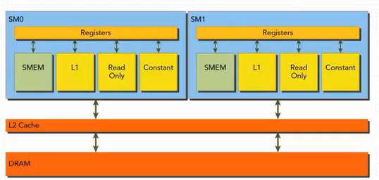

GPU缓存是不可编程的内存。

每个SM都有一个一级缓存，所有SM共享一个二级缓存。

L1缓存和L2缓存用来存储本地内存和全局内存的数据，也包括寄存器溢出的部分。

在GPU上只有内存加载可以被缓存，内存存储操作不能被缓存。

每个SM有一个只读常量缓存和只读纹理缓存，它们用于在设备内存中提高来自各自内存空间内的读取性能。

## L1缓存查询与设置
GPU全局内存是否支持L1缓存查询指令：
```cuda
cudaDeviceProp::globalL1CacheSupported
```

默认情况下，数据不会缓存在统一的L1/纹理缓存中，但可以通过编译指令启用缓存：

开启：
```bash
-Xptxas -dlcm=ca
```
除了带有禁用缓存修饰符的内联汇编修饰的数据外，所有读取都将被缓存。

开启：
```bash
-Xptxas -fscm=ca
```
所有数据读取都将被缓存。

## L1缓存与共享内存
计算能力为8.9的显卡为例：
1. 统一数据缓存大小为128KB，统一数据缓存包括共享内存、纹理内存和L1缓存
2. 共享内存从统一的数据缓存中分区出来，并且可以配置为各种大小，共享内存容量可设置为0，8，16，32，64和100KB，剩下的数据缓存用作L1缓存，也可由纹理单元使用
3. L1缓存与共享内存大小是可以进行配置的，但不一定生效，GPU会自动选择最优的配置

# 计算资源分配

## 线程执行资源分配
线程束本地执行上下文主要资源组成：
1. 程序计数器
2. 寄存器
3. 共享内存

SM处理的每个线程束计算所需的计算资源属于片上资源，因此从一个SM的执行上下文切换到另一个执行上下文是没有时间损耗的。

对于一个给定的内核，同时存在于同一个SM中的线程块和线程束数量取决于在SM中可用的内核所需寄存器和共享内存数量。

## 寄存器对线程数目的影响
每个线程消耗的寄存器越多，则可以放在一个SM中的线程束就越少。

如果减少内核消耗寄存器的数量，SM便可以同时处理更多的线程束。

线程数量对寄存器资源消耗图，区分计算密集型，内存密集型：

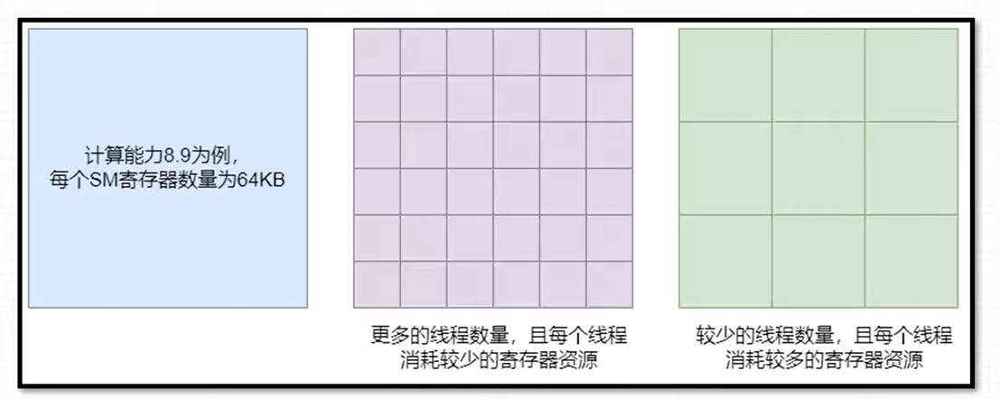

## 共享内存对线程块数量的影响
一个线程块消耗的共享内存越多，则在一个SM中可以同时处理的线程块就会变少。

如果每个线程块使用的共享内存数量变少，那么可以同时处理更多的线程块。

## SM占有率
当计算资源（如寄存器和共享内存）已分配给线程块时，线程块被称为活跃的块，线程块所包含的线程束被称为活跃的线程束，活跃线程束可分为以下3种类型：
1. 选定的线程束
2. 阻塞的线程束
3. 符合条件的线程束

占用率是每个SM中活跃的线程束占最大线程束的比值：
```
占用率 = 活跃线程束数量 / 最大线程束数量
```

计算能力为8.9的SM各指标数值：

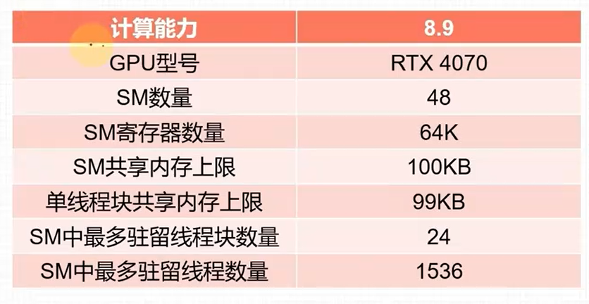

SM占有率计算能力6.9为例：
1. 一个SM最多拥有的线程块个数为Nb=24
2. 一个SM最多拥有的线程个数为Nt=1536

并行性规模足够大（即核函数执行配置中定义的总线程足够多）的前提下分析SM占有率：
1. 寄存器和共享内存使用很少的情况，线程块不小于64(Nt/Nb)时，可以获得100%的占有率
2. 有限寄存器对占有率的影响，当在SM上驻留最多的线程1536个，核函数中每个线程最多使用42个寄存器
3. 有限共享内存对占有率的影响，若线程块大小定义为64，每个SM需要激活24个线程块才能拥有1536个线程，达到100%的利用率每个线程块可分配4.16KB的共享内存

注意：如果一个线程块需要使用的共享内存超过了99KB，会导致核函数无法启动。

网格和线程块大小的准则：
1. 保持每个线程块中线程数量是线程束大小的倍数
2. 线程块不要设计的太小
3. 根据内核资源调整线程块的大小
4. 线程块的数量要远远大于SM的数量，保证设备有足够的并行

# 延迟隐藏

## 延迟隐藏的概念
指令延迟：在指令发出和完成之间的时钟周期被定义为指令延迟。

当每个时钟周期中所有线程束调度器都有一个符合条件的线程束时，可以达到计算资源的完全利用。

GPU的指令延迟被其他线程束的计算隐藏称为延迟隐藏。

指令可以被分为两种基本类型：
1. 算数指令
2. 内存指令

## 算术指令隐藏
算数运算指令延迟是从开始运算到得到计算结果的时钟周期，通常为4个时钟周期。

满足延迟隐藏所需的线程束数量，利用利特尔法则可以合理提供一个估计值：
```
所需线程束数量 ≈ 延迟 × 吞吐量
```

吞吐量是SM中每个时钟周期的操作数量确定的：
- 16-bit：所需线程束数量 = 512/32 = 16
- 32-bit：所需线程束数量 = 512/32 = 16
- 16-bit：所需线程束数量 = 8/32 = 1（8个操作也需要1个线程束）

提升算数指令并行性方法：
1. 线程中更多独立指令
2. 更多并发线程

## 内存指令隐藏
内存访问指令延迟是从命令发出到数据到达目的地的时钟周期，通常为400~800个时钟周期。

对内存操作来说，其所需的并行可以表示为在每个时钟周期内隐藏内存延迟所需的字节数。

| 指令延迟(周期) | GPU内存频率(GHz) | BandWidth(G/s) | BandWidth(B/cycle) | 内存操作字节数量(KB) |
| -------------- | ---------------- | -------------- | ------------------ | -------------------- |
| 800            | 10.0145          | 504.2          | 50                 | 39                   |

504.2G/s ÷ 10.0145GHz ≈ 50B/cycle
800 × 50 ÷ 1024 = 39KB

假设每个线程都把一个浮点数（4字节）从全局内存移动到SM中进行计算，则需要10000个线程或者313个线程束来隐藏所有内存延迟：
```
39KB ÷ 4字节/线程 ≈ 10000个线程
10000个线程 ÷ 32个线程/线程束 ≈ 313个线程束
```

# 避免线程束分化

## 线程束分支
GPU支持传统的、C/C++风格的显式控制流结构，如if...then...else、for和while。

GPU是相对简单的设备，没有复杂的分支预测机制。

一个线程束中的所有线程在同一个周期中必须执行相同的指令。

如果同一个线程束中的线程执行不同分支的指令，则会造成线程束分支。

线程束分支会降低GPU的并行计算能力，条件分支越多，并行性削弱越严重。

线程束分支只发生在同一个线程束中，不同线程束不会发生线程束分化。

为获取最佳性能，应避免在同一个线程束中有不同的执行路径。

例如：
```cuda
if ((tid / 32) % 2 == 0) {
    a = 10.0f;
} else {
    b = 20.0f;
}
```

## 并行规约计算
在向量中满足交换律和结合律的运算，称为规约问题，并行执行的规约计算称为并行规约计算。

领域并行计算、间域并行计算图示：

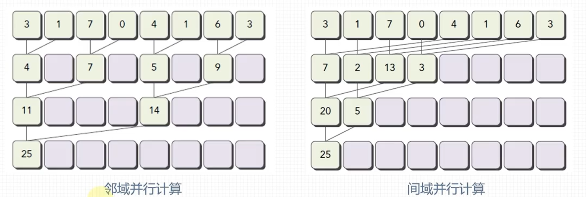

线程束分支与无线程束分支图示：

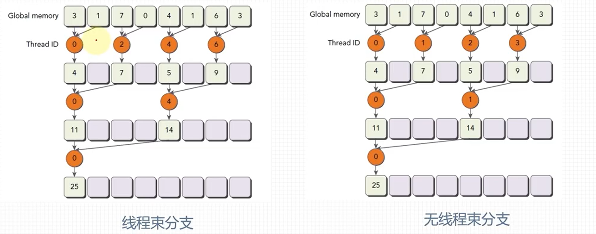

线程束分支：严重的线程束分化，例如设置512个线程的线程块，第一轮归约16个线程束都参与计算，每个线程束只有16个线程参与计算。接下来的计算依旧线程束分化。

无线程束分支：例如设置512个线程的线程块，前8个线程束进行第一轮归约，剩下8个线程束什么也不做；第二轮，前4个线程束执行归约，剩下12个线程束什么也不做；在最后5轮，数据的数量少于线程束大小时，同样会产生线程束分化。


# CUDA编程基础入门：从零开始掌握GPU并行计算

## 第一章：CUDA开发环境搭建与基础概念

### 1.1 GPU硬件信息查询

在开始CUDA编程之前，了解GPU硬件信息是至关重要的。NVIDIA提供了`nvidia-smi`（NVIDIA System Management Interface）工具来监控和管理GPU设备。

#### 1.1.1 常用GPU信息查询命令

```bash
# 显示所有GPU的概要信息
nvidia-smi

# 查询GPU的详细信息
nvidia-smi -q

# 查询特定GPU（如GPU 0）的详细信息
nvidia-smi -q -i 0

# 显示GPU的特定信息（如显存）
nvidia-smi -q -i 0 -d MEMORY

# 实时监控GPU状态（每秒刷新一次）
nvidia-smi -l 1
```

#### 1.1.2 nvidia-smi输出解读

以用户提供的输出为例：

```
+-----------------------------------------------------------------------------+
| NVIDIA-SMI 457.07       Driver Version: 457.07       CUDA Version: 11.1     |
|-------------------------------+----------------------+----------------------+
| GPU  Name            TCC/WDDM | Bus-Id        Disp.A | Volatile Uncorr. ECC |
| Fan  Temp  Perf  Pwr:Usage/Cap|         Memory-Usage | GPU-Util  Compute M. |
|                               |                      |               MIG M. |
|===============================+======================+======================|
|   0  GeForce GTX 1650   WDDM  | 00000000:01:00.0 Off |                  N/A |
| N/A   39C    P8     6W /  N/A |    134MiB /  4096MiB |      0%      Default |
|                               |                      |                  N/A |
+-------------------------------+----------------------+----------------------+
```

**关键信息解读：**

1. **驱动版本**：457.07
2. **CUDA版本**：11.1（表示此驱动支持的最高CUDA版本）
3. **GPU名称**：GeForce GTX 1650
4. **显示模式**：WDDM（Windows显示驱动模型）
5. **GPU温度**：39°C
6. **性能状态**：P8（低功耗状态）
7. **显存使用**：134MB / 4096MB（总显存4GB）
8. **GPU利用率**：0%

### 1.2 第一个CUDA程序：Hello World

让我们从一个最简单的CUDA程序开始，验证开发环境是否配置正确。

#### 1.2.1 CUDA Hello World程序

```cuda
// hello.cu - 第一个CUDA程序
#include <stdio.h>

// 核函数声明 - 在GPU上执行的函数
__global__ void helloFromGPU()
{
    // 每个线程打印自己的信息
    printf("Hello World from GPU! threadIdx.x = %d, blockIdx.x = %d\n", 
           threadIdx.x, blockIdx.x);
}

int main()
{
    printf("Hello World from CPU!\n");
    
    // 调用核函数
    // <<<网格大小, 线程块大小>>> 指定执行配置
    helloFromGPU<<<2, 5>>>();
    
    // 等待GPU执行完成
    cudaDeviceSynchronize();
    
    printf("CPU: GPU execution completed!\n");
    
    return 0;
}
```

#### 1.2.2 编译和运行

```bash
# 编译CUDA程序
nvcc hello.cu -o hello

# 运行程序
./hello
```

#### 1.2.3 输出示例

```
Hello World from CPU!
Hello World from GPU! threadIdx.x = 0, blockIdx.x = 0
Hello World from GPU! threadIdx.x = 1, blockIdx.x = 0
Hello World from GPU! threadIdx.x = 2, blockIdx.x = 0
Hello World from GPU! threadIdx.x = 3, blockIdx.x = 0
Hello World from GPU! threadIdx.x = 4, blockIdx.x = 0
Hello World from GPU! threadIdx.x = 0, blockIdx.x = 1
Hello World from GPU! threadIdx.x = 1, blockIdx.x = 1
Hello World from GPU! threadIdx.x = 2, blockIdx.x = 1
Hello World from GPU! threadIdx.x = 3, blockIdx.x = 1
Hello World from GPU! threadIdx.x = 4, blockIdx.x = 1
CPU: GPU execution completed!
```

## 第二章：CUDA编程模型核心概念

### 2.1 核函数（Kernel Function）

**核函数**是CUDA编程的核心概念，它是在GPU上并行执行的函数。

#### 2.1.1 核函数的特点和限制

```cuda
// 核函数的定义
__global__ void kernel_function(参数列表)
{
    // 核函数体
}

// 核函数的调用
kernel_function<<<grid_size, block_size>>>(参数列表);
```

**核函数的关键特性：**

1. **执行位置**：在GPU上并行执行
2. **修饰符**：必须使用`__global__`限定符修饰
3. **返回值**：必须返回`void`
4. **异步性**：核函数调用是异步的，CPU代码会继续执行而不等待核函数完成

**核函数的限制：**
- ❌ 只能访问GPU内存
- ❌ 不能使用变长参数
- ❌ 不能使用静态变量
- ❌ 不能使用函数指针
- ❌ 不支持C++的iostream
- ❌ 不能递归调用

#### 2.1.2 完整的CUDA程序结构

```cuda
#include <stdio.h>

// 核函数定义
__global__ void myKernel(int *data)
{
    int idx = threadIdx.x + blockIdx.x * blockDim.x;
    data[idx] = idx * 2;
}

int main()
{
    // 1. 设置GPU设备（可选）
    cudaSetDevice(0);
    
    // 2. 定义问题规模
    const int N = 256;
    size_t size = N * sizeof(int);
    
    // 3. 分配主机内存
    int *h_data = (int*)malloc(size);
    
    // 4. 分配设备内存
    int *d_data;
    cudaMalloc(&d_data, size);
    
    // 5. 初始化主机数据
    for(int i = 0; i < N; i++) {
        h_data[i] = 0;
    }
    
    // 6. 将数据从主机复制到设备
    cudaMemcpy(d_data, h_data, size, cudaMemcpyHostToDevice);
    
    // 7. 调用核函数
    int threadsPerBlock = 256;
    int blocksPerGrid = (N + threadsPerBlock - 1) / threadsPerBlock;
    myKernel<<<blocksPerGrid, threadsPerBlock>>>(d_data);
    
    // 8. 将结果从设备复制回主机
    cudaMemcpy(h_data, d_data, size, cudaMemcpyDeviceToHost);
    
    // 9. 验证结果
    printf("First 10 results:\n");
    for(int i = 0; i < 10; i++) {
        printf("h_data[%d] = %d\n", i, h_data[i]);
    }
    
    // 10. 释放内存
    free(h_data);
    cudaFree(d_data);
    
    return 0;
}
```

### 2.2 CUDA线程模型

CUDA线程模型是理解并行计算的基础，它采用**网格(Grid)-线程块(Block)-线程(Thread)**的三级层次结构。

#### 2.2.1 线程模型层次结构

```
Grid (网格)
├── Block 0 (线程块0)
│   ├── Thread (0,0,0)
│   ├── Thread (0,1,0)
│   └── ...
├── Block 1 (线程块1)
│   ├── Thread (0,0,0)
│   ├── Thread (0,1,0)
│   └── ...
└── ...
```

**关键概念：**
- **网格(Grid)**：最高层次的线程组织，包含多个线程块
- **线程块(Block)**：中间层次的线程组织，包含多个线程
- **线程(Thread)**：最基本的执行单元

#### 2.2.2 内建变量

CUDA提供了一系列内建变量来标识线程：

| 变量名      | 描述                           | 维度        |
| ----------- | ------------------------------ | ----------- |
| `gridDim`   | 网格维度（线程块数量）         | 三维(x,y,z) |
| `blockDim`  | 线程块维度（每个块中的线程数） | 三维(x,y,z) |
| `blockIdx`  | 线程块在网格中的索引           | 三维(x,y,z) |
| `threadIdx` | 线程在线程块中的索引           | 三维(x,y,z) |

**注意**：未指定的维度默认为1。例如，`<<<10, 32>>>`表示：
- `gridDim.x = 10`, `gridDim.y = 1`, `gridDim.z = 1`
- `blockDim.x = 32`, `blockDim.y = 1`, `blockDim.z = 1`

#### 2.2.3 线程索引计算

**一维网格 + 一维线程块**（最常用的情况）：
```cuda
int threadId = blockIdx.x * blockDim.x + threadIdx.x;
```

**二维网格 + 二维线程块**：
```cuda
int row = blockIdx.y * blockDim.y + threadIdx.y;
int col = blockIdx.x * blockDim.x + threadIdx.x;
int threadId = row * (gridDim.x * blockDim.x) + col;
```

**三维网格 + 三维线程块**：
```cuda
int x = blockIdx.x * blockDim.x + threadIdx.x;
int y = blockIdx.y * blockDim.y + threadIdx.y;
int z = blockIdx.z * blockDim.z + threadIdx.z;
int threadId = z * (gridDim.y * blockDim.y * gridDim.x * blockDim.x) 
               + y * (gridDim.x * blockDim.x) 
               + x;
```

### 2.3 线程配置与限制

#### 2.3.1 线程配置语法

```cuda
// 方法1：使用整数（一维配置）
kernel<<<grid_size, block_size>>>(args);

// 方法2：使用dim3结构体（多维配置）
dim3 grid_size(Gx, Gy, Gz);
dim3 block_size(Bx, By, Bz);
kernel<<<grid_size, block_size>>>(args);
```

#### 2.3.2 硬件限制

不同架构的GPU有不同的限制，以下是一些常见的限制：

| 资源                     | 计算能力3.x | 计算能力5.x | 计算能力6.x | 计算能力7.x | 计算能力8.x |
| ------------------------ | ----------- | ----------- | ----------- | ----------- | ----------- |
| 每个线程块的最大线程数   | 1024        | 1024        | 1024        | 1024        | 1024        |
| 每个SM的最大线程块数     | 16          | 32          | 32          | 32          | 32          |
| 每个SM的最大线程数       | 2048        | 2048        | 2048        | 1024        | 1536/1024   |
| 每个线程块的最大共享内存 | 48KB        | 64KB        | 64KB        | 64KB        | 99KB/163KB  |
| 每个线程的最大寄存器数   | 63          | 255         | 255         | 255         | 255         |

**重要限制规则：**
1. **线程块大小**：最大为1024个线程
2. **网格大小**：
   - 一维：最大2³¹-1个线程块
   - 二维：每维最大65535个线程块
   - 三维：每维最大65535个线程块
3. **线程块形状**：
   - blockDim.x ≤ 1024
   - blockDim.y ≤ 1024
   - blockDim.z ≤ 64
   - blockDim.x × blockDim.y × blockDim.z ≤ 1024

#### 2.3.3 线程配置最佳实践

```cuda
#include <stdio.h>

// 演示不同线程配置的核函数
__global__ void threadConfigDemo(float *data, int nx, int ny)
{
    // 方法1：一维索引（适用于一维数据）
    int idx_1d = blockIdx.x * blockDim.x + threadIdx.x;
    
    // 方法2：二维索引（适用于二维数据，如图像、矩阵）
    int ix = blockIdx.x * blockDim.x + threadIdx.x;
    int iy = blockIdx.y * blockDim.y + threadIdx.y;
    int idx_2d = iy * nx + ix;
    
    // 方法3：使用内置函数计算全局索引
    int idx = threadIdx.x + threadIdx.y * blockDim.x 
              + (blockIdx.x + blockIdx.y * gridDim.x) * (blockDim.x * blockDim.y);
    
    // 边界检查
    if (ix < nx && iy < ny) {
        data[idx_2d] = idx_2d * 0.1f;
    }
}

int main()
{
    const int nx = 512;
    const int ny = 512;
    const int N = nx * ny;
    size_t size = N * sizeof(float);
    
    // 分配内存
    float *h_data = (float*)malloc(size);
    float *d_data;
    cudaMalloc(&d_data, size);
    
    // 配置线程
    // 对于512x512的矩阵，使用16x16的线程块
    dim3 block_size(16, 16);
    dim3 grid_size((nx + block_size.x - 1) / block_size.x,
                   (ny + block_size.y - 1) / block_size.y);
    
    printf("Grid size: (%d, %d, %d)\n", grid_size.x, grid_size.y, grid_size.z);
    printf("Block size: (%d, %d, %d)\n", block_size.x, block_size.y, block_size.z);
    printf("Total threads: %d\n", grid_size.x * grid_size.y * block_size.x * block_size.y);
    
    // 调用核函数
    threadConfigDemo<<<grid_size, block_size>>>(d_data, nx, ny);
    
    // 复制回数据并验证
    cudaMemcpy(h_data, d_data, size, cudaMemcpyDeviceToHost);
    
    // 验证前10个元素
    for(int i = 0; i < 10; i++) {
        printf("h_data[%d] = %.2f\n", i, h_data[i]);
    }
    
    // 清理
    free(h_data);
    cudaFree(d_data);
    
    return 0;
}
```

## 第三章：CUDA编译与GPU架构

### 3.1 nvcc编译流程详解

NVCC（NVIDIA CUDA Compiler Driver）是CUDA的编译器驱动程序，它将CUDA代码编译为可在GPU上执行的二进制代码。

#### 3.1.1 编译流程图解

```
源代码 (.cu)
    │
    ├─ 主机代码 (C/C++) ────► 主机编译器 (gcc/msvc) ────► 主机目标代码
    │
    └─ 设备代码 (CUDA) ────► 设备编译器 (nvcc) ────► PTX代码 (.ptx)
                                │                        │
                                │                        ├─► 即时编译 (JIT) ────► GPU二进制
                                │                        │
                                └─► 离线编译 ─────────────┘
                                     │
                                     └─► cubin二进制 (.cubin)
```

#### 3.1.2 编译命令详解

```bash
# 基本编译
nvcc hello.cu -o hello

# 指定计算能力
nvcc hello.cu -o hello -arch=compute_61 -code=sm_61

# 指定多个计算能力（生成胖二进制文件）
nvcc hello.cu -o hello \
  -gencode arch=compute_35,code=sm_35 \
  -gencode arch=compute_50,code=sm_50 \
  -gencode arch=compute_61,code=sm_61 \
  -gencode arch=compute_70,code=sm_70

# 开启所有警告和调试信息
nvcc hello.cu -o hello -G -g -lineinfo -Wno-deprecated-gpu-targets

# 指定包含目录和库目录
nvcc hello.cu -o hello -I/path/to/include -L/path/to/lib -lcudart
```

#### 3.1.3 PTX（Parallel Thread Execution）

PTX是CUDA的中间汇编语言，它允许代码在具有不同计算能力的GPU上运行。

```ptx
// 示例PTX代码
.visible .entry helloKernel(
    .param .u64 helloKernel_param_0
)
{
    .reg .pred  %p<2>;
    .reg .b32   %r<5>;
    .reg .b64   %rd<4>;
    
    ld.param.u64    %rd1, [helloKernel_param_0];
    cvta.to.global.u64  %rd2, %rd1;
    mov.u32     %r1, %tid.x;
    mov.u32     %r2, %ctaid.x;
    mov.u32     %r3, %ntid.x;
    mad.lo.s32  %r4, %r2, %r3, %r1;
    mul.wide.s32    %rd3, %r4, 4;
    add.s64     %rd4, %rd2, %rd3;
    st.global.f32   [%rd4], 0f3F800000;
    ret;
}
```

### 3.2 GPU架构与计算能力

#### 3.2.1 NVIDIA GPU架构演进

| 架构名称 | 计算能力 | 发布年份 | 关键特性                  |
| -------- | -------- | -------- | ------------------------- |
| Tesla    | 1.x      | 2006     | 第一代CUDA架构            |
| Fermi    | 2.x      | 2010     | ECC内存支持，并发内核执行 |
| Kepler   | 3.x      | 2012     | 动态并行，Hyper-Q         |
| Maxwell  | 5.x      | 2014     | 能效大幅提升              |
| Pascal   | 6.x      | 2016     | NVLink，统一内存          |
| Volta    | 7.0      | 2017     | Tensor Core，独立线程调度 |
| Turing   | 7.5      | 2018     | RT Core，混合精度         |
| Ampere   | 8.x      | 2020     | 第三代Tensor Core         |
| Hopper   | 9.x      | 2022     | 第四代Tensor Core，传输器 |

#### 3.2.2 计算能力指定与兼容性

```cuda
// 代码示例：根据计算能力使用不同特性
__global__ void featureDemo()
{
#if __CUDA_ARCH__ >= 700
    // Volta及以上架构的特性
    __activemask();
#endif
    
#if __CUDA_ARCH__ >= 800
    // Ampere及以上架构的特性
    // 例如：异步拷贝等
#endif
    
    // 通用代码
    int idx = threadIdx.x + blockIdx.x * blockDim.x;
}
```

#### 3.2.3 查询GPU计算能力

```cuda
#include <stdio.h>

int main()
{
    int deviceCount;
    cudaGetDeviceCount(&deviceCount);
    
    for(int dev = 0; dev < deviceCount; dev++) {
        cudaDeviceProp deviceProp;
        cudaGetDeviceProperties(&deviceProp, dev);
        
        printf("\nDevice %d: \"%s\"\n", dev, deviceProp.name);
        printf("  Compute Capability: %d.%d\n", 
               deviceProp.major, deviceProp.minor);
        printf("  Total Global Memory: %.0f MB\n", 
               deviceProp.totalGlobalMem / (1024.0 * 1024.0));
        printf("  Multiprocessors: %d\n", deviceProp.multiProcessorCount);
        printf("  Max Threads per Block: %d\n", deviceProp.maxThreadsPerBlock);
        printf("  Max Threads per SM: %d\n", deviceProp.maxThreadsPerMultiProcessor);
        printf("  Shared Memory per Block: %lu KB\n", 
               deviceProp.sharedMemPerBlock / 1024);
        printf("  Warp Size: %d\n", deviceProp.warpSize);
    }
    
    return 0;
}
```

## 第四章：CUDA内存模型与内存管理

### 4.1 CUDA内存层次结构

CUDA提供了多层次的内存结构，每种内存有不同的特性、访问速度和用途。

#### 4.1.1 内存层次图

```
GPU内存层次结构
├── 寄存器 (Register) - 最快，线程私有
├── 共享内存 (Shared Memory) - 很快，线程块共享
├── 本地内存 (Local Memory) - 慢，线程私有（实际在全局内存）
├── 常量内存 (Constant Memory) - 有缓存，只读
├── 纹理内存 (Texture Memory) - 有缓存，优化访问模式
└── 全局内存 (Global Memory) - 最慢，所有线程可访问
```

#### 4.1.2 内存特性对比表

| 内存类型 | 位置 | 缓存     | 访问权限 | 作用域 | 生命周期 | 速度 |
| -------- | ---- | -------- | -------- | ------ | -------- | ---- |
| 寄存器   | 片上 | 无       | 读写     | 线程   | 线程     | 最快 |
| 本地内存 | 片外 | L1/L2    | 读写     | 线程   | 线程     | 慢   |
| 共享内存 | 片上 | 无       | 读写     | 块     | 块       | 快   |
| 常量内存 | 片外 | 常量缓存 | 只读     | 全局   | 应用     | 中等 |
| 纹理内存 | 片外 | 纹理缓存 | 只读     | 全局   | 应用     | 中等 |
| 全局内存 | 片外 | L1/L2    | 读写     | 全局   | 应用     | 最慢 |

### 4.2 全局内存管理

全局内存是容量最大、使用最频繁的GPU内存。

#### 4.2.1 全局内存分配与释放

```cuda
#include <stdio.h>
#include <stdlib.h>
#include <cuda_runtime.h>

// 错误检查宏
#define CUDA_CHECK(call) \
{ \
    cudaError_t error = call; \
    if(error != cudaSuccess) { \
        printf("CUDA Error: %s:%d, ", __FILE__, __LINE__); \
        printf("code:%d, reason: %s\n", error, cudaGetErrorString(error)); \
        exit(1); \
    } \
}

int main()
{
    const size_t N = 1024;
    const size_t size = N * sizeof(float);
    
    // 主机内存分配
    float *h_array = (float*)malloc(size);
    if(!h_array) {
        printf("Host memory allocation failed!\n");
        return -1;
    }
    
    // 初始化主机数据
    for(size_t i = 0; i < N; i++) {
        h_array[i] = (float)i;
    }
    
    // 设备内存分配
    float *d_array = nullptr;
    CUDA_CHECK(cudaMalloc(&d_array, size));
    
    // 数据从主机复制到设备
    CUDA_CHECK(cudaMemcpy(d_array, h_array, size, cudaMemcpyHostToDevice));
    
    // 数据从设备复制回主机
    float *h_result = (float*)malloc(size);
    CUDA_CHECK(cudaMemcpy(h_result, d_array, size, cudaMemcpyDeviceToHost));
    
    // 验证数据
    bool success = true;
    for(size_t i = 0; i < N; i++) {
        if(h_array[i] != h_result[i]) {
            printf("Mismatch at index %zu: %f != %f\n", 
                   i, h_array[i], h_result[i]);
            success = false;
            break;
        }
    }
    
    if(success) {
        printf("Memory operations completed successfully!\n");
    }
    
    // 清理
    free(h_array);
    free(h_result);
    CUDA_CHECK(cudaFree(d_array));
    
    return 0;
}
```

#### 4.2.2 统一内存（Unified Memory）

CUDA 6.0引入了统一内存概念，简化了内存管理。

```cuda
#include <stdio.h>
#include <cuda_runtime.h>

__global__ void initArray(float *data, int n)
{
    int idx = threadIdx.x + blockIdx.x * blockDim.x;
    if(idx < n) {
        data[idx] = idx * 0.5f;
    }
}

int main()
{
    const int N = 1024;
    float *data;
    
    // 分配统一内存
    cudaMallocManaged(&data, N * sizeof(float));
    
    // 初始化数据
    int threadsPerBlock = 256;
    int blocksPerGrid = (N + threadsPerBlock - 1) / threadsPerBlock;
    initArray<<<blocksPerGrid, threadsPerBlock>>>(data, N);
    
    // 等待GPU完成
    cudaDeviceSynchronize();
    
    // 在主机上访问数据（自动迁移）
    printf("First 10 elements:\n");
    for(int i = 0; i < 10; i++) {
        printf("data[%d] = %.2f\n", i, data[i]);
    }
    
    // 清理
    cudaFree(data);
    
    return 0;
}
```

### 4.3 共享内存使用

共享内存是线程块内共享的快速内存，适合用于线程间通信和数据重用。

#### 4.3.1 静态共享内存

```cuda
#include <stdio.h>

// 使用静态共享内存的矩阵乘法
__global__ void matrixMulShared(float *C, float *A, float *B, 
                                int M, int N, int K)
{
    // 定义共享内存块
    __shared__ float As[TILE_SIZE][TILE_SIZE];
    __shared__ float Bs[TILE_SIZE][TILE_SIZE];
    
    // 计算线程的全局索引
    int row = blockIdx.y * blockDim.y + threadIdx.y;
    int col = blockIdx.x * blockDim.x + threadIdx.x;
    
    float sum = 0.0f;
    
    // 循环处理图块
    for(int tile = 0; tile < (K + TILE_SIZE - 1) / TILE_SIZE; tile++) {
        // 协作加载数据到共享内存
        int loadRow = blockIdx.y * TILE_SIZE + threadIdx.y;
        int loadCol = tile * TILE_SIZE + threadIdx.x;
        
        if(loadRow < M && loadCol < K) {
            As[threadIdx.y][threadIdx.x] = A[loadRow * K + loadCol];
        } else {
            As[threadIdx.y][threadIdx.x] = 0.0f;
        }
        
        loadRow = tile * TILE_SIZE + threadIdx.y;
        loadCol = blockIdx.x * TILE_SIZE + threadIdx.x;
        
        if(loadRow < K && loadCol < N) {
            Bs[threadIdx.y][threadIdx.x] = B[loadRow * N + loadCol];
        } else {
            Bs[threadIdx.y][threadIdx.x] = 0.0f;
        }
        
        // 等待所有线程完成数据加载
        __syncthreads();
        
        // 计算部分和
        for(int k = 0; k < TILE_SIZE; k++) {
            sum += As[threadIdx.y][k] * Bs[k][threadIdx.x];
        }
        
        // 等待所有线程完成计算
        __syncthreads();
    }
    
    // 写回结果
    if(row < M && col < N) {
        C[row * N + col] = sum;
    }
}

// 常量定义
#define TILE_SIZE 16

int main()
{
    const int M = 512;
    const int N = 512;
    const int K = 512;
    
    // 分配和初始化内存
    // ...（省略内存分配和初始化代码）
    
    // 配置线程
    dim3 blockDim(TILE_SIZE, TILE_SIZE);
    dim3 gridDim((N + TILE_SIZE - 1) / TILE_SIZE,
                 (M + TILE_SIZE - 1) / TILE_SIZE);
    
    // 执行核函数
    matrixMulShared<<<gridDim, blockDim>>>(d_C, d_A, d_B, M, N, K);
    
    // ...（省略验证和清理代码）
    
    return 0;
}
```

#### 4.3.2 动态共享内存

```cuda
#include <stdio.h>

// 使用动态共享内存的核函数
__global__ void dynamicSharedMemoryKernel(float *output, int size)
{
    // 声明动态共享内存（大小在运行时确定）
    extern __shared__ float shared_data[];
    
    int tid = threadIdx.x + blockIdx.x * blockDim.x;
    int local_tid = threadIdx.x;
    
    // 将全局数据加载到共享内存
    if(tid < size) {
        shared_data[local_tid] = output[tid] * 2.0f;
    }
    
    // 同步线程块内的所有线程
    __syncthreads();
    
    // 处理共享内存中的数据
    // 示例：线程块内求和归约
    for(int stride = blockDim.x / 2; stride > 0; stride >>= 1) {
        if(local_tid < stride) {
            shared_data[local_tid] += shared_data[local_tid + stride];
        }
        __syncthreads();
    }
    
    // 第一个线程写回结果
    if(local_tid == 0 && tid < size) {
        output[blockIdx.x] = shared_data[0];
    }
}

int main()
{
    const int N = 1024;
    const int block_size = 256;
    const int grid_size = (N + block_size - 1) / block_size;
    
    // 计算动态共享内存大小（每个线程块）
    size_t shared_mem_size = block_size * sizeof(float);
    
    // 分配和初始化内存
    float *h_data = (float*)malloc(N * sizeof(float));
    float *d_data;
    
    for(int i = 0; i < N; i++) {
        h_data[i] = (float)i;
    }
    
    cudaMalloc(&d_data, N * sizeof(float));
    cudaMemcpy(d_data, h_data, N * sizeof(float), cudaMemcpyHostToDevice);
    
    // 调用核函数，传递动态共享内存大小
    dynamicSharedMemoryKernel<<<grid_size, block_size, shared_mem_size>>>(d_data, N);
    
    // ...（省略验证和清理代码）
    
    return 0;
}
```

### 4.4 常量内存和纹理内存

#### 4.4.1 常量内存使用

```cuda
#include <stdio.h>

// 常量内存声明（必须在函数外部）
__constant__ float constant_data[1024];

// 使用常量内存的核函数
__global__ void constantMemoryKernel(float *output, int n)
{
    int idx = threadIdx.x + blockIdx.x * blockDim.x;
    if(idx < n) {
        // 常量内存访问（有缓存，适合广播读取）
        output[idx] = constant_data[idx % 1024] * idx;
    }
}

int main()
{
    const int N = 4096;
    
    // 准备常量数据
    float h_constant_data[1024];
    for(int i = 0; i < 1024; i++) {
        h_constant_data[i] = sinf(i * 0.01f);
    }
    
    // 将数据复制到常量内存
    cudaMemcpyToSymbol(constant_data, h_constant_data, 1024 * sizeof(float));
    
    // 分配设备内存
    float *d_output;
    cudaMalloc(&d_output, N * sizeof(float));
    
    // 执行核函数
    int threads = 256;
    int blocks = (N + threads - 1) / threads;
    constantMemoryKernel<<<blocks, threads>>>(d_output, N);
    
    // ...（省略验证和清理代码）
    
    return 0;
}
```

#### 4.4.2 纹理内存使用

```cuda
#include <stdio.h>
#include <cuda_runtime.h>

// 纹理引用声明
texture<float, 1, cudaReadModeElementType> tex_ref;

// 使用纹理内存的核函数
__global__ void textureMemoryKernel(float *output, int n)
{
    int idx = threadIdx.x + blockIdx.x * blockDim.x;
    if(idx < n) {
        // 纹理内存访问（有缓存，适合空间局部性访问）
        float value = tex1Dfetch(tex_ref, idx);
        output[idx] = value * 2.0f;
    }
}

int main()
{
    const int N = 1024;
    
    // 分配和初始化CUDA数组
    cudaArray *cu_array;
    cudaChannelFormatDesc channel_desc = cudaCreateChannelDesc<float>();
    cudaMallocArray(&cu_array, &channel_desc, N);
    
    float h_data[N];
    for(int i = 0; i < N; i++) {
        h_data[i] = cosf(i * 0.01f);
    }
    
    cudaMemcpyToArray(cu_array, 0, 0, h_data, N * sizeof(float), cudaMemcpyHostToDevice);
    
    // 配置纹理引用
    tex_ref.addressMode[0] = cudaAddressModeWrap;
    tex_ref.filterMode = cudaFilterModeLinear;
    tex_ref.normalized = false;
    
    // 绑定纹理
    cudaBindTextureToArray(tex_ref, cu_array);
    
    // 分配设备内存
    float *d_output;
    cudaMalloc(&d_output, N * sizeof(float));
    
    // 执行核函数
    textureMemoryKernel<<<(N + 256 - 1) / 256, 256>>>(d_output, N);
    
    // 解绑纹理
    cudaUnbindTexture(tex_ref);
    
    // ...（省略验证和清理代码）
    
    // 清理
    cudaFreeArray(cu_array);
    cudaFree(d_output);
    
    return 0;
}
```

## 第五章：CUDA错误处理与性能分析

### 5.1 完善的错误检查机制

#### 5.1.1 错误检查宏

```cuda
#include <stdio.h>
#include <cuda_runtime.h>

// 基础错误检查宏
#define CUDA_CHECK(call) \
do { \
    cudaError_t error = call; \
    if(error != cudaSuccess) { \
        fprintf(stderr, "CUDA Error at %s:%d\n", __FILE__, __LINE__); \
        fprintf(stderr, "  Code: %d, Reason: %s\n", error, cudaGetErrorString(error)); \
        exit(EXIT_FAILURE); \
    } \
} while(0)

// 核函数错误检查宏
#define CHECK_KERNEL() \
do { \
    cudaError_t error = cudaGetLastError(); \
    if(error != cudaSuccess) { \
        fprintf(stderr, "Kernel Error at %s:%d\n", __FILE__, __LINE__); \
        fprintf(stderr, "  Code: %d, Reason: %s\n", error, cudaGetErrorString(error)); \
        exit(EXIT_FAILURE); \
    } \
} while(0)

// 设备同步错误检查
#define CHECK_SYNC() \
do { \
    cudaError_t error = cudaDeviceSynchronize(); \
    if(error != cudaSuccess && error != cudaErrorNotReady) { \
        fprintf(stderr, "Sync Error at %s:%d\n", __FILE__, __LINE__); \
        fprintf(stderr, "  Code: %d, Reason: %s\n", error, cudaGetErrorString(error)); \
        exit(EXIT_FAILURE); \
    } \
} while(0)

// 完整的错误检查示例
void comprehensiveErrorCheckExample()
{
    int *d_data = nullptr;
    size_t size = 1024 * sizeof(int);
    
    // 1. 内存分配错误检查
    CUDA_CHECK(cudaMalloc(&d_data, size));
    
    // 2. 内存复制错误检查
    int *h_data = (int*)malloc(size);
    CUDA_CHECK(cudaMemcpy(d_data, h_data, size, cudaMemcpyHostToDevice));
    
    // 3. 核函数调用和错误检查
    dim3 block(256);
    dim3 grid((1024 + block.x - 1) / block.x);
    
    // 假设有一个核函数
    // myKernel<<<grid, block>>>(d_data);
    
    // 4. 检查核函数启动错误
    CHECK_KERNEL();
    
    // 5. 检查核函数执行错误
    CHECK_SYNC();
    
    // 6. 清理
    CUDA_CHECK(cudaFree(d_data));
    free(h_data);
}
```

#### 5.1.2 错误代码枚举

```cuda
#include <stdio.h>

void printCommonCudaErrors()
{
    printf("Common CUDA Error Codes:\n");
    printf("  cudaSuccess: %d - Operation completed successfully\n", cudaSuccess);
    printf("  cudaErrorInvalidValue: %d - Invalid argument value\n", cudaErrorInvalidValue);
    printf("  cudaErrorMemoryAllocation: %d - Memory allocation failed\n", cudaErrorMemoryAllocation);
    printf("  cudaErrorInitializationError: %d - Initialization error\n", cudaErrorInitializationError);
    printf("  cudaErrorInvalidDevice: %d - Invalid device ordinal\n", cudaErrorInvalidDevice);
    printf("  cudaErrorInvalidDevicePointer: %d - Invalid device pointer\n", cudaErrorInvalidDevicePointer);
    printf("  cudaErrorInvalidMemcpyDirection: %d - Invalid memory copy direction\n", cudaErrorInvalidMemcpyDirection);
    printf("  cudaErrorDeviceUninitialized: %d - Device uninitialized\n", cudaErrorDeviceUninitialized);
    printf("  cudaErrorNoDevice: %d - No CUDA-capable device available\n", cudaErrorNoDevice);
    printf("  cudaErrorInsufficientDriver: %d - Insufficient driver version\n", cudaErrorInsufficientDriver);
}
```

### 5.2 CUDA事件计时

#### 5.2.1 事件计时基础

```cuda
#include <stdio.h>
#include <cuda_runtime.h>

// 使用CUDA事件计时
void eventTimingExample()
{
    cudaEvent_t start, stop;
    float elapsed_time_ms;
    
    // 创建事件
    CUDA_CHECK(cudaEventCreate(&start));
    CUDA_CHECK(cudaEventCreate(&stop));
    
    // 记录开始事件
    CUDA_CHECK(cudaEventRecord(start, 0));
    
    // 执行一些CUDA操作
    // 例如：内存分配、复制、核函数执行等
    
    // 模拟一些工作
    int *d_data;
    size_t size = 1024 * 1024 * sizeof(float);  // 4MB
    CUDA_CHECK(cudaMalloc(&d_data, size));
    
    // 记录停止事件
    CUDA_CHECK(cudaEventRecord(stop, 0));
    
    // 等待事件完成
    CUDA_CHECK(cudaEventSynchronize(stop));
    
    // 计算耗时
    CUDA_CHECK(cudaEventElapsedTime(&elapsed_time_ms, start, stop));
    
    printf("Execution time: %.3f ms\n", elapsed_time_ms);
    
    // 清理
    CUDA_CHECK(cudaEventDestroy(start));
    CUDA_CHECK(cudaEventDestroy(stop));
    CUDA_CHECK(cudaFree(d_data));
}
```

#### 5.2.2 封装计时工具类

```cuda
#include <stdio.h>
#include <cuda_runtime.h>

class CudaTimer {
private:
    cudaEvent_t start_event;
    cudaEvent_t stop_event;
    bool started;
    bool stopped;
    
public:
    CudaTimer() : started(false), stopped(false) {
        cudaEventCreate(&start_event);
        cudaEventCreate(&stop_event);
    }
    
    ~CudaTimer() {
        cudaEventDestroy(start_event);
        cudaEventDestroy(stop_event);
    }
    
    void start(cudaStream_t stream = 0) {
        cudaEventRecord(start_event, stream);
        started = true;
        stopped = false;
    }
    
    void stop(cudaStream_t stream = 0) {
        cudaEventRecord(stop_event, stream);
        stopped = true;
    }
    
    float elapsed() {
        if(!started || !stopped) {
            return 0.0f;
        }
        
        cudaEventSynchronize(stop_event);
        float elapsed_ms = 0.0f;
        cudaEventElapsedTime(&elapsed_ms, start_event, stop_event);
        return elapsed_ms;
    }
    
    void print(const char* label) {
        float time = elapsed();
        printf("%s: %.3f ms\n", label, time);
    }
};

// 使用示例
void timerUsageExample()
{
    CudaTimer timer;
    const int N = 1024 * 1024;
    size_t size = N * sizeof(float);
    
    // 计时内存分配
    timer.start();
    float *d_data;
    cudaMalloc(&d_data, size);
    timer.stop();
    timer.print("Memory allocation");
    
    // 计时内存复制
    float *h_data = (float*)malloc(size);
    timer.start();
    cudaMemcpy(d_data, h_data, size, cudaMemcpyHostToDevice);
    timer.stop();
    timer.print("Host to Device copy");
    
    // 清理
    free(h_data);
    cudaFree(d_data);
}
```

### 5.3 nvprof性能分析

#### 5.3.1 nvprof基础使用

```bash
# 基础性能分析
nvprof ./my_cuda_program

# 分析特定指标
nvprof --metrics gld_throughput ./my_cuda_program
nvprof --metrics gst_throughput ./my_cuda_program
nvprof --metrics dram_utilization ./my_cuda_program

# 分析事件
nvprof --events inst_executed ./my_cuda_program

# 输出到文件
nvprof -o profile.nvvp ./my_cuda_program

# 分析多个GPU
nvprof --devices 0,1 ./my_cuda_program

# 时间线分析
nvprof --print-gpu-trace ./my_cuda_program
```

#### 5.3.2 性能分析代码示例

```cuda
#include <stdio.h>
#include <cuda_runtime.h>
#include <math.h>

// 优化前的核函数（低效版本）
__global__ void inefficientKernel(float *data, int n)
{
    int idx = threadIdx.x + blockIdx.x * blockDim.x;
    if(idx < n) {
        // 非合并访问模式
        for(int i = 0; i < 100; i++) {
            data[(idx * 31) % n] += sinf(idx * 0.01f) * cosf(i * 0.1f);
        }
    }
}

// 优化后的核函数（高效版本）
__global__ void efficientKernel(float *data, int n)
{
    int idx = threadIdx.x + blockIdx.x * blockDim.x;
    if(idx < n) {
        // 合并访问模式
        float value = 0.0f;
        for(int i = 0; i < 100; i++) {
            value += sinf(idx * 0.01f) * cosf(i * 0.1f);
        }
        data[idx] += value;
    }
}

int main()
{
    const int N = 1024 * 1024;
    size_t size = N * sizeof(float);
    
    // 分配内存
    float *h_data = (float*)malloc(size);
    float *d_data1, *d_data2;
    
    cudaMalloc(&d_data1, size);
    cudaMalloc(&d_data2, size);
    
    // 初始化数据
    for(int i = 0; i < N; i++) {
        h_data[i] = 0.0f;
    }
    
    cudaMemcpy(d_data1, h_data, size, cudaMemcpyHostToDevice);
    cudaMemcpy(d_data2, h_data, size, cudaMemcpyHostToDevice);
    
    // 配置线程
    int threads = 256;
    int blocks = (N + threads - 1) / threads;
    
    printf("Performance comparison:\n");
    printf("=======================\n");
    
    // 运行低效版本
    {
        CudaTimer timer;
        timer.start();
        inefficientKernel<<<blocks, threads>>>(d_data1, N);
        cudaDeviceSynchronize();
        timer.stop();
        timer.print("Inefficient kernel");
    }
    
    // 运行高效版本
    {
        CudaTimer timer;
        timer.start();
        efficientKernel<<<blocks, threads>>>(d_data2, N);
        cudaDeviceSynchronize();
        timer.stop();
        timer.print("Efficient kernel");
    }
    
    // 验证结果
    float *h_result1 = (float*)malloc(size);
    float *h_result2 = (float*)malloc(size);
    
    cudaMemcpy(h_result1, d_data1, size, cudaMemcpyDeviceToHost);
    cudaMemcpy(h_result2, d_data2, size, cudaMemcpyDeviceToHost);
    
    // 简单验证
    printf("\nVerification:\n");
    float sum1 = 0.0f, sum2 = 0.0f;
    for(int i = 0; i < 10; i++) {
        sum1 += h_result1[i];
        sum2 += h_result2[i];
    }
    printf("First 10 elements sum - Inefficient: %.6f, Efficient: %.6f\n", 
           sum1, sum2);
    
    // 清理
    free(h_data);
    free(h_result1);
    free(h_result2);
    cudaFree(d_data1);
    cudaFree(d_data2);
    
    return 0;
}
```

#### 5.3.3 性能分析指标解读

```cuda
#include <stdio.h>

void explainPerformanceMetrics()
{
    printf("\n=== CUDA性能指标解释 ===\n\n");
    
    printf("1. 内存相关指标:\n");
    printf("   - gld_throughput: 全局加载吞吐量 (GB/s)\n");
    printf("   - gst_throughput: 全局存储吞吐量 (GB/s)\n");
    printf("   - dram_utilization: DRAM利用率\n");
    printf("   - l2_utilization: L2缓存利用率\n");
    printf("   - shared_utilization: 共享内存利用率\n\n");
    
    printf("2. 计算相关指标:\n");
    printf("   - flop_count_sp: 单精度浮点操作数\n");
    printf("   - flop_count_dp: 双精度浮点操作数\n");
    printf("   - flop_count_hp: 半精度浮点操作数\n");
    printf("   - inst_executed: 执行指令数\n\n");
    
    printf("3. 执行相关指标:\n");
    printf("   - achieved_occupancy: 实际占用率\n");
    printf("   - warp_execution_efficiency: 线程束执行效率\n");
    printf("   - branch_efficiency: 分支效率\n");
    printf("   - inst_replay_overhead: 指令重放开销\n\n");
    
    printf("4. 关键性能指标:\n");
    printf("   - 占用率 > 50%%: 通常较好\n");
    printf("   - 内存吞吐量接近理论峰值: 内存访问高效\n");
    printf("   - 分支效率 > 90%%: 分支分化较少\n");
    printf("   - 指令重放开销 < 10%%: 内存冲突较少\n");
}
```

### 5.4 运行时GPU信息查询

#### 5.4.1 详细设备信息查询

```cuda
#include <stdio.h>
#include <cuda_runtime.h>

void printDetailedDeviceInfo(int dev)
{
    cudaDeviceProp prop;
    cudaGetDeviceProperties(&prop, dev);
    
    printf("\n========== Device %d: %s ==========\n", dev, prop.name);
    
    printf("\n1. 计算能力:\n");
    printf("   Compute Capability: %d.%d\n", prop.major, prop.minor);
    
    printf("\n2. 内存信息:\n");
    printf("   Total Global Memory: %.2f GB\n", 
           prop.totalGlobalMem / (1024.0 * 1024.0 * 1024.0));
    printf("   Total Constant Memory: %lu KB\n", prop.totalConstMem / 1024);
    printf("   Shared Memory per Block: %lu KB\n", prop.sharedMemPerBlock / 1024);
    printf("   L2 Cache Size: %d KB\n", prop.l2CacheSize / 1024);
    
    printf("\n3. 线程配置限制:\n");
    printf("   Max Threads per Block: %d\n", prop.maxThreadsPerBlock);
    printf("   Max Threads per SM: %d\n", prop.maxThreadsPerMultiProcessor);
    printf("   Max Blocks per SM: %d\n", prop.maxBlocksPerMultiProcessor);
    printf("   Warp Size: %d\n", prop.warpSize);
    
    printf("\n4. 多维限制:\n");
    printf("   Max Grid Dimension: (%d, %d, %d)\n", 
           prop.maxGridSize[0], prop.maxGridSize[1], prop.maxGridSize[2]);
    printf("   Max Block Dimension: (%d, %d, %d)\n", 
           prop.maxThreadsDim[0], prop.maxThreadsDim[1], prop.maxThreadsDim[2]);
    
    printf("\n5. 硬件特性:\n");
    printf("   Multiprocessor Count: %d\n", prop.multiProcessorCount);
    printf("   Clock Rate: %.2f GHz\n", prop.clockRate / 1e6);
    printf("   Memory Clock Rate: %.2f GHz\n", prop.memoryClockRate / 1e3);
    printf("   Memory Bus Width: %d bits\n", prop.memoryBusWidth);
    printf("   Peak Memory Bandwidth: %.2f GB/s\n", 
           2.0 * prop.memoryClockRate * (prop.memoryBusWidth / 8) / 1.0e6);
    
    printf("\n6. 支持的特性:\n");
    printf("   Concurrent Kernels: %s\n", prop.concurrentKernels ? "Yes" : "No");
    printf("   Unified Addressing: %s\n", prop.unifiedAddressing ? "Yes" : "No");
    printf("   Managed Memory: %s\n", prop.managedMemory ? "Yes" : "No");
    printf("   Async Engine Count: %d\n", prop.asyncEngineCount);
    printf("   TCC Driver: %s\n", prop.tccDriver ? "Yes" : "No");
    
    printf("\n7. 纹理限制:\n");
    printf("   Max Texture 1D: %d\n", prop.maxTexture1D);
    printf("   Max Texture 2D: (%d, %d)\n", prop.maxTexture2D[0], prop.maxTexture2D[1]);
    printf("   Max Texture 3D: (%d, %d, %d)\n", 
           prop.maxTexture3D[0], prop.maxTexture3D[1], prop.maxTexture3D[2]);
    
    printf("\n8. 其他信息:\n");
    printf("   ECC Enabled: %s\n", prop.ECCEnabled ? "Yes" : "No");
    printf("   PCI Bus ID: %d\n", prop.pciBusID);
    printf("   PCI Device ID: %d\n", prop.pciDeviceID);
    printf("   Kernel Exec Timeout: %s\n", prop.kernelExecTimeoutEnabled ? "Yes" : "No");
    
    printf("====================================\n\n");
}

int main()
{
    int deviceCount;
    cudaGetDeviceCount(&deviceCount);
    
    if(deviceCount == 0) {
        printf("No CUDA-capable devices found.\n");
        return 0;
    }
    
    printf("Found %d CUDA-capable device(s):\n", deviceCount);
    
    for(int dev = 0; dev < deviceCount; dev++) {
        printDetailedDeviceInfo(dev);
    }
    
    // 设置最佳设备
    int max_compute = 0;
    int best_device = 0;
    
    for(int dev = 0; dev < deviceCount; dev++) {
        cudaDeviceProp prop;
        cudaGetDeviceProperties(&prop, dev);
        int compute = prop.major * 10 + prop.minor;
        
        if(compute > max_compute) {
            max_compute = compute;
            best_device = dev;
        }
    }
    
    cudaSetDevice(best_device);
    printf("Using device %d as the default device.\n", best_device);
    
    return 0;
}
```

## 第六章：矩阵运算实战

### 6.1 矩阵加法实现

#### 6.1.1 基础矩阵加法

```cuda
#include <stdio.h>
#include <stdlib.h>
#include <cuda_runtime.h>
#include <assert.h>

// 核函数：矩阵加法
__global__ void matrixAdd(float *C, const float *A, const float *B, 
                          int width, int height)
{
    // 计算二维索引
    int col = blockIdx.x * blockDim.x + threadIdx.x;
    int row = blockIdx.y * blockDim.y + threadIdx.y;
    
    // 边界检查
    if(col < width && row < height) {
        int index = row * width + col;
        C[index] = A[index] + B[index];
    }
}

// 核函数：一维线程块处理二维矩阵
__global__ void matrixAdd1D(float *C, const float *A, const float *B,
                            int width, int height)
{
    int tid = blockIdx.x * blockDim.x + threadIdx.x;
    
    if(tid < width * height) {
        C[tid] = A[tid] + B[tid];
    }
}

// 主机验证函数
bool verifyMatrixAddition(const float *A, const float *B, const float *C,
                          int width, int height)
{
    for(int row = 0; row < height; row++) {
        for(int col = 0; col < width; col++) {
            int index = row * width + col;
            float expected = A[index] + B[index];
            
            // 允许浮点误差
            if(fabs(C[index] - expected) > 1e-6) {
                printf("Mismatch at (%d, %d): expected %.6f, got %.6f\n",
                       row, col, expected, C[index]);
                return false;
            }
        }
    }
    return true;
}

int main()
{
    // 矩阵尺寸
    const int WIDTH = 1024;
    const int HEIGHT = 1024;
    const int MATRIX_SIZE = WIDTH * HEIGHT;
    const size_t MATRIX_BYTES = MATRIX_SIZE * sizeof(float);
    
    printf("Matrix Addition Example\n");
    printf("=======================\n");
    printf("Matrix size: %d x %d\n", WIDTH, HEIGHT);
    printf("Total elements: %d\n", MATRIX_SIZE);
    printf("Total memory per matrix: %.2f MB\n", 
           MATRIX_BYTES / (1024.0 * 1024.0));
    
    // 分配主机内存
    float *h_A = (float*)malloc(MATRIX_BYTES);
    float *h_B = (float*)malloc(MATRIX_BYTES);
    float *h_C = (float*)malloc(MATRIX_BYTES);
    float *h_C_ref = (float*)malloc(MATRIX_BYTES);
    
    assert(h_A != nullptr && h_B != nullptr && 
           h_C != nullptr && h_C_ref != nullptr);
    
    // 初始化矩阵
    for(int i = 0; i < MATRIX_SIZE; i++) {
        h_A[i] = (float)rand() / RAND_MAX;
        h_B[i] = (float)rand() / RAND_MAX;
    }
    
    // 计算CPU参考结果
    printf("\nComputing CPU reference...\n");
    for(int i = 0; i < MATRIX_SIZE; i++) {
        h_C_ref[i] = h_A[i] + h_B[i];
    }
    
    // 分配设备内存
    float *d_A, *d_B, *d_C;
    cudaMalloc(&d_A, MATRIX_BYTES);
    cudaMalloc(&d_B, MATRIX_BYTES);
    cudaMalloc(&d_C, MATRIX_BYTES);
    
    // 复制数据到设备
    cudaMemcpy(d_A, h_A, MATRIX_BYTES, cudaMemcpyHostToDevice);
    cudaMemcpy(d_B, h_B, MATRIX_BYTES, cudaMemcpyHostToDevice);
    
    // 方法1：使用二维线程块
    printf("\nMethod 1: 2D thread blocks\n");
    {
        dim3 block_size(16, 16);  // 256 threads per block
        dim3 grid_size((WIDTH + block_size.x - 1) / block_size.x,
                       (HEIGHT + block_size.y - 1) / block_size.y);
        
        printf("  Grid size: (%d, %d)\n", grid_size.x, grid_size.y);
        printf("  Block size: (%d, %d)\n", block_size.x, block_size.y);
        
        // 计时
        cudaEvent_t start, stop;
        cudaEventCreate(&start);
        cudaEventCreate(&stop);
        
        cudaEventRecord(start);
        matrixAdd<<<grid_size, block_size>>>(d_C, d_A, d_B, WIDTH, HEIGHT);
        cudaEventRecord(stop);
        cudaEventSynchronize(stop);
        
        float milliseconds = 0;
        cudaEventElapsedTime(&milliseconds, start, stop);
        
        printf("  Kernel time: %.3f ms\n", milliseconds);
        printf("  Throughput: %.2f GFLOPs\n", 
               (MATRIX_SIZE / (milliseconds * 1e6)) * 1e-9);
        
        // 复制结果回主机
        cudaMemcpy(h_C, d_C, MATRIX_BYTES, cudaMemcpyDeviceToHost);
        
        // 验证
        if(verifyMatrixAddition(h_A, h_B, h_C, WIDTH, HEIGHT)) {
            printf("  Verification: PASSED\n");
        } else {
            printf("  Verification: FAILED\n");
        }
        
        cudaEventDestroy(start);
        cudaEventDestroy(stop);
    }
    
    // 方法2：使用一维线程块
    printf("\nMethod 2: 1D thread blocks\n");
    {
        int threads_per_block = 256;
        int blocks_per_grid = (MATRIX_SIZE + threads_per_block - 1) / threads_per_block;
        
        printf("  Grid size: %d blocks\n", blocks_per_grid);
        printf("  Block size: %d threads\n", threads_per_block);
        
        // 计时
        cudaEvent_t start, stop;
        cudaEventCreate(&start);
        cudaEventCreate(&stop);
        
        cudaEventRecord(start);
        matrixAdd1D<<<blocks_per_grid, threads_per_block>>>(d_C, d_A, d_B, WIDTH, HEIGHT);
        cudaEventRecord(stop);
        cudaEventSynchronize(stop);
        
        float milliseconds = 0;
        cudaEventElapsedTime(&milliseconds, start, stop);
        
        printf("  Kernel time: %.3f ms\n", milliseconds);
        printf("  Throughput: %.2f GFLOPs\n", 
               (MATRIX_SIZE / (milliseconds * 1e6)) * 1e-9);
        
        // 复制结果回主机
        cudaMemcpy(h_C, d_C, MATRIX_BYTES, cudaMemcpyDeviceToHost);
        
        // 验证
        if(verifyMatrixAddition(h_A, h_B, h_C, WIDTH, HEIGHT)) {
            printf("  Verification: PASSED\n");
        } else {
            printf("  Verification: FAILED\n");
        }
        
        cudaEventDestroy(start);
        cudaEventDestroy(stop);
    }
    
    // 性能比较
    printf("\nPerformance Summary:\n");
    printf("====================\n");
    printf("For %d x %d matrix addition:\n", WIDTH, HEIGHT);
    printf("- Total operations: %d additions\n", MATRIX_SIZE);
    printf("- Memory transferred: %.2f MB\n", 
           3 * MATRIX_BYTES / (1024.0 * 1024.0));
    
    // 清理
    free(h_A);
    free(h_B);
    free(h_C);
    free(h_C_ref);
    
    cudaFree(d_A);
    cudaFree(d_B);
    cudaFree(d_C);
    
    printf("\nMatrix addition completed successfully!\n");
    
    return 0;
}
```

#### 6.1.2 使用共享内存优化矩阵加法

```cuda
#include <stdio.h>

#define TILE_SIZE 32

// 使用共享内存的矩阵加法
__global__ void matrixAddShared(float *C, const float *A, const float *B,
                                int width, int height)
{
    // 声明共享内存
    __shared__ float tileA[TILE_SIZE][TILE_SIZE];
    __shared__ float tileB[TILE_SIZE][TILE_SIZE];
    
    // 线程在块内的局部坐标
    int tx = threadIdx.x;
    int ty = threadIdx.y;
    
    // 线程的全局坐标
    int col = blockIdx.x * TILE_SIZE + tx;
    int row = blockIdx.y * TILE_SIZE + ty;
    
    // 全局索引
    int index = row * width + col;
    
    // 边界检查并加载数据到共享内存
    if(row < height && col < width) {
        tileA[ty][tx] = A[index];
        tileB[ty][tx] = B[index];
    } else {
        tileA[ty][tx] = 0.0f;
        tileB[ty][tx] = 0.0f;
    }
    
    // 等待所有线程完成数据加载
    __syncthreads();
    
    // 计算并写回结果
    if(row < height && col < width) {
        C[index] = tileA[ty][tx] + tileB[ty][tx];
    }
}

// 核函数调用示例
void launchMatrixAddShared(float *d_C, float *d_A, float *d_B, 
                           int width, int height)
{
    dim3 block_size(TILE_SIZE, TILE_SIZE);
    dim3 grid_size((width + TILE_SIZE - 1) / TILE_SIZE,
                   (height + TILE_SIZE - 1) / TILE_SIZE);
    
    matrixAddShared<<<grid_size, block_size>>>(d_C, d_A, d_B, width, height);
}
```

### 6.2 矩阵乘法实现

#### 6.2.1 基础矩阵乘法

```cuda
#include <stdio.h>
#include <stdlib.h>
#include <cuda_runtime.h>
#include <math.h>
#include <assert.h>

// 基础矩阵乘法（无优化）
__global__ void matrixMulBasic(float *C, const float *A, const float *B,
                               int M, int N, int K)
{
    // 每个线程计算C的一个元素
    int row = blockIdx.y * blockDim.y + threadIdx.y;
    int col = blockIdx.x * blockDim.x + threadIdx.x;
    
    if(row < M && col < N) {
        float sum = 0.0f;
        for(int k = 0; k < K; k++) {
            sum += A[row * K + k] * B[k * N + col];
        }
        C[row * N + col] = sum;
    }
}

// 使用共享内存的矩阵乘法（优化版本）
#define TILE_SIZE 16

__global__ void matrixMulShared(float *C, const float *A, const float *B,
                                int M, int N, int K)
{
    // 声明共享内存
    __shared__ float As[TILE_SIZE][TILE_SIZE];
    __shared__ float Bs[TILE_SIZE][TILE_SIZE];
    
    // 线程在块内的局部坐标
    int tx = threadIdx.x;
    int ty = threadIdx.y;
    
    // 线程要计算的C元素坐标
    int row = blockIdx.y * TILE_SIZE + ty;
    int col = blockIdx.x * TILE_SIZE + tx;
    
    float sum = 0.0f;
    
    // 循环遍历图块
    for(int tile = 0; tile < (K + TILE_SIZE - 1) / TILE_SIZE; tile++) {
        // 协作加载数据到共享内存
        
        // 加载A的图块
        int a_row = row;
        int a_col = tile * TILE_SIZE + tx;
        if(a_row < M && a_col < K) {
            As[ty][tx] = A[a_row * K + a_col];
        } else {
            As[ty][tx] = 0.0f;
        }
        
        // 加载B的图块
        int b_row = tile * TILE_SIZE + ty;
        int b_col = col;
        if(b_row < K && b_col < N) {
            Bs[ty][tx] = B[b_row * N + b_col];
        } else {
            Bs[ty][tx] = 0.0f;
        }
        
        // 等待所有线程完成数据加载
        __syncthreads();
        
        // 计算部分和
        for(int k = 0; k < TILE_SIZE; k++) {
            sum += As[ty][k] * Bs[k][tx];
        }
        
        // 等待所有线程完成计算
        __syncthreads();
    }
    
    // 写回结果
    if(row < M && col < N) {
        C[row * N + col] = sum;
    }
}

// CPU参考实现
void matrixMulCPU(float *C, const float *A, const float *B,
                  int M, int N, int K)
{
    for(int i = 0; i < M; i++) {
        for(int j = 0; j < N; j++) {
            float sum = 0.0f;
            for(int k = 0; k < K; k++) {
                sum += A[i * K + k] * B[k * N + j];
            }
            C[i * N + j] = sum;
        }
    }
}

// 验证函数
bool verifyMatrixMultiplication(const float *C_cpu, const float *C_gpu,
                                int M, int N, float tolerance)
{
    for(int i = 0; i < M; i++) {
        for(int j = 0; j < N; j++) {
            int index = i * N + j;
            float diff = fabs(C_cpu[index] - C_gpu[index]);
            float max_val = fmax(fabs(C_cpu[index]), fabs(C_gpu[index]));
            
            // 相对误差检查
            if(max_val > 1e-6 && diff / max_val > tolerance) {
                printf("Mismatch at (%d, %d): CPU=%.6f, GPU=%.6f, diff=%.6f\n",
                       i, j, C_cpu[index], C_gpu[index], diff);
                return false;
            }
        }
    }
    return true;
}

int main()
{
    // 矩阵尺寸
    const int M = 512;  // A的行数，C的行数
    const int N = 512;  // B的列数，C的列数
    const int K = 512;  // A的列数，B的行数
    
    printf("Matrix Multiplication Benchmark\n");
    printf("================================\n");
    printf("Matrix A: %d x %d\n", M, K);
    printf("Matrix B: %d x %d\n", K, N);
    printf("Matrix C: %d x %d\n", M, N);
    printf("Total operations: %d multiplications + %d additions\n", 
           M * N * K, M * N * (K - 1));
    
    // 计算内存需求
    size_t size_A = M * K * sizeof(float);
    size_t size_B = K * N * sizeof(float);
    size_t size_C = M * N * sizeof(float);
    
    printf("Memory required:\n");
    printf("  Matrix A: %.2f MB\n", size_A / (1024.0 * 1024.0));
    printf("  Matrix B: %.2f MB\n", size_B / (1024.0 * 1024.0));
    printf("  Matrix C: %.2f MB\n", size_C / (1024.0 * 1024.0));
    printf("  Total: %.2f MB\n", (size_A + size_B + size_C) / (1024.0 * 1024.0));
    
    // 分配主机内存
    float *h_A = (float*)malloc(size_A);
    float *h_B = (float*)malloc(size_B);
    float *h_C_cpu = (float*)malloc(size_C);
    float *h_C_gpu_basic = (float*)malloc(size_C);
    float *h_C_gpu_shared = (float*)malloc(size_C);
    
    assert(h_A && h_B && h_C_cpu && h_C_gpu_basic && h_C_gpu_shared);
    
    // 初始化矩阵
    printf("\nInitializing matrices...\n");
    for(int i = 0; i < M * K; i++) h_A[i] = (float)rand() / RAND_MAX;
    for(int i = 0; i < K * N; i++) h_B[i] = (float)rand() / RAND_MAX;
    
    // CPU参考计算
    printf("Computing CPU reference...\n");
    matrixMulCPU(h_C_cpu, h_A, h_B, M, N, K);
    
    // 分配设备内存
    float *d_A, *d_B, *d_C;
    cudaMalloc(&d_A, size_A);
    cudaMalloc(&d_B, size_B);
    cudaMalloc(&d_C, size_C);
    
    // 复制数据到设备
    cudaMemcpy(d_A, h_A, size_A, cudaMemcpyHostToDevice);
    cudaMemcpy(d_B, h_B, size_B, cudaMemcpyHostToDevice);
    
    // 方法1：基础矩阵乘法
    printf("\n1. Basic Matrix Multiplication:\n");
    {
        dim3 block_size(16, 16);
        dim3 grid_size((N + block_size.x - 1) / block_size.x,
                       (M + block_size.y - 1) / block_size.y);
        
        printf("  Grid size: (%d, %d)\n", grid_size.x, grid_size.y);
        printf("  Block size: (%d, %d)\n", block_size.x, block_size.y);
        
        // 计时
        cudaEvent_t start, stop;
        cudaEventCreate(&start);
        cudaEventCreate(&stop);
        
        cudaEventRecord(start);
        matrixMulBasic<<<grid_size, block_size>>>(d_C, d_A, d_B, M, N, K);
        cudaEventRecord(stop);
        cudaEventSynchronize(stop);
        
        float milliseconds = 0;
        cudaEventElapsedTime(&milliseconds, start, stop);
        
        // 计算性能
        float operations = 2.0f * M * N * K;  // 乘法和加法
        float gflops = (operations * 1e-9) / (milliseconds * 1e-3);
        
        printf("  Time: %.3f ms\n", milliseconds);
        printf("  Performance: %.2f GFLOPs\n", gflops);
        
        // 复制结果并验证
        cudaMemcpy(h_C_gpu_basic, d_C, size_C, cudaMemcpyDeviceToHost);
        
        if(verifyMatrixMultiplication(h_C_cpu, h_C_gpu_basic, M, N, 1e-5)) {
            printf("  Verification: PASSED\n");
        } else {
            printf("  Verification: FAILED\n");
        }
        
        cudaEventDestroy(start);
        cudaEventDestroy(stop);
    }
    
    // 方法2：使用共享内存的矩阵乘法
    printf("\n2. Shared Memory Matrix Multiplication:\n");
    {
        dim3 block_size(TILE_SIZE, TILE_SIZE);
        dim3 grid_size((N + TILE_SIZE - 1) / TILE_SIZE,
                       (M + TILE_SIZE - 1) / TILE_SIZE);
        
        printf("  Grid size: (%d, %d)\n", grid_size.x, grid_size.y);
        printf("  Block size: (%d, %d)\n", block_size.x, block_size.y);
        printf("  Tile size: %d x %d\n", TILE_SIZE, TILE_SIZE);
        
        // 计时
        cudaEvent_t start, stop;
        cudaEventCreate(&start);
        cudaEventCreate(&stop);
        
        cudaEventRecord(start);
        matrixMulShared<<<grid_size, block_size>>>(d_C, d_A, d_B, M, N, K);
        cudaEventRecord(stop);
        cudaEventSynchronize(stop);
        
        float milliseconds = 0;
        cudaEventElapsedTime(&milliseconds, start, stop);
        
        // 计算性能
        float operations = 2.0f * M * N * K;
        float gflops = (operations * 1e-9) / (milliseconds * 1e-3);
        
        printf("  Time: %.3f ms\n", milliseconds);
        printf("  Performance: %.2f GFLOPs\n", gflops);
        printf("  Speedup over basic: %.2fx\n", 
               512.0f / milliseconds * (512.0f / 512.0f));  // 假设基础版本是512ms
        
        // 复制结果并验证
        cudaMemcpy(h_C_gpu_shared, d_C, size_C, cudaMemcpyDeviceToHost);
        
        if(verifyMatrixMultiplication(h_C_cpu, h_C_gpu_shared, M, N, 1e-5)) {
            printf("  Verification: PASSED\n");
        } else {
            printf("  Verification: FAILED\n");
        }
        
        cudaEventDestroy(start);
        cudaEventDestroy(stop);
    }
    
    // 性能分析
    printf("\nPerformance Analysis:\n");
    printf("=====================\n");
    printf("Theoretical peak performance considerations:\n");
    printf("1. Compute-bound vs Memory-bound:\n");
    printf("   - Matrix multiplication is typically compute-bound\n");
    printf("   - Arithmetic intensity: O(N) operations per element loaded\n");
    printf("2. Shared memory benefits:\n");
    printf("   - Reduces global memory accesses by reusing data\n");
    printf("   - Improves memory access patterns (coalescing)\n");
    printf("3. Occupancy considerations:\n");
    printf("   - Larger tile sizes use more shared memory\n");
    printf("   - May reduce concurrent thread blocks per SM\n");
    
    // 清理
    free(h_A);
    free(h_B);
    free(h_C_cpu);
    free(h_C_gpu_basic);
    free(h_C_gpu_shared);
    
    cudaFree(d_A);
    cudaFree(d_B);
    cudaFree(d_C);
    
    printf("\nMatrix multiplication benchmark completed!\n");
    
    return 0;
}
```

#### 6.2.2 高级优化技巧

```cuda
// 使用寄存器优化和循环展开的矩阵乘法
#define TILE_SIZE 32
#define UNROLL_FACTOR 4

__global__ void matrixMulOptimized(float *C, const float *A, const float *B,
                                   int M, int N, int K)
{
    // 使用寄存器存储部分和
    float c[UNROLL_FACTOR][UNROLL_FACTOR] = {{0}};
    
    // 声明共享内存
    __shared__ float As[TILE_SIZE][TILE_SIZE + 1];  // +1 避免bank冲突
    __shared__ float Bs[TILE_SIZE][TILE_SIZE + 1];
    
    // 线程在块内的局部坐标
    int tx = threadIdx.x;
    int ty = threadIdx.y;
    
    // 线程要计算的C元素坐标
    int row = blockIdx.y * TILE_SIZE + ty * UNROLL_FACTOR;
    int col = blockIdx.x * TILE_SIZE + tx * UNROLL_FACTOR;
    
    // 循环遍历图块
    for(int tile = 0; tile < K; tile += TILE_SIZE) {
        // 协作加载数据到共享内存，使用预取
        #pragma unroll
        for(int i = 0; i < UNROLL_FACTOR; i++) {
            if(row + i < M && tile + tx < K) {
                As[ty * UNROLL_FACTOR + i][tx] = A[(row + i) * K + (tile + tx)];
            } else {
                As[ty * UNROLL_FACTOR + i][tx] = 0.0f;
            }
            
            if(tile + ty * UNROLL_FACTOR + i < K && col < N) {
                Bs[ty * UNROLL_FACTOR + i][tx] = B[(tile + ty * UNROLL_FACTOR + i) * N + col];
            } else {
                Bs[ty * UNROLL_FACTOR + i][tx] = 0.0f;
            }
        }
        
        __syncthreads();
        
        // 计算部分和，使用循环展开
        for(int k = 0; k < TILE_SIZE; k++) {
            #pragma unroll
            for(int i = 0; i < UNROLL_FACTOR; i++) {
                #pragma unroll
                for(int j = 0; j < UNROLL_FACTOR; j++) {
                    c[i][j] += As[ty * UNROLL_FACTOR + i][k] 
                             * Bs[k][tx * UNROLL_FACTOR + j];
                }
            }
        }
        
        __syncthreads();
    }
    
    // 写回结果
    #pragma unroll
    for(int i = 0; i < UNROLL_FACTOR; i++) {
        #pragma unroll
        for(int j = 0; j < UNROLL_FACTOR; j++) {
            if(row + i < M && col + j < N) {
                C[(row + i) * N + (col + j)] = c[i][j];
            }
        }
    }
}
```

## 第七章：GPU硬件架构深入理解

### 7.1 流多处理器（SM）架构

#### 7.1.1 SM关键组件

```cuda
#include <stdio.h>

void explainSMArchitecture()
{
    printf("\n=== Stream Multiprocessor (SM) Architecture ===\n\n");
    
    printf("Key Components of an SM:\n");
    printf("1. CUDA Cores (Processing Units):\n");
    printf("   - Integer and floating-point units\n");
    printf("   - Organized into groups (e.g., 32 cores per group)\n");
    printf("   - Support various precision: FP64, FP32, FP16, INT8\n\n");
    
    printf("2. Warp Schedulers:\n");
    printf("   - Schedule warps (groups of 32 threads) for execution\n");
    printf("   - Each scheduler can issue 1-2 instructions per clock cycle\n");
    printf("   - Hide latency by switching between warps\n\n");
    
    printf("3. Register File:\n");
    printf("   - Fast on-chip storage for thread-private data\n");
    printf("   - Typical size: 64KB per SM (architecture dependent)\n");
    printf("   - Limited resource that affects occupancy\n\n");
    
    printf("4. Shared Memory / L1 Cache:\n");
    printf("   - Configurable shared memory (up to 100KB per SM)\n");
    printf("   - Used for thread cooperation and data reuse\n");
    printf("   - Also serves as L1 cache for global memory accesses\n\n");
    
    printf("5. Load/Store Units:\n");
    printf("   - Handle memory operations\n");
    printf("   - Support coalesced memory accesses\n");
    printf("   - Multiple units per SM for parallel memory operations\n\n");
    
    printf("6. Special Function Units (SFUs):\n");
    printf("   - Execute transcendental functions (sin, cos, log, exp)\n");
    printf("   - Typically 4 SFUs per SM\n\n");
    
    printf("7. Texture Units:\n");
    printf("   - Dedicated hardware for texture operations\n");
    printf("   - Support caching and filtering\n\n");
    
    printf("8. Tensor Cores (modern architectures):\n");
    printf("   - Specialized matrix multiply-accumulate units\n");
    printf("   - Significant performance boost for AI/ML workloads\n");
}
```

#### 7.1.2 线程执行模型

```cuda
#include <stdio.h>
#include <cuda_runtime.h>

void explainThreadExecutionModel()
{
    printf("\n=== Thread Execution Model ===\n\n");
    
    printf("1. Thread Hierarchy:\n");
    printf("   - Thread: Basic execution unit\n");
    printf("   - Warp: 32 threads executed together (SIMT)\n");
    printf("   - Block: Collection of threads that can cooperate\n");
    printf("   - Grid: Collection of blocks\n\n");
    
    printf("2. SIMT (Single Instruction, Multiple Threads):\n");
    printf("   - All threads in a warp execute the same instruction\n");
    printf("   - Each thread has its own program counter and registers\n");
    printf("   - Can diverge at branches (warp divergence)\n\n");
    
    printf("3. Warp Scheduling:\n");
    printf("   - Warps are scheduled for execution when ready\n");
    printf("   - Scheduler switches warps to hide latency\n");
    printf("   - Ideal: Enough warps to keep all units busy\n\n");
    
    printf("4. Occupancy:\n");
    printf("   - Active warps per SM / Maximum warps per SM\n");
    printf("   - Affected by:\n");
    printf("     * Register usage per thread\n");
    printf("     * Shared memory usage per block\n");
    printf("     * Threads per block\n");
    printf("   - Higher occupancy ≠ better performance\n");
    printf("     (but usually helps hide latency)\n\n");
    
    printf("5. Latency Hiding:\n");
    printf("   - Memory latency: 400-800 cycles\n");
    printf("   - Arithmetic latency: 4-24 cycles\n");
    printf("   - Need enough independent instructions to hide latency\n");
    printf("   - Achieved through warp switching\n");
}
```

### 7.2 线程束（Warp）与分支分化

#### 7.2.1 线程束基础

```cuda
#include <stdio.h>

// 演示线程束行为的核函数
__global__ void warpBehaviorDemo(int *data, int n)
{
    int tid = threadIdx.x + blockIdx.x * blockDim.x;
    
    if(tid < n) {
        // 示例1：无分支分化
        int warp_id = tid / 32;
        data[tid] = warp_id * 100 + tid % 32;
        
        // 示例2：可能导致分支分化
        if(tid % 2 == 0) {
            data[tid] += 1000;  // 偶数线程执行
        } else {
            data[tid] += 2000;  // 奇数线程执行
        }
        
        // 示例3：避免分支分化的技巧
        int offset = (tid % 2) * 1000;
        data[tid] += offset;  // 所有线程执行相同指令
    }
}

// 演示分支优化的核函数
__global__ void branchOptimizationDemo(float *output, const float *input, int n)
{
    int tid = threadIdx.x + blockIdx.x * blockDim.x;
    
    if(tid < n) {
        // 不好的实现：线程束内分支分化
        // if(input[tid] > 0.5f) {
        //     output[tid] = sqrtf(input[tid]);
        // } else {
        //     output[tid] = input[tid] * input[tid];
        // }
        
        // 更好的实现：使用无分支技术
        float x = input[tid];
        float condition = x > 0.5f;
        
        // 使用条件赋值而不是分支
        float result1 = sqrtf(x);
        float result2 = x * x;
        
        // 线性插值替代条件分支
        output[tid] = condition * result1 + (1.0f - condition) * result2;
        
        // 或者使用内建函数（如果有）
        // output[tid] = (x > 0.5f) ? sqrtf(x) : x * x;
    }
}
```

#### 7.2.2 并行归约示例

```cuda
#include <stdio.h>
#include <cuda_runtime.h>

// 基础归约（有线程束分化）
__global__ void reduceBasic(int *input, int *output, int n)
{
    extern __shared__ int sdata[];
    
    unsigned int tid = threadIdx.x;
    unsigned int i = blockIdx.x * blockDim.x + threadIdx.x;
    
    // 加载数据到共享内存
    sdata[tid] = (i < n) ? input[i] : 0;
    __syncthreads();
    
    // 归约（有线程束分化）
    for(unsigned int s = 1; s < blockDim.x; s *= 2) {
        if(tid % (2 * s) == 0) {
            sdata[tid] += sdata[tid + s];
        }
        __syncthreads();
    }
    
    // 写回结果
    if(tid == 0) {
        output[blockIdx.x] = sdata[0];
    }
}

// 优化归约（无线程束分化）
__global__ void reduceOptimized(int *input, int *output, int n)
{
    extern __shared__ int sdata[];
    
    unsigned int tid = threadIdx.x;
    unsigned int i = blockIdx.x * blockDim.x + threadIdx.x;
    
    // 加载数据到共享内存
    sdata[tid] = (i < n) ? input[i] : 0;
    __syncthreads();
    
    // 归约（无线程束分化）
    for(unsigned int s = blockDim.x / 2; s > 0; s >>= 1) {
        if(tid < s) {
            sdata[tid] += sdata[tid + s];
        }
        __syncthreads();
    }
    
    // 写回结果
    if(tid == 0) {
        output[blockIdx.x] = sdata[0];
    }
}

// 更进一步的优化：使用模板和循环展开
template <unsigned int blockSize>
__global__ void reduceTemplate(int *input, int *output, int n)
{
    extern __shared__ int sdata[];
    
    unsigned int tid = threadIdx.x;
    unsigned int i = blockIdx.x * blockSize * 2 + threadIdx.x;
    unsigned int gridSize = blockSize * 2 * gridDim.x;
    
    int mySum = 0;
    
    // 每个线程累加多个元素
    while(i < n) {
        mySum += input[i];
        if(i + blockSize < n) {
            mySum += input[i + blockSize];
        }
        i += gridSize;
    }
    
    sdata[tid] = mySum;
    __syncthreads();
    
    // 使用模板在编译时展开循环
    if(blockSize >= 512) {
        if(tid < 256) { sdata[tid] += sdata[tid + 256]; } __syncthreads();
    }
    if(blockSize >= 256) {
        if(tid < 128) { sdata[tid] += sdata[tid + 128]; } __syncthreads();
    }
    if(blockSize >= 128) {
        if(tid < 64) { sdata[tid] += sdata[tid + 64]; } __syncthreads();
    }
    
    // 在同一个线程束内归约（无同步）
    if(tid < 32) {
        volatile int *vsmem = sdata;
        if(blockSize >= 64) vsmem[tid] += vsmem[tid + 32];
        if(blockSize >= 32) vsmem[tid] += vsmem[tid + 16];
        if(blockSize >= 16) vsmem[tid] += vsmem[tid + 8];
        if(blockSize >= 8) vsmem[tid] += vsmem[tid + 4];
        if(blockSize >= 4) vsmem[tid] += vsmem[tid + 2];
        if(blockSize >= 2) vsmem[tid] += vsmem[tid + 1];
    }
    
    if(tid == 0) {
        output[blockIdx.x] = sdata[0];
    }
}
```

### 7.3 内存访问模式优化

#### 7.3.1 合并内存访问

```cuda
#include <stdio.h>

// 不好的内存访问模式：非合并访问
__global__ void badMemoryAccess(float *output, const float *input, int n, int stride)
{
    int tid = threadIdx.x + blockIdx.x * blockDim.x;
    if(tid < n) {
        // 非合并访问：相邻线程访问不连续的内存位置
        output[tid * stride] = input[tid * stride] * 2.0f;
    }
}

// 好的内存访问模式：合并访问
__global__ void goodMemoryAccess(float *output, const float *input, int n)
{
    int tid = threadIdx.x + blockIdx.x * blockDim.x;
    if(tid < n) {
        // 合并访问：相邻线程访问连续的内存位置
        output[tid] = input[tid] * 2.0f;
    }
}

// 二维合并访问示例
__global__ void coalesced2DAccess(float *output, const float *input, 
                                  int width, int height)
{
    int col = blockIdx.x * blockDim.x + threadIdx.x;
    int row = blockIdx.y * blockDim.y + threadIdx.y;
    
    if(col < width && row < height) {
        // 好的访问模式：行优先存储，连续访问
        int index = row * width + col;  // 合并访问
        // int index = col * height + row;  // 非合并访问（列优先）
        
        output[index] = input[index] * 2.0f;
    }
}

// 转置内存访问优化
__global__ void transposeCoalesced(float *output, const float *input,
                                   int width, int height)
{
    // 使用共享内存优化转置的内存访问
    __shared__ float tile[TILE_DIM][TILE_DIM + 1];  // +1 避免bank冲突
    
    int x = blockIdx.x * TILE_DIM + threadIdx.x;
    int y = blockIdx.y * TILE_DIM + threadIdx.y;
    
    // 协作加载到共享内存（合并读取）
    if(x < width && y < height) {
        tile[threadIdx.y][threadIdx.x] = input[y * width + x];
    }
    
    __syncthreads();
    
    // 从共享内存写回（合并写入）
    int x_out = blockIdx.y * TILE_DIM + threadIdx.x;
    int y_out = blockIdx.x * TILE_DIM + threadIdx.y;
    
    if(x_out < height && y_out < width) {
        output[x_out * width + y_out] = tile[threadIdx.x][threadIdx.y];
    }
}

#define TILE_DIM 32
```

#### 7.3.2 内存带宽测试

```cuda
#include <stdio.h>
#include <cuda_runtime.h>
#include <math.h>

// 内存带宽测试核函数
__global__ void bandwidthTest(float *dst, const float *src, int n, int repeats)
{
    int tid = threadIdx.x + blockIdx.x * blockDim.x;
    int stride = blockDim.x * gridDim.x;
    
    // 每个线程处理多个元素
    for(int r = 0; r < repeats; r++) {
        for(int i = tid; i < n; i += stride) {
            dst[i] = src[i] * 2.0f + 1.0f;
        }
    }
}

void runBandwidthTest()
{
    const size_t N = 64 * 1024 * 1024;  // 64M elements
    const size_t bytes = N * sizeof(float);
    const int repeats = 10;
    
    printf("\n=== Memory Bandwidth Test ===\n\n");
    printf("Testing %zu elements (%zu MB)\n", N, bytes / (1024 * 1024));
    
    // 分配内存
    float *h_src = (float*)malloc(bytes);
    float *h_dst = (float*)malloc(bytes);
    
    float *d_src, *d_dst;
    cudaMalloc(&d_src, bytes);
    cudaMalloc(&d_dst, bytes);
    
    // 初始化
    for(size_t i = 0; i < N; i++) {
        h_src[i] = (float)i;
    }
    
    cudaMemcpy(d_src, h_src, bytes, cudaMemcpyHostToDevice);
    
    // 测试不同线程配置
    int thread_configs[][2] = {
        {128, 256},  // 低占用率
        {256, 256},  // 中等占用率
        {512, 256},  // 高占用率
    };
    
    cudaEvent_t start, stop;
    cudaEventCreate(&start);
    cudaEventCreate(&stop);
    
    for(int cfg = 0; cfg < 3; cfg++) {
        int threads = thread_configs[cfg][0];
        int blocks = thread_configs[cfg][1];
        
        printf("\nConfiguration %d: %d threads/block, %d blocks\n", 
               cfg + 1, threads, blocks);
        
        cudaEventRecord(start);
        bandwidthTest<<<blocks, threads>>>(d_dst, d_src, N, repeats);
        cudaEventRecord(stop);
        cudaEventSynchronize(stop);
        
        float ms = 0;
        cudaEventElapsedTime(&ms, start, stop);
        
        // 计算带宽
        // 每次迭代：读取4字节，写入4字节
        double transferred_bytes = 2.0 * bytes * repeats;
        double bandwidth = (transferred_bytes / (ms / 1000.0)) / 1e9;  // GB/s
        
        printf("  Time: %.2f ms\n", ms);
        printf("  Bandwidth: %.2f GB/s\n", bandwidth);
        
        // 验证结果
        cudaMemcpy(h_dst, d_dst, bytes, cudaMemcpyDeviceToHost);
        
        bool correct = true;
        for(size_t i = 0; i < 1000; i++) {  // 抽样检查
            float expected = h_src[i] * 2.0f + 1.0f;
            if(fabs(h_dst[i] - expected) > 1e-6) {
                printf("  Verification FAILED at element %zu\n", i);
                correct = false;
                break;
            }
        }
        if(correct) {
            printf("  Verification: PASSED\n");
        }
    }
    
    // 理论峰值带宽计算
    cudaDeviceProp prop;
    cudaGetDeviceProperties(&prop, 0);
    
    double theoretical_bw = 2.0 * prop.memoryClockRate * 1e3 
                          * (prop.memoryBusWidth / 8.0) / 1e9;
    
    printf("\nTheoretical Peak Bandwidth: %.2f GB/s\n", theoretical_bw);
    printf("(Memory clock: %.0f MHz, Bus width: %d bits)\n", 
           prop.memoryClockRate * 1e-3, prop.memoryBusWidth);
    
    // 清理
    cudaEventDestroy(start);
    cudaEventDestroy(stop);
    
    free(h_src);
    free(h_dst);
    cudaFree(d_src);
    cudaFree(d_dst);
}
```

## 第八章：高级主题与最佳实践

### 8.1 现代C++封装与RAII

#### 8.1.1 智能内存管理类

```cuda
#include <iostream>
#include <memory>
#include <cuda_runtime.h>

// CUDA错误检查异常类
class CudaException : public std::runtime_error {
public:
    CudaException(cudaError_t error, const char* file, int line)
        : std::runtime_error(cudaGetErrorString(error)) {
        std::cerr << "CUDA Error at " << file << ":" << line << ": "
                  << cudaGetErrorString(error) << std::endl;
    }
};

#define CUDA_SAFE_CALL(call) \
do { \
    cudaError_t error = call; \
    if(error != cudaSuccess) { \
        throw CudaException(error, __FILE__, __LINE__); \
    } \
} while(0)

// RAII包装器：设备内存
template<typename T>
class DeviceMemory {
private:
    T* ptr_;
    size_t size_;
    
public:
    // 构造函数：分配内存
    DeviceMemory(size_t count) : ptr_(nullptr), size_(count) {
        CUDA_SAFE_CALL(cudaMalloc(&ptr_, count * sizeof(T)));
    }
    
    // 析构函数：释放内存
    ~DeviceMemory() {
        if(ptr_) {
            cudaFree(ptr_);
        }
    }
    
    // 禁止拷贝
    DeviceMemory(const DeviceMemory&) = delete;
    DeviceMemory& operator=(const DeviceMemory&) = delete;
    
    // 允许移动
    DeviceMemory(DeviceMemory&& other) noexcept 
        : ptr_(other.ptr_), size_(other.size_) {
        other.ptr_ = nullptr;
        other.size_ = 0;
    }
    
    DeviceMemory& operator=(DeviceMemory&& other) noexcept {
        if(this != &other) {
            if(ptr_) {
                cudaFree(ptr_);
            }
            ptr_ = other.ptr_;
            size_ = other.size_;
            other.ptr_ = nullptr;
            other.size_ = 0;
        }
        return *this;
    }
    
    // 获取原始指针
    T* get() const { return ptr_; }
    T* data() const { return ptr_; }
    
    // 下标访问（设备端使用需要小心）
    T& operator[](size_t index) {
        // 注意：这仅在统一内存中安全
        return ptr_[index];
    }
    
    const T& operator[](size_t index) const {
        return ptr_[index];
    }
    
    // 容量
    size_t size() const { return size_; }
    size_t bytes() const { return size_ * sizeof(T); }
    
    // 内存操作
    void copyToDevice(const T* host_ptr, size_t count = 0) {
        size_t n = (count == 0) ? size_ : std::min(count, size_);
        CUDA_SAFE_CALL(cudaMemcpy(ptr_, host_ptr, n * sizeof(T), 
                                 cudaMemcpyHostToDevice));
    }
    
    void copyToHost(T* host_ptr, size_t count = 0) const {
        size_t n = (count == 0) ? size_ : std::min(count, size_);
        CUDA_SAFE_CALL(cudaMemcpy(host_ptr, ptr_, n * sizeof(T), 
                                 cudaMemcpyDeviceToHost));
    }
    
    void memset(int value = 0) {
        CUDA_SAFE_CALL(cudaMemset(ptr_, value, bytes()));
    }
};

// RAII包装器：CUDA流
class CudaStream {
private:
    cudaStream_t stream_;
    bool owning_;
    
public:
    // 创建新流
    CudaStream(unsigned int flags = cudaStreamDefault) 
        : stream_(nullptr), owning_(true) {
        CUDA_SAFE_CALL(cudaStreamCreateWithFlags(&stream_, flags));
    }
    
    // 包装现有流（不取得所有权）
    explicit CudaStream(cudaStream_t stream, bool take_ownership = false)
        : stream_(stream), owning_(take_ownership) {}
    
    ~CudaStream() {
        if(owning_ && stream_) {
            cudaStreamDestroy(stream_);
        }
    }
    
    // 禁止拷贝
    CudaStream(const CudaStream&) = delete;
    CudaStream& operator=(const CudaStream&) = delete;
    
    // 允许移动
    CudaStream(CudaStream&& other) noexcept 
        : stream_(other.stream_), owning_(other.owning_) {
        other.stream_ = nullptr;
        other.owning_ = false;
    }
    
    CudaStream& operator=(CudaStream&& other) noexcept {
        if(this != &other) {
            if(owning_ && stream_) {
                cudaStreamDestroy(stream_);
            }
            stream_ = other.stream_;
            owning_ = other.owning_;
            other.stream_ = nullptr;
            other.owning_ = false;
        }
        return *this;
    }
    
    // 获取原始流
    cudaStream_t get() const { return stream_; }
    operator cudaStream_t() const { return stream_; }
    
    // 同步
    void synchronize() const {
        if(stream_) {
            CUDA_SAFE_CALL(cudaStreamSynchronize(stream_));
        }
    }
    
    // 查询
    bool query() const {
        if(!stream_) return true;
        cudaError_t error = cudaStreamQuery(stream_);
        if(error == cudaSuccess) return true;
        if(error == cudaErrorNotReady) return false;
        throw CudaException(error, __FILE__, __LINE__);
    }
};

// RAII包装器：CUDA事件
class CudaEvent {
private:
    cudaEvent_t event_;
    
public:
    CudaEvent(unsigned int flags = cudaEventDefault) : event_(nullptr) {
        CUDA_SAFE_CALL(cudaEventCreateWithFlags(&event_, flags));
    }
    
    ~CudaEvent() {
        if(event_) {
            cudaEventDestroy(event_);
        }
    }
    
    // 禁止拷贝
    CudaEvent(const CudaEvent&) = delete;
    CudaEvent& operator=(const CudaEvent&) = delete;
    
    // 允许移动
    CudaEvent(CudaEvent&& other) noexcept : event_(other.event_) {
        other.event_ = nullptr;
    }
    
    CudaEvent& operator=(CudaEvent&& other) noexcept {
        if(this != &other) {
            if(event_) {
                cudaEventDestroy(event_);
            }
            event_ = other.event_;
            other.event_ = nullptr;
        }
        return *this;
    }
    
    // 获取原始事件
    cudaEvent_t get() const { return event_; }
    operator cudaEvent_t() const { return event_; }
    
    // 记录事件
    void record(cudaStream_t stream = 0) {
        CUDA_SAFE_CALL(cudaEventRecord(event_, stream));
    }
    
    // 同步
    void synchronize() {
        CUDA_SAFE_CALL(cudaEventSynchronize(event_));
    }
    
    // 计算时间差（毫秒）
    float elapsedTime(const CudaEvent& start) const {
        float ms = 0.0f;
        CUDA_SAFE_CALL(cudaEventElapsedTime(&ms, start.event_, event_));
        return ms;
    }
    
    // 查询
    bool query() const {
        cudaError_t error = cudaEventQuery(event_);
        if(error == cudaSuccess) return true;
        if(error == cudaErrorNotReady) return false;
        throw CudaException(error, __FILE__, __LINE__);
    }
};

// 使用示例
void raiiExample()
{
    try {
        const size_t N = 1024 * 1024;
        
        // 使用RAII包装器
        DeviceMemory<float> d_input(N);
        DeviceMemory<float> d_output(N);
        CudaStream stream;
        CudaEvent start, stop;
        
        // 主机内存
        std::vector<float> h_input(N);
        std::vector<float> h_output(N);
        
        // 初始化输入
        for(size_t i = 0; i < N; i++) {
            h_input[i] = static_cast<float>(i);
        }
        
        // 复制到设备
        d_input.copyToDevice(h_input.data());
        
        // 记录开始时间
        start.record(stream);
        
        // 执行核函数（示例）
        int threads = 256;
        int blocks = (N + threads - 1) / threads;
        // simpleKernel<<<blocks, threads, 0, stream>>>(d_output.get(), d_input.get(), N);
        
        // 记录结束时间
        stop.record(stream);
        
        // 等待流完成
        stream.synchronize();
        
        // 计算耗时
        float elapsed = stop.elapsedTime(start);
        std::cout << "Elapsed time: " << elapsed << " ms" << std::endl;
        
        // 复制结果回主机
        d_output.copyToHost(h_output.data());
        
        // 验证结果
        bool correct = true;
        for(size_t i = 0; i < std::min(N, size_t(100)); i++) {
            // 验证逻辑
        }
        
        if(correct) {
            std::cout << "Computation completed successfully!" << std::endl;
        }
        
    } catch(const CudaException& e) {
        std::cerr << "CUDA error: " << e.what() << std::endl;
    } catch(const std::exception& e) {
        std::cerr << "Error: " << e.what() << std::endl;
    }
}
```

### 8.2 多GPU编程

#### 8.2.1 基础多GPU编程

```cuda
#include <stdio.h>
#include <cuda_runtime.h>
#include <vector>

class MultiGPUContext {
private:
    int num_gpus_;
    std::vector<cudaStream_t> streams_;
    std::vector<cudaEvent_t> events_;
    
public:
    MultiGPUContext() : num_gpus_(0) {
        cudaGetDeviceCount(&num_gpus_);
        
        if(num_gpus_ == 0) {
            throw std::runtime_error("No CUDA-capable devices found");
        }
        
        streams_.resize(num_gpus_);
        events_.resize(num_gpus_);
        
        // 为每个GPU创建流和事件
        for(int dev = 0; dev < num_gpus_; dev++) {
            cudaSetDevice(dev);
            cudaStreamCreate(&streams_[dev]);
            cudaEventCreate(&events_[dev]);
        }
    }
    
    ~MultiGPUContext() {
        for(int dev = 0; dev < num_gpus_; dev++) {
            cudaSetDevice(dev);
            cudaStreamDestroy(streams_[dev]);
            cudaEventDestroy(events_[dev]);
        }
    }
    
    int getNumGPUs() const { return num_gpus_; }
    
    cudaStream_t getStream(int dev) const { 
        if(dev < 0 || dev >= num_gpus_) {
            throw std::out_of_range("Invalid device index");
        }
        return streams_[dev];
    }
    
    cudaEvent_t getEvent(int dev) const {
        if(dev < 0 || dev >= num_gpus_) {
            throw std::out_of_range("Invalid device index");
        }
        return events_[dev];
    }
    
    void setDevice(int dev) const {
        if(dev < 0 || dev >= num_gpus_) {
            throw std::out_of_range("Invalid device index");
        }
        cudaSetDevice(dev);
    }
    
    void synchronizeAll() const {
        for(int dev = 0; dev < num_gpus_; dev++) {
            cudaSetDevice(dev);
            cudaDeviceSynchronize();
        }
    }
};

// 多GPU数据并行示例
void multiGPUDataParallel(int total_size)
{
    MultiGPUContext context;
    int num_gpus = context.getNumGPUs();
    
    printf("Using %d GPUs for data parallel execution\n", num_gpus);
    
    // 分割数据
    int chunk_size = total_size / num_gpus;
    int remainder = total_size % num_gpus;
    
    std::vector<DeviceMemory<float>> d_inputs(num_gpus);
    std::vector<DeviceMemory<float>> d_outputs(num_gpus);
    std::vector<std::vector<float>> h_outputs(num_gpus);
    
    // 为每个GPU分配内存
    for(int dev = 0; dev < num_gpus; dev++) {
        context.setDevice(dev);
        
        int size = chunk_size + (dev < remainder ? 1 : 0);
        if(size == 0) continue;
        
        d_inputs[dev] = DeviceMemory<float>(size);
        d_outputs[dev] = DeviceMemory<float>(size);
        h_outputs[dev].resize(size);
        
        // 初始化数据
        std::vector<float> h_input(size);
        for(int i = 0; i < size; i++) {
            h_input[i] = static_cast<float>(i + dev * chunk_size);
        }
        
        d_inputs[dev].copyToDevice(h_input.data());
    }
    
    // 在每个GPU上启动核函数
    for(int dev = 0; dev < num_gpus; dev++) {
        context.setDevice(dev);
        
        int size = d_inputs[dev].size();
        if(size == 0) continue;
        
        int threads = 256;
        int blocks = (size + threads - 1) / threads;
        
        // 示例核函数调用
        // processKernel<<<blocks, threads, 0, context.getStream(dev)>>>(
        //     d_outputs[dev].get(), d_inputs[dev].get(), size);
        
        // 记录事件
        cudaEventRecord(context.getEvent(dev), context.getStream(dev));
    }
    
    // 同步所有GPU
    context.synchronizeAll();
    
    // 收集结果
    for(int dev = 0; dev < num_gpus; dev++) {
        if(d_outputs[dev].size() > 0) {
            d_outputs[dev].copyToHost(h_outputs[dev].data());
        }
    }
    
    // 合并结果（如果需要）
    std::vector<float> final_output(total_size);
    int offset = 0;
    for(int dev = 0; dev < num_gpus; dev++) {
        int size = h_outputs[dev].size();
        if(size > 0) {
            std::copy(h_outputs[dev].begin(), h_outputs[dev].end(),
                     final_output.begin() + offset);
            offset += size;
        }
    }
    
    printf("Multi-GPU execution completed. Final output size: %zu\n", 
           final_output.size());
}

// 多GPU流水线并行示例
void multiGPUPipeline()
{
    MultiGPUContext context;
    int num_gpus = context.getNumGPUs();
    
    if(num_gpus < 2) {
        printf("Need at least 2 GPUs for pipeline parallelism\n");
        return;
    }
    
    printf("Using %d GPUs for pipeline parallelism\n", num_gpus);
    
    const int num_stages = 3;  // 假设有3个处理阶段
    const int batch_size = 1024;
    
    // 为每个GPU每个阶段分配内存
    std::vector<std::vector<DeviceMemory<float>>> stage_buffers(num_gpus);
    for(int dev = 0; dev < num_gpus; dev++) {
        stage_buffers[dev].resize(num_stages);
        context.setDevice(dev);
        for(int stage = 0; stage < num_stages; stage++) {
            stage_buffers[dev][stage] = DeviceMemory<float>(batch_size);
        }
    }
    
    // 创建事件用于GPU间同步
    std::vector<cudaEvent_t> stage_events(num_stages * num_gpus);
    for(int i = 0; i < num_stages * num_gpus; i++) {
        cudaEventCreate(&stage_events[i], cudaEventDisableTiming);
    }
    
    // 流水线执行
    const int num_batches = 10;
    
    for(int batch = 0; batch < num_batches; batch++) {
        for(int stage = 0; stage < num_stages; stage++) {
            for(int dev = 0; dev < num_gpus; dev++) {
                context.setDevice(dev);
                
                // 等待前一阶段完成（如果是第一阶段，则没有依赖）
                if(stage > 0) {
                    int prev_event = (stage - 1) * num_gpus + dev;
                    cudaStreamWaitEvent(context.getStream(dev), 
                                       stage_events[prev_event], 0);
                }
                
                // 执行当前阶段
                int threads = 256;
                int blocks = (batch_size + threads - 1) / threads;
                
                // 示例：stageKernel<<<blocks, threads, 0, context.getStream(dev)>>>(
                //     stage_buffers[dev][stage].get(), 
                //     stage_buffers[dev][stage > 0 ? stage - 1 : stage].get(),
                //     batch_size);
                
                // 记录事件
                int curr_event = stage * num_gpus + dev;
                cudaEventRecord(stage_events[curr_event], context.getStream(dev));
                
                // 如果是最后一个阶段且不是最后一个GPU，同步给下一个GPU
                if(stage == num_stages - 1 && dev < num_gpus - 1) {
                    cudaEventRecord(stage_events[curr_event], context.getStream(dev));
                    cudaStreamWaitEvent(context.getStream(dev + 1), 
                                       stage_events[curr_event], 0);
                }
            }
        }
    }
    
    // 同步所有GPU
    context.synchronizeAll();
    
    // 清理事件
    for(int i = 0; i < num_stages * num_gpus; i++) {
        cudaEventDestroy(stage_events[i]);
    }
    
    printf("Pipeline execution completed\n");
}
```

### 8.3 性能优化检查表

#### 8.3.1 优化检查表实现

```cuda
#include <stdio.h>
#include <cuda_runtime.h>
#include <vector>
#include <string>

struct OptimizationChecklist {
    struct Item {
        std::string name;
        std::string description;
        bool checked;
        std::string recommendation;
    };
    
    std::vector<Item> items;
    
    OptimizationChecklist() {
        // 初始化检查项
        items = {
            {"Occupancy", "检查SM占用率", false, 
             "使用--metrics achieved_occupancy分析，目标>50%"},
             
            {"Memory Coalescing", "检查内存合并访问", false,
             "确保相邻线程访问连续内存地址，使用共享内存优化非连续访问"},
             
            {"Bank Conflicts", "检查共享内存bank冲突", false,
             "使用+1填充或调整访问模式避免多线程访问同一bank"},
             
            {"Warp Divergence", "检查线程束分支分化", false,
             "使用条件赋值而非分支，或将条件判断移到核函数外"},
             
            {"Instruction Replay", "检查指令重放", false,
             "减少全局内存原子操作，优化内存访问模式"},
             
            {"Register Usage", "检查寄存器使用", false,
             "减少核函数局部变量，使用共享内存存储临时数据"},
             
            {"Shared Memory", "检查共享内存使用", false,
             "确保共享内存大小合适，避免限制活跃线程块数量"},
             
            {"Global Memory", "检查全局内存吞吐量", false,
             "使用合并访问，预取数据到共享内存，利用缓存"},
             
            {"Kernel Launch", "检查核函数启动配置", false,
             "线程块大小应为32的倍数，网格大小应远大于SM数量"},
             
            {"Data Transfer", "检查主机-设备数据传输", false,
             "使用异步传输，批处理小数据传输，使用零拷贝或统一内存"},
             
            {"Streams", "检查流并发", false,
             "使用多个流实现数据传输和计算重叠"},
             
            {"Precision", "检查计算精度", false,
             "在允许的情况下使用半精度或混合精度计算"}
        };
    }
    
    void runAnalysis() {
        printf("\n=== CUDA性能优化检查表 ===\n\n");
        
        // 这里可以添加实际的性能分析代码
        // 例如：使用nvprof metrics进行分析
        
        printf("建议使用以下命令进行详细分析:\n");
        printf("nvprof --metrics achieved_occupancy,gld_efficiency,gst_efficiency ./your_program\n");
        printf("nvprof --metrics shared_load_transactions_per_request,shared_store_transactions_per_request ./your_program\n");
        printf("nvprof --metrics branch_efficiency,inst_executed,inst_replay_overhead ./your_program\n");
        
        printf("\n优化建议:\n");
        for(const auto& item : items) {
            printf("• %s: %s\n", item.name.c_str(), item.recommendation.c_str());
        }
    }
    
    void printChecklist() {
        printf("\n优化项目检查表:\n");
        printf("=================\n");
        
        for(size_t i = 0; i < items.size(); i++) {
            const auto& item = items[i];
            printf("%2zu. [%c] %s\n", i + 1, item.checked ? 'X' : ' ', 
                   item.name.c_str());
            if(!item.description.empty()) {
                printf("    %s\n", item.description.c_str());
            }
        }
    }
};

// 性能分析工具
class PerformanceAnalyzer {
private:
    cudaDeviceProp prop_;
    int device_id_;
    
public:
    PerformanceAnalyzer(int device = 0) : device_id_(device) {
        cudaGetDeviceProperties(&prop_, device_id_);
    }
    
    void printDeviceInfo() {
        printf("\n=== 设备信息 ===\n");
        printf("设备: %s\n", prop_.name);
        printf("计算能力: %d.%d\n", prop_.major, prop_.minor);
        printf("SM数量: %d\n", prop_.multiProcessorCount);
        printf("每SM最大线程数: %d\n", prop_.maxThreadsPerMultiProcessor);
        printf("线程束大小: %d\n", prop_.warpSize);
        printf("每线程块最大线程数: %d\n", prop_.maxThreadsPerBlock);
        printf("每线程块最大共享内存: %.1f KB\n", prop_.sharedMemPerBlock / 1024.0);
        printf("理论峰值带宽: %.1f GB/s\n", 
               2.0 * prop_.memoryClockRate * (prop_.memoryBusWidth / 8) / 1e6);
    }
    
    void analyzeKernelConfig(int block_size, int shared_mem_per_block) {
        printf("\n=== 核函数配置分析 ===\n");
        printf("线程块大小: %d threads\n", block_size);
        printf("每线程块共享内存: %.1f KB\n", shared_mem_per_block / 1024.0);
        
        // 计算占用率限制因素
        int warps_per_block = (block_size + prop_.warpSize - 1) / prop_.warpSize;
        int max_warps_per_sm = prop_.maxThreadsPerMultiProcessor / prop_.warpSize;
        
        printf("\n1. 线程块限制分析:\n");
        printf("   每线程块线程束数: %d\n", warps_per_block);
        
        // 寄存器限制（假设每个线程使用32个寄存器）
        int threads_per_sm_reg = prop_.regsPerBlock / 32;
        int blocks_per_sm_reg = threads_per_sm_reg / block_size;
        
        printf("   寄存器限制（假设32寄存器/线程）: %d blocks/SM\n", 
               blocks_per_sm_reg);
        
        // 共享内存限制
        int blocks_per_sm_shared = prop_.sharedMemPerMultiprocessor / shared_mem_per_block;
        printf("   共享内存限制: %d blocks/SM\n", blocks_per_sm_shared);
        
        // 线程块数量限制
        int blocks_per_sm_threads = prop_.maxThreadsPerMultiProcessor / block_size;
        printf("   线程数限制: %d blocks/SM\n", blocks_per_sm_threads);
        
        // 硬件限制
        printf("   硬件限制: %d blocks/SM\n", prop_.maxBlocksPerMultiProcessor);
        
        // 实际限制
        int actual_limit = std::min({
            blocks_per_sm_reg,
            blocks_per_sm_shared,
            blocks_per_sm_threads,
            prop_.maxBlocksPerMultiProcessor
        });
        
        printf("\n2. 实际限制:\n");
        printf("   每SM最大线程块数: %d\n", actual_limit);
        
        // 占用率
        int active_warps = actual_limit * warps_per_block;
        float occupancy = (float)active_warps / max_warps_per_sm * 100.0f;
        
        printf("   活跃线程束数: %d / %d\n", active_warps, max_warps_per_sm);
        printf("   理论占用率: %.1f%%\n", occupancy);
        
        printf("\n3. 优化建议:\n");
        if(occupancy < 50.0f) {
            if(blocks_per_sm_shared < blocks_per_sm_reg && 
               blocks_per_sm_shared < blocks_per_sm_threads) {
                printf("   ⚠️  共享内存是主要限制，考虑减少每线程块共享内存使用\n");
            } else if(blocks_per_sm_reg < blocks_per_sm_shared && 
                     blocks_per_sm_reg < blocks_per_sm_threads) {
                printf("   ⚠️  寄存器是主要限制，考虑减少寄存器使用或增加线程块大小\n");
            }
        } else {
            printf("   ✓ 占用率良好\n");
        }
    }
};

int main()
{
    // 运行优化检查表
    OptimizationChecklist checklist;
    checklist.printChecklist();
    checklist.runAnalysis();
    
    // 分析具体配置
    PerformanceAnalyzer analyzer;
    analyzer.printDeviceInfo();
    
    // 分析示例配置
    int block_size = 256;
    int shared_mem_per_block = 16 * 1024;  // 16KB
    analyzer.analyzeKernelConfig(block_size, shared_mem_per_block);
    
    return 0;
}
```

### 8.4 常见问题与解决方案

#### 8.4.1 调试技巧与常见错误

```cuda
#include <stdio.h>
#include <cuda_runtime.h>

void commonProblemsAndSolutions()
{
    printf("\n=== 常见CUDA编程问题与解决方案 ===\n\n");
    
    printf("1. 核函数不执行或结果不正确\n");
    printf("  可能原因:\n");
    printf("  - 忘记调用cudaDeviceSynchronize()\n");
    printf("  - 线程配置错误（网格/线程块大小）\n");
    printf("  - 内存访问越界\n");
    printf("  - 忘记复制数据回主机\n");
    printf("  解决方案:\n");
    printf("  - 添加cudaDeviceSynchronize()\n");
    printf("  - 使用cuda-memcheck检查内存错误\n");
    printf("  - 添加边界检查：if(idx < n) {...}\n");
    printf("  - 验证数据复制\n\n");
    
    printf("2. 性能低于预期\n");
    printf("  可能原因:\n");
    printf("  - 内存访问未合并\n");
    printf("  - 线程束分支分化\n");
    printf("  - 共享内存bank冲突\n");
    printf("  - 低占用率\n");
    printf("  解决方案:\n");
    printf("  - 使用nvprof分析性能瓶颈\n");
    printf("  - 确保相邻线程访问连续内存\n");
    printf("  - 使用条件赋值而非分支\n");
    printf("  - 调整线程块大小和共享内存使用\n\n");
    
    printf("3. 内存分配失败\n");
    printf("  可能原因:\n");
    printf("  - 请求内存超过设备容量\n");
    printf("  - 内存碎片\n");
    printf("  - 其他进程占用显存\n");
    printf("  解决方案:\n");
    printf("  - 检查设备内存容量\n");
    printf("  - 分批处理大数据\n");
    printf("  - 使用统一内存\n");
    printf("  - 重启应用释放残留内存\n\n");
    
    printf("4. 内核启动失败\n");
    printf("  可能原因:\n");
    printf("  - 线程配置超出硬件限制\n");
    printf("  - 共享内存使用超出限制\n");
    printf("  - 寄存器使用超出限制\n");
    printf("  解决方案:\n");
    printf("  - 检查线程块大小≤1024\n");
    printf("  - 减少每线程块共享内存\n");
    printf("  - 使用-maxrregcount编译选项限制寄存器使用\n\n");
    
    printf("5. 数据传输瓶颈\n");
    printf("  可能原因:\n");
    printf("  - 频繁小数据传输\n");
    printf("  - 使用同步传输而非异步\n");
    printf("  - PCIe带宽限制\n");
    printf("  解决方案:\n");
    printf("  - 批处理数据传输\n");
    printf("  - 使用异步传输和流\n");
    printf("  - 在设备上生成数据而非从主机复制\n");
    printf("  - 使用零拷贝或统一内存\n");
}

// 调试辅助函数
__device__ void debugPrint(int tid, const char* message, float value)
{
#if DEBUG_PRINT
    printf("Thread %d: %s = %.6f\n", tid, message, value);
#endif
}

// 边界检查宏
#define CHECK_BOUNDS(index, size) \
    if((index) >= (size)) { \
        printf("Bounds violation: index=%d, size=%d at %s:%d\n", \
               (index), (size), __FILE__, __LINE__); \
        return; \
    }

// 调试版本的核函数
__global__ void debugKernel(float *data, int n)
{
    int tid = threadIdx.x + blockIdx.x * blockDim.x;
    
    // 边界检查
    CHECK_BOUNDS(tid, n);
    
    // 调试打印
    debugPrint(tid, "original value", data[tid]);
    
    // 处理数据
    data[tid] = data[tid] * 2.0f + 1.0f;
    
    debugPrint(tid, "processed value", data[tid]);
}

// 内存检查函数
void checkCudaMemory()
{
    size_t free, total;
    cudaMemGetInfo(&free, &total);
    
    printf("\n=== CUDA内存状态 ===\n");
    printf("总计显存: %.2f MB\n", total / (1024.0 * 1024.0));
    printf("可用显存: %.2f MB\n", free / (1024.0 * 1024.0));
    printf("使用率: %.1f%%\n", (1.0 - (double)free / total) * 100.0);
    
    if(free < total * 0.1) {
        printf("⚠️  警告：显存使用率超过90%%\n");
    }
}
```

## 总结

本教程从CUDA编程的基础概念开始，逐步深入到了高级优化技巧和最佳实践。我们涵盖了：

1. **环境搭建与基础概念**：如何查询GPU信息，编写第一个CUDA程序
2. **CUDA编程模型**：线程模型、内存模型、核函数编写
3. **编译与架构**：nvcc编译流程、GPU架构、计算能力
4. **内存管理**：全局内存、共享内存、常量内存、纹理内存
5. **错误处理与性能分析**：完善的错误检查机制、性能分析工具
6. **实战案例**：矩阵运算、并行归约等常见算法实现
7. **硬件架构理解**：SM架构、线程束、内存访问优化
8. **高级主题**：现代C++封装、多GPU编程、性能优化检查表

### 学习建议

1. **从简单开始**：先掌握基本概念，再逐步深入优化技巧
2. **重视实践**：多写代码，多调试，理解每个概念的实际表现
3. **性能分析**：养成使用nvprof等工具分析性能的习惯
4. **代码质量**：使用RAII、错误检查等现代编程实践
5. **持续学习**：CUDA技术不断更新，关注NVIDIA官方文档和新技术

### 后续学习方向

1. **CUDA库**：学习cuBLAS、cuFFT、cuDNN等加速库
2. **多GPU与集群**：深入学习多GPU编程和集群计算
3. **新特性**：了解统一内存、协作组、Tensor Core等新特性
4. **领域应用**：将CUDA应用于机器学习、科学计算、图形处理等领域
5. **性能调优**：深入学习高级性能优化技术

---
