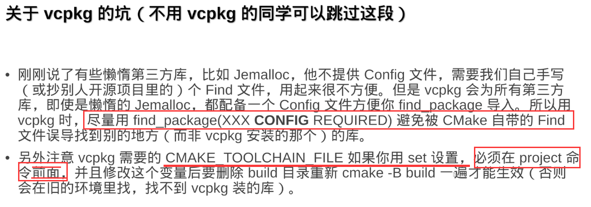

# CMake历史进程概述及静态库和动态库知识

 https://www.bilibili.com/video/BV1fa411r7zp

介绍C/C++如何预处理、编译、汇编、链接，构建生成可执行程序，修改文件之后命令再构建繁琐，引出makefile，再引出CMake，以及动态库静态库是什么，计算机如何找到动态库链接，当前可执行目录，环境变量

[库知识从00.21.55]()开始

# 现代CMake高级教程

 https://www.bilibili.com/video/BV16P4y1g7MH

介绍常用CMake语法。

不同平台开启不开启什么，以及语法顺序注意事项（set设置的内容应该都再add_executable之前），

CMake调试信息，

CMake set参数列表如果出现空格会自动添加分号并生成一个字符串，所以由空格的路径建议先打上字符串，而不是让cmake进行构造，

set(MySTR hello world) 等价于set(MySTR "hello;world")

set(MySTR "C:/Program Files")而不是set(MySTR C:/Program Files)

CMake缓存的坑，出错时建议清空缓存重新构建一下

option的本质是 set cache，首次一旦缓存之后，再去修改cmakelists没有用，得通过-D命令行进行修改

​	cmake -B build -DWITH_TBB:BOOL=OFF

​	或者使用set结合FORCE强制改

​	set(WITH_TBB OFF CACHE BOOL "set ON/OFF (en/dis)able TBB" FORCE)

生成器表达式$<>简写if、else

[生成器表达式知识从01.35.48]()开始

加了${}建议使用""进行包裹，不然可能导致展开因为名字相同循环引用出错

$ENV{xxx}环境变量

CMake指令部分大小写，但是变量名字分大小写

# 现代CMake模块化项目管理指南

https://www.bilibili.com/video/BV1V84y117YU

project的设置再set之后

GLOB / GLOB_RECRUSE区别

GLOB_RECRUSE允许递归查找子目录文件，GLOB不行

file(GLOB_RECRUSE myproj CONFIGURE_DEPENDS src/*.cpp)

find_package

[find_package从00.36.32]()开始，介绍如何找包，包是什么，XXXConfig.cmake

