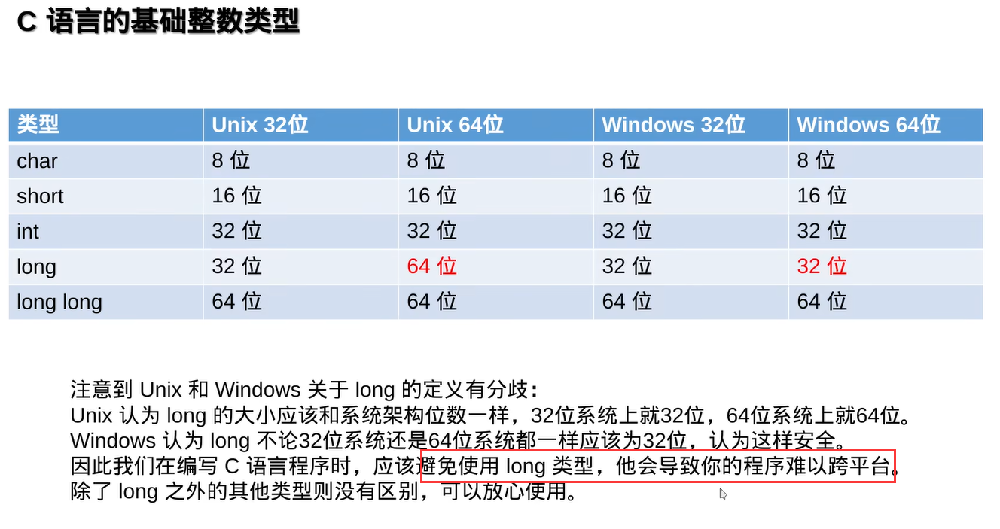

# C语言指针

## 数字表示介绍

-128-127 负数范围比正数大，是因为规避0和-0需要判断浪费时间，补码是为了让电路能够重用无符号加法，通过加法省略溢出最高位得到正确负数运算

[视频00.01.16](https://www.bilibili.com/video/BV1US4y1U7Mh)开始

## 内存存储

大小端

[视频00.44.36](https://www.bilibili.com/video/BV1US4y1U7Mh)开始

小端：

数据： a		b      c        d

地址：0x01 0x02 0x03 0x04

大端（符合人类视觉的，因为100一百，1是百位，第一个0是十位，第二个0是个位）：

数据： d		c      b        a

地址：0x01 0x02 0x03 0x04

## void* 、nullptr、NULL

[视频00.49.20](https://www.bilibili.com/video/BV1US4y1U7Mh)开始

NULL就是0，

void* 是万能指针，接收任何类型，解引用时你需要知道明确类型之后进行转换去除内容

nullptr是C++11 解决NULL、C++先前提出的任何指针空时都是 0 ，导致如果有重载函数，传入指针和int、那么如果设置0不会匹配到指针，而是int，nullptr时一个值由编译器进行重载判断选择正确的指针参数重载

# C++中delete是如何获知需要释放的内存(数组)大小的？

详细且较全面阐述 new、 delete、malloc、free、new如何计算申请内存大小，delete/free是通过栈上存储了一个cookie知道数据大小，释放

https://www.zhihu.com/question/481334153