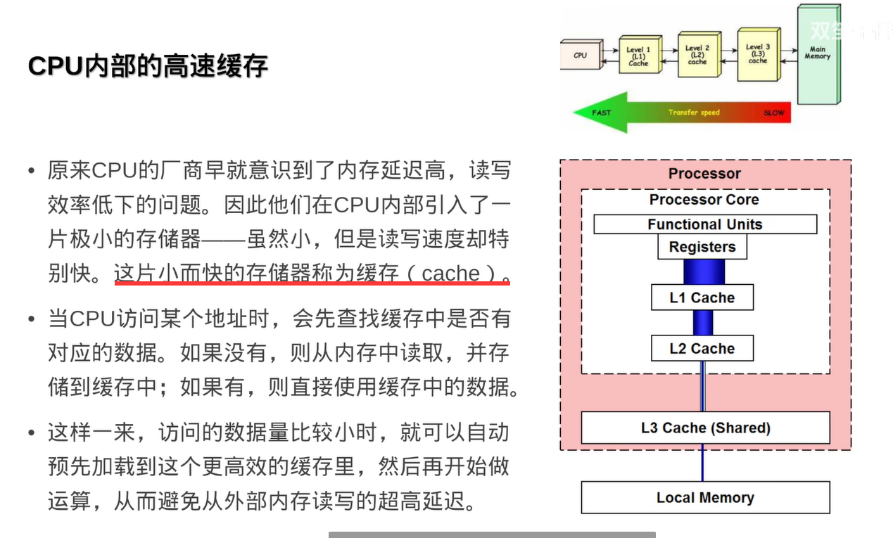
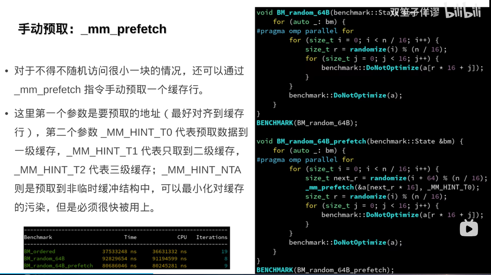
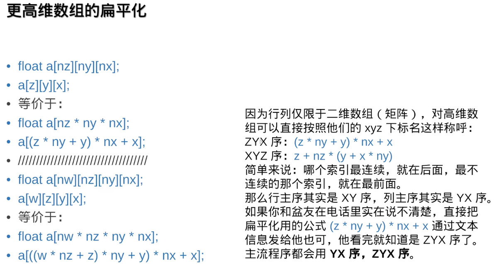
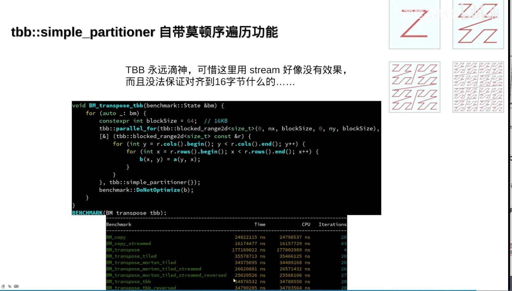

https://www.bilibili.com/video/BV1gu41117bW

## cpu/memory-bound(CPU/内存性能瓶颈)


## CPU运算花费时钟周期


## CPU内部高速缓存

### 高速缓存



### 缓存的分级结构

每个核心下都有自己的L1、L2缓存，L3缓存是共享的，

使用示例见：[并发库的 第六章atomic——内存序](Standard/并发支持库.md)

#### 结构


#### 示例详细

**注意一级缓存分为数据缓存和指令缓存**


## 缓存工作机制（缓存行）

### 读


### 写


### 连续访问与跨不访问

虽然你for循环进行跨步访问，但是对于float来说，16个float是64字节，你的跨步在64字节缓存行来说，i+=8 i+=16没什么区别它们在CPU都是以缓存行单位访问的没有加快效率


#### AOS与SOA与AOSOA

SOA能够优化读取效率


对齐到一个页的性能最高

注意SOA的数组大小不能太小


#### 对比结论


## 随机访问与连续访问


### 缓存行预取技术


### 页对齐重要性_mm_alloc


### 手动预取_mm_prefetch



## mem-bound 延迟隐藏


## _mm_stream_si32绕过缓存行直接写入


### _mm_stream_ps 4倍矢量化


### 写如1比写入0更慢分析 及 解决


## 第四章 循环合并法

01:05:48开始-01:16:00结束

介绍一种并行优化合并for循环策略，内容未触及过有些高深，但是值得学习，包括延迟隐藏，合并优化策略


## 第五章 内存分配与分页

01:16:16开始

### malloc性懒惰分配


> **但是总的时间是malloc快，malloc只for写入两次，vector初始写入一次，然后for写入两次，可以使用我们的工具no_initialized_pod.hpp来禁止vector初始化**

### 分配是按照页面4KB来管理的


### tbbmaloc能够保证64字节对齐适合SIMD指令


### 标准库new和malloc只保证16字节对齐、`_mm_malloc`、`_mm_free`、`aligned_alloc`


### 对齐的allocator

#### aligned_allocator.hpp

```c
#pragma once

#include <cstddef>
#include <cstdint>
#include <cstdlib>
#include <utility>
#include <type_traits>
#include <stdexcept>
#include <memory>
#if defined(_WIN32)
#include <malloc.h>
#endif

namespace zeno {
inline namespace aligned_allocator_h {


// https://stackoverflow.com/questions/12942548/making-stdvector-allocate-aligned-memory
namespace detail {
    void* allocate_aligned_memory(size_t align, size_t size) {
#if defined(_WIN32)
        return _aligned_malloc(size, align);
#else
        return std::aligned_alloc(align, size);
#endif
    }
    void deallocate_aligned_memory(void* ptr) noexcept {
#if defined(_WIN32)
        _aligned_free(size, align);
#else
        std::free(ptr);
#endif
    }
}

template <typename T, size_t Align = 64>
class aligned_allocator;

template <size_t Align>
class aligned_allocator<void, Align>
{
public:
    typedef void*             pointer;
    typedef const void*       const_pointer;
    typedef void              value_type;

    template <class U> struct rebind { typedef aligned_allocator<U, Align> other; };
};


template <typename T, size_t Align>
class aligned_allocator
{
public:
    typedef T         value_type;
    typedef T*        pointer;
    typedef const T*  const_pointer;
    typedef T&        reference;
    typedef const T&  const_reference;
    typedef size_t    size_type;
    typedef ptrdiff_t difference_type;

    typedef std::true_type propagate_on_container_move_assignment;

    template <class U>
    struct rebind { typedef aligned_allocator<U, Align> other; };

public:
    aligned_allocator() noexcept
    {}

    template <class U>
    aligned_allocator(const aligned_allocator<U, Align>&) noexcept
    {}

    size_type
    max_size() const noexcept
    { return (size_type(~0) - size_type(Align)) / sizeof(T); }

    pointer
    address(reference x) const noexcept
    { return std::addressof(x); }

    const_pointer
    address(const_reference x) const noexcept
    { return std::addressof(x); }

    pointer
    allocate(size_type n, typename aligned_allocator<void, Align>::const_pointer = 0)
    {
        const size_type alignment = static_cast<size_type>( Align );
        void* ptr = detail::allocate_aligned_memory(alignment , n * sizeof(T));
        if (ptr == nullptr) {
            throw std::bad_alloc();
        }

        return reinterpret_cast<pointer>(ptr);
    }

    void
    deallocate(pointer p, size_type) noexcept
    { return detail::deallocate_aligned_memory(p); }

    template <class U, class ...Args>
    void
    construct(U* p, Args&&... args)
    { ::new(reinterpret_cast<void*>(p)) U(std::forward<Args>(args)...); }

    void
    destroy(pointer p)
    { p->~T(); }
};


template <typename T, size_t Align>
class aligned_allocator<const T, Align>
{
public:
    typedef T         value_type;
    typedef const T*  pointer;
    typedef const T*  const_pointer;
    typedef const T&  reference;
    typedef const T&  const_reference;
    typedef size_t    size_type;
    typedef ptrdiff_t difference_type;

    typedef std::true_type propagate_on_container_move_assignment;

    template <class U>
    struct rebind { typedef aligned_allocator<U, Align> other; };

public:
    aligned_allocator() noexcept
    {}

    template <class U>
    aligned_allocator(const aligned_allocator<U, Align>&) noexcept
    {}

    size_type
    max_size() const noexcept
    { return (size_type(~0) - size_type(Align)) / sizeof(T); }

    const_pointer
    address(const_reference x) const noexcept
    { return std::addressof(x); }

    pointer
    allocate(size_type n, typename aligned_allocator<void, Align>::const_pointer = 0)
    {
        const size_type alignment = static_cast<size_type>( Align );
        void* ptr = detail::allocate_aligned_memory(alignment , n * sizeof(T));
        if (ptr == nullptr) {
            throw std::bad_alloc();
        }

        return reinterpret_cast<pointer>(ptr);
    }

    void
    deallocate(pointer p, size_type) noexcept
    { return detail::deallocate_aligned_memory(p); }

    template <class U, class ...Args>
    void
    construct(U* p, Args&&... args)
    { ::new(reinterpret_cast<void*>(p)) U(std::forward<Args>(args)...); }

    void
    destroy(pointer p)
    { p->~T(); }
};

template <typename T, size_t TAlign, typename U, size_t UAlign>
inline
bool
operator== (const aligned_allocator<T,TAlign>&, const aligned_allocator<U, UAlign>&) noexcept
{ return TAlign == UAlign; }

template <typename T, size_t TAlign, typename U, size_t UAlign>
inline
bool
operator!= (const aligned_allocator<T,TAlign>&, const aligned_allocator<U, UAlign>&) noexcept
{ return TAlign != UAlign; }

}
}
```

#### fast_allocator.hpp

```c
#pragma once

#include <new>
#include <utility>
#include <cstddef>
#include <type_traits>
#include <memory>

namespace zeno {

template <class T = std::byte, std::size_t Align = 64, bool Pod = true>
struct fast_allocator {
    /* cacheline-aligned and non-zero-initialized fast_allocator for std::vector */
    using value_type = T;
    using size_type = std::size_t;
    using propagate_on_container_move_assignment = std::true_type;

    template <class U>
    struct rebind {
        using other = fast_allocator<U, Align, Pod>;
    };

    fast_allocator() = default;

    template <class U = T>
    static U *allocate(size_type n) {
        n *= sizeof(U);
        return reinterpret_cast<U *>(::operator new(n, std::align_val_t(Align)));
    }

    template <class U = T>
    static void deallocate(U *p, size_type = 0) {
        ::operator delete(reinterpret_cast<void *>(p), std::align_val_t(Align));
    }

    template <class U, class ...Args>
    constexpr static void construct(U *p, Args &&...args)
    noexcept(std::is_nothrow_constructible_v<T, Args...>) {
        if constexpr (!(Pod && std::is_pod_v<T> && sizeof...(Args) == 0))
            ::new((void *)p) T(std::forward<Args>(args)...);
    }

    template <class U, std::size_t UAlign, bool UPod>
    constexpr bool operator==(fast_allocator<U, UAlign, UPod> const &) noexcept {
        return Align == UAlign && Pod == UPod;
    }

    template <class U, std::size_t UAlign, bool UPod>
    constexpr bool operator!=(fast_allocator<U, UAlign, UPod> const &) noexcept {
        return Align != UAlign || Pod != UPod;
    }
};

}
```


### 手动池化vector重复初始化问题

如果不定义静态vector，我们每次call方法，都会初始化vector那么效率会低下，通过static、thread_local，结合clear方法提升效率，thread_local是为了多线程，每个线程都持有独立的vector不共享


## 第六章 多维数组

### 静态二维数组由编译器扁平化为一维数组

内存是连续的，你定义一个静态二维数组，其实编译器会帮你翻译为一维数组


### 动态二维数组需要手动扁平化


### 常见误区：二维动态数组 = 二维指针


### 二维数组：行主序与列主序





### 实现ndarray.hpp


```c
#pragma once

#include <zeno/utils/vec.h>
#include <vector>
#include <stdexcept>
#include <type_traits>

namespace zeno {

template <size_t N, class T, class AllocT>
struct ndarray {
    static_assert(N >= 1);

    using value_type = T;
    using size_type = size_t;
    inline static constexpr size_type dimension = N;
    using shape_type = vec<dimension, size_type>;
    using index_type = vec<dimension, size_type>;
    using allocator = AllocT;
    using base_type = std::vector<value_type, allocator>;

    static size_type _shape_product(shape_type const &shape_) noexcept {
        size_type ret = shape_[0];
        for (size_type i = 1; i < dimension; i++) {
            ret *= shape_[i];
        }
        return ret;
    }

    size_type _index_linearize(index_type const &index_) noexcept {
        size_type ret = index_[0];
        for (size_type i = 1; i < dimension; i++) {
            ret *= m_shape[i];
            ret += index_[i];
        }
        return ret;
    }

    size_type _index_linearize_safe(index_type const &index_) const {
        size_type ret = index_[0];
        for (size_type i = 1; i < dimension; i++) {
            ret *= m_shape[i];
            if (index_[i] >= m_shape[i])
                throw std::out_of_range("ndarray::at");
            ret += index_[i];
        }
        return ret;
    }

    shape_type m_shape{};
    base_type m_arr;

    shape_type shape() const noexcept {
        return m_shape;
    }

    ndarray &reshape(shape_type const &shape_) {
        m_shape = shape_;
        m_arr.resize(_shape_product(shape_));
        return *this;
    }

    ndarray() = default;

    explicit ndarray(shape_type const &shape_)
        : m_shape(shape_), m_arr(_shape_product(shape_)) {
    }

    explicit ndarray(shape_type const &shape_, value_type const &value_)
        : m_shape(shape_), m_arr(_shape_product(shape_), value_) {
    }

    value_type &operator[](index_type const &index_) noexcept {
        return m_arr[_index_linearize(index_)];
    }

    value_type &at(index_type const &index_) {
        return m_arr[_index_linearize_safe(index_)];
    }

    value_type const &operator[](index_type const &index_) const noexcept {
        return m_arr[_index_linearize(index_)];
    }

    value_type const &at(index_type const &index_) const {
        return m_arr[_index_linearize_safe(index_)];
    }

    //template <size_t M>
    //struct _accessor {
        //ndarray &m_that;
        //vec<M, size_type> m_indices;

        //static vec<M + 1, size_type> _vec_concat(vec<M, size_type> const &a_, size_type b_) noexcept {
            //vec<M + 1, size_type> ret;
            //for (size_type i = 0; i < M; i++)
                //ret[i] = a_[i];
            //ret[M] = b_;
            //return ret;
        //}

        //std::enable_if_t<M + 1 == N, value_type &> operator[](size_type i_) noexcept {
            //return m_that[_vec_concat(m_indices, i_)];
        //}

        //std::enable_if_t<M + 1 != N, _accessor<M + 1>> operator[](size_type i_) noexcept {
            //return _accessor<M + 1>{m_that, _vec_concat(m_indices, i_)};
        //}
    //};

    //std::enable_if_t<N != 1, _accessor<1>> operator[](size_type i_) noexcept {
        //return _accessor<0>{*this, {i_}};
    //}

    //std::enable_if_t<N == 1, value_type &> operator[](size_type i_) noexcept {
        //return (*this)[i];
    //}
};

}
```

#### 越界问题解决


#### 内存对齐，图片内容已过时，建议使用aligned_allocator.hpp


### 什么是插桩(stencil)

从视频01:52:04开始，内容高深，如果以后学习图像处理可以重复观看


## 第八章 矩阵与莫顿码

### 案例：矩阵转置


### 矩阵转置优化-循环分块


### 什么是莫顿码？有什么用？tbb::simple_partitioner自带莫顿序遍历功能

空间相近的地方时间也相近，利于多级缓存并行




### 实战：矩阵乘法

分析


优化


## 第九章 多核共享

02:32:40开始

### 伪共享

只会出现在写入的情况


### 消除伪共享


# Intel Intrinsics Guide _mm方法

MSVC可以导入#include <immintrin.h>头文件使用


## 