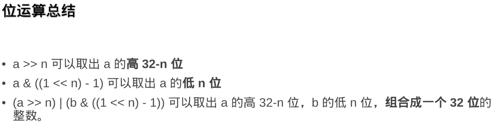
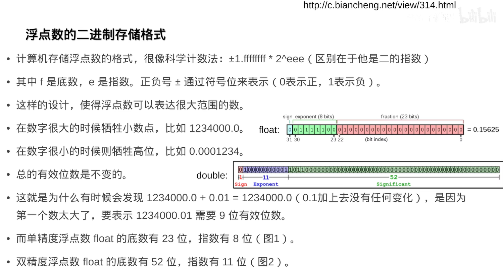

https://www.bilibili.com/video/BV1P34y117Lp


试想 如果分配一个**float静态二维数组**（注意编译器会扁平化它为一维数组）来表示矩阵，并且仅需要对角线有值，其他位置是0，也就是说对角线的值是有效的，但其他位置的值仍旧因为矩阵特性被存储，

但我们给的大小非常大，导致`bad_alloc`，

我们不妨换一个思维使用`std::map<std::tuple<int, int>, float>` 进行仅存储对角线的数据，

通过at获取数据，不过这样的访问效率会比较慢，

我们可以使用`find（找到返回，没找到返回0）、try_emplace（原地构造）`进行优化加快效率

更快的，可以使用`std::unordered_map<std::tuple<int, int>, float>`仅需要通过i、j访问，不过你需要注意unordered_map桶压力大的时候会`reset hash`可能时间花费增加

也可以采用**按行压缩**`std::vector<std::tuple<int, float>>`，vector的元素索引是行索引，tuple的第一个元素是列索引，第二个元素就是矩阵对应位置的值


# 第1章：稀疏网格

## 计算粒子经过的格点数量

char二维矩阵，计算粒子经过的格点数量，内存太大，采用位压缩思想，一个char8位，利用好这8bit，位图思想，

可以使用`std::bitset`，但是循环二维矩阵仍旧是O(n²)的级别，

同样的可以使用std::map降低时间复杂度，

进一步使用std::unordered_map降低时间复杂度，不过你需要实现std::tuple<int,int>的自定义hash函数

这是常用不容易碰撞的hash运算

```C
struct Vector2DHash
{
    std::size_t operator(const std::tuple<int,int> & key)
    {
        const auto& [x, y] = key;
        return (x * 2718281828) ^ (y * 3141592653);
    }
}
```


进一步优化——分块

经过一个点那么它的周围点大概率被经过，利用局域性特点，能够SIMD矢量化加速

```c
struct Block
{
	char block[16][16];
}

std::unordered_map<std::tuple<int, int>>, Block, Vector2DHash>
```


## 稀疏的好处

稀疏可以无限延伸XY，按需分配内存，即使奇怪的形状也不会浪费内存，利于分块


## 负数 % 越界问题

(a + b) % b 仍旧避免不了 a < -b时出错

解决：  (a % b + b) % b

高效解决：如果b是2的幂次方，a % b = a & (b - 1)


## 计组：有符号、无符号的算数/逻辑右移

(unsigned) -7 >> 2 是正数，逻辑右移

-7 >> 2 是负正数，会自动填充1，算数右移




## 流体三维仿真-垃圾回收机制

[视频00:53:00]()开始

间隔若干帧之后，是否不要的指针节省内存

## 哈希顶层、指针中层、稠密底层封装

[视频00:58:00]()开始


## OpenVDB

[视频01:01:00]()开始


[视频01:10:00]()开始

tbb::span_mutex

**访问者模式**去除锁，map作为共享缓存，每个parallel for firstprivate(xxx)都能够拥有自己的


[视频01:20:15]()开始

std::vector<bool> 坑


**能用小精度，就用小精度，高精度意味着会出现memory-bound从而降低性能**

## 浮点数




### 定点数性能提高

[视频01:29:00]()开始


**boost::multiprecision::cpp_dec_float.hpp**


## 实现bfloat16存储与转换

[视频01:33:18]()开始


## mmap分配

[视频01:45:00]()开始