# [【并行计算】CUDA在现代C++中如何运用？看这一个就够了！](https://www.bilibili.com/video/BV16b4y1E74f/)

# [【并行计算】用现代C++的方式打开CUDA！](https://www.bilibili.com/video/BV1ndhCzXEXm/)

# https://github.com/parallel101/cppguidebook/tree/main/cudaguide

https://docs.google.com/presentation/d/1cvVpf3ChFFiY4Kf25S4e4sPY6Y5uRUO-X-A4nJ7IhFE/edit

# https://github.com/gpu-mode/lectures

# 宏、CMAKE设置

project ( LANGUAGES C CXX CUDA)

`**分离** __device__**函数的声明和定义：**` 全局启用

set(CMAKE_CUDA_SEPARABLE_COMPILATION ON)，不过建议函数实现和声明放在一起内联

开启lambda支持，允许声明为`__device__`

`target_compile_options(main PUBLIC $<$<COMPILE_LANGUAGE:CUDA>:--extended-lambda>)`

> `parallel for<<<32，128>>>(n, __device__ (int i) {`
>
> ​	`printf("number %d\n", i);`
>
> `});`

—use_fast_math 开启CUDA高速学运算，数学函数被替换为GPU内置数学函数，如sinf 变为__sinf，速度快但精度低，会自动开启以下四个flag

> --ftz=true 会把极小数(denormal)退化为0。
>
> --prec-div=false 降低除法的精度换取速度。
>
> --prec-sqrt=false 降低开方的精度换取速度。
>
> --fmad 因为非常重要，所以默认就是开启的，会自动把 a * b + c 优化成乘加(FMA)指令


`__constant__` 标记变量为真正在GPU中只读空间的的常量，更快

`__shared__` 局部变量声明为共享内存，所有线程都能够访问，常常和__syncthreads()方法进行同步使用

`__global__` 在GPU上执行，修饰核函数，CPU可调用，CPU和GPU异步不允许有返回值，得通过参数指针或引用获取修改值

`__device__` 在GPU上执行，修饰核函数，只在GPU调用，GPU同步，允许有返回值

`__inline__` 可能内联

`__forceinline__`强制内敛

`__host__`  只在CPU调用，默认函数就是

`__host__ __device`  只在CPU调用，编译器自动生成两个版本的

使用

`target_compile_options(${PROJECT_NAME} PRIVATE 
    $<$<COMPILE_LANGUAGE:CUDA>:--expt-relaxed-constexpr>)`

让 `constexpr` 这些内敛函数替代部分`__host__ __device`  场景简化代码


`__CUDA_ARCH__` 使用#ifdef #else #endif 判断是GPU 还是CPU，它的值是一个版本号，比如520，最低为一定是0

```
__host__ __device__ void say_hello() {
#if defined(__CUDA_ARCH__)
    printf("Hello from GPU!\n");
#else
    printf("Hello from CPU!\n");
#endif
}
```

**可以设置多个显卡版本，但是编译会变慢，因为需要生成不同版本的代码，且程序会变大**，指定自己电脑显卡版本即可，如果仅指定一个版本且版本大于自己显卡版本，那么生成的代码不报错也不出任何问题，所以要注意

```
set(CMAKE_CUDA_ARCHITECTURES 52;61;72) # 会自动转换成--gpu-code等编译的flag设置
```

# 显卡版本号

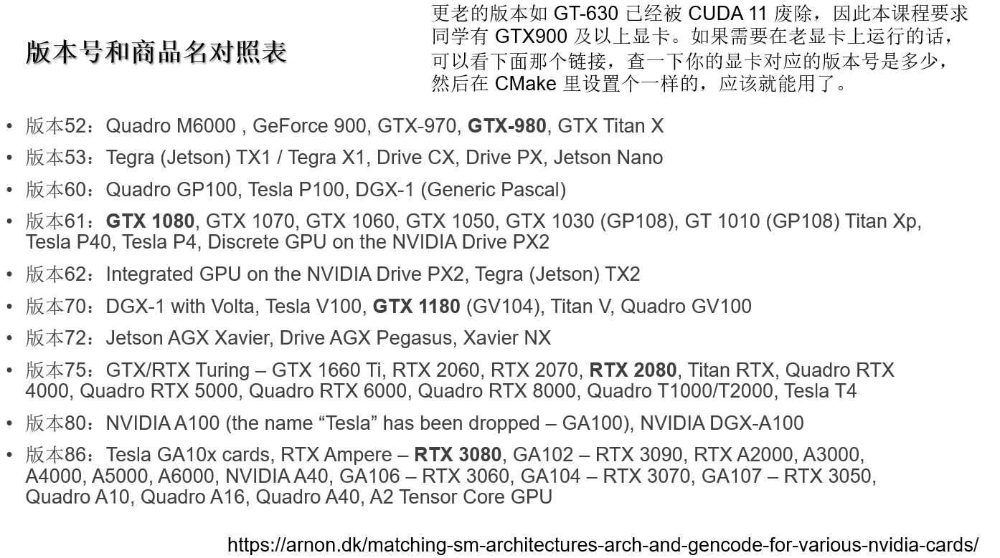


# `<<<1, 1>>>`  底层架构设计

<<<>>> 参数内容如下，是一个结构体语法糖封装

```C++
typedef __device_builtin__ struct cudaLaunchConfig_st {
    dim3 gridDim; /**< Grid dimensions */
    dim3 blockDim; /**< Block dimensions */
    size_t dynamicSmemBytes; /**< Dynamic shared-memory size per thread block in bytes */
    cudaStream_t stream; /**< Stream identifier */
    cudaLaunchAttribute * attrs; /**< List of attributes; nullable if ::cudaLaunchConfig_t::numAttrs == 0 */

    unsigned int numAttrs; /**< Number of attributes populated in ::cudaLaunchConfig_t::attrs */
} cudalaunchConfig_t;
```

GPU与CPU通信是异步的，cudaDeviceSynchronize()进行同步让CPU等待GPU数据

`<<<1, 1>>>` 第一个数字表示 **板块个数**，第二个数字表示**板块个数的线程个数**（GPU的核心数）

```C++
__global__ void kernel(){
	printf("Block %d of %d, Thread %d of \n", blockIdx.x, gridDim.x, threadIdx.x, blockDim.x); // 板块编号，板块总数， 线程ID，线程总数3
}
int main(){
    kernel<<<2, 3>>>(); // 本质是一个语法糖，进行GPU进行 两次 for i = 0; i < 3 ++i
    cudaDeviceSynchronize();
    return;
}

/*
maybe out put，因为线程是并发的，以下的顺序不一定
Block 1 of 2,Thread 0 of 3
Block 1 of 2,Thread l of 3
Block 1 of 2,Thread 2 of 3
Block 0 of 2,Thread 0 of 3
Block 0 of 2,Thread 1 of 3
Block 0 of 2,Thread 2 of 3
*/

```

## 板块、线程

> * 当前线程在板块中的编号:  threadldx
>
> * 当前板块中的线程数量:  blockDim
> * 当前板块的编号:  blockldx
> * 总的板块数量:  gridDim
> * 线程(thread):并行的最小单位
> * 板块(block):包含若干个线程
> * 网格(grid):指整个任务，包含若干个板块
> * 从属关系:线程 < 板块 < 网格
> * 调用语法:<<<gridDim, blockDim>>>

如需总的线程数量: `blockDim*gridDim`
如需总的线程编号: `blockDim*blockldx+threadldx`

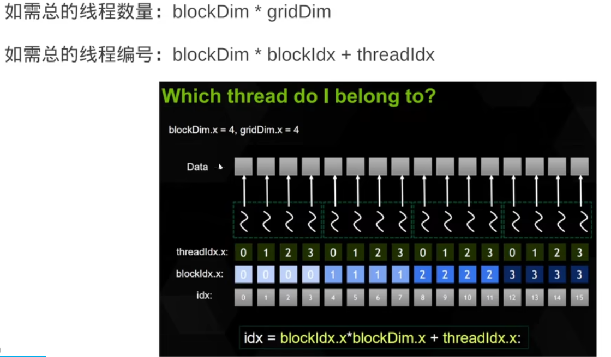


## 变量从属

```
grid(取决于显卡版本) > block(取决于显卡版本) > wrap(32) > thread(1)


__global__ void kernal(int* arr) {
	int i = blockIdx.x * blockDim.x + threadIdx.x
	arr[i].......
	.....
}

// i 变量是 thread 相当于thread_local每个线程都有
// 如果标记一个变量为 __shared__ 那么这个变量对当前 block 共享（blockIdx是相同的共享）
// 如果需要全局共享 则需要 标记 static __device__ 这个对所有grid共享
```


## [CUDA stream 流](https://www.bilibili.com/video/BV1ndhCzXEXm/)

视频01:25:00

类似CPU的线程，并行，可以join，CUDA的thread类似SIMD


## [CUDA event 事件](https://www.bilibili.com/video/BV1ndhCzXEXm/)

视频01:51:00

和流一起使用，stream.recordEvent得到事件，比流更细的一种控制，比如 有两个任务A、B，B任务执行时间长都在同一个流执行，但是我们想要立即获取A任务的结果，但是因为在同一个流，必须等B完成之后才能获取A，所有我们引入一个 event 比stream更小的粒度控制，可以直接记录 A任务的结果

```C++
//stream > event > block > thread
int main() {
    CudaVector<int> arr{ 1，2，3，4 };
    CudaVector<int> brr{ 2，3，4，5，6 };
    CudaVector<int> crr{ 3，4，5，6，7，8 };
    CudaStream sa = CudaStream::Builder().build();
    CudaStream sb = CudaStream::Builder().build()
    kernel << <1，4，0，sa >> > (arr);
    CudaEvent arr_done = sa.recordEvent();
    kernel << <1，6，0，sa >> > (crr);

    kernel << <1，5，0，sb >> > (brr);

    CudaEvent brr_done = sb.recordEvent();
    arr_done.join(); // 记录 A
    brr_done.join();
    printf("arr:\n");
    for (int i = 0; i < arr.size(); ++i) {
        printf("%d\n", arr[i]);
    }
    for (int i = 0; i < brr.size(); ++i) {
        printf("%d\n", brr[i]);
    }
}

```

## [CUDA  核函数不要使用局部数组，因为数据是在寄存器上的，不能取地址](https://www.bilibili.com/video/BV1ndhCzXEXm/)

视频02:38:00


## CPU和GPU对比

**实际上 GPU 的板块相当于CPU 的线程，GPU的线程相当于CPU的SIMD，可以这样理解，但不完全等同。**

## 三维板块

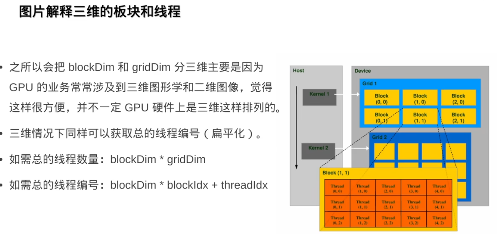

因为GPU主要来渲染图像，所以设计为三维

> •CUDA 也支持三维的板块和线程区间。
>
> •只要在三重尖括号内指定的参数改成 dim3 类型即可。dim3 的构造函数就是接受三个无符号整数（unsigned int）非常简单。
>
> •dim3(x, y, z)
>
> •这样在核函数里就可以通过 threadIdx.y 获取 y 方向的线程编号，以此类推。

kernel<<<dim3(2, 1, 1), dim3(2, 2, 2)>>>(); 通过x、y、获取，如果z都是1代表二维

# 数据返回

## C++20支持

`__global__` 的函数，可以传入 tuple、array、span、pair、string_view 等 静态分配的类型——平凡类型作为kernal参数

不可以传入 vector、string、map、set 在CPU动态内存分配的作为kernal参数

## CPU/GPU数据交互原理

统一有CUDA进行拷贝

```
#include "cudapp.cuh"
__global__ void kernel(int* arr) { // 可以替换为 std::span<int> arr
    int i = threadIdx.x;
    arr[i] = arr[i] * arr[i];
}
__host__ int main() {
/*
std::vector<int, CudaAllocator<int, CudaManagedArena>> arr{1,2,3,4};
kernel<<<1，4>>>(arr.data());
*/
    CudaAllocator<int, CudaManagedArena> alloc;
    int* arr = alloc.allocate(4); // equal new int[4]
    // PTE.Dirty = 0
    
    // 内存模型
    // page = 4KB
    // PTE.Dirty = 1 标记写入后为脏页
    arr[0] = 1;
    arr[1] = 2;
    arr[2] = 3;
    arr[3] = 4;

    // 内核在CPU写入时，"钉住" 通过 脏页的标记知道哪些数据需要拷贝到GPU
    // PTE.Dirty == 1 -> 自动拷贝 arr(CPU)->arr(GPU)
    kernel<<<1，4>>>(arr); 

    // GPU写入后会标记自己的为脏页，然后将数据拷贝到CPU
    // GPTE.Dirty == 1 -> 自动拷贝 arr(GPU) -> arr(CPU)
    CHECK_CUDA(cudaDevicesynchronize());
    for (int i = 0; i < 4; ++i) {
        printf("%d\n", arr[i]);
    }
    CudaAllocator<int,CudaManagedArena>().deallocate(arr);
    return 0;
}

// 上述的allocator应替换为 std::vector<int, CudaAllocator<int, CudaManagedArena>> ，RAII 自己管理自己的内存
```


## CPU/GPU数据交互

### helper_duda.h（checkCudaErrors）

checkCudaErrors宏检查错误

```
#include "helper_duda.h"
__global__ void kernel(int *pret){
 *pret = 42;   
}
int main(){
    int ret = 0;
    kernel<<<1, 1>>>(&ret);
    checkCudaErrors(cudaDevicesynchronize());
    return 0;
}
```


### cudaMalloc、cudaMemcpy

```C++

__global__ void kernel(int *pret){
 *pret = 42;   
}
int main(){
    // CPU
    int ret = 0;
    kernel<<<1, 1>>>(&ret);
    cudaError_t err = cudaDevicesynchronize(); // 错误码返回
    printf("error code: %d\n", err);
    printf("error name: %s\n", cudaGetErrorName(err)); // 错误码查找原因
    printf("%d\n", ret);
    
    // GPU
    int *pret = 0;
    checkCudaErrors(cudaMalloc(&pret, sizeof(int)));
    kernel<<<1, 1>>>(&pret);
    checkCudaErrors(cudaDevicesynchronize());
    printf("%d\n", *pret);
    cudaFree(pret);
    return 0;
}

//正确，使用cudaMemcpy，注意使用cudaMemcpy隐含一次同步操作，自动同步
    int *pret = 0;
    checkCudaErrors(cudaMalloc(&pret, sizeof(int)));
    kernel<<<1, 1>>>(&pret);
    checkCudaErrors(cudaDevicesynchronize());
	int ret;
	checkCudaErrors(cudaMemcpy(&ret, pret sizeof(int), cudaMemcpyDeviceToHost));
    printf("%d\n", ret);
    cudaFree(pret);

```

* **核函数不能够有返回值，因为是kernel异步的**，声明为void
* 通过传入指针解决，但是还是出错，因为GPU的内容在显存上，CPU在主存上，数据所在区域不同，我们分配的内容在CPU上，GPU没有，同理在线程分配也一样

> •原来，GPU 和 CPU 各自使用着独立的内存。CPU 的内存称为主机内存(host)。GPU 使用的内存称为设备内存(device)，他是显卡上板载的，速度更快，又称显存。
>
> •而不论栈还是 malloc 分配的都是 CPU 上的内存，所以自然是无法被 GPU 访问到。
>
> •因此可以用用 cudaMalloc 分配 GPU 上的显存，这样就不出错了，结束时 cudaFree 释放。
>
> •注意到 cudaMalloc 的返回值已经用来表示错误代码，所以返回指针只能通过 &pret 二级指针。

### 统一内存地址技术（Unified Memory）（Pascal 架构开始支持的，也就是 GTX9 开头及以上）

在比较新的显卡上支持的特性，那就是统一内存(managed)，只需把 cudaMalloc 换成 cudaMallocManaged 即可，释放时也是通过 cudaFree。这样分配出来的地址，不论在 CPU 还是 GPU 上都是一模一样的，都可以访问。而且拷贝也会自动按需进行（当从 CPU 访问时），无需手动调用 cudaMemcpy，大大方便了编程人员，特别是含有指针的一些数据结构。

```C++

    int *pret = 0;
    checkCudaErrors(cudaMallocManaged(&pret, sizeof(int)));
    kernel<<<1, 1>>>(&pret);
    checkCudaErrors(cudaDevicesynchronize());
    printf("%d\n", *pret);
    cudaFree(pret);
```

•主机内存(host)：malloc、free

•设备内存(device)：cudaMalloc、cudaFree

•统一内存(managed)：cudaMallocManaged、cudaFree

### 分配数组、多个线程，并行地给数组赋值、跨步循环

[视频0:56:00开始]()

### 边角料（向下取整解决让GPU处理尾部数据）问题解决

[视频1:00:00开始]()

```C++
#include <cstdio>
#include <cuda runtime.h>
#include "helper_cuda.h"
__global__ void kernel(int *arr, int n) {
    for(int i = blockDim.x * blockIdx.x + threadIdx.x; i < n;
        i += blockDim.x * gridDim.x) 
    {
        arr[i] = 1
    }
}
int main() {
    int n = 65536;
    int *arr;
    checkCudaErrors(cudaMallocManaged(&arr, n * sizeof(int)))；
    kernel<<<32，128>>>(arr, n);
    checkCudaErrors(cudaDeviceSynchronize());
    
    for(int i = 0; i < n ; ++i) {
    	printf("arr[%d]: %d\n", i, arr[i]);
    }
    cudaFree(arr);
    return 0;
}
```

## [跨步循环](https://www.bilibili.com/video/BV1ndhCzXEXm/)

视频02:50:00


# C++封装

## vector使用allocator在显存分配内存

[视频1:04:23开始]()


```C++
#include <cstdio>
#include <cuda_runtime.h>
#include "helper_cuda.h"
#include <vector>

template <class T>
struct CudaAllocator {
    using value_type = T;

    T *allocate(size_t size) {
        T *ptr = nullptr;
        checkCudaErrors(cudaMallocManaged(&ptr, size * sizeof(T)));
        return ptr;
    }

    void deallocate(T *ptr, size_t size = 0) {
        checkCudaErrors(cudaFree(ptr));
    }

    // 防止pod初始化
    template <class ...Args>
    void construct(T *p, Args &&...args) {
        if constexpr (!(sizeof...(Args) == 0 && std::is_pod_v<T>))
            ::new((void *)p) T(std::forward<Args>(args)...);
    }
};

template <class Func>
__global__ void parallel_for(int n, Func func) {
    for (int i = blockDim.x * blockIdx.x + threadIdx.x;
         i < n; i += blockDim.x * gridDim.x) {
        func(i);
    }
}

int main() {
    int n = 65536;
    std::vector<int, CudaAllocator<int>> arr(n);

    parallel_for<<<32, 128>>>(n, [arr = arr.data()] __device__ (int i) {
        arr[i] = i;
    });

    checkCudaErrors(cudaDeviceSynchronize());
    for (int i = 0; i < n; i++) {
        printf("arr[%d] = %d\n", i, arr[i]);
    }

    return 0;
}

```

> •要注意三点：
>
> 1.这里的 **Func 不可以是 Func const &，那样会变成一个指向 CPU 内存地址的指针，从而出错。所以 CPU 向 GPU 的传参必须按值传。**
>
> 2.做参数的这个函数必须是一个有着成员函数 operator() 的类型，即 functor 类。而不能是独立的函数，否则报错。
>
> 3.这个函数必须标记为 __device__，即 GPU 上的函数，否则会变成 CPU 上的函数。

捕获外部变量 ，&捕获，GPU访问CPU的不行，=捕获，会把所有数据拷贝不是我们想要的，

我们应该获取vector的首地址指针拷贝

## 数学运算

[视频1:08:10开始]()

### GPU低精度内值函数

`__sinf、__expf、__logf、__cosf、__powf`等

## cuda提供的 `<thrust>`库，很智能的std的GPU版本

### thrust::universal_vector、thrust::generator、thrust::for_each

[视频1:29:16开始]()


universal_vector 会在统一内存上分配，因此不论 GPU 还是 CPU 都可以直接访问到。

### 实现parallel_for

```C++
#include <cstdio>
#include <cuda_runtime.h>
#include "helper_cuda.h"
#include <thrust/device_vector.h>
#include <thrust/host_vector.h>
#include <thrust/generate.h>
#include <thrust/for_each.h>

template <class Func>
__global__ void parallel_for(int n, Func func) {
    for (int i = blockDim.x * blockIdx.x + threadIdx.x;
         i < n; i += blockDim.x * gridDim.x) {
        func(i);
    }
}

int main() {
    int n = 65536;
    float a = 3.14f;
    thrust::host_vector<float> x_host(n);
    thrust::host_vector<float> y_host(n);

    auto float_rand = [] {
        return std::rand() * (1.f / RAND_MAX);
    };
    thrust::generate(x_host.begin(), x_host.end(), float_rand);
    thrust::generate(y_host.begin(), y_host.end(), float_rand);

    thrust::device_vector<float> x_dev = x_host;
    thrust::device_vector<float> y_dev = x_host;

    thrust::for_each(
        thrust::make_zip_iterator(x_dev.begin(), y_dev.cbegin()),
        thrust::make_zip_iterator(x_dev.end(), y_dev.cend()),
        [a] __device__ (auto const &tup) {
        auto &x = thrust::get<0>(tup);
        auto const &y = thrust::get<1>(tup);
        x = a * x + y;
    });

    x_host = x_dev;

    for (int i = 0; i < n; i++) {
        printf("x[%d] = %f\n", i, x_host[i]);
    }

    return 0;
}

```


## 原子操作

[视频1:38:30开始]()

### atomicAdd

atomicAdd，它会返回旧值，很有用，和标准库的不一样

> •old = atomicAdd(dst, src) 其实相当于：
>
> •old = *dst; *dst += src;
>
> •利用这一点可以实现往一个全局的数组 res 里追加数据的效果（push_back），其中 sum 起到了记录当前数组大小的作用。
>
> •因为返回的旧值就相当于在数组里“分配”到了一个位置一样，不会被别人占据。

### 实现parallel_sum，实现float_atomic_add，根据 CAS

```C++
#include <cstdio>
#include <cuda_runtime.h>
#include "helper_cuda.h"
#include <vector>
#include "CudaAllocator.h"
#include "ticktock.h"

// 手动实现float_atomic_add，根据 CAS
__device__ __inline__ int float_atomic_add(float *dst, float src) {
    int old = __float_as_int(*dst), expect;
    do {
        expect = old;
        old = atomicCAS((int *)dst, expect,
                    __float_as_int(__int_as_float(expect) + src));
    } while (expect != old);
    return old;
}

__global__ void parallel_sum(float *sum, float const *arr, int n) {
    float local_sum = 0;
    for (int i = blockDim.x * blockIdx.x + threadIdx.x;
         i < n; i += blockDim.x * gridDim.x) {
        local_sum += arr[i];
    }
    float_atomic_add(&sum[0], local_sum);
}

int main() {
    int n = 65536;
    std::vector<float, CudaAllocator<float>> arr(n);
    std::vector<float, CudaAllocator<float>> sum(1);

    for (int i = 0; i < n; i++) {
        arr[i] = std::rand() % 4;
    }

    TICK(parallel_sum);
    parallel_sum<<<n / 4096, 512>>>(sum.data(), arr.data(), n);
    checkCudaErrors(cudaDeviceSynchronize());
    TOCK(parallel_sum);

    printf("result: %f\n", sum[0]);

    return 0;
}

// 稍作优化无原子解决方案，更快
#include <cstdio>
#include <cuda_runtime.h>
#include "helper_cuda.h"
#include <vector>
#include "CudaAllocator.h"
#include "ticktock.h"

__global__ void parallel_sum(int *sum, int const *arr, int n) {
    for (int i = blockDim.x * blockIdx.x + threadIdx.x;
         i < n / 1024; i += blockDim.x * gridDim.x) {
        int local_sum = 0;
        for (int j = i * 1024; j < i * 1024 + 1024; j++) {
            local_sum += arr[j];
        }
        sum[i] = local_sum;
    }
}

int main() {
    int n = 1<<24;
    std::vector<int, CudaAllocator<int>> arr(n);
    std::vector<int, CudaAllocator<int>> sum(n / 1024);

    for (int i = 0; i < n; i++) {
        arr[i] = std::rand() % 4;
    }

    TICK(parallel_sum);
    parallel_sum<<<n / 1024 / 128, 128>>>(sum.data(), arr.data(), n);
    checkCudaErrors(cudaDeviceSynchronize());

    int final_sum = 0;
    for (int i = 0; i < n / 1024; i++) {
        final_sum += sum[i];
    }
    TOCK(parallel_sum);

    printf("result: %d\n", final_sum);

    return 0;
}

```

### 板块和共享内存

[视频1:56:50开始]()

> •GPU 是由**多个流式多处理器（SM）**组成的。每个 SM 可以处理一个或多个板块。
>
> •SM 又由**多个流式单处理器（SP）**组成。每个 SP 可以处理一个或多个线程。
>
> •**每个 SM 都有自己的一块共享内存（shared memory）**，他的性质类似于 CPU 中的缓存——和主存相比很小，但是很快，用于缓冲临时数据。还有点特殊的性质，我们稍后会讲。
>
> •通常板块数量总是大于 SM 的数量，这时英伟达驱动就会在多个 SM 之间调度你提交的各个板块。正如操作系统在多个 CPU 核心之间调度线程那样……
>
> •不过有一点不同，**GPU 不会像 CPU 那样做时间片轮换**——板块一旦被调度到了一个 SM 上，就会一直执行，直到他执行完退出，这样的好处是不存在保存和切换上下文（寄存器，共享内存等）的开销，毕竟 GPU 的数据量比较大，禁不起这样切换来切换去……
>
> •一个 SM 可同时运行多个板块，这时多个板块共用同一块共享内存（每块分到的就少了）。
>
> •而板块内部的每个线程，则是被进一步调度到 SM 上的每个 SP。

### 共享内存：什么是区块（bank）

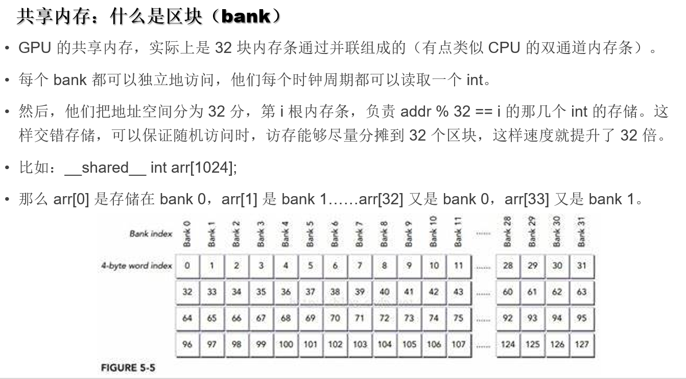

#### 流水线优化

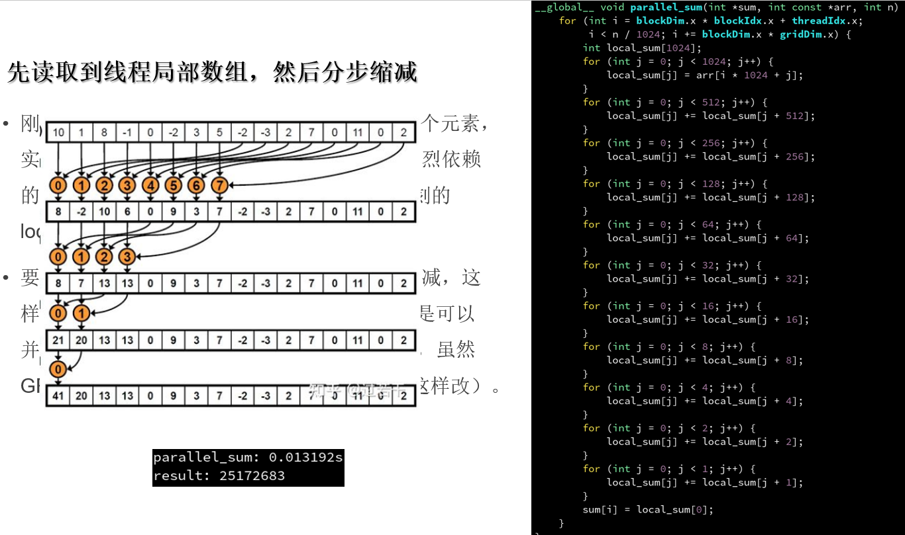

#### 线程组（warp）：32个线程为一组、__syncthreads同步所有组线程

> •其实，**<u>SM 对线程的调度是按照 32 个线程为一组来调度的。也就是说，0-31号线程为一组，32-63号线程为一组，以此类推</u>**。
>
> •因此 **<u>SM 的调度无论如何都是对一整个线程组（warp）进行的</u>**，不可能出现一个组里只有单独一个线程被调走，要么 32 个线程一起调走。
>
> •所以其实 j < 32 之后，就不需要 __syncthreads() 了。因为此时所有访问 local_sum 的线程都在一个组里嘛！反正都是一起调度走，不需要同步。
>
> 编译器自作聪明优化了我们对 local_sum 的访问，导致结果不对的。解决：把 local_sum 数组声明为 volatile 禁止编译器优化

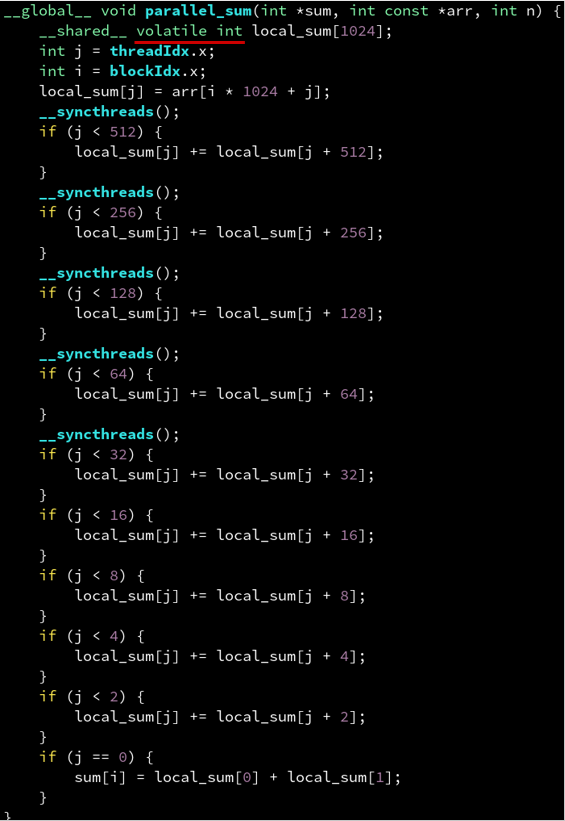

#### 线程组分歧（**warp divergence**）

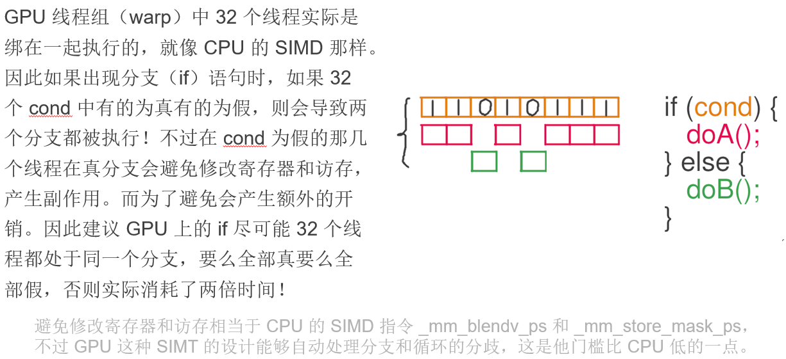

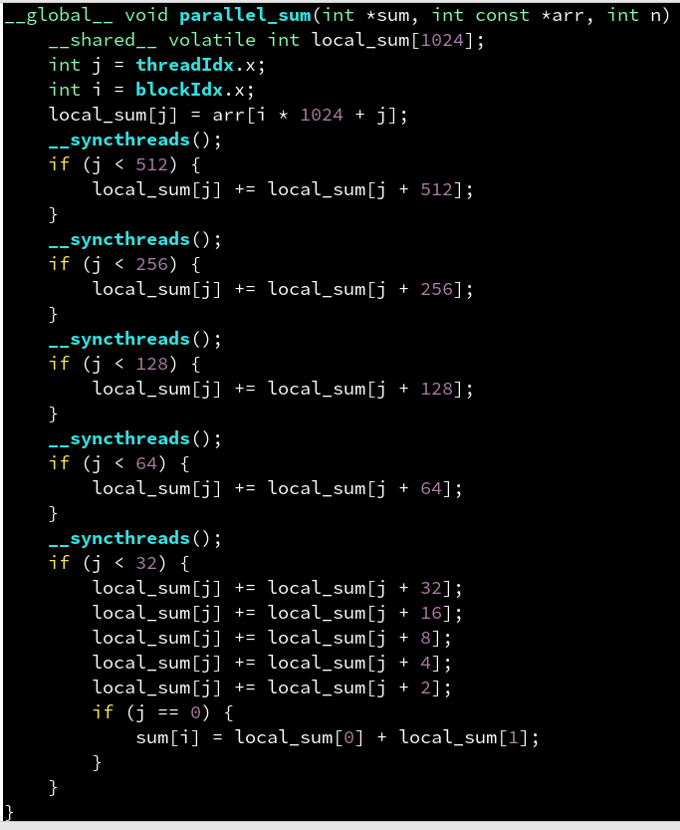

```C++
#include <cstdio>
#include <cuda_runtime.h>
#include "helper_cuda.h"
#include <vector>
#include "CudaAllocator.h"
#include "ticktock.h"

template <int blockSize, class T>
__global__ void parallel_sum_kernel(T *sum, T const *arr, int n) {
    __shared__ volatile int local_sum[blockSize];
    int j = threadIdx.x;
    int i = blockIdx.x;
    T temp_sum = 0;
    for (int t = i * blockSize + j; t < n; t += blockSize * gridDim.x) {
        temp_sum += arr[t];
    }
    local_sum[j] = temp_sum;
    __syncthreads();
    if constexpr (blockSize >= 1024) {
        if (j < 512)
            local_sum[j] += local_sum[j + 512];
        __syncthreads();
    }
    if constexpr (blockSize >= 512) {
        if (j < 256)
            local_sum[j] += local_sum[j + 256];
        __syncthreads();
    }
    if constexpr (blockSize >= 256) {
        if (j < 128)
            local_sum[j] += local_sum[j + 128];
        __syncthreads();
    }
    if constexpr (blockSize >= 128) {
        if (j < 64)
            local_sum[j] += local_sum[j + 64];
        __syncthreads();
    }
    if (j < 32) {
        if constexpr (blockSize >= 64)
            local_sum[j] += local_sum[j + 32];
        if constexpr (blockSize >= 32)
            local_sum[j] += local_sum[j + 16];
        if constexpr (blockSize >= 16)
            local_sum[j] += local_sum[j + 8];
        if constexpr (blockSize >= 8)
            local_sum[j] += local_sum[j + 4];
        if constexpr (blockSize >= 4)
            local_sum[j] += local_sum[j + 2];
        if (j == 0) {
            sum[i] = local_sum[0] + local_sum[1];
        }
    }
}

template <int reduceScale = 4096, int blockSize = 256, int cutoffSize = reduceScale * 2, class T>
int parallel_sum(T const *arr, int n) {
    if (n > cutoffSize) {
        std::vector<int, CudaAllocator<int>> sum(n / reduceScale);
        parallel_sum_kernel<blockSize><<<n / reduceScale, blockSize>>>(sum.data(), arr, n);
        return parallel_sum(sum.data(), n / reduceScale);
    } else {
        checkCudaErrors(cudaDeviceSynchronize());
        T final_sum = 0;
        for (int i = 0; i < n; i++) {
            final_sum += arr[i];
        }
        return final_sum;
    }
}

int main() {
    int n = 1<<24;
    std::vector<int, CudaAllocator<int>> arr(n);

    for (int i = 0; i < n; i++) {
        arr[i] = std::rand() % 4;
    }

    TICK(parallel_sum);
    int final_sum = parallel_sum(arr.data(), n);
    TOCK(parallel_sum);

    printf("result: %d\n", final_sum);

    return 0;
}

```


#### 总结

上述的优化探索，其实编译器基本就是编译器帮我们干的事，只不过写的更好性能更高，使用atomicAdd编译器会知道我们在干吗进而优化

# GPU内存模型

## 缓存访问时钟周期

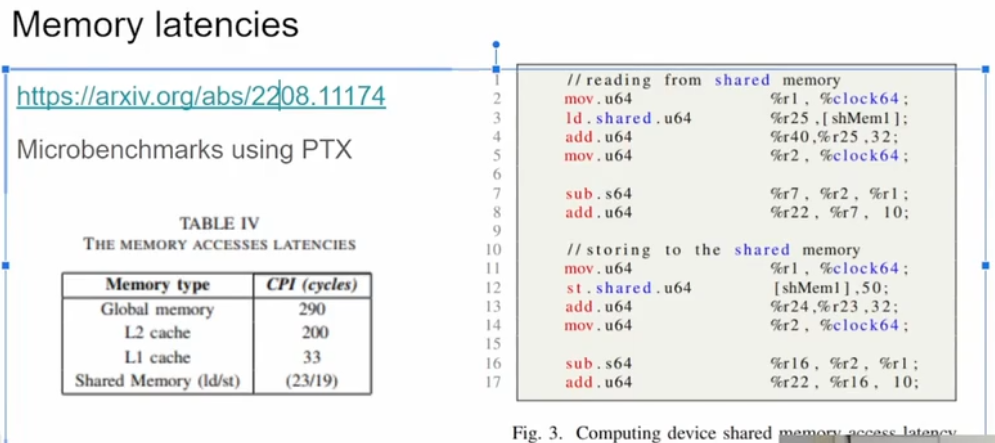

## 费米架构 Fermi

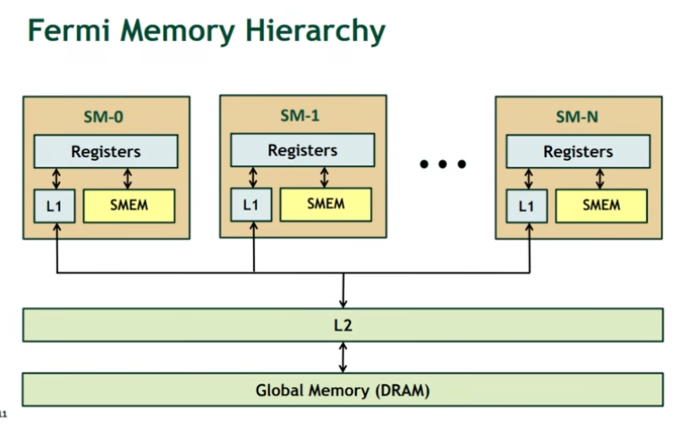

### 问题：寄存器打翻（register spill）

> •**GPU 线程的寄存器，实际上也是一块比较小而块的内存，称之为寄存器仓库（register file）。板块内的所有的线程共用一个寄存器仓库。**
>
> •当板块中的**线程数量（blockDim）过多时**，就会<u>导致每个线程能够分配到的寄存器数量急剧缩小</u>。而如果你的程序恰好用到了非常多的寄存器，那就没办法全部装在高效的寄存器仓库里，而是要把一部分“打翻”到一级缓存中，这时对这些寄存器读写的速度就和一级缓存一样，相对而言低效了。若一级缓存还装不下，那会打翻到所有 SM 共用的二级缓存。
>
> •此外，如果在线程局部分配一个数组，并通过动态下标访问（例如遍历 BVH 时用到的模拟栈），那无论如何都是会打翻到一级缓存的，因为寄存器不能动态寻址。
>
> 对于 Fermi 架构来说，每个线程最多可以有 63 个寄存器（每个有 4 字节）。

### 问题：**延迟隐藏（latency hiding）失效

> •我们说过，每个 SM 一次只能执行板块中的一个线程组（warp），也就是32个线程。
>
> •而**当线程组陷入内存等待时，可以切换到另一个线程，继续计算，这样一个 warp 的内存延迟就被另一个 warp 的计算延迟给隐藏起来了**。因此，<u>如果线程数量太少的话，就无法通过在多个 warp 之间调度来隐藏内存等待的延迟，从而低效</u>。
>
> •此外，<u>最好让板块中的线程数量（blockDim）为32的整数倍</u>，否则假如是 33 个线程的话，那还是需要启动两个 warp，其中第二个 warp 只有一个线程是有效的，非常浪费。
>
> **<u>•结论：对于使用寄存器较少、访存为主的核函数（例如矢量加法），使用大 blockDim 为宜。反之（例如光线追踪）使用小 blockDim，但也不宜太小。</u>**

# 案例：矩阵转置

[视频2:33:40开始]()

# GPU优化手法总结

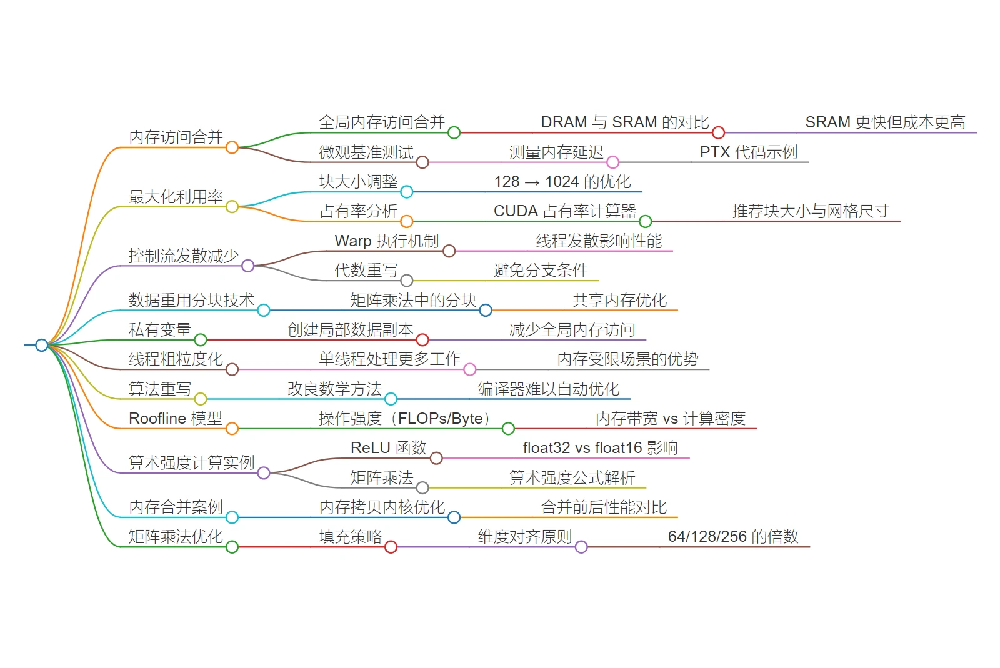

•线程组分歧（wrap divergence）：尽量**保证 32 个线程**都进同样的分支，否则两个分支都会执行。（wrap类似CPU的超线程）

> 内存密集型
>
> memory-bound -> 增加thread 数量 -> 增大 blockDim
>
> 计算密集型
>
> compute-bound(寄存超用量多) -> 减少 thread 数量 -> 减少 blockDim
>
> 
>
> ```
> GlobalMemory -> prefetch -> L1 -> reg cal 寄存器计算
> 效率依次递减
> //thread 0~31: 0 // _mm_broadcast_ps
> //thread 0~31: 0~31 // _mm_load_ps  
> //thread 0~31: 31~0 //_mm_shuffle_ps(_mm_load_ps)
> //thread 0~31: 0 2 4 6 8 // load GPU 可以，CPU不行，访问效率稍低但也比完全不连续的快
> //thread 0~31: 0 123145 8464987986 4613561489 //_mm_gather_ps
> 
> 如果是 __shared__ 变量 则直接 从 L1 Cache 缓存内的数据取操作，不需要全局显存
> 则上述的 操作效率一致并且是最快的
> 注意 __shared__ 有一种情况 比较慢 是 bank conflict 但是也比全局的快
> ```
>
> 

•延迟隐藏（latency hiding）：需要有足够的 blockDim 供 SM 在陷入内存等待时调度到其他线程组。

•寄存器打翻（register spill）：如果核函数用到很多局部变量（寄存器），则 blockDim 不宜太大。

•共享内存（shared memory）：全局内存比较低效，如果需要多次使用，可以先读到共享内存。

•跨步访问（coalesced acccess）：建议先顺序读到共享内存，让高带宽的共享内存来承受跨步。

•区块冲突（bank conflict）：同一个 warp 中多个线程访问共享内存中模 32 相等的地址会比较低效，可以把数组故意搞成不对齐的 33 跨步来避免。

•顺便一提，英伟达的 warp 大小是 32，而 AMD 的显卡则是 64，其他概念如共享内存基本类似。

------

------

------

# …………………………………………………………………..

# 现代C++ CUDA并行计算完全指南

> 本文基于B站视频教程《【并行计算】CUDA在现代C++中如何运用？》和《【并行计算】用现代C++的方式打开CUDA！》整理，结合GitHub项目[cppguidebook/cudaguide](https://github.com/parallel101/cppguidebook/tree/main/cudaguide)，提供全面的CUDA入门与实践指南。

## 目录
- [CUDA简介与开发环境配置](#cuda简介与开发环境配置)
- [CUDA基础语法与编程模型](#cuda基础语法与编程模型)
- [CUDA内存模型与数据管理](#cuda内存模型与数据管理)
- [CUDA流与事件管理](#cuda流与事件管理)
- [CUDA优化技巧与性能调优](#cuda优化技巧与性能调优)
- [实战案例：矩阵转置与并行求和](#实战案例矩阵转置与并行求和)
- [总结与进阶学习资源](#总结与进阶学习资源)

## CUDA简介与开发环境配置

### 什么是CUDA？
CUDA（Compute Unified Device Architecture）是NVIDIA推出的通用并行计算平台和编程模型，允许开发者使用C++语言直接编写在GPU上运行的代码。通过CUDA，我们可以利用GPU的大规模并行计算能力加速计算密集型任务。

### 开发环境配置

#### CMake配置
```cmake
cmake_minimum_required(VERSION 3.18)
project(cuda_project LANGUAGES C CXX CUDA)

# 启用分离编译，允许__device__函数声明和定义分离
set(CMAKE_CUDA_SEPARABLE_COMPILATION ON)

# 启用扩展lambda支持，允许lambda函数声明为__device__
target_compile_options(${PROJECT_NAME} 
    PUBLIC $<$<COMPILE_LANGUAGE:CUDA>:--extended-lambda>)

# 启用constexpr支持
target_compile_options(${PROJECT_NAME} PRIVATE 
    $<$<COMPILE_LANGUAGE:CUDA>:--expt-relaxed-constexpr>)

# 设置目标GPU架构（根据你的显卡型号调整）
set(CMAKE_CUDA_ARCHITECTURES 75)  # RTX 20系列为75，RTX 30系列为86

# 启用快速数学运算（速度优先，精度降低）
target_compile_options(${PROJECT_NAME} PRIVATE 
    $<$<COMPILE_LANGUAGE:CUDA>:
        --use_fast_math
        --ftz=true          # 极小数退化为0
        --prec-div=false    # 降低除法精度
        --prec-sqrt=false   # 降低开方精度
        --fmad              # 启用乘加融合指令（默认开启）
    >)
```

#### 编译器标志说明
- `--use_fast_math`：开启高速数学运算，将标准数学函数替换为GPU内置函数
- `--ftz=true`：将极小数(denormal)退化为0
- `--prec-div=false`：降低除法的精度换取速度
- `--prec-sqrt=false`：降低开方的精度换取速度
- `--fmad`：将`a * b + c`优化为乘加(FMA)指令

### GPU架构版本号
了解你的GPU架构版本对于优化非常重要：

| 架构代号 | 计算能力 | 代表显卡        |
| -------- | -------- | --------------- |
| Fermi    | 2.x      | GTX 400/500系列 |
| Kepler   | 3.x      | GTX 600/700系列 |
| Maxwell  | 5.x      | GTX 900系列     |
| Pascal   | 6.x      | GTX 10系列      |
| Volta    | 7.x      | Titan V         |
| Turing   | 7.5      | RTX 20系列      |
| Ampere   | 8.x      | RTX 30系列      |
| Hopper   | 9.x      | H100            |

使用`nvidia-smi`命令查看你的GPU型号，然后在[NVIDIA开发者网站](https://developer.nvidia.com/cuda-gpus)查找对应的计算能力。

## CUDA基础语法与编程模型

### 函数修饰符

CUDA使用特定的函数修饰符来指定函数在何处执行以及如何调用：

#### `__global__` - 核函数
- 在GPU上执行
- 从CPU（主机）调用
- 必须返回`void`
- 调用使用特殊语法：`函数名<<<网格维度, 区块维度, 共享内存大小, 流>>>`
- CPU和GPU异步执行

```cpp
__global__ void vector_add(float* a, float* b, float* c, int n) {
    int i = blockIdx.x * blockDim.x + threadIdx.x;
    if (i < n) {
        c[i] = a[i] + b[i];
    }
}

// 调用方式
vector_add<<<grid_size, block_size>>>(a, b, c, n);
```

#### `__device__` - 设备函数
- 在GPU上执行
- 只能从GPU调用（从`__global__`或其他`__device__`函数）
- 可以有返回值
- GPU同步执行

```cpp
__device__ float sigmoid(float x) {
    return 1.0f / (1.0f + __expf(-x));  // 使用GPU快速指数函数
}
```

#### `__host__` - 主机函数
- 在CPU上执行
- 默认的函数类型（可不写）
- 只能从CPU调用

#### 组合修饰符
```cpp
// 同时生成CPU和GPU版本
__host__ __device__ int my_function(int x) {
    return x * x;
}

// 强制内联（建议用于小型设备函数）
__device__ __forceinline__ float fast_sin(float x) {
    return __sinf(x);  // GPU内置正弦函数
}

// 可能内联（由编译器决定）
__device__ __inline__ float maybe_inline(float x) {
    return x * x + x;
}
```

### 变量修饰符

#### `__constant__` - 常量内存
- 存储在GPU的常量内存空间
- 只读，访问速度快
- 大小有限（通常64KB）

```cpp
// 在文件作用域声明
__constant__ float constants[1024];

// 使用cudaMemcpyToSymbol从主机复制数据
cudaMemcpyToSymbol(constants, host_data, sizeof(float) * 1024);
```

#### `__shared__` - 共享内存
- 线程块内的共享内存
- 块内所有线程可访问
- 速度快，容量小（通常48KB/96KB）
- 需要同步操作

```cpp
__global__ void shared_memory_example(float* data) {
    __shared__ float shared_data[256];
    
    int tid = threadIdx.x;
    shared_data[tid] = data[blockIdx.x * blockDim.x + tid];
    
    // 必须同步，确保所有线程都写入完成
    __syncthreads();
    
    // 现在可以安全地读取其他线程写入的数据
    float neighbor_value = shared_data[(tid + 1) % blockDim.x];
}
```

#### `__device__` - 全局设备变量
- 存储在GPU全局内存
- 所有线程网格可访问
- 生命周期与应用程序相同

```cpp
__device__ int global_counter;

__global__ void increment_counter() {
    atomicAdd(&global_counter, 1);  // 原子操作
}
```

### 平台检测宏

```cpp
__host__ __device__ void platform_aware_function() {
    // 检测当前是在CPU还是GPU上执行
#if defined(__CUDA_ARCH__)
    // GPU代码路径
    printf("Executing on GPU (Compute Capability %d)\n", __CUDA_ARCH__);
    
    // GPU专用优化
    float result = __sinf(3.14159f);  // 使用GPU快速正弦函数
#else
    // CPU代码路径
    printf("Executing on CPU\n");
    
    // 标准C++数学函数
    float result = std::sin(3.14159f);
#endif
}
```

## CUDA编程模型详解

### 线程层次结构

CUDA使用三层线程层次结构：
1. **线程(Thread)**：并行执行的最小单位
2. **线程块(Block)**：包含一组线程，共享内存和同步
3. **线程网格(Grid)**：包含一组线程块，完成整个计算任务

#### 执行配置语法
```cpp
// <<<网格维度, 区块维度, 动态共享内存大小, CUDA流>>>
kernel_function<<<dim3(grid_x, grid_y, grid_z), 
                   dim3(block_x, block_y, block_z),
                   dynamic_shared_memory_size,
                   stream>>>(parameters);
```

#### 内置变量
| 变量        | 描述                 | 类型   |
| ----------- | -------------------- | ------ |
| `threadIdx` | 线程在块内的ID       | `dim3` |
| `blockIdx`  | 块在网格内的ID       | `dim3` |
| `blockDim`  | 块的维度（线程数）   | `dim3` |
| `gridDim`   | 网格的维度（块数）   | `dim3` |
| `warpSize`  | 线程束大小（通常32） | `int`  |

### 一维线程索引计算

```cpp
__global__ void simple_kernel(int* data, int n) {
    // 计算全局线程ID
    int tid = blockIdx.x * blockDim.x + threadIdx.x;
    
    // 边界检查
    if (tid < n) {
        data[tid] = tid * tid;
    }
}

int main() {
    const int n = 1000;
    int* d_data;
    cudaMalloc(&d_data, n * sizeof(int));
    
    // 配置执行参数
    int block_size = 256;
    int grid_size = (n + block_size - 1) / block_size;  // 向上取整
    
    simple_kernel<<<grid_size, block_size>>>(d_data, n);
    cudaDeviceSynchronize();
    
    cudaFree(d_data);
    return 0;
}
```

### 多维线程组织

```cpp
__global__ void matrix_kernel(float* matrix, int width, int height) {
    // 2D线程组织
    int x = blockIdx.x * blockDim.x + threadIdx.x;
    int y = blockIdx.y * blockDim.y + threadIdx.y;
    
    if (x < width && y < height) {
        int index = y * width + x;
        matrix[index] = x + y * 100.0f;
    }
}

int main() {
    const int width = 1024;
    const int height = 768;
    float* d_matrix;
    cudaMalloc(&d_matrix, width * height * sizeof(float));
    
    // 二维线程块和网格
    dim3 block_dim(16, 16);      // 256个线程/块
    dim3 grid_dim(
        (width + block_dim.x - 1) / block_dim.x,
        (height + block_dim.y - 1) / block_dim.y
    );
    
    matrix_kernel<<<grid_dim, block_dim>>>(d_matrix, width, height);
    cudaDeviceSynchronize();
    
    cudaFree(d_matrix);
    return 0;
}
```

### 跨步循环模式

对于不规则数据大小或需要负载均衡的情况，使用跨步循环：

```cpp
__global__ void stride_loop_kernel(int* data, int n) {
    // 跨步循环：每个线程处理多个元素
    int stride = blockDim.x * gridDim.x;
    int tid = blockIdx.x * blockDim.x + threadIdx.x;
    
    for (int i = tid; i < n; i += stride) {
        data[i] = process(data[i]);
    }
}
```

## CUDA内存模型与数据管理

### 内存类型对比

| 内存类型 | 位置    | 生命周期 | 访问速度     | 容量           |
| -------- | ------- | -------- | ------------ | -------------- |
| 寄存器   | GPU核心 | 线程     | 最快         | 每个线程~255个 |
| 共享内存 | SM      | 线程块   | 快           | 每个SM~48-96KB |
| 常量内存 | GPU     | 应用     | 快（缓存）   | 64KB           |
| 纹理内存 | GPU     | 应用     | 快（缓存）   | 视显卡而定     |
| 全局内存 | GPU     | 应用     | 较慢         | 显卡显存大小   |
| 主机内存 | CPU     | 应用     | 慢（需传输） | 系统内存大小   |

### 内存分配与管理

#### 传统显存管理
```cpp
// 分配设备内存
float* d_data;
cudaMalloc(&d_data, size * sizeof(float));

// 主机到设备拷贝
cudaMemcpy(d_data, h_data, size * sizeof(float), cudaMemcpyHostToDevice);

// 设备到主机拷贝
cudaMemcpy(h_result, d_data, size * sizeof(float), cudaMemcpyDeviceToHost);

// 释放内存
cudaFree(d_data);
```

#### 统一内存管理（Unified Memory）
从Pascal架构（GTX 10系列）开始支持：

```cpp
// 分配统一内存（CPU和GPU都能访问）
float* um_data;
cudaMallocManaged(&um_data, size * sizeof(float));

// 初始化数据（在CPU上）
for (int i = 0; i < size; i++) {
    um_data[i] = i;
}

// GPU可以直接访问，无需显式拷贝
gpu_kernel<<<grid_size, block_size>>>(um_data, size);
cudaDeviceSynchronize();

// CPU也可以直接访问结果
printf("Result: %f\n", um_data[0]);

cudaFree(um_data);
```

### 现代C++内存管理封装

#### 自定义分配器
```cpp
#include <memory>
#include <vector>

template <typename T>
class CudaAllocator {
public:
    using value_type = T;
    
    CudaAllocator() = default;
    
    template <typename U>
    CudaAllocator(const CudaAllocator<U>&) noexcept {}
    
    T* allocate(std::size_t n) {
        T* ptr = nullptr;
        cudaError_t err = cudaMallocManaged(&ptr, n * sizeof(T));
        if (err != cudaSuccess || ptr == nullptr) {
            throw std::bad_alloc();
        }
        return ptr;
    }
    
    void deallocate(T* ptr, std::size_t n = 0) noexcept {
        cudaFree(ptr);
    }
    
    template <typename U>
    bool operator==(const CudaAllocator<U>&) const noexcept {
        return true;
    }
    
    template <typename U>
    bool operator!=(const CudaAllocator<U>& other) const noexcept {
        return !(*this == other);
    }
};

// 使用示例
std::vector<float, CudaAllocator<float>> gpu_vector(1000);
std::vector<int, CudaAllocator<int>> gpu_int_array(500);
```

#### RAII包装类
```cpp
#include <cuda_runtime.h>
#include <stdexcept>

template <typename T>
class CudaBuffer {
private:
    T* ptr_ = nullptr;
    size_t size_ = 0;
    
public:
    CudaBuffer() = default;
    
    explicit CudaBuffer(size_t size) : size_(size) {
        cudaError_t err = cudaMallocManaged(&ptr_, size * sizeof(T));
        if (err != cudaSuccess) {
            throw std::runtime_error("Failed to allocate CUDA memory");
        }
    }
    
    ~CudaBuffer() {
        if (ptr_) {
            cudaFree(ptr_);
        }
    }
    
    // 禁止拷贝
    CudaBuffer(const CudaBuffer&) = delete;
    CudaBuffer& operator=(const CudaBuffer&) = delete;
    
    // 允许移动
    CudaBuffer(CudaBuffer&& other) noexcept 
        : ptr_(other.ptr_), size_(other.size_) {
        other.ptr_ = nullptr;
        other.size_ = 0;
    }
    
    CudaBuffer& operator=(CudaBuffer&& other) noexcept {
        if (this != &other) {
            if (ptr_) {
                cudaFree(ptr_);
            }
            ptr_ = other.ptr_;
            size_ = other.size_;
            other.ptr_ = nullptr;
            other.size_ = 0;
        }
        return *this;
    }
    
    T* data() noexcept { return ptr_; }
    const T* data() const noexcept { return ptr_; }
    size_t size() const noexcept { return size_; }
    
    T& operator[](size_t index) noexcept { return ptr_[index]; }
    const T& operator[](size_t index) const noexcept { return ptr_[index]; }
    
    // 与主机内存互相拷贝
    void copy_from_host(const T* host_data, size_t count) {
        cudaMemcpy(ptr_, host_data, count * sizeof(T), cudaMemcpyHostToDevice);
    }
    
    void copy_to_host(T* host_data, size_t count) const {
        cudaMemcpy(host_data, ptr_, count * sizeof(T), cudaMemcpyDeviceToHost);
    }
};
```

### 错误检查宏

```cpp
#include <cuda_runtime.h>
#include <stdexcept>
#include <iostream>

#define CHECK_CUDA_ERROR(call) \
do { \
    cudaError_t err = (call); \
    if (err != cudaSuccess) { \
        std::cerr << "CUDA error at " << __FILE__ << ":" << __LINE__ \
                  << " - " << cudaGetErrorName(err) << ": " \
                  << cudaGetErrorString(err) << std::endl; \
        throw std::runtime_error("CUDA error"); \
    } \
} while(0)

// 使用示例
void safe_cuda_operations() {
    float* d_data = nullptr;
    CHECK_CUDA_ERROR(cudaMalloc(&d_data, 1024 * sizeof(float)));
    
    // ... 其他CUDA操作
    
    CHECK_CUDA_ERROR(cudaDeviceSynchronize());
    CHECK_CUDA_ERROR(cudaFree(d_data));
}
```

## CUDA流与事件管理

### CUDA流（Streams）

CUDA流用于管理操作的并发执行，类似于CPU的线程。

```cpp
#include <cuda_runtime.h>
#include <vector>

class CudaStream {
private:
    cudaStream_t stream_;
    bool owned_;
    
public:
    // 创建新流
    CudaStream() : owned_(true) {
        cudaStreamCreate(&stream_);
    }
    
    // 包装现有流
    explicit CudaStream(cudaStream_t stream, bool take_ownership = false) 
        : stream_(stream), owned_(take_ownership) {}
    
    ~CudaStream() {
        if (owned_ && stream_) {
            cudaStreamDestroy(stream_);
        }
    }
    
    // 禁止拷贝
    CudaStream(const CudaStream&) = delete;
    CudaStream& operator=(const CudaStream&) = delete;
    
    // 允许移动
    CudaStream(CudaStream&& other) noexcept 
        : stream_(other.stream_), owned_(other.owned_) {
        other.stream_ = nullptr;
        other.owned_ = false;
    }
    
    CudaStream& operator=(CudaStream&& other) noexcept {
        if (this != &other) {
            if (owned_ && stream_) {
                cudaStreamDestroy(stream_);
            }
            stream_ = other.stream_;
            owned_ = other.owned_;
            other.stream_ = nullptr;
            other.owned_ = false;
        }
        return *this;
    }
    
    // 同步等待流完成
    void synchronize() const {
        cudaStreamSynchronize(stream_);
    }
    
    // 查询流是否完成
    bool is_done() const {
        cudaError_t err = cudaStreamQuery(stream_);
        if (err == cudaSuccess) {
            return true;  // 流已完成
        } else if (err == cudaErrorNotReady) {
            return false; // 流仍在运行
        } else {
            throw std::runtime_error("Stream query failed");
        }
    }
    
    operator cudaStream_t() const { return stream_; }
    
    // 创建事件
    cudaEvent_t create_event() const {
        cudaEvent_t event;
        cudaEventCreateWithFlags(&event, cudaEventDisableTiming);
        return event;
    }
    
    // 记录事件
    void record_event(cudaEvent_t event) const {
        cudaEventRecord(event, stream_);
    }
};
```

### 事件（Events）

事件用于流的细粒度同步和性能测量。

```cpp
class CudaEvent {
private:
    cudaEvent_t event_;
    bool owned_;
    
public:
    CudaEvent(bool enable_timing = false) : owned_(true) {
        cudaEventCreateWithFlags(&event_, 
            enable_timing ? cudaEventDefault : cudaEventDisableTiming);
    }
    
    explicit CudaEvent(cudaEvent_t event, bool take_ownership = false)
        : event_(event), owned_(take_ownership) {}
    
    ~CudaEvent() {
        if (owned_ && event_) {
            cudaEventDestroy(event_);
        }
    }
    
    // 记录事件到流
    void record(cudaStream_t stream = 0) {
        cudaEventRecord(event_, stream);
    }
    
    // 等待事件完成
    void synchronize() {
        cudaEventSynchronize(event_);
    }
    
    // 查询事件是否完成
    bool is_done() {
        cudaError_t err = cudaEventQuery(event_);
        if (err == cudaSuccess) {
            return true;
        } else if (err == cudaErrorNotReady) {
            return false;
        } else {
            throw std::runtime_error("Event query failed");
        }
    }
    
    // 计算两个事件的时间差（毫秒）
    static float elapsed_time(const CudaEvent& start, const CudaEvent& end) {
        float ms = 0.0f;
        cudaEventElapsedTime(&ms, start.event_, end.event_);
        return ms;
    }
    
    operator cudaEvent_t() const { return event_; }
};
```

### 流和事件的实战应用

```cpp
#include <iostream>
#include <vector>

void concurrent_execution_example() {
    const size_t n = 1 << 20;  // 1M元素
    
    // 创建两个流
    CudaStream stream1;
    CudaStream stream2;
    
    // 为每个流分配数据
    CudaBuffer<float> data1(n);
    CudaBuffer<float> data2(n);
    CudaBuffer<float> result1(n);
    CudaBuffer<float> result2(n);
    
    // 初始化数据
    std::vector<float> host_data(n);
    for (size_t i = 0; i < n; ++i) {
        host_data[i] = static_cast<float>(i);
    }
    
    // 异步拷贝数据
    cudaMemcpyAsync(data1.data(), host_data.data(), n * sizeof(float),
                   cudaMemcpyHostToDevice, stream1);
    cudaMemcpyAsync(data2.data(), host_data.data(), n * sizeof(float),
                   cudaMemcpyHostToDevice, stream2);
    
    // 定义核函数
    auto square_kernel = [] __global__ (float* input, float* output, int count) {
        int idx = blockIdx.x * blockDim.x + threadIdx.x;
        if (idx < count) {
            output[idx] = input[idx] * input[idx];
        }
    };
    
    // 在不同流上并发执行核函数
    int block_size = 256;
    int grid_size = (n + block_size - 1) / block_size;
    
    square_kernel<<<grid_size, block_size, 0, stream1>>>(
        data1.data(), result1.data(), n);
    square_kernel<<<grid_size, block_size, 0, stream2>>>(
        data2.data(), result2.data(), n);
    
    // 创建事件用于同步
    CudaEvent event1(false), event2(false);
    event1.record(stream1);
    event2.record(stream2);
    
    // 等待两个流都完成
    event1.synchronize();
    event2.synchronize();
    
    std::cout << "Both streams completed successfully!" << std::endl;
    
    // 验证结果
    std::vector<float> host_result(n);
    cudaMemcpy(host_result.data(), result1.data(), n * sizeof(float),
               cudaMemcpyDeviceToHost);
    
    // 检查前几个结果
    for (int i = 0; i < 10; ++i) {
        std::cout << "result[" << i << "] = " << host_result[i] << std::endl;
    }
}
```

### 默认流与隐式同步

```cpp
void implicit_synchronization_example() {
    // 默认流（流0）会导致隐式同步
    // 以下操作会相互阻塞
    
    // 操作1：默认流
    kernel1<<<grid1, block1>>>();
    
    // 操作2：默认流 - 会等待操作1完成
    kernel2<<<grid2, block2>>>();
    
    // 解决方法：使用非默认流
    cudaStream_t stream1, stream2;
    cudaStreamCreate(&stream1);
    cudaStreamCreate(&stream2);
    
    // 现在可以并发执行
    kernel1<<<grid1, block1, 0, stream1>>>();
    kernel2<<<grid2, block2, 0, stream2>>>();
    
    // 显式同步
    cudaStreamSynchronize(stream1);
    cudaStreamSynchronize(stream2);
    
    cudaStreamDestroy(stream1);
    cudaStreamDestroy(stream2);
}
```

## CUDA优化技巧与性能调优

### 性能优化层次

1. **算法优化** - 选择合适的算法和数据结构
2. **内存访问优化** - 减少内存访问，提高缓存利用率
3. **指令优化** - 减少指令数量，提高指令吞吐量
4. **资源利用优化** - 合理分配寄存器、共享内存等资源

### 内存访问优化

#### 合并访问（Coalesced Access）
```cpp
// 好的：连续访问
__global__ void good_access(float* input, float* output, int n) {
    int idx = blockIdx.x * blockDim.x + threadIdx.x;
    if (idx < n) {
        output[idx] = input[idx] * 2.0f;  // 连续访问
    }
}

// 差的：跨步访问
__global__ void bad_access(float* input, float* output, int n) {
    int idx = threadIdx.x * gridDim.x + blockIdx.x;  // 跨步访问
    if (idx < n) {
        output[idx] = input[idx] * 2.0f;
    }
}
```

#### 使用共享内存优化跨步访问
```cpp
__global__ void optimized_matrix_transpose(float* input, float* output, int width, int height) {
    __shared__ float tile[32][33];  // 使用33而不是32避免bank conflict
    
    int x = blockIdx.x * 32 + threadIdx.x;
    int y = blockIdx.y * 32 + threadIdx.y;
    
    // 从全局内存连续读取到共享内存
    if (x < width && y < height) {
        tile[threadIdx.y][threadIdx.x] = input[y * width + x];
    }
    
    __syncthreads();
    
    // 从共享内存连续写入到全局内存
    int new_x = blockIdx.y * 32 + threadIdx.x;
    int new_y = blockIdx.x * 32 + threadIdx.y;
    
    if (new_x < height && new_y < width) {
        output[new_y * height + new_x] = tile[threadIdx.x][threadIdx.y];
    }
}
```

### 线程束优化

#### 线程束分歧（Warp Divergence）
```cpp
// 差的：线程束分歧
__global__ void bad_warp_divergence(float* data, int n) {
    int idx = blockIdx.x * blockDim.x + threadIdx.x;
    if (idx < n) {
        if (data[idx] > 0) {  // 部分线程走这个分支
            data[idx] = sqrtf(data[idx]);
        } else {               // 部分线程走这个分支
            data[idx] = 0;
        }
    }
}

// 好的：避免线程束分歧
__global__ void good_warp_alignment(float* data, int n) {
    int idx = blockIdx.x * blockDim.x + threadIdx.x;
    
    // 所有线程执行相同操作
    float value = data[idx];
    float result = value * value + 2.0f * value + 1.0f;
    
    if (idx < n) {
        data[idx] = result;
    }
}
```

#### 线程束内函数（Warp-level Primitives）
```cpp
#include <cuda_runtime.h>

// 使用shuffle指令进行线程束内通信
__global__ void warp_shuffle_example(float* input, float* output, int n) {
    int idx = blockIdx.x * blockDim.x + threadIdx.x;
    if (idx >= n) return;
    
    float val = input[idx];
    int lane_id = threadIdx.x % 32;  // 线程束内的lane ID
    
    // 广播：从lane 0广播值到所有线程
    float broadcast = __shfl_sync(0xffffffff, val, 0);
    
    // 上移：从lane+1获取值
    float up = __shfl_up_sync(0xffffffff, val, 1);
    
    // 下移：从lane-1获取值
    float down = __shfl_down_sync(0xffffffff, val, 1);
    
    // 异或归约：计算所有lane的异或
    float xor_reduce = val;
    for (int offset = 16; offset > 0; offset /= 2) {
        xor_reduce += __shfl_xor_sync(0xffffffff, xor_reduce, offset);
    }
    
    output[idx] = xor_reduce;
}
```

### 原子操作优化

```cpp
#include <cuda_runtime.h>

// 自定义的float原子加操作（针对不支持原生float原子加的老架构）
__device__ __forceinline__ float atomic_add_float(float* address, float value) {
#if __CUDA_ARCH__ >= 600
    // Pascal架构及以上支持原生float原子加
    return atomicAdd(address, value);
#else
    // 老架构使用CAS实现
    int* addr_as_int = reinterpret_cast<int*>(address);
    int old = *addr_as_int;
    int assumed;
    
    do {
        assumed = old;
        float desired_val = __int_as_float(assumed) + value;
        old = atomicCAS(addr_as_int, assumed, __float_as_int(desired_val));
    } while (assumed != old);
    
    return __int_as_float(old);
#endif
}

// 使用原子操作的并行求和
__global__ void atomic_parallel_sum(float* sum, const float* data, int n) {
    __shared__ float shared_sum;
    
    // 初始化共享内存
    if (threadIdx.x == 0) {
        shared_sum = 0.0f;
    }
    __syncthreads();
    
    // 每个线程计算局部和
    float local_sum = 0.0f;
    int stride = blockDim.x * gridDim.x;
    
    for (int i = blockIdx.x * blockDim.x + threadIdx.x; i < n; i += stride) {
        local_sum += data[i];
    }
    
    // 使用原子操作累加到共享内存
    atomic_add_float(&shared_sum, local_sum);
    __syncthreads();
    
    // 一个线程将共享内存结果累加到全局内存
    if (threadIdx.x == 0) {
        atomic_add_float(sum, shared_sum);
    }
}
```

### 资源分配优化

#### 寄存器使用优化
```cpp
// 寄存器使用过多的例子
__global__ void register_heavy_kernel(float* data, int n) {
    // 每个变量都会占用寄存器
    float a1 = data[0], a2 = data[1], a3 = data[2], a4 = data[3];
    float b1 = data[4], b2 = data[5], b3 = data[6], b4 = data[7];
    float c1, c2, c3, c4, d1, d2, d3, d4;
    
    // 大量计算，使用很多寄存器...
    // 如果blockDim太大，可能导致寄存器溢出到本地内存
}

// 优化：减少寄存器使用
__global__ void register_optimized_kernel(float* data, int n) {
    // 使用数组，编译器可能更好地优化寄存器使用
    float temp[8];
    #pragma unroll
    for (int i = 0; i < 8; ++i) {
        temp[i] = data[i];
    }
    
    // 或者主动限制寄存器使用
    // 在编译时添加选项：--maxrregcount=32
}
```

#### 动态共享内存
```cpp
extern __shared__ float dynamic_shared_mem[];

__global__ void dynamic_shared_memory_kernel(float* input, float* output, int n, int shared_size) {
    // dynamic_shared_mem的大小在启动时指定
    int tid = threadIdx.x;
    
    // 使用动态共享内存
    if (tid < shared_size) {
        dynamic_shared_mem[tid] = input[tid];
    }
    __syncthreads();
    
    // 处理数据
    if (tid < n) {
        output[tid] = dynamic_shared_mem[tid % shared_size] * 2.0f;
    }
}

void launch_kernel() {
    float *d_input, *d_output;
    // ... 分配内存
    
    int block_size = 256;
    int grid_size = (n + block_size - 1) / block_size;
    int shared_mem_size = block_size * sizeof(float);
    
    // 动态指定共享内存大小
    dynamic_shared_memory_kernel<<<grid_size, block_size, shared_mem_size>>>(
        d_input, d_output, n, block_size);
}
```

### 性能分析工具

#### NVIDIA Nsight Systems
```bash
# 命令行分析
nsys profile --stats=true ./my_cuda_app

# 生成时间线
nsys profile -o my_report ./my_cuda_app
nsys-ui my_report.qdrep  # 打开可视化界面
```

#### NVIDIA Nsight Compute
```bash
# 详细核函数分析
ncu --set default ./my_cuda_app

# 导出到文件
ncu -o my_kernel_analysis ./my_cuda_app
```

## 实战案例：矩阵转置与并行求和

### 案例1：高性能矩阵转置

```cpp
#include <cuda_runtime.h>
#include <iostream>
#include <chrono>

// 基础版本：简单的矩阵转置
__global__ void naive_transpose(const float* input, float* output, 
                                int width, int height) {
    int x = blockIdx.x * blockDim.x + threadIdx.x;
    int y = blockIdx.y * blockDim.y + threadIdx.y;
    
    if (x < width && y < height) {
        output[x * height + y] = input[y * width + x];  // 跨步访问
    }
}

// 优化版本1：使用共享内存
__global__ void shared_memory_transpose(const float* input, float* output,
                                        int width, int height) {
    __shared__ float tile[32][32];
    
    int block_x = blockIdx.x * 32;
    int block_y = blockIdx.y * 32;
    
    int x = block_x + threadIdx.x;
    int y = block_y + threadIdx.y;
    
    // 从全局内存连续读取到共享内存
    if (x < width && y < height) {
        tile[threadIdx.y][threadIdx.x] = input[y * width + x];
    }
    
    __syncthreads();
    
    // 转置写入
    int transposed_x = block_y + threadIdx.x;
    int transposed_y = block_x + threadIdx.y;
    
    if (transposed_x < height && transposed_y < width) {
        output[transposed_y * height + transposed_x] = tile[threadIdx.x][threadIdx.y];
    }
}

// 优化版本2：避免bank conflict
__global__ void no_bank_conflict_transpose(const float* input, float* output,
                                           int width, int height) {
    // 使用[32][33]而不是[32][32]来避免bank conflict
    __shared__ float tile[32][33];
    
    int block_x = blockIdx.x * 32;
    int block_y = blockIdx.y * 32;
    
    int x = block_x + threadIdx.x;
    int y = block_y + threadIdx.y;
    
    if (x < width && y < height) {
        tile[threadIdx.y][threadIdx.x] = input[y * width + x];
    }
    
    __syncthreads();
    
    int transposed_x = block_y + threadIdx.x;
    int transposed_y = block_x + threadIdx.y;
    
    if (transposed_x < height && transposed_y < width) {
        output[transposed_y * height + transposed_x] = tile[threadIdx.x][threadIdx.y];
    }
}

// 性能测试函数
void benchmark_transpose(int width, int height) {
    const size_t size = width * height * sizeof(float);
    
    // 分配内存
    float *h_input = new float[width * height];
    float *h_output = new float[width * height];
    
    float *d_input, *d_output;
    cudaMalloc(&d_input, size);
    cudaMalloc(&d_output, size);
    
    // 初始化数据
    for (int i = 0; i < width * height; ++i) {
        h_input[i] = static_cast<float>(i);
    }
    
    cudaMemcpy(d_input, h_input, size, cudaMemcpyHostToDevice);
    
    // 配置执行参数
    dim3 block_size(32, 32);
    dim3 grid_size((width + 31) / 32, (height + 31) / 32);
    
    // 测试朴素版本
    auto start = std::chrono::high_resolution_clock::now();
    naive_transpose<<<grid_size, block_size>>>(d_input, d_output, width, height);
    cudaDeviceSynchronize();
    auto end = std::chrono::high_resolution_clock::now();
    auto naive_time = std::chrono::duration<double>(end - start).count();
    
    // 测试优化版本1
    start = std::chrono::high_resolution_clock::now();
    shared_memory_transpose<<<grid_size, block_size>>>(d_input, d_output, width, height);
    cudaDeviceSynchronize();
    end = std::chrono::high_resolution_clock::now();
    auto shared_time = std::chrono::duration<double>(end - start).count();
    
    // 测试优化版本2
    start = std::chrono::high_resolution_clock::now();
    no_bank_conflict_transpose<<<grid_size, block_size>>>(d_input, d_output, width, height);
    cudaDeviceSynchronize();
    end = std::chrono::high_resolution_clock::now();
    auto optimized_time = std::chrono::duration<double>(end - start).count();
    
    // 输出结果
    std::cout << "Matrix transpose " << width << "x" << height << ":\n";
    std::cout << "  Naive version: " << naive_time * 1000 << " ms\n";
    std::cout << "  Shared memory: " << shared_time * 1000 << " ms\n";
    std::cout << "  No bank conflict: " << optimized_time * 1000 << " ms\n";
    std::cout << "  Speedup: " << naive_time / optimized_time << "x\n";
    
    // 清理
    delete[] h_input;
    delete[] h_output;
    cudaFree(d_input);
    cudaFree(d_output);
}
```

### 案例2：多级并行求和

```cpp
#include <cuda_runtime.h>
#include <iostream>
#include <vector>

// 第一级：线程块内归约
template <int block_size>
__global__ void parallel_sum_stage1(const int* input, int* block_sums, int n) {
    __shared__ int shared_data[block_size];
    
    int tid = threadIdx.x;
    int idx = blockIdx.x * block_size * 2 + tid;
    
    // 每个线程处理两个元素
    int sum = 0;
    if (idx < n) sum += input[idx];
    if (idx + block_size < n) sum += input[idx + block_size];
    
    shared_data[tid] = sum;
    __syncthreads();
    
    // 线程块内归约
    for (int stride = block_size / 2; stride > 0; stride >>= 1) {
        if (tid < stride) {
            shared_data[tid] += shared_data[tid + stride];
        }
        __syncthreads();
    }
    
    // 保存块结果
    if (tid == 0) {
        block_sums[blockIdx.x] = shared_data[0];
    }
}

// 第二级：多block归约
template <int block_size>
__global__ void parallel_sum_stage2(int* block_sums, int num_blocks) {
    __shared__ int shared_data[block_size];
    
    int tid = threadIdx.x;
    
    // 加载数据到共享内存
    if (tid < num_blocks) {
        shared_data[tid] = block_sums[tid];
    } else {
        shared_data[tid] = 0;
    }
    __syncthreads();
    
    // 归约
    for (int stride = block_size / 2; stride > 0; stride >>= 1) {
        if (tid < stride) {
            shared_data[tid] += shared_data[tid + stride];
        }
        __syncthreads();
    }
    
    // 保存最终结果
    if (tid == 0) {
        block_sums[0] = shared_data[0];
    }
}

// 包装函数
int parallel_sum(const int* d_input, int n) {
    const int block_size = 256;
    const int elements_per_block = block_size * 2;
    const int num_blocks = (n + elements_per_block - 1) / elements_per_block;
    
    // 分配中间结果内存
    int* d_block_sums;
    cudaMalloc(&d_block_sums, num_blocks * sizeof(int));
    
    // 第一级归约
    parallel_sum_stage1<block_size><<<num_blocks, block_size>>>(d_input, d_block_sums, n);
    
    // 如果只有一个block，直接返回
    if (num_blocks == 1) {
        int result;
        cudaMemcpy(&result, d_block_sums, sizeof(int), cudaMemcpyDeviceToHost);
        cudaFree(d_block_sums);
        return result;
    }
    
    // 第二级归约
    parallel_sum_stage2<block_size><<<1, block_size>>>(d_block_sums, num_blocks);
    
    // 读取结果
    int result;
    cudaMemcpy(&result, d_block_sums, sizeof(int), cudaMemcpyDeviceToHost);
    
    cudaFree(d_block_sums);
    return result;
}

// 测试函数
void test_parallel_sum() {
    const int n = 1 << 24;  // 16M元素
    std::vector<int> h_input(n);
    
    // 生成测试数据
    int expected_sum = 0;
    for (int i = 0; i < n; ++i) {
        h_input[i] = i % 100;
        expected_sum += h_input[i];
    }
    
    // 分配设备内存
    int* d_input;
    cudaMalloc(&d_input, n * sizeof(int));
    cudaMemcpy(d_input, h_input.data(), n * sizeof(int), cudaMemcpyHostToDevice);
    
    // 计时
    auto start = std::chrono::high_resolution_clock::now();
    int gpu_sum = parallel_sum(d_input, n);
    auto end = std::chrono::high_resolution_clock::now();
    
    auto gpu_time = std::chrono::duration<double>(end - start).count();
    
    // CPU验证
    start = std::chrono::high_resolution_clock::now();
    int cpu_sum = 0;
    for (int i = 0; i < n; ++i) {
        cpu_sum += h_input[i];
    }
    end = std::chrono::high_resolution_clock::now();
    auto cpu_time = std::chrono::duration<double>(end - start).count();
    
    // 输出结果
    std::cout << "Parallel sum test (n=" << n << "):\n";
    std::cout << "  CPU sum: " << cpu_sum << ", time: " << cpu_time * 1000 << " ms\n";
    std::cout << "  GPU sum: " << gpu_sum << ", time: " << gpu_time * 1000 << " ms\n";
    std::cout << "  Speedup: " << cpu_time / gpu_time << "x\n";
    std::cout << "  Correct: " << (gpu_sum == cpu_sum ? "Yes" : "No") << std::endl;
    
    cudaFree(d_input);
}
```

### 案例3：现代C++风格的CUDA编程

```cpp
#include <cuda_runtime.h>
#include <vector>
#include <memory>
#include <algorithm>
#include <iostream>
#include <thrust/device_vector.h>
#include <thrust/host_vector.h>
#include <thrust/transform.h>
#include <thrust/functional.h>

// 使用thrust库的现代C++风格
void thrust_example() {
    const size_t n = 1 << 20;
    
    // 创建host向量
    thrust::host_vector<float> h_input(n);
    thrust::host_vector<float> h_output(n);
    
    // 初始化数据
    thrust::sequence(h_input.begin(), h_input.end(), 0.0f, 1.0f);
    
    // 自动拷贝到device
    thrust::device_vector<float> d_input = h_input;
    thrust::device_vector<float> d_output(n);
    
    // 使用thrust算法
    auto start = std::chrono::high_resolution_clock::now();
    
    // 并行变换
    thrust::transform(d_input.begin(), d_input.end(),
                     d_output.begin(),
                     [] __device__ (float x) {
                         return x * x + __sinf(x);
                     });
    
    // 并行归约
    float sum = thrust::reduce(d_output.begin(), d_output.end());
    
    auto end = std::chrono::high_resolution_clock::now();
    auto time = std::chrono::duration<double>(end - start).count();
    
    // 拷贝回host
    h_output = d_output;
    
    std::cout << "Thrust example:\n";
    std::cout << "  Sum: " << sum << "\n";
    std::cout << "  Time: " << time * 1000 << " ms\n";
    
    // 验证前几个结果
    std::cout << "  First 5 results: ";
    for (int i = 0; i < 5 && i < n; ++i) {
        std::cout << h_output[i] << " ";
    }
    std::cout << std::endl;
}

// 结合现代C++特性
template <typename T>
class CudaAlgorithm {
private:
    thrust::device_vector<T> d_data_;
    
public:
    explicit CudaAlgorithm(size_t size) : d_data_(size) {}
    
    // 从主机内存初始化
    void from_host(const std::vector<T>& host_data) {
        if (host_data.size() != d_data_.size()) {
            d_data_.resize(host_data.size());
        }
        thrust::copy(host_data.begin(), host_data.end(), d_data_.begin());
    }
    
    // 拷贝到主机内存
    std::vector<T> to_host() const {
        std::vector<T> host_data(d_data_.size());
        thrust::copy(d_data_.begin(), d_data_.end(), host_data.begin());
        return host_data;
    }
    
    // 并行映射操作
    template <typename Func>
    void transform(Func func) {
        thrust::transform(d_data_.begin(), d_data_.end(),
                         d_data_.begin(),
                         func);
    }
    
    // 并行归约
    template <typename T2 = T, typename BinaryOp>
    T2 reduce(BinaryOp op, T2 init = T2{}) const {
        return thrust::reduce(d_data_.begin(), d_data_.end(),
                             init, op);
    }
    
    // 获取数据指针（用于自定义核函数）
    T* data() { return thrust::raw_pointer_cast(d_data_.data()); }
    const T* data() const { return thrust::raw_pointer_cast(d_data_.data()); }
    
    size_t size() const { return d_data_.size(); }
};

// 使用示例
void modern_cuda_example() {
    const size_t n = 1000000;
    
    // 创建算法对象
    CudaAlgorithm<float> algo(n);
    
    // 准备数据
    std::vector<float> host_data(n);
    std::generate(host_data.begin(), host_data.end(),
                  []() { return std::rand() / float(RAND_MAX); });
    
    // 传输到GPU
    algo.from_host(host_data);
    
    // 执行GPU计算
    auto start = std::chrono::high_resolution_clock::now();
    
    // 使用lambda表达式定义操作
    algo.transform([] __device__ (float x) {
        return x * x - 2.0f * x + 1.0f;
    });
    
    // 计算平均值
    float sum = algo.reduce(thrust::plus<float>{});
    float average = sum / n;
    
    auto end = std::chrono::high_resolution_clock::now();
    auto time = std::chrono::duration<double>(end - start).count();
    
    // 获取结果
    auto result = algo.to_host();
    
    std::cout << "Modern CUDA example:\n";
    std::cout << "  Average: " << average << "\n";
    std::cout << "  Time: " << time * 1000 << " ms\n";
    std::cout << "  First 3 results: ";
    for (int i = 0; i < 3 && i < result.size(); ++i) {
        std::cout << result[i] << " ";
    }
    std::cout << std::endl;
}
```

## 总结与进阶学习资源

### CUDA编程最佳实践总结

1. **内存访问模式优化**
   - 优先使用合并访问
   - 使用共享内存减少全局内存访问
   - 避免bank conflict

2. **线程组织优化**
   - 选择合适的block大小（通常是32的倍数）
   - 避免warp divergence
   - 最大化GPU占用率但避免寄存器溢出

3. **资源管理**
   - 合理使用寄存器（避免spill到本地内存）
   - 有效利用共享内存
   - 使用常量内存存储只读数据

4. **异步执行**
   - 使用流实现操作并发
   - 隐藏内存传输延迟
   - 使用事件进行精细同步

5. **现代C++集成**
   - 使用RAII管理CUDA资源
   - 结合STL算法和容器
   - 使用lambda表达式简化代码

### 常见性能瓶颈与解决方法

| 瓶颈类型   | 表现           | 解决方法                      |
| ---------- | -------------- | ----------------------------- |
| 内存带宽   | 内存访问是瓶颈 | 使用共享内存、合并访问、预取  |
| 计算资源   | ALU利用率低    | 增加计算强度、减少分支        |
| 延迟隐藏   | GPU空闲等待    | 增加并发线程、使用异步操作    |
| 寄存器溢出 | 使用太多寄存器 | 减少寄存器使用、调整block大小 |
| 同步开销   | 频繁同步       | 减少同步点、使用warp级别操作  |

### 进阶学习资源

#### 官方文档
- [CUDA Toolkit Documentation](https://docs.nvidia.com/cuda/)
- [CUDA C++ Programming Guide](https://docs.nvidia.com/cuda/cuda-c-programming-guide/)
- [CUDA Best Practices Guide](https://docs.nvidia.com/cuda/cuda-c-best-practices-guide/)

#### 在线课程
- [NVIDIA DLI Courses](https://www.nvidia.com/en-us/training/)
- [Udacity: Intro to Parallel Programming](https://www.udacity.com/course/intro-to-parallel-programming--cs344)

#### 开源项目
- [Thrust GitHub](https://github.com/NVIDIA/thrust) - CUDA的C++模板库
- [CUB GitHub](https://github.com/NVIDIA/cub) - CUDA原语库
- [Kokkos GitHub](https://github.com/kokkos/kokkos) - 性能可移植编程模型

#### 调试与分析工具
- **Nsight Systems** - 系统级性能分析
- **Nsight Compute** - 核函数级性能分析
- **cuda-memcheck** - 内存错误检测
- **Compute Sanitizer** - 运行时错误检测

### 未来发展趋势

1. **CUDA与其他技术集成**
   - 与AI框架集成（TensorFlow, PyTorch）
   - 与图形API互操作（Vulkan, DirectX）
   - 多GPU和分布式计算

2. **新硬件特性支持**
   - Tensor Core加速
   - RT Core光线追踪
   - 多实例GPU（MIG）

3. **编程模型演进**
   - 更高级的抽象（类似SYCL）
   - 自动并行化和优化
   - 异构计算统一编程模型

通过本指南的学习，你应该已经掌握了CUDA并行计算的基础知识和实践技能。记住，GPU优化是一个迭代过程：分析、优化、验证、再分析。随着经验的积累，你将能够更好地利用GPU的强大计算能力解决各种复杂问题。