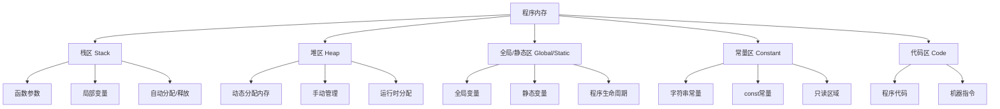

# C vs C++ 内存管理深度对比

## 内存模型对比

### C/C++ 通用内存模型



| 内存区域        | 特点                                                         |
| --------------- | ------------------------------------------------------------ |
| **栈区(Stack)** | 自动分配/释放，存储函数参数和局部变量，大小有限              |
| **堆区(Heap)**  | 手动分配/释放，动态内存分配，空间大但管理复杂                |
| **全局区**      | 存储全局变量和静态变量，分为初始化(.data)和未初始化(.bss)区域 |
| **常量区**      | 存储字符串常量和const常量，只读属性                          |
| **代码区**      | 存储可执行代码和只读常量                                     |

## malloc/free vs new/delete 核心对比

| 特性                   | malloc/free (C)                   | new/delete (C++)                             |
| ---------------------- | --------------------------------- | -------------------------------------------- |
| **类型安全**           | 返回`void*`，需要强制转换，不安全 | 返回具体类型的指针，类型安全                 |
| **构造/析构函数**      | 不调用构造函数和析构函数          | 调用构造函数（new）和析构函数（delete）      |
| **返回值**             | 成功返回指针，失败返回NULL        | 成功返回指针，失败抛出`std::bad_alloc`       |
| **错误处理**           | 通过检查返回值判断                | 通过异常机制（也可使用nothrow版本）          |
| **多态行为**           | 不支持多态（需要手动管理）        | 支持多态（正确调用派生类析构函数需虚析构）   |
| **内存分配与释放对应** | `malloc` 对应 `free`              | `new` 对应 `delete`，`new[]` 对应 `delete[]` |


### 1. 类型安全

```c
// C: malloc 返回 void*，需要强制类型转换
int* arr = (int*)malloc(10 * sizeof(int)); 
// 类型错误不会在编译时捕获
```

```cpp
// C++: new 返回具体类型指针
int* arr = new int[10]; 
// 类型安全，编译时检查
```

### 2. 构造/析构函数

```c
// C: 不调用构造函数
struct Point { int x, y; };
Point* p = (Point*)malloc(sizeof(Point));
// p->x 和 p->y 未初始化！

// C: 不调用析构函数
free(p);
```

```cpp
// C++: 调用构造函数
class Widget {
public:
    Widget() { std::cout << "构造\n"; }
    ~Widget() { std::cout << "析构\n"; }
};

Widget* w = new Widget(); // 调用构造函数
delete w;                 // 调用析构函数
```

### 3. 返回值与错误处理

```c
// C: 返回NULL表示失败
int* ptr = malloc(10000000000 * sizeof(int));
if (ptr == NULL) {
    perror("malloc失败");
    // 处理错误
}
```

```cpp
// C++: 抛出std::bad_alloc异常
try {
    int* big = new int[10000000000];
} catch (const std::bad_alloc& e) {
    std::cerr << "内存分配失败: " << e.what() << '\n';
}

// 或使用nothrow版本
int* p = new(std::nothrow) int[100];
if (!p) {
    // 处理分配失败
}
```

### 4. 多态行为

```c
// C: 不支持多态
typedef struct Shape { void (*draw)(struct Shape*); } Shape;
typedef struct Circle { Shape base; int radius; } Circle;

void drawCircle(Shape* s) { /* 实现 */ }

Circle* c = malloc(sizeof(Circle));
c->base.draw = drawCircle;
```

```cpp
// C++: 支持多态
class Shape {
public:
    virtual void draw() = 0;
    virtual ~Shape() = default; // 虚析构函数确保正确析构
};

class Circle : public Shape {
public:
    void draw() override { /* 实现 */ }
};

Shape* s = new Circle();
s->draw(); // 调用Circle::draw()
delete s;  // 正确调用Circle析构函数
```

### 5. 内存分配与释放对应性

| 分配函数       | 释放函数   | 注意事项               |
| -------------- | ---------- | ---------------------- |
| `malloc`       | `free`     | C风格                  |
| `new`          | `delete`   | 单个对象               |
| `new[]`        | `delete[]` | 对象数组               |
| `new(nothrow)` | `delete`   | 不抛出异常的版本       |
| `new(addr)`    | 显式析构   | placement new 特殊形式 |

**常见错误：**
```cpp
int* arr = new int[10];
delete arr;      // 错误！应该用 delete[]
                // 可能导致内存泄漏或未定义行为

Widget* w = new Widget();
free(w);         // 错误！不会调用析构函数
```

## 高级特性拓展

### 1. Placement new (定位new)

```cpp
#include <new> // 必须包含的头文件

char buffer[sizeof(Widget)]; // 预分配内存

// 在buffer上构造Widget对象
Widget* w = new (buffer) Widget("参数"); 

// 使用对象
w->doSomething();

// 显式调用析构函数（必须！）
w->~Widget();

// 注意：不需要delete，因为内存不是new分配的
```

**应用场景：**
- 内存池实现
- 自定义内存管理
- 在特定内存位置构造对象

### 2. realloc (C风格内存调整)

```c
int* arr = malloc(5 * sizeof(int)); // 初始分配5个int

// 重新分配为10个int
int* new_arr = realloc(arr, 10 * sizeof(int));
if (new_arr) {
    arr = new_arr; // 使用新指针
} else {
    // 处理失败，原指针仍然有效
    free(arr); // 清理
}

// 注意：realloc可能移动内存位置
```

**C++替代方案：**
```cpp
std::vector<int> vec(5); // 初始5个元素
vec.resize(10);          // 调整到10个元素
```

### 3. allocator 和 allocator_traits

**自定义分配器：**
```cpp
#include <memory>

template <typename T>
struct SimpleAllocator {
    using value_type = T;
    
    T* allocate(size_t n) {
        std::cout << "分配 " << n << " 个对象\n";
        return static_cast<T*>(::operator new(n * sizeof(T)));
    }
    
    void deallocate(T* p, size_t n) {
        std::cout << "释放 " << n << " 个对象\n";
        ::operator delete(p);
    }
};

// 使用自定义分配器
std::vector<int, SimpleAllocator<int>> vec;
vec.push_back(42); // 使用自定义分配
```

**使用 allocator_traits：**
```cpp
using AllocTraits = std::allocator_traits<SimpleAllocator<int>>;

SimpleAllocator<int> alloc;
int* p = AllocTraits::allocate(alloc, 1); // 分配1个int

// 构造对象
AllocTraits::construct(alloc, p, 42); 

// 销毁对象
AllocTraits::destroy(alloc, p);

// 释放内存
AllocTraits::deallocate(alloc, p, 1);
```

**allocator_traits 的优势：**
- 提供统一的分配器接口
- 支持不完整类型的分配器
- 自动处理构造/析构
- 支持传播分配器状态

## 最佳实践总结

| 场景               | C 推荐方式          | C++ 推荐方式                 |
| ------------------ | ------------------- | ---------------------------- |
| 单个对象分配       | malloc + 初始化     | new                          |
| 对象数组分配       | malloc + 循环初始化 | new[]                        |
| 内存重新分配       | realloc             | vector/reserve + resize      |
| 自定义内存管理     | 手动实现            | allocator + allocator_traits |
| 异常安全的内存管理 | 手动检查NULL        | try/catch + RAII             |
| 多态对象管理       | 手动vtable          | 虚函数 + 虚析构函数          |

**C++ 内存管理黄金法则：**
1. 优先使用栈对象和RAII对象（智能指针）
2. new/delete 要成对使用，形式匹配（new/delete, new[]/delete[]）
3. 资源获取即初始化（RAII）是核心原则
4. 避免裸指针管理所有权
5. 自定义分配器用于特定性能场景

```cpp
// C++现代内存管理示例
#include <memory>
#include <vector>

class Resource {
public:
    Resource() { /* 获取资源 */ }
    ~Resource() { /* 释放资源 */ }
};

void modern_cpp_example() {
    // 使用智能指针自动管理
    auto ptr = std::make_unique<Resource>();
    
    // 使用容器管理动态数组
    std::vector<int> data = {1, 2, 3};
    data.reserve(100); // 预分配内存
    
    // 使用自定义分配器（如果需要）
    std::vector<int, SimpleAllocator<int>> custom_vec;
}
```

通过理解C和C++内存管理的差异与联系，开发者可以编写出更安全、高效的内存管理代码，避免常见的内存错误。