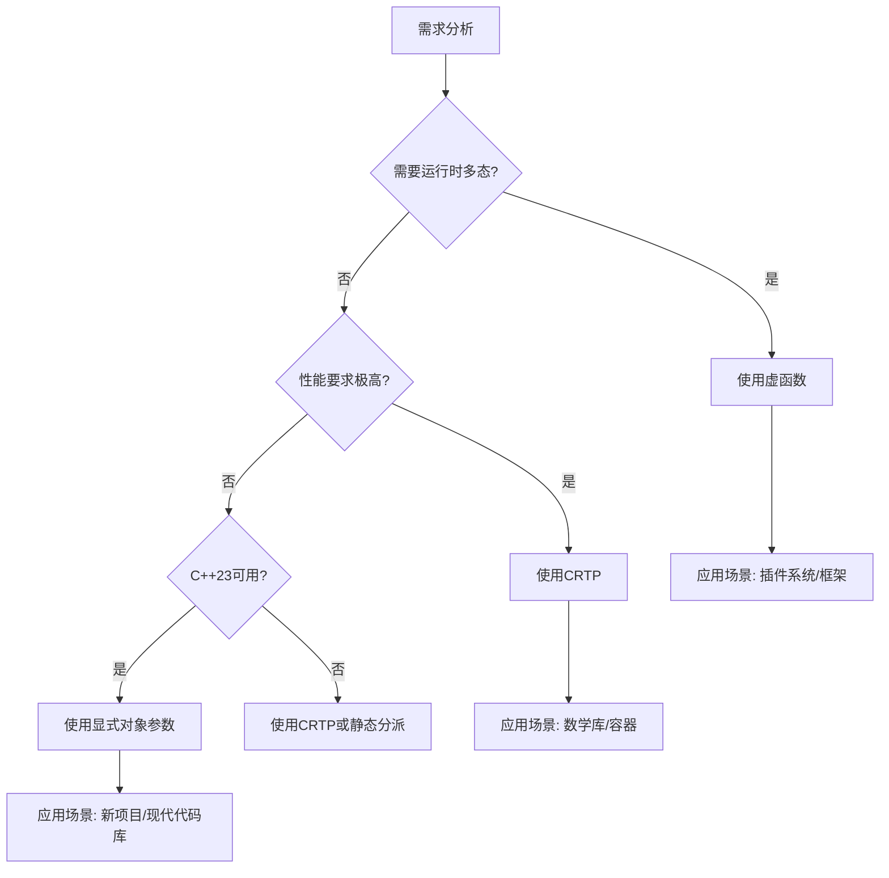

# 现代C++多态编程完全指南：从CRTP到C++23新特性

多态是面向对象编程的核心概念之一，它允许我们以统一的方式处理不同的数据类型，从而提高代码的灵活性和可重用性。C++作为一门支持多种编程范式的语言，提供了丰富且强大的多态编程工具，从传统的虚函数到现代的模板元编程，再到C++23引入的新特性，为开发者提供了多种选择。本指南将全面深入地探讨C++中的多态编程技术，帮助您理解各种技术的原理、适用场景和最佳实践，从而在实际项目中做出明智的技术选型。

## 1. 多态编程基础概念

多态是面向对象编程的三大特性之一，它允许使用统一的接口操作不同的数据类型。在C++中，多态的实现方式多样，每种方式都有其独特的优势和适用场景。理解多态的基本类型和选择策略是编写高效、灵活C++代码的基础。

### 1.1 多态的类型

在C++中，多态主要分为两种类型：

- **静态多态（编译时多态）**：在编译时确定函数调用，无运行时开销
  - 函数重载（Function Overloading）
  - 运算符重载（Operator Overloading）
  - 模板（Templates）
  - CRTP模式

- **动态多态（运行时多态）**：在运行时确定函数调用
  - 虚函数（Virtual Functions）
  - 继承体系中的函数覆盖

### 1.2 多态选择决策树

在实际项目中，选择合适的多态技术至关重要。以下决策树可以帮助您根据具体需求选择最合适的技术：



## 2. CRTP：静态多态的优雅实现

CRTP（Curiously Recurring Template Pattern）是一种高级C++模板编程技术，它通过在基类中使用派生类作为模板参数，实现编译时的静态多态。这种模式避免了虚函数带来的运行时开销，同时提供了类似多态的接口统一性，特别适用于性能敏感的场景。

### 2.1 CRTP基础概念

**CRTP（Curiously Recurring Template Pattern）** 是一种**静态多态**技术，通过模板继承实现编译时多态。它的核心思想是：基类是一个模板类，以派生类作为其模板参数，这样基类就可以在编译时知道派生类的具体类型，从而进行静态绑定和优化。

#### 2.1.1 基本模式

```cpp
template <typename Derived>
class Base {
public:
    void interface() {
        // 将this转换为派生类指针，调用派生类实现
        static_cast<Derived*>(this)->implementation();
    }
    
    // 可选：提供默认实现
    void default_implementation() {
        std::cout << "Default implementation\n";
    }
};

class Derived : public Base<Derived> {
public:
    void implementation() {
        std::cout << "Derived implementation\n";
    }
};
```

### 2.2 CRTP的进阶应用

CRTP不仅可以实现基本的静态多态，还可以用于构建复杂的编译时多态体系，如Mixin模式和静态多态容器。这些高级应用展示了CRTP在构建灵活、高效的系统方面的强大能力。

#### 2.2.1 Mixin模式

Mixin是一种通过组合多个小类来构建复杂功能的技术，CRTP是实现Mixin的理想选择。通过CRTP，每个Mixin都可以访问最终派生类的成员，从而实现编译时的功能组合。

```cpp
// 计数器Mixin
template <typename T>
class CounterMixin {
    inline static size_t count = 0;
    
protected:
    CounterMixin() { ++count; }
    CounterMixin(const CounterMixin&) { ++count; }
    CounterMixin(CounterMixin&&) { ++count; }
    ~CounterMixin() { --count; }
    
public:
    static size_t get_count() { return count; }
};

// 序列化Mixin
template <typename Derived>
class SerializableMixin {
public:
    std::string to_json() const {
        const auto& self = *static_cast<const Derived*>(this);
        return self.serialize_impl();
    }
    
    void from_json(const std::string& json) {
        auto& self = *static_cast<Derived*>(this);
        self.deserialize_impl(json);
    }
};

// 使用多个Mixin
class MyClass : 
    public CounterMixin<MyClass>,
    public SerializableMixin<MyClass> {
private:
    int value;
    std::string name;
    
    friend class SerializableMixin<MyClass>;
    
    std::string serialize_impl() const {
        return R"({"value":)" + std::to_string(value) + 
               R"(,"name":")" + name + R"("})";
    }
    
    void deserialize_impl(const std::string& json) {
        // 简化的JSON解析
        // 实际项目中应使用JSON库
        if (json.find("\"value\":42") != std::string::npos) {
            value = 42;
        }
    }
    
public:
    MyClass(int v, const std::string& n) : value(v), name(n) {}
};
```

#### 2.2.2 静态多态容器

CRTP可以用于创建类型安全的静态多态容器，这些容器在编译时就知道所有可能的类型，从而可以进行更好的优化。这种技术特别适用于需要高性能且类型集合固定的场景。

```cpp
#include <array>
#include <type_traits>

// 静态多态形状基类
template <typename Derived>
class StaticShape {
public:
    double area() const {
        return static_cast<const Derived*>(this)->area_impl();
    }
    
    void draw() const {
        static_cast<const Derived*>(this)->draw_impl();
    }
    
    // 编译时类型检查
    template <typename Other>
    bool is_same_type() const {
        return std::is_same_v<Derived, Other>;
    }
};

class StaticCircle : public StaticShape<StaticCircle> {
private:
    double radius;
    
    friend class StaticShape<StaticCircle>;
    
    double area_impl() const { return 3.14159 * radius * radius; }
    void draw_impl() const { /* 绘制圆形 */ }
    
public:
    StaticCircle(double r) : radius(r) {}
};

class StaticSquare : public StaticShape<StaticSquare> {
private:
    double side;
    
    friend class StaticShape<StaticSquare>;
    
    double area_impl() const { return side * side; }
    void draw_impl() const { /* 绘制正方形 */ }
    
public:
    StaticSquare(double s) : side(s) {}
};

// 静态多态容器（编译时大小固定）
template <typename... Shapes>
class StaticShapeCollection {
    std::tuple<Shapes...> shapes;
    
public:
    StaticShapeCollection(Shapes... args) : shapes(args...) {}
    
    template <size_t N>
    auto& get() {
        return std::get<N>(shapes);
    }
    
    double total_area() const {
        double total = 0;
        std::apply([&total](const auto&... shape) {
            ((total += shape.area()), ...);
        }, shapes);
        return total;
    }
    
    void draw_all() const {
        std::apply([](const auto&... shape) {
            (shape.draw(), ...);
        }, shapes);
    }
};

// 使用示例
void demo_static_collection() {
    StaticShapeCollection<StaticCircle, StaticSquare> collection(
        StaticCircle(5.0), 
        StaticSquare(4.0)
    );
    
    std::cout << "Total area: " << collection.total_area() << std::endl;
    collection.draw_all();
}
```

### 2.3 CRTP的优势与限制

CRTP作为一种静态多态技术，具有显著的性能优势，但也存在一些限制。了解这些优势和限制有助于在实际项目中做出正确的技术选型。

#### ✅ **优势**

- **零运行时开销**：完全编译时解析
- **类型安全**：编译时类型检查
- **内联优化**：编译器可内联函数调用
- **无虚表指针**：节省内存（每个对象节省8字节）

#### ❌ **限制**

- **编译时代码膨胀**：每个模板实例化产生独立代码
- **难以调试**：模板错误信息复杂
- **运行时灵活性差**：无法在运行时改变行为
- **继承深度限制**：过深的CRTP继承链影响编译速度

## 3. 虚函数：经典动态多态

虚函数是C++中实现运行时多态的传统机制，通过虚函数表（vtable）实现动态绑定。虽然虚函数有一定的运行时开销，但它提供了最大的灵活性，是构建可扩展面向对象系统的基石。

### 3.1 虚函数机制深度解析

虚函数的实现基于虚函数表机制，每个包含虚函数的类都有一个虚函数表，其中存储了虚函数的地址。对象中包含一个指向虚函数表的指针，通过这个指针实现运行时多态。理解虚函数表的工作原理对于编写高效的C++代码至关重要。

#### 3.1.1 虚函数表（vtable）工作原理

虚函数表是C++实现动态多态的核心数据结构。每个包含虚函数的类都有一个虚函数表，其中按声明顺序存储了虚函数的地址。对象中包含一个指向该表的指针（vptr），通过这个指针在运行时确定调用哪个函数。

```cpp
class Base {
public:
    virtual void func1() { std::cout << "Base::func1\n"; }
    virtual void func2() { std::cout << "Base::func2\n"; }
    virtual ~Base() {}
};

class Derived : public Base {
public:
    void func1() override { std::cout << "Derived::func1\n"; }
    // func2 使用Base的实现
};

// 内存布局示例
void explore_vtable() {
    Derived d;
    Base* b = &d;
    
    // 虚函数表指针位于对象起始位置
    void** vptr = *(void***)&d;
    
    std::cout << "虚函数表地址: " << vptr << std::endl;
    std::cout << "func1地址: " << vptr[0] << std::endl;
    std::cout << "func2地址: " << vptr[1] << std::endl;
    std::cout << "析构函数地址: " << vptr[2] << std::endl;
    
    // 通过函数指针调用
    using FuncPtr = void(*)();
    FuncPtr f1 = (FuncPtr)vptr[0];
    f1();  // 输出: Derived::func1
}
```

#### 3.1.2 构造函数中的虚函数问题 (调用顺序)

在C++中，构造函数调用虚函数是一个常见的陷阱。由于对象构造的顺序特性，在基类构造函数中调用虚函数时，不会调用派生类的重写版本，而是调用基类自己的版本。这是因为在基类构造函数执行时，派生类部分尚未初始化，出于安全考虑，C++将虚函数机制限制为当前构造的类层次。

**问题描述**：在基类构造函数中调用虚函数时，不会调用派生类的重写版本。

```cpp
class Animal {
public:
    Animal() {
        // ⚠️ 危险：这里调用的是Animal::speak()，不是派生类的实现
        speak();  
    }
    
    virtual void speak() {
        std::cout << "Animal speaks\n";
    }
};

class Dog : public Animal {
public:
    Dog() : Animal() {}
    
    void speak() override {
        std::cout << "Dog barks\n";
    }
};

// 测试
Dog d;  // 输出: "Animal speaks"，而不是"Dog barks"
```

**关键点：在基类的构造函数中，调用的虚函数是基类自己的版本，而不是派生类的版本。**

**原因分析**：

1. **构造顺序**：
   * 创建`Dog`对象时，先构造`Animal`部分，再构造`Dog`特有部分
   * 在 `Animal` 的构造函数执行时，`Dog` 对象中的 `Animal` 部分已经构造完成，但 `Dog` 特有的部分**还未构造**
2. **虚表指针变化**：
   - 在`Animal`构造函数中，虚表指针指向`Animal`的虚函数表
   - 进入`Dog`构造函数后，虚表指针才被修改为指向`Dog`的虚函数表
   - 因此，在 `Animal::Animal()` 中调用 `speak()` 时，虚函数机制解析到的是 `Animal::speak()`，而不是 `Dog::speak()`
3. **安全性考虑**：派生类成员在基类构造函数执行期间尚未初始化，调用派生类虚函数可能导致访问未初始化数据

**解决方案**：

**方案1：使用工厂方法模式**

```cpp
class Animal {
protected:
    Animal() = default;  // 保护构造函数
    
public:
    // 工厂方法
    static std::unique_ptr<Animal> create() {
        auto obj = std::unique_ptr<Animal>(new Animal());
        obj->post_construct();  // 构造后初始化
        return obj;
    }
    
    virtual ~Animal() = default;
    
private:
    virtual void post_construct() {
        // 基类初始化逻辑
    }
};

class Dog : public Animal {
protected:
    Dog() = default;
    
private:
    void post_construct() override {
        Animal::post_construct();
        // Dog特有的初始化
        speak();  // 现在可以安全调用虚函数
    }
    
public:
    void speak() override {
        std::cout << "Dog barks\n";
    }
    
    // 友元工厂
    friend class AnimalFactory;
};
```

**方案2：使用两阶段构造**

```cpp
class Animal {
public:
    // 第一阶段：基本构造
    Animal() = default;
    
    // 第二阶段：初始化
    virtual void initialize() {
        // 基类初始化
    }
    
    virtual void speak() = 0;
};

class Dog : public Animal {
public:
    void initialize() override {
        Animal::initialize();
        // Dog特有初始化
    }
    
    void speak() override {
        std::cout << "Dog barks\n";
    }
};

// 使用
Dog dog;
dog.initialize();  // 显式初始化
dog.speak();       // 安全调用
```

#### 3.1.3 析构函数中的虚函数

与构造函数类似，在析构函数中调用虚函数也会调用当前类的版本，而不是派生类的版本。这是因为在基类析构函数执行时，派生类部分已经被销毁，调用派生类的虚函数可能访问已销毁的数据，导致未定义行为。

类似地，在析构函数中调用虚函数也会调用当前类的版本：

```cpp
class Base {
public:
    virtual ~Base() {
        cleanup();  // 调用Base::cleanup()
    }
    
    virtual void cleanup() {
        std::cout << "Base cleanup\n";
    }
};

class Derived : public Base {
public:
    ~Derived() override {
        // 析构顺序：先Derived，后Base
    }
    
    void cleanup() override {
        std::cout << "Derived cleanup\n";
    }
};

// 测试
{
    Derived d;
    // 析构时输出: "Base cleanup"
    // 因为~Base()在~Derived()之后执行
}
```

### 3.2 高级虚函数技巧

除了基本的虚函数用法，C++还提供了一些高级特性，如协变返回类型、final和override关键字等，这些特性可以帮助我们编写更安全、更灵活的多态代码。

#### 3.2.1 协变返回类型（Covariant Return Types）

协变返回类型允许派生类重写基类虚函数时，返回类型可以是基类函数返回类型的派生类。这一特性在实现克隆模式等场景中非常有用，可以避免不必要的类型转换。

```cpp
class Base {
public:
    virtual Base* clone() const {
        return new Base(*this);
    }
    
    virtual ~Base() = default;
};

class Derived : public Base {
public:
    // 协变返回类型：返回Derived*而不是Base*
    Derived* clone() const override {
        return new Derived(*this);
    }
    
    void derived_method() {
        std::cout << "Derived method\n";
    }
};

// 使用协变返回类型
void demo_covariant() {
    Derived d;
    Base* b1 = &d;
    
    // 不需要dynamic_cast
    Derived* d1 = d.clone();  // 直接返回Derived*
    Base* b2 = b1->clone();   // 返回Base*，但实际是Derived对象
    
    if (auto* derived = dynamic_cast<Derived*>(b2)) {
        derived->derived_method();  // 可以调用派生类方法
    }
}
```

#### 3.2.2 final和override关键字

C++11引入的override和final关键字极大地提高了虚函数使用的安全性。override确保函数确实重写了基类的虚函数，final阻止派生类进一步重写某个虚函数，这些关键字可以帮助编译器发现潜在的错误。

```cpp
class Base {
public:
    virtual void func() {
        std::cout << "Base::func\n";
    }
    
    // final阻止进一步重写
    virtual void final_func() final {
        std::cout << "Cannot override this\n";
    }
};

class Derived : public Base {
public:
    // override确保正确重写基类虚函数
    void func() override {
        std::cout << "Derived::func\n";
    }
    
    // 错误：不能重写final函数
    // void final_func() override {}
};

class FurtherDerived : public Derived {
public:
    // 错误：func在Derived中不是虚函数（虽然没有标记virtual）
    // 但实际上Derived::func是虚函数，因为Base::func是虚函数
    void func() override {
        std::cout << "FurtherDerived::func\n";
    }
};
```

### 3.3 性能优化技巧

虚函数调用虽然灵活，但有一定的运行时开销。了解虚函数的性能特点并采取适当的优化策略，可以在保持多态优势的同时提高程序性能。

#### 3.3.1 虚函数调用的开销

虚函数调用涉及三个步骤：通过虚表指针找到虚表，通过虚表找到函数地址，间接调用函数。虽然现代CPU的间接调用预测器可以缓解这部分开销，但在性能关键代码中仍然需要注意。

虚函数调用涉及：

1. 通过虚表指针找到虚表
2. 通过虚表找到函数地址
3. 间接调用函数

**优化策略**：

```cpp
// 优化前：频繁调用的虚函数
class Shape {
public:
    virtual double area() const = 0;
    virtual void draw() const = 0;
};

// 优化1：非虚接口模式（NVI）
class OptimizedShape {
public:
    // 公共接口非虚
    double area() const {
        // 可能的预处理
        return area_impl();
    }
    
    void draw() const {
        // 可能的预处理
        draw_impl();
        // 可能的后处理
    }
    
protected:
    // 实现细节为虚函数
    virtual double area_impl() const = 0;
    virtual void draw_impl() const = 0;
};

// 优化2：批量处理减少虚函数调用
class ShapeProcessor {
    std::vector<Shape*> shapes;
    
public:
    void process_all() {
        // 批量计算面积（仍然需要虚函数调用）
        double total = 0;
        for (auto shape : shapes) {
            total += shape->area();  // 虚函数调用
        }
        
        // 更好的方式：如果可能，使用模板
        process_all_impl<Shape>();
    }
    
private:
    template <typename T>
    void process_all_impl() {
        // 假设我们知道所有形状类型
        double total = 0;
        for (auto shape : shapes) {
            if (auto* specific = dynamic_cast<T*>(shape)) {
                total += specific->area();  // 非虚调用或静态分派
            }
        }
    }
};
```

## 4. C++23显式对象参数：现代化静态多态

C++23引入了显式对象参数（deducing this）特性，这是一种新的静态多态实现方式。它结合了CRTP的性能优势和更简洁的语法，为现代C++多态编程提供了新的选择。

### 4.1 基础用法

显式对象参数通过在成员函数参数列表中使用`this auto&& self`语法，使成员函数成为模板函数，从而在编译时推导对象类型。这种技术可以实现静态多态，同时避免了CRTP的复杂模板语法。

```cpp
class ShapeDeducingThis {
public:
    // 使用显式对象参数
    void draw(this auto&& self) {
        // self的类型在编译时推导
        self.draw_impl();
    }
    
    double area(this auto&& self) {
        return self.area_impl();
    }
    
    // 支持const和非const版本
    std::string name(this const auto& self) {
        return self.name_impl();
    }
    
    void scale(this auto& self, double factor) {
        self.scale_impl(factor);
    }
};

class CircleDeducingThis : public ShapeDeducingThis {
private:
    double radius;
    
    void draw_impl() {
        std::cout << "Drawing circle, radius = " << radius << std::endl;
    }
    
    double area_impl() const {
        return 3.14159 * radius * radius;
    }
    
    std::string name_impl() const {
        return "Circle";
    }
    
    void scale_impl(double factor) {
        radius *= factor;
    }
    
public:
    explicit CircleDeducingThis(double r) : radius(r) {}
};
```

### 4.2 高级特性

显式对象参数不仅支持基本的静态多态，还支持值类别推导和递归lambda等高级特性，这些特性使得代码更加灵活和表达力强。

#### 4.2.1 值类别推导

显式对象参数可以自动推导对象的值的类别（左值、右值、const等），这使得我们可以为不同值类别的对象提供不同的实现，这在实现移动语义和完美转发时特别有用。

```cpp
class ValueCategoryDemo {
public:
    // 处理左值
    void process(this ValueCategoryDemo& self) {
        std::cout << "处理左值对象\n";
        self.modify();  // 可以修改
    }
    
    // 处理const对象
    void process(this const ValueCategoryDemo& self) {
        std::cout << "处理const对象\n";
        // self.modify();  // 错误：不能修改const对象
    }
    
    // 处理右值
    void process(this ValueCategoryDemo&& self) {
        std::cout << "处理右值对象\n";
        // 可以移动资源
    }
    
    void modify() {
        std::cout << "修改对象\n";
    }
};

void demo_value_categories() {
    ValueCategoryDemo obj;
    const ValueCategoryDemo const_obj;
    
    obj.process();           // 调用左值版本
    const_obj.process();     // 调用const版本
    ValueCategoryDemo{}.process();  // 调用右值版本
}
```

#### 4.2.2 递归lambda与显式对象参数

传统的递归lambda需要借助std::function，这有一定的性能开销。使用显式对象参数，我们可以创建真正的递归lambda，无需额外的性能开销，同时代码更加简洁。

```cpp
// 传统递归lambda需要std::function
auto factorial_traditional = [](int n) -> int {
    std::function<int(int)> helper = [&](int x) -> int {
        return x <= 1 ? 1 : x * helper(x - 1);
    };
    return helper(n);
};

// 使用显式对象参数的递归lambda
auto factorial_deducing = [](this auto self, int n) -> int {
    return n <= 1 ? 1 : n * self(n - 1);
};

// 使用示例
void demo_recursive_lambda() {
    std::cout << "5! = " << factorial_traditional(5) << std::endl;    // 120
    std::cout << "5! = " << factorial_deducing(5) << std::endl;       // 120
    
    // 支持泛型递归
    auto fibonacci = [](this auto self, int n) -> int {
        if (n <= 1) return n;
        return self(n - 1) + self(n - 2);
    };
    
    std::cout << "fib(10) = " << fibonacci(10) << std::endl;  // 55
}
```

### 4.3 与CRTP的对比

显式对象参数和CRTP都是实现静态多态的技术，但它们在语法、使用方式和适用场景上有所不同。理解它们的差异有助于在实际项目中选择合适的技术。

```cpp
// CRTP实现
template <typename Derived>
class CRTPBase {
public:
    void crtp_method() {
        auto& self = static_cast<Derived&>(*this);
        self.impl();
    }
};

// 显式对象参数实现
class DeducingBase {
public:
    void deducing_method(this auto& self) {
        self.impl();
    }
};

// 两种方式的派生类
class CRTPDerived : public CRTPBase<CRTPDerived> {
public:
    void impl() { std::cout << "CRTP impl\n"; }
};

class DeducingDerived : public DeducingBase {
public:
    void impl() { std::cout << "Deducing impl\n"; }
};

// 使用对比
void compare_implementations() {
    CRTPDerived crtp_obj;
    DeducingDerived deducing_obj;
    
    crtp_obj.crtp_method();    // 输出: CRTP impl
    deducing_obj.deducing_method();  // 输出: Deducing impl
    
    // 关键区别：容器存储
    std::vector<DeducingBase*> deducing_vec;
    // std::vector<CRTPBase*> crtp_vec; // 错误：CRTPBase是模板
    
    deducing_vec.push_back(&deducing_obj);
    for (auto obj : deducing_vec) {
        obj->deducing_method();  // 静态分派，调用正确实现
    }
}
```

## 5. 多继承与菱形继承

多继承是C++中一个强大但复杂的特性，它允许一个类从多个基类继承。虽然多继承提供了极大的灵活性，但也带来了菱形继承、同名冲突等问题。理解这些问题及其解决方案是掌握C++多态编程的重要部分。

### 5.1 多继承的挑战与解决方案

多继承的主要挑战包括同名函数冲突和指针偏移问题。这些问题源于多个基类在派生类中的内存布局，理解这些底层细节对于正确使用多继承至关重要。

#### 5.1.1 同名函数冲突

当多个基类有同名函数时，派生类中会出现二义性。C++提供了多种解决同名冲突的方法，包括作用域解析符、using声明和函数重写等。

```cpp
class Printer {
public:
    void print(const std::string& msg) {
        std::cout << "Printer: " << msg << std::endl;
    }
};

class Scanner {
public:
    void print(const std::string& msg) {
        std::cout << "Scanner: " << msg << std::endl;
    }
    
    void scan() {
        std::cout << "Scanning document\n";
    }
};

class MultifunctionDevice : public Printer, public Scanner {
public:
    // 解决方案1：使用作用域解析符
    void print_with_printer(const std::string& msg) {
        Printer::print(msg);
    }
    
    void print_with_scanner(const std::string& msg) {
        Scanner::print(msg);
    }
    
    // 解决方案2：使用using声明引入特定版本
    using Printer::print;  // 引入Printer::print
    
    // 解决方案3：重写并提供统一接口
    void print(const std::string& msg) override {
        std::cout << "MultifunctionDevice: " << msg << std::endl;
    }
};

void demo_multiple_inheritance() {
    MultifunctionDevice mfd;
    
    // 方法1：直接指定
    mfd.Printer::print("Hello from Printer");
    mfd.Scanner::print("Hello from Scanner");
    
    // 方法2：通过using声明
    mfd.print("Hello");  // 调用Printer::print
    
    // 方法3：使用统一接口
    mfd.MultifunctionDevice::print("Hello from device");
}
```

#### 5.1.2 指针偏移问题

在多继承中，派生类对象包含多个基类子对象，这些子对象在内存中的位置不同。当在派生类指针和不同基类指针之间转换时，需要进行指针调整。忽略这一点会导致严重的运行时错误。

**对象内存布局示例**

```
Derived对象内存布局：
+-------------------+
| Base1 vtable ptr |  <- Derived* 指向这里
| Base1::b1_data   |
+-------------------+
| Base2 vtable ptr |  <- Base2* 指向这里（偏移sizeof(Base1)）
| Base2::b2_data   |
+-------------------+
| Derived::d_data  |
+-------------------+
```

**问题描述**：在多继承中，派生类包含多个基类子对象，这些子对象在派生类对象内存中的位置不同，导致**从派生类指针到不同基类指针的转换需要进行地址调整**。

```cpp
class Base1 {
public:
    int data1 = 100;
    virtual void func1() { std::cout << "Base1::func1\n"; }
};

class Base2 {
public:
    int data2 = 200;
    virtual void func2() { std::cout << "Base2::func2\n"; }
};

class Derived : public Base1, public Base2 {
public:
    int derived_data = 300;
    
    void func1() override { std::cout << "Derived::func1\n"; }
    void func2() override { std::cout << "Derived::func2\n"; }
    
    void derived_func() { std::cout << "Derived::derived_func\n"; }
};

void demo_pointer_offset() {
    Derived d;
    
    std::cout << "地址分析:\n";
    std::cout << "Derived*:    " << &d << std::endl;
    std::cout << "Base1*:      " << static_cast<Base1*>(&d) << std::endl;
    std::cout << "Base2*:      " << static_cast<Base2*>(&d) << std::endl;
    
    // 错误的转换（忘记指针偏移）
    Base2* pb2 = &d;
    // Derived* pd_wrong = (Derived*)pb2;  // 危险！不会调整指针
    
    // 正确的转换
    Derived* pd_correct = dynamic_cast<Derived*>(pb2);  // 编译器处理偏移
    if (pd_correct) {
        std::cout << "正确转换后的Derived*: " << pd_correct << std::endl;
    }
    
    // 内存布局分析
    std::cout << "\n内存布局:\n";
    std::cout << "&d.data1: " << &d.data1 << std::endl;
    std::cout << "&d.data2: " << &d.data2 << std::endl;
    std::cout << "&d.derived_data: " << &d.derived_data << std::endl;
}
```

**指针偏移的解决方案**：

```cpp
// 方案1：使用正确的类型转换
void safe_conversions() {
    Derived* pd = new Derived();
    
    // 向上转换：使用static_cast（或隐式转换）
    Base1* pb1 = static_cast<Base1*>(pd);  // 编译器自动处理偏移
    Base2* pb2 = static_cast<Base2*>(pd);  // 正确调整指针
    
    // 向下转换：使用dynamic_cast
    if (Derived* pd2 = dynamic_cast<Derived*>(pb2)) {
        // 安全，编译器处理了指针调整
        pd2->derived_func();
    }
    
    delete pd;
}

// 方案2：避免void*存储多态对象
template <typename T>
class PolymorphicStorage {
    T* ptr;
    
public:
    template <typename U>
    PolymorphicStorage(U* p) : ptr(p) {
        // 存储原始类型信息
        static_assert(std::is_base_of_v<T, U>, 
                     "U must be derived from T");
    }
    
    T* get() const { return ptr; }
    
    template <typename U>
    U* as() const {
        return dynamic_cast<U*>(ptr);
    }
};

// 方案3：使用访问者模式避免类型转换
class BaseVisitor {
public:
    virtual void visit(Base1&) = 0;
    virtual void visit(Base2&) = 0;
    virtual ~BaseVisitor() = default;
};

class DerivedVisitor : public BaseVisitor {
public:
    void visit(Base1& b1) override {
        std::cout << "Visiting Base1\n";
    }
    
    void visit(Base2& b2) override {
        std::cout << "Visiting Base2\n";
    }
};

class AcceptVisitor {
public:
    virtual void accept(BaseVisitor& visitor) = 0;
    virtual ~AcceptVisitor() = default;
};

class Base1WithAccept : public Base1, public AcceptVisitor {
public:
    void accept(BaseVisitor& visitor) override {
        visitor.visit(*this);
    }
};
```

### 5.2 虚继承与菱形继承问题

菱形继承是多继承中的一个特殊问题，它发生在派生类通过多条路径继承同一个基类时。C++通过虚继承机制解决这个问题，但虚继承也带来了额外的复杂性和性能开销。

#### 5.2.1 菱形继承问题

菱形继承会导致派生类中包含多个基类副本，这不仅浪费内存，还会引起数据不一致和二义性问题。理解菱形继承问题是使用多继承的前提。

```cpp
// 菱形继承问题示例
class Person {
public:
    std::string name;
    Person(const std::string& n) : name(n) {}
    
    virtual void introduce() {
        std::cout << "I am " << name << std::endl;
    }
};

class Teacher : public Person {
public:
    std::string subject;
    Teacher(const std::string& n, const std::string& s) 
        : Person(n), subject(s) {}
    
    void introduce() override {
        std::cout << "I am " << name << ", teaching " << subject << std::endl;
    }
};

class Researcher : public Person {
public:
    std::string field;
    Researcher(const std::string& n, const std::string& f) 
        : Person(n), field(f) {}
    
    void introduce() override {
        std::cout << "I am " << name << ", researching " << field << std::endl;
    }
};

// ⚠️ 问题：TeachingResearcher包含两份Person副本
class TeachingResearcher : public Teacher, public Researcher {
public:
    TeachingResearcher(const std::string& n, const std::string& s, 
                      const std::string& f)
        : Teacher(n, s), Researcher(n, f) {}  // ⚠️ 初始化两份Person
    
    void introduce() override {
        // 二义性：需要指定使用哪个基类的introduce
        Teacher::introduce();
        std::cout << "Also ";
        Researcher::introduce();
    }
};

void demo_diamond_problem() {
    TeachingResearcher tr("Alice", "Physics", "Quantum Mechanics");
    
    // 问题1：二义性
    // tr.name = "Bob";  // 错误：不明确，是Teacher::name还是Researcher::name?
    
    // 需要指定
    tr.Teacher::name = "Alice Teacher";
    tr.Researcher::name = "Alice Researcher";
    
    tr.introduce();
    
    // 问题2：内存浪费
    std::cout << "\n内存布局问题:\n";
    std::cout << "Size of Person: " << sizeof(Person) << std::endl;
    std::cout << "Size of Teacher: " << sizeof(Teacher) << std::endl;
    std::cout << "Size of Researcher: " << sizeof(Researcher) << std::endl;
    std::cout << "Size of TeachingResearcher: " 
              << sizeof(TeachingResearcher) << std::endl;
}
```

#### 5.2.2 虚继承解决方案

虚继承是C++解决菱形继承问题的标准机制。通过虚继承，可以确保最顶层的基类在继承体系中只有一个实例。但虚继承也带来了额外的复杂性和性能开销，需要谨慎使用。

##### 5.2.2.1  什么是虚继承（Virtual Inheritance）？

虚继承是C++中解决**多重继承**中菱形继承问题的一种机制。

**菱形继承问题示例：**

```cpp
class A {
public:
    int data;
};

class B : public A { };  // B继承A
class C : public A { };  // C继承A

class D : public B, public C { };  // D同时继承B和C
```


此时D对象中会有**两份A的拷贝**，造成数据冗余和二义性。

##### 5.2.2.2 虚继承的解决方案

```cpp
class A {
public:
    int data;
};

class B : virtual public A { };  // 虚继承
class C : virtual public A { };  // 虚继承

class D : public B, public C { };
```

现在D对象中只有**一份A的拷贝**。

##### 5.2.2.3 虚继承的用途

- **解决菱形继承问题**：确保最顶层的基类在继承体系中只有一个实例
- **节约内存**：避免同一基类的多份拷贝
- **消除二义性**：通过虚继承，访问基类成员时不会产生歧义


```cpp
// 使用虚继承解决菱形继承问题
class VirtualPerson {
public:
    std::string name;
    VirtualPerson(const std::string& n) : name(n) {
        std::cout << "VirtualPerson constructor: " << name << std::endl;
    }
    
    virtual ~VirtualPerson() = default;
    
    virtual void introduce() {
        std::cout << "I am " << name << std::endl;
    }
};

// 虚继承
class VirtualTeacher : virtual public VirtualPerson {
public:
    std::string subject;
    
    // 虚继承的构造函数需要特殊处理
    VirtualTeacher(const std::string& n, const std::string& s) 
        : VirtualPerson(n), subject(s) {
        std::cout << "VirtualTeacher constructor\n";
    }
    
    void introduce() override {
        std::cout << "I am " << name << ", teaching " << subject << std::endl;
    }
};

// 虚继承
class VirtualResearcher : virtual public VirtualPerson {
public:
    std::string field;
    
    VirtualResearcher(const std::string& n, const std::string& f) 
        : VirtualPerson(n), field(f) {
        std::cout << "VirtualResearcher constructor\n";
    }
    
    void introduce() override {
        std::cout << "I am " << name << ", researching " << field << std::endl;
    }
};

// 现在TeachingResearcher只有一份Person副本
class VirtualTeachingResearcher : public VirtualTeacher, public VirtualResearcher {
public:
    // 需要直接初始化虚基类
    VirtualTeachingResearcher(const std::string& n, const std::string& s, 
                             const std::string& f)
        : VirtualPerson(n),  // 直接初始化虚基类
          VirtualTeacher(n, s), 
          VirtualResearcher(n, f) {
        std::cout << "VirtualTeachingResearcher constructor\n";
    }
    
    void introduce() override {
        // 没有二义性，name只有一份
        std::cout << "I am " << name 
                  << ", teaching " << subject 
                  << " and researching " << field << std::endl;
    }
};

void demo_virtual_inheritance() {
    std::cout << "=== 虚继承示例 ===\n";
    VirtualTeachingResearcher vtr("Bob", "Computer Science", "AI");
    
    // 没有二义性
    vtr.name = "Robert";
    vtr.introduce();
    
    std::cout << "\n内存布局改进:\n";
    std::cout << "Size of VirtualTeachingResearcher: " 
              << sizeof(VirtualTeachingResearcher) << std::endl;
    
    // 虚继承的内存布局包含虚基类指针
    std::cout << "\n虚继承构造顺序:\n";
    // 输出会显示构造顺序
}
```

#### 5.2.3 虚继承的代价与最佳实践

虚继承虽然解决了菱形继承问题，但也带来了额外的开销和复杂性。了解这些代价并遵循最佳实践，可以在需要时正确使用虚继承，同时在可能的情况下寻找更简单的替代方案。

**虚继承的代价**：

1. **额外的指针开销**：每个虚继承层次添加虚基类指针
2. **复杂的构造顺序**：需要直接初始化虚基类
3. **性能影响**：通过虚基类指针访问成员有额外间接层
4. **调试复杂度**：内存布局更复杂

**最佳实践**：

```cpp
// 推荐：使用组合替代多重继承
class TeachingResearcherComposition {
private:
    // 组合而非继承
    Teacher teacher;
    Researcher researcher;
    
public:
    TeachingResearcherComposition(const std::string& name,
                                 const std::string& subject,
                                 const std::string& field)
        : teacher(name, subject), researcher(name, field) {}
    
    void introduce() {
        std::cout << teacher.name << " teaches " << teacher.subject 
                  << " and researches " << researcher.field << std::endl;
    }
    
    // 委托方法
    void teach() { /* 委托给teacher */ }
    void research() { /* 委托给researcher */ }
};

// 推荐：使用接口继承
class ITeacher {
public:
    virtual void teach() = 0;
    virtual ~ITeacher() = default;
};

class IResearcher {
public:
    virtual void research() = 0;
    virtual ~IResearcher() = default;
};

class ModernTeachingResearcher : public ITeacher, public IResearcher {
private:
    std::string name;
    std::string subject;
    std::string field;
    
public:
    ModernTeachingResearcher(const std::string& n, 
                           const std::string& s, 
                           const std::string& f)
        : name(n), subject(s), field(f) {}
    
    void teach() override {
        std::cout << name << " teaching " << subject << std::endl;
    }
    
    void research() override {
        std::cout << name << " researching " << field << std::endl;
    }
};
```

## 6. 性能对比与基准测试

不同多态技术的性能差异显著，特别是在高性能计算和实时系统中，选择合适的多态技术对系统性能有重大影响。通过基准测试和内存分析，我们可以量化各种技术的性能特征，为实际项目提供数据支持。

### 6.1 基准测试框架

为了客观比较各种多态技术的性能，我们需要一个可靠的基准测试框架。这个框架应该能够准确测量函数调用开销、内存访问模式等关键指标，并排除编译器优化带来的干扰。

```cpp
#include <chrono>
#include <vector>
#include <random>
#include <memory>

class Benchmark {
public:
    template <typename Func>
    static auto measure(const std::string& name, Func func, 
                       int iterations = 1000000) {
        // 预热缓存
        for (int i = 0; i < 1000; ++i) {
            func();
        }
        
        auto start = std::chrono::high_resolution_clock::now();
        
        for (int i = 0; i < iterations; ++i) {
            func();
        }
        
        auto end = std::chrono::high_resolution_clock::now();
        auto duration = std::chrono::duration_cast<std::chrono::nanoseconds>(
            end - start);
        
        return std::make_pair(name, duration.count() / iterations);
    }
    
    static void run_comparison() {
        constexpr int ITERATIONS = 10000000;
        
        std::vector<std::pair<std::string, long long>> results;
        
        // 测试不同多态技术的性能
        results.push_back(test_crtp(ITERATIONS));
        results.push_back(test_virtual(ITERATIONS));
        results.push_back(test_deducing_this(ITERATIONS));
        results.push_back(test_static_dispatch(ITERATIONS));
        results.push_back(test_dynamic_cast(ITERATIONS));
        
        // 输出结果
        std::cout << "\n=== 性能对比 (纳秒/次) ===\n";
        for (const auto& [name, time] : results) {
            std::cout << name << ": " << time << " ns\n";
        }
    }
    
private:
    // CRTP测试
    static auto test_crtp(int iterations) {
        CRTPCircle circle(5.0);
        
        return measure("CRTP", [&]() {
            volatile double area = circle.area();
            return area;
        }, iterations);
    }
    
    // 虚函数测试
    static auto test_virtual(int iterations) {
        std::unique_ptr<VirtualShape> shape = 
            std::make_unique<VirtualCircle>(5.0);
        
        return measure("虚函数", [&]() {
            volatile double area = shape->area();
            return area;
        }, iterations);
    }
    
    // 显式对象参数测试
    static auto test_deducing_this(int iterations) {
        DeducingCircle circle(5.0);
        
        return measure("显式对象参数", [&]() {
            volatile double area = circle.area();
            return area;
        }, iterations);
    }
    
    // 静态分派测试
    static auto test_static_dispatch(int iterations) {
        StaticCircle circle(5.0);
        
        return measure("静态分派", [&]() {
            volatile double area = circle.area();
            return area;
        }, iterations);
    }
    
    // dynamic_cast测试
    static auto test_dynamic_cast(int iterations) {
        std::vector<std::unique_ptr<VirtualShape>> shapes;
        shapes.push_back(std::make_unique<VirtualCircle>(5.0));
        shapes.push_back(std::make_unique<VirtualSquare>(4.0));
        
        std::random_device rd;
        std::mt19937 gen(rd());
        std::uniform_int_distribution<> dis(0, shapes.size() - 1);
        
        return measure("dynamic_cast", [&]() {
            auto& shape = shapes[dis(gen)];
            if (auto* circle = dynamic_cast<VirtualCircle*>(shape.get())) {
                volatile double area = circle->area();
                return area;
            }
            return 0.0;
        }, iterations / 10);  // 减少迭代次数，因为dynamic_cast较慢
    }
};
```

### 6.2 内存占用分析

除了运行性能，内存占用也是选择多态技术时需要考虑的重要因素。不同的多态技术有不同的内存布局，这会影响到缓存效率、内存带宽使用等系统级性能指标。

```cpp
class MemoryAnalyzer {
public:
    static void analyze_memory_usage() {
        std::cout << "\n=== 内存占用分析 ===\n";
        
        // 虚函数开销
        std::cout << "虚函数开销:\n";
        std::cout << "  sizeof(VirtualShape): " << sizeof(VirtualShape) 
                  << " bytes\n";
        std::cout << "  sizeof(VirtualCircle): " << sizeof(VirtualCircle) 
                  << " bytes\n";
        std::cout << "  虚表指针开销: " 
                  << sizeof(VirtualCircle) - sizeof(double) << " bytes\n";
        
        // CRTP开销
        std::cout << "\nCRTP开销:\n";
        std::cout << "  sizeof(CRTPCircle): " << sizeof(CRTPCircle) 
                  << " bytes (无额外开销)\n";
        
        // 显式对象参数开销
        std::cout << "\n显式对象参数开销:\n";
        std::cout << "  sizeof(DeducingCircle): " << sizeof(DeducingCircle) 
                  << " bytes (无额外开销)\n";
        
        // 多继承开销
        std::cout << "\n多继承开销:\n";
        std::cout << "  sizeof(Derived): " << sizeof(Derived) << " bytes\n";
        std::cout << "  包含 " 
                  << (sizeof(Derived) - sizeof(int) * 3) / sizeof(void*) 
                  << " 个虚表指针\n";
        
        // 虚继承开销
        std::cout << "\n虚继承开销:\n";
        std::cout << "  sizeof(VirtualTeachingResearcher): " 
                  << sizeof(VirtualTeachingResearcher) << " bytes\n";
    }
};
```

## 7. 场景选型与最佳实践

在实际项目中，选择合适的多态技术需要考虑多种因素，包括性能要求、代码复杂度、团队技能水平、项目规模和长期维护等。本节提供具体的技术选型指南和混合使用模式，帮助您在不同场景下做出最佳决策。

### 7.1 技术选型指南

以下表格总结了不同场景下推荐的多态技术及其理由。这个指南基于各种技术的特性、性能表现和适用性，可以作为项目技术选型的参考依据。

| 场景             | 推荐技术          | 理由                                         |
| ---------------- | ----------------- | -------------------------------------------- |
| **游戏引擎**     | CRTP + 虚函数混合 | 性能关键部分用CRTP，需要动态扩展部分用虚函数 |
| **GUI框架**      | 虚函数            | 需要运行时多态，对象类型多变                 |
| **数学库**       | CRTP              | 性能要求高，类型在编译时已知                 |
| **序列化库**     | 显式对象参数      | 需要静态多态，但希望简化CRTP语法             |
| **插件系统**     | 虚函数            | 需要运行时加载和扩展                         |
| **嵌入式系统**   | CRTP/静态分派     | 内存受限，需要避免虚表开销                   |
| **并发容器**     | CRTP              | 需要极致性能，避免虚函数调用开销             |
| **数据格式转换** | 显式对象参数      | 类型安全，性能好，代码简洁                   |

### 7.2 实际项目中的混合使用

在实际的大型项目中，很少只使用一种多态技术。通常需要根据不同的模块和需求，混合使用多种技术。以下示例展示了如何在游戏引擎中混合使用CRTP和虚函数，以平衡性能和灵活性。

```cpp
// 混合使用示例：游戏引擎中的渲染系统
class Renderable {
public:
    virtual ~Renderable() = default;
    
    // 虚函数：运行时多态，支持插件
    virtual void render() const = 0;
    
    // 返回渲染类型ID，用于优化
    virtual uint32_t get_render_type() const = 0;
};

// 静态多态基类：用于性能关键操作
template <typename Derived>
class OptimizedRenderable : public Renderable {
public:
    // 使用CRTP优化变换计算
    void transform(const Matrix4& matrix) {
        auto& self = static_cast<Derived&>(*this);
        self.transform_impl(matrix);
    }
    
    // 静态多态：编译时优化
    BoundingBox calculate_bounds() const {
        const auto& self = static_cast<const Derived&>(*this);
        return self.calculate_bounds_impl();
    }
};

// 具体实现
class Mesh : public OptimizedRenderable<Mesh> {
private:
    std::vector<Vertex> vertices;
    Material material;
    
    friend class OptimizedRenderable<Mesh>;
    
    void transform_impl(const Matrix4& matrix) {
        // 优化的变换计算
        for (auto& vertex : vertices) {
            vertex.position = matrix.transform(vertex.position);
        }
    }
    
    BoundingBox calculate_bounds_impl() const {
        // 优化的包围盒计算
        BoundingBox bounds;
        for (const auto& vertex : vertices) {
            bounds.expand(vertex.position);
        }
        return bounds;
    }
    
public:
    void render() const override {
        // 虚函数实现
        material.bind();
        // 渲染逻辑...
    }
    
    uint32_t get_render_type() const override {
        return RenderType::MESH;
    }
};

// 渲染器：混合使用不同多态技术
class Renderer {
private:
    std::vector<std::unique_ptr<Renderable>> renderables;
    
    // 按类型分组，优化渲染
    std::unordered_map<uint32_t, std::vector<Renderable*>> render_groups;
    
public:
    template <typename T, typename... Args>
    T& create_renderable(Args&&... args) {
        static_assert(std::is_base_of_v<Renderable, T>,
                     "T must derive from Renderable");
        
        auto obj = std::make_unique<T>(std::forward<Args>(args)...);
        auto& ref = *obj;
        
        renderables.push_back(std::move(obj));
        render_groups[ref.get_render_type()].push_back(&ref);
        
        return ref;
    }
    
    void render_all() {
        // 按类型分组渲染，提高缓存效率
        for (auto& [type, group] : render_groups) {
            setup_for_type(type);
            
            for (auto renderable : group) {
                renderable->render();
            }
        }
    }
    
    // 批量处理：使用静态多态优化
    template <typename T>
    void batch_transform(const Matrix4& matrix) {
        for (auto renderable : renderables) {
            if (auto* specific = dynamic_cast<T*>(renderable.get())) {
                specific->transform(matrix);  // 静态多态调用
            }
        }
    }
};
```

## 8. 常见陷阱与调试技巧

多态编程虽然强大，但也容易引入各种陷阱和错误。了解这些常见问题及其解决方案，掌握有效的调试技巧，可以帮助您避免潜在的错误，提高代码质量。

### 8.1 虚函数常见陷阱

虚函数使用中有几个常见的陷阱，包括非虚析构函数、函数隐藏而非重写、在构造函数和析构函数中调用虚函数等。这些问题如果不注意，可能导致内存泄漏、未定义行为等严重问题。

```cpp
// 陷阱1：非虚析构函数
class BaseNoVirtual {
public:
    ~BaseNoVirtual() {  // ⚠️ 非虚析构函数
        std::cout << "Base destructor\n";
    }
};

class DerivedNoVirtual : public BaseNoVirtual {
public:
    ~DerivedNoVirtual() {
        std::cout << "Derived destructor\n";
    }
};

void trap_virtual_destructor() {
    BaseNoVirtual* ptr = new DerivedNoVirtual();
    delete ptr;  // ⚠️ 只调用BaseNoVirtual的析构函数！
    // DerivedNoVirtual的析构函数不会被调用，导致内存泄漏
}

// 解决方案：总是为基类声明虚析构函数
class BaseWithVirtual {
public:
    virtual ~BaseWithVirtual() = default;  // ✅ 正确
};

// 陷阱2：隐藏（hide）而非重写（override）
class BaseHide {
public:
    virtual void func(int x) {
        std::cout << "Base::func(int)\n";
    }
};

class DerivedHide : public BaseHide {
public:
    // ⚠️ 隐藏了基类函数，而不是重写
    void func(double x) {
        std::cout << "Derived::func(double)\n";
    }
};

void trap_hiding() {
    DerivedHide d;
    d.func(5);    // 调用DerivedHide::func(double)
    
    BaseHide* b = &d;
    b->func(5);   // 调用BaseHide::func(int)
}

// 解决方案：使用override关键字
class DerivedCorrect : public BaseHide {
public:
    void func(int x) override {  // ✅ 正确
        std::cout << "Derived::func(int)\n";
    }
};

// 陷阱3：构造函数/析构函数中调用虚函数
class BaseTrap {
public:
    BaseTrap() {
        init();  // ⚠️ 危险
    }
    
    virtual ~BaseTrap() {
        cleanup();  // ⚠️ 危险
    }
    
    virtual void init() {
        std::cout << "Base::init\n";
    }
    
    virtual void cleanup() {
        std::cout << "Base::cleanup\n";
    }
};

// 解决方案：两阶段初始化/清理
class BaseSafe {
protected:
    BaseSafe() = default;
    
public:
    virtual void initialize() {  // 显式初始化
        std::cout << "Base::initialize\n";
    }
    
    virtual void finalize() {    // 显式清理
        std::cout << "Base::finalize\n";
    }
    
    virtual ~BaseSafe() = default;
};
```

### 8.2 调试技巧

多态代码的调试可能比普通代码更复杂，因为涉及动态绑定和可能的类型转换。掌握一些专门的调试技巧可以帮助您更有效地定位和解决多态相关的问题。

```cpp
// 调试技巧1：运行时类型信息
class Debuggable {
public:
    virtual ~Debuggable() = default;
    
    virtual std::string type_name() const {
        return typeid(*this).name();
    }
    
    virtual void debug_info() const {
        std::cout << "Object type: " << type_name() << "\n";
        std::cout << "Address: " << this << "\n";
        std::cout << "Size: " << sizeof(*this) << " bytes\n";
    }
};

// 调试技巧2：追踪虚函数调用
#ifdef DEBUG_VIRTUAL_CALLS
#define TRACE_VIRTUAL_CALL(fname) \
    std::cout << "VIRTUAL CALL: " << fname << " at " << __LINE__ << "\n"
#else
#define TRACE_VIRTUAL_CALL(fname)
#endif

class TraceableBase {
public:
    virtual void perform() {
        TRACE_VIRTUAL_CALL("TraceableBase::perform");
        // 实现...
    }
};

// 调试技巧3：验证虚函数表完整性
void validate_vtable(Base* obj) {
    // 检查对象是否有效
    if (obj == nullptr) {
        std::cerr << "Null pointer\n";
        return;
    }
    
    // 尝试dynamic_cast检查类型
    if (auto derived = dynamic_cast<Derived*>(obj)) {
        std::cout << "Valid Derived object\n";
    } else {
        std::cerr << "Invalid cast - possible object corruption\n";
    }
    
    // 检查虚函数调用是否正常
    try {
        obj->introduce();
    } catch (...) {
        std::cerr << "Exception during virtual function call\n";
    }
}
```

## 9. C++未来发展趋势

C++语言在不断发展，新的标准和特性为多态编程带来了更多可能性。了解C++的未来发展趋势，可以帮助您提前准备，编写更具前瞻性的代码。

### 9.1 即将到来的特性

C++标准委员会正在积极开发新特性，其中一些将直接影响多态编程的方式。静态反射和模式匹配是其中最值得关注的两个特性，它们有望显著简化某些多态编程任务。

#### 9.1.1 静态反射（C++26/未来版本）

静态反射允许在编译时查询和操作类型信息，这将为模板元编程和多态设计带来革命性的变化。虽然完整的静态反射特性可能还需要几个版本才能成熟，但了解其概念和潜力对于规划长期项目很有帮助。

```cpp
// 概念示例（可能在未来C++版本中）
/*
class ReflectiveShape {
public:
    template <typename T>
    static void reflect() {
        // 编译时反射信息
        constexpr auto name = std::meta::name_of<T>;
        constexpr auto methods = std::meta::methods_of<T>;
        
        std::cout << "Class: " << name << "\n";
        for (const auto& method : methods) {
            std::cout << "  Method: " << method.name() << "\n";
        }
    }
    
    // 使用显式对象参数的反射
    void reflect_this(this auto&& self) {
        using T = std::remove_cvref_t<decltype(self)>;
        std::cout << "Type: " << typeid(T).name() << "\n";
    }
};
*/
```

#### 9.1.2 模式匹配（Pattern Matching）

模式匹配是函数式编程中的常见特性，C++可能在未来版本中引入类似功能。模式匹配可以大大简化基于类型的分支逻辑，使多态代码更加简洁和表达力强。

```cpp
// 概念示例
/*
void process_shape(const auto& shape) {
    inspect (shape) {
        <Circle> [radius] => {
            std::cout << "Circle with radius " << radius << "\n";
        }
        <Rectangle> [width, height] => {
            std::cout << width << "x" << height << " rectangle\n";
        }
        <Triangle> [a, b, c] => {
            std::cout << "Triangle with sides " 
                      << a << ", " << b << ", " << c << "\n";
        }
    }
}
*/
```

### 9.2 与现代C++特性的结合

现代C++引入了许多新特性，如概念（Concepts）、范围（Ranges）和协程（Coroutines）。将这些特性与多态技术结合使用，可以创建更强大、更表达力强的代码。

```cpp
// 结合概念（Concepts）
template <typename T>
concept Drawable = requires(const T& t) {
    { t.draw() } -> std::same_as<void>;
    { t.area() } -> std::floating_point;
};

// 结合范围（Ranges）
template <Drawable... Shapes>
class DrawableView : public std::ranges::view_interface<DrawableView<Shapes...>> {
    std::tuple<const Shapes&...> shapes;
    
public:
    DrawableView(const Shapes&... args) : shapes(args...) {}
    
    void draw_all() const {
        std::apply([](const auto&... shape) {
            (shape.draw(), ...);
        }, shapes);
    }
    
    auto areas() const {
        return std::apply([](const auto&... shape) {
            return std::array{shape.area()...};
        }, shapes);
    }
};

// 结合协程（Coroutines）
template <typename Derived>
class AsyncDrawable {
public:
    std::future<void> draw_async(this auto&& self) {
        co_await std::suspend_always{};
        self.draw_impl();
        co_return;
    }
    
    std::future<double> calculate_area_async(this auto&& self) {
        co_await std::suspend_always{};
        co_return self.area_impl();
    }
};

// 使用示例
void demo_modern_features() {
    Circle circle(5.0);
    Square square(4.0);
    
    // 使用概念约束
    static_assert(Drawable<Circle>, "Circle must be Drawable");
    
    // 使用范围视图
    DrawableView view(circle, square);
    view.draw_all();
    
    auto areas = view.areas();
    for (double area : areas) {
        std::cout << "Area: " << area << "\n";
    }
    
    // 使用协程（如果编译器支持）
    /*
    auto task = circle.draw_async();
    task.wait();
    */
}
```

## 总结三种多态技术的对比分析

现代C++提供了多种多态实现方式，每种方式都有其独特的优势和适用场景。以下表格总结了CRTP、虚函数和C++23显式对象参数三种主要多态技术的对比分析，帮助您在实际项目中做出明智的选择。

| 特性             | CRTP (静态多态)                | 虚函数 (动态多态)            | C++23 显式对象参数 (静态多态)   |
| ---------------- | ------------------------------ | ---------------------------- | ------------------------------- |
| **多态类型**     | 静态 (编译时)                  | 动态 (运行时)                | 静态 (编译时)                   |
| **性能**         | 最高 (无运行时开销)            | 较低 (虚表查找开销)          | 高 (编译时多态，无虚表)         |
| **内存使用**     | 最小 (无虚表指针)              | 较高 (每个对象有虚表指针)    | 最小 (无虚表指针)               |
| **二进制兼容性** | 好 (模板实例化)                | 好 (ABI稳定)                 | 好 (模板实例化)                 |
| **代码膨胀**     | 可能较高 (每个类型单独实例化)  | 低 (单一实现)                | 可能较高 (每个类型单独实例化)   |
| **对象存储**     | 不能存储异构对象               | 可以存储异构对象             | 可以存储异构对象 (通过基类指针) |
| **实现复杂度**   | 较高 (需要模板元编程知识)      | 低 (传统OOP方式)             | 中等 (需要理解新语法)           |
| **调试难度**     | 较高 (模板错误复杂)            | 低 (传统调试方式)            | 中等 (模板错误但相对清晰)       |
| **C++版本要求**  | C++98/11                       | C++98                        | C++23                           |
| **适用场景**     | 性能关键代码，不需要运行时多态 | 需要运行时多态，对象类型未知 | 需要静态多态但希望简化CRTP语法  |

现代C++提供了多种多态实现方式，每种方式都有其适用场景：

1. **CRTP**：适用于性能关键、编译时类型已知的场景
2. **虚函数**：适用于需要运行时多态、动态扩展的场景  
3. **显式对象参数**：C++23新特性，提供更简洁的静态多态语法

**关键建议**：

- 根据具体需求选择合适的多态技术，不要过度设计
- 在性能敏感代码中优先考虑静态多态
- 在需要灵活扩展的框架中使用虚函数
- 在新项目中可以尝试使用C++23显式对象参数
- 始终注意虚函数在构造/析构函数中的行为
- 为多态基类声明虚析构函数
- 使用`override`和`final`关键字增强代码安全性

通过合理选择和应用这些多态技术，可以构建出既高效又灵活的C++应用程序。