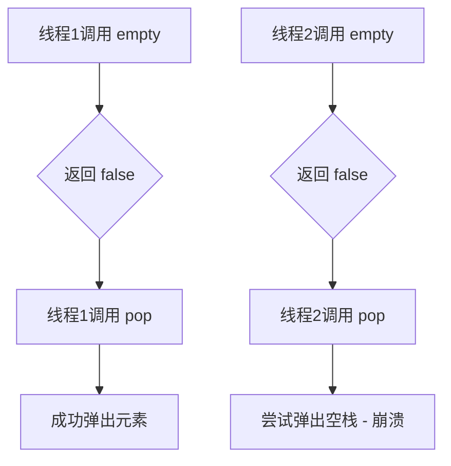
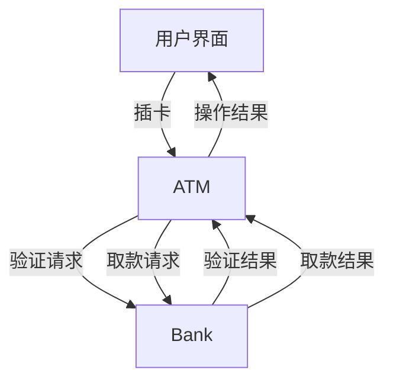
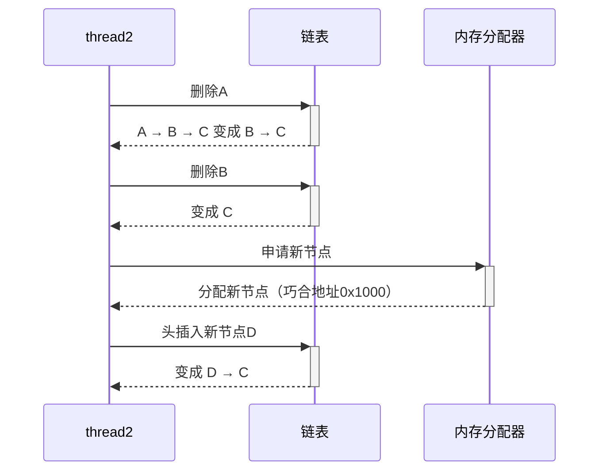

# 第一章 线程基础

线程发起顾名思义就是启动一个线程，C++11标准统一了线程操作，可以在定义一个线程变量后，该变量启动线程执行回调逻辑。如下即可发起一个线程

## 1. 执行方式

### 	（1）传入普通函数，退化为函数指针

```c++
    void thead_work1(std::string str) {
        std::cout << "str is " << str << std::endl;
    }
    std::thread t1(thead_work1, hellostr);
```

### 	（2）仿函数传入

```c++
    class background_task {
    public:
        void operator()(std::string str) {
            std::cout << "str is " << str << std::endl;
        }
    };

//如果采用如下方式启动函数，那一定会报错的。
    std::thread t2(background_task());
    t2.join();
//因为编译器会将t2当成一个函数对象, 返回一个std::thread类型的值, 函数的参数为一个函数指针,该函数指针返回值为background_task, 参数为void。可以理解为如下
    "std::thread (*)(background_task (*)())"

//< 正确写法
    //可多加一层()
    std::thread t2((background_task()));
    t2.join();
    //可使用{}方式初始化
    std::thread t3{ background_task() };
    t3.join();
```

### （3） lambda传入

```c++
std::thread t4([](std::string  str) {
    std::cout << "str is " << str << std::endl;
},  hellostr);
t4.join();
```

## 2. detach

线程允许采用分离的方式在后台独自运行，`C++ concurrent programing`书中称其为守护线程。

```c++
struct func {
    int& _i;
    func(int & i): _i(i){}
    void operator()() {
        for (int i = 0; i < 3; i++) {
            _i = i;
            std::cout << "_i is " << _i << std::endl;
            std::this_thread::sleep_for(std::chrono::seconds(1));
        }
    }
};
void oops() {
    int some_local_state = 0;
    func myfunc(some_local_state);
    std::thread functhread(myfunc);
    //隐患，访问局部变量，局部变量“some_local_state”可能会随着}结束而回收或随着主线程退出而回收
    functhread.detach();  
}  //结束的时候some_local_state被回收，但是线程没有执行完成，&的_i是未定义的
```

### （1）问题分析

当线程被 `detach()` 后成为守护线程，若访问主线程的局部变量，会因局部变量提前销毁导致**悬垂引用**。原代码中 `func` 持有局部变量 `some_local_state` 的引用，而 `oops()` 结束后该变量被销毁，但线程仍在访问。

### （2）解决方案及代码示例

#### a. 值传递 (推荐)
**原理**：通过值拷贝传递数据，避免引用依赖  
**优点**：无原子操作开销，线程安全  
```cpp
struct func {
    int _i;  // 改为值类型
    func(int i) : _i(i) {}  // 值拷贝构造
    void operator()() {
        for (int i = 0; i < 3; i++) {
            _i = i;  // 操作内部副本
            std::cout << "_i is " << _i << "\n";
            std::this_thread::sleep_for(std::chrono::seconds(1));
        }
    }
};

void safe_oops() {
    int some_local_state = 0;
    func myfunc(some_local_state);  // 构造时拷贝值
    std::thread functhread(myfunc);
    functhread.detach();
}  // 安全：线程使用独立副本
```

#### b. 智能指针传递
**原理**：通过共享所有权延长生命周期  
**优点**：适用于大型对象，自动管理生命周期  
**注意**：原子操作有性能开销  
```cpp
struct func {
    std::shared_ptr<int> _sp;  // 智能指针持有数据
    func(std::shared_ptr<int> sp) : _sp(sp) {}
    void operator()() {
        for (int i = 0; i < 3; i++) {
            *_sp = i;  // 解引用操作
            std::cout << "*_sp is " << *_sp << "\n";
            std::this_thread::sleep_for(std::chrono::seconds(1));
        }
    }
};

void smart_ptr_solution() {
    auto sp = std::make_shared<int>(0);  // 堆分配
    func myfunc(sp);
    std::thread functhread(myfunc);
    functhread.detach();
}  // 安全：引用计数保证对象存活
```

#### c. 使用 join() 同步
**原理**：阻塞主线程直至子线程完成  
**优点**：完全避免生命周期问题  
**缺点**：失去异步特性，可能阻塞主线程  
```cpp
void join_solution() {
    int some_local_state = 0;
    func myfunc(some_local_state);
    std::thread functhread(myfunc);
    functhread.join();  // 等待线程结束
}  // 安全：局部变量存活期覆盖线程执行期
```

#### d. 数据所有权转移 (C++11)
**原理**：通过移动语义转移数据所有权到线程  
**优点**：零拷贝开销，避免共享  
```cpp
struct func {
    std::unique_ptr<int> _up;  // 独占所有权
    func(std::unique_ptr<int> up) : _up(std::move(up)) {}
    void operator()() {
        for (int i = 0; i < 3; i++) {
            *_up = i;
            std::cout << "*_up is " << *_up << "\n";
            std::this_thread::sleep_for(std::chrono::seconds(1));
        }
    }
};

void move_semantics_solution() {
    auto up = std::make_unique<int>(0);
    func myfunc(std::move(up));  // 转移所有权
    std::thread functhread(std::move(myfunc));  // 转移函数对象
    functhread.detach();
}  // 安全：数据完全归属线程
```

---

### （3）最佳实践总结

| 方案            | 适用场景             | 性能影响 | 线程安全 |
| --------------- | -------------------- | -------- | -------- |
| **值传递**      | 小型数据，简单逻辑   | ⭐⭐       | ✅        |
| **智能指针**    | 大型对象，需共享访问 | ⭐        | ✅        |
| **join() 同步** | 需确保线程执行完成   | -        | ✅        |
| **所有权转移**  | 避免拷贝，数据独占   | ⭐⭐⭐      | ✅        |

> **关键原则**：  
> 1. 优先使用**值传递**或**所有权转移**避免共享  
> 2. 智能指针适用于复杂生命周期管理  
> 3. 慎用 `detach()`，确保线程不访问栈内存  
> 4. 多线程访问共享数据必须通过同步机制保护

\- 如果数据小且可复制，使用值传递（方法1）。

\- 如果数据需要共享且生命周期需要延长，使用智能指针（方法2）。

\- 如果不需要后台运行，使用`join`（方法3）。

\- 如果数据很大且不需要共享，可以使用移动语义（方法4），但注意分离线程的风险：主线程无法知道其何时结束，且分离的线程不应访问主线程的栈上数据（包括主线程已经退出的函数栈）。

注意：在分离线程中，要特别小心全局数据、静态数据或堆上数据（由线程自己管理）的使用，避免访问主线程栈上的数据。

### （4）线程守卫

#### a. 自定义thread_guard（C++11起）

```cpp
#include <thread>

class thread_guard {
    std::thread& t;
    bool autojoin = true;
public:
    explicit thread_guard(std::thread& t_) : t(t_) {}
    
    // 禁止复制
    thread_guard(const thread_guard&) = delete;
    thread_guard& operator=(const thread_guard&) = delete;
    
    // 析构时自动join
    ~thread_guard() {
        if (autojoin && t.joinable()) {
            t.join();
        }
    }
    
    // 手动控制
    void join() { 
        if (t.joinable()) t.join(); 
        autojoin = false;
    }
    void detach() { 
        t.detach(); 
        autojoin = false;
    }
};

// 使用示例
void example() {
    std::thread worker([]{
        std::cout << "Working...\n";
        std::this_thread::sleep_for(1s);
    });
    
    thread_guard guard(worker);  // RAII守卫
    // 作用域结束自动join
}
```

#### b. std::jthead（C++20起）

```cpp
#include <thread>
#include <stop_token>

void example_jthread() {
    // 自动资源管理
    std::jthread worker([](std::stop_token stoken) {
        while (!stoken.stop_requested()) {
            std::cout << "Working...\n";
            std::this_thread::sleep_for(500ms);
        }
        std::cout << "Thread cancelled\n";
    });
    
    std::this_thread::sleep_for(2s);
    worker.request_stop();  // 协作式取消
    // 析构时自动join
}

// jthread 工作原理（伪代码）
    class joining_thread {
        std::thread  _t;
    public:
        joining_thread() noexcept = default;
        template<typename Callable, typename ...  Args>
        explicit  joining_thread(Callable&& func, Args&& ...args):
            t(std::forward<Callable>(func),  std::forward<Args>(args)...){}
        explicit joining_thread(std::thread  t) noexcept: _t(std::move(t)){}
        joining_thread(joining_thread&& other) noexcept: _t(std::move(other._t)){}
        joining_thread& operator=(joining_thread&& other) noexcept
        {
            //如果当前线程可汇合，则汇合等待线程完成再赋值
            if (joinable()) {
                join();
            }
            _t = std::move(other._t);
            return *this;
        }
        joining_thread& operator=(joining_thread other) noexcept
        {
            //如果当前线程可汇合，则汇合等待线程完成再赋值
            if (joinable()) {
                join();
            }
            _t = std::move(other._t);
            return *this;
        }
        ~joining_thread() noexcept {
            if (joinable()) {
                join();
            }
        }
        void swap(joining_thread& other) noexcept {
            _t.swap(other._t);
        }
        std::thread::id   get_id() const noexcept {
            return _t.get_id();
        }
        bool joinable() const noexcept {
            return _t.joinable();
        }
        void join() {
            _t.join();
        }
        void detach() {
            _t.detach();
        }
        std::thread& as_thread() noexcept {
            return _t;
        }
        const std::thread& as_thread() const noexcept {
            return _t;
        }
    };
```

####  c. 复杂场景

```c++
// 带异常处理的自定义守卫
class safe_thread {
    std::jthread t;  // C++20
public:
    template<typename Callable, typename... Args>
    safe_thread(Callable&& f, Args&&... args) 
        : t([&] {
            try { 
                std::invoke(std::forward<Callable>(f), 
                           std::forward<Args>(args)...);
            } catch (...) { 
                /* 处理异常 */ 
            }
        }) 
    {}
};
```

## 3. 常见使用错误

### （1）引用参数

[std::forward]: ..\..\VersionFeatures\C11\Introduce.md

```c++
void change_param(int& param) {
    param++;
}
void ref_oops(int some_param) {
    std::cout << "before change , param is " << some_param << std::endl;
    //需使用引用显示转换
    std::thread  t2(change_param, some_param);
    t2.join();
    std::cout << "after change , param is " << some_param << std::endl;
}
/*
1. thread内部调用 _STD forward<_Args>(_Ax)...
传递的左值some_param会变成int&&右值引用
2. int& 左值引用智能通过左值进行赋值，int&& 显然不对

解决
std::thread  t2(change_param, std::ref(some_param));

原理
reference_wrapper是一个类类型，说白了就是将参数的地址和类型保存起来。

    _CONSTEXPR20 reference_wrapper(_Uty&& _Val) noexcept(noexcept(_Refwrap_ctor_fun<_Ty>(_STD declval<_Uty>()))) {
        _Ty& _Ref = static_cast<_Uty&&>(_Val);
         _Ptr      = _STD addressof(_Ref);
    }
当我们要使用这个类对象时，自动转化为取内部参数的地址里的数据即可，就达到了和实参关联的效果
     _CONSTEXPR20 operator _Ty&() const noexcept {
        return *_Ptr;
    }
    _NODISCARD _CONSTEXPR20 _Ty& get() const noexcept {
        return *_Ptr;
    }

所以我们可以这么理解传递给thread对象构造函数的参数，仍然作为右值被保存，如ref(int)实际是作为reference_wrapper(int)对象保存在threa的类成员里。
而调用的时候触发了仿函数()进而获取到外部实参的地址内的数据。
```

# 第二章 线程管控

## 1. 线程归属权

**C++ 在返回局部变量时，会优先寻找这个类的拷贝构造函数，如果没有就会使用这个类的移动构造函数。**

```
    void some_function() { }
    std::thread t1(some_function);
```

t1是一个线程变量，管理一个线程，该线程执行`some_function()`

对于`std::thread` C++ 不允许其执行拷贝构造和拷贝赋值, 所以**只能通过移动和局部变量返回的方式**将线程变量管理的线程转移给其他变量管理

<u>C++ 中类似的类型还有`std::mutex`, `std::ifstream`, `std::unique_ptr`。</u>

```c++
    void some_function() {
        while (true) {
            std::this_thread::sleep_for(std::chrono::seconds(1));
        }
    }
    void some_other_function() {
        while (true) {
            std::this_thread::sleep_for(std::chrono::seconds(1));
        }
    }
    //t1 绑定some_function
    std::thread t1(some_function); 
    //2 转移t1管理的线程给t2，转移后t1无效
    std::thread t2 =  std::move(t1);
    //3 t1 可继续绑定其他线程,执行some_other_function
    t1 = std::thread(some_other_function);
    //4  创建一个线程变量t3
    std::thread t3;
    //5  转移t2管理的线程给t3
    t3 = std::move(t2);
    //6  转移t3管理的线程给t1
    t1 = std::move(t3); //崩溃
    std::this_thread::sleep_for(std::chrono::seconds(2000));
```

步骤6导致崩溃的原因就是将t3管理的线程交给t1，而此时t1正在管理线程运行`some_other_function`。
**所以我们可以得出一个结论，就是不要将一个线程的管理权交给一个已经绑定线程的变量，否则会触发线程的terminate函数引发崩溃。**

## 2. joining_thread（std::jthread）

**只要其执行析构函数，线程即能自动汇合**

```c++
    void use_jointhread() {
        //1 根据线程构造函数构造joiningthread
        joining_thread j1([](int maxindex) {
            for (int i = 0; i < maxindex; i++) {
                std::cout << "in thread id " << std::this_thread::get_id()
                    << " cur index is " << i << std::endl;
                std::this_thread::sleep_for(std::chrono::seconds(1));
            }
            }, 10);
        //2 根据thread构造joiningthread
        joining_thread j2(std::thread([](int maxindex) {
            for (int i = 0; i < maxindex; i++) {
                std::cout << "in thread id " << std::this_thread::get_id()
                    << " cur index is " << i << std::endl;
                std::this_thread::sleep_for(std::chrono::seconds(1));
            }
            }, 10));
        //3 根据thread构造j3
        joining_thread j3(std::thread([](int maxindex) {
            for (int i = 0; i < maxindex; i++) {
                std::cout << "in thread id " << std::this_thread::get_id()
                    << " cur index is " << i << std::endl;
                std::this_thread::sleep_for(std::chrono::seconds(1));
            }
            }, 10));
        //4 把j3赋值给j1，joining_thread内部会等待j1汇合结束后
        //再将j3赋值给j1
        j1 = std::move(j3);
    ervice
    }
```

## 3. vector 存储thread

需要使用`emplace_back`而不是`push_back`，因为`push_back`是拷贝，线程不允许拷贝，我们需要移动线程

## 4. 线程ID/线程数（CPU核数获取）

```cpp
// cpu核数
#include <thread>

#if defined(__APPLE__)
    #include <sys/sysctl.h>
#elif defined(_WIN32)
    #include <windows.h>
#elif defined(__linux__) || defined(__unix__)
    #include <unistd.h>
#endif

unsigned int hardware_concurrency() noexcept {
    // 优先使用标准库实现
    unsigned int cores = std::thread::hardware_concurrency();
    if (cores != 0) return cores;

    // 平台特定实现
    #if defined(__APPLE__)  // macOS/iOS
        int count;
        size_t size = sizeof(count);
        if (sysctlbyname("hw.logicalcpu", &count, &size, nullptr, 0) == 0) {
            return static_cast<unsigned int>(count);
        }
    
    #elif defined(_WIN32)  // Windows
        SYSTEM_INFO sysinfo;
        GetSystemInfo(&sysinfo);
        return static_cast<unsigned int>(sysinfo.dwNumberOfProcessors);
    
    #elif defined(__linux__) || defined(__unix__)  // Linux/Unix
        long count = sysconf(_SC_NPROCESSORS_ONLN);
        if (count > 0) {
            return static_cast<unsigned int>(count);
        }
    
    #endif
    
    // 所有方法失败时返回保守值
    return 1;
}


// 线程ID
std::thread t([](){
    std::cout << "thread start" << std::endl;
});
t.get_id();

std::this_thread::get_id() << std::endl;
```

# 第三章 互斥和死锁

[原子和指令顺序]: 详细见第六章


## 1. 为什么需要锁（数据竞争）

当多个线程同时访问共享数据时，如果没有适当的同步机制，会导致**数据竞争**（Data Race），产生未定义行为。常见问题包括：

1. **内存不一致**：线程读取到未完全写入的数据
2. **值覆盖**：多个线程同时修改导致数据丢失
3. **状态损坏**：复杂数据结构被破坏

```c++
#include <iostream>
#include <thread>
#include <vector>

// 共享资源
int shared_value = 0;

void increment_without_lock() {
    for (int i = 0; i < 10000; ++i) {
        // 无保护操作共享数据
        ++shared_value; // 这个看起来是一个操作，其实是三个指令，多线程情况下，可能导致同时赋值，比如 当前是1，两个线程得到1，任何进行加1，同时赋值是2，但其实应该是3
    }
}

int main() {
    std::vector<std::thread> threads;
    
    // 创建10个线程同时修改共享值
    for (int i = 0; i < 10; ++i) {
        threads.emplace_back(increment_without_lock);
    }
    
    // 等待所有线程完成
    for (auto& t : threads) {
        t.join();
    }
    
    // 预期结果应为100000，实际结果通常小于此值
    std::cout << "Final value (without lock): " << shared_value << "\n";
    
    return 0;
}
/* 可能输出：
   Final value (without lock): 56342
   原因：多个线程同时读写导致部分修改丢失 */
```


## 2. 死锁是怎么造成的

unique_guard、mutex、lock_guard

死锁（Deadlock）发生在多个线程相互等待对方释放资源时，常见于以下情况：

1. **互斥条件**：资源不能被共享，只能独占使用
2. **持有并等待**：线程持有资源同时请求新资源
3. **不可抢占**：资源只能由持有线程释放
4. **循环等待**：线程间形成资源等待环


> **关键结论**：  
> 死锁需要同时满足四个条件，破坏任意一个即可预防死锁。  
> 实际开发中，最有效的策略是：  
>
> 1. 使用 `std::lock` 同时获取多个锁  
> 2. 定义全局锁获取顺序  
> 3. 限制锁的作用范围  
> 4. 使用RAII锁管理（lock_guard/unique_lock）

### (1) 死锁的四个必要条件及示例

#### 1. 互斥条件（Mutual Exclusion）
资源不能被共享，只能独占使用。当线程获取资源后，其他线程必须等待。

```cpp
#include <iostream>
#include <thread>
#include <mutex>

std::mutex printer_mutex;

void exclusive_print(const std::string& msg) {
    std::lock_guard<std::mutex> lock(printer_mutex);
    std::cout << "[" << std::this_thread::get_id() << "] " << msg << "\n";
    std::this_thread::sleep_for(std::chrono::milliseconds(100));
}

void thread_work() {
    for (int i = 0; i < 5; ++i) {
        exclusive_print("Processing data: " + std::to_string(i));
    }
}

int main() {
    std::thread t1(thread_work);
    std::thread t2(thread_work);
    
    t1.join();
    t2.join();
    
    std::cout << "All threads completed\n";
    return 0;
}
/* 输出示例：
   [140245038552832] Processing data: 0
   [140245030160128] Processing data: 0
   [140245038552832] Processing data: 1
   ...（交替输出，互斥访问打印机资源） */
```

**关键点**：  
- 打印机资源（std::cout）是互斥资源
- 每个线程必须独占访问才能打印
- 没有互斥条件就不会有死锁风险

---

#### 2. 持有并等待（Hold and Wait）
线程持有资源同时请求新资源，形成资源占用链。

```cpp
#include <iostream>
#include <thread>
#include <mutex>
#include <vector>

class BankAccount {
    std::mutex mtx;
    double balance;
public:
    BankAccount(double init) : balance(init) {}
    
    void transfer(BankAccount& to, double amount) {
        std::lock_guard<std::mutex> lock_this(mtx); // 锁定自己的账户
        
        // 模拟耗时操作（此时持有锁）
        std::this_thread::sleep_for(std::chrono::milliseconds(50));
        
        // 尝试锁定对方账户（持有并等待）
        std::lock_guard<std::mutex> lock_to(to.mtx);
        
        if (balance >= amount) {
            balance -= amount;
            to.balance += amount;
            std::cout << "Transfer successful: " << amount << "\n";
        }
    }
};

void deadlock_scenario() {
    BankAccount acc1(1000.0);
    BankAccount acc2(1000.0);
    
    // 线程A：acc1 -> acc2 转账
    std::thread t1([&] {
        for (int i = 0; i < 100; ++i) {
            acc1.transfer(acc2, 10.0);
        }
    });
    
    // 线程B：acc2 -> acc1 转账
    std::thread t2([&] {
        for (int i = 0; i < 100; ++i) {
            acc2.transfer(acc1, 10.0);
        }
    });
    
    t1.join();
    t2.join();
}

int main() {
    try {
        deadlock_scenario();
    } catch (...) {
        std::cerr << "Deadlock occurred!\n";
    }
    return 0;
}
/* 可能输出：
   Transfer successful: 10
   ...（几次成功转账后卡死）
   原因：线程A持有acc1等待acc2，线程B持有acc2等待acc1 */
```

**关键点**：
- 线程A持有acc1锁，等待acc2锁
- 线程B持有acc2锁，等待acc1锁
- 形成交叉等待链

---

#### 3. 不可抢占（No Preemption）
资源只能由持有线程释放，不能被强制抢占。

```cpp
#include <iostream>
#include <thread>
#include <mutex>
#include <atomic>

std::mutex resource_mutex;
std::atomic<bool> keep_running(true);

void resource_holder() {
    std::lock_guard<std::mutex> lock(resource_mutex);
    std::cout << "Resource acquired by " << std::this_thread::get_id() << "\n";
    
    // 长时间持有资源不释放
    while (keep_running) {
        std::this_thread::sleep_for(std::chrono::seconds(1));
    }
}

void resource_requester() {
    int attempts = 0;
    while (attempts++ < 5) {
        // 尝试获取资源（非抢占式）
        if (std::unique_lock<std::mutex> lock(resource_mutex, std::try_to_lock)) {
            std::cout << "Resource acquired by requester\n";
            return;
        }
        
        std::cout << "Attempt " << attempts << " failed. Waiting...\n";
        std::this_thread::sleep_for(std::chrono::seconds(1));
    }
    std::cerr << "Failed to acquire resource!\n";
}

int main() {
    std::thread holder(resource_holder);
    std::this_thread::sleep_for(std::chrono::milliseconds(100));
    
    std::thread requester(resource_requester);
    
    std::this_thread::sleep_for(std::chrono::seconds(3));
    keep_running = false; // 请求持有者释放资源
    
    holder.join();
    requester.join();
    
    return 0;
}
/* 输出示例：
   Resource acquired by 140245038552832
   Attempt 1 failed. Waiting...
   Attempt 2 failed. Waiting...
   Attempt 3 failed. Waiting...
   Failed to acquire resource! */
```

**关键点**：
- 持有线程长期占用资源不释放
- 请求线程无法强制获取资源
- 只能等待持有者主动释放

---

#### 4. 循环等待（Circular Wait）
线程间形成资源请求的环形链（经典死锁示例）。

```cpp
#include <iostream>
#include <thread>
#include <mutex>

std::mutex mutexA;
std::mutex mutexB;
std::mutex mutexC;

void thread1() {
    std::lock_guard<std::mutex> lockA(mutexA);
    std::cout << "Thread1 acquired A\n";
    std::this_thread::sleep_for(std::chrono::milliseconds(100));
    
    std::lock_guard<std::mutex> lockB(mutexB);
    std::cout << "Thread1 acquired B\n";
}

void thread2() {
    std::lock_guard<std::mutex> lockB(mutexB);
    std::cout << "Thread2 acquired B\n";
    std::this_thread::sleep_for(std::chrono::milliseconds(100));
    
    std::lock_guard<std::mutex> lockC(mutexC);
    std::cout << "Thread2 acquired C\n";
}

void thread3() {
    std::lock_guard<std::mutex> lockC(mutexC);
    std::cout << "Thread3 acquired C\n";
    std::this_thread::sleep_for(std::chrono::milliseconds(100));
    
    std::lock_guard<std::mutex> lockA(mutexA);
    std::cout << "Thread3 acquired A\n";
}

int main() {
    std::thread t1(thread1);
    std::thread t2(thread2);
    std::thread t3(thread3);
    
    t1.join();
    t2.join();
    t3.join();
    
    std::cout << "All threads completed\n";
    return 0;
}
/* 输出：
   Thread1 acquired A
   Thread2 acquired B
   Thread3 acquired C
   ...（程序卡死，形成循环等待链） */
```

**循环等待链**：
1. Thread1 持有A → 等待B
2. Thread2 持有B → 等待C
3. Thread3 持有C → 等待A

---

### (2)  死锁预防策略

#### 1. 破坏互斥条件
- 使用无锁数据结构（atomic）
- 只读共享数据（const）
```cpp
std::atomic<int> safe_counter(0);

void atomic_increment() {
    safe_counter.fetch_add(1, std::memory_order_relaxed);
}
```

#### 2. 破坏持有并等待
- 一次性获取所有资源（std::lock）
```cpp
void safe_transfer(BankAccount& from, BankAccount& to, double amount) {
    std::lock(from.mtx, to.mtx); // 同时锁定两个账户
    std::lock_guard<std::mutex> lock1(from.mtx, std::adopt_lock);
    std::lock_guard<std::mutex> lock2(to.mtx, std::adopt_lock);
    
    // 安全转账操作
}
```

#### 3. 破坏不可抢占
- 使用try_lock和超时机制
```cpp
std::unique_lock<std::mutex> lockA(mutexA, std::try_to_lock);
if (!lockA.owns_lock()) {
    // 处理获取失败
}
```

#### 4. 破坏循环等待
- 定义全局锁顺序
- 使用层级锁
```cpp
// 全局锁顺序：mutexA → mutexB → mutexC
void ordered_operation() {
    std::lock_guard<std::mutex> lockA(mutexA);
    std::lock_guard<std::mutex> lockB(mutexB);
    std::lock_guard<std::mutex> lockC(mutexC);
    // 安全操作
}
```


## 3. 互斥和锁的使用

### (1) std::mutex 基础使用

```cpp
#include <iostream>
#include <thread>
#include <mutex>

std::mutex mtx;
int shared_data = 0;

void safe_increment() {
    for (int i = 0; i < 10000; ++i) {
        mtx.lock();    // 获取锁
        ++shared_data; // 临界区操作
        mtx.unlock();  // 释放锁
    }
}

int main() {
    std::thread t1(safe_increment);
    std::thread t2(safe_increment);
    
    t1.join();
    t2.join();
    
    // 正确输出20000
    std::cout << "Safe increment result: " << shared_data << "\n";
    return 0;
}
```

### (2) std::lock_guard (C++11)

自动管理锁生命周期，异常安全

```cpp
void safe_increment_guard() {
    for (int i = 0; i < 10000; ++i) {
        // 构造时加锁，析构时自动解锁
        std::lock_guard<std::mutex> lock(mtx);
        ++shared_data;
        
        // 即使此处抛出异常，lock也会正确释放
    }
}

// 错误写法，不能抱锁睡觉
void use_lock() {
    while (true) {
        std::lock_guard<std::mutex> lock(mtx1);
        shared_data++;
        std::cout << "current thread is " << std::this_thread::get_id() << std::endl;
        std::cout << "sharad data is " << shared_data << std::endl;
        std::this_thread::sleep_for(std::chrono::microseconds(10));
    }
}
// 正确写法
void use_lock() {
    while (true) {
        {
            std::lock_guard<std::mutex> lock(mtx1);
            shared_data++;
            std::cout << "current thread is " << std::this_thread::get_id() << std::endl;
            std::cout << "sharad data is " << shared_data << std::endl;
		}
       
        std::this_thread::sleep_for(std::chrono::microseconds(10));
    }
}
```

### (3) std::unique_lock (C++11)

更灵活的锁管理，支持延迟锁定和锁所有权转移，`unique_lock`和`lock_guard`基本用法相同，构造时默认加锁，析构时默认解锁，**但`unique_lock`有个好处就是可以手动解锁。这一点尤为重要**，方便我们控制锁住区域的粒度(加锁的范围大小),也能**支持和条件变量配套使用**，至于条件变量我们之后再介绍，本文主要介绍锁的相关操作。

#### 1. 基本使用（加锁，锁转移，owns_lock判断释放拥有锁）

```cpp
void transfer_lock_example() {
    std::unique_lock<std::mutex> lock1(mtx, std::defer_lock);
    // 手动加锁
    lock1.lock();
    
    // 转移锁所有权
    std::unique_lock<std::mutex> lock2 = std::move(lock1);
    
    // 现在lock1为空，lock2持有锁
    if (!lock1.owns_lock()) {
        std::cout << "Lock1 released ownership\n";
    }
    
    // 自动解锁
}
```

#### 2. 延迟加锁std::defer_lock

```c++
     //可以延迟加锁
    void defer_lock() {
        //延迟加锁
        std::unique_lock<std::mutex> lock(mtx, std::defer_lock);
        //可以加锁
        lock.lock();
        //可以自动析构解锁，也可以手动解锁
        lock.unlock();
    }
```

#### 3. 领养锁（std::adopt_lock）

```c++
    // 和 lock_guard 一样 同样支持领养操作
    void use_own_adopt() {
        mtx.lock();
        std::unique_lock<std::mutex> lock(mtx, std::adopt_lock); // 在领养之前mtx互斥变量必须加锁！！！
        if (lock.owns_lock()) {
            std::cout << "owns lock" << std::endl;
        }
        else {
            std::cout << "does not have the lock" << std::endl;
        }
        lock.unlock();
    }
```


既然`unique_lock`支持领养操作也支持延迟加锁，那么可以用两种方式实现前文`lock_guard`实现的`swap`操作。

注意一旦`mutex`被`unique_lock`管理，加锁和释放的操作就交给`unique_lock`，不能调用`mutex`加锁和解锁，因为锁的使用权已经交给`unique_lock`了。

```cpp
    //之前的交换代码可以可以用如下方式等价实现
    int a = 10;
    int b = 99;
    std::mutex  mtx1;
    std::mutex  mtx2;
    void safe_swap() {
        std::lock(mtx1, mtx2);
        std::unique_lock<std::mutex> lock1(mtx1, std::adopt_lock);
        std::unique_lock<std::mutex> lock2(mtx2, std::adopt_lock);
        std::swap(a, b);
        //错误用法
        //mtx1.unlock();
        //mtx2.unlock();
    }
    void safe_swap2() {
        std::unique_lock<std::mutex> lock1(mtx1, std::defer_lock);
        std::unique_lock<std::mutex> lock2(mtx2, std::defer_lock);
        //需用lock1,lock2加锁
        std::lock(lock1, lock2);
        //错误用法
        //std::lock(mtx1, mtx2);
        std::swap(a, b);
    }
```


### (4) 如何保证数据安全

#### 1. 问题

有时候我们可以将对共享数据的访问和修改聚合到一个函数，在函数内加锁保证数据的安全性。但是对于读取类型的操作，即使读取函数是线程安全的，但是返回值抛给外边使用，存在不安全性。比如一个栈对象，我们要保证其在多线程访问的时候是安全的，可以在判断栈是否为空，判断操作内部我们可以加锁，但是判断结束后返回值就不在加锁了，就会存在线程安全问题。

比如我定义了如下栈, 对于多线程访问时判断栈是否为空，此后两个线程同时出栈，可能会造成崩溃。

```cpp
template<typename T>
    class threadsafe_stack1
    {
    private:
        std::stack<T> data;
        mutable std::mutex m;
    public:
        threadsafe_stack1() {}
        threadsafe_stack1(const threadsafe_stack1& other)
        {
            std::lock_guard<std::mutex> lock(other.m);
            //①在构造函数的函数体（constructor body）内进行复制操作
            data = other.data;
        }
        threadsafe_stack1& operator=(const threadsafe_stack1&) = delete;
        void push(T new_value)
        {
            std::lock_guard<std::mutex> lock(m);
            data.push(std::move(new_value));
        }
        //问题代码
        T pop()
        {
            std::lock_guard<std::mutex> lock(m);
            auto element = data.top();
            data.pop();
            return element;
        }
        bool empty() const
        {
            std::lock_guard<std::mutex> lock(m);
            return data.empty();
        }
    };
我定义了如上栈, 对于多线程访问时判断栈是否为空，
    void test_threadsafe_stack1() {
        threadsafe_stack1<int> safe_stack;
        safe_stack.push(1);
        std::thread t1([&safe_stack]() {
            if (!safe_stack.empty()) {
                std::this_thread::sleep_for(std::chrono::seconds(1));
                safe_stack.pop();
                }
            });
        std::thread t2([&safe_stack]() {
            if (!safe_stack.empty()) {
                std::this_thread::sleep_for(std::chrono::seconds(1));
                safe_stack.pop();
            }
        });
        t1.join();
        t2.join();
    }
```


#### 2. 线程安全栈的空检查与出栈操作问题分析

##### 问题本质

描述的问题是多线程环境下的**条件竞争**（race condition）问题：
1. 两个线程同时检查栈非空（`safe_stack.empty()` 返回 `false`）
2. 两个线程都尝试执行 `pop()` 操作
3. 但栈中只有一个元素，导致第二次 `pop()` 操作未定义行为（通常导致崩溃）

##### 解决方案

###### 方案1：合并空检查和出栈操作（推荐）

通过提供原子性的 `try_pop()` 方法，将空检查和出栈操作合并为一个原子操作：

```cpp
#include <memory>
#include <optional> // C++17 required

template<typename T>
class threadsafe_stack {
private:
    std::stack<T> data;
    mutable std::mutex m;
public:
    threadsafe_stack() = default;
     threadsafe_stack(const threadsafe_stack& other) {
        std::lock_guard<std::mutex> lock(other.m);
        data = other.data;
    }
    // 禁用赋值操作
    threadsafe_stack& operator=(const threadsafe_stack&) = delete;
    
    void push(T new_value) {
        std::lock_guard<std::mutex> lock(m);
        data.push(std::move(new_value));
    }
    
    // 方案1: 返回智能指针 (C++11)
    std::shared_ptr<T> try_pop() {
        std::lock_guard<std::mutex> lock(m);
        if (data.empty()) return nullptr;
        
        // 创建元素副本的共享指针
        auto res = std::make_shared<T>(data.top());
        data.pop();
        return res;
    }
    
    // 方案2: 使用std::optional (C++17)
    std::optional<T> safe_pop() {
        std::lock_guard<std::mutex> lock(m);
        if (data.empty()) return std::nullopt;
        
        T value = std::move(data.top());
        data.pop();
        return value;
    }
    
    // 保留empty()但注明其局限性- 结果可能立即过时
    bool empty() const {
        std::lock_guard<std::mutex> lock(m);
        return data.empty();
    }
    
    // 安全获取大小（结果可能过时）
    size_t size() const {
        std::lock_guard<std::mutex> lock(m);
        return data.size();
    }
    /*
    // 危险代码！仍然存在条件竞争
    if (!safe_stack.empty()) {
        // 在此间隙，其他线程可能修改栈
        auto value = safe_stack.try_pop();
    }
    */
};
```

###### 使用示例

```cpp
//《场景1：多消费者线程
void consumer_example() {
    threadsafe_stack<int> stack;
    constexpr int NUM_ITEMS = 100;
    
    // 生产者线程
    std::thread producer([&] {
        for (int i = 0; i < NUM_ITEMS; ++i) {
            stack.push(i);
            std::this_thread::sleep_for(std::chrono::milliseconds(10));
        }
    });
    
    // 消费者线程
    auto consumer_task = [&](int id) {
        int count = 0;
        while (true) {
            if (auto item = stack.pop()) {
                std::cout << "Consumer " << id << " got: " << *item << "\n";
                ++count;
            } else {
                // 短暂等待后重试
                std::this_thread::sleep_for(std::chrono::milliseconds(50));
            }
            
            // 简单退出条件（实际应用应使用信号量）
            if (count >= NUM_ITEMS / 4) break;
        }
    };
    
    std::vector<std::thread> consumers;
    for (int i = 0; i < 4; ++i) {
        consumers.emplace_back(consumer_task, i);
    }
    
    producer.join();
    for (auto& t : consumers) t.join();
}

//《场景2：带超时的安全弹出
bool safe_pop_with_timeout(threadsafe_stack<int>& stack, int& value, 
                           std::chrono::milliseconds timeout) {
    auto start = std::chrono::steady_clock::now();
    
    while (true) {
        if (stack.pop(value)) {
            return true; // 成功获取
        }
        
        // 检查超时
        if (std::chrono::steady_clock::now() - start > timeout) {
            return false; // 超时
        }
        
        // 短暂等待
        std::this_thread::sleep_for(std::chrono::milliseconds(10));
    }
}
```


#### 3. 设计原则总结

1. **原子操作**：关键操作（检查+弹出）必须原子化
2. **接口安全**：
   - 提供 `try_pop()` 或 `safe_pop()` 替代 `empty() + pop()`
   - 返回智能指针或 `std::optional` 避免异常安全问题
3. **异常安全**：
   - 在锁内只执行不会抛出异常的操作
   - 元素复制/移动可能抛出异常，需确保栈状态不变
4. **性能考量**：
   - 最小化临界区范围
   - 避免在锁内进行昂贵操作
5. **明确文档**：
   - 注明 `empty()` 和 `size()` 结果的时效性限制
   - 推荐使用安全弹出方法



通过这种设计，您的线程安全栈将能正确处理多线程环境下的竞争条件，避免空栈弹出导致的未定义行为。


## 4. 层级锁（hierarchical_mutex）

现实开发中常常很难规避同一个函数内部加多个锁的情况，我们要尽可能避免循环加锁，所以可以自定义一个层级锁，保证实际项目中对多个互斥量加锁时是有序的。

层级锁能保证我们每个线程加锁时，一定是先加权重高的锁。
并且释放时也保证了顺序。
主要原理就是将当前锁的权重保存在线程变量中，这样该线程再次加锁时判断线程变量的权重和锁的权重是否大于，如果满足条件则继续加锁。

```cpp
#include <iostream>
#include <thread>
#include <mutex>

// 层级锁类
class hierarchical_mutex {
    std::mutex internal_mutex;
    unsigned long const hierarchy_value;//当前层级值
    unsigned long previous_hierarchy_value;//上一次层级值
    static thread_local unsigned long this_thread_hierarchy_value;//本线程记录的层级值
    
    void check_for_hierarchy_violation() {
        if (this_thread_hierarchy_value <= hierarchy_value) {
            throw std::logic_error("mutex hierarchy violated");
        }
    }
    
    void update_hierarchy_value() {
        previous_hierarchy_value = this_thread_hierarchy_value;
        this_thread_hierarchy_value = hierarchy_value;
    }
    
public:
    explicit hierarchical_mutex(unsigned long value) :
        hierarchy_value(value), previous_hierarchy_value(0) {}
    hierarchical_mutex(const hierarchical_mutex&) = delete;
    hierarchical_mutex& operator=(const hierarchical_mutex&) = delete;
    
    void lock() {
        check_for_hierarchy_violation();
        internal_mutex.lock();
        update_hierarchy_value();
    }
    
    void unlock() {
        this_thread_hierarchy_value = previous_hierarchy_value;
        internal_mutex.unlock();
    }
    
    bool try_lock() {
        check_for_hierarchy_violation();
        if (!internal_mutex.try_lock()) return false;
        update_hierarchy_value();
        return true;
    }
};

// 线程局部层级值
thread_local unsigned long hierarchical_mutex::this_thread_hierarchy_value(ULONG_MAX);

// 创建不同层级的锁
hierarchical_mutex high_level_mutex(10000);
hierarchical_mutex low_level_mutex(5000);

void do_high_level_stuff() {
    std::lock_guard<hierarchical_mutex> lock(high_level_mutex);
    std::cout << "Doing high level stuff\n";
}

void do_low_level_stuff() {
    std::lock_guard<hierarchical_mutex> lock(low_level_mutex);
    std::cout << "Doing low level stuff\n";
}

// 正确顺序：先获取低层级锁，再获取高层级锁
void correct_order() {
    std::lock_guard<hierarchical_mutex> lock1(low_level_mutex);
    do_high_level_stuff(); // 内部获取高层级锁
}

// 错误顺序：尝试先获取高层级锁，再获取低层级锁
void violate_order() {
    std::lock_guard<hierarchical_mutex> lock1(high_level_mutex);
    do_low_level_stuff(); // 将抛出异常：层级违规
}

int main() {
    // 正确顺序示例
    std::thread t1(correct_order);
    t1.join();
    
    // 错误顺序示例
    try {
        std::thread t2(violate_order);
        t2.join();
    } catch (const std::exception& e) {
        std::cerr << "Caught exception: " << e.what() << "\n";
    }
    
    return 0;
}
```

## 5. 共享锁（std::shared_mutex、shared_timed_mutex）

### (1) 场景

试想这样一个场景，对于一个DNS服务，我们可以根据域名查询服务对应的ip地址，它很久才更新一次，比如新增记录，删除记录或者更新记录等。平时大部分时间都是提供给外部查询，对于查询操作，即使多个线程并发查询不加锁也不会有问题，但是当有线程修改DNS服务的ip记录或者增减记录时，其他线程不能查询，需等待修改完再查询。或者等待查询完，线程才能修改。也就是说读操作并不是互斥的，同一时间可以有多个线程同时读，但是写和读是互斥的，写与写是互斥的，**<u>简而言之，写操作需要独占锁。而读操作需要共享锁</u>**。

* `QueryDNS` 用来查询dns信息，多个线程可同时访问。

* `AddDNSInfo` 用来添加dns信息，属独占锁，同一时刻只有一个线程在修改。

```cpp
    class DNService {
    public:
        DNService() {}
        //读操作采用共享锁
        std::string QueryDNS(std::string dnsname) {
            std::shared_lock<std::shared_mutex> shared_locks(_shared_mtx);
            auto iter = _dns_info.find(dnsname);
            if (iter != _dns_info.end()) {
                return iter->second;
            }
            return "";
        }
        //写操作采用独占锁
        void AddDNSInfo(std::string dnsname, std::string dnsentry) {
            std::lock_guard<std::shared_mutex>  guard_locks(_shared_mtx);
            _dns_info.insert(std::make_pair(dnsname, dnsentry));
        }
    private:
        std::map<std::string, std::string> _dns_info;
        mutable std::shared_mutex  _shared_mtx;
    };
```


### (2) std::shared_mutex、shared_timed_mutex

要想使用共享锁，需使用共享互斥量`std::shared_mutex`,`std::shared_mutex`是C++17标准提出的。
C++14标准可以使用`std::shared_time_mutex`,

`std::shared_mutex` 和 `std::shared_timed_mutex` 都是用于实现多线程并发访问共享数据的互斥锁，但它们之间存在一些区别：

1. `std::shared_mutex`：

```
    * 提供了 `lock()`, `try_lock()`, 和 `try_lock_for()` 以及 `try_lock_until()` 函数，这些函数都可以用于获取互斥锁。
    * 提供了 `try_lock_shared()` 和 `lock_shared()` 函数，这些函数可以用于获取共享锁。
    * 当 `std::shared_mutex` 被锁定后，其他尝试获取该锁的线程将会被阻塞，直到该锁被解锁。
```

1. `std::shared_timed_mutex`：

```
* 与 `std::shared_mutex` 类似，也提供了 `lock()`, `try_lock()`, 和 `try_lock_for()` 以及 `try_lock_until()` 函数用于获取互斥锁。
* 与 `std::shared_mutex` 不同的是，它还提供了 `try_lock_shared()` 和 `lock_shared()` 函数用于获取共享锁，这些函数在尝试获取共享锁时具有超时机制。
* 当 `std::shared_timed_mutex` 被锁定后，其他尝试获取该锁的线程将会被阻塞，直到该锁被解锁，这与 `std::shared_mutex` 相同。然而，当尝试获取共享锁时，如果不能立即获得锁，`std::shared_timed_mutex` 会设置一个超时，超时过后如果仍然没有获取到锁，则操作将返回失败
```

因此，`std::shared_timed_mutex` 提供了额外的超时机制，这使得它在某些情况下更适合于需要处理超时的并发控制。然而，如果不需要超时机制，可以使用更简单的 `std::shared_mutex`。

C++11标准没有共享互斥量，可以使用boost提供的`boost::shared_mutex`。

如果我们想构造共享锁，可以使用`std::shared_lock`，如果我们想构造独占锁, 可以使用`std::lock_gurad`.


`std::shared_mutex` (C++17) 支持读写锁模式：

1. **独占锁**：写操作，排他访问
2. **共享锁**：读操作，允许多线程并发读取

```cpp
#include <iostream>
#include <thread>
#include <shared_mutex>
#include <vector>

class ThreadSafeCounter {
public:
    ThreadSafeCounter() = default;
    
    // 写操作：获取独占锁
    void increment() {
        std::unique_lock lock(mutex_);
        ++value_;
    }
    
    // 读操作：获取共享锁
    int get() const {
        std::shared_lock lock(mutex_);
        return value_;
    }
    
private:
    mutable std::shared_mutex mutex_;
    int value_ = 0;
};

int main() {
    ThreadSafeCounter counter;
    
    // 写线程函数
    auto writer = [&] {
        for (int i = 0; i < 10; ++i) {
            counter.increment();
            std::this_thread::sleep_for(std::chrono::milliseconds(10));
        }
    };
    
    // 读线程函数
    auto reader = [&] {
        for (int i = 0; i < 10; ++i) {
            std::cout << "Thread " << std::this_thread::get_id() 
                      << ": " << counter.get() << "\n";
            std::this_thread::sleep_for(std::chrono::milliseconds(5));
        }
    };
    
    std::vector<std::thread> threads;
    
    // 创建2个写线程
    for (int i = 0; i < 2; ++i) {
        threads.emplace_back(writer);
    }
    
    // 创建5个读线程
    for (int i = 0; i < 5; ++i) {
        threads.emplace_back(reader);
    }
    
    for (auto& t : threads) {
        t.join();
    }
    
    std::cout << "Final value: " << counter.get() << "\n";
    return 0;
}
```

## 6. 递归锁（std::recursive_mutex，尽量避免使用）

有时候我们在实现接口的时候内部加锁，接口内部调用完结束自动解锁。会出现一个接口调用另一个接口的情况，如果用普通的`std::mutex`就会出现卡死，因为嵌套加锁导致卡死。但是我们可以使用递归锁。

`std::recursive_mutex` 允许同一线程多次获取锁

```cpp
#include <iostream>
#include <thread>
#include <mutex>

class ComplexObject {
    std::recursive_mutex mtx;
    int data = 0;
    
public:
    void outer() {
        std::lock_guard<std::recursive_mutex> lock(mtx);
        inner(); // 嵌套调用需要递归锁
    }
    
    void inner() {
        std::lock_guard<std::recursive_mutex> lock(mtx);
        ++data;
    }
    
    void unsafe_outer() {
        std::mutex normal_mutex;
        std::lock_guard<std::mutex> lock(normal_mutex);
        try_inner(); // 使用普通锁会导致死锁
    }
    
    void try_inner() {
        std::mutex normal_mutex;
        std::lock_guard<std::mutex> lock(normal_mutex); // 此处等待导致死锁
    }
};

int main() {
    ComplexObject obj;
    
    // 安全使用递归锁
    std::thread safe_thread([&] {
        for (int i = 0; i < 5; ++i) {
            obj.outer();
        }
    });
    
    // 危险：尝试使用普通锁嵌套
    std::thread unsafe_thread([&] {
        try {
            obj.unsafe_outer();
        } catch (...) {
            std::cerr << "Deadlock occurred!\n";
        }
    });
    
    safe_thread.join();
    unsafe_thread.join();
    
    return 0;
}
```

## 7. 条件变量

[ringbuffer 环形生成消费者模式]: ..\..\Demo\Utils\Introduce.md

`std::condition_variable` 用于线程间同步，允许线程等待特定条件成立

```cpp
std::condition_variable cv;
std::mutex mtx;
std::unique_lock<std::mutex> lock(mtx);
// 写法一
while(条件){ // 不写if是为了防止操作系统虚假
	cv.wait(lock);
}

// 写法二
cv.wait(lock, [](){}) ; // lambda表达式返回false就线程挂起，释放lock锁，不再往下执行，notify进行唤醒
...
```


### (1) 生产者-消费者模式

```cpp
#include <iostream>
#include <queue>
#include <thread>
#include <mutex>
#include <condition_variable>

std::mutex mtx;
std::condition_variable cv;
std::queue<int> data_queue;
const int MAX_SIZE = 10;

void producer(int id) {
    for (int i = 0; i < 20; ++i) {
        std::unique_lock<std::mutex> lock(mtx);
        
        // 等待队列有空间
        cv.wait(lock, [] { return data_queue.size() < MAX_SIZE; });
        
        // 生产数据
        data_queue.push(i);
        std::cout << "Producer " << id << " produced: " << i << "\n";
        
        lock.unlock();
        cv.notify_all(); // 通知消费者
    }
}

void consumer(int id) {
    while (true) {
        std::unique_lock<std::mutex> lock(mtx);
        
        // 等待队列有数据
        cv.wait(lock, [] { return !data_queue.empty(); });
        
        // 消费数据
        int data = data_queue.front();
        data_queue.pop();
        std::cout << "Consumer " << id << " consumed: " << data << "\n";
        
        lock.unlock(); //唤醒前最好先解锁
        cv.notify_all(); // 通知生产者
    }
}

int main() {
    std::vector<std::thread> producers;
    std::vector<std::thread> consumers;
    
    // 创建3个生产者
    for (int i = 0; i < 3; ++i) {
        producers.emplace_back(producer, i);
    }
    
    // 创建2个消费者
    for (int i = 0; i < 2; ++i) {
        consumers.emplace_back(consumer, i);
    }
    
    for (auto& p : producers) {
        p.join();
    }
    
    // 消费者为无限循环，需要手动终止
    for (auto& c : consumers) {
        c.detach();
    }
    
    return 0;
}
```

### (2) 线程池任务调度

```cpp
#include <iostream>
#include <vector>
#include <queue>
#include <thread>
#include <mutex>
#include <condition_variable>
#include <future>

class ThreadPool {
public:
    explicit ThreadPool(size_t threads) : stop(false) {
        for (size_t i = 0; i < threads; ++i) {
            workers.emplace_back([this] {
                while (true) {
                    std::function<void()> task;
                    
                    {
                        std::unique_lock<std::mutex> lock(this->queue_mutex);
                        this->condition.wait(lock, [this] {
                            return this->stop || !this->tasks.empty();
                        });
                        
                        if (this->stop && this->tasks.empty())
                            return;
                            
                        task = std::move(this->tasks.front());
                        this->tasks.pop();
                    }
                    
                    task();
                }
            });
        }
    }
    
    template<class F, class... Args>
    auto enqueue(F&& f, Args&&... args) 
        -> std::future<typename std::result_of<F(Args...)>::type> {
        using return_type = typename std::result_of<F(Args...)>::type;
        
        auto task = std::make_shared<std::packaged_task<return_type()>>(
            std::bind(std::forward<F>(f), std::forward<Args>(args)...)
        );
        
        std::future<return_type> res = task->get_future();
        {
            std::unique_lock<std::mutex> lock(queue_mutex);
            
            if (stop)
                throw std::runtime_error("enqueue on stopped ThreadPool");
                
            tasks.emplace([task](){ (*task)(); });
        }
        condition.notify_one();
        return res;
    }
    
    ~ThreadPool() {
        {
            std::unique_lock<std::mutex> lock(queue_mutex);
            stop = true;
        }
        condition.notify_all();
        for (std::thread &worker : workers)
            worker.join();
    }
    
private:
    std::vector<std::thread> workers;
    std::queue<std::function<void()>> tasks;
    
    std::mutex queue_mutex;
    std::condition_variable condition;
    bool stop;
};

int main() {
    ThreadPool pool(4);
    std::vector<std::future<int>> results;
    
    // 提交任务到线程池
    for (int i = 0; i < 8; ++i) {
        results.emplace_back(
            pool.enqueue([i] {
                std::cout << "Task " << i << " started\n";
                std::this_thread::sleep_for(std::chrono::seconds(1));
                std::cout << "Task " << i << " finished\n";
                return i * i;
            })
        );
    }
    
    // 获取结果
    for (auto&& result : results) {
        std::cout << "Result: " << result.get() << "\n";
    }
    
    return 0;
}
```

## 关键总结

| 机制                  | 适用场景           | 优点                     | 缺点                 |
| --------------------- | ------------------ | ------------------------ | -------------------- |
| **std::mutex**        | 基本互斥需求       | 简单高效                 | 需手动管理锁         |
| **std::lock_guard**   | 局部作用域保护     | RAII自动管理，异常安全   | 作用域固定           |
| **std::unique_lock**  | 需要灵活锁管理     | 支持延迟锁定和所有权转移 | 性能开销略大         |
| **层级锁**            | 需要预防死锁       | 编译时检测锁顺序         | 增加设计复杂度       |
| **std::shared_mutex** | 读多写少场景       | 允许并发读操作           | 写操作阻塞所有读操作 |
| **递归锁**            | 可能递归调用的函数 | 允许同一线程多次加锁     | 可能导致过度锁定     |
| **条件变量**          | 线程间状态同步     | 高效等待特定条件         | 需配合互斥锁使用     |

**最佳实践建议：**
1. 优先使用RAII锁管理（lock_guard/unique_lock）
2. 避免嵌套锁，必须使用时选择递归锁
3. 使用条件变量替代忙等待（while循环）
4. 读写分离场景优先使用shared_mutex
5. 复杂系统使用层级锁预防死锁
6. 避免在持有锁时执行耗时操作
7. 使用clang-thread-sanitizer检测数据竞争

# 第四章 异步并发

## 1. std::async

`std::async` 是 C++11 引入的异步任务启动器，它封装了线程创建和任务调度的细节，简化了异步编程。它返回一个 `std::future` 对象，用于获取异步任务的结果。

### (1) 启动策略

`std::async` 支持两种启动策略，通过 `std::launch` 枚举指定：

```cpp
enum class launch {
    async,    // 立即在新线程中异步执行
    deferred  // 延迟执行，直到调用 future.get()/wait()
};
```

启动策略：

1. `std::launch::deferred`：这种策略意味着任务将在调用`std::future::get()`或`std::future::wait()`函数时延迟执行。换句话说，任务将在需要结果时同步执行。
2. `std::launch::async | std::launch::deferred`：这种策略是上面两个策略的组合。任务可以在一个单独的线程上异步执行，也可以延迟执行，具体取决于实现。

默认情况下，`std::async`使用`std::launch::async | std::launch::deferred`策略。这意味着任务可能异步执行，也可能延迟执行，具体取决于实现。需要注意的是，不同的编译器和操作系统可能会有不同的默认行为。

#### 使用示例

```cpp
#include <iostream>
#include <future>
#include <thread>
#include <chrono>

int compute_square(int x) {
    std::cout << "Computing square in thread: " 
              << std::this_thread::get_id() << "\n";
    std::this_thread::sleep_for(std::chrono::seconds(1));
    return x * x;
}

int main() {
    // 策略1: 立即异步执行
    auto future1 = std::async(std::launch::async, compute_square, 5);
    std::cout << "Async task launched\n";

    // 策略2: 延迟执行
    auto future2 = std::async(std::launch::deferred, compute_square, 6);
    std::cout << "Deferred task created (not started)\n";

    // 触发延迟任务执行
    std::cout << "Deferred result: " << future2.get() << "\n";

    // 获取异步任务结果
    std::cout << "Async result: " << future1.get() << "\n";

    // 默认策略 (async | deferred)
    auto future3 = std::async(compute_square, 7);
    std::cout << "Default result: " << future3.get() << "\n";

    return 0;
}
/* 输出示例:
Async task launched
Deferred task created (not started)
Computing square in thread: 140245038552832  // 延迟任务在主线程执行
Deferred result: 36
Computing square in thread: 140245030160128  // 异步任务在新线程执行
Async result: 25
Computing square in thread: 140245021767424  // 默认策略在新线程执行
Default result: 49 */
```

### (2) 使用场景

#### 场景1: 并行计算

```cpp
#include <vector>
#include <future>
#include <numeric>
#include <iostream>

// 并行计算向量元素之和
double parallel_sum(const std::vector<double>& vec) {
    if (vec.size() < 1000) {
        // 小数据直接计算
        return std::accumulate(vec.begin(), vec.end(), 0.0);
    }
    
    auto mid = vec.begin() + vec.size() / 2;
    
    // 异步计算前半部分
    auto future = std::async(std::launch::async, [&vec, mid] {
        return std::accumulate(vec.begin(), mid, 0.0);
    });
    
    // 当前线程计算后半部分
    double back_sum = std::accumulate(mid, vec.end(), 0.0);
    
    return back_sum + future.get();
}

int main() {
    // 创建大向量 (1,000,000 个元素)
    std::vector<double> numbers(1'000'000);
    for (int i = 0; i < numbers.size(); ++i) {
        numbers[i] = i * 0.1;
    }
    
    double sum = parallel_sum(numbers);
    std::cout << "Sum: " << sum << "\n";  // 输出 49999950
    return 0;
}
```

#### 场景2: 异步IO操作

```cpp
#include <fstream>
#include <future>
#include <iostream>
#include <string>

// 异步读取文件内容
std::future<std::string> async_read_file(const std::string& filename) {
    return std::async(std::launch::async, [filename] {
        std::ifstream file(filename);
        if (!file) {
            throw std::runtime_error("Cannot open file: " + filename);
        }
        
        std::string content;
        std::copy(std::istreambuf_iterator<char>(file),
                 std::istreambuf_iterator<char>(),
                 std::back_inserter(content));
        
        return content;
    });
}

int main() {
    try {
        auto future1 = async_read_file("file1.txt");
        auto future2 = async_read_file("file2.txt");
        
        // 主线程可以同时执行其他任务
        std::cout << "Reading files in background...\n";
        std::this_thread::sleep_for(std::chrono::milliseconds(500));
        
        // 获取结果（必要时阻塞）
        std::string content1 = future1.get();
        std::string content2 = future2.get();
        
        std::cout << "File1 size: " << content1.size() << " bytes\n";
        std::cout << "File2 size: " << content2.size() << " bytes\n";
    } catch (const std::exception& e) {
        std::cerr << "Error: " << e.what() << "\n";
    }
    return 0;
}
```

## 2. std::future

`std::future` 表示异步操作的结果，提供访问异步操作结果的机制。

### (1) 核心方法

`std::future::get()` 和 `std::future::wait()` 是 C++ 中用于处理异步任务的两个方法，它们的功能和用法有一些重要的区别。

1. **std::future::get()**:

`std::future::get()` 是一个阻塞调用，用于获取 `std::future` 对象表示的值或异常。如果异步任务还没有完成，`get()` 会阻塞当前线程，直到任务完成。如果任务已经完成，`get()` 会立即返回任务的结果。重要的是，`get()` 只能调用一次，因为它会移动或消耗掉 `std::future` 对象的状态。一旦 `get()` 被调用，`std::future` 对象就不能再被用来获取结果。

1. **std::future::wait()**:

`std::future::wait()` 也是一个阻塞调用，但它与 `get()` 的主要区别在于 `wait()` 不会返回任务的结果。它只是等待异步任务完成。如果任务已经完成，`wait()` 会立即返回。如果任务还没有完成，`wait()` 会阻塞当前线程，直到任务完成。与 `get()` 不同，`wait()` 可以被多次调用，它不会消耗掉 `std::future` 对象的状态。

总结一下，这两个方法的主要区别在于：

- `std::future::get()` 用于获取并返回任务的结果，而 `std::future::wait()` 只是等待任务完成。
- `get()` 只能调用一次，而 `wait()` 可以被多次调用。
- 如果任务还没有完成，`get()` 和 `wait()` 都会阻塞当前线程，但 `get()` 会一直阻塞直到任务完成并返回结果，而 `wait()` 只是在等待任务完成。

你可以使用std::future的wait_for()或wait_until()方法来检查异步操作是否已完成。这些方法返回一个表示操作状态的std::future_status值。

| 方法               | 描述                                             |
| ------------------ | ------------------------------------------------ |
| `get()`            | 阻塞直到结果可用，并返回结果（只能调用一次）     |
| `wait()`           | 阻塞直到结果可用                                 |
| `wait_for(dur)`    | 阻塞一段时间，返回状态（ready/timeout/deferred） |
| `wait_until(time)` | 阻塞直到指定时间点                               |

### (2) 基本用法

```cpp
#include <iostream>
#include <future>
#include <thread>
#include <chrono>

int main() {
    // 启动异步任务
    std::future<int> future = std::async(std::launch::async, [] {
        std::this_thread::sleep_for(std::chrono::seconds(2));
        return 42;
    });
    
    std::cout << "Main thread working...\n";
    
    // 检查状态
    auto status = future.wait_for(std::chrono::seconds(1));
    if (status == std::future_status::ready) {
        std::cout << "Result ready: " << future.get() << "\n";
    } else {
        std::cout << "Result not ready, waiting...\n";
        future.wait();  // 阻塞等待
        std::cout << "Result: " << future.get() << "\n";
    }
    
    return 0;
}
/* 输出:
Main thread working...
Result not ready, waiting...
Result: 42 */
```

### (3) 与 std::packaged_task 配合

`std::packaged_task`和`std::future`是C++11中引入的两个类，它们用于处理异步任务的结果。

`std::packaged_task`是一个可调用目标，它包装了一个任务，该任务可以在另一个线程上运行。它可以捕获任务的返回值或异常，并将其存储在`std::future`对象中，以便以后使用。

`std::future`代表一个异步操作的结果。它可以用于从异步任务中获取返回值或异常。

以下是使用`std::packaged_task`和`std::future`的基本步骤：

1. 创建一个`std::packaged_task`对象，该对象包装了要执行的任务。
2. 调用`std::packaged_task`对象的`get_future()`方法，该方法返回一个与任务关联的`std::future`对象。
3. 在另一个线程上调用`std::packaged_task`对象的`operator()`，以执行任务。
4. 在需要任务结果的地方，调用与任务关联的`std::future`对象的`get()`方法，以获取任务的返回值或异常。

`std::packaged_task` 包装可调用对象，并将其返回值与 `std::future` 关联。

```cpp
#include <iostream>
#include <future>
#include <thread>
#include <functional>

int main() {
    // 创建 packaged_task (包装 lambda 表达式)
    std::packaged_task<int(int, int)> task([](int a, int b) {
        std::cout << "Task running in thread: " 
                  << std::this_thread::get_id() << "\n";
        return a * b;
    });
    
    // 获取关联的 future
    std::future<int> result = task.get_future();
    
    // 在独立线程中执行任务
    std::thread t(std::move(task), 7, 6);
    t.detach();
    
    // 获取结果
    std::cout << "Result: " << result.get() << "\n";  // 输出 42
    
    return 0;
}
```

### (4) std::shared_future

`std::shared_future` 允许多次访问异步结果，可以被多个线程安全访问。

当我们需要**多个线程等待同一个执行结果时**，需要使用std::shared_future

以下是一个适合使用`std::shared_future`的场景，多个线程等待同一个异步操作的结果：

假设你有一个异步任务，需要多个线程等待其完成，然后这些线程需要访问任务的结果。在这种情况下，你可以使用`std::shared_future`来共享异步任务的结果。

```cpp
#include <iostream>
#include <future>
#include <vector>
#include <thread>

void worker(std::shared_future<int> shared_fut, int id) {
    // 每个工作线程获取结果
    int result = shared_fut.get();
    std::cout << "Worker " << id << " got: " << result << "\n";
}

int main() {
    std::promise<int> prom;
    std::shared_future<int> shared_fut = prom.get_future().share();
    
    // 创建多个工作线程
    std::vector<std::thread> threads;
    for (int i = 0; i < 5; ++i) {
        threads.emplace_back(worker, shared_fut, i);
    }
    
    // 设置结果值
    prom.set_value(42);
    
    // 等待所有线程完成
    for (auto& t : threads) {
        t.join();
    }
    
    return 0;
}
/* 输出示例:
Worker 0 got: 42
Worker 1 got: 42
Worker 2 got: 42
Worker 3 got: 42
Worker 4 got: 42 */
```

## 3. std::promise

C++11引入了`std::promise`和`std::future`两个类，用于实现异步编程。`std::promise`用于在某一线程中**设置某个值或异常**，而`std::future`则用于在另一线程中获取这个值或异常。

`std::promise` 用于在线程间传递结果**，通过 `set_value()` 或 `set_exception()` 设置结果**。

### (1) 基本用法

```cpp
#include <iostream>
#include <future>
#include <thread>

void compute(std::promise<int> result_promise) {
    try {
        // 模拟计算
        std::this_thread::sleep_for(std::chrono::seconds(1));
        // 设置结果
        result_promise.set_value(42);
    } catch (...) {
        // 捕获异常并传递
        result_promise.set_exception(std::current_exception());
    }
}

int main() {
    std::promise<int> prom;
    std::future<int> fut = prom.get_future();
    
    // 启动计算线程
    std::thread t(compute, std::move(prom));
    
    // 获取结果
    try {
        int result = fut.get();
        std::cout << "Result: " << result << "\n";
    } catch (const std::exception& e) {
        std::cerr << "Exception: " << e.what() << "\n";
    }
    
    t.join();
    return 0;
}
```

### (2) 传递多个值

使用 `std::tuple` 传递多个值：

```cpp
#include <iostream>
#include <future>
#include <thread>
#include <tuple>

void data_processor(std::promise<std::tuple<int, double, std::string>> prom) {
    // 模拟数据处理
    std::this_thread::sleep_for(std::chrono::seconds(1));
    prom.set_value(std::make_tuple(42, 3.14, "success"));
}

int main() {
    std::promise<std::tuple<int, double, std::string>> prom;
    auto fut = prom.get_future();
    
    std::thread t(data_processor, std::move(prom));
    
    auto result = fut.get();
    std::cout << "Int: " << std::get<0>(result) 
              << ", Double: " << std::get<1>(result)
              << ", Status: " << std::get<2>(result) << "\n";
    
    t.join();
    return 0;
}
```

### (3) 线程间通信管道

```cpp
#include <iostream>
#include <future>
#include <thread>
#include <queue>
#include <mutex>
#include <condition_variable>

template<typename T>
class AsyncChannel {
public:
    void send(const T& value) {
        std::lock_guard<std::mutex> lock(mtx);
        queue.push(value);
        cv.notify_one();
    }
    
    T receive() {
        std::unique_lock<std::mutex> lock(mtx);
        cv.wait(lock, [this] { return !queue.empty(); });
        
        T value = queue.front();
        queue.pop();
        return value;
    }
    
private:
    std::queue<T> queue;
    std::mutex mtx;
    std::condition_variable cv;
};

int main() {
    AsyncChannel<int> channel;
    
    // 生产者线程
    std::thread producer([&] {
        for (int i = 0; i < 5; ++i) {
            std::this_thread::sleep_for(std::chrono::milliseconds(500));
            channel.send(i);
            std::cout << "Sent: " << i << "\n";
        }
    });
    
    // 消费者线程
    std::thread consumer([&] {
        for (int i = 0; i < 5; ++i) {
            int value = channel.receive();
            std::cout << "Received: " << value << "\n";
        }
    });
    
    producer.join();
    consumer.join();
    
    return 0;
}
/* 输出:
Sent: 0
Received: 0
Sent: 1
Received: 1
Sent: 2
Received: 2
Sent: 3
Received: 3
Sent: 4
Received: 4 */
```

### (4) 超时控制

```cpp
#include <iostream>
#include <future>
#include <thread>
#include <chrono>

int main() {
    std::promise<void> prom;
    std::future<void> fut = prom.get_future();
    
    // 启动超时任务
    std::thread timeout_task([&] {
        std::this_thread::sleep_for(std::chrono::seconds(3));
        prom.set_value();
    });
    
    std::cout << "Waiting with timeout...\n";
    
    // 等待最多2秒
    auto status = fut.wait_for(std::chrono::seconds(2));
    
    if (status == std::future_status::ready) {
        std::cout << "Task completed in time\n";
    } else {
        std::cout << "Timeout occurred\n";
        // 可以取消任务或采取其他措施
    }
    
    timeout_task.join();
    return 0;
}
/* 输出:
Waiting with timeout...
Timeout occurred */
```

## 关键总结

| 工具                   | 适用场景             | 特点                                       |
| ---------------------- | -------------------- | ------------------------------------------ |
| **std::async**         | 快速启动异步任务     | 自动管理线程，与future无缝集成             |
| **std::future**        | 获取单个异步结果     | 一次性的，只能移动不能拷贝                 |
| **std::shared_future** | 多个线程等待同一结果 | 可拷贝，允许多次get()                      |
| **std::packaged_task** | 将函数封装为异步任务 | 可移动，便于放入队列延迟执行               |
| **std::promise**       | 显式设置异步结果     | 可设置值或异常，与future配合实现线程间通信 |

**最佳实践：**
1. 优先使用 `std::async` 简化异步编程
2. 需要精细控制线程时使用 `std::thread` + `std::promise`
3. 避免在多个线程中调用同一个 `std::future` 的 `get()`，改用 `std::shared_future`
4. 使用 `std::packaged_task` 构建任务队列
5. 通过 `wait_for()`/`wait_until()` 实现超时控制

**注意事项：**
- `std::future::get()` 会阻塞并消耗结果，只能调用一次
- `std::promise` 和 `std::future` 不可拷贝，只能移动
- 延迟任务 (`std::launch::deferred`) 在调用线程执行
- 异步任务中的异常会通过 `future::get()` 重新抛出

# 第五章 并发设计模式

## 1. Actor模式

### 概念
Actor模式是一种并发计算模型，其中：
- **Actor** 是基本计算单元
- 每个Actor有自己的状态和行为
- Actor之间通过**异步消息传递**进行通信
- 每个Actor有一个**邮箱**用于接收消息
- Actor处理消息是**串行**的（一次处理一个消息）

### 通俗比喻
想象一个大型邮局系统：
- 每个邮局员工（Actor）有自己的工作职责
- 客户（消息）通过邮箱（邮箱队列）提交请求
- 员工一次只处理一个客户请求
- 员工之间通过内部邮件（消息）协作
- 整个系统高效运转，无需员工之间直接对话

### 实际应用
- 游戏服务器（每个玩家/怪物作为Actor）
- 分布式系统（Erlang/Elixir, Akka）
- 实时交易系统
- 聊天应用后端

### 示例代码

```cpp
#include <iostream>
#include <thread>
#include <queue>
#include <mutex>
#include <condition_variable>
#include <unordered_map>
#include <functional>
#include <memory>

// 消息基类
struct Message {
    virtual ~Message() = default;
};

// Actor基类
class Actor {
public:
    virtual void receive(std::unique_ptr<Message> msg) = 0;
    virtual ~Actor() = default;
};

// Actor系统
class ActorSystem {
public:
    void register_actor(const std::string& id, std::shared_ptr<Actor> actor) {
        std::lock_guard<std::mutex> lock(mutex_);
        actors_[id] = actor;
    }

    void send(const std::string& to, std::unique_ptr<Message> msg) {
        std::lock_guard<std::mutex> lock(mutex_);
        if (auto it = actors_.find(to); it != actors_.end()) {
            it->second->receive(std::move(msg));
        }
    }

private:
    std::unordered_map<std::string, std::shared_ptr<Actor>> actors_;
    std::mutex mutex_;
};

// 具体消息类型
struct Greeting : Message {
    std::string from;
    explicit Greeting(std::string from) : from(std::move(from)) {}
};

// 具体Actor实现
class Greeter : public Actor {
public:
    explicit Greeter(ActorSystem& system) : system_(system) {}

    void receive(std::unique_ptr<Message> msg) override {
        if (auto* greeting = dynamic_cast<Greeting*>(msg.get())) {
            std::cout << "Hello from " << greeting->from 
                      << "! I'm Greeter" << std::endl;
            
            // 回复消息
            system_.send(greeting->from, 
                         std::make_unique<Greeting>("Greeter"));
        }
    }

private:
    ActorSystem& system_;
};

// 用户Actor
class User : public Actor {
public:
    explicit User(ActorSystem& system, std::string name)
        : system_(system), name_(std::move(name)) {}

    void receive(std::unique_ptr<Message> msg) override {
        if (auto* greeting = dynamic_cast<Greeting*>(msg.get())) {
            std::cout << name_ << " received greeting from " 
                      << greeting->from << std::endl;
        }
    }

    void start_conversation(const std::string& to) {
        system_.send(to, std::make_unique<Greeting>(name_));
    }

private:
    ActorSystem& system_;
    std::string name_;
};

int main() {
    ActorSystem system;
    
    auto greeter = std::make_shared<Greeter>(system);
    system.register_actor("greeter", greeter);
    
    auto alice = std::make_shared<User>(system, "Alice");
    system.register_actor("alice", alice);
    
    auto bob = std::make_shared<User>(system, "Bob");
    system.register_actor("bob", bob);
    
    // Alice开始对话
    alice->start_conversation("greeter");
    
    // Bob开始对话
    bob->start_conversation("greeter");
    
    // 等待消息处理
    std::this_thread::sleep_for(std::chrono::seconds(1));
    
    return 0;
}
/* 输出示例:
Hello from Alice! I'm Greeter
Alice received greeting from Greeter
Hello from Bob! I'm Greeter
Bob received greeting from Greeter */
```

## 2. CSP模式 (Communicating Sequential Processes)

### (1) 概念
CSP模式的核心思想：
- **进程**是基本执行单元
- 进程之间通过**通道(Channel)** 通信
- 通道是**同步**通信机制（发送/接收会阻塞）
- 没有共享状态，只有消息传递
- 强调**组合性** - 小进程组合成大系统

### (2) ATM取款系统示例
我们模拟一个简化的ATM取款系统，包含三个主要组件：
1. **主线程**：用户界面交互
2. **ATM线程**：处理用户操作流程
3. **Bank线程**：处理银行核心逻辑

#### 系统状态图


#### 消息类型定义
```cpp
enum class MessageType {
    InsertCard,     // 插卡
    EjectCard,      // 退卡
    EnterPin,       // 输入密码
    VerifyPin,      // 验证密码
    SelectOperation,// 选择操作
    WithdrawRequest,// 取款请求
    WithdrawResult, // 取款结果
    BalanceInquiry  // 查询余额
};

struct Message {
    MessageType type;
    std::string cardNumber;
    int amount = 0;
    int pin = 0;
    bool success = false;
    std::string accountId;
    int balance = 0;
};
```

### (3) 完整C++实现

```cpp
#include <iostream>
#include <thread>
#include <queue>
#include <mutex>
#include <condition_variable>
#include <unordered_map>
#include <functional>
#include <random>
#include <atomic>

// 消息类型
enum class MessageType {
    InsertCard,     // 插卡
    EjectCard,      // 退卡
    EnterPin,       // 输入密码
    VerifyPin,      // 验证密码
    SelectOperation,// 选择操作
    WithdrawRequest,// 取款请求
    WithdrawResult, // 取款结果
    BalanceInquiry, // 查询余额
    DisplayMessage  // 显示消息
};

// 消息结构
struct Message {
    MessageType type;
    std::string cardNumber;
    int amount = 0;
    int pin = 0;
    bool success = false;
    std::string accountId;
    int balance = 0;
    std::string text; // 显示消息
};

// 通道类
class Channel {
public:
    void send(const Message& msg) {
        std::unique_lock<std::mutex> lock(mutex_);
        queue_.push(msg);
        cv_.notify_one();
    }

    Message receive() {
        std::unique_lock<std::mutex> lock(mutex_);
        cv_.wait(lock, [this] { return !queue_.empty(); });
        Message msg = queue_.front();
        queue_.pop();
        return msg;
    }

    bool try_receive(Message& msg) {
        std::unique_lock<std::mutex> lock(mutex_);
        if (queue_.empty()) return false;
        msg = queue_.front();
        queue_.pop();
        return true;
    }

private:
    std::queue<Message> queue_;
    std::mutex mutex_;
    std::condition_variable cv_;
};

// 银行账户
struct Account {
    std::string id;
    std::string cardNumber;
    int pin;
    int balance;
};

// 银行服务
class BankService {
public:
    BankService() {
        // 初始化测试账户
        accounts_["acc-001"] = {"acc-001", "1234-5678", 1234, 5000};
        accounts_["acc-002"] = {"acc-002", "8765-4321", 4321, 10000};
    }

    bool verifyCard(const std::string& cardNumber) {
        std::this_thread::sleep_for(std::chrono::milliseconds(100)); // 模拟处理时间
        for (const auto& [id, acc] : accounts_) {
            if (acc.cardNumber == cardNumber) {
                return true;
            }
        }
        return false;
    }

    bool verifyPin(const std::string& cardNumber, int pin) {
        std::this_thread::sleep_for(std::chrono::milliseconds(100)); // 模拟处理时间
        for (const auto& [id, acc] : accounts_) {
            if (acc.cardNumber == cardNumber && acc.pin == pin) {
                currentAccount_ = acc;
                return true;
            }
        }
        return false;
    }

    bool withdraw(int amount) {
        std::this_thread::sleep_for(std::chrono::milliseconds(200)); // 模拟处理时间
        if (currentAccount_.id.empty()) return false;
        if (amount <= 0 || amount > currentAccount_.balance) return false;
        
        accounts_[currentAccount_.id].balance -= amount;
        currentAccount_.balance -= amount;
        return true;
    }

    int getBalance() const {
        if (currentAccount_.id.empty()) return -1;
        return currentAccount_.balance;
    }

private:
    std::unordered_map<std::string, Account> accounts_;
    Account currentAccount_;
};

// ATM服务
class ATMService {
public:
    ATMService(Channel& uiChannel, Channel& bankChannel)
        : uiChannel_(uiChannel), bankChannel_(bankChannel) {}

    void run() {
        while (true) {
            auto msg = uiChannel_.receive();
            
            switch (msg.type) {
                case MessageType::InsertCard:
                    handleInsertCard(msg);
                    break;
                case MessageType::EnterPin:
                    handleEnterPin(msg);
                    break;
                case MessageType::SelectOperation:
                    handleSelectOperation(msg);
                    break;
                case MessageType::WithdrawRequest:
                    handleWithdrawRequest(msg);
                    break;
                case MessageType::BalanceInquiry:
                    handleBalanceInquiry();
                    break;
                default:
                    break;
            }
        }
    }

private:
    void handleInsertCard(const Message& msg) {
        // 发送验证请求到银行
        Message verifyMsg{MessageType::VerifyPin};
        verifyMsg.cardNumber = msg.cardNumber;
        bankChannel_.send(verifyMsg);
        
        // 请求用户输入PIN
        Message enterPinMsg{MessageType::DisplayMessage};
        enterPinMsg.text = "Please enter your PIN:";
        uiChannel_.send(enterPinMsg);
    }

    void handleEnterPin(const Message& msg) {
        // 发送PIN验证到银行
        Message verifyPinMsg{MessageType::VerifyPin};
        verifyPinMsg.cardNumber = currentCard_;
        verifyPinMsg.pin = msg.pin;
        bankChannel_.send(verifyPinMsg);
        
        // 等待银行响应
        auto response = bankChannel_.receive();
        
        if (response.success) {
            // PIN验证成功
            Message successMsg{MessageType::DisplayMessage};
            successMsg.text = "PIN verified. Select operation:";
            successMsg.text += "\n1. Withdraw\n2. Balance Inquiry\n3. Exit";
            uiChannel_.send(successMsg);
        } else {
            // PIN验证失败
            pinAttempts_++;
            
            if (pinAttempts_ >= 3) {
                // 超过尝试次数，退卡
                Message ejectMsg{MessageType::DisplayMessage};
                ejectMsg.text = "Too many failed attempts. Card ejected.";
                uiChannel_.send(ejectMsg);
                
                Message ejectCard{MessageType::EjectCard};
                uiChannel_.send(ejectCard);
                
                resetSession();
            } else {
                // 请求重新输入PIN
                Message retryMsg{MessageType::DisplayMessage};
                retryMsg.text = "Invalid PIN. Please try again:";
                uiChannel_.send(retryMsg);
            }
        }
    }

    void handleSelectOperation(const Message& msg) {
        if (msg.amount == 1) { // Withdraw
            Message operationMsg{MessageType::DisplayMessage};
            operationMsg.text = "Enter amount to withdraw:";
            uiChannel_.send(operationMsg);
        } else if (msg.amount == 2) { // Balance Inquiry
            handleBalanceInquiry();
        } else { // Exit
            Message exitMsg{MessageType::DisplayMessage};
            exitMsg.text = "Thank you. Card ejected.";
            uiChannel_.send(exitMsg);
            
            Message ejectCard{MessageType::EjectCard};
            uiChannel_.send(ejectCard);
            
            resetSession();
        }
    }

    void handleWithdrawRequest(const Message& msg) {
        // 发送取款请求到银行
        Message withdrawMsg{MessageType::WithdrawRequest};
        withdrawMsg.amount = msg.amount;
        bankChannel_.send(withdrawMsg);
        
        // 等待银行响应
        auto response = bankChannel_.receive();
        
        if (response.success) {
            // 取款成功
            Message successMsg{MessageType::DisplayMessage};
            successMsg.text = "Withdrawal successful. Dispensing $" + 
                             std::to_string(msg.amount);
            uiChannel_.send(successMsg);
            
            // 显示余额
            handleBalanceInquiry();
        } else {
            // 取款失败
            Message failMsg{MessageType::DisplayMessage};
            failMsg.text = "Withdrawal failed. Insufficient funds.";
            uiChannel_.send(failMsg);
        }
    }

    void handleBalanceInquiry() {
        // 发送余额查询到银行
        Message balanceMsg{MessageType::BalanceInquiry};
        bankChannel_.send(balanceMsg);
        
        // 等待银行响应
        auto response = bankChannel_.receive();
        
        Message displayMsg{MessageType::DisplayMessage};
        displayMsg.text = "Current balance: $" + 
                         std::to_string(response.balance);
        uiChannel_.send(displayMsg);
    }

    void resetSession() {
        currentCard_.clear();
        pinAttempts_ = 0;
    }

    Channel& uiChannel_;
    Channel& bankChannel_;
    std::string currentCard_;
    int pinAttempts_ = 0;
};

// 用户界面
class UserInterface {
public:
    UserInterface(Channel& atmChannel) : atmChannel_(atmChannel) {}

    void run() {
        std::cout << "=== ATM Simulator ===" << std::endl;
        
        while (true) {
            std::cout << "\nOptions:\n"
                      << "1. Insert card\n"
                      << "2. Exit\n"
                      << "Select: ";
            
            int choice;
            std::cin >> choice;
            
            if (choice == 1) {
                startSession();
            } else if (choice == 2) {
                break;
            }
        }
    }

private:
    void startSession() {
        std::string cardNumber;
        std::cout << "Enter card number (e.g., 1234-5678): ";
        std::cin >> cardNumber;
        
        // 发送插卡消息
        Message insertMsg{MessageType::InsertCard};
        insertMsg.cardNumber = cardNumber;
        atmChannel_.send(insertMsg);
        
        // 处理ATM消息
        while (true) {
            Message msg;
            if (displayChannel_.try_receive(msg)) {
                if (msg.type == MessageType::DisplayMessage) {
                    std::cout << "\nATM: " << msg.text << std::endl;
                } else if (msg.type == MessageType::EjectCard) {
                    std::cout << "ATM: Card ejected." << std::endl;
                    return;
                }
            }
            
            // 检查是否有用户输入
            if (msg.type == MessageType::EnterPin || 
                msg.type == MessageType::SelectOperation || 
                msg.type == MessageType::WithdrawRequest) {
                continue;
            }
            
            std::string input;
            std::cout << "> ";
            std::cin >> input;
            
            if (input == "exit") {
                Message exitMsg{MessageType::EjectCard};
                atmChannel_.send(exitMsg);
                return;
            }
            
            try {
                if (input.find_first_not_of("0123456789") == std::string::npos) {
                    int value = std::stoi(input);
                    
                    // 根据上下文发送不同类型消息
                    if (waitingForPin_) {
                        Message pinMsg{MessageType::EnterPin};
                        pinMsg.pin = value;
                        atmChannel_.send(pinMsg);
                        waitingForPin_ = false;
                    } else if (waitingForOperation_) {
                        Message opMsg{MessageType::SelectOperation};
                        opMsg.amount = value;
                        atmChannel_.send(opMsg);
                        waitingForOperation_ = false;
                        
                        if (value == 1) waitingForAmount_ = true;
                    } else if (waitingForAmount_) {
                        Message amountMsg{MessageType::WithdrawRequest};
                        amountMsg.amount = value;
                        atmChannel_.send(amountMsg);
                        waitingForAmount_ = false;
                    }
                }
            } catch (...) {
                std::cout << "Invalid input" << std::endl;
            }
        }
    }

    Channel& atmChannel_;
    Channel displayChannel_;
    bool waitingForPin_ = false;
    bool waitingForOperation_ = false;
    bool waitingForAmount_ = false;
};

int main() {
    // 创建通道
    Channel uiToAtm;
    Channel atmToBank;
    Channel bankToAtm;
    Channel atmToUi;

    // 创建银行服务
    BankService bankService;
    std::thread bankThread([&] {
        while (true) {
            auto msg = atmToBank.receive();
            
            switch (msg.type) {
                case MessageType::VerifyPin: {
                    Message response{MessageType::VerifyPin};
                    response.success = bankService.verifyPin(msg.cardNumber, msg.pin);
                    bankToAtm.send(response);
                    break;
                }
                case MessageType::WithdrawRequest: {
                    Message response{MessageType::WithdrawResult};
                    response.success = bankService.withdraw(msg.amount);
                    bankToAtm.send(response);
                    break;
                }
                case MessageType::BalanceInquiry: {
                    Message response{MessageType::BalanceInquiry};
                    response.balance = bankService.getBalance();
                    bankToAtm.send(response);
                    break;
                }
                default:
                    break;
            }
        }
    });

    // 创建ATM服务
    ATMService atmService(atmToUi, bankToAtm);
    std::thread atmThread([&] {
        atmService.run();
    });

    // 创建用户界面
    UserInterface ui(uiToAtm);
    ui.run();

    // 清理
    bankThread.detach();
    atmThread.detach();

    return 0;
}
```

### (4) CSP模式ATM系统说明

#### 1. 通道设计
- `uiToAtm`: 用户界面 → ATM
- `atmToBank`: ATM → 银行
- `bankToAtm`: 银行 → ATM
- `atmToUi`: ATM → 用户界面

#### 2. 工作流程
1. **用户插卡**：UI发送InsertCard消息到ATM
2. **ATM验证**：ATM发送VerifyPin消息到银行
3. **输入PIN**：ATM请求用户输入PIN
4. **PIN验证**：银行验证PIN并返回结果
5. **选择操作**：用户选择取款/查询/退出
6. **取款操作**：
   - 用户输入金额
   - ATM发送WithdrawRequest到银行
   - 银行处理请求并返回结果
   - ATM显示结果并退卡
7. **余额查询**：
   - ATM发送BalanceInquiry到银行
   - 银行返回余额
   - ATM显示余额

#### 3. 关键特性
1. **无共享状态**：所有组件通过消息通信
2. **同步处理**：每个组件顺序处理消息
3. **明确边界**：各组件职责清晰分离
4. **错误隔离**：一个组件失败不影响其他
5. **易于扩展**：添加新组件只需定义新通道

### (5) CSP模式优势
1. **避免死锁**：没有共享状态，只有通信
2. **高并发**：轻量级进程可大量创建
3. **可组合性**：小进程组合成复杂系统
4. **位置透明**：进程可在本地或远程
5. **热更新**：可替换运行中的进程

### (6) 实际应用场景
1. 金融交易系统
2. 电信交换机
3. 物联网设备控制
4. 实时数据处理管道
5. 高并发网络服务器

通过CSP模式实现的ATM系统展示了如何通过消息传递和通道通信来构建健壮、可扩展的并发系统。这种设计模式特别适合需要高可靠性和清晰状态管理的金融应用。

# 第六章 C++ 原子操作和内存模型

## 1. 为什么需要`原子操作std::atomic`

在多线程编程中，当多个线程同时读写同一数据时，如果没有正确的同步，会导致**数据竞争（data race）和未定义行为（undefined  behavior）**。`std::atomic`提供了一种机制，使得对特定类型的变量的操作是原子的（atomic），即这些操作是不可分割的，不会被其他线程的操作打断。此外，`std::atomic`还允许开发者指定**内存顺序（memory order）**，以控制原子操作周围的非原子内存访问的可见性和顺序。

1. **原子性**：确保操作不可分割（如 `load`/`store` 不会被其他线程中断）。
2. **内存顺序控制**：解决编译器和 CPU 的指令重排问题，确保内存访问顺序符合预期。
3. **跨线程可见性**：保证一个线程的修改对其他线程立即可见。

> 从C++17开始，所有的原子类型都包含一个<u>*静态常量表达式成员变量*</u>，`std::atomic::is_always_lock_free`。这个成员变量的值表示在任意给定的目标硬件上，原子类型X是否始终以无锁结构形式实现。如果在所有支持该程序运行的硬件上，原子类型X都以无锁结构形式实现，那么这个成员变量的值就为true；否则为false。
>
> *只有一个原子类型不提供`is_lock_free()`成员函数：`std::atomic_flag` 。类型`std::atomic_flag`的对象在初始化时清零，随后即可通过成员函数`test_and_set()`查值并设置成立，或者由`clear()`清零。整个过程只有这两个操作。其他的`atomic<>`的原子类型都可以基于其实现。*
>
> `std::atomic_flag`的`test_and_set`成员函数是一个原子操作，他会先检查`std::atomic_flag`当前的状态是否被设置过，
>
> 1  如果没被设置过(比如初始状态或者清除后)，将`std::atomic_flag`当前的状态设置为`true`，并返回`false`。
>
> 2  如果被设置过则直接返回`true`。

## 2. `内存顺序`是什么

### (1) 改动序列

> 在一个C++程序中，每个对象都具有一个改动序列，它由所有线程在对象上的全部写操作构成，其中第一个写操作即为对象的初始化。
> 大部分情况下，这个序列会随程序的多次运行而发生变化，但是在程序的任意一次运行过程中，所含的全部线程都必须形成相同的改动序列。
>
> 改动序列基本要求如下
>
> 1.  **只要某线程看到过某个对象，则该线程的后续读操作必须获得相对新近的值，并且，该线程就同一对象的后续写操作，必然出现在改动序列后方。**
> 2.  **如果某线程先向一个对象写数据，过后再读取它，那么必须读取前面写的值。**
> 3.  **若在改动序列中，上述读写操作之间还有别的写操作，则必须读取最后写的值。**
> 4.  **在程序内部，对于同一个对象，全部线程都必须就其形成相同的改动序列，并且在所有对象上都要求如此.**
> 5.  **多个对象上的改动序列只是相对关系，线程之间不必达成一致**

### (2) C++11定义的内存顺序

内存顺序指定了原子操作之间的内存访问（包括非原子内存访问）的可见性和顺序。它解决了编译器和处理器为了优化而进行的指令重排序问题，确保多线程环境下的内存操作顺序满足程序的需求。C++11标准定义了6种内存顺序，它们分别是：

```cpp
//强度排序（强 → 弱）：
enum memory_order {
    memory_order_seq_cst,    // 顺序一致性（默认）
    memory_order_acq_rel,    // 获取-释放
    memory_order_release,    // 释放
    memory_order_acquire,    // 获取
    memory_order_consume,    // 消费（不推荐使用）
    memory_order_relaxed     // 松散
};

```

#### 核心概念：

- **Load（读）**：`acquire`, `consume`, `seq_cst`
- **Store（写）**：`release`, `seq_cst`
- **Read-Modify-Write**：`acq_rel`, `seq_cst`

> **重要规则**：同步通过“释放-获取”对建立。释放操作前的写操作，在获取操作后可见。


1. `memory_order_relaxed`：只保证原子操作的原子性，不提供任何同步或顺序约束。

2. `memory_order_consume`：依赖于该原子操作的数据（有数据依赖关系）不会被重排序到该操作之前。这是一种较弱的顺序约束，通常用于依赖指针的场景。

3. `memory_order_acquire`：保证该操作之后的所有读写操作不会被重排序到该操作之前（即获得操作，通常用于读操作）。

4. `memory_order_release`：保证该操作之前的所有读写操作不会被重排序到该操作之后（即释放操作，通常用于写操作）。

5. `memory_order_acq_rel`：同时具有`acquire`和`release`的语义（通常用于读-修改-写操作）。

6. `memory_order_seq_cst`：顺序一致性（Sequential Consistency），是最强的内存顺序，保证所有线程看到的操作顺序是一致的，并且所有操作都有一个全局的顺序。这是默认的内存顺序。

这六种内存顺序相互组合可以实现**三种顺序模型 (ordering model)**

`Sequencial consistent ordering.` <u>实现同步</u>, 且保证全局顺序一致 (single total order) 的模型. 是一致性最强的模型, 也是默认的顺序模型.
`Acquire-release ordering.` <u>实现同步</u>, 但不保证保证全局顺序一致的模型.
`Relaxed ordering.` <u>不能实现同步</u>, 只保证原子性的模型.

### (3) 内存屏障

内存屏障（也称为内存栅栏）是一种同步原语，用于控制内存操作的顺序。在C++中，内存顺序参数实际上就是在需要的地方插入内存屏障。不同的内存顺序对应不同强度的屏障。

C++ 中的原子操作通常是通过内存屏障（memory barriers 或 memory fences）来实现的。内存屏障是一种硬件或编译器指令，用于控制CPU或编译器对内存操作的排序，以确保多线程环境中的内存一致性和正确性。内存屏障可以分为几种类型，主要包括： 加载屏障（Load Barrier）：确保在加载屏障之前的所有加载操作在加载屏障之后的任何加载操作之前完成。 存储屏障（Store Barrier）：确保在存储屏障之前的所有存储操作在存储屏障之后的任何存储操作之前完成。 全屏障（Full Barrier）：结合了加载屏障和存储屏障的效果，确保在屏障之前的所有加载和存储操作在屏障之后的任何加载和存储操作之前完成。

内存屏障（Fence）的使用

```cpp
#include <atomic>
#include <thread>
#include <iostream>

std::atomic<bool> ready(false);
int data = 0;

void producer() {
    data = 42;
    std::atomic_thread_fence(std::memory_order_release); // 释放屏障
    ready.store(true, std::memory_order_relaxed); // 松散存储
}

void consumer() {
    while (!ready.load(std::memory_order_relaxed)) {} // 松散加载
    std::atomic_thread_fence(std::memory_order_acquire); // 获取屏障
    std::cout << "Data: " << data << std::endl; // 保证看到 42
}
```

**关键点**：

- 释放屏障前的写操作，不会重排到屏障后。
- 获取屏障后的读操作，不会重排到屏障前。

### (4) 详细代码示例

下面我们将通过几个例子来详细说明如何使用不同的内存顺序。

#### 示例1：使用`std::memory_order_relaxed`

这种顺序只保证原子性，不保证顺序。适用于计数器等场景，其中顺序不重要。

```cpp
#include <atomic>
#include <thread>
#include <iostream>

std::atomic<int> counter{0};
void increment_relaxed() {
    for (int i = 0; i < 10000; ++i) {
    // 使用relaxed顺序增加计数器，只保证原子性，不保证顺序
    counter.fetch_add(1, std::memory_order_relaxed);
    }
}

int main() {
    std::thread t1(increment_relaxed);
    std::thread t2(increment_relaxed);
    t1.join();
    t2.join();
    std::cout << "Counter: " << counter << std::endl; // 输出20000

}
```

**解释**：

在这个例子中，两个线程分别增加计数器10000次。由于我们只关心原子性（即每次增加都是不可分割的），而不关心内存操作的顺序，因此使用`memory_order_relaxed`是高效的。

#### 示例2：使用释放-获取顺序（`release`和`acquire`）实现同步

**释放-获取顺序用于在两个线程之间建立同步关系。一个线程的释放操作（store）与另一个线程的获取操作（load）配对，确保在释放操作之前的所有写操作对执行获取操作的线程可见。**

```cpp
#include <atomic>
#include <thread>
#include <iostream>
#include <vector>
std::atomic<bool> ready{false};

int data = 0;
void producer() {
    data = 42; // 1. 设置数据
    // 2. 使用释放顺序：保证上面的写操作不会重排到store之后
    ready.store(true, std::memory_order_release);
}

void consumer() {
    // 3. 使用获取顺序：等待ready变为true，并保证之后的读操作不会重排到load之前
    while (!ready.load(std::memory_order_acquire)) {
    // 忙等待
    }
    // 4. 这里读取data，由于释放-获取顺序，保证看到data=42
    std::cout << "Data: " << data << std::endl;
}

int main() {
    std::thread t1(producer);
    std::thread t2(consumer);
    t1.join();
    t2.join();
}
```

**解释**：

在这个例子中，生产者线程设置data=42，然后将ready设置为true（使用释放顺序）。消费者线程循环等待ready变为true（使用获取顺序）。当消费者看到ready为true时，由于释放-获取的配对，生产者中在释放操作之前的所有写操作（即data=42）对消费者都是可见的。因此，消费者打印data一定是42。

#### 示例3：使用顺序一致性（`memory_order_seq_cst`）

顺序一致性是最强的顺序，也是默认的顺序。它保证所有线程看到的操作顺序是一致的。

```cpp
#include <atomic>
#include <thread>
#include <iostream>

std::atomic<bool> x{false};
std::atomic<bool> y{false};
std::atomic<int> z{0};

void write_x() {
	x.store(true, std::memory_order_seq_cst); // 1
}

void write_y() {
	y.store(true, std::memory_order_seq_cst); // 2
}

void read_x_then_y() {
    while (!x.load(std::memory_order_seq_cst)) {} // 3
    if (y.load(std::memory_order_seq_cst)) {      // 4
    	++z;
    }
}

void read_y_then_x() {
    while (!y.load(std::memory_order_seq_cst)) {} // 5
    if (x.load(std::memory_order_seq_cst)) {      // 6
    	++z;
    }
}

int main() {
    std::thread a(write_x);
    std::thread b(write_y);
    std::thread c(read_x_then_y);
    std::thread d(read_y_then_x);
    a.join(); b.join(); c.join(); d.join();
    std::cout << "z: " << z << std::endl; // 可能输出0,1,2？但使用seq_cst时，不可能输出0。
}
```

**解释**：

在顺序一致性下，所有操作都有一个全局顺序。因此，如果线程c看到x为true后，y可能为false（因为write_y还没执行），但线程d看到y为true时，x一定为true（因为全局顺序中，x=true在y=true之前，或者反之，但不会出现矛盾）。然而，实际上这个程序z可能为1或2，但不会为0。因为如果线程c看到x=true时，如果y=false，则z不增加；同时线程d看到y=true时，x一定为true（因为全局顺序中，write_x和write_y的先后顺序是确定的，假设write_x在前，那么write_y后执行，那么在write_y执行前，x已经为true，所以线程d会看到x=true，从而z至少增加一次）。但注意，实际上因为两个写线程是并行的，所以两个读线程可能都看到两个写操作都完成，那么z就会为2；也可能一个读线程在另一个写操作前完成，那么z为1。但不可能为0，因为两个写操作总会完成，而两个读线程总会等到一个写操作完成后再去检查另一个，而另一个在全局顺序中要么已经完成要么没完成，但不会出现两个读线程都看不到另一个写操作的情况（因为全局顺序的存在，两个写操作有先后，后一个写操作完成后，前一个写操作肯定已经完成）。


然而，实际上这个例子中，如果两个写操作几乎同时发生，两个读线程可能分别看到不同的顺序。但是，顺序一致性保证所有线程都看到相同的操作顺序。所以，全局顺序要么是先x后y，要么是先y后x。如果先x后y，那么：

\- 线程c：看到x=true，然后检查y，此时y可能还是false（如果write_y还没执行），所以z不增加。

\- 线程d：等待y=true（此时write_y执行），然后检查x，此时x一定为true（因为全局顺序中x=true在y=true之前），所以z增加1。

结果z=1。


如果全局顺序是先y后x：

\- 线程d：看到y=true，然后检查x，此时x可能为false，所以z不增加。

\- 线程c：等待x=true，然后检查y，此时y一定为true，所以z增加1。

结果z=1。


还有一种情况，就是两个读线程都发生在两个写操作之后，那么两个条件都满足，z增加两次，得到2。


因此，z的值可能是1或2，但不会是0。

#### 示例4：使用`memory_order_acq_rel`

这个顺序用于读-修改-写操作（如`fetch_add`），它同时具有获取和释放的语义。

```cpp
#include <atomic>
#include <thread>
#include <iostream>
#include <vector>

std::atomic<int> flag{0};
int data = 0;
void writer() {
    data = 42; // 1. 设置数据
    // 2. 使用释放顺序：保证上面的写操作不会重排到store之后
    flag.store(1, std::memory_order_release);
}

void reader() {
    int expected = 1;
    // 3. 使用compare_exchange_weak，如果flag为1，则将其置为2，并采用acq_rel顺序
    // 因为这是一个读-修改-写操作，所以使用acq_rel：既获取（读取时）又释放（写入时）
    while (!flag.compare_exchange_weak(expected, 2, std::memory_order_acq_rel)) {
        expected = 1; // 失败后重新设置expected
    }
    // 4. 这里读取data，由于acq_rel的获取部分，保证看到writer线程中在释放操作之前的写操作（data=42）
    std::cout << "Data: " << data << std::endl;
}

int main() {
    std::thread t1(writer);
    std::thread t2(reader);
    t1.join();
    t2.join();
}
```

**解释**：

在这个例子中，writer线程设置data=42，然后以释放顺序将flag置为1。reader线程使用`compare_exchange_weak`循环等待flag变为1，然后将其置为2。`compare_exchange_weak`使用`memory_order_acq_rel`，这意味着：

- 当读取flag时，具有获取语义：保证后续的读操作不会重排到该操作之前。

- 当写入flag时，具有释放语义：保证之前的写操作不会重排到该操作之后。

因此，当reader线程成功将flag从1改为2时，由于获取语义，它能够看到writer线程中在释放操作（flag.store(1)）之前的所有写操作（即data=42）。


#### 详细用法及代码示例

##### 1. 顺序一致性 (`seq_cst`)

**最强顺序**，保证所有线程看到相同的操作顺序。性能开销最大。

```cpp
#include <atomic>
#include <thread>
#include <iostream>

std::atomic<int> x(0), y(0);
int result1, result2;

void thread1() {
    x.store(1, std::memory_order_seq_cst); // [1] 写操作
    result1 = y.load(std::memory_order_seq_cst); // [2] 读操作
}

void thread2() {
    y.store(1, std::memory_order_seq_cst); // [3] 写操作
    result2 = x.load(std::memory_order_seq_cst); // [4] 读操作
}

int main() {
    std::thread t1(thread1);
    std::thread t2(thread2);
    t1.join(); t2.join();
    
    // 不可能出现 result1 == 0 && result2 == 0
    std::cout << "Result: " << result1 << ", " << result2 << std::endl;
}
```

**解释**：`seq_cst` 建立全局顺序，避免两个线程同时看到对方的初始值 0。

---

##### 2. 释放-获取顺序 (`release`/`acquire`)

**高效同步**，仅在配对操作间建立顺序。

```cpp
#include <atomic>
#include <thread>
#include <iostream>

std::atomic<bool> ready(false);
int data = 0; // 非原子共享数据

// 生产者线程：使用 release
void producer() {
    data = 42; // [1] 非原子写（必须写在 release 前）
    ready.store(true, std::memory_order_release); // [2] 释放操作
}

// 消费者线程：使用 acquire
void consumer() {
    while (!ready.load(std::memory_order_acquire)) { // [3] 获取操作
        // 忙等待直到 ready 为 true
    }
    std::cout << "Data: " << data << std::endl; // 保证看到 42
}

int main() {
    std::thread t1(producer);
    std::thread t2(consumer);
    t1.join(); t2.join();
}
```

**关键点**：

- `release`（写）前的所有操作，对 `acquire`（读）后的操作可见。
- 避免 `data` 的写入被重排到 `ready.store` 之后。

---

##### 3. 获取-释放顺序 (`acq_rel`)

用于 **读-修改-写** 操作（如 `exchange`, `fetch_add`）。

```cpp
#include <atomic>
#include <thread>
#include <iostream>

std::atomic<int> sync(0);
int shared_data[2] = {0, 0};

void writer(int id) {
    shared_data[id] = id * 10;  // [1] 写共享数据
    sync.fetch_add(1, std::memory_order_release); // [2] 释放操作
}

void reader() {
    int count = 0;
    while (count < 2) { // 等待两个 writer 完成
        count += sync.load(std::memory_order_acquire); // [3] 获取操作
    }
    std::cout << "Data: " << shared_data[0] << ", " << shared_data[1] << std::endl;
}

int main() {
    std::thread w1([&] { writer(0); });
    std::thread w2([&] { writer(1); });
    std::thread r(reader);
    w1.join(); w2.join(); r.join();
}
```

**作用**：

- `fetch_add` 的 `acq_rel` = `release`（写） + `acquire`（读）。
- 保证两个 writer 的 `shared_data` 写入对 reader 可见。

---

##### 4. 松散顺序 (`relaxed`)

**只保证原子性，无同步或顺序约束**。适用于计数器等场景。

```cpp
#include <atomic>
#include <thread>
#include <iostream>

std::atomic<int> counter(0);

void increment() {
    for (int i = 0; i < 1000; ++i) {
        counter.fetch_add(1, std::memory_order_relaxed); // 无顺序保证
    }
}

int main() {
    std::thread t1(increment);
    std::thread t2(increment);
    t1.join(); t2.join();
    std::cout << "Counter: " << counter << std::endl; // 一定是 2000
}
```

**注意**：结果正确，但线程间无操作顺序保证。

---

##### 5. 消费顺序 (`consume`)

**不推荐使用**，因语义复杂且编译器支持不一致。效果弱于 `acquire`。

---

### 最佳实践总结

| 场景                  | 推荐内存顺序                              |
| --------------------- | ----------------------------------------- |
| 计数器更新            | `memory_order_relaxed`                    |
| 生产者-消费者数据传输 | `release`（生产者） + `acquire`（消费者） |
| 互斥锁实现            | `acquire`（加锁） + `release`（解锁）     |
| 读-修改-写操作        | `memory_order_acq_rel`                    |
| 默认（无特殊需求）    | `memory_order_seq_cst`                    |

> **重要原则**：能用 `release/acquire` 就不用 `seq_cst`；能用 `relaxed` 就不用更强的顺序。

------

## 3. 无锁设计4条原则

### (1) 模型设计

原则1：

在原型设计中使用std::memory_order_seq_cst次序若代码服从std::memory_order_seq_cst次序，则对其进行分析和推理要比其他内存次序容易得多，因为它令全部操作形成一个确定的总序列。

回顾之前我们实现的无锁栈和无锁队列，它们的原始版本全都采用std::memory_order_seq_cst次序，当基本操作均正常工作后，我们才放宽内存次序约束。

在这种意义上，采用其他内存次序其实是一项优化，需要避免过早实施。我们通常只有先完全了解代码全貌，认清哪些代码操作核心数据结构，才可以确定放宽哪些操作的内存次序约束。否则，事情就会很棘手。即便代码在测试过程中正常工作，也无法保证在生产环境下代码依然如此，这令内存次序的放宽调整变得复杂。所以，仅仅测试代码的运行并不足够，除非我们能够采用测试工具（假如真的存在），系统化地核查线程访问内存次序的全部可能的组合，验证它们是否与指定的内存次序约束保持一致。

### (2) 内存回收方案

原则2：

使用无锁的内存回收方案无锁代码中的一大难题是内存管理。最基本的要求是，只要目标对象仍然有可能正被其他线程指涉，就不得删除。然而，为了避免过度消耗内存，我们还是想及时删除无用的对象。

我们在这一章学习了3种方法，以确保内存回收满足安全要求：

1. 暂缓全部删除对象的动作，等到没有线程访问数据结构的时候，才删除待销毁的对象；

2. 采用风险指针，以辨识特定对象是否正在被某线程访问；

3. 就对象进行引用计数，只要外部环境仍正在指涉目标对象，它就不会被删除。

3种方法的关键思想都是以某种方式掌握正在访问目标对象的线程数目，仅当该对象完全不被指涉的时候，才会被删除。针对无锁数据结构，还有很多别的方法可以回收内存。

譬如，无锁数据是使用垃圾回收器的理想场景。若我们得以采用垃圾回收器，即事先知晓它具备适时删除无用节点的能力，则算法的实现代码写起来就会轻松一些。

另一种处理方法是重复使用节点，等到数据结构销毁时才完全释放它们。我们之前实现的环状无锁队列就是重复使用固定个数的队列，头尾成环。由于重用了节点，因此所分配的内存便一直有效，代码从而避开了一些涉及未定义行为的麻烦细节。然而，这种方法有一个缺点，它导致程序频频出现被称为“ABA问题”的情形。

### (3) 防范ABA问题

原则3：防范ABA问题在所有涉及比较-交换的算法中，我们都要注意防范ABA问题。

该问题产生过程如下：

步骤1：线程甲读取原子变量x，得知其值为A。

步骤2：线程甲根据A执行某项操作，比如查找，或如果x是指针，则依据它提取出相关值（称为ov）。

步骤3：线程甲因操作系统调度而发生阻塞。

步骤4：另一线程对原子变量x执行别的操作，将其值改成B。

步骤5：又有线程改变了与A相关的数据，使得线程甲原本持有的值失效（步骤2中的ov）。这种情形也许是A表示某内存地址，而改动操作则是释放指针的目标内存，或变更目标数据，最后将产生严重后果。

步骤6：原子变量x再次被某线程改动，重新变回A。

若x属于指针型别，其指向目标可能在步骤5被改换成一个新对象。

步骤7：线程甲继续运行，在原子变量x上执行比较-交换操作，与A进行对比。因此比较-交换操作成功执行（因x的值依然为A），但A的关联数据却不再有效，即原本在步骤2中取得的ov已失效，而线程甲却无从分辨，这将破坏数据结构。

画出示意图


之前我们实现的无锁结构均不存在ABA问题，但它很容易由无锁算法的代码引发。该问题最常见的解决方法之一是，在原子变量x中引入一个ABA计数器。将变量x和计数器组成单一结构，作为一个整体执行比较-交换操作。每当它的值被改换，计数器就自增。照此处理，如果别的线程改动了变量x，即便其值看起来与最初一样，比较-交换操作仍会失败。

如果某数据结构的操作算法涉及空闲内存列表，或者涉及循环使用节点(比如我们之前实现的循环队列)，而不是通过内存分配器回收管理，那么ABA问题就格外常见。

举一个例子 原有的栈结构为 A —> B —> C

假设一个线程1执行pop将A头部节点的数据加载出来，还未做读改写更新head为B，此时时间片被其他线程2抢占执行pop将A,B分别出栈，然后线程3抢占时间片又将A入栈，那么我们看到此时栈的情况为 A —> C ,  如果时间片切换回线程1，此时线程1执行读改写操作发现head还是为A，他会误认为这期间没有其他线程改变栈，所以线程1的读改写将head更新为B。其实B已经被弹出了，那么这就是ABA问题。

上面的仅仅是一个ABA案例的描述，那我们实现的无锁栈或者无锁队列为什么不存在这个ABA问题呢？原因是我们每次push加入的node节点都不同。node的结构包含数据域和下一个节点的指针

```
    struct node
    {
        std::shared_ptr<T> data;
        node* next;
        node(T const& data_) : //⇽-- - 1
            data(std::make_shared<T>(data_))
        {}
    };
```

我们每次调用push虽然传递的data可以理解为A，但是构造的智能指针地址不同，也就是node中存储的data不同。所以即使线程1做读改写比较的时候发现数值都为A，但是地址不同，也可区分出栈被改变。

```
    void push(T const& data)
    {
        node* const new_node = new node(data);    //⇽-- - 2
        new_node->next = head.load();    //⇽-- - 3
        while (!head.compare_exchange_weak(new_node->next, new_node));    //⇽-- - 4
    }
    std::shared_ptr<T> pop() {
        node* old_head = nullptr; //1        
        do {
            old_head = head.load(); //2
            if (old_head == nullptr) {
                return nullptr; 
            }
        } while (!head.compare_exchange_weak(old_head, old_head->next)); //3        
        return old_head->data;  //4    
    }
```

### (4) 解决忙等

原则4：找出忙等循环，协助其他线程。

如我们在无锁队列第一版的push代码中，若两个线程同时执行压入操作，其中一个就须等待另一个结束，才可以继续运行。这实质上是一个忙等循环，如果放任不管，受到阻塞的线程就唯有浪费CPU时间却无计可施。阻塞型操作与使用互斥和锁一样，三者均有可能以忙等循环的方式实现。

假设按照调度安排，某线程先开始执行，却因另一线程的操作而暂停等待，那么只要我们修改操作的算法，就能让前者先完成全部步骤，从而避免忙等，操作也不会被阻塞。

之后我们让比较失败的线程辅助完成节点的创建和tail的更新。这要求将非原子变量的数据成员改为原子变量，并采用比较-交换操作设置其值。不过，更复杂的数据结构需要进行更多修改。

## 4. ABA问题

### ABA问题详解：通俗易懂版

#### 什么是ABA问题？
ABA问题是无锁编程中一个经典陷阱。想象这样一个场景：
1. 你看到桌子上放着一个红苹果（A）
2. 你离开了一会
3. 回来后看到桌上还是红苹果（A）

但中间发生了什么？
- 有人拿走了红苹果（A）
- 放了一个青苹果（B）
- 又换回了红苹果（A）

虽然最终状态看起来没变，但**物体本身已经不同了**！这就是ABA问题的核心：**表面相同，实质不同**。

#### 计算机中的ABA实例（链表操作）
假设我们有一个无锁链表，初始状态：
```
头指针 → A → B → C
```

**线程1（消费者）操作：**
1. 读取头指针：指向节点A（地址0x1000）
2. 准备将头指针改为指向B
3. **被操作系统中断**

**线程2（生产者）操作：**


**线程1恢复执行：**
4. 执行CAS（比较并交换）：
   - 比较：当前头指针还是0x1000吗？（是！）
   - 交换：把头指针设为B的地址（0x2000）
5. 结果：
```
头指针 → B（已删除的内存区域）
D → C（被意外断开，不能再找到C即其以后的链表数据）
```

**灾难性后果**：
- 内存访问错误（访问已释放的B节点）
- 数据丢失（D节点丢失）
- 链表断裂

#### 为什么发生ABA？
关键原因：
1. **地址重用**：内存分配器可能重用已释放地址
2. **状态检测不足**：CAS只检查指针值，不检查对象内容
3. **时间窗口**：操作被中断时状态可能变化多次

#### 解决方案

##### 1. 标签指针（Tagged Pointer）★ 最常用

标签指针的核心思想是：**给每个指针附加一个版本号标签**。每次修改指针时，版本号都会增加。这样即使地址相同，只要对象被修改过，版本号就会不同，CAS操作就会失败。

```c++
struct TaggedPointer {
    Node* ptr;    // 实际指针（64位中的低48位）
    uint64_t tag; // 版本号（64位中的高16位） 每次修改+1
};
std::atomic<TaggedPointer> head; // 原子标签指针
```
- **工作原理**：
  1. 初始：`ptr=0x1000, tag=1`
  2. 线程2修改后：`ptr=0x3000, tag=2`（D节点）
  3. 线程1的CAS：
     - 期望：`ptr=0x1000, tag=1`
     - 实际：`ptr=0x1000, tag=2` ❌ 不匹配！
- **优势**：利用指针未使用的位，零内存开销
- 详细流程说明：

1. **线程1（消费者）操作流程**：

   ```mermaid
   sequenceDiagram
       thread1->>+head: 加载标签指针 (tag=1, ptr=0x1000)
       thread1->>thread1: 记录旧标签: tag=1
       thread1->>thread1: 计算新指针: ptr=B(0x2000)
       thread1--x操作系统: 被中断
   ```

2. **线程2（生产者）操作流程**：
   ```mermaid
   sequenceDiagram
       thread2->>head: CAS替换头节点 (A→B)
       head-->>thread2: 成功! (新tag=2)
       thread2->>head: CAS替换头节点 (B→C)
       head-->>thread2: 成功! (新tag=3)
       thread2->>内存分配器: 申请新节点D
       内存分配器-->>thread2: 分配地址0x1000
       thread2->>head: CAS插入D (C→D)
       head-->>thread2: 成功! (新tag=4)
   ```

3. **线程1恢复执行**：
   ```mermaid
   sequenceDiagram
       thread1->>head: 尝试CAS操作:
       thread1->>head: 期望值: (tag=1, ptr=0x1000)
       thread1->>head: 新值: (tag=2, ptr=0x2000)
       head-->>thread1: 失败! 原因: 实际值 (tag=4, ptr=0x1000)
       thread1->>thread1: 重新开始操作
   ```

###### 关键保护机制

| 步骤     | 初始状态 | 线程2操作后 | 比较结果   | CAS结果  |
| -------- | -------- | ----------- | ---------- | -------- |
| 指针值   | 0x1000   | 0x1000      | 相同       | ✅        |
| 标签值   | 1        | 4           | 不同       | ❌        |
| 最终判定 | -        | -           | **不匹配** | **失败** |

###### 生活实例：图书馆书籍管理

想象一个图书馆借阅系统：

1. **初始场景**：
   - 书架位置：A3架
   - 书籍信息：《红苹果百科》(版本号001)
   - 标签指针 = (位置=A3, 版本=001)

2. **读者1操作**：
   ```mermaid
   graph LR
     A[读者1查看] --> B[位置=A3<br>版本=001]
     B --> C[准备借阅]
     C --> D[被电话打断]
   ```

3. **图书馆员操作**：
   ```mermaid
   timeline
    时间点 1 : 下架《红苹果百科》(版本001)
    时间点 2 : 上架《青苹果种植》(版本002)
    时间点 3 : 下架《青苹果种植》(版本002)
    时间点 4 : 上架新印刷的《红苹果百科》(版本003)
   ```

4. **读者1继续操作**：
   - 尝试借阅："我要借A3位置的书，应该是版本001"
   - 系统检查：
     ```
     当前位置：A3
     当前版本：003
     ```
   - **系统拒绝**："虽然位置相同，但版本已更新，请重新确认"

###### 标签指针的三大优势

1. **零内存开销**：
   - 利用指针未使用的位（64位系统中通常只用48位地址）
   - 示例：将64位存储拆分为
     ```
     | 16位标签 | 48位实际地址 |
     ```

2. **简单高效**：
   - 修改指针时自动递增标签
   ```c
   void update_head(Node* new_ptr) {
       TaggedPointer old_val = head.load();
       TaggedPointer new_val;
       do {
           new_val.ptr = new_ptr;
           new_val.tag = old_val.tag + 1; // 标签递增
       } while (!head.compare_exchange_weak(old_val, new_val));
   }
   ```

3. **完全兼容现有系统**：
   
   ```c
   // 获取实际指针
   Node* get_real_ptr(TaggedPointer tp) {
       return tp.ptr;
   }
   
   // 获取当前版本
   uint64_t get_version(TaggedPointer tp) {
       return tp.tag;
   }
   ```

###### 不同场景下的效果对比

| 场景           | 无保护CAS  | 标签指针方案   |
| -------------- | ---------- | -------------- |
| 地址未变化     | ✅ 成功     | ✅ 成功         |
| 地址变化后恢复 | ❌ 错误成功 | ✅ 失败（安全） |
| 内存重用攻击   | ❌ 严重漏洞 | ✅ 完美防御     |
| 性能开销       | 0%         | <1%            |

###### 现实应用案例
1. **Linux内核**：
   - `RCU`(Read-Copy-Update)机制使用标签指针管理资源
   - 内存屏障配合标签版本号

2. **Java并发包**：
   - `AtomicStampedReference`实现
   ```java
   public class AtomicStampedReference<V> {
       private static class Pair<T> {
           final T reference;
           final int stamp; // 版本标签
       }
       //...
   }
   ```

3. **Redis内存管理**：
   - 对象回收使用指针标签防止ABA
   - 每个对象头包含版本标记

###### 总结
标签指针如同给每个内存地址配发了"时间身份证"：
- **相同地址 ≠ 相同对象**
- **版本号是时间的刻度**
- **CAS操作是时空检验器**

> "在并发世界中，没有什么是真正静止的。标签指针是我们对抗量子态内存的时光罗盘。" —— 计算机哲学家Alan Concurrency

这种方案完美解决了ABA问题，使得无锁编程可以在关键系统中安全应用，是现代高性能并发框架的基石技术之一。


##### 2. 危险指针（Hazard Pointers）
```c++
// 全局危险指针注册表
std::atomic<void*>& get_hazard_ptr(int thread_id) {
    static std::atomic<void*> table[MAX_THREADS];
    return table[thread_id];
}

// 使用示例
void dequeue() {
    Node* old_head = head.load();
    do {
        // 注册危险指针
        get_hazard_ptr(my_id).store(old_head);
    } while (head.load() != old_head); // 检查是否变化
    // ...后续操作
}
```
- **工作原理**：声明"我正在使用这个地址"，阻止内存重用
- **优势**：精确控制内存生命周期

##### 3. 垃圾回收（GC）
- 语言层面解决（如Java/C#）
- 原理：对象在使用中不会被回收
- 代价：运行时开销

#### 现实世界类比
想象停车场管理系统：
- **ABA场景**：
  1. 你看到A车位有车（车牌"京A123"）
  2. 离开时，车开走 → 新车停入（车牌"沪B456"）→ 又开走 → "京A123"停回
  3. 你返回认为车位没变，但实际是不同车辆！

- **解决方案类比**：
  - **标签指针**：在车牌加版本号（京A123-v1 → 京A123-v2）
  - **危险指针**：在车位放"正在检查"警示牌
  - **垃圾回收**：停车场管理员保证车开走不会立即分配

#### 关键总结
| 方案     | 原理           | 优点         | 缺点           |
| -------- | -------------- | ------------ | -------------- |
| 标签指针 | 给指针加版本号 | 零开销，高效 | 需要额外位空间 |
| 危险指针 | 标记在用指针   | 精确控制     | 实现复杂       |
| 垃圾回收 | 运行时管理     | 开发者无感知 | 性能开销大     |

**黄金法则**：在无锁编程中，当使用CAS操作时，永远记住**值相同不代表状态未变**！务必使用版本控制或内存保护机制防止ABA问题。
