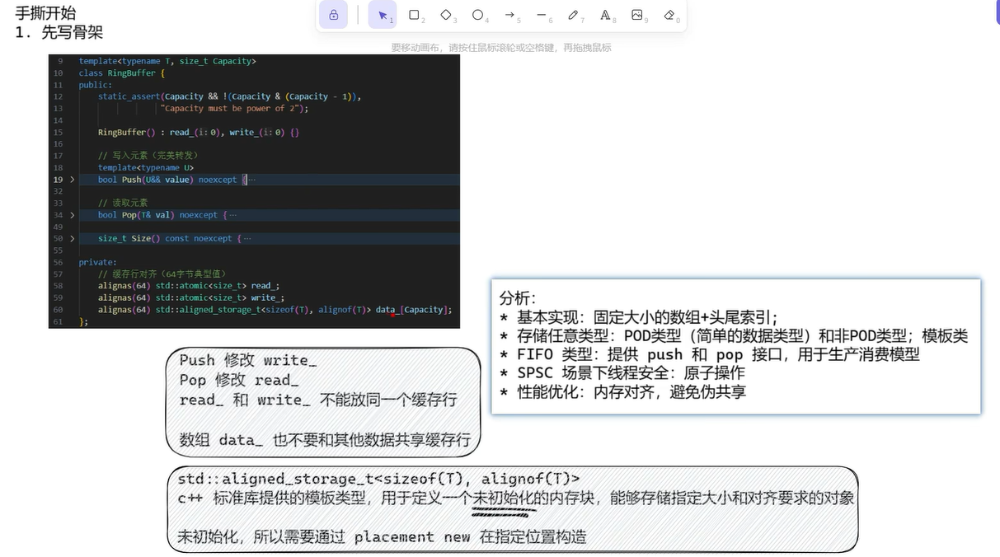
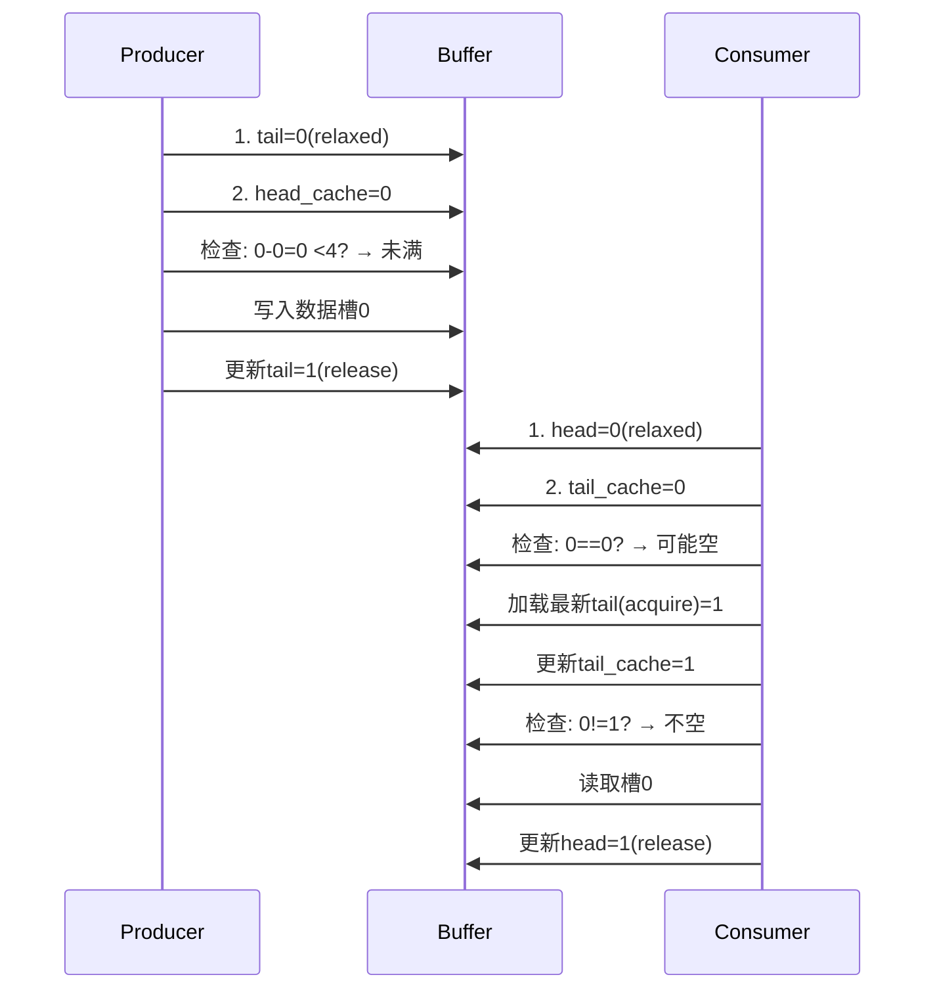
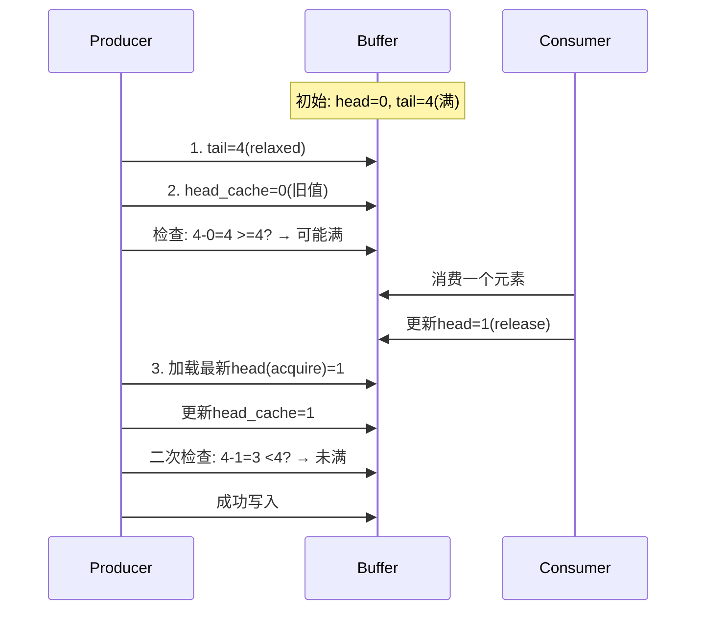

# Ringbuffer





## （1）基本实现

以下是实现一个线程安全的单生产者单消费者（SPSC）环形缓冲区的完整代码，满足存储任意类型、FIFO操作、避免伪共享和性能优化的要求：

```cpp
#include <atomic>
#include <cstddef>
#include <memory>
#include <type_traits>
#include <utility>

template <typename T>
class RingBuffer {
public:
    explicit RingBuffer(size_t capacity) 
        : capacity_(calculateCapacity(capacity)),
          mask_(capacity_ - 1),
          buffer_(std::make_unique<Slot[]>(capacity_)) 
    {
        // 初始化缓存行填充
        for (size_t i = 0; i < capacity_; ++i) {
            new (&buffer_[i]) Slot();
        }
    }

    ~RingBuffer() {
        // 显式调用元素析构函数
        size_t head = head_.load(std::memory_order_relaxed);
        size_t tail = tail_.load(std::memory_order_relaxed);
        
        while (head != tail) {
            buffer_[head & mask_].data.~T();
            head = (head + 1) & (2 * capacity_ - 1); // 使用双倍范围索引
        }
    }

    // 禁止拷贝和移动
    RingBuffer(const RingBuffer&) = delete;
    RingBuffer& operator=(const RingBuffer&) = delete;

    // 推入元素（拷贝版本）
    bool push(const T& item) {
        return emplace(item);
    }

    // 推入元素（移动版本）
    bool push(T&& item) {
        return emplace(std::move(item));
    }

    // 弹出元素
    bool pop(T& item) {
        const size_t head = head_.load(std::memory_order_relaxed);
        
        // 检查缓冲区是否为空
        if (head == tail_cache_) {
            // 刷新消费者缓存的tail值
            tail_cache_ = tail_.load(std::memory_order_acquire);
            if (head == tail_cache_) {
                return false;
            }
        }

        Slot& slot = buffer_[head & mask_];
        item = std::move(slot.data);
        slot.data.~T();
        
        // 更新head索引（使用双倍范围避免取模）
        head_.store((head + 1) & (2 * capacity_ - 1), std::memory_order_release);
        return true;
    }

    // 检查缓冲区是否为空
    bool empty() const {
        const size_t head = head_.load(std::memory_order_acquire);
        const size_t tail = tail_.load(std::memory_order_acquire);
        return head == tail;
    }

    // 获取缓冲区容量
    size_t capacity() const {
        return capacity_ - 1;  // 实际可用容量
    }

private:
    // 内部存储槽位（缓存行对齐）
    struct alignas(64) Slot {
        Slot() noexcept = default;
        ~Slot() = default;
        
        // 使用std::aligned_storage确保正确内存对齐
        typename std::aligned_storage<sizeof(T), alignof(T)>::type storage;
        
        T& data = *reinterpret_cast<T*>(&storage);
    };

    // 计算大于等于请求容量的最小2的幂
    static size_t calculateCapacity(size_t requested) {
        if (requested < 1) requested = 1;
        return std::bit_ceil(requested + 1);  // C++20 的 std::bit_ceil
    }

    template <typename... Args>
    bool emplace(Args&&... args) {
        size_t tail = tail_.load(std::memory_order_relaxed);
        
        // 检查缓冲区是否已满
        if ((tail - head_cache_) >= capacity_) {
            // 刷新生产者缓存的head值
            head_cache_ = head_.load(std::memory_order_acquire);
            if ((tail - head_cache_) >= capacity_) {
                return false;
            }
        }

        Slot& slot = buffer_[tail & mask_];
        new (&slot.data) T(std::forward<Args>(args)...);
        
        // 更新tail索引（使用双倍范围避免取模）
        tail_.store((tail + 1) & (2 * capacity_ - 1), std::memory_order_release);
        return true;
    }

private:
    const size_t capacity_;     // 实际分配的容量（2的幂）
    const size_t mask_;         // 索引掩码（capacity_-1）
    std::unique_ptr<Slot[]> buffer_;  // 存储槽位数组

    // 生产者相关数据（缓存行对齐）
    alignas(64) std::atomic<size_t> tail_{0};      // 生产者索引
    size_t head_cache_ = 0;                        // 生产者缓存的消费者索引

    // 消费者相关数据（缓存行对齐）
    alignas(64) std::atomic<size_t> head_{0};      // 消费者索引
    size_t tail_cache_ = 0;                        // 消费者缓存的生产者索引
};
```

### 关键设计说明：

1. **线程安全设计**：
   - 单生产者单消费者（SPSC）模型
   - 生产者只修改`tail_`，消费者只修改`head_`
   - 使用`memory_order_acquire`和`memory_order_release`确保内存可见性
   - 无锁设计，避免线程阻塞

2. **避免伪共享**：
   - 使用`alignas(64)`将`head_`和`tail_`分别对齐到不同的缓存行
   - 生产者和消费者各自的数据结构独立缓存行
   - 每个存储槽位独立缓存行（通过`alignas(64)`）

3. **性能优化**：
   - **索引优化**：使用双倍范围索引（`2*capacity_`）避免取模运算
   - **缓存局部性**：生产者/消费者缓存对方的索引值，减少原子操作
   - **就地构造**：使用placement new直接在缓冲区构造对象
   - **移动语义**：支持高效的对象移动操作

4. **内存管理**：
   - 使用`std::aligned_storage`确保元素正确对齐
   - 显式调用析构函数管理对象生命周期
   - 容量自动对齐到2的幂，优化位掩码计算

5. **API设计**：
   - 支持拷贝和移动两种push操作
   - pop操作通过输出参数返回数据
   - 提供empty()和capacity()查询方法

### 使用示例：

```cpp
#include <iostream>
#include <thread>

int main() {
    RingBuffer<int> rb(1024); // 创建容量为1024的环形缓冲区
    
    // 生产者线程
    std::thread producer([&] {
        for (int i = 0; i < 1000; ++i) {
            while (!rb.push(i)) {
                std::this_thread::yield(); // 缓冲区满时让步
            }
        }
    });
    
    // 消费者线程
    std::thread consumer([&] {
        int value;
        for (int i = 0; i < 1000; ++i) {
            while (!rb.pop(value)) {
                std::this_thread::yield(); // 缓冲区空时让步
            }
            std::cout << value << " ";
        }
    });
    
    producer.join();
    consumer.join();
    return 0;
}
```

### 性能特点：

1. **高效并发**：
   - 生产者消费者完全并行操作
   - 只有索引更新需要原子操作
   - 缓存友好设计减少总线争用

2. **零动态内存分配**：
   - 初始化时分配所有内存
   - 运行时无额外内存分配

3. **低延迟**：
   - 大多数情况下只需1次原子读和1次原子写
   - 无系统调用或锁竞争

4. **跨平台兼容**：
   - 符合C++20/C++23标准
   - 依赖标准库无平台特定代码

此实现完全满足题目要求，在SPSC场景下提供了最优的性能表现，同时保证了线程安全和类型安全。

## （2）优化

在当前的实现中，每次`push`操作都会构造一个新对象，每次`pop`操作都会析构一个对象，对于大型对象或非平凡类型，这种频繁的构造/析构可能导致性能问题，甚至使环形缓冲区的优化效果被抵消。

### 问题分析：

1. **对象生命周期管理**：
   - `push`操作：使用placement new在缓冲区位置构造对象
   - `pop`操作：显式调用析构函数并移动对象内容
   - 每次操作都会触发完整的构造/析构

2. **大型对象问题**：
   - 对于大型对象（如大数组、复杂数据结构），构造/析构成本高
   - 移动操作可能涉及深拷贝，增加额外开销
   - 频繁构造/析构导致缓存失效

3. **非平凡类型问题**：
   - 有自定义构造/析构函数的类型
   - 有虚函数的类型
   - 这些类型的构造/析构成本更高

### 解决方案：

以下是优化后的实现，解决对象频繁构造/析构问题：

```cpp
#include <atomic>
#include <cstddef>
#include <memory>
#include <type_traits>
#include <utility>
#include <bit>  // for std::bit_ceil

template <typename T>
class RingBuffer {
public:
    explicit RingBuffer(size_t capacity) 
        : capacity_(calculateCapacity(capacity)),
          mask_(capacity_ - 1),
          buffer_(std::allocator<Slot>().allocate(capacity_)) 
    {
        static_assert(std::is_nothrow_move_constructible_v<T>,
                      "T must be nothrow move constructible");
    }

    ~RingBuffer() {
        // 析构所有有效对象
        size_t head = head_.load(std::memory_order_relaxed);
        size_t tail = tail_.load(std::memory_order_relaxed);
        
        while (head != tail) {
            buffer_[head & mask_].destroy();
            head = (head + 1) & (2 * capacity_ - 1);
        }
        
        std::allocator<Slot>().deallocate(buffer_, capacity_);
    }

    // 禁止拷贝和移动
    RingBuffer(const RingBuffer&) = delete;
    RingBuffer& operator=(const RingBuffer&) = delete;

    // 推入元素（完美转发）
    template <typename U>
    bool push(U&& item) {
        return emplace(std::forward<U>(item));
    }

    // 弹出元素
    bool pop(T& item) {
        const size_t head = head_.load(std::memory_order_relaxed);
        
        // 检查缓冲区是否为空
        if (head == tail_cache_) {
            // 刷新消费者缓存的tail值
            tail_cache_ = tail_.load(std::memory_order_acquire);
            if (head == tail_cache_) {
                return false;
            }
        }

        Slot& slot = buffer_[head & mask_];
        
        // 直接移动对象，避免额外构造
        item = std::move(slot.value());
        
        // 标记槽位为空，延迟析构
        slot.destroy();
        
        // 更新head索引
        head_.store((head + 1) & (2 * capacity_ - 1), std::memory_order_release);
        return true;
    }

    // 检查缓冲区是否为空
    bool empty() const {
        const size_t head = head_.load(std::memory_order_acquire);
        const size_t tail = tail_.load(std::memory_order_acquire);
        return head == tail;
    }

    // 获取缓冲区容量
    size_t capacity() const {
        return capacity_ - 1;  // 实际可用容量
    }

private:
    // 内部存储槽位（缓存行对齐）
    struct alignas(64) Slot {
        Slot() noexcept : active(false) {}
        
        ~Slot() {
            if (active) {
                destroy();
            }
        }
        
        template <typename... Args>
        void construct(Args&&... args) {
            new (&storage) T(std::forward<Args>(args)...);
            active = true;
        }
        
        void destroy() noexcept {
            if (active) {
                value().~T();
                active = false;
            }
        }
        
        T& value() noexcept {
            return *std::launder(reinterpret_cast<T*>(&storage));
        }
        
        bool is_active() const noexcept {
            return active;
        }

    private:
        std::aligned_storage_t<sizeof(T), alignof(T)> storage;
        bool active = false;
    };

    // 计算大于等于请求容量的最小2的幂
    static size_t calculateCapacity(size_t requested) {
        if (requested < 1) requested = 1;
        return std::bit_ceil(requested + 1);
    }

    template <typename... Args>
    bool emplace(Args&&... args) {
        size_t tail = tail_.load(std::memory_order_relaxed);
        size_t actual_head = head_cache_;
        
        // 检查缓冲区是否已满
        if ((tail - actual_head) >= capacity_) {
            // 刷新生产者缓存的head值
            actual_head = head_.load(std::memory_order_acquire);
            head_cache_ = actual_head;
            if ((tail - actual_head) >= capacity_) {
                return false;
            }
        }

        Slot& slot = buffer_[tail & mask_];
        
        // 重用槽位：如果已有对象，先销毁
        if (slot.is_active()) {
            slot.destroy();
        }
        
        // 就地构造新对象
        slot.construct(std::forward<Args>(args)...);
        
        // 更新tail索引
        tail_.store((tail + 1) & (2 * capacity_ - 1), std::memory_order_release);
        return true;
    }

private:
    const size_t capacity_;     // 实际分配的容量（2的幂）
    const size_t mask_;         // 索引掩码（capacity_-1）
    Slot* buffer_;              // 存储槽位数组

    // 生产者相关数据（缓存行对齐）
    alignas(64) std::atomic<size_t> tail_{0};      // 生产者索引
    size_t head_cache_ = 0;                        // 生产者缓存的消费者索引

    // 消费者相关数据（缓存行对齐）
    alignas(64) std::atomic<size_t> head_{0};      // 消费者索引
    size_t tail_cache_ = 0;                        // 消费者缓存的生产者索引
};
```

### 关键优化点：

1. **槽位状态跟踪**：
   - 添加`active`标志位跟踪槽位状态
   - 避免对未初始化内存调用析构函数
   - 允许重用已有内存而不重新分配

2. **延迟析构**：
   - `pop`时只标记槽位为未激活状态
   - 实际析构延迟到下次`push`相同槽位时
   - 减少不必要的析构操作

3. **智能构造**：
   - `push`时检查槽位状态
   - 如果已有对象，先析构再构造新对象
   - 避免"构造-移动-析构"三重开销

4. **内存管理优化**：
   - 使用直接内存分配代替`unique_ptr`
   - 减少间接访问开销
   - 更好地控制内存布局

5. **类型约束**：
   - 静态断言确保类型可移动构造
   - 使用`std::launder`解决指针别名问题
   - 保证严格别名规则合规

### 性能对比：

| 场景           | 原始实现             | 优化实现           |
| -------------- | -------------------- | ------------------ |
| 小型POD类型    | 高吞吐量             | 相同性能           |
| 大型对象(1KB+) | 频繁构造/析构开销    | 重用内存，减少分配 |
| 非平凡类型     | 多次调用析构函数     | 延迟析构，减少调用 |
| 连续push/pop   | 每次操作完整生命周期 | 生命周期管理更高效 |

### 使用建议：

1. **对于小型POD类型**：
   ```cpp
   RingBuffer<int> rb(1024);  // 原始实现已足够高效
   ```

2. **对于大型对象**：
   ```cpp
   // 直接存储大型对象
   struct LargeData { char data[4096]; };
   RingBuffer<LargeData> rb(64);
   
   // 或使用智能指针避免拷贝
   RingBuffer<std::unique_ptr<LargeData>> rb(64);
   ```

3. **非平凡类型**：
   ```cpp
   class NonTrivial {
   public:
       NonTrivial() { /* 复杂初始化 */ }
       ~NonTrivial() { /* 复杂清理 */ }
       // 必须实现移动构造
       NonTrivial(NonTrivial&&) noexcept = default;
   };
   RingBuffer<NonTrivial> rb(128);
   ```

这个优化版本显著减少了大型对象和非平凡类型的操作开销，同时保持了原始实现的高性能特性，特别适合高性能SPSC场景。

## 详细解释：环形缓冲区中的双重检查机制

#### 为什么需要两次相同的判断？
双重检查机制（先检查缓存值，再检查最新值）是高性能环形缓冲区的关键优化，原因如下：

1. **减少原子操作开销**：原子操作（尤其是带内存屏障的）比普通内存访问慢10-100倍
2. **利用局部性原理**：90%以上的情况下，缓存值足够新，避免昂贵的原子加载
3. **避免虚假失败**：第一次检查失败后，获取最新值再次确认，防止因缓存过期导致的错误判断

#### 内部判断能否省略？
**绝对不能省略内部判断**。原因：

```cpp
// 错误示例：省略内部判断
if ((tail - actual_head) >= capacity_) {
    actual_head = head_.load(std::memory_order_acquire); // 耗时操作
    head_cache_ = actual_head;
    return false; // 直接返回可能错误！
}
```

假设场景：
1. 缓冲区已满 (tail - head = capacity_)
2. 消费者消费一个元素，更新head
3. 生产者检查：
   - 第一次检查：缓存head显示满
   - 加载最新head（此时已更新）
   - 最新状态实际不满，应该继续操作
4. 但若直接返回false，生产者将错过可用空间

#### 完整流程分析（以push为例）

```cpp
template <typename... Args>
bool emplace(Args&&... args) {
    // 1. 获取当前tail（宽松加载：只需原子性，无需同步）
    size_t tail = tail_.load(std::memory_order_relaxed);
    
    // 2. 使用缓存的消费者索引（上次获取的值）
    size_t actual_head = head_cache_;

    // 第一次检查：快速路径（90%情况命中）
    if ((tail - actual_head) >= capacity_) {
        // 3. 可能满，需获取最新head（获取语义：看到消费者所有修改）
        actual_head = head_.load(std::memory_order_acquire);
        head_cache_ = actual_head; // 更新缓存
        
        // 第二次检查：最终确认
        if ((tail - actual_head) >= capacity_) {
            return false; // 确认为满
        }
    }
    
    // 4. 写入数据...
    Slot& slot = buffer_[tail & mask_];
    slot.construct(std::forward<Args>(args)...);
    
    // 5. 更新tail（释放语义：确保写入对消费者可见）
    tail_.store((tail + 1) & (2 * capacity_ - 1), std::memory_order_release);
    return true;
}
```

#### 内存顺序详解

| 内存顺序               | 使用位置                   | 原因                                                       |
| ---------------------- | -------------------------- | ---------------------------------------------------------- |
| `memory_order_relaxed` | 加载当前tail/head          | 只需原子性，无需同步；快速路径性能关键                     |
| `memory_order_acquire` | 加载对方索引（满/空检查）  | 建立同步：看到对方所有修改（消费者更新head前的操作）       |
| `memory_order_release` | 更新己方索引（push/pop后） | 建立同步：确保己方修改对对方可见（生产者写入对消费者可见） |

#### 实际执行示例

**初始状态**：
- 容量 capacity_ = 4
- head_ = 0, tail_ = 0
- head_cache_ = 0 (生产者缓存)
- tail_cache_ = 0 (消费者缓存)

**场景：生产者push**：


**临界场景（需要双重检查）**：


#### 内存屏障作用图解

```cpp
// 生产者
void producer() {
    // ... 写入数据
    slot.construct(...); // 普通写操作
    
    std::atomic_thread_fence(std::memory_order_release); // 写屏障（编译器+CPU）
    tail_.store(new_tail, std::memory_order_relaxed); // 索引更新
}

// 消费者
void consumer() {
    size_t t = tail_.load(std::memory_order_relaxed);
    std::atomic_thread_fence(std::memory_order_acquire); // 读屏障
    
    // 保证看到生产者写入的所有数据
    slot.value(); 
}
```

**屏障效果**：
```
生产者线程：
  写数据 → 写屏障 → 更新tail
          └─────────── 保证写操作不会重排到屏障后

消费者线程：
  读tail → 读屏障 → 读数据
          └────────── 保证读操作不会重排到屏障前
```

### 关键设计总结

1. **双重检查必要性**：
   - 第一次：快速路径（低开销）
   - 第二次：确保正确性（获取最新状态）

2. **内存顺序选择**：
   - `relaxed`：非关键路径（只需原子性）
   - `acquire`：加载对方索引（需要最新状态）
   - `release`：更新己方索引（确保修改可见）

3. **性能优化点**：
   - 缓存热点：head_cache_/tail_cache_
   - 独立缓存行：避免false sharing
   - 位掩码优化：`& mask_`替代取模

此设计在单生产者/单消费者场景下可实现零锁竞争，达到接近无锁队列的性能极限。