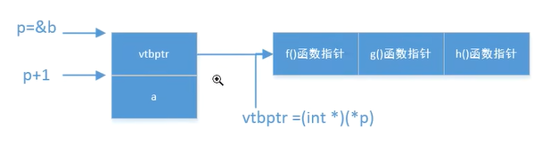
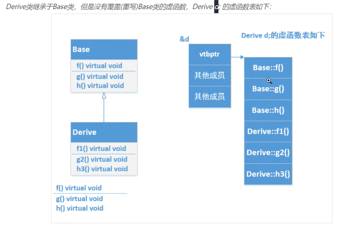
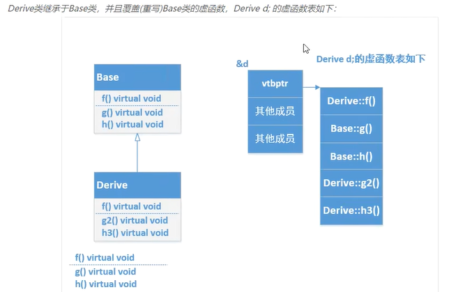
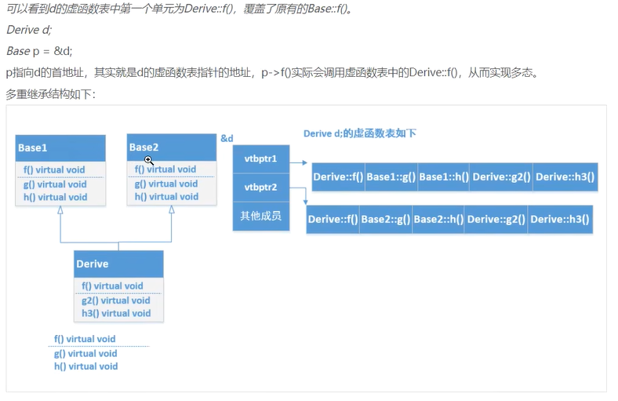
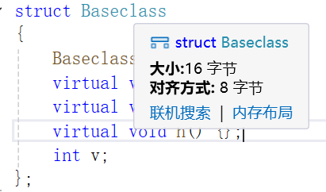
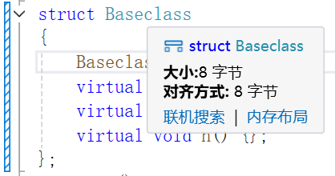
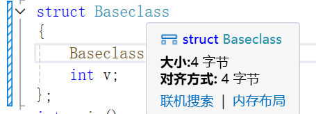

# 基类与派生类

- **基类的析构函数必须定义为`virtual`**
- **子类重载父类的方法必须定义为`override`**
- **子类和基类有相同的成员或者非虚函数、非静态的成员函数，默认使用子类的如果想要使用基类成员，需要加上基类的名字作用域，基类::名字相同的方法()**
- 静态函数不能设置为virtual，因为它只能再内存中保存一份
- **如果子类和基类的虚函数重名，但是参数类型不同，就不是重写而是隐藏，如果子类实现和基类一样的普通非虚函数成员函数（不管访问权限如何（public、protected、private），就是覆盖override，会隐藏基类同名函数**，重载是函数名相同但是参数类型不同

```cpp
#include <iostream>
class Parent {
private:
    virtual void first_name() {std::cout << "Parent::first_name()" << endl;}
    void last_name() { std::cout << "Parent::last_name()" << endl; }
public:
    
}
```


1. 基类通过在其成员函数的声明语句之前加上关键字virtual使得该函数执行动态绑定。
2. 任何构造函数之外的非静态函数都可以是虚函数。
3. 关键字virtual只能出现在类内部的声明语句之前而不能用于类外部的函数定义。
4. **如果基类把一个函数声明成虚函数，则该函数在派生类中隐式地也是虚函数**。
5. <u>成员函数</u>如果**没被声明为虚函数**，则其**解析过程发生在编译时而非运行**时。


## 派生类中的虚函数

派生类经常（但不总是）覆盖它继承的虚函数。如果派生类没有覆盖其基类中的某个虚函数，则该虚函数的行为类似于其他的普通成员，派生类会直接继承其在基类中的版本。

## 派生类构造函数

尽管在派生类对象中含有从基类继承而来的成员，但是派生类并不能直接初始化这些成员。和其他创建了基类对象的代码一样，派生类也必须使用基类的构造函数来初始化它的基类部分。

## 继承与静态成员

如果基类定义了一个静态成员（方法/变量），则在整个继承体系中只存在该成员的唯一定义。不论从基类中派生出来多少个派生类，对于每个静态成员来说都只存在唯一的实例。


## 被用作基类的类

如果我们想将某个类用作基类，则该类必须已经定义而耐非仅仅声明：

```cpp
class Quote;
//声明但未定义
//错误：Quote必须被定义
class Bulk_quote : public Quote { /*...*/};
```

这一规定的原因显而易见：派生类中包含并且可以使用它从基类继承而来的成员，为了使用这些成员，派生类当然要知道它们是什么。因此该规定还有一层隐含的意思，即一个类不能派生它本身。

一个类是基类，同时它也可以是一个派生类：

```cpp
class Base {/*...*/};
class D1 : public Base {/*...*/};
class D2 : public D1 {/*..*/};
```

在这个继承关系中，Base是D1的直接基类(direct base),同时是D2的间接基类(indirect base)。直接基类出现在派生列表中，而间接基类由派生类通过其直接基类继承而来。


## 静态类型与动态类型

当我们使用存在继承关系的类型时，必须将一个变量或其他表达式的静态类型(static type)与该表达式表示对象的动态类型(dynamic type)区分开来。表达式的静态类型在编译时总是已知的，它是变量声明时的类型或表达式生成的类型；动态类型则是变量或表达式表示的内存中的对象的类型。动态类型直到运行时才可知。

**如果表达式既不是引用也不是指针，则它的动态类型永远与静态类型一致**。例如，Quote类型的变量永远是一个Quote对象，我们无论如何都不能改变该变量对应的对象的类型。
**基类的指针或引用的静态类型可能与其动态类型不一致，读者一定要理解其中的原因**。

不存在从基类向派生类的隐式类型转换…
之所以存在派生类向基类的类型转换是因为每个派生类对像都包含一个基类部分而基类的引用或指针可以绑定到该基类部分上。一个基类的对像既可以以独立的形式存在，也可以作为派生类对象的一部分存在。如果基类对象不是派生类对像的一部分，则它只含有基类定义的成员，而不含有派生类定义的成员。因为一个基类的对像可能是派生类对象的一部分，也可能不是，所以不存在从基类向派生类的自动类型转换：

```cpp
Quote base;
Bulk_quote* bulkP = &base;  //错误：不能将基类转换成派生类
Bulk_quote& bulkRef = base; //错误：不能将基类转换成派生类
```

**如果上述赋值是合法的，则我们有可能会使用bulkP或bulkRef访问base中本不存在的成员。**

除此之外还有一种情况显得有点特别，即使一个基类指针或引用绑定在一个派生类
对象上，我们也不能执行从基类向派生类的转换：

```cpp
Bulk_quote bulk;
Quote* itemP = &bulk;	//正确：动态类型是Bulk_quote
Bulk_quote *bulkP = itemP;//错误：不能将基类转换成派生类
```

编译器在编译时无法确定某个特定的转换在运行时是否安全，这是因为编译器只能通过检查指针或引用的静态类型来推断该转换是否合法。

* **如果在基类中含有一个或多个虚函数，我们可以使用dynamic cast请求一个类型转换，该转换的安全检渣将在运行时执行**。
* **同样，如果我们已知谋个基类向派生类的转换是安全的，则我们可以使用static cast强制覆盖掉编译器的检查工作。**

**<u>当我们用一个派生类对象为一个基类对象初始化或赋值时，只有该派生类对象中的基类部分会被拷贝、移动或赋值，它的派生类部分将被忽略掉。</u>**


## 总结基类与派生类关系

关键概念：存在继承关系的类型之间的转换规则
要想理解在具有继承关系的类之间发生的类型转换，有三点非常重要：

* 从派生类向基类的类型转换只对指针或引用类型有效。
* 基类向派生类不存在隐式类型转换。
* 和任何其他成员一样，派生类向基类的类型转换也可能会由于访问受限而变得不可行。。

尽管自动类型转换只对指针或引用类型有效，但是继承体系中的大多数类仍然（显式或隐式地）定义了拷贝控制成员。因此，我们通常能够将一个派生类对像拷贝、移动或赋值给一个基类对像。不过需要注意的是，这种操作只处理派生类对像的基类部分。


# 虚函数

如前所述，<u>在C++语言中，当我们使用基类的引用或指针调用一个虚成员函数时会执行**动态绑定**</u>。*因为我们直到运行时才能知道到底调用了哪个版本的虚函数，所以所有虚函数都必须有定义*。通常情况下，如果我们不使用某个函数，则无须为该函数提供定义。但是我们必须为每一个虚函数都提供定义，而不管它是否被用到了，这是因为连编译器也无法确定到底会使用哪个虚函数。

**基类中的虚函数在派生类中隐含地也是一个虚函数**。**当派生类覆盖了某个虚函数时，该函数在<u>基类中的形参必须与派生类中的形参严格匹配</u>**。

```cpp
struct B {
	virtual void f1(int)const;
	virtual void f2();
	void f3();
};
struct C : B {
	virtual void f1(int) const override final ; //正确：f1与基类中的f1匹配
	//void f2(int) override; 	//错误：B没有形如f2(int)的函数
	//void f3() override;		//错误：f3不是虚函数
	//void f4() override;		//错误：B没有名为f4的函数
};
struct D : C {
	void f1(int) const override; //错误：final不能被重写
};

```


# 纯虚函数

类似java的接口

```cpp
struct A {
	virtual void print() = 0;
};
```


# friend

一个类声明了其他类是它的朋友，那么其他类可以访问protected、private的成员

# 虚函数表

```cpp
struct Baseclass
{
    Baseclass() : v(1024){}
    virtual void f() {};
    virtual void g() {};
    virtual void h() {};
    int v;
};
struct Deriveclass public Baseclass
{
    virtual void f() {};
    virtual void g2() {};
    virtual void h3() {};
};
Baseclass b;
cout<<"类对象大小"<sizeof(b)<<endl;
int *p =(int *)(&b);
cout << "指向虚函数表的指针的地址” << p <endl;
cout << "成员a地址" << p+1<endl;
cout << "成员a的数值" << *(p+1) <<endl;
cout << "虚函数表首地址” << (int*)(*p) <<endl;
    
// int 4字节， + 2 8字节
typedef void (*Func)();    
Deriveclass d;
int *p = (int *)(&d);
int *virtual_tableb = (int *)(*p);
Func pFun  (Func)(*(virtual_tableb));
pFun(); 

pFun = (Func)(*(virtual_tableb + 2));
pFun();

pFun = (Func)(*(virtual_tableb + 4));
pFun();

pFun = (Func)(*(virtual_tableb + 6));
pFun();

pFun = (Func)(*(virtual_tableb + 8));
pFun();
```










## 内存对齐（具体请查看计算机原理）

使用VS2022查看 的大小Baseclass

### 1.有成员变量和虚函数



### 2.仅有虚函数



### 3.仅有成员变量



### 4.总结

在计算机中指针就是计算机的位数大小，**64位8字节，32位4字节**，我的电脑是64位，Baseclass定义了虚函数，说明有虚函数表，那么需要一**个8字节的指针进行存储表地址**，且在对象地址的头部，然后紧接着是成员变量int4字节，但是考虑到**内存对齐，需要8字节，总体为16字节**，<u>原因是如果不对齐为8字节，那么获取 指针+1 操作会有问题</u>

## 钩子函数注入

```cpp
class Baseclass
public:
	Baseclass() : v(1024){}
private:
    virtual void f() { cout << "Base::f" << endl; }
    virtual void g() { cout << "Base::g" << endl; }
    virtual void h() { cout << "Base::h" << endl; }
	int v;
}

class Deriveclass : public Baseclass {
public:
	Deriveclass():Baseclass() {}
}

Deriveclass d;
Func pFunc = (Func)*((int*)(*(int*)(&d)));
pFunc(); // 输出 Base::f
```

# 重载

# 1. 重载输出运算符<<

> 通常情况下，输出运算符的**第一个形参是一个非常量ostream对像的引用**。之所以ostream是非常量是因为向流写入内容会改变其状态；而该形参是引用是因为我们<u>无法直接复制一个ostream对象</u>。
>
> 第**二个形参一般来说是一个常量的引用**，该常量是我们想要打印的类类型。<u>第二个</u><u>形参是引用的原因是我们希望避免复制实参</u>；而之所以该形参可以是常量是因为(通常情况下)打印对像不会改变对象的内容。
>
> 为了与其他输出运算符保持一致，operator<<一般要返回它的ostream形参。
>
> 

```cpp
std::ostream& operator<<(std::ostream& os, const MyClass& obj)
{
	os << "MyClass object: " << obj.value;
	return os;
}
```

# 2. 重载输入运算符>>

```cpp
std::istream& operator>>(std::istream& is, MyClass& obj)
{
	is >> obj.value;
	return is;
}
```

# 3. 重载+、==、!=

```cpp
MyClass operator+(const MyClass& obj1, const MyClass& obj2)
{
	MyClass result;
	result.value = obj1.value + obj2.value;
	return result;
}
bool operator==(const MyClass& obj1, const MyClass& obj2)
{
	return obj1.value == obj2.value;
}
bool operator!=(const MyClass& obj1, const MyClass& obj2)
{
	return obj1.value!= obj2.value;
}
```

# 4. 重载前/后置++、--

要想同时定义前置和后置运算符，必须首先解决一个问题，即普通的重载形式无法区分这两种情况。前置和后置版本使用的是同一个符号，意味着其重载版本所用的名字将是相同的，并且运算对像的数量和类型也相同。
为了解决这个问题，**后置版本接受一个额外的（不被使用）it类型的形参**。当我们使用后置运算符时，编译器为这个形参提供一个值为0的实参。尽管从语法上来说后置函数可以使用这个额外的形参，但是在实际过程中通常不会这么做。**这个形参的唯一作用就是区分前置版本和后置版本的函数，而不是真的要在实现后置版本时参与运算**。

```cpp
///< 如果声明再类内，就不需要MyClass& obj，因为会隐藏一个默认的this指针
///< 前置++
MyClass& operator++(MyClass& obj)
{
	obj.value++;
	return obj;
}
///< 后置++
MyClass operator++(MyClass& obj, int)
{
	MyClass result = obj;
	obj.value++;
	return result;
}
///< 前置--
MyClass& operator--(MyClass& obj)
{
	obj.value--;
	return obj;
}
///< 后置--
MyClass operator--(MyClass& obj, int)
{
	MyClass result = obj;
	obj.value--;
	return result;
}
```

# 5. 重载() 仿函数

```cpp
struct MyClass {
	int value;
	int operator()(int x) const { return x + value; }
};
```

## lambda表达式就是生成了一个结构体仿函数

# function

```cpp
//普通函数
int add(int i, int j) { return i + j; }
//lambda,其产生一个未命名的函数对象类
auto mod = [](int i, int j) {return i % j; };
//函数对象类
struct divide {
	int operator()(int denominator, int divisor) const {
		return denominator / divisor;
	}
};
```

function是一个模板，和我们使用过的其他模板一样，当创健一个具体的function类型时我们必须提供额外的信息。在此例中，所谓额外的信息是指该function类型能够表示的对象的调用形式。参考其他模板，我们在一对尖括号内指定类型：

```cpp
function<int (int,int)>f1 = add;//函数指针
function<int(int,int)>f2 = divide();//函数对象类的对象
function<int (int,int)>f3 = [](int i, int j) {return i % j; };//lambda
```

使用这个function类型我们可以重新定义map:

```cpp
//列举了可调用对象与二元运算符对应关系的表格
//所有可调用对象都必须接受两个1nt、返回一个int
//其中的元素可以是函数指针、函数对象或者lambda
MyClass add(const MyClass& obj1, const MyClass& obj2)
{
	MyClass result;
	result.value = obj1.value + obj2.value;
	return result;
}
int test_function() {
	int (*ADD)(int, int) = add;
	std::map<std::string, std::function<int(int, int)>> binops = {
		{"+", add}, // 二义性不知道是哪个add, 可以使用函数指针解决{"+", ADD}，或者使用lambda解决[](int i, int j) {return add(i, j); }
		{"-", std::minus<int>()},
		{"/", divide()},
		{"*", [](int i, int j) {return i * j; }},
		{"%", mod },
	};
	binops["+"](10, 5);
	binops["-"](10, 5);
	binops["/"](10, 5);
	binops["*"](10, 5);
	binops["%"](10, 5);
}
```

# MyString

```cpp
class MyString {
public:
    // 默认构造函数
    MyString() : data_(new char[1]), size_(0), capacity_(1) {
        data_[0] = '\0';
    }

    // 从C字符串构造
    MyString(const char* str) {
        size_ = strlen(str);
        capacity_ = size_ + 1;
        data_ = new char[capacity_];
        strncpy(data_, str, size_);
        data_[size_] = '\0';
    }

    // 拷贝构造函数
    MyString(const MyString& other) :
        size_(other.size_),
        capacity_(other.capacity_)
    {
        data_ = new char[capacity_];
        strncpy(data_, other.data_, size_);
        data_[size_] = '\0';
    }

    // 移动构造函数
    MyString(MyString&& other) noexcept
        : data_(other.data_),
        size_(other.size_),
        capacity_(other.capacity_)
    {
        other.data_ = nullptr;
        other.size_ = 0;
        other.capacity_ = 0;
    }

    // 析构函数
    ~MyString() {
        delete[] data_;
    }

    // 拷贝赋值运算符（3/5法则）
    MyString& operator=(const MyString& other) {
        if (this != &other) {
            delete[] data_;
            size_ = other.size_;
            capacity_ = other.capacity_;
            data_ = new char[capacity_];
            strncpy(data_, other.data_, size_);
            data_[size_] = '\0';
        }
        return *this;
    }

    // 移动赋值运算符
    MyString& operator=(MyString&& other) noexcept {
        if (this != &other) {
            delete[] data_;
            data_ = other.data_;
            size_ = other.size_;
            capacity_ = other.capacity_;
            other.data_ = nullptr;
            other.size_ = 0;
            other.capacity_ = 0;
        }
        return *this;
    }

    // 基本操作
    size_t size() const { return size_; }
    size_t capacity() const { return capacity_; }
    bool empty() const { return size_ == 0; }

    void push_back(char c) {
        if (size_ + 1 >= capacity_) {
            reserve(capacity_ == 0 ? 1 : capacity_ * 2);
        }
        data_[size_] = c;
        size_++;
        data_[size_] = '\0';
    }

    void pop_back() {
        if (size_ > 0) {
            size_--;
            data_[size_] = '\0';
        }
    }

    void erase(size_t pos, size_t len = npos) {
        if (pos >= size_) return;

        size_t erase_len = (len == npos || pos + len > size_) ?
            size_ - pos : len;

        char* dest = data_ + pos;
        char* src = data_ + pos + erase_len;
        size_t bytes = size_ - pos - erase_len + 1;

        memmove(dest, src, bytes);
        size_ -= erase_len;
    }

    void insert(size_t pos, const char* str, size_t len = npos) {
        if (pos > size_) return;
        if (len == npos) len = strlen(str);

        size_t new_size = size_ + len;
        if (new_size + 1 > capacity_) {
            reserve(std::max(capacity_ * 2, new_size + 1));
        }

        memmove(data_ + pos + len, data_ + pos, size_ - pos + 1);
        strncpy(data_ + pos, str, len);
        size_ = new_size;
    }

    void reserve(size_t new_cap) {
        if (new_cap <= capacity_) return;

        char* new_data = new char[new_cap];
        strncpy(new_data, data_, size_);
        new_data[size_] = '\0';

        delete[] data_;
        data_ = new_data;
        capacity_ = new_cap;
    }

    void clear() {
        size_ = 0;
        data_[0] = '\0';
    }

    // 运算符重载
    char& operator[](size_t idx) { return data_[idx]; }
    const char& operator[](size_t idx) const { return data_[idx]; }

    MyString& operator+=(const MyString& rhs) {
        size_t new_size = size_ + rhs.size_;
        if (new_size + 1 > capacity_) {
            reserve(new_size + 1);
        }
        strncpy(data_ + size_, rhs.data_, rhs.size_);
        size_ = new_size;
        data_[size_] = '\0';
        return *this;
    }

    const char* c_str() const { return data_; }

private:
    char* data_ = nullptr;
    size_t size_ = 0;
    size_t capacity_ = 0;
    static const size_t npos = static_cast<size_t>(-1);
};

// 非成员运算符重载
bool operator==(const MyString& lhs, const MyString& rhs) {
    if (lhs.size() != rhs.size()) return false;
    return strcmp(lhs.c_str(), rhs.c_str()) == 0;
}

bool operator!=(const MyString& lhs, const MyString& rhs) {
    return !(lhs == rhs);
}

MyString operator+(const MyString& lhs, const MyString& rhs) {
    MyString result = lhs;
    result += rhs;
    return result;
}

std::ostream& operator<<(std::ostream& os, const MyString& str) {
    os << str.c_str();
    return os;
}

std::istream& operator>>(std::istream& is, MyString& str) {
    char buffer[1024];
    if (is >> buffer) {
        str = MyString(buffer);
    }
    return is;
}
```

