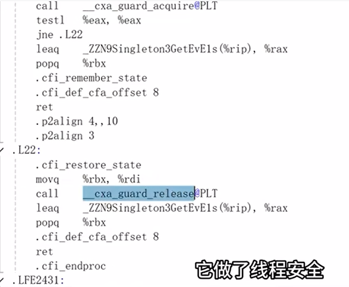
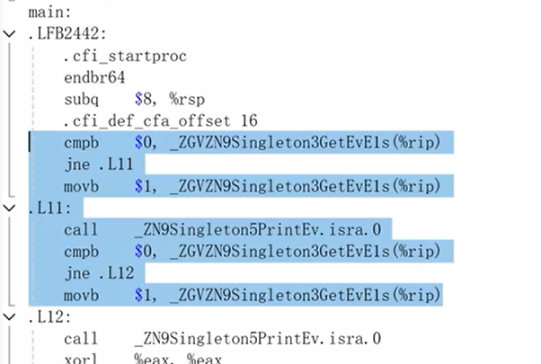

# 单例模式

## 什么是单例模式

单例模式是指在整个系统[生命周期](https://so.csdn.net/so/search?q=生命周期&spm=1001.2101.3001.7020)内，保证一个类只能产生一个实例，确保该类的唯一性。

## 为什么需要单例模式

两个原因：

1. 节省资源。一个类只有一个实例，不存在多份实例，节省资源。
2. 方便控制。在一些操作公共资源的场景时，避免了多个对象引起的复杂操作。

但是在实现单例模式时，需要考虑到线程安全的问题。

## 什么是线程安全/如何保证线程安全

什么是：在拥有共享数据的多条线程并行执行的程序中，线程安全的代码会通过同步机制保证各个线程都可以正常且正确的执行，不会出现数据污染等意外情况。

如何保证：

- 给共享的资源加把锁，保证每个资源变量每时每刻至多被一个线程占用。
- 让线程也拥有资源，不用去共享进程中的资源。如：使用threadlocal可以为每个线程维护一个私有的本地变量。

# 实现方式

### 1. 使用Meyers单例（仅适用于静态局部变量方式）

#### （1）Lazy

```cpp
template<typename T>
class Singleton {
private:
    Singleton(const Singleton&) = delete;
    Singleton& operator=(const Singleton&) = delete;
    Singleton(Singleton&&) = delete;
    Singleton& operator=(Singleton&&) = delete;

public:
    //< 是否保证多个线程同时调用getInstance()方法时，返回的实例是同一个实例？
    //< 回答可以
    //< 就是说，多个线程不会同时进入getInstance创建多个单例
    //< 参考：https://stackoverflow.com/questions/449436/singleton-instance-declared-as-static-variable-of-getinstance-method-is-it-thre
    static T& getInstance() {
	  /**
        * C++11保证静态局部变量的初始化是线程安全的
        * 局部静态特性的方式实现单实例。
        * 静态局部变量只在当前函数内有效，其他函数无法访问。
        * 静态局部变量只在第一次被调用的时候初始化，也存储在静态存储区，生命周期从第一次被初始化起至程序结束止。
        */
        static T instance;
        return instance;
    }

protected:
    Singleton() = default;
    ~Singleton() = default;
};
```

#### （2）eager

```cpp
static T* _eager_instance() {
    // C++11保证静态局部变量的初始化是线程安全的
    static struct EagerInit {
        T* instance;
        EagerInit() : instance(new T()) {}
        ~EagerInit() { delete instance; }
    } initializer;

    return initializer.instance;
}
```

### 2. 使用Phoenix单例（控制析构顺序）

```cpp
template<typename T>
class Singleton {
private:
    Singleton(const Singleton&) = delete;
    Singleton& operator=(const Singleton&) = delete;
    Singleton(Singleton&&) = delete;
    Singleton& operator=(Singleton&&) = delete;

public:
    static T& getInstance() {
        static SingletonDestroyer destroyer;
        if (!_instance) {
            std::lock_guard<std::mutex> lock(_mutex);
            if (!_instance) {
                _instance = new T();
                destroyer.registerInstance(_instance);
            }
        }
        return *_instance;
    }

protected:
    Singleton() = default;
    ~Singleton() = default;

private:
    class SingletonDestroyer {
    public:
        SingletonDestroyer() = default;
        ~SingletonDestroyer() {
            if (_instance) {
                delete _instance;
                _instance = nullptr;
            }
        }
        void registerInstance(T* p) {
            _instance = p;
        }
    };

    static T* _instance;
    static std::mutex _mutex;
};

template<typename T> T* Singleton<T>::_instance = nullptr;
template<typename T> std::mutex Singleton<T>::_mutex;
```


```cpp
#ifndef _SINGLETON_HPP_
#define _SINGLETON_HPP_
#include <mutex>
#include <memory>
#include <atomic>
// 默认启用静态局部变量单例
#if !defined(PLAIN_LAZY_SINGLETON) && !defined(EAGER_SINGLETON) && !defined(STATIC_LAZY_SINGLETON)
#define STATIC_LAZY_SINGLETON
#endif
#pragma region Singleton_no_RAII
template<typename T>
class Singleton_T {
private:
    Singleton(const Singleton&) = delete;
    Singleton& operator=(const Singleton&) = delete;
    Singleton(Singleton&&) = delete;
    Singleton& operator=(Singleton&&) = delete;

public:
    // 获取单例实例的静态方法
    static T* getInstance() {
#if defined(PLAIN_LAZY_SINGLETON)
        return _plain_lazy_instance();
#elif defined(EAGER_SINGLETON)
        return _eager_instance();
#else // STATIC_LAZY_SINGLETON
        return _static_lazy_instance();
#endif
    }

protected:
    // 构造函数和析构函数都设置为protected，禁止外部直接创建实例
    Singleton() = default;
    ~Singleton() = default;
private:
#if defined(PLAIN_LAZY_SINGLETON)
    // 懒汉式实现 (双检锁 + 内存屏障)，防止多线程初始同时创建单例
    static T* _lazy_instance() {
        T* tmp = _instance.load(std::memory_order_acquire);
        if (tmp == nullptr) {
            std::lock_guard<std::mutex> lock(_mutex);
            tmp = _instance.load(std::memory_order_relaxed);
            if (tmp == nullptr) {
                tmp = new T();
                _instance.store(tmp, std::memory_order_release);
                // 注册析构函数，确保程序结束时释放资源
                static struct Deleter {
                    ~Deleter() {
                        T* p = _instance.load(std::memory_order_acquire);
                        if (p) delete p;
                    }
                } deleter;
            }
        }
        return tmp;
    }

    static std::atomic<T*> _instance;
    static std::mutex _mutex;

#elif defined(EAGER_SINGLETON)
    // 饿汉式实现
    static T* _eager_instance() {
        // C++11保证静态局部变量的初始化是线程安全的
        static struct EagerInit {
            T* instance;
            EagerInit() : instance(new T()) {}
            ~EagerInit() { delete instance; }
        } initializer;

        return initializer.instance;
    }

#else // STATIC_LAZY_SINGLETON
    //< 是否保证多个线程同时调用getInstance()方法时，返回的实例是同一个实例？
    //< 回答可以
    //< 就是说，多个线程不会同时进入getInstance创建多个单例
    //< 参考：https://stackoverflow.com/questions/449436/singleton-instance-declared-as-static-variable-of-getinstance-method-is-it-thre
    static T* _static_lazy_instance() {
        /**
        * C++11保证静态局部变量的初始化是线程安全的
        * 局部静态特性的方式实现单实例。
        * 静态局部变量只在当前函数内有效，其他函数无法访问。
        * 静态局部变量只在第一次被调用的时候初始化，也存储在静态存储区，生命周期从第一次被初始化起至程序结束止。
        */
        static T instance;
        return &instance;
    }
#endif // PLAIN_LAZY_SINGLETON
};
// 初始化静态成员变量
#if defined(PLAIN_LAZY_SINGLETON)
template<typename T> std::atomic<T*> Singleton<T>::_instance{ nullptr };
template<typename T> std::mutex Singleton<T>::_mutex;
#endif // PLAIN_LAZY_SINGLETON
#pragma endregion

#define SINGLETON_CREATE(Class)                 \
private:                                        \
    friend class Singleton<Class>;              \
                                                \
public:                                         \
    static Class* getInstance()                 \
    {                                           \
        return Singleton<Class>::getInstance(); \
    }

#define SINGLETON_CREATE_H(Class)                   \
private:                                            \
    static std::unique_ptr<Class> _instance;        \
    friend std::default_delete<Class>;              \
                                                    \
public:                                             \
    static Class* getInstance();

#define SINGLETON_CREATE_CPP(Class)                     \
    std::unique_ptr<Class> Class::_instance = nullptr;  \
    Class* Class::getInstance()                         \
    {                                                   \
        static std::mutex mutex;                        \
        std::lock_guard<std::mutex> locker(mutex);      \
        if (_instance == nullptr)                       \
        {                                               \
            _instance.reset(new Class());               \
        }                                               \
        return _instance.get();                         \
    }

#endif // !_SINGLETON_HPP_
```

### 3. 双检锁 + 内存屏障懒汉（不推荐）

```cpp
class Singleton {
    ......
public:
	// 懒汉式实现 (双检锁 + 内存屏障)，防止多线程初始同时创建单例
    static T* _lazy_instance() {
        T* tmp = _instance.load(std::memory_order_acquire);
        if (tmp == nullptr) {
            std::lock_guard<std::mutex> lock(_mutex);
            tmp = _instance.load(std::memory_order_relaxed);
            if (tmp == nullptr) {
                tmp = new T();
                _instance.store(tmp, std::memory_order_release);
                // 注册析构函数，确保程序结束时释放资源
                static struct Deleter {
                    ~Deleter() {
                        T* p = _instance.load(std::memory_order_acquire);
                        if (p) delete p;
                    }
                } deleter;
            }
        }
private:
	static std::atomic<std::shared_ptr<T>> _instance;
    static std::mutex _mutex;
};
template<typename T> std::atomic<std::shared_ptr<T>> Singleton<T>::_instance{ nullptr };
template<typename T> std::mutex Singleton<T>::_mutex;
```

### 4. RAII自动管理

#### （1）unique_ptr + call_once

```cpp
template<typename T>
class Singleton {
    ...
public:
    static T& getInstance() {
        std::call_once(_flag, [] {
            _instance.reset(new T());
        });
        return *instance;
    }

private:
    static std::unique_ptr<T> _instance;
    static std::once_flag _flag;
};
template <typename T>
std::unique_ptr<T> Singleton<T>::_instance = nullptr;
std::once_flag Singleton<T>::_flag;
```

#### （2）shared_ptr + mutex + 自定义仿函数删除器（和Phonenix类似）

```cpp
template<typename T>
class Singleton {
    ...
public:
    static shared_ptr<T> getInstance() {
        if(_instance) return _instance;
        _mutex.lock();
        if (_instance) {
            _mutex.unlock();
            return _instance;
        }
        _instance = std::shared_ptr<T>(new T(), [](T* p) { delete p; });
        _mutex.unlock();
        return _instance;
    }
private:
    static std::shared_ptr<T> _instance;
    static std::mutex _mutex;
};
```

# 实现问题

## 双加锁/C++11静态局部变量

```cpp
static Singleton *_instance;
static std::mutex _mutex;

static Singleton& getInstance
{
    if(!_instance)
    	_instance = new Singleton;
    return *_instance;
}// 多个线程同时访问可能创建多个_instance，内存泄漏


static Singleton& getInstance
{
    std::lock_guard<std::mutex> lock(_mutex);
    if(!_instance)
    	_instance = new Singleton;
    return *_instance;
}// 每次访问都要加锁访问锁非常耗费资源时间


static Singleton& getInstance
{
    if(!_instance){//第三个线程在这里!_instance判断
        std::lock_guard<std::mutex> lock(_mutex);//第二个线程被阻止在锁外等待
    	if(!_instance){
            _instance = new Singleton; // 第一个线程正在创建
        }
    }
    return *_instance;
}// 第二次访问不需要加锁，DCLP，但是会出现一个问题，如果第一个线程没有创建完成创建了一半，导致!_instance不为空，第三个线程将会返回一个错误的对象，出现很大的问题，原因是_instance = new Singleton;的执行是三个指令（1.创建对象空间，2.对象初始化调用对象构造函数，3.把初始化好的对象赋值给指针），但是经过编译器的优化（会执行1 3 2）所以导致了该问题，解决方法内存屏障

//内存屏障写法，即通过原子操作进行改进


//C++11以后规定，静态局部变量初始化会自动加锁
    static T& getInstance() {
        static T instance;//gcc关掉编译器加锁，-fno-threadsafe-statics
        return instance;
    }
```

汇编查看初始化加锁



GCC -fno-threadsafe-statics去锁


