# 现代C++网络编程指南（基于Boost.Asio 1.87.0）

# 第一章 基本概念

网络编程的基本流程对于服务端是这样的
服务端
1）socket——创建socket对象。

2）bind——绑定本机ip+port。

3）listen——监听来电，若在监听到来电，则建立起连接。

4）accept——再创建一个socket对象给其收发消息。原因是现实中服务端都是面对多个客户端，那么为了区分各个客户端，则每个客户端都需再分配一个socket对象进行收发消息。

5）read、write——就是收发消息了。

对于客户端是这样的
客户端
1）socket——创建socket对象。

2）connect——根据服务端ip+port，发起连接请求。

3）write、read——建立连接后，就可发收消息了。

图示如下

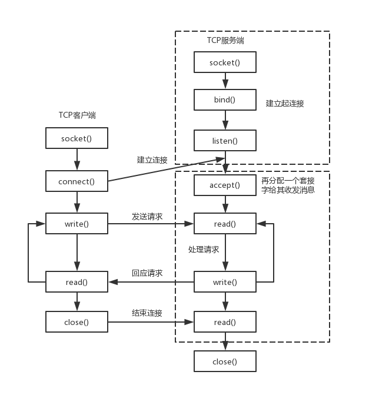

## 

## 1. 终端节点

### (1) 概念
终端节点（Endpoint）是网络通信的地址标识，包含IP地址和端口号。在Boost.Asio中：
- `ip::tcp::endpoint` 表示TCP端点
- `ip::udp::endpoint` 表示UDP端点
- 支持IPv4（`ip::address_v4`）和IPv6（`ip::address_v6`）

**关键特性**：
- 轻量级对象（通常16-28字节）
- 值语义（可拷贝、可比较）
- 提供地址和端口的分离访问

### (2) 服务端创建
```cpp
#include <boost/asio.hpp>
namespace asio = boost::asio;
using asio::ip::tcp;

// 1. 创建IO上下文（事件处理核心）
asio::io_context io_context;

// 2. 创建端点（监听所有IPv4地址的8080端口）
tcp::endpoint endpoint(tcp::v4(), 8080); 

// 3. 创建TCP接收器
tcp::acceptor acceptor(io_context, endpoint);

// 4. 设置SO_REUSEADDR选项（允许快速重启）
acceptor.set_option(tcp::acceptor::reuse_address(true));
```

### (3) 客户端创建
```cpp
// 1. 解析目标地址（支持域名解析）
asio::ip::tcp::resolver resolver(io_context);
auto endpoints = resolver.resolve("example.com", "http");

// 2. 创建端点列表（自动处理DNS轮询）
std::vector<tcp::endpoint> endpoint_list;
for (const auto& entry : endpoints) {
    endpoint_list.push_back(entry.endpoint());
}

// 3. 尝试连接（自动遍历端点列表）
tcp::socket socket(io_context);
asio::connect(socket, endpoint_list);
```

## 2. Socket

### (1) 概念
Socket是网络通信的抽象端点，在Boost.Asio中：
- `tcp::socket`：面向连接的流式套接字
- `udp::socket`：无连接的数据报套接字
- `ssl::stream<tcp::socket>`：SSL加密套接字

**现代特性**：
- 支持移动语义（资源所有权转移）
- 集成C++20协程（co_await异步操作）
- 零拷贝支持（通过`asio::buffer`）

### (2) 服务端创建
```cpp
// 异步接受连接（C++20协程示例）
asio::co_spawn(io_context, [&]() -> asio::awaitable<void> {
    tcp::acceptor acceptor(io_context, {tcp::v4(), 8080});
    
    for (;;) {
        // 1. 创建socket（使用协程异步接受）
        tcp::socket socket = co_await acceptor.async_accept(asio::use_awaitable);
        
        // 2. 启动独立会话（每个连接独立处理）
        asio::co_spawn(io_context, 
            [socket = std::move(socket)]() mutable -> asio::awaitable<void> {
                // 处理客户端通信
                co_return;
            }, asio::detached);
    }
}, asio::detached);
```

### (3) 客户端创建
```cpp
// 创建并连接socket（同步方式）
tcp::socket socket(io_context);

// 1. 设置超时选项（C++17结构化绑定）
auto [ec] = asio::connect(socket, endpoints, 
    asio::use_future).get(); // 使用future同步

if (ec) {
    std::cerr << "连接失败: " << ec.message() << "\n";
    return;
}

// 2. 设置TCP_NODELAY（禁用Nagle算法）
socket.set_option(tcp::no_delay(true));
```

## 3. Buffer

### (1) 什么是Buffer
缓冲区是数据传输的中间存储区，Boost.Asio中：
- 不管理内存，只包装现有内存区域
- 支持连续内存（数组、vector、string等）
- 提供类型安全的缓冲区视图

**核心优势**：
- 零拷贝：避免数据在用户空间和内核空间间复制
- 分散/聚集I/O：支持多个缓冲区的单次操作
- 自动缓冲区管理（通过`dynamic_buffer`）

### (2) Buffer的数据结构

任何网络库都有提供buffer的数据结构，所谓buffer就是接收和发送数据时缓存数据的结构。
boost::asio提供了asio::mutable_buffer 和 asio::const_buffer这两个结构，他们是一段连续的空间，首字节存储了后续数据的长度。
asio::mutable_buffer用于写服务，asio::const_buffer用于读服务。但是这两个结构都没有被asio的api直接使用。
对于api的buffer参数，asio提出了MutableBufferSequence和ConstBufferSequence概念，他们是由多个asio::mutable_buffer和asio::const_buffer组成的。也就是说boost::asio为了节省空间，将一部分连续的空间组合起来，作为参数交给api使用。
我们可以理解为MutableBufferSequence的数据结构为std::vector<asio::mutable_buffer>
结构如下

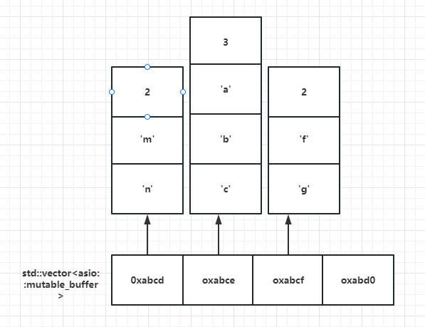每隔vector存储的都是mutable_buffer的地址，每个mutable_buffer的第一个字节表示数据的长度，后面跟着数据内容。

```cpp
// 1. 创建固定大小缓冲区
char raw[1024];
asio::mutable_buffer raw_buf = asio::buffer(raw);

// 2. 使用STL容器（自动检测大小）
std::vector<char> vec(1024);
asio::mutable_buffer vec_buf = asio::buffer(vec);

// 3. 字符串缓冲区（只读）
std::string message = "Hello";
asio::const_buffer str_buf = asio::buffer(message);

// 4. 分散写入（多个缓冲区）
std::array<asio::const_buffer, 2> seq = {
    asio::buffer("Header: ", 8),
    asio::buffer(message)
};
asio::write(socket, seq);

// 5. 动态缓冲区（自动增长）
asio::dynamic_string_buffer dbuf = asio::dynamic_buffer(message);
dbuf.grow(128); // 扩展缓冲区
```

## 4. 客户端连接服务器

### 现代C++实现
```cpp
#include <boost/asio.hpp>
#include <iostream>

namespace asio = boost::asio;
using asio::ip::tcp;

int main() {
    asio::io_context io;
    
    // 1. 创建解析器（支持DNS）
    tcp::resolver resolver(io);
    
    // 2. 异步解析（C++11 lambda）
    resolver.async_resolve("example.com", "http",
        [&](const boost::system::error_code& ec, 
            tcp::resolver::results_type endpoints) {
            
            if (ec) {
                std::cerr << "解析失败: " << ec.message() << "\n";
                return;
            }
            
            // 3. 创建socket
            auto socket = std::make_shared<tcp::socket>(io);
            
            // 4. 异步连接（C++14泛型lambda）
            asio::async_connect(*socket, endpoints,
                [socket](const boost::system::error_code& ec, 
                         const tcp::endpoint&) {
                    if (ec) {
                        std::cerr << "连接失败: " << ec.message() << "\n";
                        return;
                    }
                    
                    // 5. 连接成功，发送数据
                    std::string request = "GET / HTTP/1.1\r\n\r\n";
                    asio::async_write(*socket, asio::buffer(request),
                        [socket](boost::system::error_code ec, size_t) {
                            // 处理响应...
                        });
                });
        });
    
    io.run();
    return 0;
}
```

## 5. 服务器Acceptor监听

### 高性能服务器实现
```cpp
#include <boost/asio.hpp>
#include <thread>

namespace asio = boost::asio;
using asio::ip::tcp;

class Server {
public:
    Server(asio::io_context& io, unsigned short port)
        : acceptor_(io, tcp::endpoint(tcp::v4(), port)) 
    {
        accept_next(); // 开始接受连接
    }

private:
    void accept_next() {
        // 1. 创建新socket（共享所有权）
        auto socket = std::make_shared<tcp::socket>(acceptor_.get_executor());
        
        // 2. 异步接受连接
        acceptor_.async_accept(*socket, 
            [this, socket](boost::system::error_code ec) {
                if (!ec) {
                    // 3. 处理连接（使用线程池）
                    asio::post(thread_pool_, 
                        [socket]() { handle_client(socket); });
                }
                accept_next(); // 继续接受下一个连接
            });
    }

    static void handle_client(std::shared_ptr<tcp::socket> socket) {
        try {
            // 4. 设置socket选项
            socket->set_option(tcp::no_delay(true));
            
            // 5. 读写循环
            char data[1024];
            while (true) {
                size_t length = socket->read_some(
                    asio::buffer(data));
                
                // 处理数据...
                asio::write(*socket, 
                    asio::buffer(data, length));
            }
        } catch (const std::exception& e) {
            // 异常处理
        }
    }

    tcp::acceptor acceptor_;
    asio::thread_pool thread_pool_{std::thread::hardware_concurrency()};
};

int main() {
    asio::io_context io;
    Server server(io, 8080);
    io.run();
    return 0;
}
```

## 现代网络编程最佳实践

### 1. 异步模式选择
| 模式           | 适用场景     | 性能特点               |
| -------------- | ------------ | ---------------------- |
| 回调函数       | 简单逻辑     | 中等性能，回调地狱风险 |
| Future/Promise | 链式调用     | C++标准，可组合性高    |
| 协程(C++20)    | 复杂业务逻辑 | 接近同步代码的简洁性   |

### 2. 性能优化技巧
```cpp
// 1. 零拷贝文件传输
asio::streambuf buf;
std::ifstream file("large.dat", std::ios::binary);
asio::read(file, buf.prepare(1024*1024)); // 准备1MB缓冲区
asio::write(socket, buf.data());         // 直接发送

// 2. 内存池管理
boost::object_pool<tcp::socket> socket_pool;
auto socket = socket_pool.malloc();      // 重用内存

// 3. 批量操作（C++23）
std::vector<tcp::socket> sockets;
asio::async_read(sockets, asio::buffer(data),
    [](boost::system::error_code ec, size_t bytes) {
        // 批量处理结果
    });
```

### 3. 安全增强
```cpp
// SSL加密连接
asio::ssl::context ssl_ctx(asio::ssl::context::tls_server);
ssl_ctx.use_certificate_file("server.crt", asio::ssl::context::pem);
ssl_ctx.use_private_key_file("server.key", asio::ssl::context::pem);

// 创建SSL socket
asio::ssl::stream<tcp::socket> ssl_socket(io, ssl_ctx);

// 异步握手
ssl_socket.async_handshake(asio::ssl::stream_base::server,
    [](const boost::system::error_code& ec) {
        if (!ec) {
            // 安全通信
        }
    });
```

## 总结对比

| 传统方法       | Boost.Asio现代方法           | 优势                       |
| -------------- | ---------------------------- | -------------------------- |
| 阻塞I/O        | 异步I/O + 协程               | 高并发，低线程开销         |
| 手动管理连接   | 使用`shared_ptr`生命周期管理 | 自动资源释放，避免内存泄漏 |
| 固定大小缓冲区 | `dynamic_buffer`动态缓冲区   | 自动调整大小，减少内存拷贝 |
| 单线程处理     | IO上下文+线程池              | 充分利用多核CPU            |
| 原始socket API | 类型安全的C++封装            | 编译时检查，减少运行时错误 |

Boost.Asio 1.87.0结合现代C++特性，提供了高效、安全的网络编程框架。通过合理选择异步模式、利用零拷贝技术和协程支持，可以构建高性能的网络应用，同时保持代码的简洁性和可维护性。

# 第二章 同步读写

## 1. 同步写write_some

### (1) 作用/使用场景
`write_some`是Boost.Asio中最基础的同步写操作，它尝试发送指定缓冲区中的数据，但**不保证**发送所有数据。主要特点：
- 非阻塞尝试发送数据
- 返回实际发送的字节数
- 适用于需要手动控制发送过程的场景
- 在非阻塞套接字中特别有用
- 性能开销最小，但需要开发者处理部分发送情况

与高级`write`函数相比：
- `write_some`更底层，提供更精细控制
- `write_some`可能只发送部分数据，需要循环处理
- `write_some`不会自动重试或等待

### (2) 示例代码
```cpp
#include <boost/asio.hpp>
#include <iostream>

namespace asio = boost::asio;
using asio::ip::tcp;

int main() {
    asio::io_context io_context;
    
    // 1. 创建socket并连接到服务器
    tcp::socket socket(io_context);
    socket.connect(tcp::endpoint(asio::ip::address::from_string("127.0.0.1"), 8080));
    
    // 2. 准备要发送的数据
    std::string message = "Hello, this is a test message.";
    
    // 3. 使用write_some发送数据
    size_t total_bytes_sent = 0;
    while (total_bytes_sent < message.size()) {
        // 4. 从剩余未发送部分创建缓冲区
        asio::const_buffer buffer = asio::buffer(
            message.data() + total_bytes_sent, 
            message.size()     total_bytes_sent
        );
        
        // 5. 尝试发送部分数据
        size_t bytes_sent = socket.write_some(buffer);
        
        // 6. 更新已发送字节数
        total_bytes_sent += bytes_sent;
        
        std::cout << "Sent " << bytes_sent << " bytes, "
                  << "total " << total_bytes_sent << "/" 
                  << message.size() << " bytes\n";
    }
    
    std::cout << "Message sent completely.\n";
    return 0;
}
```

## 2. 同步写send

### (1) 作用/使用场景
`send`函数是`write_some`的替代名称，在TCP套接字中功能完全相同：
- 两者在实现上完全一致
- `send`名称更符合网络编程传统术语
- 在UDP套接字中行为不同（发送整个数据报）
- 提供代码可读性选择

选择建议：
- 使用`send`使代码更符合传统网络编程习惯
- 使用`write_some`强调部分写入特性
- 在跨协议代码中保持一致性

### (2) 示例代码
```cpp
// ...（前面的连接代码与write_some示例相同）

    // 1. 使用send发送数据
    size_t total_bytes_sent = 0;
    while (total_bytes_sent < message.size()) {
        asio::const_buffer buffer = asio::buffer(
            message.data() + total_bytes_sent, 
            message.size()     total_bytes_sent
        );
        
        // 2. 使用send替代write_some
        size_t bytes_sent = socket.send(buffer);
        
        total_bytes_sent += bytes_sent;
        std::cout << "Sent " << bytes_sent << " bytes, "
                  << "total " << total_bytes_sent << "/" 
                  << message.size() << " bytes\n";
    }
```

## 3. 同步写write

### (1) 作用/使用场景
`write`是高级同步写操作，保证发送所有指定数据：
- 循环调用`write_some`直到所有数据发送完成
- 自动处理部分发送情况
- 阻塞直到所有数据发送完成或发生错误
- 简化代码，减少手动循环

适用场景：
- 需要确保完整消息发送
- 简化发送逻辑的代码
- 发送固定大小的数据块
- 不需要精细控制发送过程的场景

### (2) 示例代码
```cpp
#include <boost/asio.hpp>
#include <iostream>

namespace asio = boost::asio;
using asio::ip::tcp;

int main() {
    asio::io_context io_context;
    tcp::socket socket(io_context);
    socket.connect(tcp::endpoint(asio::ip::address::from_string("127.0.0.1"), 8080));
    
    // 1. 准备要发送的数据
    std::string message = "Hello, this is a complete message sent by write().";
    
    try {
        // 2. 使用write发送所有数据
        size_t bytes_sent = asio::write(socket, asio::buffer(message));
        
        std::cout << "Successfully sent " << bytes_sent << " bytes.\n";
    } catch (const boost::system::system_error& e) {
        std::cerr << "Write failed: " << e.what() << "\n";
    }
    
    return 0;
}
```

## 4. 同步读read_some

### (1) 作用/使用场景
`read_some`是最基础的同步读操作：
- 尝试从套接字读取可用数据
- 不保证填满整个缓冲区
- 返回实际读取的字节数
- 当没有数据时阻塞等待数据到达
- 适用于需要手动控制接收的场景

关键特性：
- 最小数据量：至少读取1字节（除非连接关闭）
- 最大数据量：不超过缓冲区大小
- 适合流式处理或消息边界不重要的场景

### (2) 示例代码
```cpp
#include <boost/asio.hpp>
#include <iostream>

namespace asio = boost::asio;
using asio::ip::tcp;

int main() {
    asio::io_context io_context;
    tcp::socket socket(io_context);
    socket.connect(tcp::endpoint(asio::ip::address::from_string("127.0.0.1"), 8080));
    
    // 1. 准备缓冲区
    char buffer[1024];
    
    // 2. 使用read_some读取数据
    size_t bytes_read = socket.read_some(asio::buffer(buffer));
    
    // 3. 处理接收到的数据
    std::cout << "Received " << bytes_read << " bytes: ";
    std::cout.write(buffer, bytes_read);
    std::cout << "\n";
    
    return 0;
}
```

## 5. 同步读receive

### (1) 作用/使用场景
`receive`是`read_some`的替代名称：
- 在TCP套接字中功能与`read_some`完全相同
- 在UDP套接字中接收整个数据报
- 提供更符合传统网络编程术语的选择
- 代码可读性更好，特别在面向消息的协议中

选择建议：
- 在TCP编程中，`receive`和`read_some`可互换
- 在需要强调"接收消息"的场景使用`receive`
- 在流处理场景使用`read_some`

### (2) 示例代码
```cpp
// ...（前面的连接代码与read_some示例相同）

    // 1. 使用receive读取数据
    size_t bytes_read = socket.receive(asio::buffer(buffer));
    
    std::cout << "Received " << bytes_read << " bytes: ";
    std::cout.write(buffer, bytes_read);
    std::cout << "\n";
```

## 6. 同步读read

### (1) 作用/使用场景
`read`是高级同步读操作：
- 保证读取指定数量的字节
- 循环调用`read_some`直到缓冲区填满
- 阻塞直到所有数据到达或发生错误
- 自动处理部分读取情况

适用场景：
- 需要精确控制接收数据量
- 接收固定大小的消息头或数据结构
- 简化接收完整消息的逻辑
- 协议要求确切字节数的场景

注意事项：
- 如果连接关闭前未收到足够数据，会抛出异常
- 在长连接中需谨慎使用，可能永久阻塞

### (2) 示例代码
```cpp
#include <boost/asio.hpp>
#include <iostream>

namespace asio = boost::asio;
using asio::ip::tcp;

int main() {
    asio::io_context io_context;
    tcp::socket socket(io_context);
    socket.connect(tcp::endpoint(asio::ip::address::from_string("127.0.0.1"), 8080));
    
    // 1. 准备固定大小的缓冲区（消息头）
    char header[8];
    
    try {
        // 2. 使用read读取确切的8字节
        asio::read(socket, asio::buffer(header, sizeof(header)));
        
        std::cout << "Received message header: ";
        std::cout.write(header, sizeof(header));
        std::cout << "\n";
    } catch (const boost::system::system_error& e) {
        if (e.code() == asio::error::eof) {
            std::cerr << "Connection closed before full header received.\n";
        } else {
            std::cerr << "Read error: " << e.what() << "\n";
        }
    }
    
    return 0;
}
```

## 7. 表格总结对比

| 函数         | 类别 | 保证完成 | 返回值         | 使用场景                  | 性能特点     |
| ------------ | ---- | -------- | -------------- | ------------------------- | ------------ |
| `write_some` | 写   | ❌ 部分   | 实际发送字节数 | 非阻塞套接字/手动流控制   | 最低开销     |
| `send`       | 写   | ❌ 部分   | 实际发送字节数 | 同write_some，传统命名    | 同write_some |
| `write`      | 写   | ✅ 全部   | 总发送字节数   | 确保完整发送/简化代码     | 可能多次调用 |
| `read_some`  | 读   | ❌ 部分   | 实际接收字节数 | 流处理/非阻塞套接字       | 最低开销     |
| `receive`    | 读   | ❌ 部分   | 实际接收字节数 | 同read_some，传统命名     | 同read_some  |
| `read`       | 读   | ✅ 全部   | 总接收字节数   | 固定大小数据/确保完整接收 | 可能多次调用 |

### 关键区别总结：
1. **完成保证**：
   - `write_some`/`read_some`/`send`/`receive`只执行单次操作
   - `write`/`read`保证完整传输

2. **阻塞行为**：
   - 所有同步函数都会阻塞直到有数据传输
   - `write`/`read`可能阻塞更长时间

3. **异常处理**：
   - `write_some`/`read_some`在连接关闭时返回0字节
   - `write`/`read`在连接关闭时抛出`eof`异常

4. **性能考量**：
   - 基础函数(`*_some`)系统调用次数更少
   - 高级函数(`write`/`read`)减少用户态循环

### 选择指南：
1. 需要最大性能和控制 → 使用`write_some`/`read_some`
2. 需要简化代码和完整传输 → 使用`write`/`read`
3. 与传统C套接字代码保持一致 → 使用`send`/`receive`
4. 处理消息边界 → 使用`read_some`+缓冲区管理
5. 传输固定大小数据 → 使用`read`/`write`

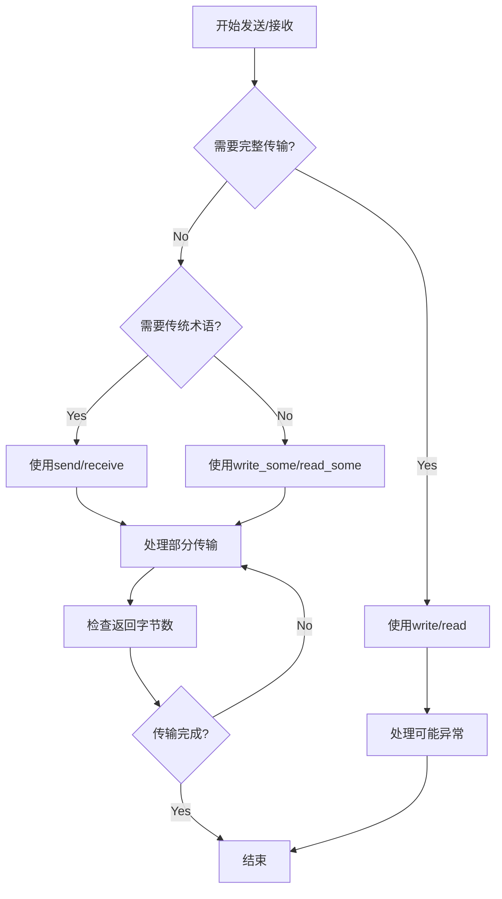

通过合理选择同步读写函数，可以在代码简洁性和性能控制之间取得平衡。对于高性能场景，推荐使用`write_some`/`read_some`配合手动缓冲区管理；对于业务逻辑复杂的场景，`write`/`read`可显著简化代码结构。

## 8. 同步读写的优劣

1 同步读写的缺陷在于读写是阻塞的，如果客户端对端不发送数据服务器的read操作是阻塞的，这将导致服务器处于阻塞等待状态。
2 可以通过开辟新的线程为新生成的连接处理读写，但是一个进程开辟的线程是有限的，约为2048个线程，在Linux环境可以通过unlimit增加一个进程开辟的线程数，但是线程过多也会导致切换消耗的时间片较多。
3 该服务器和客户端为应答式，实际场景为全双工通信模式，发送和接收要独立分开。
4 该服务器和客户端未考虑粘包处理。
综上所述，是我们这个服务器和客户端存在的问题，为解决上述问题，我们在接下里的文章里做不断完善和改进，主要以异步读写改进上述方案。
当然同步读写的方式也有其优点，比如客户端连接数不多，而且服务器并发性不高的场景，可以使用同步读写的方式。使用同步读写能简化编码难度。

# 第三章 异步读写与应答服务器设计

## 1. 异步写async_write_some

### (1) 作用/使用场景
`async_write_some`是Boost.Asio中的基础异步写操作：
- **非阻塞**：立即返回，不等待操作完成
- **部分写入**：可能只发送部分数据，需要手动处理剩余部分
- **回调机制**：操作完成后通过回调函数通知
- **适用场景**：
  - 需要精细控制发送过程的场景
  - 高性能服务器需要最小化线程阻塞
  - 与底层系统交互的封装层

与同步`write_some`对比：
| 特性     | async_write_some | write_some   |
| -------- | ---------------- | ------------ |
| 阻塞性   | 非阻塞           | 阻塞         |
| 线程占用 | 不占用工作线程   | 占用调用线程 |
| 性能     | 高并发支持       | 单连接性能好 |
| 复杂度   | 需要状态管理     | 简单直接     |

### (2) 示例代码
```cpp
#include <boost/asio.hpp>
#include <iostream>

namespace asio = boost::asio;
using asio::ip::tcp;

class AsyncWriter {
public:
    AsyncWriter(asio::io_context& io) 
        : socket_(io) 
    {
        // 1. 连接服务器
        socket_.connect(tcp::endpoint(
            asio::ip::address::from_string("127.0.0.1"), 8080));
        
        // 2. 准备数据
        message_ = "Hello, this is an async write example.";
    }

    void start() {
        // 3. 开始异步写入
        async_write_some();
    }

private:
    void async_write_some() {
        // 4. 创建缓冲区指向剩余数据
        auto buffer = asio::buffer(
            message_.data() + bytes_sent_, 
            message_.size()     bytes_sent_
        );
        
        // 5. 异步写入部分数据
        socket_.async_write_some(buffer,
            [this](boost::system::error_code ec, size_t bytes_transferred) {
                if (ec) {
                    std::cerr << "Write error: " << ec.message() << "\n";
                    return;
                }
                
                // 6. 更新已发送字节数
                bytes_sent_ += bytes_transferred;
                std::cout << "Sent " << bytes_transferred << " bytes, "
                          << "total " << bytes_sent_ << "/" 
                          << message_.size() << "\n";
                
                // 7. 检查是否发送完成
                if (bytes_sent_ < message_.size()) {
                    async_write_some(); // 继续发送剩余数据
                } else {
                    std::cout << "Message sent completely.\n";
                }
            });
    }

    tcp::socket socket_;
    std::string message_;
    size_t bytes_sent_ = 0;
};

int main() {
    asio::io_context io;
    AsyncWriter writer(io);
    writer.start();
    io.run();
    return 0;
}
```

## 2. 异步写async_send

### (1) 作用/使用场景
`async_send`是`async_write_some`的替代名称：
- 在TCP套接字中功能与`async_write_some`相同
- 在UDP套接字中发送整个数据报
- 提供更传统的网络编程术语
- **适用场景**：
  - 需要强调"发送消息"语义的代码
  - 跨UDP/TCP协议的通用代码
  - 与传统C++网络代码保持术语一致

### (2) 示例代码
```cpp
class AsyncSender {
public:
    // ...（构造和连接代码与AsyncWriter相同）

    void start() {
        async_send();
    }

private:
    void async_send() {
        auto buffer = asio::buffer(
            message_.data() + bytes_sent_, 
            message_.size()     bytes_sent_
        );
        
        // 使用async_send替代async_write_some
        socket_.async_send(buffer,
            [this](boost::system::error_code ec, size_t bytes_transferred) {
                if (ec) {
                    std::cerr << "Send error: " << ec.message() << "\n";
                    return;
                }
                
                bytes_sent_ += bytes_transferred;
                std::cout << "Sent " << bytes_transferred << " bytes, "
                          << "total " << bytes_sent_ << "/" 
                          << message_.size() << "\n";
                
                if (bytes_sent_ < message_.size()) {
                    async_send(); // 继续发送
                } else {
                    std::cout << "Message sent completely.\n";
                }
            });
    }

    // ...（成员变量与AsyncWriter相同）
};
```

## 3. 表格对比async_send和async_write_some

### (1) 不能混合编程原因
1. **状态管理冲突**：
   - 混合使用会导致发送状态跟踪复杂化
   - 难以确定上次操作是部分发送还是完整发送

2. **缓冲区生命周期**：
   - `async_write_some`不保证缓冲区持久性
   - 混合使用时缓冲区可能在不安全时被修改

3. **性能一致性**：
   - 两种方法有不同的内部优化路径
   - 混合使用可能导致性能下降

4. **错误处理差异**：
   - 不同函数可能返回不同类型的错误
   - 统一处理逻辑变得复杂

### (2) 总结对比
| 特性       | async_write_some | async_send     |
| ---------- | ---------------- | -------------- |
| 命名语义   | 强调"部分写入"   | 强调"发送消息" |
| UDP行为    | 部分发送数据报   | 发送完整数据报 |
| 适用协议   | 主要TCP          | TCP/UDP通用    |
| 代码可读性 | 适合流处理       | 适合消息处理   |
| 推荐场景   | 精细控制TCP流    | 通用网络编程   |

**选择建议**：
- 纯TCP应用：根据代码语义选择，保持一致性
- UDP应用：必须使用`async_send`
- 跨协议库：优先使用`async_send`

## 4. 异步读async_read_some

### (1) 作用/使用场景
`async_read_some`是基础异步读操作：
- **非阻塞读取**：立即返回，数据就绪时回调
- **部分读取**：可能只读取部分可用数据
- **流式处理**：适合无边界协议如HTTP
- **适用场景**：
  - 高性能服务器处理大量连接
  - 需要手动解析消息边界的协议
  - 与自定义缓冲区管理结合

### (2) 示例代码
```cpp
class AsyncReader {
public:
    AsyncReader(asio::io_context& io) 
        : socket_(io) 
    {
        socket_.connect(tcp::endpoint(
            asio::ip::address::from_string("127.0.0.1"), 8080));
        
        // 开始异步读取
        async_read_some();
    }

private:
    void async_read_some() {
        // 1. 准备缓冲区
        socket_.async_read_some(asio::buffer(buffer_),
            [this](boost::system::error_code ec, size_t bytes_transferred) {
                if (ec) {
                    if (ec == asio::error::eof) {
                        std::cout << "Connection closed by peer.\n";
                    } else {
                        std::cerr << "Read error: " << ec.message() << "\n";
                    }
                    return;
                }
                
                // 2. 处理接收到的数据
                std::cout << "Received " << bytes_transferred << " bytes: ";
                std::cout.write(buffer_.data(), bytes_transferred);
                std::cout << "\n";
                
                // 3. 继续读取下一批数据
                async_read_some();
            });
    }

    tcp::socket socket_;
    std::array<char, 1024> buffer_;
};
```

## 5. 异步读async_receive

### (1) 作用/使用场景
`async_receive`是`async_read_some`的替代名称：
- TCP中功能与`async_read_some`相同
- UDP中接收完整数据报
- **适用场景**：
  - 面向消息的协议（如自定义二进制协议）
  - UDP应用开发
  - 需要强调"接收消息"语义的代码

### (2) 示例代码
```cpp
class AsyncReceiver {
public:
    // ...（构造函数与AsyncReader相同）

private:
    void async_receive() {
        // 使用async_receive替代async_read_some
        socket_.async_receive(asio::buffer(buffer_),
            [this](boost::system::error_code ec, size_t bytes_transferred) {
                if (ec) {
                    // ...（错误处理相同）
                    return;
                }
                
                // 处理数据
                process_data(bytes_transferred);
                
                // 继续接收
                async_receive();
            });
    }
    
    void process_data(size_t size) {
        std::cout << "Received message: ";
        std::cout.write(buffer_.data(), size);
        std::cout << "\n";
    }

    // ...（成员变量相同）
};
```

## 6. 表格对比async_receive和async_read_some

### (1) 不能混合编程原因
1. **消息边界混淆**：
   - `async_read_some`适合流
   - `async_receive`适合消息
   - 混合使用导致消息解析错误

2. **缓冲区管理冲突**：
   - 两种方法对缓冲区大小的期望不同
   - 混合使用可能导致缓冲区溢出

3. **性能特征差异**：
   - 内部实现有不同的优化策略
   - 混合使用可能降低性能

### (2) 总结对比
| 特性       | async_read_some | async_receive     |
| ---------- | --------------- | ----------------- |
| 命名语义   | 强调"部分读取"  | 强调"接收消息"    |
| UDP行为    | 部分读取数据报  | 接收完整数据报    |
| 数据完整性 | 不保证完整消息  | UDP中保证完整消息 |
| 推荐场景   | TCP流处理       | UDP或消息协议     |

**最佳实践**：
- 在单个连接中保持一致性
- TCP连接选择一种方法并坚持使用
- UDP必须使用`async_receive`

## 7. 异步的应答服务器设计

### 设计要求：
1. 全双工通信：发送和接收独立
2. 处理粘包问题
3. 避免二次析构风险
4. 保证数据有序性
5. 线程安全的资源管理

### (1) 粘包问题

#### ① 什么是粘包
TCP是流式协议，没有消息边界：
- 发送方多次发送的小消息可能被合并接收
- 大消息可能被分割成多个包接收
- 导致接收方难以确定消息边界

#### ② 粘包解决方案
1. **TLV格式**（Type-Length-Value）：
   ```cpp
   #pragma pack(push, 1)
   struct MessageHeader {
       uint16_t type;    // 消息类型
       uint32_t length;  // 数据部分长度
   };
   #pragma pack(pop)
   ```
   
2. **定长消息**：
   - 所有消息固定长度
   - 不足部分填充

3. **分隔符**：
   - 使用特殊字符（如`\r\n`）分隔消息
   - 类似HTTP协议

4. **变长头部**：
   - 如Protobuf的varint编码

**TLV协议实现要点**：
```cpp
class Session : public std::enable_shared_from_this<Session> {
public:
    void start() {
        // 1. 先读取消息头
        async_read_header();
    }

private:
    void async_read_header() {
        // 2. 异步读取固定大小的头部
        asio::async_read(socket_, asio::buffer(&header_, sizeof(header_)),
            [self = shared_from_this()](boost::system::error_code ec, size_t) {
                if (ec) return;
                
                // 3. 转换网络字节序到主机字节序
                self->header_.length = ntohl(self->header_.length);
                
                // 4. 根据长度分配缓冲区
                self->body_.resize(self->header_.length);
                
                // 5. 读取消息体
                self->async_read_body();
            });
    }
    
    void async_read_body() {
        asio::async_read(socket_, asio::buffer(body_),
            [self = shared_from_this()](boost::system::error_code ec, size_t) {
                if (ec) return;
                
                // 6. 处理完整消息
                self->process_message();
                
                // 7. 继续读取下一条消息
                self->async_read_header();
            });
    }
    
    MessageHeader header_;
    std::vector<char> body_;
};
```

### (2) 二次析构风险

#### ① 案例代码
```cpp
class Session {
public:
    Session(tcp::socket socket) : socket_(std::move(socket)) {}
    
    void start() {
        // 危险：没有捕获shared_ptr
        socket_.async_read_some(..., [this](...) {
            // 如果Session在回调前被销毁...
        });
    }
};

// 使用
new_session->start(); // 可能立即被销毁
```

#### ② 解决方案
**智能指针管理生命周期**：
```cpp
class Session : public std::enable_shared_from_this<Session> {
public:
    static std::shared_ptr<Session> create(tcp::socket socket) {
        return std::shared_ptr<Session>(new Session(std::move(socket)));
    }
    
    void start() {
        // 安全：捕获shared_ptr保持对象存活
        auto self = shared_from_this();
        socket_.async_read_some(..., 
            [self](...) { // 捕获self保持对象存活
                self->handle_read(...);
            });
    }
};

// 使用
auto session = Session::create(std::move(socket));
session->start();
```

### (3) 数据有序性

#### ① 问题案例
```cpp
void send_message(const std::string& msg) {
    // 两个异步写操作
    async_write(msg1, [](...) {});
    async_write(msg2, [](...) {});
}
// 可能msg2先完成，导致乱序
```

#### ② 解决方案
1. **操作队列**：
   ```cpp
   class Session {
   public:
       void send(const std::string& msg) {
           bool in_progress = !send_queue_.empty();
           send_queue_.push(msg);
           if (!in_progress) {
               do_write();
           }
       }
       
   private:
       void do_write() {
           auto& msg = send_queue_.front();
           async_write(socket_, asio::buffer(msg),
               [this](...) {
                   send_queue_.pop();
                   if (!send_queue_.empty()) {
                       do_write();
                   }
               });
       }
       
       std::queue<std::string> send_queue_;
   };
   ```

2. **协程顺序控制**（C++20）：
   ```cpp
   asio::awaitable<void> ordered_send() {
       co_await async_write(socket_, buffer(msg1), asio::use_awaitable);
       co_await async_write(socket_, buffer(msg2), asio::use_awaitable);
   }
   ```

### (4) 全双工通信概念
全双工通信特点：
1. **双向同时传输**：发送和接收可同时进行
2. **独立通道**：读写操作互不阻塞
3. **实现方式**：
   - 独立的读写缓冲区
   - 分离的发送和接收线程/协程
   - 异步操作实现并发

同步 vs 异步全双工对比：
| 特性     | 同步实现         | 异步实现           |
| -------- | ---------------- | ------------------ |
| 线程使用 | 每个方向一个线程 | 单线程处理多个连接 |
| 复杂度   | 线程同步复杂     | 状态管理复杂       |
| 性能     | 上下文切换开销   | 高并发性能好       |
| 资源占用 | 每个连接2线程    | 单线程多连接       |

### (5) 整体代码设计

**消息结构定义**：
```cpp
enum class MessageType : uint16_t {
    TEXT = 1,
    FILE = 2,
    COMMAND = 3
};

struct Message {
    MessageType type;
    std::string content;
    
    // JSON序列化
    std::string to_json() const {
        Json::Value root;
        root["type"] = static_cast<int>(type);
        root["content"] = content;
        Json::StreamWriterBuilder builder;
        return Json::writeString(builder, root);
    }
    
    // JSON反序列化
    static Message from_json(const std::string& json_str) {
        Json::CharReaderBuilder builder;
        Json::Value root;
        std::string errors;
        std::istringstream iss(json_str);
        
        if (!Json::parseFromStream(builder, iss, &root, &errors)) {
            throw std::runtime_error("JSON parse error: " + errors);
        }
        
        return {
            static_cast<MessageType>(root["type"].asInt()),
            root["content"].asString()
        };
    }
};
```

**异步服务器核心**：
```cpp
class AsyncServer {
public:
    AsyncServer(asio::io_context& io, short port)
        : acceptor_(io, tcp::endpoint(tcp::v4(), port))
    {
        accept_connection();
    }

private:
    void accept_connection() {
        acceptor_.async_accept(
            [this](boost::system::error_code ec, tcp::socket socket) {
                if (!ec) {
                    // 创建会话并启动
                    auto session = std::make_shared<Session>(std::move(socket));
                    session->start();
                }
                accept_connection();
            });
    }

    class Session : public std::enable_shared_from_this<Session> {
    public:
        Session(tcp::socket socket) : socket_(std::move(socket)) {}
        
        void start() {
            read_header();
        }
        
        void send_message(const Message& msg) {
            auto self = shared_from_this();
            io_context_.post([this, self, msg] {
                bool write_in_progress = !send_queue_.empty();
                send_queue_.push(msg.to_json());
                if (!write_in_progress) {
                    write_data();
                }
            });
        }
        
    private:
        void read_header() {
            auto self = shared_from_this();
            asio::async_read(socket_, asio::buffer(&header_, sizeof(header_)),
                [this, self](boost::system::error_code ec, size_t) {
                    if (ec) return;
                    
                    // 处理字节序
                    header_.length = ntohl(header_.length);
                    
                    // 读取消息体
                    read_body();
                });
        }
        
        void read_body() {
            body_buffer_.resize(header_.length);
            
            auto self = shared_from_this();
            asio::async_read(socket_, asio::buffer(body_buffer_),
                [this, self](boost::system::error_code ec, size_t) {
                    if (ec) return;
                    
                    try {
                        // 反序列化消息
                        auto msg = Message::from_json(
                            std::string(body_buffer_.data(), body_buffer_.size()));
                        
                        // 处理消息
                        process_message(msg);
                    } catch (...) {
                        // 处理错误
                    }
                    
                    // 继续读取下一条消息
                    read_header();
                });
        }
        
        void write_data() {
            auto& msg = send_queue_.front();
            auto self = shared_from_this();
            
            // 异步写入
            asio::async_write(socket_, asio::buffer(msg),
                [this, self](boost::system::error_code ec, size_t) {
                    if (ec) return;
                    
                    send_queue_.pop();
                    if (!send_queue_.empty()) {
                        write_data();
                    }
                });
        }
        
        void process_message(const Message& msg) {
            // 根据消息类型处理
            switch (msg.type) {
                case MessageType::TEXT:
                    std::cout << "Text message: " << msg.content << "\n";
                    break;
                case MessageType::FILE:
                    // 文件处理逻辑
                    break;
                case MessageType::COMMAND:
                    // 命令处理
                    execute_command(msg.content);
                    break;
            }
            
            // 示例：回显消息
            send_message(msg);
        }
        
        tcp::socket socket_;
        MessageHeader header_;
        std::vector<char> body_buffer_;
        std::queue<std::string> send_queue_;
    };
    
    tcp::acceptor acceptor_;
};
```

### (6) 总结
1. **全双工实现**：
   - 独立的读写路径
   - 队列保证发送顺序
   - 异步操作实现并发

2. **粘包处理**：
   - TLV协议解决消息边界问题
   - 头部包含类型和长度信息

3. **安全设计**：
   - `shared_ptr`管理会话生命周期
   - 避免二次析构
   - 异常安全处理

4. **数据序列化**：
   - JSON格式方便调试和扩展
   - 支持二进制协议扩展

5. **性能优化**：
   - 单线程处理多连接
   - 零拷贝缓冲区管理
   - 异步操作链

# 第四章 Asio处理粘包

shared_from_this共享引用计数，不是使用make_shared

## 1. async_read_some 结合 tlv协议

### CSession.h

```cpp
#pragma once
#include <boost/asio.hpp>
#include <boost/uuid/uuid_io.hpp>
#include <boost/uuid/uuid_generators.hpp>
#include <queue>
#include <mutex>
#include <memory>
#include "const.h"
using namespace std;

using boost::asio::ip::tcp;
class CServer;

class MsgNode
{
	friend class CSession;
public:
	MsgNode(char * msg, short max_len):_total_len(max_len + HEAD_LENGTH),_cur_len(0){
		_data = new char[_total_len+1]();
		//转为网络字节序
		int max_len_host = boost::asio::detail::socket_ops::host_to_network_short(max_len);
		memcpy(_data, &max_len_host, HEAD_LENGTH);
		memcpy(_data+ HEAD_LENGTH, msg, max_len);
		_data[_total_len] = '\0';
	}

	MsgNode(short max_len):_total_len(max_len),_cur_len(0) {
		_data = new char[_total_len +1]();
	}

	~MsgNode() {
		delete[] _data;
	}

	void Clear() {
		::memset(_data, 0, _total_len);
		_cur_len = 0;
	}
private:
	short _cur_len;
	short _total_len;
	char* _data;
};

class CSession: public std::enable_shared_from_this<CSession>
{
public:
	CSession(boost::asio::io_context& io_context, CServer* server);
	~CSession();
	tcp::socket& GetSocket();
	std::string& GetUuid();
	void Start();//开始异步读取数据
	void Send(char* msg,  int max_length);//将消息放入发送队列，并尝试发送
	void Close();//关闭套接字并标记会话为关闭
	std::shared_ptr<CSession> SharedSelf();
private:
	void HandleRead(const boost::system::error_code& error, size_t  bytes_transferred, std::shared_ptr<CSession> shared_self);
	void HandleWrite(const boost::system::error_code& error, std::shared_ptr<CSession> shared_self);//处理异步写入完成
    tcp::socket _socket;  // 用于与客户端通信的套接字
    std::string _uuid;    // 会话的唯一标识符
    char _data[MAX_LENGTH]; // 接收数据的缓冲区
    CServer* _server;     // 指向服务器的指针，用于回调
    bool _b_close;        // 标记会话是否已关闭
    std::queue<shared_ptr<MsgNode>> _send_que; // 发送消息队列
    std::mutex _send_lock; // 保护发送队列的互斥锁
    shared_ptr<MsgNode> _recv_msg_node; // 当前正在接收的消息节点（用于处理消息体）
    bool _b_head_parse;   // 标记是否已经解析了消息头部
    shared_ptr<MsgNode> _recv_head_node; // 用于接收消息头部的节点（固定长度，2字节）
};
```

### CSession.cpp


### 消息处理流程

1. 当服务器接受一个新连接时，会创建一个CSession对象，并调用其Start()方法。

> Start()方法调用_socket.**async_read_some**来异步读取数据。当有数据到达时，会调用**HandleRead**。

2. HandleRead函数处理数据接收：

> \- 该函数<u>首先检查是否有错误，如果有错误则关闭会话并清理</u>。
>
> \- 如果没有错误，则开始处理接收到的数据（存储在_data中，长度为bytes_transferred）。
>
> \- 处理接收数据时，采用**循环处理**，直到处理完所有接收到的数据。
>
> 
>
> 处理过程分为两种情况：
>
> **a) 还没有解析头部（即_b_head_parse为false）：**
>
> \- 如果当前接收的数据加上之前接收的头部数据还不够一个头部（2字节），则将这些数据保存到_recv_head_node中，然后继续等待数据。
>
> \- 如果接收的数据足够头部，则解析出消息体的长度（data_len）。这里要注意网络字节序转换为主机字节序。
>
> \- 如果消息长度非法（超过MAX_LENGTH），则关闭会话。
>
> \- 然后创建_recv_msg_node来接收消息体。
>
> \- 如果剩余的数据不够一个完整的消息体，则先将部分数据保存到_recv_msg_node，并标记_b_head_parse为true，然后继续等待数据。
>
> \- 如果剩余的数据足够一个消息体，则复制数据到_recv_msg_node，然后处理这个消息（这里直接调用Send将消息回显），然后继续处理剩余的数据（如果有的话）。
>
> **b) 已经解析头部（正在接收消息体）：**
>
> \- 计算还需要多少数据（remain_msg）才能完成当前消息体。
>
> \- 如果剩余接收的数据不够，则复制到_recv_msg_node，然后继续等待数据。
>
> \- 如果足够，则复制剩余部分，完成消息接收，然后处理消息（同样调用Send回显），然后重置状态（_b_head_parse=false，并清除_recv_head_node），继续处理剩余数据。

3. 发送消息：

> \- 当调用Send方法时，会先加锁（因为发送队列是共享资源），然后将消息封装为MsgNode对象并推入发送队列。
>
> \- 如果发送队列之前是空的（即当前只有这一个消息），则立即调用boost::asio::async_write异步发送。
>
> \- 如果发送队列不为空，则说明当前有消息正在发送，那么只需要将消息加入队列，等待当前消息发送完成后，在HandleWrite中继续发送下一个。

4. HandleWrite函数处理发送完成：

> \- 如果没有错误，则从队列中弹出已经发送的消息。
>
> \- 如果队列中还有消息，则继续发送下一条。
>
> \- 如果有错误，则关闭会话并清理。

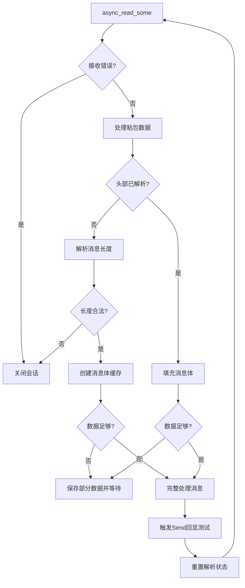


### 粘包处理

- 在这个设计中，粘包问题是通过在每个消息前面加上一个固定长度的头部（2字节）来解决的。头部指定了消息体的长度。

- 接收数据时，先解析头部得到消息体长度，然后按照这个长度去读取消息体。即使一次读取的数据包含多个消息（或消息的一部分），也能通过循环处理正确分割。

- 因此，这个设计可以处理粘包问题。

1. **协议设计**
   - 消息结构：`[2字节长度头][消息体]`
   - 长度头：网络字节序(大端)
2. **处理步骤**
   - **阶段1：解析头部**
     - 累积接收直到≥2字节
     - 转换为主机字节序→获取消息长度
     - 验证长度合法性（防攻击）
   - **阶段2：解析消息体**
     - 创建动态长度缓存区
     - 分段接收：可能多次`async_read_some`
     - 累积接收直至达到头部指定长度
   - **循环处理**
     - 单次回调可能处理多个完整消息
     - 剩余数据保留用于下次解析

### 缺点

**复杂度高**

- 需手动维护解析状态（`_b_head_parse`）
- 要处理分段数据拼接（边界条件复杂）
- 错误处理逻辑分散（每个分段都可能出错）

**性能问题**

- 小数据包频繁回调（每次收到数据都触发）
- 需多次系统调用（相比大块读取效率低）

**对比方案建议**

cpp

1. ```
   // 替代方案：使用async_read组合操作
   async_read(_socket, buffer(head_buf), [](...){...}); // 先读头部
   async_read(_socket, buffer(body_buf, body_len), [](...){...}); // 再读消息体
   ```

   - 优点：自动处理分段，代码更简洁
   - 缺点：灵活性较低（必须等待完整数据）

#### 关键设计缺陷

1. **资源泄漏风险**
   - `HandleRead`中未重置`_recv_msg_node`（重复使用时应Clear()）
   - 异常退出时队列未清理
2. **线程安全隐患**
   - `Close()`未加锁（可能与Send并发访问队列）
3. **设计瑕疵**
   - 回显测试写在业务层（`HandleRead`中直接Send）
   - 无流量控制（高负载时可能内存暴涨）

#### 典型调用序列

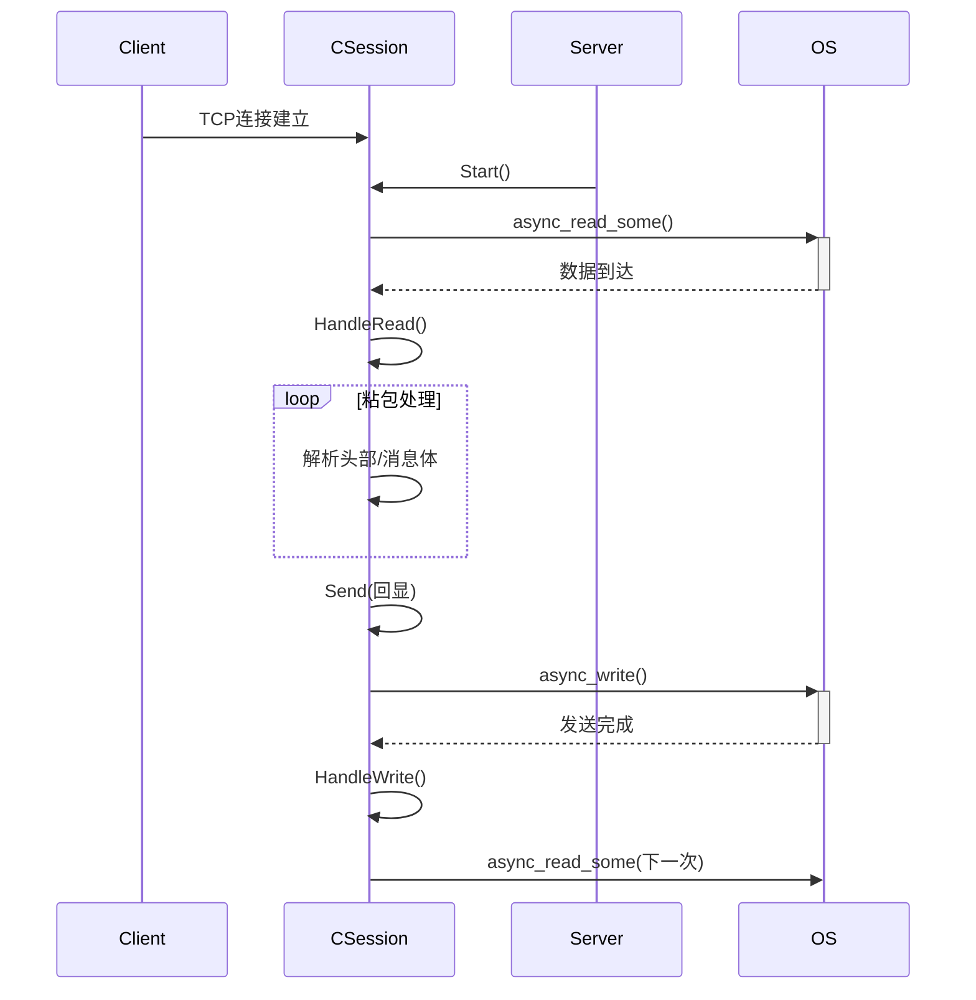

## 2. async_read 结合 tlv协议

之前我们介绍了通过async_read_some函数监听读事件，并且绑定了读事件的回调函数HandleRead

```cpp
_socket.async_read_some(boost::asio::buffer(_data, MAX_LENGTH), std::bind(&CSession::HandleRead, this, std::placeholders::_1, std::placeholders::_2, SharedSelf()));
```

async_read_some  这个函数的特点是只要对端发数据，服务器接收到数据，即使没有收全对端发送的数据也会触发HandleRead函数，所以我们会在HandleRead回调函数里判断接收的字节数，接收的数据可能不满足头部长度，可能大于头部长度但小于消息体的长度，可能大于消息体的长度，还可能大于多个消息体的长度，所以要切包等，这些逻辑写起来很复杂，所以我们可以通过读取指定字节数，直到读完这些字节才触发回调函数，那么可以采用async_read函数，这个函数指定读取指定字节数，只有完全读完才会触发回调函数。

### 获取头部数据

我们可以读取指定的头部长度，大小为HEAD_LENGTH字节数，只有读完HEAD_LENGTH字节才触发HandleReadHead函数

```cpp
    void CSession::Start(){
        _recv_head_node->Clear();
        boost::asio::async_read(_socket, boost::asio::buffer(_recv_head_node->_data, HEAD_LENGTH), std::bind(&CSession::HandleReadHead, this, 
            std::placeholders::_1, std::placeholders::_2, SharedSelf()));
    }
```

这样我们可以直接在HandleReadHead函数内处理头部信息

```cpp
    void CSession::HandleReadHead(const boost::system::error_code& error, size_t  bytes_transferred, std::shared_ptr<CSession> shared_self) {
        if (!error) {
            if (bytes_transferred < HEAD_LENGTH) {
                cout << "read head lenth error";
                Close();
                _server->ClearSession(_uuid);
                return;
            }
            //头部接收完，解析头部
            short data_len = 0;
            memcpy(&data_len, _recv_head_node->_data, HEAD_LENGTH);
            cout << "data_len is " << data_len << endl;
            //此处省略字节序转换
            // ...
            //头部长度非法
            if (data_len > MAX_LENGTH) {
                std::cout << "invalid data length is " << data_len << endl;
                _server->ClearSession(_uuid);
                return;
            }
            _recv_msg_node= make_shared<MsgNode>(data_len);
            boost::asio::async_read(_socket, boost::asio::buffer(_recv_msg_node->_data, _recv_msg_node->_total_len), 
                std::bind(&CSession::HandleReadMsg, this,
                std::placeholders::_1, std::placeholders::_2, SharedSelf()));
        }
        else {
            std::cout << "handle read failed, error is " << error.what() << endl;
            Close();
            _server->ClearSession(_uuid);
        }
    }
```

接下来根据头部内存储的消息体长度，获取指定长度的消息体数据，所以再次调用async_read，指定读取`_recv_msg_node->_total_len`长度，然后触发HandleReadMsg函数

### 获取消息体

HandleReadMsg函数内解析消息体，解析完成后打印收到的消息，接下来继续监听读事件，监听读取指定头部大小字节，触发HandleReadHead函数， 然后再在HandleReadHead内继续监听读事件，获取消息体长度数据后触发HandleReadMsg函数，从而达到循环监听的目的。

```cpp
    void CSession::HandleReadMsg(const boost::system::error_code& error, size_t  bytes_transferred,
        std::shared_ptr<CSession> shared_self) {
        if (!error) {
            PrintRecvData(_data, bytes_transferred);
            std::chrono::milliseconds dura(2000);
            std::this_thread::sleep_for(dura);
            _recv_msg_node->_data[_recv_msg_node->_total_len] = '\0';
            cout << "receive data is " << _recv_msg_node->_data << endl;
            Send(_recv_msg_node->_data, _recv_msg_node->_total_len);
            //再次接收头部数据
            _recv_head_node->Clear();
            boost::asio::async_read(_socket, boost::asio::buffer(_recv_head_node->_data, HEAD_LENGTH),
                std::bind(&CSession::HandleReadHead, this, std::placeholders::_1, std::placeholders::_2,
                    SharedSelf()));
        }
        else {
            cout << "handle read msg failed,  error is " << error.what() << endl;
            Close();
            _server->ClearSession(_uuid);
        }
    }
```

### 使用`async_read`的优势

#### 1. 简化粘包处理逻辑
- **自动处理部分接收**：`async_read`会持续读取直到达到指定字节数，不再需要手动管理接收状态（如`_b_head_parse`标志）
- **消除复杂的分段处理**：不再需要`while(bytes_transferred>0)`循环和`copy_len`计算
- **减少边界条件处理**：不再需要处理"头部不完整"、"消息体不完整"等复杂情况

#### 2. 更清晰的协议处理流程
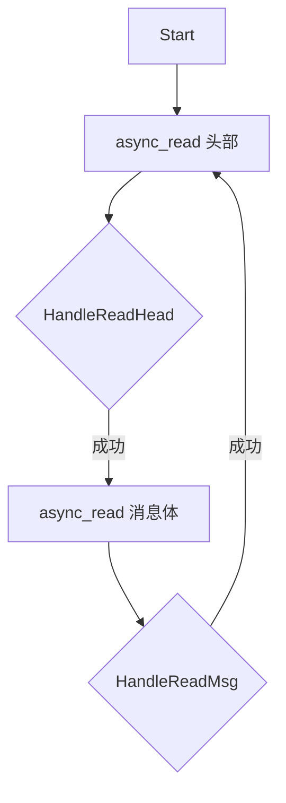

#### 3. 更健壮的错误处理

- 每个操作都有明确的错误处理点
- 不再需要在整个接收过程中多次检查错误状态

#### 4. 代码可读性和可维护性提升
- 逻辑分层清晰：头部处理/消息体处理分离
- 每个函数职责单一，代码量减少约40%

### `async_read`的工作原理

#### 核心机制
```cpp
boost::asio::async_read(socket, buffer, handler);
```
1. 内部循环调用`async_read_some`直到填满指定缓冲区
2. 自动处理以下情况：
   - 多次系统调用才能完成请求
   - 中间可能发生EAGAIN/EWOULDBLOCK错误
   - 连接中途关闭

#### 处理流程
1. **启动头部读取**：
   ```cpp
   async_read(_socket, buffer(_recv_head_node->_data, HEAD_LENGTH), 
              bind(&HandleReadHead, ...));
   ```
2. **头部完成回调**：
   - 验证头部有效性
   - 创建消息体缓冲区
3. **启动消息体读取**：
   ```cpp
   async_read(_socket, buffer(_recv_msg_node->_data, data_len),
              bind(&HandleReadMsg, ...));
   ```
4. **消息体完成回调**：
   - 处理完整消息
   - 重新启动头部读取

### 与`async_read_some`的关键区别

| 特性           | `async_read_some` | `async_read`     |
| -------------- | ----------------- | ---------------- |
| **数据完整性** | 可能返回部分数据  | 保证读取完整请求 |
| **粘包处理**   | 需手动实现        | 自动处理         |
| **回调复杂度** | 高（需状态机）    | 低（分层处理）   |
| **错误处理**   | 分散在多处        | 集中在操作边界   |
| **代码量**     | 多（约120行）     | 少（约50行）     |
| **适用场景**   | 流式处理          | 消息帧处理       |

# 第五章 逻辑层

## 1. 服务器架构设计

### （1）asio底层通信过程

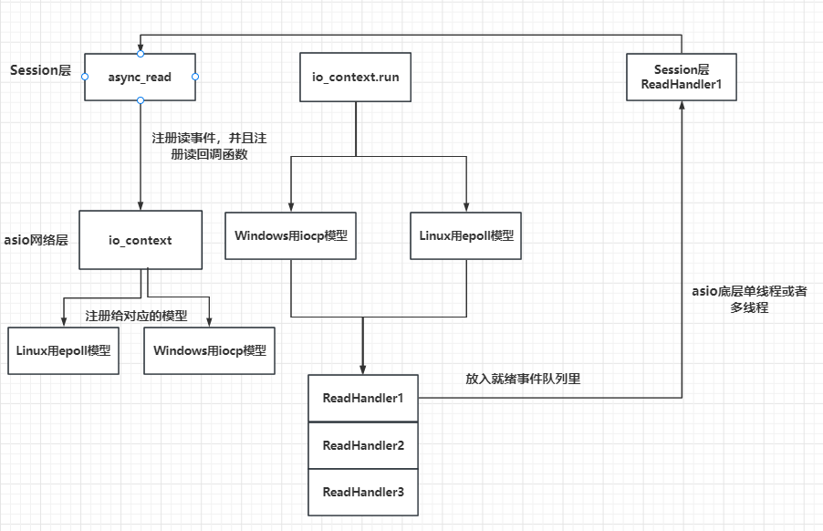

### （2）服务器结构

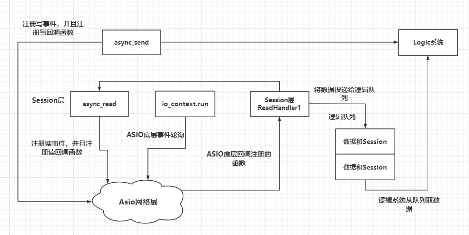

### （3）消息头完善

我们之前的消息头仅包含数据域的长度，但是要进行逻辑处理，就需要传递一个id字段表示要处理的消息id，当然可以不在包头传id字段，将id序列化到消息体也是可以的，但是我们为了便于处理也便于回调逻辑层对应的函数，最好是将id写入包头。
之前我们设计的消息结构是这样的

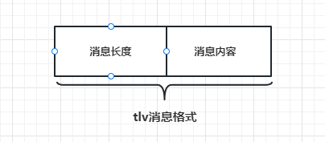

现在将其完善为如下的样子

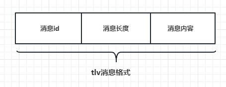

为了减少耦合和歧义，我们重新设计消息节点。
`MsgNode`表示消息节点的基类，头部的消息用这个结构存储。
`RecvNode`表示接收消息的节点。
`SendNode`表示发送消息的节点。

### （4）服务器退出

服务器优雅退出一直是服务器设计必须考虑的一个方向，意在能通过**捕获信号**使服务器安全退出。我们可以通过asio提供的信号机制绑定回调函数即可实现优雅退出。在主函数中我们添加

```cpp
    #include <csignal>
	int main()
    {
        try {
            boost::asio::io_context  io_context;
            boost::asio::signal_set signals(io_context, SIGINT, SIGTERM);
            signals.async_wait([&io_context](auto, auto) {
                io_context.stop();
                });
            CServer s(io_context, 10086);
            io_context.run();
        }
        catch (std::exception& e) {
            std::cerr << "Exception: " << e.what() << endl;
        }
    }
```

利用signal_set 定义了一系列信号合集，并且绑定了一个匿名函数，匿名函数捕获了io_context的引用，并且函数中设置了停止操作，也就是说当捕获到SIGINT,SIGTERM等信号时，会调用`io_context.stop`。

### （5）LogicSystem单例类

```cpp
    typedef  function<void(shared_ptr<CSession>, short msg_id, string msg_data)> FunCallBack;
    class LogicSystem:public Singleton<LogicSystem>
    {
        friend class Singleton<LogicSystem>;
    public:
        ~LogicSystem();
        void PostMsgToQue(shared_ptr < LogicNode> msg);
    private:
        LogicSystem();
        void DealMsg();
        void RegisterCallBacks();
        void HelloWordCallBack(shared_ptr<CSession>, short msg_id, string msg_data);
        std::thread _worker_thread;
        std::queue<shared_ptr<LogicNode>> _msg_que;
        std::mutex _mutex;
        std::condition_variable _consume;
        bool _b_stop;
        std::map<short, FunCallBack> _fun_callbacks;
    };
    LogicSystem::LogicSystem():_b_stop(false){
        RegisterCallBacks();
        _worker_thread = std::thread (&LogicSystem::DealMsg, this);//工作线程的处理函数DealMsg逻辑
    }
    void LogicSystem::DealMsg() {
        for (;;) {
            std::unique_lock<std::mutex> unique_lk(_mutex);
            //判断队列为空则用条件变量阻塞等待，并释放锁
            while (_msg_que.empty() && !_b_stop) {
                _consume.wait(unique_lk);
            }
            //判断是否为关闭状态，把所有逻辑执行完后则退出循环
            if (_b_stop ) {
                while (!_msg_que.empty()) {
                    auto msg_node = _msg_que.front();
                    cout << "recv_msg id  is " << msg_node->_recvnode->_msg_id << endl;
                    auto call_back_iter = _fun_callbacks.find(msg_node->_recvnode->_msg_id);
                    if (call_back_iter == _fun_callbacks.end()) {
                        _msg_que.pop();
                        continue;
                    }
                    call_back_iter->second(msg_node->_session, msg_node->_recvnode->_msg_id,
                        std::string(msg_node->_recvnode->_data, msg_node->_recvnode->_cur_len));
                    _msg_que.pop();
                }
                break;
            }
            //如果没有停服，且说明队列中有数据
            auto msg_node = _msg_que.front();
            cout << "recv_msg id  is " << msg_node->_recvnode->_msg_id << endl;
            auto call_back_iter = _fun_callbacks.find(msg_node->_recvnode->_msg_id);
            if (call_back_iter == _fun_callbacks.end()) {
                _msg_que.pop();
                continue;
            }
            call_back_iter->second(msg_node->_session, msg_node->_recvnode->_msg_id, 
                std::string(msg_node->_recvnode->_data, msg_node->_recvnode->_cur_len));
            _msg_que.pop();
        }
    }
```

1   `FunCallBack`为要注册的回调函数类型，其参数为绘画类智能指针，消息id，以及消息内容。

2   `_msg_que`为逻辑队列

3   `_mutex` 为保证逻辑队列安全的互斥量

4   `_consume`表示消费者条件变量，用来控制当逻辑队列为空时保证线程暂时挂起等待，不要干扰其他线程。

5   `_fun_callbacks`表示回调函数的map，根据id查找对应的逻辑处理函数。

6   `_worker_thread`表示工作线程，用来从逻辑队列中取数据并执行回调函数。

7   `_b_stop`表示收到外部的停止信号，逻辑类要中止工作线程并优雅退出。


1   `DealMsg`逻辑中初始化了一个unique_lock，主要是用来控制队列安全，并且配合条件变量可以随时解锁。lock_guard不具备解锁功能，所以此处用unique_lock。
2    我们判断队列为空，并且不是停止状态，就挂起线程。否则继续执行之后的逻辑，如果_b_stop为true，说明处于停服状态，则将队列中未处理的消息全部处理完然后退出循环。如果_b_stop未false，则说明没有停服，是consumer发送的激活信号激活了线程，则继续取队列中的数据处理。


**条件变量，注意notifiy其他线程之前需要解锁，防止通知后其他线程没有获得锁导致一直阻塞**

## 2. asio多线程模型

前面的设计，我们对asio的使用都是单线程模式，为了提升网络io并发处理的效率，这一次我们设计多线程模式下asio的使用方式。总体来说asio有两个多线程模型，第一个是启动多个线程，每个线程管理一个iocontext。第二种是只启动一个iocontext，被多个线程共享，后面的文章会对比两个模式的区别，这里先介绍第一种模式，多个线程，每个线程管理独立的iocontext服务。

### （1）单线程和多线程对比

先前单线程模型


IOServicePool模型

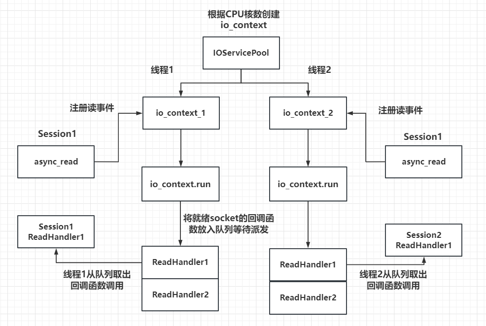

IOServicePool多线程模式特点

1    每一个io_context跑在不同的线程里，所以同一个socket会被注册在同一个io_context里，它的回调函数也会被单独的一个线程回调，那么对于同一个socket，他的回调函数每次触发都是在同一个线程里，就不会有线程安全问题，网络io层面上的并发是线程安全的。

2    但是对于不同的socket，回调函数的触发可能是同一个线程(两个socket被分配到同一个io_context)，也可能不是同一个线程(两个socket被分配到不同的io_context里)。所以如果两个socket对应的上层逻辑处理，如果有交互或者访问共享区，会存在线程安全问题。比如socket1代表玩家1，socket2代表玩家2，玩家1和玩家2在逻辑层存在交互，比如两个玩家都在做工会任务，他们属于同一个工会，工会积分的增加就是共享区的数据，需要保证线程安全。可以通过加锁或者逻辑队列的方式解决安全问题，我们目前采取了后者。

3    多线程相比单线程，极大的提高了并发能力，因为单线程仅有一个io_context服务用来监听读写事件，就绪后回调函数在一个线程里串行调用,  如果一个回调函数的调用时间较长肯定会影响后续的函数调用，毕竟是穿行调用。而采用多线程方式，可以在一定程度上减少前一个逻辑调用影响下一个调用的情况，比如两个socket被部署到不同的iocontext上，但是当两个socket部署到同一个iocontext上时仍然存在调用时间影响的问题。不过我们已经通过逻辑队列的方式将网络线程和逻辑线程解耦合了，不会出现前一个调用时间影响下一个回调触发的问题。


IOThreadPool模型

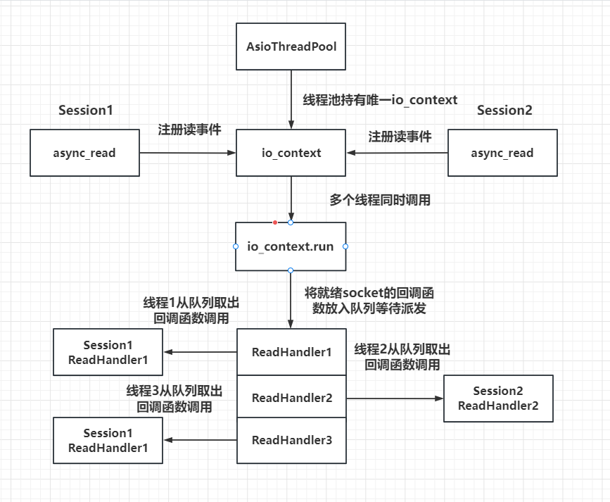

### （2）IOServicePool

IOServicePool本质上是一个线程池，基本功能就是根据构造函数传入的数量创建n个线程和iocontext，然后每个线程跑一个iocontext，这样就可以并发处理不同iocontext读写事件了。

```cpp
    class AsioIOServicePool:public Singleton<AsioIOServicePool>
    {
        friend Singleton<AsioIOServicePool>;
    public:
        using IOService = boost::asio::io_context;
        using Work = boost::asio::io_context::work;
        using WorkPtr = std::unique_ptr<Work>;
        ~AsioIOServicePool();
        AsioIOServicePool(const AsioIOServicePool&) = delete;
        AsioIOServicePool& operator=(const AsioIOServicePool&) = delete;
        // 使用 round-robin 的方式返回一个 io_service
        boost::asio::io_context& GetIOService();
        void Stop();
    private:
        AsioIOServicePool(std::size_t size = std::thread::hardware_concurrency());
        std::vector<IOService> _ioServices;
        std::vector<WorkPtr> _works;
        std::vector<std::thread> _threads;
        std::size_t   _nextIOService;
    };

    AsioIOServicePool::AsioIOServicePool(std::size_t size):_ioServices(size),
    _works(size), _nextIOService(0){
        for (std::size_t i = 0; i < size; ++i) {
            _works[i] = std::unique_ptr<Work>(new Work(_ioServices[i]));//匿名对象的=是move
        }
        //遍历多个ioservice，创建多个线程，每个线程内部启动ioservice
        for (std::size_t i = 0; i < _ioServices.size(); ++i) {
            _threads.emplace_back([this, i]() { // 不使用push_back，加move，而是emplace_back内部直接构造高效
                _ioServices[i].run();
                });
        }
    }

    boost::asio::io_context& AsioIOServicePool::GetIOService() {
        auto& service = _ioServices[_nextIOService++];
        if (_nextIOService == _ioServices.size()) {
            _nextIOService = 0;
        }
        return service;
    }
    void AsioIOServicePool::Stop(){
        for (auto& work : _works) {
            work.reset();//智能指针至空释放内存
        }
        for (auto& t : _threads) {
            t.join(); //需要让子线程执行完成
        }
    }
```

1   `_ioServices`是一个IOService的vector变量，用来存储初始化的多个IOService。

2   `WorkPtr`是`boost::asio::io_context::work`类型的unique指针。
在实际使用中，我们通常会将一些异步操作提交给`io_context`进行处理，然后该操作会被异步执行，而不会立即返回结果。如果没有其他任务需要执行，那么`io_context`就会停止工作，导致所有正在进行的异步操作都被取消。这时，我们需要使用`boost::asio::io_context::work`对象来防止`io_context`停止工作。

`boost::asio::io_context::work`的作用是持有一个指向`io_context`的引用，并通过创建一个“工作”项来保证`io_context`不会停止工作，直到work对象被销毁或者调用`reset()`方法为止。当所有异步操作完成后，程序可以使用`work.reset()`方法来释放`io_context`，从而让其正常退出。

3   `_threads`是一个线程vector,管理我们开辟的所有线程。

4   `_nextIOService`是一个轮询索引，我们用最简单的轮询算法为每个新创建的连接分配io_context.

5   因为IOServicePool不允许被copy构造，所以我们将其拷贝构造和拷贝复制函数置为delete


我们根据`_nextIOService`作为索引，轮询获取`io_context&`。

同样我们要实现Stop函数，控制`AsioIOServicePool`停止的行为。因为我们要保证每个线程安全退出后再让`AsioIOServicePool`停止。

### （3）IOThreadPool

一个IOServicePool开启n个线程和n个iocontext，每个线程内独立运行iocontext,  各个iocontext监听各自绑定的socket是否就绪，如果就绪就在各自线程里触发回调函数。为避免线程安全问题，我们将网络数据封装为逻辑包投递给逻辑系统，逻辑系统有一个单独线程处理，这样将网络IO和逻辑处理解耦合，极大的提高了服务器IO层面的吞吐率。这一次介绍的另一种多线程模式IOThreadPool，我们只初始化一个iocontext用来监听服务器的读写事件，包括新连接到来的监听也用这个iocontext。只是我们让`iocontext.run`在多个线程中调用，这样回调函数就会被不同的线程触发，从这个角度看回调函数被并发调用了。

```cpp
    #include <boost/asio.hpp>
    #include "Singleton.h"
    class AsioThreadPool:public Singleton<AsioThreadPool>
    {
    public:
        friend class Singleton<AsioThreadPool>;
        ~AsioThreadPool(){}
        AsioThreadPool& operator=(const AsioThreadPool&) = delete;
        AsioThreadPool(const AsioThreadPool&) = delete;
        boost::asio::io_context& GetIOService();
        void Stop();
    private:
        AsioThreadPool(int threadNum = std::thread::hardware_concurrency());
        boost::asio::io_context _service;
        std::unique_ptr<boost::asio::io_context::work> _work;
        std::vector<std::thread> _threads;
    };

AsioThreadPool::AsioThreadPool(int threadNum ):_work(new boost::asio::io_context::work(_service)){
    for (int i = 0; i < threadNum; ++i) {
        _threads.emplace_back([this]() {
            _service.run();
            });
    }
}
boost::asio::io_context& AsioThreadPool::GetIOService() {
    return _service;
}
void AsioThreadPool::Stop() {
    _work.reset();
    for (auto& t : _threads) {
        t.join();
    }
}
```

构造函数中实现了一个线程池，线程池里每个线程都会运行`_service.run`函数，`_service.run`函数内部就是从iocp或者epoll获取就绪描述符和绑定的回调函数，进而调用回调函数，因为回调函数是在不同的线程里调用的，所以会存在不同的线程调用同一个socket的回调函数的情况。
`_service.run` 内部在Linux环境下调用的是`epoll_wait`返回所有就绪的描述符列表，在windows上会循环调用`GetQueuedCompletionStatus`函数返回就绪的描述符，二者原理类似，进而通过描述符找到对应的注册的回调函数，然后调用回调函数。
比如iocp的流程是这样的

```
    IOCP的使用主要分为以下几步：
    1 创建完成端口(iocp)对象
    2 创建一个或多个工作线程，在完成端口上执行并处理投递到完成端口上的I/O请求
    3 Socket关联iocp对象，在Socket上投递网络事件
    4 工作线程调用GetQueuedCompletionStatus函数获取完成通知封包，取得事件信息并进行处理
```

epoll的流程是这样的

```
    1 调用epoll_creat在内核中创建一张epoll表
    2 开辟一片包含n个epoll_event大小的连续空间
    3 将要监听的socket注册到epoll表里
    4 调用epoll_wait，传入之前我们开辟的连续空间，epoll_wait返回就绪的epoll_event列表，epoll会将就绪的socket信息写入我们之前开辟的连续空间
```

#### 隐患（并行造成的问题）

IOThreadPool模式有一个隐患，同一个socket的就绪后，触发的回调函数可能在不同的线程里，比如第一次是在线程1，第二次是在线程3，如果这两次触发间隔时间不大，那么很可能出现不同线程并发访问数据的情况，比如在处理读事件时，第一次回调触发后我们从socket的接收缓冲区读数据出来，第二次回调触发,还是从socket的接收缓冲区读数据，就会造成两个线程同时从socket中读数据的情况，会造成数据混乱。

#### 利用strand改进（串行）

对于多线程触发回调函数的情况，我们可以利用asio提供的串行类strand封装一下，这样就可以被串行调用了，其基本原理就是在线程各自调用函数时取消了直接调用的方式，而是利用一个strand类型的对象将要调用的函数投递到strand管理的队列中，再由一个统一的线程调用回调函数，调用是串行的，解决了线程并发带来的安全问题。

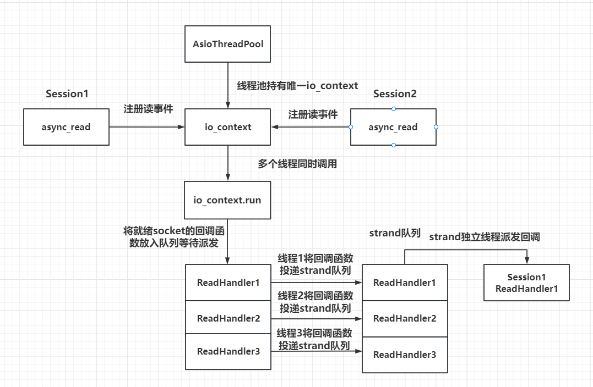

图中当socket就绪后并不是由多个线程调用每个socket注册的回调函数，而是将回调函数投递给strand管理的队列，再由strand统一调度派发。

为了让回调函数被派发到strand的队列，我们只需要在注册回调函数时加一层strand的包装即可。

在CSession类中添加一个成员变量

```
strand<io_context::executor_type> _strand;
```

CSession的构造函数

```
    CSession::CSession(boost::asio::io_context& io_context, CServer* server):
        _socket(io_context), _server(server), _b_close(false),
        _b_head_parse(false), _strand(io_context.get_executor()){
        boost::uuids::uuid  a_uuid = boost::uuids::random_generator()();
        _uuid = boost::uuids::to_string(a_uuid);
        _recv_head_node = make_shared<MsgNode>(HEAD_TOTAL_LEN);
    }
```

可以看到_strand的初始化是放在初始化列表里，利用`io_context.get_executor()`返回的执行器构造strand。

因为在asio中无论iocontext还是strand，底层都是通过executor调度的，我们将他理解为调度器就可以了，如果多个iocontext和strand的调度器是一个，那他们的消息派发统一由这个调度器执行。

我们利用iocontext的调度器构造strand，这样他们统一由一个调度器管理。在绑定回调函数的调度器时，我们选择strand绑定即可。

比如我们在Start函数里添加绑定 ，将回调函数的调用者绑定为`_strand`

```
    void CSession::Start(){
        ::memset(_data, 0, MAX_LENGTH);
        _socket.async_read_some(boost::asio::buffer(_data, MAX_LENGTH),
            boost::asio::bind_executor(_strand, std::bind(&CSession::HandleRead, this,
                std::placeholders::_1, std::placeholders::_2, SharedSelf())));
    }
```

同样的道理，在所有收发的地方，都将调度器绑定为`_strand`， 比如发送部分我们需要修改为如下

```
        auto& msgnode = _send_que.front();
        boost::asio::async_write(_socket, boost::asio::buffer(msgnode->_data, msgnode->_total_len), 
        boost::asio::bind_executor(_strand, std::bind(&CSession::HandleWrite, this, std::placeholders::_1, SharedSelf()))
            );
```

### （4）协程

。利用协程实现并发程序有两个好处
1   将回调函数改写为顺序调用，提高开发效率。
2   协程调度比线程调度更轻量化，因为协程是运行在用户空间的，线程切换需要在用户空间和内核空间切换。

#### 协程案例

```cpp
#include <boost/asio/co_spawn.hpp>
#include <boost/asio/detached.hpp>
#include <boost/asio/io_context.hpp>
#include <boost/asio/ip/tcp.hpp>
#include <boost/asio/signal_set.hpp>
#include <boost/asio/write.hpp>
#include <cstdio>
using boost::asio::ip::tcp;
using boost::asio::awaitable;
using boost::asio::co_spawn;
using boost::asio::detached;
using boost::asio::use_awaitable;
namespace this_coro = boost::asio::this_coro;
#if defined(BOOST_ASIO_ENABLE_HANDLER_TRACKING)
# define use_awaitable \
  boost::asio::use_awaitable_t(__FILE__, __LINE__, __PRETTY_FUNCTION__)
#endif
awaitable<void> echo(tcp::socket socket)
{
    try
    {
        char data[1024];
        for (;;)
        {
            std::size_t n = co_await socket.async_read_some(boost::asio::buffer(data), use_awaitable);
            co_await async_write(socket, boost::asio::buffer(data, n), use_awaitable);
        }
    }
    catch (std::exception& e)
    {
        std::printf("echo Exception: %s\n", e.what());
    }
}
awaitable<void> listener()
{
    auto executor = co_await this_coro::executor;
    tcp::acceptor acceptor(executor, { tcp::v4(), 10086 });
    for (;;)
    {
        tcp::socket socket = co_await acceptor.async_accept(use_awaitable);
        co_spawn(executor, echo(std::move(socket)), detached);
    }
}
int main()
{
    try
    {
        boost::asio::io_context io_context(1);
        boost::asio::signal_set signals(io_context, SIGINT, SIGTERM);
        signals.async_wait([&](auto, auto) { io_context.stop(); });
        co_spawn(io_context, listener(), detached);
        io_context.run();
    }
    catch (std::exception& e)
    {
        std::printf("Exception: %s\n", e.what());
    }
}
```

1   我们用awaitable<void>声明了一个函数，那么这个函数就**变为可等待的函数**了，比如`listener`被添加`awaitable<void>`之后，就可以被协程调用和等待了。
2   `co_spawn`表示启动一个协程，参数分别为调度器，执行的函数，以及启动方式,  比如我们启动了一个协程，**deatched表示将协程对象分离出来**，这种启动方式**可以启动多个协程**，他们都**是独立的**，如何**调度取决于调度器**，在用户的感知上更像是线程调度的模式，**类似于并发运行，其实底层都是串行**的。

```
co_spawn(io_context, listener(), detached);
```

我们启动了一个协程，执行listener中的逻辑，listener内部co_await 等待 acceptor接收连接，如果没有连接到来则挂起协程。执行之后的`io_context.run()`逻辑。所以协程实际上是在一个线程中串行调度的，只是感知上像是并发而已。
3    当acceptor接收到连接后，继续调用co_spawn启动一个协程，用来执行echo逻辑。echo逻辑里也是通过co_wait的方式接收和发送数据的，如果对端不发数据，执行echo的协程就会挂起，另一个协程启动，继续接收新的连接。当没有连接到来，接收新连接的协程挂起，如果所有协程都挂起，则等待新的就绪事件(对端发数据，或者新连接)到来唤醒。

## 3. http服务器

实现和TCP服务器类似，只是消息不一样

### HTTP包头信息

一个标准的HTTP报文头通常由请求头和响应头两部分组成。

#### HTTP 请求头

HTTP请求头包括以下字段：

- **Request-line**：包含用于描述请求类型、要访问的资源以及所使用的HTTP版本的信息。
- **Host**：指定被请求资源的主机名或IP地址和端口号。
- **Accept**：指定客户端能够接收的媒体类型列表，用逗号分隔，例如 text/plain, text/html。
- **User-Agent**：客户端使用的浏览器类型和版本号，供服务器统计用户代理信息。
- **Cookie**：如果请求中包含cookie信息，则通过这个字段将cookie信息发送给Web服务器。
- **Connection**：表示是否需要持久连接（keep-alive）。

比如下面就是一个实际应用

```
    GET /index.html HTTP/1.1
    Host: www.example.com
    Accept: text/html, application/xhtml+xml, */*
    User-Agent: Mozilla/5.0 (Windows NT 10.0; Win64; x64; rv:123.0) Gecko/20100101 Firefox/123.0
    Cookie: sessionid=abcdefg1234567
    Connection: keep-alive
```

上述请求头包括了以下字段：

- **Request-line**：指定使用GET方法请求/index.html资源，并使用HTTP/1.1协议版本。
- **Host**：指定被请求资源所在主机名或IP地址和端口号。
- **Accept**：客户端期望接收的媒体类型列表，本例中指定了text/html、application/xhtml+xml和任意类型的文件（*/*）。
- **User-Agent**：客户端浏览器类型和版本号。
- **Cookie**：客户端发送给服务器的cookie信息。
- **Connection**：客户端请求后是否需要保持长连接。

#### HTTP 响应头

HTTP响应头包括以下字段：

- **Status-line**：包含协议版本、状态码和状态消息。
- **Content-Type**：响应体的MIME类型。
- **Content-Length**：响应体的字节数。
- **Set-Cookie**：服务器向客户端发送cookie信息时使用该字段。
- **Server**：服务器类型和版本号。
- **Connection**：表示是否需要保持长连接（keep-alive）。

在实际的HTTP报文头中，还可以包含其他可选字段。
如下是一个http响应头的示例

```
    HTTP/1.1 200 OK
    Content-Type: text/html; charset=UTF-8
    Content-Length: 1024
    Set-Cookie: sessionid=abcdefg1234567; HttpOnly; Path=/
    Server: Apache/2.2.32 (Unix) mod_ssl/2.2.32 OpenSSL/1.0.1e-fips mod_bwlimited/1.4
    Connection: keep-alive
```

上述响应头包括了以下字段：

- **Status-line**：指定HTTP协议版本、状态码和状态消息。
- **Content-Type**：指定响应体的MIME类型及字符编码格式。
- **Content-Length**：指定响应体的字节数。
- **Set-Cookie**：服务器向客户端发送cookie信息时使用该字段。
- **Server**：服务器类型和版本号。
- **Connection**：服务器是否需要保持长连接。

#### 4. websocket


http是短连接的协议，get和post请求服务器，建立请求发送连接后就断开了，服务器想要通知客户端消息就不行，如果采取不断get和post请求协议直到获取到消息，那么这样网络会拥塞，服务器性能下降。

http升级http1.1，即websocket，它是一个长连接的协议，自动包含了解包处理。

# 第六章 grpc

## （1）介绍安装

详细安装https://llfc.club/articlepage?id=2QSEHcC1he1RgiewYG93ilaAMiY or使用vcpkg安装

grpc用于**内部服务**的通信，简言之后台网络中多个服务器通信的方式。如果是客户端和服务器通信最好使用并发性能好一点的网络库，同时也能支持根据自己的需求实现并发逻辑。如果客户端较少，则也可以考虑用grpc的方式通信。

* gRPC是Google开发的一种高性能、开源的远程过程调用（RPC）框架。它可以让客户端应用程序像调用本地服务一样轻松地调用远程服务，并提供了多种语言的支持，如C++、Java、Python、Go等。

* gRPC使用Protocol  Buffers作为数据格式，可以在不同的平台上进行应用程序之间的通信，支持多种编程语言和多种操作系统。它采用基于HTTP/2的协议，提供了高效、快速且可扩展的远程调用功能，并带有负载均衡、认证、监控等功能，方便用户管理和维护分布式系统。

* gRPC可用于构建各种类型的分布式应用程序，如微服务、云原生应用程序、大规模Web应用程序、移动应用程序等场景。由于其高性能和可扩展性，越来越多的企业和组织开始采用gRPC来构建他们的应用程序和服务。

## （2）.proto文件

https://llfc.club/articlepage?id=2QYdExDcUDazjD6ZKNjs8KLcyAp

```
    syntax = "proto3";
    package hello;
    service Greeter {
      rpc SayHello (HelloRequest) returns (HelloReply) {}
    }
    message HelloRequest {
      string message = 1;
    }
    message HelloReply {
      string message = 1;
    }
```


```
    D:\cppsoft\grpc\visualpro\third_party\protobuf\Debug\protoc.exe  -I="." --grpc_out="." --plugin=protoc-gen-grpc="D:\cppsoft\grpc\visualpro\Debug\grpc_cpp_plugin.exe" "demo.proto"
```

上述命令会生成demo.grpc.pb.h和demo.grpc.pb.cc文件。

`D:\cppsoft\grpc\visualpro\third_party\protobuf\Debug\protoc.exe`表示protoc.exe所在的路径，你可以将其放在指定目录并配置环境变量，直接使用protoc.exe就行了。

`-I="."` 指定 `demo.proto`所在的路径为当前路径。

`--grpc_out="."` 表示生成的pb.h和pb.cc文件的输出目录。

`--plugin=protoc-gen-grpc="D:\cppsoft\grpc\visualpro\Debug\grpc_cpp_plugin.exe"`表示要使用的插件为cpp插件，也就是生成cpp类的头文件和源文件。

接下来我们生成grpc类需要的pb文件，因为要序列化数据。

```
D:\cppsoft\grpc\visualpro\third_party\protobuf\Debug\protoc.exe --cpp_out=. "demo.proto"
```

上述命令会生成demo.pb.h和demo.pb.cc文件。
